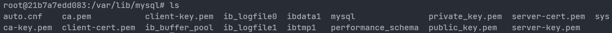

# 部署MySQL

## 获取配置目录

- `/etc/mysql/`是docker中配置文件的文件夹
- `/var/lib/mysql/`是docker中数据的文件夹
- `/var/log/mysql`是docker中mysql日志的文件夹

```mysql
# 下载镜像
docker pull mysql:5.7
# 查看
docker images | grep mysql
# 创建
docker run --name=mysql -p 3307:3306 -d -e MYSQL_ROOT_PASSWORD=1 mysql:5.7
```





## 创建映射目录

- 配置目录：`/home/dog/yinke/mysql/conf`
- 数据目录：`/home/dog/yinke/mysql/data`
- 日志目录：`/home/dog/yinke/mysql/log`

在`conf`目录下创建`my.cnf`配置文件

```bash
[mysqld]
user=mysql
character-set-server=utf8
default_authentication_plugin=mysql_native_password
secure_file_priv=/var/lib/mysql
expire_logs_days=7
sql_mode=STRICT_TRANS_TABLES,NO_ZERO_IN_DATE,NO_ZERO_DATE,ERROR_FOR_DIVISION_BY_ZERO,NO_ENGINE_SUBSTITUTION
max_connections=1000

[client]
default-character-set=utf8

[mysql]
default-character-set=utf8
```


## 创建mysql容器

- `--restart=always`： Docker重启时容器会自动启动
- `--privileged=true`：容器内的root拥有真正root权限，否则容器内root只是外部普通用户权限


```bash
# 删除上一步创建的mysql容器
docker kill 21b7a7edd083
docker rm 21b7a7edd083

-v /home/mysql/conf.d:/etc/mysql/conf.d 
-v /home/mysql/my.cnf:/etc/mysql/my.cnf -p 33306:3306 --name my-mysql -e MYSQL_ROOT_PASSWORD=123456 mysql:5.7


# 运行mysql容器
docker run --restart=always --privileged=true -d -p 3306:3306 --name inkmysql -v /home/dog/yinke/mysql/conf/my.cnf:/etc/mysql/my.cnf -v /home/dog/yinke/mysql/data:/var/lib/mysql -v /home/dog/yinke/mysql/log:/var/log/mysql -e MYSQL_ROOT_PASSWORD=1 mysql:5.7
```


## 查看mysql容器ip

```bash
# 在显示信息里面找
# "NetworkSettings"的"IPAddress"
docker inspect

# -f直接指定查看ip
docker inspect --format='{{.NetworkSettings.IPAddress}}' a9757d991f3c
```


## 启动mysql

- `-u`后面可以省略空格
- `-p`指定密码时中间不能有空格

> mysql的第一个非选项参数被当作默认数据库的名称，如果没有这样的选项MySQL就不会选择默认数据库
>
> 所以说在命令行中，mysql密码和`-p`或者`--password`参数之间有空格的话，mysql会认为输入的是登录mysql后自动选择的数据库而不是密码

```bash
# 进入mysql容器
docker exec -it a9757d991f3c /bin/bash

# 直接用密码登录
mysql -uroot -p1

# 交互输入密码登录
mysql -u root -p
```


## 配置远程连接

要想在外部连接mysql容器进行远程管理，就需要配置容器里的mysql的root账户的主机host

- 将它修改成通配符`％`，这样就可以让任意主机连接mysql容器

> 一般mysql中默认的`host`是`localhost`，可以以`root`用户登录mysql
>
> mysql使用mysql数据库中的user表来管理权限，修改user表就可以修改权限（只有root账号可以修改）

```mysql
# 查看数据库
show databases;

# 选择数据库
use mysql;

# 查看数据库的表
show tables;

# 查看user表信息
show table status like 'user'\G;

# 查看user表的所有字段信息
show full columns from user;

# 查看Host字段的信息
SELECT Host FROM user;

# 修改配置
update user set host ='％'where user ='root'

# 允许任何主机使用root账号和root的密码连接到mysql服务器
# mysql8之后要求先创建用户再授权，而不能在授权时创建用户
GRANT ALL PRIVILEGES ON *.* TO 'root'@'%' IDENTIFIED BY '1' WITH GRANT OPTION;

# 刷新
flush privileges;
```


## 导入数据

拷贝sql文件到mysql容器中

```bash
#docker cp 宿主机文件路径 容器id:拷贝到容器里面的绝对路径
docker cp /home/dog/yinke/mysql/CrashCourse/create.sql a9757d991f3c:/root/course
docker cp /home/dog/yinke/mysql/CrashCourse/populate.sql a9757d991f3c:/root/course
```

## 创建数据库

```mysql
# 创建数据库
CREATE DATABASE course；
# 切换
use course;
# 提示Query OK，表示sql文件已经被成功执行
source /root/course/create.sql;
source /root/course/populate.sql;
```

