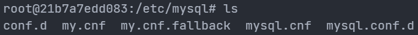
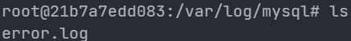
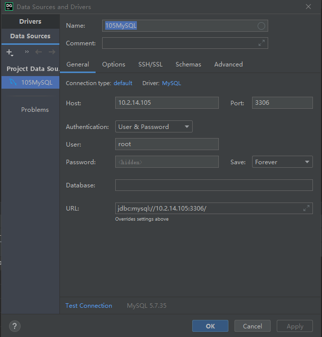
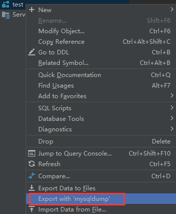
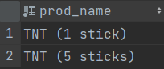
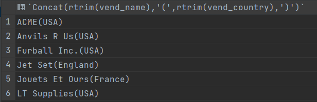
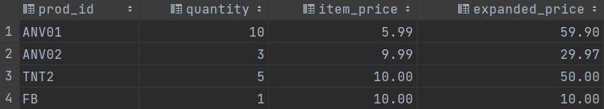
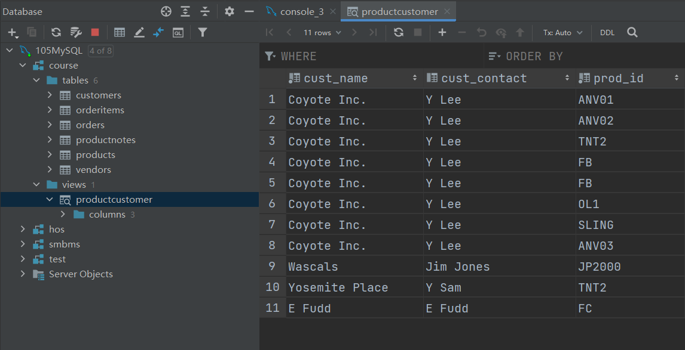

# Ubuntu部署MySQL

```bash
# 安装mysql，需为默认root用户指定密码
# 安装完mysql-server后自带mysql-client
sudo apt install mysql-server

# 检查下数据库当前状态，running表示正在运行中
sudo service mysql status

# 登录MySQL
mysql -uroot -p


# 重启mysql服务
sudo systemctl restart mysql.service
```


# docker部署MySQL

## 获取配置目录

- `/etc/mysql/`是docker中配置文件的文件夹
- `/var/lib/mysql/`是docker中数据的文件夹
- `/var/log/mysql`是docker中mysql日志的文件夹

```mysql
# 下载镜像
docker pull mysql:5.7
# 查看
docker images | grep mysql
# 创建
docker run --name=mysql -p 3307:3306 -d -e MYSQL_ROOT_PASSWORD=1 mysql:5.7
```

 


 


## 创建映射目录

- 配置目录：`/home/dog/yinke/mysql/conf`
- 数据目录：`/home/dog/yinke/mysql/data`
- 日志目录：`/home/dog/yinke/mysql/log`

在`conf`目录下创建`my.cnf`配置文件

```bash
[mysqld]
user=mysql
character-set-server=utf8
default_authentication_plugin=mysql_native_password
secure_file_priv=/var/lib/mysql
expire_logs_days=7
sql_mode=STRICT_TRANS_TABLES,NO_ZERO_IN_DATE,NO_ZERO_DATE,ERROR_FOR_DIVISION_BY_ZERO,NO_ENGINE_SUBSTITUTION
max_connections=1000

[client]
default-character-set=utf8

[mysql]
default-character-set=utf8
```


## 创建MySQL容器

- `--restart=always`： Docker重启时容器会自动启动
- `--privileged=true`：容器内的root拥有真正root权限，否则容器内root只是外部普通用户权限


```bash
# 删除上一步创建的mysql容器
docker kill 21b7a7edd083
docker rm 21b7a7edd083

# 运行mysql容器
docker run --restart=always --privileged=true -d -p 3305:3306 --name inkmysql -v /home/dog/yinke/mysql/conf/my.cnf:/etc/mysql/my.cnf -v /home/dog/yinke/mysql/data:/var/lib/mysql -v /home/dog/yinke/mysql/log:/var/log/mysql -e MYSQL_ROOT_PASSWORD=1 mysql:5.7
```


## 查看MySQL容器ip

172.17.0.9

```bash
# 在显示信息里面找
# "NetworkSettings"的"IPAddress"
docker inspect

# -f直接指定查看ip
docker inspect --format='{{.NetworkSettings.IPAddress}}' a9757d991f3c
```


## 启动MySQL数据库

- `-u`后面可以省略空格
- `-p`指定密码时中间不能有空格

> MySQL的第一个非选项参数被当作默认数据库的名称，如果没有这样的选项MySQL就不会选择默认数据库
>
> 所以说在命令行中，root的密码和`-p`或者`--password`参数之间有空格的话，MySQL会认为输入的是登录mysql后自动选择的数据库而不是密码

```bash
# 进入mysql容器
docker exec -it a9757d991f3c /bin/bash

# 直接用密码登录
mysql -uroot -p1

# 交互输入密码登录
mysql -u root -p
```


## 配置远程连接

要想在外部连接MySQL容器进行远程管理，就需要配置容器里的MySQL的root账户的主机host

- 将它修改成通配符`％`，这样就可以让任意主机连接MySQL容器

> 一般MySQL中默认的`host`是`localhost`，可以以`root`用户登录MySQL
>
> MySQL使用mysql数据库中的user表来管理权限，修改user表就可以修改权限（只有root账号可以修改）

```mysql
# 查看数据库
show databases;

# 选择数据库
use mysql;

# 查看数据库的表
show tables;

# 查看user表信息
show table status like 'user'\G;

# 查看user表的所有字段信息
show full columns from user;

# 查看Host字段的信息
SELECT Host FROM user;

# 查看2个字段信息
select user, host from user;

# 修改配置
update user set host ='％'where user ='root'

# 允许任何主机使用root账号和root的密码连接到mysql服务器
# mysql8之后要求先创建用户再授权，而不能在授权时创建用户
GRANT ALL PRIVILEGES ON *.* TO 'root'@'%' IDENTIFIED BY '1' WITH GRANT OPTION;

# 刷新
flush privileges;
```


## 导入数据

拷贝sql文件到MySQL容器中

```bash
#docker cp 宿主机文件路径 容器id:拷贝到容器里面的绝对路径
docker cp /home/dog/yinke/mysql/CrashCourse/create.sql a9757d991f3c:/root/course
docker cp /home/dog/yinke/mysql/CrashCourse/populate.sql a9757d991f3c:/root/course
```

## 创建数据库

DATABASE（数据库）或者SCHEMA（模式）都可以

> `CREATE Schema databaseName;`
>
> `show Schemas;`

```mysql
# 创建数据库
CREATE DATABASE course；
# 切换数据库
use course;
# 提示Query OK，表示sql文件已经被成功执行
source /root/course/create.sql;
source /root/course/populate.sql;
```

使用命令创建

```bash
mysql -uroot -p1 course < /root/course/create.sql
```


## 导出数据

使用`mysqldump`命令导出数据库文件

```bash
# 进入容器，进入mysql
docker exec -it a9757d991f3c /bin/bash

# 导出所有的表结构和数据
mysqldump test -uroot -p1 > /root/dump/test.sql

# 导出某个数据库所有表结构
# -d，--no-data 导出结构,不导出数据
mysqldump -d test -uroot -p1 > /root/dump/test1.sql

# 导出某个数据库所有表数据
# -t，--no-create-info 导出数据,不导出结构
mysqldump -t test -uroot -p1 > /root/dump/test2.sql

# 导出某个数据库特定表和数据（
# 数据和表结构
mysqldump test -uroot -p1 Customer > /root/dump/Customer.sql
```


# DataGrip

## 连接数据库

输入MySQL服务器的url，用户和密码

 

## 打开控制台

右键数据库或表，打开控制台，就可以写sql

 

## 创建数据库

右键数据库-`New-Schema`

## 导入sql文件

1. 将sql文件使用Datagrip打开 
2. 右键选择`Run`
3.  选择创建的数据库运行


## 执行sql

- 打开sql文件运行
- 在控制台（console）运行（
  - 快捷键：`ctrl+enter`

> 可以运行sql文件作为一个整体


## 导出表和数据

[DataGrip 数据导出与导入](https://www.meaoo.cn/2018/04/03/20180403001.html)

右键数据库或表，选择`Export with 'mysqldump'`

- 使用MySql的`mysqldump`组件进行数据导出
- 该方法导出的SQL文件，可以选择是否包含数据或者是只导出数据结构

> `Export data to Files`是导出各种单个文件，比如，SQL，HTML，TSV，CSV等文件，是在对某个表进行操作的时候使用的

 


# 基本概念

## DBMS数据库管理系统

MySQL是数据库软件（DBMS）

数据库（database）是通过数据库软件创建和操作的容器，使用DBMS访问数据库

## table表

特定类型数据的结构化清单

- 数据库中表的名字是唯一的
- 表具有一些特性，描述表的这组信息就**模式**

> 模式用来描述数据库中特定的表以及整个数据库（和其中表的关系）

### col列

表中的一个字段

每个col都有相应的数据类型（datatype）

### row行

表中的一个记录

表中数据按行存储

> 相当于数据库记录（record）

### primary key主键

表中一列（或一组列），其值能唯一区分表中的每一行，这个列（或一组列）成为主键

- 每个表应该都具有一个主键
- 表中任意列都可以作为主键，主要满足
  - 任意两行都具有不同的值
  - 每个行都具有一个值

> 主键不允许`NULL`值

### foreign key外键

表中一列（或一组列），它包含另一个表的主键

## schema模式

关于数据库和表的布局及特性的信息

通常模式可以作为数据库的同义词

## SQL

structed query language结构化查询语句

- sql语句不区分大小写
- sql语句所有空格都被忽略
- sql语句可以分成多行书写，最后以分号`;`结束
- 多条sql语句必须以分号`;`分隔

> MySQL不需要在单条sql语句后加分号`;`，但是mysql命令行上必须加分号`;`

### select子句顺序

`select`

1. `from`
2. `where`
3. `group by`
4. `having`
5. `order by`
6. `limit`

### `连接数据库`

1. 查看数据库
   1. `show databases;`
2. 连接数据库
   1. `use databaseName;`

### auto_increment自动增量

某些表的列需要唯一值，MySQL可以自动为每一行分配一个可用值

> 需要create创建表时把它作为表定义的组成部分

### DESCRIBE

`show columns from`的快捷方式

`describe customers` = `show columns from customers`


### 子句

SQL语句由子句构成

子句通常由关键字和数据组成，如`select`的`from`子句


# 检索数据

- `select`

## 检索单列

查询语句如果未过滤或排序，则返回结果的顺序无意义

`select prod_name from products;`

## 检索多列

col之间用逗号`,`隔开

`select prod_id,prod_name,prod_price from products;`


## 检索所有列

使用通配符`*`

- 返回所有col的顺序无意义
- 可以检索出名字未知的col

`select * from table;`

## 检索去重

`distinct`

- 只返回不同的值
- 必须直接放在col的前面
- 会应用于后面的所有col

`select distinct vend_id from products;`

> distinct：截然不同的; 有区别的; 不同种类的; （清晰的; 清楚的; 明白的; 明显的; 确定无疑的; 确实的; 确切的）


## 限制数目

`limit`

- 限制返回不多于n col
- 指定返回从n开始的m col（闭区间[n,n+m])
- 必须在`order by`子句之后

`select prod_name from products limit 10;`

`select prod_name from products limit 5,5;`

> 检索结果从col 0开始
>

## 完全限制

同时使用database，table和col指定检索

`select products.prod_name from products;`

`select products.prod_name from course.products;`


# 排序检索数据

- `select`
- `order by`

检索返回的col不是纯粹的随机顺序，一般是将以它在底层table中出现的顺序，可能是数据最开始添加到table中的顺序，但是数据经过更新或者删除，顺序就会受到MySQL重用回收空间的影响

> 关系型数据库设计理论认为，如果不明确规定排序，就不应该假定检索出的数据的顺序有序

## 排序数据

`order by`子句

- 默认以字母升序排序（`ASC`）
- 也可以用非检索的列排序
- 必须在`from`子句之后

`select prod_name from products order by prod_name;`

## 按多个列排序

指定col，用逗号`,`分开

- 排序按指定的col执行
- 只有第一个col排序具有相同的值的情况才会按照第二个col进行排序
- 如果第一个col排序没有相同的，则不会再根据第二个col进行排序

`select prod_price,prod_name from products order by prod_price,prod_name;`

## 指定排序方向

`desc`

- 按降序排列
- 只应用于直接位于其前面的col
- 不直接位于`desc`前面的col仍默认按升序排列
- 如果要在多个col上进行降序排序，必须每一个都指定`desc`

`select prod_id,prod_price,prod_name from products order by prod_price desc;`

`select prod_id,prod_price,prod_name from products order by prod_price desc,prod_name;`

> 可以用`ASC`指定升序，但默认就是升序
>
> 可以结合`limit`检索最值


# 过滤数据

- `select`

- `where`

通常根据指定的搜索条件（search criteria）提取table的子集

> 搜索条件也称为过滤条件（filter condition）

## 搜索条件

`where`

- 操作符：`>`,`<`,`>=`,`<=`,`!=`,`<>`,`between`

- 在`from`子句之后
- 在`order by`子句之前
- 不区分大小写

`select prod_name,prod_price from products where prod_price = 2.5;`

`select prod_name,prod_price from products where prod_name = 'safe';`

`select prod_name,prod_price from products where prod_price <= 10;`

> 相等测试：检索一个col是否有指定的值
>
> `单引号`用来限定字符串

## 不匹配检查

`select prod_name,prod_price from products where prod_price <> 10;`

`select prod_name,prod_price from products where prod_price != 10;`

## 范围值检查

`between`

- 指定范围的低端值和高端值
- 低端值和高端值用`and`连接

`select prod_name,prod_price from products where prod_price between 5 and 10;`

## 空值检查

`is null`子句

- 一个col不包含值时，称为包含空值`null`
- `null`指无值（no value），和0,空字符串，空格不同
- `null`值不会包含在不匹配的返回数据中（数据库不知道是否匹配）

`select prod_name,prod_price from products where prod_price is null;`

`select cust_id from customers where cust_email is null;`

## 组合过滤

通过逻辑操作符（logical operator）连结多个`where`子句

- `and`
- `or`
- `in`
- `not`

`and`优先级大于`or`，需要使用圆括号`()`来设置计算次序

> `where`子句可以包含任意的`and`和`or`操作符

### and操作符

检索匹配多个条件

`select prod_id,prod_price,prod_name from products where vend_id = 1003 and prod_price <= 10;`

### or操作符

检索匹配任一条件

`select prod_price,prod_name from products where vend_id = 1003 or vend_id = 1002;`

### in操作符

`in`

- 指定条件范围（范围中的每个条件都可以进行匹配）
- 实现功能和`or`相同，但是有很多优点
  - 使用长的合法选项清单时，`in`的语法更清楚直观
  - `in`的计算次序更容易管理
  - `in`一般比`or`快
  - `in`可以包含其他`select`子句

`select prod_name,prod_price from products where vend_id in (1002,1003) order by prod_name;`

`select prod_name,prod_price from products where vend_id = 1002 or vend_id = 1003 order by prod_name;`

### not操作符

`not`

- 否定`not`之后的所有条件
- 一般和`in`联合使用
- MySQL支持`not`对`in`,`betweed`,`exists`子句取反

`select prod_name,prod_price from products where vend_id not in (1002,1003) order by prod_name;`

## 通配符过滤

- 通配符（wildcard）
  - 用来匹配值的一部分的特殊字符
- 搜索模式（search pattern）
  - 由字面值，通配符或二者结合组合成的搜索条件（search criteria）
- `Like`操作符
  - 指示MySQL后面跟的搜索模式利用通配符匹配而不是直接相等匹配

**注意**

- 通配符的搜索处理要花费更多时间
- 一般不要将通配符放在搜索模式的开始处

> 之前的数据过滤都是基于已知值的
>
> wildcard即sql中`where`子句中有特殊含义的字符

### 百分号%操作符

`%`

- 匹配任意个数的任意字符
- 可以匹配0个字符，但无法匹配空值`null`
- 通配符可以在搜索模式的任意位置使用，并且可以使用多个通配符

`select prod_id,prod_name from products where prod_name like 'jet%';`

`select prod_id,prod_name from products where prod_name like '%anvil%';`

`select prod_id,prod_name from products where prod_name like 's%e';`

> `'jet%'`：匹配由`jet`开头的，后面是任意个数的任意字符的值
>
> `'%anvil%'`：匹配包含`anvil`的值，`anvil`前后可以是任意个数的任意字符
>
> `'s%e'`：匹配由`s`开头，`e`结尾的，中间可以是任意个数的任意字符的值

### 下划线_操作符

`_`

- 匹配单个任意字符

`select prod_id,prod_name from products where prod_name like '_ ton anvil';`


# 正则表达式搜索

- 正则表达式（regexp）是用来匹配文本的特殊的字符集合

- MySQL允许使用正则表达式过滤select检索出来的数据
  - MySQL仅支持多数正则表达式实现的一个子集
- `regexp`操作符
  - 指示MySQL后面跟的搜索模式利用正则表达式匹配

> 所有种类的程序设计语言，文本编辑器和操作系统都支持正则表达式

## 基本字符匹配

`.`

- 用于匹配任意一个字符
- `regexp`是col值内匹配
- `like`是col整行值匹配

`binary`

- 用于匹配区分大小写

`select prod_id,prod_name from products where prod_name regexp '1000';`

`select prod_id,prod_name from products where prod_name regexp '.000';`

> 默认不区分大小写

## or匹配

`|`

- 用于匹配其中的一个条件

`select prod_id,prod_name from products where prod_name regexp '1000|2000' order by prod_name;`

## 匹配几个字符之一

`[]`

- 匹配方括号中的任意一个字符

`select prod_id,prod_name from products where prod_name regexp '[123] Ton' order by prod_name;`

> [123]相当于[1|2|3]

## 反义匹配

`[^]`

- 匹配除了指定字符外的所有字符

`select prod_id,prod_name from products where prod_name regexp '[^123] Ton' order by prod_name;`

> 需要在`[]`中来否定指定的字符集

## 匹配范围

`-`

- 定义一个范围

`select prod_id,prod_name from products where prod_name regexp '[0-9] Ton' order by prod_name;`

## 匹配特殊字符

`\\`

- 用来匹配转义字符（正则表达式所用的特殊字符）
- `\\f`：换页
- `\\n`：换行
- `\\r`：回车
- `\\\`：`\`本身

`select prod_id,prod_name from products where prod_name regexp '\\.' order by prod_name;`

## 匹配字符类

字符类（character class）

- 预定义的字符集
- `[[:alnum:]]`：文字，数字字符
- `[[:alpha:]]`：字母字符
- `[[:lower:]]`：小写字母
- `[[:upper:]]`：大写字母
- `[[:digit:]]`：小数
- `[[:space:]]`：空格
- `[[:punct:]]`：标点符号

## 匹配多个实例

控制匹配的字符的个数

- `*`：匹配0个或者多个
- `+`：匹配1个或者多个
- `?`：匹配0个或者1个
- `{n}`：指定匹配n个
- `{n,}`：指定匹配n个或者更多个
- `{n,m}`：指定匹配的个数不少于n个，不多于m个（m<=255）

`select prod_name from products where prod_name regexp '\\([0-9] sticks?\\)' order by prod_name;`

`select prod_name from products where prod_name regexp '[[:digit:]]{4}' order by prod_name;`

> - `s?`用于匹配0个或者1个`s`，这样可以匹配出`stick`和`sticks`
> - `[[:digit:]]{4}`：也可以表示为`[0-9][0-9][0-9][0-9]`

 

## 位置匹配

定位符用来限制搜索匹配字符所在的位置

- `^`：文本开始
- `$`：文本结尾
- `[[:<:]]`：词的开始
- `[[:>:]]`：词的结尾

`select prod_name from products where prod_name regexp '^[0-9\\.]' order by prod_name;`

> 以数字或者小数点开头的字符
>
> 使用定位符可以让`regexp`和`like`达到同一个效果


# 计算字段

存储在table中的数据往往不是直接需要的（不同的信息包含在不同的table和col中），所以要在database中检索出计算或格式化后的数据再返回

- 字段（`field`）：与col同义
- 计算字段运行时在select语句中创建
- 只有database知道select语句中哪些col是实际存储的col，哪些col是计算字段

> DBMS设计用来快速转换，所以不在应用程序端处理

## 拼接字段

拼接（concatenate）

`Concat()`：MySQL的拼接函数

- 指定一个或多个串，用逗号隔开

> 多数DBMS使用`+`和`||`来拼接，所以将SQL语句转换为MySQL语句时要注意

`select Concat(vend_name,'(',vend_country,')') from vendors order by vend_name;`

`select Concat(rtrim(vend_name),'(',rtrim(vend_country),')') from vendors order by vend_name;`

> - `trim()`：去掉串左右两边的空格

 

## 字段别名

拼接后的`col`并没有名字，所以应用程序无法引用它

alias

- 一个字段或者值的替换名
- 使用`as`关键字赋予别名

> `as`可以省略
>
> `as`指示SQL创建一个指定名字的计算字段的`col`，就像一个实际的`col`一样
>
> 别名也称为导出列（derived col）
>
> [表别名](# 表别名)

`select Concat(rtrim(vend_name),'(',rtrim(vend_country),')') as vend_titile from vendors order by vend_name;`

 

## 算术计算

对检索出来的数据进行计算

`select prod_id,quantity,item_price,quantity*orderitems.item_price as expanded_price from orderitems where order_num=20005;`

> `expanded_price` col是一个计算字段




# 数据处理函数

函数功能

- 处理文本串
  - 删除，填充，大小写转换
- 对数值数据进行算术运算
- 处理日期和时间值
  - 从值中提取特定的日期和时间
- 返回DBMS使用的特殊信息
  - 用户登录信息，版本信息

> 函数没有SQL的可移植性（portable）强

## 数值处理

**数值处理函数**

- `Abs()`：返回一个数的绝对值
- `Exp()`：返回一个数的指数值
- `Sqrt()`：返回一个数的平方根
- `Mod()`：返回除操作的余数
  - `mod(c.id,2) = 1`
- `Cos()`：返回一个数的余弦值
- `Pi()`：返回Π
- `Rand()`：返回一个随机数

## 文本处理

**文本处理函数**

- `trim()`：去掉串左右两边的空格
  - `rtrim()`：去掉串右边的空格
  - `ltrim()`：去掉串左边的空格

- `Upper()`：将文本转换为大写
- `Length()`：返回串的长度
- `Locate()`：找出串的一个字串
- `Left()`：返回串左边的字符
- `Soundex()`：返回串的soundex值
- `SubString()`：返回字串的字符

`select vend_name, upper(vend_name) as vend_name_up from vendors order by vend_name;`

> Soundex 

## 时间日期处理

日期和时间需要使用相应的数据类型（`datetime`）和特殊的数据格式来存储

- 以便快速有效地排序或过滤
- 节省存储空间

> 应用程序不会这样，所以需要用函数来处理时间和日期数据

**日期格式**

- `yyyy-mm-dd` （应该总是使用4位数的年份）

**日期时间处理函数**

- `AddDate()`：增加一个日期（周，天）

- `AddTime()`：增加一个时间（时，分）

- `CurDate()`：返回当前日期

- `CurTime()`：返回当前时间

- `Date()`：返回日期时间的日期部分

- `Time()`：返回日期时间的时间部分

- `Date_Add()`：日期运算

- `Date_Diff(date1,date2)`：计算两个日期的差

  - 结果是日期1与日期2相差的天数。 如果日期1比日期2大结果为正，如果日期1比日期2小结果为负

- `Date_Format()`：返回格式化的时期或时间字符串

- `DayOfWeek()`：返回日期对应的星期几

- `Now()`：返回当前日期和时间

- `Year()`：返回日期的年份部分

- `Month()`：返回日期的月份部分

- `Day()`：返回日期的天数部分

- `Hour()`：返回时间的小时部分

- `Minute()`：返回时间的分钟部分

- `Second()`：返回时间的秒部分

  

`select cust_id,order_num from orders where order_date = '2005-09-01';`

`select cust_id,order_num from orders where date(order_date) = '2005-09-01';`

`select cust_id,order_num from orders where date(order_date) between '2005-09-01' and '2005-09-30';`

`select cust_id,order_num from orders where year(order_date)  = 2005 and month(order_date) = 9;`

> `datetime`类型存储日期和时间，仅仅匹配日期时不够的（如果时间不是`00：00：00`）
>
> 使用`between and`来确定范围
>
> 指定年份和月份就不用考虑每个月有多少天（特别是判断闰年2月）


# 汇总数据

汇总表中的数据（col的处理），而不是实际数据

- table中的col数
- table中的col数和
- table中的col中的最大值，平均值

## 聚集函数

**aggregate function**

- `AVG()`：返回col的平均值
- `COUNT()`：返回col的row数
- `MAX()`：返回col的最大值
- `MIN()`：返回col的最小值
- `SUM()`：返回col的值的和

### AVG

- 返回所有col的平均数

- 返回特定col或row的平均数
  - `AVG(col)`
  - `where`子句指定

> 忽略值为`null`的行

`select avg(prod_price) as avg_price from products;`

`select avg(prod_price) as avg_price_1003 from products where vend_id = 1003;`

### COUNT

- 返回table中的row数目
  - 使用`*`对row计数，不忽略`null`
- 返回指定col的row数目
  - 忽略`null`值

`select count(*) as num_cust from customers;`

`select count(cust_email) as num_email from customers;`

### MAX

- 返回指定col的最大值
  - 必须指定col
- 忽略`null`值的行

`select max(prod_price) as max_price from products;`

### SUM

- 返回指定col的和
- 返回计算值的和
- 忽略`null`值的行

`select sum(quantity) as items_orderd from orderitems where order_num =  20005;`

`select sum(item_price*quantity) as totle_price from orderitems where order_num =  20005;`

## 聚集不同值

聚集函数（aggregate function）

- 对所有行计算，指定all参数或者无参数
- 只计算不同的值的行，指定`DISTINCT`参数

`DISTINCT`

- 指定col的情况下，只能用于`COUNT(col)`，不能用于`COUNT(*)`
- 必须使用col
- 不能用于计算和表达式

`select avg(distinct prod_price) as avg_price from products where vend_id = 1003;`

## 组合聚集函数

`select count(*) as num_items,max(prod_price) as max_price,avg(prod_price) as avg_price from products;`


# 分组数据

把数据分为多个逻辑组，在每个逻辑组上进行聚集操作

## 创建分组

`GROUP BY`子句

- 让MySQL进行分组并对每个分组进行聚集而不是整个table
- `group by`子句可以包含任意数目的col
  - `group by`子句中列出的每个col都必须是检索的col或有效的表达式（不能是聚集函数）
  - 除了聚集函数，`select`中的每个col都要在`group by`子句中给出
  - 如果在`select`中使用了表达式，则`group by`子句中必须使用相同的表达式（不能使用别名）
- 嵌套分组时，指定的所有col都要参与计算，数据在最后的分组中聚集
- 如果分组col中有`null`值，则将`null`作为一个分组
- 如果col的行中有`null`值，则将`null`作为一个分组
- `group by`子句必须在`where`子句后，`order by`子句前

`select vend_id,count(*) as num_prods from products group by vend_id;`

> `select`指定2个col，`group by`子句提示MySQL按`vend_id`排序并分组数据，对每个`vend_id`分组的数据进行`count`计算

## 过滤分组

`HAVING`

- 过滤分组

- `having`则是先分组，再过滤row
- `where`是先过滤指定的row，再分组

`select cust_id,count(*) as orders from orders group by cust_id having count(*) >= 2;`

**where和having联合使用**

`select vend_id,count(*) as num_prods from products where prod_price>=10  group by vend_id having count(*) >= 2;`

**查找Person表中所有重复的电子邮箱**

`select Email from Person group by Email having count(Email) > 1;`

## 分组排序

`group by`和`order by`的区别

- group by分组后不一定按照分组的顺序输出，order by按照排序的顺序输出
- group by必须使用选择的col或者表达式col，并且每一个col都要使用，order by可以使用任意列，甚至非选择列也可以使用

> 所以要使group by输出的分组符合想要的顺序，应该使用order by

`select order_num,sum(quantity*item_price) as total_price from orderitems group by order_num having sum(quantity*item_price)>=50 order by total_price;`


# 子查询

subquery

- 嵌套在其他查询中的查询
  - 一条`select`返回的结果作为另一条`select`的`where`子句
- 子查询总是从内向外查询
- 在where子句中使用子查询要保证子查询的select和where子句返回相同数目的col


> 以前的`selsect`都是从单个table中检索数据的简单查询

## 子查询过滤

简单查询

1. `select  order_num from orderitems where prod_id='TNT2';`
2. `select cust_id from orders where order_num in (20005,20007);`

> 第一个`select`的检索结果为20005，20007

合并查询

- 将第一个select做为第二个select的子查询

`select cust_id from orders where order_num in (select  order_num from orderitems where prod_id='TNT2');`

## 作为计算字段使用子查询

由子查询建立计算字段

相关子查询（correlated subquery）

- 涉及到外部查询的子查询
- 需要使用完全限定列名要避免col的二义性

`select cust_id,cust_name,(select count(*) from orders where orders.cust_id = customers.cust_id ) as orders from customers;`

> 指定table.col：`orders.cust_id = customers.cust_id`


# 联结

联结表（join table）

## 关系表

**关系型数据库设计**

- 把信息分解成多个表，一类数据一个表
- 各个表通过常用值互相关联
  - 常用值即关系设计中的关系（relational）

**分解数据的优点**

- 更有效地存储
- 更方便的处理
- 更大的可伸缩性（scale）
  - scale well：能够适应不断增加的工作量而不失败

**供货商和产品**

- 供货商和产品信息数据需要分开存储

- 同一个供货商生产的产品的供货商信息相同，如果每个产品都存储供货商信息浪费时间和空间
- 供货商信息改变的话不用修改所有产品中的信息，只要修改一次

**设计**

2个表

- vendors表包含所有的供货商信息，每个供货商具有唯一的标识，成为主键（primary key）
- productors表包含所有的商品信息，它只需要存储供货商的唯一标识，vendors的主键就是productor表的外键（foreign key）

> 外键将productor表和vendors表相连，利用外键，产品就可以从vendors表中找到对应的供货商信息

## 联结的作用

一种机制

- 在一条select语句中关联不同的表
  - 关联不同表中的行（一个表中的行和另一个表中的行相关联）

- 联结只是存在于查询中，并不实际存在


> 需要的数据存储在多个表中

**维护引用的完整性**

- 仅在关系col中插入合法的数据

## 创建联结

**笛卡尔积**

- 联结两个表时，实际上是拿第一个表的每一行和第二个表的每一行对比，所以如果不通过`where`子句过滤某些row，就会返回所有的行（n*m）
- 有一些组合是根本不存在的，即会组合出错误的数据返回，所以联结必须要有`where`子句进行过滤

**where子句过滤**

- 用`where`子句联结`vendors`和`products`表

`select vend_name,prod_name,prod_price from vendors,products where vendors.vend_id = products.vend_id order by vend_name,prod_name;`

## 内部联结

- 上述联结称为**等值联结**（equijoin），可以使用`inner join`指定联结的类型为内部联结
  - 联结条件使用`on`子句（代替`where`子句）
  - 会返回所有的数据

> 等值联结就是内部联结
>
> 两个表的关系是`from`子句的组成部分，所以是内部（inner）

`select vend_name,prod_name,prod_price from vendors inner join products on vendors.vend_id = products.vend_id order by vend_name,prod_name;`

## 多表联结

一条`select`语句对联结的表的数目没有影响

1. 列出所有要联结的表
2. 定义要联结的表之间的关系

> 联结的表越多，耗费的资源越多

`select prod_name,vend_name,prod_price,quantity from products,orderitems,vendors where orderitems.prod_id = products.prod_id and products.vend_id = vendors.vend_id and orderitems.order_num = 20005;`

## 表别名

- 缩短SQL语句
- 可以在单条`select`语句中多次引用相同的表
- 表别名只在执行的时候使用，不会返回给到客户端

> [字段别名](# 字段别名)

`select cust_name,cust_contact from customers as c, orders as o,orderitems as oi where c.cust_id = o.cust_id and oi.order_num = o.order_num and prod_id = 'TNT2';`

## 自联结

在单条`select`语句中多次引用相同的表

- 使用**表别名**用于明确引用同一个表的不同实例

**子查询**

- `select prod_id,prod_name from products where vend_id = (select vend_id from products where prod_id = 'DTNTR');`

**自联结**

- `select p1.prod_id,p1.prod_name from products as p1,products as p2 where p1.vend_id = p2.vend_id and p2.prod_id = 'DTNTR';`

- `select e1.Name as Employee from Employee as e1,Employee as e2 where e1.ManagerId = e2.Id and e1.Salary > e2.Salary;`

## 自然联结

自然联结使每个`col`只返回一次

- 不是系统实现，通过过滤检索实现

- 要求只能选择唯一的col
- 通过通配符`select *`实现
  - 对其他table的col使用明确的子集

> 内部联结（等值连接）会返回所有的数据，即使相同的`col`也可以出现多次

`select c.* , o.order_num, o.order_date, oi.prod_id, oi.quantity, oi.item_price from customers as c, orders as o, orderitems as oi where c.cust_id = o.cust_id and oi.order_num = o.order_num and prod_id = 'FB';`

## 外部联结

`outer join`

- 包含了相关表中没有关联行的行
- 必须使用`left`和`right`来指定包括其所有col的表
  - `left`：指`outer join`左边的表
  - `right`：指`outer join`右边的表

> `outer`可以省略：`left outer join`简写为`left join`

`select customers.cust_id,orders.order_num from customers left outer join orders on customers.cust_id = orders.cust_id`

> `left`指定返回左边的`customers`表中所有的行
>
> 即使`customers`中`cust_id=10002`的行没有在`orders`表中出现，也会作为结果被返回

 


## 带聚集函数的联结

将多表联结后再使用聚集函数

- `select customers.cust_name,customers.cust_id,count(orders.order_num) as num_ord from customers inner join orders on customers.cust_id = orders.cust_id group by orders.cust_id;`
- `select customers.cust_name,customers.cust_id,count(orders.order_num) as num_ord from customers left join orders on customers.cust_id = orders.cust_id group by orders.cust_id;`


# 组合查询

并（`union`）查询，也叫复合（`compound`）查询

- 在单个查询中从不同的表中返回类似结构的数据
- 对单个表执行多个查询，按单个查询返回数据

> 具有多个`where`子句的`select`语句都可以改写成组合查询

使用`union`关键字组合多条`select`语句，将结果组合成单个结果集

`select vend_id,prod_id,prod_price from products where prod_price<=5 union select vend_id,prod_id,prod_price from products where vend_id in (1001,1002);`

> 等价于
>
> `select vend_id,prod_id,prod_price from products where prod_price<=5 or vend_id in (1001,1002);`

## UNION使用

### union规则

- `union`必须由两条或者两条以上的`select`语句组成
  - 每条`select`语句之间都要用`union`分隔

- `union`中的每个查询都必须包含相同的`col`，表达式或聚集函数
  - `col`之间不要求顺序
  - `col`数据类型必须兼容

### 包含重复行

- `union`会自动去除重复行

- 使用`union all`可以保留重复行


`select vend_id,prod_id,prod_price from products where prod_price<=5 union all select vend_id,prod_id,prod_price from products where vend_id in (1001,1002);`

## 组合查询排序

- 使用`union`组合查询只能使用一条`order by`子句
- `order by`子句必须在最后一条`select`语句后面

`select vend_id,prod_id,prod_price from products where prod_price<=5 union all select vend_id,prod_id,prod_price from products where vend_id in (1001,1002) order by vend_id,prod_price;`

> 无法部分排序


# 全文本搜索

并非所有的引擎都支持全文本搜索，需要支持全文本搜索的`table`就需要设置对应的引擎

- MyISAM支持
- InnoDB不支持

要进行全文本搜索必须**索引**被搜索的`col`

- 数据改变后要重新索引
- 在对表`col`适当设计后，MySQL会自动进行所有的索引和重新索引

> `like`和正则表达式匹配
>
> - 需要检索表中的每一行
> - 明确限制是否匹配
>
> 索引全文本数据时，短词会被忽略且从索引中排除
>
> 忽略词中的引号（don't = dont）

## FULLTEXT

- 在创建表`create table`时使用`fulltext`子句
- MySQL会根据`fulltext`子句指定的一个或多个`col`对它进行索引
- 不要在导入数据的时候使用`fulltext`子句
  - 应该先导入所有数据，再修改表


```sql
create table productnotes(
    note_id int NOT NULL  AUTO_INCREMENT,
    note_text text NULL,
    PRIMARY KEY(note_id),
    FULLTEXT(note_text)
) ENGINE = MyISAM
```

## 搜索函数

- `Match()`
  - 指定被搜索的`col`，必须被`fulltext`子句指定
- `Against()`
  - 指定使用的搜索表达式

`select note_text from productnotes where match(note_text) against('rabbit');`

等价于

`select note_text from productnotes where note_text like '%rabbit%';`

> 如果指定多个`col`，则顺序也要完全相同
>
> 除非使用`binary`方式，否则全文本搜索不区分大小写

## 搜索等级

全文本搜索会对结果进行排序，具有较高等级的行先返回

- 不含搜索文本的行的`rank=0`，这也是全文本搜索排除行以及排序的方法

`select note_text,match(note_text) against('rabbit') as rank from productnotes;`


## 查询拓展

`query expansion`

查询和`Against()`中相关的文本的行（可以不包含指定的文本）

> MySQL4.1.1引入

MySQL对数据和索引进行两次扫描

1. 正常的全文本搜索，找出和搜索条件匹配的所有行
2. MySQL检索匹配的行中的有用的词
3. 再次全文本搜索，找出和搜索条件以及有用的词匹配的所有行

`select note_text from productnotes where match(note_text) against('anvils' with query expansion);`

## 布尔文本搜索

全文本搜索的另一种形式，可以不定义`fulltext`索引使用

- 要匹配的词
- 不要匹配的词

### 布尔操作符

- `+`：包含（词必须存在）
- `-`：排除（词必须不存在）
- `*`：词尾的通配符
- `""`：定义一个短语，而不是单词列表

`select note_text from productnotes where match(note_text) against('heavy -rope*' in boolean mode);`


# 操作数据

## 插入数据

`INSERT`

### 插入完整行

不安全的`INSERT`

1. 对表中每个`col`必须提供一个值
   1. 某一`col`没有值，应该使用`NULL`
2. 各个`col`必须以它们在表定义中的顺序填充值

```sql
INSERT INTO customers
VALUES (NULL,
        'PEP',
        '100 MAIN',
        'SHANGHAI',
        'CA',
        '90046',
        'CN',
        NULL,
        NULL)
```

**缺点**

1. SQL语句高度依赖`col`的定义次序
2. 无法保证表的结构改动后的`col`次序

安全的`INSERT`

1. 在表名后明确给出`col`，根据指定的`col`顺序填充值
2. 给出的`col`不用和表定义中的顺序一致
3. 不用给出表中所有的`col`，但给出的`col`，必须填充对应值
   1. 省略的`col`在表定义时允许为`NULL`
   2. 省略的`col`在表定义时存在默认值

```sql
INSERT INTO customers(cust_name, cust_contact, cust_email, cust_address, cust_city, cust_state, cust_zip, cust_country)
VALUES ('ink',
        NULL,
        NULL,
        '101 MAIN',
        'BEIJING',
        'CA',
        '90047',
        'CN')
```

### 插入多个行

- 多条`INSERT`语句使用`;`隔开
- 如果多条`INSERT`语句中的col名和次序相同，可以合并成一条`INSERT`，插入值用`()`隔开

```sql
INSERT INTO customers(cust_name, cust_address, cust_city, cust_state, cust_zip, cust_country)
VALUES ('ink1',
        '1011 MAIN',
        'BEIJING',
        'CA',
        '91047',
        'CN'),
       ('yinke',
        '102 MAIN',
        'BEIJING',
        'CA',
        '90049',
        'CN')
```

### 插入检索结果

`INSERT SELECT`

- 一般用于合并两个表
- 可以用where子句过滤查询结果
- 不要求`col`名相同，只要`col`数相同，就可以对应插入


## 更新数据

`UPDATE SET`

- 没有过滤条件则更新表中所有行的`col`
- 使用`where`子句过滤更新表中指定行

> 可以设置某一`col`的值为`NULL`来达到删除这一`col`的效果

**组成**

1. 要更新的表名
2. 要更新的`col`的新的`value`
3. 确定要更新的行的过滤条件

### 更新单列

`update customers set cust_name = 'ink1234' where cust_name = 'ink';`

### 更新多个列

- 多个`col`和`value`之间用`,`隔开

- 更新多行时，如果有一行更新出现错误，则所有行都会被恢复到更新前的状态
  - 使用`ignore`，出现错误也可以继续更新

```sql
update customers
set cust_name = 'ink1234666',
    cust_email = '111@.com'
where cust_id = 10008;
```

 

## 删除数据

`DELETE`

- 使用`where`子句过滤从表中删除指定行

> `DELETE`用于删除行，如果要删除`col`，需要使用`UPDATE`

`delete from customers where cust_id = 10009;`

**删除表中的所有行**

使用`TRUNCATE TABLE`，比`DELETE`快

- 直接删除表然后新建表，而不是逐一删除表中行


# 操作表

## 创建表

`CREATE TABLE`

1. 表名
   1. 不存在
2. 列名
   1. 不重复
3. 数据类型
4. 表主键

> 处理现有的表
>
> 1. 为了防止覆盖已有表，SQL要求先手动删除该表，再重新创建
> 2. 使用`if not exits`实现仅在表不存在的时候创建
>    1. 只是检查表名

```sql
CREATE TABLE customers
(
  cust_id      int       NOT NULL AUTO_INCREMENT,
  cust_name    char(50)  NOT NULL ,
  cust_address char(50)  NULL ,
  cust_city    char(50)  NULL ,
  cust_state   char(5)   NULL ,
  cust_zip     char(10)  NULL ,
  cust_country char(50)  NULL ,
  cust_contact char(50)  NULL ,
  cust_email   char(255) NULL ,
  PRIMARY KEY (cust_id)
) ENGINE=InnoDB;
```

### `NULL`值

`NULL`值是没有值，不是空串

- 允许`NULL`值的`col`可以在插入时不给出值
- 创建每个表的`col`时定义是`NULL`还是`NOT NULL` 

### 主键

`PRIMARY KEY`必须唯一

- 表中的每一行必须有唯一的主键
- 主键唯一标识每一行，所以只能使用`NOT NULL`的`col`
- 如果主键使用单个`col`，`col`值必须唯一
- 如果主键使用多个`col`，多个`col`的组合值必须唯一

> 主键可以在创建表时定义，也可以在创建表之后定义

```sql
PRIMARY KEY (cust_id)
PRIMARY KEY (cust_id,cust_name)
```

### `AUTO_INCREMENT`

- 每个表只允许一个`AUTO_INCREMENT`的`col`，而且它必须被索引
  - 通常使这个`col`作为主键

- `last_insert_id()`函数可以 获取`AUTO_INCREMENT`生成的值

### 指定默认值

`DEFAULT`

- 创建表时指定`col`的默认值，如果插入时没有指定值，则使用默认值
- MySQL不支持使用函数作为默认值，只能使用常量

### 引擎类型

`ENGINE`

DBMS有一个具体管理和处理数据的内部引擎

- 使用`CREATE TABLE`语句时，内部引擎具体创建表
- 使用`SELECT`语句时，内部引擎处理请求

不同的引擎有不同的功能和特性

- InnoDB：支持事务处理，不支持全文本搜索
- MEMORY：功能等同于MyISAM，数据存储在内存而不是磁盘
- MyISAM：支持全文不搜索，不支持事务处理，性能高

不同的表可以使用不同的引擎，但外键不能跨引擎

- 用一个引擎的表不能引用使用不同引擎的表的外键


## 更新表

` ALTER TABLE`

1. 表名
   1. 必须存在
2. 要更改的操作列表

> 表中存储数据后，该表就不该被更新

## 删除表

`DROP TABLE`

删除操作，没有确认，也没有撤销

## 重命名表

`RENAME TABLE TO`


# 视图

`VIEW`

- 视图是虚拟的表，不包含任何的col和数据，而是使用时动态检索数据的SQL查询语句

- 视图只是用来查看储存在别处的数据的一种工具，它本身不包含数据，所以它返回的数据是从其他表中检索得到的

> MySQL5添加了对视图的支持
>
> 相当于给SQL起了个别名

**用途**

- 简化复杂SQL，重用SQL语句
- 使用表的部分
- 保护数据，授予用户表的部分权限
- 更改数据格式和表示

**规则**

1. 视图必须唯一命名
2. 创建视图必须有足够的权限
3. 视图可以嵌套
   1. 利用视图中数据的SQL查询构造另一个视图
4. 视图可以使用`order by`子句
   1. 如果视图中的`select`语句包含`order by`子句，那么视图的`order by`子句会被覆盖
5. 视图不能索引
6. 视图可以和表一起使用
7. 视图被创建后可以像表一样的使用
   1. `select`视图
   2. 联结其他视图或表
   3. 过滤和排序数据

## 视图的使用

- 创建视图
  - `CREATE VIEW`
- 查看创建视图
  - `SHOW CREATE VIEW viewname`
- 删除视图
  - `DROP VIEW`
- 更新视图
  - 先`DROP`，再CREATE
  - 直接`CREATE OR REPLACE VIEW`

## 简化复杂联结

```sql
select cust_name, cust_contact
from customers,
     orders,
     orderitems
where customers.cust_id = orders.cust_id
  and orderitems.order_num = orders.order_num
  and prod_id = 'TNT2';
```

使用视图

```sql
create view productcustomer as
select cust_name, cust_contact, prod_id
from customers,
     orders,
     orderitems
where customers.cust_id = orders.cust_id
  and orderitems.order_item = orders.order_num;
  
select cust_name, cust_contact
from productcustomer
where prod_id = 'TNT2';
```




## 格式化检索数据

```sql
select Concat(vend_name, '(', vend_country, ')') as vend_title
from vendors
order by vend_name;
```

使用视图

```sql
create view vendorlocation as
select Concat(vend_name, '(', vend_country, ')') as vend_title
from vendors
order by vend_name;

select *
from vendorlocation;
```

## 更新视图

- 更新视图其实就是更新视图的基表

- 并非所有视图都是可以更新的，如果视图定义中有如下操作，则不可更新
  - 分组
    - `GROUP BY`
    - `HAVING`
  - 联结
  - 子查询
  - 并
  - 聚集函数
  - `DISTINCT`
  - 导出列


# 存储过程

`CALL`

- 一条或多条的SQL语句的集合
- MySQL称存储过程的执行为**调用**，`CALL`接受存储过程的名字以及传递给它的参数

**优点**

- 简单：把处理封装在容易处理的单元中
- 高效：使用存储过程比使用单独的SQL语句快
- 安全：限制了对基础数据的访问

> MySQL5添加了对存储过程的支持

## 使用存储过程

### 创建存储过程

- 过程名为`productpricing`
- `()`中用于接受参数
- `begin`和`end`用于限制存储过程体

```sql
create procedure productpricing()
begin 
    select avg(prod_price) as priceavg
    from products;
end;
```

### 调用存储过程

存储过程实际上是一种函数，所以调用时要加上`()`

`call productpricing()`

### 删除存储过程

`drop procedure productpricing`

## 存储过程参数


# 游标

`CURSOR`

- 需要在检索的结果行中前进或后退一行或多行
- 是一个存储在MySQL服务器上的数据库查询
- 是`select`语句查询出来的结果集

> MySQL5添加了对游标的支持
>
> MySQL游标只能用于存储过程和函数


# 触发器

`TRIGGER`

- 在某个表发生改动时自动处理（自动执行语句）

- 只有表才支持触发器，视图和临时表都不支持

> MySQL5添加了对触发器的支持

## 使用触发器

**规则**

- 触发器按每个表每个事件每次地定义，每个表每个事件每次只允许一个触发器
  - 每个表最多支持6个触发器（`INSERT`，`UPDATE`，`DELETE`三个操作的之前和之后）
- 单一的触发器不能和多个事件或多个表关联
- 如果`BEFORE`触发器失败，MySQL将不执行请求的操作
- 如果`BEFORE`触发器或语句本身失败，MySQL将不执行`AFTER`触发器（如果有的话）

### 创建触发器

1. 触发器名唯一
2. 触发器相关联的表
3. 触发器应该响应的操作
   1. `DELETE`
   2. `INSERT`
   3. `UPDATE`
4. 触发器应该执行的时间（之前或之后）
   1. `AFTER INSERT ON table_name`：在插入成功后执行
   2. `BEFORE INSERT ON table_name`：在插入成功之前执行

> `FOR EACH ROW`：对每个插入的行执行

```sql
create trigger newproduct
    after insert
    on products
    for each row select 'product added'
```

> 报错
>
> - `ERROR 1415 (0A000)：Not allowed to return a result set from a trigger`
>
> 原因
>
> - 这是基于MySQL版本5的写法，之后的版本触发器不能使用`select`来设置变量结果（这样会返回结果集）
>
> 解决
>
> - 使用 `into`将结果存储在临时变量中
>
> - `select 'product added';`改为`select 'product added' into @ret;`

### 删除触发器

触发器不能更新或覆盖，如果要修改触发器，必须先删除再创建

`DROP TRIGGER newproduct;`

## INSERT触发器

在`INSERT`语句执行之前或之后触发

- 在`INSERT`触发器代码内，可引用一个名为`NEW`的虚拟表，访问被插入的行
- 在`BEFORE INSERT`触发器中，`NEW`中的值也可以被更新（允许更改被插入的值）
  - 一般用于数据验证或者数据清洗
- 对于`AUTO_INCREMENT`列
  - `NEW`在`INSERT`执行之前包含0，
  - 在`INSERT`执行之后包含新的自动生成值

> 1. 创建一个名为neworder的触发器，按照`AFTER INSERT`执行
> 2. 在插入一个新订单到`orders`表之后，MySQL生成一个新的订单号并保存到`order_num`中。触发器从`NEW.order_num`取得这个值并存储在变量中
>
> 必须是`AFTER INSERT`执行，因为在`BEFORE INSERT`语句执行之前，新的`order_num还`没生成

```sql
CREATE TRIGGER neworder
    AFTER INSERT
    ON orders
    FOR EACH ROW SELECT NEW.order_num
                 into @ret;

INSERT INTO orders(order_date, cust_id)
VALUES (Now(), 10001);

# 触发器把结果存储在变量中，所以插入时不显示
SELECT @ret;
```

## DELETE触发器

- 在`DELETE`触发器代码内，可以引用一个名为`OLD`的虚拟表，访问被删除的行
- `OLD`中的值全都是只读的，不能更新

## UPDATE触发器

- 在`UPDATE`触发器代码内
  - 可以引用一个名为`OLD`的虚拟表，访问更新前的值
  - 可以引用一个名为`NEW`的虚拟表，访问更新后的值
- 在`BEFORE UPDATE`触发器中，NEW中的值可能也被更新（允许更改`UPDATE`语句中的值）
- `OLD`中的值全都是只读的，不能更新


# 事务

`TRANSACTION`

事务处理（transaction processing）是一种机制

- 可以用来维护数据库的完整性
- 它保证成批的MySQL操作要么完全执行，要么完全不执行
  - 执行出现错误时，就整体回退（rollback）

## 控制事务处理

- 事务（`transaction`）：一组SQL语句
- 回退（`rollback`）：撤销指定SQL语句的过程
- 提交（`commit`）：将未存储的SQL语句的结果写入数据库表中
- 保留点（`savepoint`）：事务处理中设置的临时占位符（place-holder），可以对它发布回退（与回退整个事务处理不同）

> 控制事务处理的关键在于将SQL语句组分解为逻辑块，并明确规定数据何时应该回退，何时不应该回退

### 开启事务

`START TRANSACTION`

### 事务回滚

`ROLLBACK`

- 只能在一个事务处理内使用
- 可以回退`DELETE`，`UPDATE`，`INSERT`操作
- 不能回退`SELECT`（没有意义），
- 不能回退`CREATE`，`DROP`操作（可以使用，但不会被撤销）

### 事务提交

`COMMIT`

- MySQL默认自动提交（未开启事务时）
- 在事务处理中（开启事务后），必须使用`commit`语句来提交

> 隐含事务关闭：在`commit`或`rollback`执行后，事务会自动关闭。后续的操作则默认自动提交

### 事务保留点

`SAVEPOINT`

复杂的事务处理需要部分提交或者部分回退，这就需要在事务处理中合适的位置放置占位符，这样回退的时候就可以回退到占位符处

- 保留点的命令唯一
- 保留点越多，回退越灵活
- 保留点在事务处理完成后自动释放

> MySQL5以后，也可以使用`RELEASE SAVEPOINT`明确释放


# 面试题

## 银行余额

一个用户可以有多张卡

- 返回余额最多的北京的用户，如果余额相同，按名字排序

> ```sql
> create table Card
> (
>     id  int    not null
>         primary key,
>     cid int    null,
>     tid int    null,
>     bal double null
> );
> 
> create table Customer
> (
>     id   int         not null
>         primary key,
>     name varchar(20) null,
>     city varchar(20) null
> );
> ```

思路

对cid进行聚集，返回最高的bal

```sql
select cu.name as CustomerName, t.m
from Customer as cu,
     (select cid, sum(bal) as m
      from Card
      group by cid
      order by m desc) as t
where cu.id = t.cid
  and cu.city = 'beijing'
order by t.m desc, cu.name;
```

问题

如果存在相同的余额，未能按照name排序依次输出

```sql
select cid, sum(bal) as m
from Card
group by cid
order by m desc;

select cid, sum(bal) as m
from Card
group by cid
order by m desc
limit 1;

select cid, sum(bal) as m
from Card
group by cid
having m = (select sum(bal) as m
            from Card
            group by cid
            order by m desc
            limit 1);


select cu.name as CustomerName
from Customer as cu,
     (select cid, sum(bal) as m
      from Card
      group by cid
      having m = (select sum(bal) as m
                  from Card
                  group by cid
                  order by m desc
                  limit 1)) as t
where cu.id = t.cid
order by cu.name;
```

