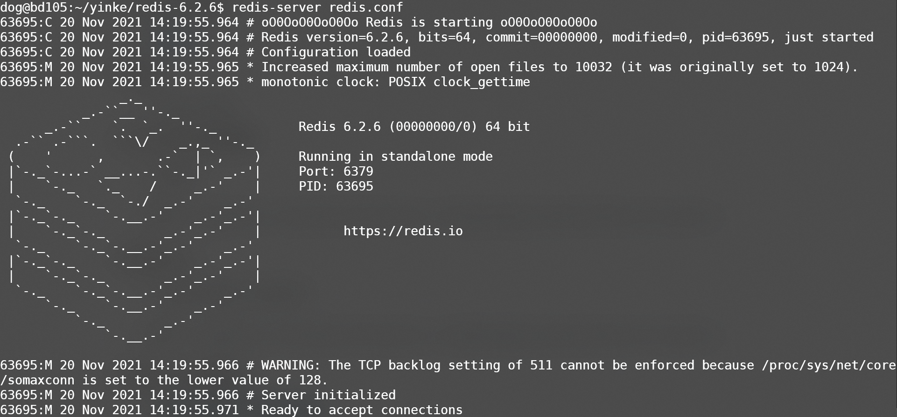

# 安装Redis

安装构建工具

```bash
sudo apt-get update
sudo apt-get install make gcc 
```

1. 下载redis源码

   1. [Redis](https://redis.io/download)

2. 解压

   1. `tar -xzf` 

3. 进入文件夹并编译

   1. `make`

   > 结果：`make[1]: Leaving directory '/home/dog/yinke/redis-6.2.6/src'`

4. 安装redis

   1. `sudo make install`

   > 结果：`make[1]: Leaving directory '/home/dog/yinke/redis-6.2.6/src'`

5. 启动redis服务器

   1. redis-server redis.conf

