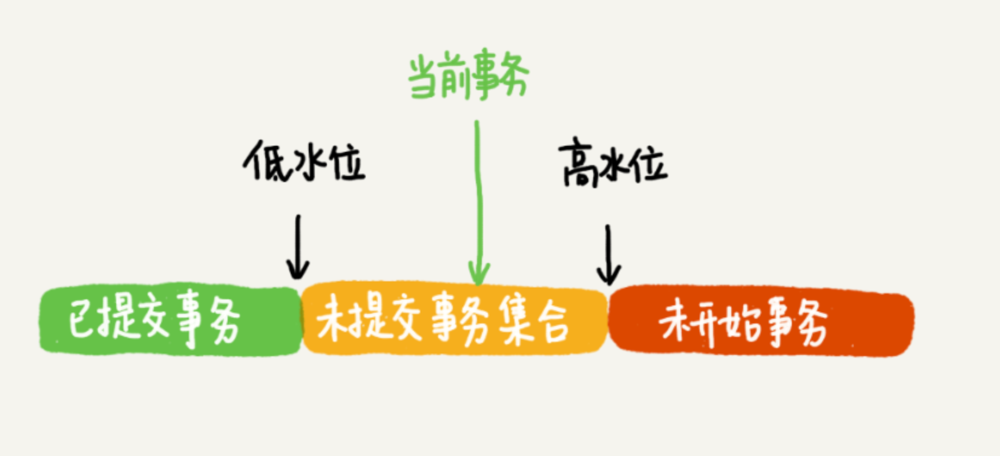

# 数据和信息

- 数据：描述现实世界中的各种事物的可以识别的符号
- 信息：被加工为特定形式的数据

数据是信息的载体，是信息的具体表现形式。数据只有被加工从成信息，才具有使用价值

# 事务

`TRANSACTION`

事务指的是满足ACID特性的**一组操作**

- 一个数据库事务通常包含了一个序列的对数据库的读写操作
- 回滚可以用**回滚日志**（Undo Log）来实现
  - 回滚日志记录着事务所执行的修改操作，在回滚时**反向执行这些修改操作**即可

> **事务本质上是为了应用层服务的**，而不是伴随着数据库系统天生就有的
>
> 当应用程序访问数据库的时候，事务能够简化我们的编程模型。不需要我们去考虑各种各样的潜在错误和并发问题（不用去考虑网络异常了，服务器宕机了）

## ACID特性

- 原子性（Atomicity）

  - 事务被视为不可分割的最小单元，事务中的全部操作在数据库中是不可分割的（要么全部执行，要么全部不执行）

  > 要么提交，要么回滚

- 一致性（Consistency）

  - 数据库在**事务执行前后**都保持一致性状态
  - 在一致性状态下，所有事务对同一个数据行的读取结果都是相同的
  - 几个并行执行的事务，其执行结果必须与**按某一顺序串行执行的结果相一致**

- 隔离性（Isolation）

  - 事务的执行不受其他事务的干扰，事务执行的**中间结果对其他事务必须是透明的**
  - 一个事务所做的修改在最终提交以前，对其它事务是不可见的

- 持久性（Durability）

  - 对于任意已提交事务，其所做的修改将会永远保存到数据库中
    - 即使系统发生崩溃，**事务执行的结果也不能丢失**
  - 系统发生崩溃可以用**重做日志**（Redo Log）进行恢复，从而实现持久性
    - 与回滚日志记录数据的逻辑修改不同，Redo Log记录的是数据页的物理修改

> ensuring the consistency is the responsibility of user, not DBMS.", "DBMS assumes that consistency holds for each transaction
>
> - ACID里的AID都是数据库的特征，也就是依赖数据库的具体实现而一致性，实际上它依赖于应用层，也就是依赖于开发者
>
> 保证事务只能把数据库从一个有效（正确）的状态**转移**到另一个有效（正确）的状态
>
> - 数据库的有效(正确）的状态：指满足给这个数据库predefined的一些规则的状态都是valid的

## 特性关系

ACID这几个特性不是一种平级关系

- 只有满足一致性，事务的执行结果才是正确的
- 在无并发的情况下，事务串行执行，隔离性一定能够满足
  - 此时只要能满足原子性，就一定能满足一致性
- 在并发的情况下，多个事务并行执行
  - 事务不仅要满足原子性，还需要满足隔离性，才能满足一致性
- 事务满足持久化特性是为了能应对系统崩溃的情况

> C最重要，可以视为一种要求

## AUTOCOMMIT

MySQL默认采用自动提交模式

- 如果不使用`START TRANSACTION`语句来显式开启一个事务，那么**每个查询操作都会被当做一个事务**并自动提交

# 并发一致性问题

- 在并发环境下，事务的隔离性很难保证，因此会出现很多**并发一致性问题**
  - 产生并发不一致性问题的主要原因是破坏了**事务的隔离性**

通过**并发控制**来保证隔离性

- **并发控制可以通过封锁来实现**
  - 封锁操作需要用户自己控制，相当复杂
- DBMS提供了**事务的隔离级别**
  - 让用户以一种更轻松的方式处理并发一致性问题

## 丢失修改

覆盖

- 一个事务的更新操作被另外一个事务的更新操作覆盖

## 脏读

在不同的事务下，当前事务可以**读取到其他事务未提交的数据**

- 如果其他事务回滚提交的数据，则读取的就是错误数据

> 采用的隔离级别为：read uncommitted

## 不可重复读

在一个事务内多次读取同一数据集合，在这一**事务还未结束前**，另一事务也访问了该同一数据集合并修改了数据然后提交了修改

- 事务的两次读取的数据可能不一致

> 采用的隔离级别为：read committed

## 幻读

一个事务读取某个范围的数据，另一个事务在这个范围内**更新了数据**

- 再次读取这个范围的数据，此时读取的结果和和第一次读取的结果不同

> 采用的隔离级别为：repeatable read
>
> 幻读本质上也属于不可重复读的情况
>
> - 不可重复读的重点是修改`update`，幻读的重点在于新增`insert`或者删除`delete`
>
>
> - 即不可重复读可能发生在`update`,`delete`操作中，而幻读发生在`insert`操作中

# 封锁

- MySQL中提供了两种封锁粒度
  - **行**级锁（`row`）
  - **表**级锁（`table`）

- 应该**尽量只锁定需要修改的那部分数据**，而不是所有的资源
  - 锁定的数据量越少，发生锁争用的可能就越小，**系统的并发程度就越高**

- 加锁需要消耗资源，锁的各种操作（获取锁、释放锁以及检查锁状态）都会增加系统开销
  - 锁定的数据量越少，系统开销就越大

> 在选择封锁粒度时，需要在锁开销和并发程度之间做一个权衡

## 封锁类型

### 读写锁

- 互斥锁（`Exclusive`），X锁，写锁
- 共享锁（`Shared`），S锁，读锁

**规则**

- 一个事务对数据对象A加了写锁（X），就可以对A进行读取和更新

  - 加锁期间**其它事务不能对A加任何锁**

- 一个事务对数据对象A加了读锁（S），可以对A进行读取操作，但是**不能进行更新操作**

  - 加锁期间**其它事务能对A加S锁，但是不能加X锁**

  > 加了读锁，自己也不可以更新数据

|       | X    | Y    |
| ----- | ---- | ---- |
| **X** | 0    | 0    |
| **Y** | 0    | 1    |

### 意向锁

意向锁（Intention Locks）在原来的X / S锁之上引入了IX / IS锁，**IX/IS都是表锁**，用来表示一个事务想要在**表中的某个数据行**上加X锁或S锁

> 引入原因
>
> - 在存在行级锁和表级锁的情况下，事务T想要对表A加X锁，就需要先检测是否有其它事务对表A或者表A中的任意一行加了锁，那么就**需要对表A的每一行都检测一次**，**非常耗时**
> - 通过查看表的意向锁，来避免查询表中每一行数据的锁，节省时间

- 通过引入意向锁，事务T想要对表A加X锁，只需要先检测是否有其它事务对表A加了X / IX / S / IS锁
  - 如果加了就**表示有其它事务正在使用这个表或者表中某一行**的锁，因此事务T加X锁失败
- 任意IS / IX锁之间都是兼容的，因为它们只**表示想要对表加锁，而不是真正加锁**
- 表级的IX锁和行级的X锁是兼容的，两个事务T1,T2可以分别对两个数据行加X锁
  - 事务T1想要对数据行R1加X锁，事务T2想要对同一个表的数据行R2加X锁，两个事务都需要对该表加IX锁，而IX锁是兼容的，IX锁与行级的X锁也是兼容的，所以两个事务都能加锁成功，**从而对同一个表中的两个数据行做修改**

**规则**

- 一个事务在获得某个**数据行对象**的S锁之前，必须先获得表的IS锁或者更强的锁
- 一个事务在获得某个**数据行对象**的X锁之前，必须先获得表的IX锁

> 意向锁可以更容易地支持多粒度封锁

|        | **X** | **IX** | **S** | **IS** |
| ------ | ----- | ------ | ----- | ------ |
| **X**  | 0     | 0      | 0     | 0      |
| **IX** | 0     | 1      | 0     | 1      |
| **S**  | 0     | 0      | 1     | 1      |
| **IS** | 0     | 1      | 1     | 1      |

### 悲观锁

对数据被外界（包括本系统当前的其他事务，以及来自外部系统的事务处理）修改持保守态度

- 因此在整个数据处理过程中，将数据处于锁定状态

悲观锁的实现往往依靠数据库提供的锁机制

- 只有**数据库层**提供的锁机制才能真正保证数据访问的排他性

- 因为即使在本系统中实现了加锁机制，也无法保证外部系统不会修改数据

在悲观锁的情况下，为了保证事务的隔离性，就需要一致性锁定读

- 读取数据时给加锁，其它事务无法修改这些数据
- 修改删除数据时也要加锁，其它事务无法读取这些数据

### 乐观锁

相比悲观锁，乐观锁机制采取了更加宽松的加锁机制

- 悲观锁大多数情况下依靠数据库的锁机制实现，以保证操作最大程度的独占性。但是数据库性能开销太大，特别是对长事务而言，这样的开销往往无法承受

- 乐观锁机制在一定程度上解决了这个问题。
  - 乐观锁大多是基于数据版本（Version）记录机制实现

**数据版本**：为数据增加一个版本标识

- 在**基于数据库表的版本**解决方案中，一般是通过为数据库表增加一个`version`字段来实现
- 读取出数据时将此版本号一同读出，更新时对此版本号加一，将提交数据的版本与数据库表对应记录的当前版本信息进行比对
  - 如果提交的数据版本号大于数据库表当前版本号，则更新数据。否则认为是过期数据

## 封锁协议

### 三级封锁协议

- 一级封锁协议的关注点是事务修改的数据

- 二级和三级封锁协议的关注点是事务读取的数据

#### 一级封锁协议

**事务T要修改数据A时必须加X锁，直到事务T结束（提交或者回滚）才释放X锁**

- 可以解决丢失修改（覆盖）问题
  - 因为不能同时有两个事务对同一个数据进行修改，所以事务的修改就不会被覆盖
- 不能解决脏读和不可重复读

#### 二级封锁协议

在一级封锁的基础上，要求**读取数据A时必须加S锁，读取完后才能释放S锁**

- 可以解决读脏数据问题
  - 因为事务在对数据A进行修改时根据一级封锁协议会加X锁，那么其他事务就不能再加S锁了，也就不会读入数据
- 不能解决不可重复读
  - 因为读完数据后即可释放S锁（而事务不一定结束），所以不能保证可重复读

#### 三级封锁协议

在一级封锁的基础上，要求**读取数据A时必须加S锁，直到事务结束了才能释放S锁**

- 可以解决不可重复读的问题
  - 因为读数据A时加上了S锁，其它事务不能对A加X锁，从而避免了在读数据的期间数据改变

### 两段锁协议

- 加锁和解锁分为两个阶段进行

- 可串行化调度
  - 通过并发控制，使得并发执行的事务结果与某个串行执行的事务结果相同
  - 串行执行的事务互不干扰，不会出现并发一致性问题

- 事务遵循两段锁协议是保证可串行化调度的充分条件，但不是必要条件
  - 满足两段协议可串行化调度，但是可串行化调度不一定满足两段协议

## MySQL隐/显式锁定

MySQL的InnoDB存储引擎采用两段锁协议

- **会根据隔离级别在需要的时候自动加锁**
  - 所有的锁都是在同一时刻被释放，这被称为**隐式锁定**
- InnoDB也可以使用特定的语句进行**显示锁定**

# 隔离级别

## 读取未提交

`READ UNCOMMITTED`

- 最低的隔离级别
- 事务中的修改即使没有提交，对其它事务也是可见的
  - 允许其他事务读取未提交的修改
- 可能会导致脏读，幻读或不可重复读

## 读取已提交

`READ COMMITTED`

- 一个事务只能读取已经提交的事务所做的修改，即一个事务所做的修改在提交之前对其它事务是不可见的
- 可以防止脏读
- 但是有可能会导致不可重复读或幻读

## 可重复读

`REPEATABLE READ`

- 保证在同一个事务中多次读取同一数据的结果是一样的
- 可以防止脏读和不可重复读
- 但是有可能会导致幻读

> 可重复读是指对于**其他事务操作的数据**，多次读取的结果都是一样的，重点在于其他事务的数据。如果第一次读取能够读取到其他事务的数据，后面不管其他事务有任何其他任何操作，都不会影响已读取到的其他事务产生的数据
>
> 但是自身所在的事务中产生的数据，自己是都可以读取到的

## 可串行化

`SERIALIZABLE`

- 最高隔离级别

- 强制事务串行执行，这样多个事务互不干扰，不会出现并发一致性问题

- 要使用加锁机制保证同一时间只有一个事务执行，也就是保证事务串行执行
- 可以防止脏读，不可重复读和幻读

# 多版本并发控制

`Multi-Version Concurrency Control` 

InnoDB引擎默认的隔离级别是**可重复读**，MVCC是InnoDB引擎**实现隔离级别的一种具体方式**

- 可以实现**读取已提交**和**可重复读**这两种隔离级别

> **读取未提交**总是读取最新的数据行，要求很低，无需使用MVCC
>
> **可串行化**需要对所有读取的行都加锁，单纯使用MVCC无法实现

## 基本思想

- MVCC利用了**多版本**的思想（快照）

  - 写操作更新最新的版本快照
  - 读操作去读旧版本快照

  > 没有互斥关系，和`CopyOnWrite`类似
  >
  > 加锁中读写锁中读和写操作则是互斥的

- 在MVCC中事务的修改操作（`DELETE`，`INSERT`，`UPDATE`）会**为数据行新增一个版本快照**

- 在事务进行读取操作时，**MVCC规定事务只能读取已经提交的快照**（从而解决脏读和不可重复读问题）

  - 但可以读取自身未提交的快照

## 版本号

- 系统版本号：`SYS_ID`
  - 每开始一个新的事务，系统版本号就会自动递增

- 事务版本号：`TRX_ID` 
  - 事务开始时的系统版本号

## 快照和Undo Log

- MVCC的多版本（Multi-Version）指的是多个版本的**快照**
- 快照中会记录
  - 事务版本号：`TRX_ID` 
  - 事务操作
  - `DEL`字段（1 bit）：用于标记该数据行是否被删除

MySQL会在**更新数据之前，会先把这行数据写到Undo Log中**，再修改`Buffer Pool`中的数据。这样需要回滚时，就可以从Undo Log中将记录的旧值读出来

- 快照存储在回滚日志Undo Log中，Undo Log通过回滚指针`ROLL_PTR`把一个数据行的所有快照连接起来
- 每当一个事务对某一行或多行数据进行事务更新或删除时
  - 会将当前数据行操作的快照存储到Undo Log
    - 如果是删除操作，还要将`DEL`字段值设置为 1（读取时若`DEL`为1则不返回）
  - 然后更新新数据行的事务版本号：`TRX_ID` 
  - 再将回滚指针`ROLL_PTR`指向Undo Log中的上一个快照

> `DELETE`可以看成是一个特殊的`UPDATE`，会额外将`DEL`字段值设置为 1

## ReadView

MVCC在事务读取时会维护一个ReadView结构，主要包含了

- 当前系统未提交的事务集合：`TRX_IDs {TRX_ID_1, TRX_ID_2...}`
- 低水位：未提交的事务集合中的最小事务版本号（`TRX_ID_MIN`）
- 高水位：未提交的事务集合中的最大事务版本号+1（`TRX_ID_MAX+1`）

> 在高低水位之间的事务有一部分已经提交，还有一部分未提交，就是在未提交的事务集合中

 

### 查询

在进行`SELECT`查询操作时，数据库根据**查询行当前快照中的事务版本号**`TRX_ID`判断是否可以操作

- 如果`TRX_ID` < `TRX_ID_MIN`
  - 说明该行数据对应的事务是已经提交过的事务，可以使用该行数据
- 如果`TRX_ID` > `TRX_ID_MAX`
  - 说明该行数据对应的事务在是在查询事务启动后才创建的，不可以使用该行数据
- 如果`TRX_ID_MIN` < `TRX_ID` < `TRX_ID_MAX`，根据隔离级别的不同，对应不同的操作
  - 读取已提交
    - 如果`TRX_ID`在未提交事务集合`TRX_IDs`中，则是未提交事务，不可以使用该行数据
    - 如果`TRX_ID`不在未提交事务集合`TRX_IDs`中，则是提交过的事务，可以使用该行数据
  - 可重复读
    - 无论`TRX_ID`是否在未提交事务集合`TRX_IDs`中，都不可以使用该行数据。因为如果可以使用，则读取后可能存在其他事务修改了改行数据，导致了不可重复读问题

当判断后不能使用数据行的快照后，就需要根据Undo Log的回滚指针 `ROLL_PTR`找到下一个快照，重复上面的判断直到找到可以使用的数据快照

> 可以这么理解可重复读级别，当事务开启时，它所看到的事务（对应的数据）就固定了，后续已经提交的事务不会再影响它，不会读到最新的数据

## 快照读

snapshot read

- 读取的是记录的**可见版本** （有可能是历史版本），不用加锁

- MVCC利用多版本的快照思想

  - 查询数据（`SELECT`）操作是读快照的数据

- 可以避免幻读

> 也可以指定要求加锁

## 当前读

current read

- 读取的是记录的最新版本，并且会对当前记录加锁，防止其他事务修改

- 更新数据（`UPDATE`，`DELETE`，`INSERT`）操作仍然需要加锁
- 通过nNext-Key Locks来避免幻读

# Next-Key Locks

Next-Key Locks = Record Locks + Gap Locks

- InnoDB引擎默认是可重复读隔离级别
- InnoDB引擎以Next-Key Lock的方式对数据行进行加锁，以**解决幻读问题**

当InnoDB扫描**索引记录**的时候

1. 首先**对索引记录加上行锁**（Record Lock）
2. 再对**索引记录两边的间隙加上间隙锁**（Gap Lock）
   1. 加上间隙锁之后，其他事务就不能在这个间隙修改或者插入记录
   2. 前开后闭区间

当查询的**索引含有唯一属性**（唯一索引，主键索引）时，Innodb引擎会对Next-Key Locks进行优化，将其降为Record Lock

- 仅锁住索引本身，而不是范围

## 间隙锁

Gap Locks

- 对索引项之间的间隙上锁，防止间隙内有新数据被插入，从而防止幻读
  - 不包含索引本身

> innoDB的间隙锁只存在于可重复读隔离级别，要禁用间隙锁提升系统性能的时候，可以考虑将隔离级别降为读取已提交

## 行锁

Record Locks

- 锁定一个记录上的索引，而不是记录本身

- 如果表没有设置索引，InnoDB引擎会自动**在主键上创建隐藏的聚簇索引**，保证Record Locks 依然可以使用

# 索引

索引的出现其实就是为了提高数据查询的效率

- 快速找到某一行数据（类似书的目录）

## 索引模型

**索引是在存储引擎层实现的**，没有统一的索引标准

- 不同存储引擎的索引的工作方式并不一样

实现索引的方式（数据结构）有很多种

- 哈希表
- 有序数组
- 搜索树

> 跳表、LSM树等数据结构也被用于引擎设计中

### 哈希表

- 哈希碰撞时，以链表的方式追加
- 因为是链表追加是无序的，所以哈希索引做区间查询的速度是很慢的
  - 需要扫描整个区间
  - 所以哈希表这种结构适用于只有**等值查询**的场景

> 哈希索引能以`o(1)`时间进行查找
>
> InnoDB引擎有一个特殊的功能叫**自适应哈希索引**，当某个索引值被使用的非常频繁时，会在B+Tree索引之上再创建一个哈希索引，这样就让B+Tree索引具有哈希索引的优点：快速的哈希查找

### 有序数组

- 顺序存储值，就可以使用二分搜索来查找值
  - 所以有序数组在**等值查询**和**范围查询**场景中的性能就都非常优秀
- 但要更新数据的时候就必须得挪动插入位置后面所有的记录，成本太高
  - 所以有序数组索引只适用于静态存储引擎

### 搜索树

二叉搜索树：搜索效率最高

- 为了维持 O(logN) 的查询复杂度，需要保持是平衡二叉树
  - 平衡二叉树更新的时间复杂度也是 O(logN)

实际上大多数的数据库存储却并不使用二叉树，原因是**索引不止存在内存中，还要写到磁盘上**。

- 因为二叉树可能过深，而在磁盘中读写数据，要尽量少的访问数据块
- 所以要使用N叉树来减小深度（N取决于数据块大小）

## 磁盘访问

- OS将内存和磁盘分割成固定大小的块，称为页，内存与磁盘以页为单位交换数据
- 数据库系统将索引的一个节点的大小设置为页的大小，这样一次I/O操作就能完全载入一个节点（页）
- 如果数据不在同一个磁盘块上，那么通常需要移动制动手臂进行寻道，而制动手臂因为其物理结构导致了移动效率低下，从而增加磁盘数据读取时间
- B+树相对于红黑树有更低的树高，进行寻道的次数与树高成正比，在同一个磁盘块上进行访问只需要很短的磁盘旋转时间，所以B+树比红黑树更适合磁盘数据的读取

**磁盘预读**

- 为了减少磁盘的I/O操作，磁盘往往不是严格按需读取，而是每次都会预读

- 预读过程中，磁盘进行顺序读取，顺序读取不需要进行磁盘寻道，只需要很短的磁盘旋转时间，速度会非常快

- 利用预读特性，相邻的节点也能够被预先载入

## B树

B Tree：Balance Tree，即**平衡树**

- B Tree是一颗查找树
  - **所有叶子节点位于同一层**
- **排序方式**
  - 所有节点值是按递增次序排列，遵循左小右大原则

> 和平衡二叉树的区别：B树是多叉树：又叫平衡多路查找树

## B+树

B+ Tree：基于B Tree和**叶子节点顺序访问指针**进行实现

- 具有B Tree的平衡性
- 通过顺序访问指针来提高**区间查询**的性能

**B+树和B树的区别**

- **非叶子节点**不保存关键字记录的指针，只进行数据索引，这样B+树每个**非叶子节点**所能保存的关键字大大增加
  - 所以树的层级更少
- **叶子节点**保存了父节点的所有关键字记录的指针
  - 所以数据地址必须要到叶子节点才能获取到，所以每次数据查询的次数都一样（所以查询速度更稳定）
- **叶子节点**的关键字从小到大有序排列
  - 左边结尾数据都会保存右边节点开始数据的指针

## InnoDB索引

在InnoDB引擎中

- 表是根据主键顺序以索引的形式存放的，这种存储方式的表称为**索引组织表**
- 使用**B+树**索引模型
  - 数据都是存储在B+树中的
  - **每一个索引对应一棵B+树**

### 索引类型

- **主键索引**：聚簇索引（clustered index）
  - 叶子节点存的是**整行数据**

- **非主键索引**：二级索引（secondary index）
  - 叶子节点存的是**主键的值**

> 所以主键长度越小，普通索引的叶子节点就越小，普通索引占用的空间也就越小

### 索引查询

- 基于主键索引的查询
  - 只需要搜索主键索引对应的B+树

- 基于普通索引的查询：**回表**
  - 先去搜索普通索引对应的B+树，找到对应的主键
  - 再搜索主键索引对应的B+树

> 基于非主键索引的查询需要多扫描一棵索引树，所以应用中应该尽量使用主键查询

### 索引维护

B+树为了维护索引**有序性**，在插入新值的时候需要做必要的维护

- 在中间插入数据，需要在逻辑上挪动后面的数据

**页分裂**

- 如果插入位置所在的数据页已经满了，根据B+树的算法，这时需要申请一个新的数据页，然后挪动部分数据过去

> 所以自增主键的插入数据模式符合递增插入的场景
>
> - 每次插入一条新记录都是追加操作，不涉及到挪动其他记录，也不会触发叶子节点的分裂
>
> 而有业务逻辑的字段做主键，则往往不容易保证有序插入，这样写数据成本相对较高

**页合并**

- 当相邻两个页由于删除了数据，利用率很低之后，会将数据页做合并
- 合并的过程可以认为是分裂过程的逆过程

# 数据类型

### 字符串

主要有`CHAR`和`VARCHAR`两种类型，一种是定长的，一种是变长的

`VARCHAR`

- 变长类型能够节省空间，因为只需要存储必要的内容

- 但是在执行`UPDATE`时可能会使行变得比原来长，当超出一个页所能容纳的大小时，就要执行额外的操作
  - MyISAM会将行拆成不同的片段存储
  - InnoDB则需要页分裂来使行放进页内

在进行存储和检索时

- 会保留`VARCHAR`末尾的空格
- 会删除`CHAR`末尾的空格

### 时间和日期

MySQL提供了两种相似的日期时间类型

- `DATETIME`
- `TIMESTAMP`

#### DATETIME

- 能够保存从1000年到9999年的日期和时间
- 精度为秒
- 使用8字节的存储空间
- 与时区无关

默认情况下，MySQL 以一种可排序的、无歧义的格式显示`DATETIME`值

> ANSI 标准定义的日期和时间表示方法

#### TIMESTAMP

- 和UNIX时间戳相同，保存从1970年1月1日午夜（格林威治时间）以来的秒数
- 使用4个字节，只能表示从1970年到2038年
- 和时区有关
- 一个时间戳在不同的时区所代表的具体时间是不同的
- 默认情况下，如果插入时没有指定`TIMESTAMP`列的值，会将这个值设置为当前时间

MySQL 提供了`FROM_UNIXTIME()`函数把UNIX时间戳转换为日期，提供了`UNIX_TIMESTAMP()`函数把日期转换为UNIX时间戳

> 尽量使用`TIMESTAMP`，因为它比`DATETIME`空间效率更高

# Java调用MySQL

Java通过**数据库连接池**连接数据库

- 数据库连接池里面会有很多的线程
- dao层发送的请求会交给数据库连接池中的某个线程来处理

数据库连接池连接MySQL数据库

- 建立连接时MySQL连接器要校验用户名、密码等，完成一系列连接操作

MySQL后台服务会监听线程，处理SQL

- 高版本的MySQL没有查询缓存，或者说没有用到查询缓存，会直接用分析器（Parser）来分析SQL语句
- 分析器会对SQL进行词法分析，语法分析，解析 SQL的一些关键词、表名、字段名...

分析完之后MySQL会通过优化器（Optimizer）对语句进行优化

- 找到最优的查询路径，决定怎么查询最快

优化器会生成一套执行计划，然后不停的调用存储引擎的各种接口去完成这些计划

- MySQL中的执行器专门负责调用存储引擎接口

# MySQL数据存储

## 表空间

创建的表在磁盘上对应一个`.ibd`磁盘文件

- 使用`show variables like 'datadir';`命令查看存储数据的目录地址

## Buffer Pool

- MySQL为了避免频繁对磁盘做随机读写操作，引入了内存组件`Buffer Pool` 
- 执行数据修改操作时，它会先把数据从磁盘加载到`Buffer Pool`中，再对`Buffer Pool`中的数据进行修改
  - MySQL会在更新数据之前，先把这行数据写到Undo Log中，再修改`Buffer Pool`中的数据
  -  MySQL会开启一个后台线程，线程会在MySQL空闲的时候，不断读取`Buffer Pool`中修改后的数据，刷回到磁盘中

> 数据存在磁盘上，每次执行增删改查操作的时候都直接修改磁盘上文件是非常低效的（对磁盘随机读写操作非常耗时）

# Redo Log

用于保证**持久性**（Durability）

**背景**

- 数据修改操作是在`Buffer Pool`中进行的，更新之后的数据也没有写入到磁盘中
  - 如果此时MySQL宕机，那么在内存中的修改过数据就丢失了
- 如果每次事务提交的时候将该事务涉及修改的数据页全部刷入磁盘，会有严重的性能问题

  - InnoDB引擎是以**物理页**为单位进行磁盘交互的，而一个事务很可能只修改一个数据页里面的几个字节，这个时候将完整的数据页刷回到磁盘的话，太浪费资源
- 一个事务可能涉及修改多个数据页，并且这些数据页在物理上并不连续，使用**随机IO**写入性能太差

**崩溃恢复：crash-safe**

InnoDB引擎提供了Redo Log

- 记录事务对**数据页**（物理）做了哪些修改

- 保证即使数据库发生异常重启，之前提交的记录都不会丢失

> 只有InnoDB引擎有Redo Log

Redo Log包括两部分

- 一个是**内存中**的日志缓冲（`Redo Log Buffer`)
- 一个是**磁盘上**的日志文件（`Redo Log File`）

## 执行流程

1. MySQL在对`Buffer Pool`中的数据执行完更新操作之后，先将这个更新操作记录写入到内存中的`Redo Log Buffer`中
2. `Redo Log Buffer`再将更新操作写入到`Redo Log File`中

> 这种**先写日志，再写磁盘**的技术就是MySQL里经常说到的WAL（Write-Ahead Logging）技术

## 系统调用

- 在操作系统中，用户空间（user space）下的缓冲区数据一般情况下是无法直接写入磁盘的，中间必须经过操作系统内核空间（kernel space）缓冲区（OS Buffer）
- `Redo Log Buffer`写入`Redo Log File`实际上是先写入OS Buffer，再通过系统调用`fsync()`将其刷到`Redo Log File`中

## 刷盘策略

`Redo Log Buffer`将日志写入到`Redo Log File`中有3种策略，用`innodb_flush_log_at_trx_commit`参数控制

- 0：延迟写
  - 每次提交事务时不会将`Redo Log Buffer`的数据写入OS Buffer
  - 每隔一秒将`Redo Log Buffer`的数据写入OS Buffer，再调用`fsync()`将其刷到`Redo Log File`中
- 1：实时写，实时刷
  - 每次提交事务时将`Redo Log Buffer`的数据写入OS Buffer，再调用`fsync()`将其刷到`Redo Log File`中
- 2：实时写，延迟刷
  - 每次提交事务时会将`Redo Log Buffer`的数据写入OS Buffer，但不调用`fsync()`将其刷到`Redo Log File`中
  - 每隔一秒会调用`fsync()`将其刷到`Redo Log File`中

> 区别
>
> - 按周期写，刷
> - 当事务提交的时候写，刷

`Redo Log Buffer`里面的内容，不是每次生成后都要直接持久化到磁盘的

- 因为如果事务执行期间MySQL发生异常重启，那这部分日志就丢了
- 但由于事务并没有提交，所以这时日志丢了也不会有损失

事务还未提交时，`Redo Log Buffer`里面的内容也可能持久化到磁盘中

- 并行的事务提交的时候，会顺带将这个事务的`Redo Log Buffer`的内容持久化到磁盘

## 记录形式

Redo Log记录物理数据页的变更

- 因此Redo Log采用了**大小固定**，**循环写入**的方式，当写到结尾时，会回到开头循环写日志

如果配置为一组4个文件，每个文件的大小是1GB，总共就可以记录 4GB 的操作，从头开始写，写到末尾就又回到开头循环

- `write pos`是当前记录写入`Redo Log File`的位置，一边写一边后移，写到第3号文件末尾后就回到第0号文件开头
- `checkpoint`是当前`Redo Log File`中要擦除的位置，也是往后推移并且循环的，擦除记录前要把**记录更新到数据文件**
- `write pos`和`checkpoint`之间的是还空着的部分，可以用来记录新的操作
- 如果`write pos`追上了`checkpoint`，表示`Redo Log File`满了，这时候不能再执行新的更新，得停下来刷盘，然后擦掉对应记录

> 启动innodb的时候，无论上次是正常关闭还是异常关闭，总是会进行写入操作。会检查磁盘中数据页中的记录号，如果数据页的记录号小于日志中的记录号 ，则会从checkpoint处开始写入
>

## 两阶段提交

**过程**

`UPDATE`更新数据时

1. 引擎将新的行数据更新到内存中
   1. 执行器调用引擎，引擎根据索引找到对应行
      1. 如果数据页在内存中，则直接返回给执行器
      2. 如果不在，需要先从磁盘读入内存，再返回
   2. 执行器拿到数据，执行更新然后交给引擎
   3. 引擎将新数据更新到内存中
2. 引擎将更新操作记录写入`Redo Log File`中，此时`Redo Log File`处于第一阶段`prepare`状态
3. 然后引擎告知执行器执行完成了，可以提交事务
4. 执行器生成操作对应的记录，写入Bin Log（并刷盘）
5. 执行器调用引擎的提交事务接口，提交事务
6. 引擎把刚才写入的`Redo Log File`改成第二阶段`commit`状态
7. 更新完成

**目的**

- 为了让两份日志的逻辑一致

如果没有两阶段提交

1. 写完`Redo Log File`，再写Bin Log
   1. 如果在写Bin Log时系统崩溃，则没有记录更新语句，但是根据`Redo Log File`，值已经发生改变了，而根据Bin Log恢复缺少了更新，所以无法恢复到正确值
2. 写完Bin Log，再写`Redo Log File`
   1. 如果在写Bin Log后系统崩溃，则`Redo Log File`没有记录物理页的更新，所以还是旧值，而根据Bin Log恢复值发生了更新，所以无法恢复到正确值

所以，如果不适用两阶段更新，则数据库状态可能和用日志恢复出来的状态不一致

# Bin Log

Bin Log用于记录数据库执行的写入性操作（不包括查询）信息，以**二进制**的形式保存在磁盘中

- Bin Log是MySQL的逻辑日志，由MySQL Server进行记录
  - 逻辑日志记录SQL语句
  - 使用**任何存储引擎**的MySQL数据库都会记录Bin Log日志
- Bin Log是通过**追加的方式进行写入**的
  - 可以通过`max_binlog_size` 参数设置每个Bin Log文件的大小，当文件大小达到给定值之后，会**生成新的文件来保存日志**

> Redo Log只有InnDB引擎有

## 应用场景

在实际应用中的主要使用场景有两个，分别是**主从复制** 和 **数据恢复**

- **主从复制**：在Master端开启Bin Log，然后将Bin Log发送到各个Slave端，Slave端重放Bin Log从而达到主从数据一致
- **数据恢复**：通过使用 `mysqlbinlog` 工具来恢复数据

## 刷盘策略

InnoDB引擎只有在事务提交时才会记录Bin Log，此时Bin Log的记录还在内存中

Bin Log有2种刷盘策略，用`sync_binlog`参数控制（取值范围是`0-n`）

- 0：提交事务时不强制刷盘，由os cache自己控制将数据刷入磁盘
- 1：每次提交事务都强制进行磁盘同步来将数据刷入磁盘
- n：每n次提交事务，强制进行磁盘同步来将数据刷入磁盘

> `sync_binlog=1`时，性能下降非常厉害

## 日志格式

Bin Log有三种格式，分别为`STATMENT`，`ROW`和`MIXED`

- 日志格式通过`binlog-format`参数指定

> 在MySQL 5.7.7之前，默认的格式是 `STATEMENT` ， MySQL 5.7.7之后，默认值是`ROW`

# 关系型数据库

关系型数据库是依据**关系模型**来创建的数据库

关系：两个集合的笛卡尔积的子集，就叫做这两个集合的一个关系

- 关系模型中有

  - 一对一
  - 一对多
  - 多对多

  等关系...

- 关系模型也是指**二维表格模型**，所以一个关系型数据库就是由**二维表**和**表之间的联系**组成的一个数据组织

## 码

设K为某张表中的**一个属性或属性组**，若除K之外的所有属性都**完全函数依赖**于K，则称K为**候选码**，简称为**码**

- 一张表中可以有超过一个码
  - 实际应用中为了方便，通常选择其中的一个码作为**主码**

### 主属性

包含在任意一个码中的属性称为主属性

### 非主属性

不包含在任何一个码中的属性称为非主属性

## 函数依赖

`A->B`

- 表示A函数决定B，也可以说B**函数依赖于**A
  - A确定，B一定确定，不会存在相同的A对应不同的B，C
- 如果能找到A的真子集A'，使得`A'->B`，那么就是**B部分函数依赖于A**，否则就是**B完全函数依赖于A**
- 如果`B->C`，则`A->C`是一个**传递函数依赖**，即**C传递函数依赖于A**

## 异常

**不符合范式的关系会产生很多异常**，主要有以下四种异常

- **数据冗余**
- **修改异常**
  - 修改了一个记录中的信息，另一个记录中相同的信息没有被修改
- **删除异常**
  - 删除一个信息，会丢失其它信息
- **插入异常**

## 范式

NF

范式是

- 符合某一种级别的关系模式的集合
- 表示一个关系内部各属性之间的联系的**合理化程度**

范式用于**解决以上提到四种异常**

- 高级别范式的依赖于低级别的范式
- 1NF是最低级别的范式
- 一般在设计关系型数据库的时最多考虑到BCNF

### 第一范式

1NF

数据库的每个表的每个列都是不可分割的基本数据项

> 所有关系型数据库的最基本要求

### 第二范式 

2NF

在1NF的基础之上，每个非主属性必须**完全函数依赖**于码（即消除了非主属性对码的部分函数依赖）

**判断是否符合2NF**

1. 找出数据表中所有的**码**
2. 根据码找出所有的**主属性**
3. 根据主属性，找出所有的**非主属性**
   1. 除去所有的主属性，剩下的就都是**非主属性**
4. 查看是否存在非主属性对码的**部分函数依赖**

> 不满足2NF的表可以通过模式分解，分解关系来满足

### 第三范式

3NF

在2NF的基础之上，非主属性**不传递函数依赖**于码（即消除了非主属性对码的传递函数依赖）

- 数据库的每个表中的所有数据元素不但要能唯一地被主关键字所标识，而且它们之间还必须相互独立，不存在其他的函数关系

> 防止数据冗余

### BC范式

BCNF

### 表的设计

**码**

- 图中的表只能将**学号与课名**的属性组作为**码**
- 主属性就有两个：学号与课名
- 非主属性有四个：姓名、系名、系主任、分数

**完全函数依赖**

- 姓名函数依赖于学号：学号 -> 姓名
- 系主任函数依赖于系：系名 -> 系主任
- 学号函数依赖于系主任：学号 -> 系主任
- 分数函数依赖于学号和课名：（学号，课名） -> 分数 

**部分函数依赖**

- 姓名部分函数依赖于学号和课名
  - 姓名函数依赖于学号
- 系名部分函数依赖于学号和课名
  - 系名函数依赖于学号
- 系主任部分函数依赖于学号和课名
  - 系主任函数依赖于学号

> 存在非主属性对于码的部分函数依赖，所以这张表最高只符合1NF的要求，不符合2NF的要求

**数据冗余**

1. 每一名学生的学号、姓名、系名、系主任这些数据重复多次
2. 每个系与对应的系主任的数据也重复多次

**插入异常**

- 假如新创建一个系，但是还未招生，则无法将系名与系主任的数据单独地添加到数据表中
  - 因为根据关系完整性约束，主键包含的任意一个属性都不能为空

**删除异常**

- 假如将某个系中所有学生相关的记录都删除，那么对应系与系主任的数据也就随之消失了
  - 但一个系的所有学生都没有了，并不表示这个系就没有了

**修改异常**

- 假如李勇转系到法律系，那么为了保证数据库中数据的一致性，需要修改三条记录中系与系主任的数据

# ER图

Entity-Relationship

用于进行**关系型数据库**系统的概念设计，有三个组成部分

- 实体
- 属性
- 联系

## 联系

实体的三种联系

- 一对一
  - 两个带箭头的线段
- 一对多
  - 带箭头的线段
- 多对多
  - 两个不带箭头的线段

> 一个实体在联系出现几次，就要用几条线连接