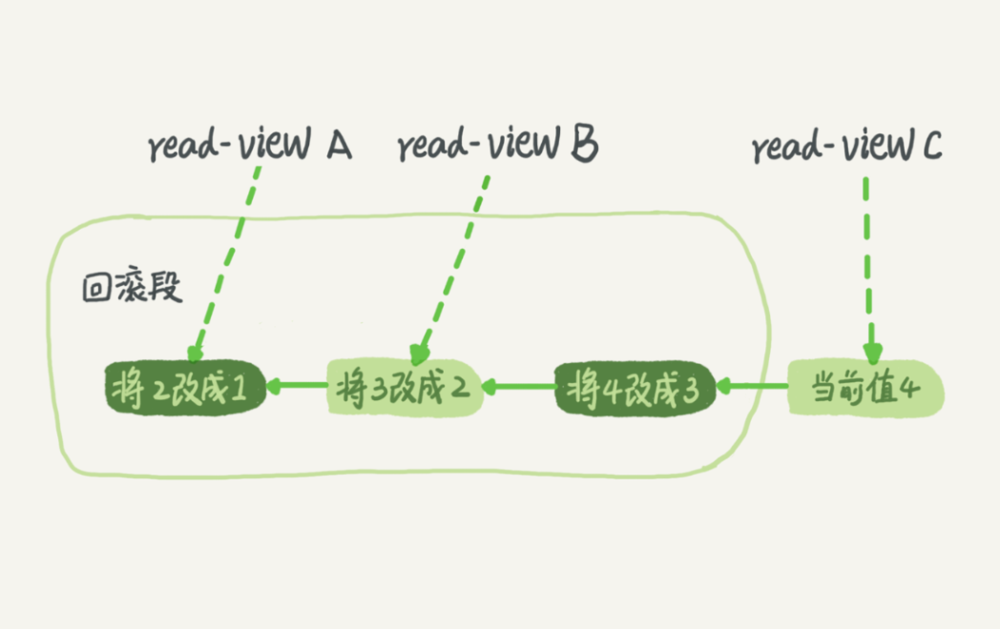

# 数据和信息

- 数据：描述现实世界中的各种事物的可以识别的符号
- 信息：被加工为特定形式的数据

数据是信息的载体，是信息的具体表现形式，数据只有被加工从成信息，才具有使用价值

# 事务

`TRANSACTION`

**事务指的是满足ACID特性的一组操作**

- 一个数据库事务通常包含了一个序列的对数据库的读写操作
- 回滚可以用**回滚日志**（Undo Log）来实现
  - 回滚日志记录着事务所执行的修改操作，在回滚时**反向执行这些修改操作**即可

> **事务本质上是为了应用层服务的**，而不是伴随着数据库系统天生就有的
>
> 当应用程序访问数据库的时候，事务能够简化编程模型，不需要开发人员考虑各种各样的潜在错误和并发问题（网络异常了，服务器宕机了）

事务支持是在存储引擎层实现的，但并不是所有的引擎都支持事务，比如MySQL原生的MyISAM引擎就不支持事务

>  这也是 MyISAM 被 InnoDB 取代的重要原因之一

## ACID特性

- **原子性**（Atomicity）
  - **事务被视为不可分割的最小单元**，事务中的全部操作在数据库中是不可分割的
    - 要么全部执行，要么全部不执行（要么提交，要么回滚）

- **一致性**（Consistency）
  - **数据库在事务执行前后都保持一致性状态**，在一致性状态下，**所有事务对同一个数据行的读取结果都是相同的**
  - 几个并行执行的事务，其执行结果必须与**按某一顺序串行执行的结果相一致**
- **隔离性**（Isolation）
  - 事务的执行不受其他事务的干扰，**事务执行的中间结果对其他事务必须是透明的**
    - 一个事务所做的修改在最终提交以前，对其它事务是不可见的
- **持久性**（Durability）
  - 对于任意已提交事务，其所做的修改将会永远保存到数据库中，即使系统发生崩溃，**事务执行的结果也不能丢失**
  - 系统发生崩溃可以用Redo Log进行恢复，从而实现持久性

> Ensuring the consistency is the responsibility of user, not DBMS.", "DBMS assumes that consistency holds for each transaction
>
> - ACID里的AID都是数据库的特征，也就是依赖数据库的具体实现，而一致性实际上它赖于应用层，也就是依赖于开发者
>
> - 保证事务只能把数据库从一个有效（正确）的状态**转移**到另一个有效（正确）的状态
>
>   - 数据库的有效（正确）的状态指满足给这个数据库预定义的一些规则的状态都是有效的

## 特性关系

ACID这几个特性不是一种平级关系，其中**一致性最重要**，可以视为一种要求

- **只有满足一致性，事务的执行结果才是正确的**
- 在无并发的情况下，**事务串行执行，隔离性一定能够满足**
  - 此时只要能满足原子性，就一定能满足一致性
- 在并发的情况下，多个事务并行执行，事务不仅要满足原子性，**还需要满足隔离性，才能满足一致性**
- 事务满足持久化特性是为了能应对**系统崩溃**的情况

## AUTOCOMMIT

MySQL默认采用自动提交模式

- 如果不使用`start transaction`语句来显式开启一个事务，那么**每个查询操作都会被当做一个事务**并自动提交
  - 提交语句是`commit`，回滚语句是`rollback`


# 并发一致性问题

在并发环境下，事务的隔离性很难保证，因此会出现很多**并发一致性问题**。**产生并发不一致性问题的主要原因是破坏了事务的隔离性**

可以**通过并发控制来保证隔离性**

- 并发控制可以**通过锁来实现**，锁操作需要用户自己控制，相当复杂
- DBMS提供了**事务的隔离级别**，让用户以一种更轻松的方式处理并发一致性问题

## 丢失修改

覆盖

- 一个事务的更新操作被另外一个事务的更新操作覆盖

## 脏读

`dirty read`：在隔离级别为**读取未提交**时

在不同的事务下，当前事务可以**读取到其他事务未提交的数据**

- 因为还未提交，**如果其他事务回滚提交的数据**，读取的就是错误数据

## 不可重复读

`non-repeatable read`：在隔离级别为**读取已提交**时

在一个事务内多次读取同一数据集合，在这一**事务还未结束前**，**另一事务也访问了该同一数据集合并修改了数据然后提交了修改**

- 因为提交就可以被读取，所以事务的两次读取的数据可能不一致

## 幻读

`phantom read`：在隔离级别为**可重复读**时

一个事务读取某个范围的数据，另一个事务**在这个范围内更新了（插入/删除）数据**

- 再次读取这个范围的数据，此时读取的结果和和第一次读取的结果不同

> 幻读本质上也属于不可重复读的情况
>
> - 不可重复读的重点是修改`update`，幻读的重点在于新增`insert`或者删除`delete`，即不可重复读可能发生在`update`，`delete`操作中，而幻读发生在`insert`操作中
>

# 锁

MySQL提供了（大致）**三类锁**

- 全局锁
- **表**级锁（`table`）
- **行**级锁（`row`）

应该**尽量只锁定需要修改的那部分数据**，而不是所有的资源
- 锁定的数据量越少，发生**锁争用**的可能就越小，**系统的并发程度就越高**

- 加锁需要消耗资源，锁的各种操作（获取锁、释放锁以及检查锁状态）都会增加系统开销，锁定的数据量越少，系统开销就越大

> 在选择封锁粒度时，需要在锁开销和并发程度之间做一个权衡

## 全局锁

全局锁就是**对整个数据库实例加锁**

- MySQL提供了一个加全局读锁的命令：`Flush tables with read lock (FTWRL)`，当需要**让整个库处于只读状态的时候**，可以使用这个命令，之后其他线程的以下语句会被阻塞
  - 数据更新语句（数据的增删改）
  - 数据定义语句（包括建表、修改表结构等）
  - 更新类事务的提交语句

### 使用场景

全局锁的典型使用场景是**做全库逻辑备份**，即把整库每个表都`select`出来存成文本，在备份过程中整个库完全处于只读状态

- 如果在主库上备份，那么在备份期间都不能执行更新，**业务基本上就得停摆**
- 如果在从库上备份，那么备份期间从库不能执行主库同步过来的`Bin Log`，**会导致主从延迟**

即不加锁的话，**备份系统备份的得到的库不是一个逻辑时间点**，这个视图是逻辑不一致的

### 一致性视图

要想得到一致性视图，可以在可重复读的隔离级别下开启一个事务来备份，且备份是不需要更新数据库的，所以看到的数据都是一致的

> 因为不同表之间的执行顺序不同所以备份的时间不同
>
> - 如果某个表在这个时间差中进行了更新并且成功被备份，而与其有关联的表已经在之前备份完毕，所以已无法更新，此时就发生数据不一致

### 逻辑备份

**官方自带的逻辑备份工具是mysqldump**

- 使用参数`–single-transaction`的时候，导数据之前就会启动一个事务，来确保拿到一致性视图
  - 只有支持事务的引擎才可以使用该参数
  - 不支持事务的引擎（MyISAM）就要使用加全局读锁的命令`Flush tables with read lock (FTWRL)`
- 由于MVCC的支持，这个过程中数据是可以正常更新的（反正不会被看到）

**`readonly`**

使用`set global readonly=true`的方式也可以**让全库进入只读状态**，但还是会建议使用`FTWRL`方式

- 在有些系统中，`readonly`的值会被用来做其他逻辑，比如用来**判断一个库是主库还是备库**，因此修改`global` 变量的方式影响面更大，不建议使用
- 在异常处理机制上有差异。如果执行`FTWRL`命令之后由于客户端发生异常断开，**MySQL会自动释放这个全局锁，整个库回到可以正常更新的状态**，而将整个库设置为`readonly`之后，如果客户端发生异常，则数据库就会一直保持`readonly`状态，这样会导致整个库长时间处于不可写状态，风险较高

## 表级锁

MySQL里面表级别的锁有两种

- 表锁

- 元数据锁（meta data lock，MDL)

### 表锁

**表锁一般是在数据库引擎不支持行锁的时候才会被用到的**（建议不要使用）

表锁的语法是：`lock tables … read/write`

- 与`FTWRL`类似，可以用`unlock tables`主动释放锁，也可以在客户端断开的时候自动释放
- `lock tables`语法**除了会限制别的线程的读写外，也限定了本线程接下来的操作对象**

> 如果在某个线程A中执行`lock tables t1 read, t2 write;`
>
> - 则其他线程写t1、读写t2的语句都会被阻塞
> - 同时线程A在执行`unlock tables`之前，也只能执行读t1、读写t2的操作，不允许写t1，也不能访问其他表

### MDL

**MDL锁最重要的作用就是防止DDL和DML的并发冲突**

因为如果一个查询正在遍历一个表中的数据，而执行期间另一个线程对这个表结构做变更，删了一列，那么查询线程拿到的结果跟表结构对不上，肯定是不行的

- **当对一个表做增删改查操作的时候，加MDL读锁**，MDL读锁保证的是表结构不能修改，而与表数据无关
- **当要对表做结构变更操作的时候，加MDL写锁**，MDL写锁保证的是表结构不能被并行修改，同时表数据也不能读了

> MySQL5.5版本中引入了 MDL（meta data lock）
>
> 给一个表加字段，或者修改字段，或者加索引，都需要扫描全表的数据

MDL不需要显式使用，**在访问一个表的时候会被系统自动加上**，MDL的作用是保证读写的正确性

- **读锁之间不互斥**，因此可以有多个线程同时对一张表增删改查
- **读写锁之间、写锁之间是互斥的**，用来保证变更表结构操作的安全性
  - 如果有两个线程要同时给一个表加字段，其中一个要等另一个执行完才能开始执行

**MDL锁申请**

申请MDL锁的操作会形成一个队列，**队列中写锁获取优先级高于读锁**

- **一旦出现写锁等待，不但当前操作会被阻塞，同时还会阻塞后续该表的所有操作**

> 如果此时客户端有频繁重试的逻辑就会导致不停的和数据库建立连接，把连接池打满导致库不可用

**MDL锁和事务**

- 事务中的MDL锁，**在语句执行开始时申请，但是语句结束后并不会马上释放，而会等到整个事务提交后再释放**
  - 即长事务不提交就会一直占着MDL锁，所以如果要做DDL变更的表刚好有长事务在执行，要考虑先暂停 DDL，或者kill掉这个长事务
- 如果事务中包含DDL操作（增删改查），**MySQL会在DDL操作语句执行前隐式提交commit，以保证该DDL语句操作作为一个单独的事务存在，同时也保证MDL锁的释放**

> 所以存在长事务时，执行修改表字段命令是一个危险的操作，可能阻塞其它增删改查请求，或导致线程爆满

安全加字段

- 在`alter table`语句中设定等待时间，如果在这个指定的等待时间里面能够拿到MDL写锁最好，拿不到也不要阻塞后面的业务语句，先放弃，后续重试命令

## 行级锁

**MySQL的行锁是在存储引擎层由各个引擎自己实现的，并不是所有的引擎都支持行锁**

- 不支持行锁意味着并发控制只能使用表锁，对于这种引擎的表，同一张表上任何时刻只能有一个更新在执行，这就会影响到业务并发度

> MyISAM引擎就不支持行锁，所以MyISAM引擎不适合高并发的场景，它更适合读多写少的场景
>
> InnoDB引擎支持行锁，这也是MyISAM引擎被 InnoDB引擎替代的重要原因之一

行锁就是针对数据表中行记录的锁，**行锁的实现是通过给索引上的索引项添加锁实现的**

- 所以**只有当执行语句走索引时，Innodb引擎才会使用行锁**，否则只能使用MDL，两种锁均无需显示添加


## 读写锁

- 互斥锁（`Exclusive`），X锁，写锁，排他锁
- 共享锁（`Shared`），S锁，读锁

**X / S锁都是行级锁**，InnoDB引擎的行锁是通过**给索引上的索引项加锁来实现的**，如果没有索引，InnoDB引擎将通过隐藏的聚簇索引来对行记录加锁

InnoDB引擎的行锁分为3种

- Record Lock：对索引项加锁
- Gap Lock：对索引项之间的间隙加锁
- Next-key Lock：Record Lock和Gap Lock的结合，对记录和记录前后的间隙加锁

InnoDB引擎的行锁的实现特点表明，如果不通过索引条件检索数据，那么InnoDB引擎将对表中的所有记录加锁，实际效果跟锁表一样

**规则**

- 一个事务对数据对象A加了写锁（X），就可以对A进行读取和更新

  - 加锁期间**其它事务不能对A加任何锁**

- 一个事务对数据对象A加了读锁（S），可以对A进行读取操作，但是**不能进行更新操作**

  - 加锁期间**其它事务能对A加S锁，但是不能加X锁**

  > 加了读锁，自己也不可以更新数据

|       | X    | Y    |
| ----- | ---- | ---- |
| **X** | 0    | 0    |
| **Y** | 0    | 1    |

## 意向锁

Intention Locks

在原来的X / S锁之上引入了IX / IS锁，**IX / IS都是表锁**，用来表示一个事务想要在**表中的某个数据行**上加X锁或S锁

> 引入原因
>
> - 在存在行级锁和表级锁的情况下，事务T想要对表A加X锁，就需要先检测是否有其它事务对表A或者表A中的任意一行加了锁，那么就**需要对表A的每一行都检测一次，非常耗时**
> - 通过查看表的意向锁，来避免查询表中每一行数据的锁，节省时间

- 通过引入意向锁，事务T想要对表A加X锁，只需要先检测是否有其它事务对表A加了X / IX / S / IS锁
  - 如果加了就**表示有其它事务正在使用这个表或者表中某一行**的锁，因此事务T加X锁失败
- 任意IS / IX锁之间都是兼容的，因为它们只**表示想要对表加锁，而不是真正加锁**
- 表级的IX锁和行级的X锁是兼容的，两个事务T1,T2可以分别对两个数据行加X锁
  - 事务T1想要对数据行R1加X锁，事务T2想要对同一个表的数据行R2加X锁，两个事务都需要对该表加IX锁，而IX锁是兼容的，IX锁与行级的X锁也是兼容的，所以两个事务都能加锁成功，**从而对同一个表中的两个数据行做修改**

**规则**

- 一个事务在获得某个**数据行对象**的S锁之前，必须先获得表的IS锁或者更强的锁
- 一个事务在获得某个**数据行对象**的X锁之前，必须先获得表的IX锁

> 意向锁可以更容易地支持多粒度封锁

|        | **X** | **IX** | **S** | **IS** |
| ------ | ----- | ------ | ----- | ------ |
| **X**  | 0     | 0      | 0     | 0      |
| **IX** | 0     | 1      | 0     | 1      |
| **S**  | 0     | 0      | 1     | 1      |
| **IS** | 0     | 1      | 1     | 1      |

## 悲观锁

对数据被外界（包括本系统当前的其他事务，以及来自外部系统的事务处理）修改持悲观态度（一定会有发生不一致的冲突）

- **因此在整个数据处理过程中将数据处于锁定状态**

悲观锁的实现往往依靠数据库提供的锁机制

- 只有**数据库层**提供的锁机制才能真正保证数据访问的排他性

- 因为即使在本系统中实现了加锁机制，也无法保证外部系统不会修改数据

在悲观锁的情况下，为了保证事务的隔离性，就需要一致性来锁定读操作

- 读取数据时给加锁，其它事务无法修改这些数据
- 修改删除数据时也要加锁，其它事务无法读取这些数据

## 乐观锁

- 悲观锁大多数情况下依靠数据库的锁机制实现，以保证操作最大程度的独占性，**但是数据库性能开销太大，特别是对长事务而言，这样的开销往往无法承受**

- 乐观锁机制在一定程度上解决了这个问题
  - 乐观锁大多是基于数据版本（Version）记录机制实现

**数据版本**：为数据增加一个版本标识

- 在**基于数据库表的版本**解决方案中，一般是通过为数据库表增加一个`version`字段来实现
- 读取出数据时将此版本号一同读出，更新时对此版本号加一，将提交数据的版本与数据库表对应记录的当前版本信息进行比对
  - 如果提交的数据版本号大于数据库表当前版本号，则更新数据。否则认为是过期数据

## 锁协议

### 三级锁协议

- 一级锁协议的关注点是事务修改的数据

- 二级和三级锁协议的关注点是事务读取的数据

#### 一级锁协议

**事务T要修改数据A时必须加X锁，直到事务T结束（提交或者回滚）才释放X锁**

- 可以解决丢失修改（覆盖）问题
  - 因为不能同时有两个事务对同一个数据进行修改，所以事务的修改就不会被覆盖
- 不能解决脏读和不可重复读

#### 二级锁协议

在一级锁协议的基础上，要求**事务读取数据A时必须加S锁，读取完后才能释放S锁**

- 可以解决读脏数据问题
  - 因为事务在对数据A进行修改时根据一级锁协议会加X锁，那么其他事务就不能再加S锁了，也就不会读入数据
- 不能解决不可重复读
  - 因为读完数据后即可释放S锁（而事务不一定结束），所以不能保证可重复读

#### 三级锁协议

在一级锁协议的基础上，要求**事务读取数据A时必须加S锁，直到事务结束了才能释放S锁**

- 可以解决不可重复读的问题
  - 因为读数据A时加上了S锁，其它事务不能对A加X锁，从而避免了在读数据的期间数据改变

### 两阶段锁协议

MySQL的InnoDB引擎采用两阶段锁协议

- **根据隔离级别在需要的时候自动加锁**，所有的锁都是在同一时刻被释放，这被称为**隐式锁定**，可以使用特定的语句进行**显示锁定**

**两阶段锁协议即加锁和解锁分为两个阶段进行**

- 事务在执行的时候，并不是一次性把所有行锁都持有，而是**执行到哪一行就拿哪一行的锁，事务结束时才会一起释放所有的行锁**

- 所以如果事务中需要锁住多个行，那么要把最可能造成锁冲突的，最可能影响并发度的锁往后放

> 这种思路不但在这个地方需要注意，在并发编程中编写相应的并发程序时也要这么去考虑
>
> - 尽量将容易引起并发度的操作放在合适的位置从而减少一次操作中锁住共享数据的时间，进而提升效率

**事务遵循两阶段锁协议是保证可串行化调度的充分条件，但不是必要条件**

- 满足两阶段锁协议可串行化调度，但是可串行化调度不一定满足两阶段锁协议

> 可串行化调度：通过并发控制，使得并发执行的事务结果与某个串行执行的事务结果相同

## 死锁

出现死锁时的两种解决策略

- **直接进入等待，直到超时**，超时时间可以通过参数`innodb_lock_wait_timeout`来设置
- 发起死锁检测，发现死锁后，**主动回滚死锁链条中的某一个事务，让其他事务得以继续执行**，将参数`innodb_deadlock_detect`设置为`on`，表示开启这个逻辑（默认开启）

> 在InnoDB引擎中，`innodb_lock_wait_timeout`的默认值是50s，当使用第一个策略时，出现死锁以后第一个被锁住的线程要过50s才会超时退出，然后其他线程才有可能继续执行，这对于在线服务来说，这个等待时间往往是无法接受的
>
> 但如果超时时间太短的话，对于简单的锁等待会出现误伤

正常情况下，使用第二种策略，**主动检测死锁**（`innodb_deadlock_detect` 的默认值就是`on`）

- 但是主动死锁检测也是有额外负担的（当一个事务被锁的时候，就要查看它所依赖的线程有没有被别人锁住，如此循环，最后判断是否出现了死锁）
- 每个新来的被堵住的线程都要判断会不会由于自己的加入导致了死锁，这是一个**时间复杂度是`o(n)`的操作**，而**整体死锁检测的耗费代价是`o(n2)`级别**的
  - 即并发更新同一行的1000个线程，整体耗费的死锁检测操作为1000*1000=100万


> 因为并发更新此行R1的某个线程Tx，它要做的死锁检测工作是查看锁的持有情况，需要耗费1000次操作（查看自身持有的行锁和遍历其他999个线程所持有的行锁，总共1+999=1000次）
>
> - 这里不但要看当前持有R1行锁的线程，还要遍历其他999个线程，查看它们的锁
>
>   - 因为如果某线程Tm在Tx前排队获取R1行锁，如果Tx当前持有行锁R2，过一会Tm先于Tx获持R1后，再去获取R2，那么Tm持有R1，等待R2 && Tx持有R2，等待R1，就形成了死锁
>- 所以并发更新同一行的有N个线程，对应的死锁检测耗费代价为`O(n2) `
> 
>虽然最终检测的结果是没有死锁，但是这期间要消耗大量的CPU资源，因此就会看到CPU利用率很高，但是每秒却执行不了几个事务

为防止死锁检测代价过高引起性能问题，就要想办法**减少同时对同一行的更新的并发并发度**，即降低n值

- 对于相同行的更新，在进入引擎之前排队，这样在InnoDB引擎内部就不会有大量的死锁检测工作

- 考虑通过**将一行改成逻辑上的多行**来减少锁冲突

> 如果确定不会发生死锁，就关闭死锁检测，发生死锁时等待锁超时
>
> 拆行
>
> - 以影院账户为例，可以考虑放在多条记录上，比如10个记录，影院的账户总额等于这10个记录的值的总和
> - 这样每次要给影院账户加金额的时候，随机选其中一条记录来加，这样每次冲突概率变成原来的 1/10，可以减少锁等待个数，也就减少了死锁检测的 CPU 消耗


# 事务隔离级别

存在即合理，每种隔离级别都有自己的使用场景

> 假设管理一个个人银行账户表，一个表存了账户余额，一个表存了账单明细
>
> 到了月底要做数据校对，判断上个月的余额和当前余额的差额是否与本月的账单明细一致
>
> 这时就希望在校对过程中，即使有用户发生了一笔新的交易，也不影响校对结果
>
> 这时候使用可重复读隔离级别就很方便

## 读未提交

`READ UNCOMMITTED`：最低的隔离级别

- **事务中的修改即使没有提交，它所做的修改其它事务也可以看见**
  - 允许其他事务读取未提交的修改
- **可能会导致脏读，幻读和不可重复读**

## 读提交

`READ COMMITTED`

- 一个事务所做的修改在提交之前，其它事务是看不见的，即**一个事务只能读取已经提交的事务所做的修改**
- 可以防止脏读
- **可能会导致不可重复读和幻读**

## 可重复读

`REPEATABLE READ`

- 一个事务执行过程中看到的数据，总是跟这个事务在**启动时**看到的数据是一致的
  - **保证在同一个事务中多次读取同一数据的结果是一样的**

- 可以防止脏读和不可重复读
- **可能会导致幻读**

可重复读是指对于**其他事务操作的数据**，多次读取的结果都是一样的，重点在于其他事务的数据

如果第一次读取能够读取到其他事务的数据，**后面不管其他事务有任何其他任何操作，都不会影响已读取到的其他事务操作的数据**（即使其他事务做了修改并提交，也不会改变看到的值）

> 但是自身所在的事务中产生的数据，自己是都可以读取到的

## 串行化

`SERIALIZABLE`：最高隔离级别

- **强制事务串行执行**，要使用**加锁机制**保证同一时间只有一个事务执行
  - 对于同一行记录，**"写"会加"写锁"，''读"会加"读锁"**，当出现读写锁冲突的时候，后访问的事务必须等前一个事务执行完成，才能继续执行


- **可以防止脏读，不可重复读和幻读**

> 多个事务互不干扰，不会出现并发一致性问题

## 实现

数据库会创建一个视图，**访问的时候以视图的逻辑结果为准**

- 在可重复读隔离级别下，**这个视图是在事务启动时创建的，整个事务存在期间都用这个视图**
- 在读提交隔离级别下，**这个视图是在每个SQL语句开始执行的时候创建的**

> 读未提交隔离级别下直接返回记录上的最新值，没有视图概念
>
> 串行化隔离级别下直接用加锁的方式来避免并行访问

**配置方式**

- 修改启动参数`transaction-isolation`的值，可以用`show variables`来查看当前的值

# 多版本并发控制

`Multi-Version Concurrency Control` 

即事务隔离的具体实现

- **InnoDB引擎默认的隔离级别是可重复读**，MVCC是InnoDB引擎**实现隔离级别的一种具体方式**

> 只需要实现**读取已提交**和**可重复读**这两种隔离级别
>
> - **读取未提交**总是读取最新的数据行，要求很低，无需使用MVCC
> - **可串行化**需要对所有读取的行都加锁，单纯使用MVCC无法实现

## 基本思想

通过回滚日志`Undo Log`版本链和`ReadView`实现事务隔离

- MVCC利用了**多版本快照**的思想

  - 写操作更新最新的版本快照，**读操作去读旧版本快照**
  
- 在MVCC中，事务的修改操作（`DELETE`，`INSERT`，`UPDATE`）会**为修改的数据行新增一个版本快照**
- 在事务进行读取操作时，MVCC规定**事务只能读取已经提交的快照**（从而解决脏读和不可重复读问题）

  - 可以读取自身未提交的快照

> 没有互斥关系，和`CopyOnWrite`类似，而加锁中读写锁中读和写操作则是互斥的

## 回滚日志Undo Log

**版本快照**：MVCC的多版本（Multi-Version）是指数据行的多个版本的**快照**

快照中会记录

- 事务版本号：`TRX_ID` 
- **事务操作**
- `DEL`字段（1 bit）：用于标记该数据行是否被删除

**MySQL在更新数据之前，会先把要更新的这行数据的回滚操作写到Undo Log中**，再修改`Buffer Pool`中的数据（修改完后再写Redo Log）

- 快照存储在回滚日志Undo Log中，**Undo Log通过回滚指针`ROLL_PTR`把一个数据行的所有快照链接起来**
- 需要回滚时，就可以从Undo Log中**通过回滚操作将旧值还原出来**

**`Undo Log`记录流程**

当一个事务对某一行或多行数据进行事务**更新或删除时**
  - 将当前数据行操作的快照存储到`Undo Log`中，如果是删除操作，还要将`DEL`字段值设置为 1（读取时若`DEL`为1则不返回）
  - 然后更新数据行的事务版本号`TRX_ID` 
  - 再将回滚指针`ROLL_PTR`指向`Undo Log`中的上一个快照

> `DELETE`可以看成是一个特殊的`UPDATE`，会额外将`DEL`字段值设置为 1

当一个数据行的值从1依次改成2，3，4的回滚记录

- 当前值是 4，但是在查询这条记录的时候，**不同时刻启动的事务会有不同的 read-view**
- **在可重复读隔离级别中，表中的数据其实已经改变，需要查找某条记录时，是通过取当前数据，再取视图对应的回滚段（即Undo Log日志记录）回滚到该视图的值**



### 长事务的日志保留

- 回滚日志`Undo Log`在不需要的时候才删除，系统会判断**当没有事务再需要用到这些回滚日志时，回滚日志会被删除**

什么时候才不需要了呢？**就是当系统里没有比这个回滚日志更早的read-view的时候**

**因此，尽量不要使用长事务**

- **长事务意味着系统里面会存在很老的事务视图**
- 由于这些事务随时可能访问数据库里面的任何数据，所以这个**事务提交之前，数据库里面它可能用到的数据的回滚记录都必须保留**，这就会导致大量占用存储空间

**处理长事务**

- 监控`information_schema.Innodb_trx`表，设置长事务阈值，超过就报警 / 或者 kill

## Read-View

### 快照读

`snapshot read`

- MVCC利用多版本的快照思想，读取数据时是读取数据行记录的**可见版本** （有可能是历史版本），不用加锁
- 可以避免幻读

> 也可以指定要求加锁

### 视图

在MySQL里有两个**视图**的概念

- 一个是view，它是一个**用查询语句定义的虚拟表，在调用的时候执行查询语句并生成结果**
  - 创建视图的语法是`create view …`，它的查询方法与表一样
- 另一个是InnoDB引擎在实现MVCC时用到的**一致性读视图**（consistent read view）
  - 用于实现RC（Read Committed，读提交）和 RR（Repeatable Read，可重复读）隔离级别
  - 它没有物理结构，作用是**事务执行期间用来定义"能看到什么数据"**

### 事务和视图

`begin/start transaction`命令并不是一个事务的起点，在执行到它们之后的第一个操作InnoDB引擎表的语句事务才真正启动，如果想要马上启动一个事务，可以使用`start transaction with consistent snapshot`

对于`Begin/start transaction`

- **一致性视图**是在执行第一个**快照读语句**时创建的
- 所以一个事务并不一定有read-view，比如一个仅有`update`操作的事务

对于`start transaction with consistent snapshot`

- **一致性视图**是在执行`start transaction with consistent snapshot`时就创建了

对于可重复读隔离级别

- 只需要**在事务开始的时候创建一致性视图**，之后事务里的其他查询都共用这个一致性视图

对于读提交隔离级别

- **每一个语句执行前都会重新算出一个新的视图**，每次读取的都是已提交的最新数据

### 实现

> 可重复读隔离级别下，快照是基于整库的，但是整库所有的数据太大了，不能全部保存

**版本号**

- **事务版本号**`TRX_ID`： 事务开始时的系统版本号
- **系统版本号**`SYS_ID`：每开始一个新的事务，系统版本号就会自动递增

**版本链**

- 每行数据都有多个版本，**每次事务更新数据的时候，都会生成一个新的数据版本**，并且把当前的`TRX_ID`赋值给这个数据版本
- 因为数据版本是根据提交的事务的`TRX_ID`，不同事务提交顺序不一样，所以虽然TRX_ID是递增分配的，但是数据版本的`TRX_ID`并不是递增的，**即版本链不是递增的**

> 即事务开始的时候向InnoDB引擎的事务系统按申请顺序严格递增的id

**InnoDB引擎在实现MVCC时，在每个事务读取时维护一个Read-View数组，用来保存这个事务启动瞬间，当前正在"活跃"的所有事务版本号集合**（"活跃"指**启动了但还没提交**）

**Read-View数组：当前系统未提交的事务集合**：`TRX_IDs [TRX_ID_1, TRX_ID_2...]`

- **低水位**：事务集合中的最小事务版本号（`TRX_ID_MIN`）
- **高水位**：事务集合中的最大事务版本号+1（`TRX_ID_MAX+1`）
  - 所以高水位是未开始的事务版本号（下一个待分配的）

**事务集合和高水位就构成了当前事务的一致性视图**

- **在高低水位之间的事务还有一部分已经提交，不在未提交的事务集合中**
- 因为事务启动时read-view数组还没有创建，等到事务中第一条**读操作**执行的时候才会创建，但是事务一开始就会申请事务版本号`TRX_ID`，**所以这期间就会存在一些短事务**，它们的`TRX_ID`比当前事务的`TRX_ID`大，但是已经提交了

> 如果事务 A 是以`begin/start transaction`的方式启动的
>
> - 那么事务启动时read-view数组还没有创建，等到事务A中第一条**读操作**执行的时候才会创建
> - 此时离`begin/start transaction`的执行已经过去一段时间，在这段时间中，会有新的事务被创建，这些新事务的版本号`TRX_ID`都会比事务A的`TRX_ID`大，那么在这个read-view数组中，事务A的`TRX_ID`就未必是数据中最后一个元素
> - 这意味着高水位和事务A的`TRX_ID`之间还有别的A的`TRX_ID`
>
> 如果事务A是以`start transaction with consistent snapshot`的方式启动的
>
> - 那么事务启动时read-view数组在这一瞬间就创建了，事务A的`TRX_ID`就是read-view数组中最后一个元素，高水位即比事务A的`TRX_ID`大1
>
> 所以**高水位至少 >= 当前事务TRX_ID + 1**


### 查询

在进行`select`查询操作时，**数据版本的可见性规则就是根据查询数据行的各个版本的`TRX_ID`和当前事务的一致性视图对比得到的**

- 如果`TRX_ID` < `TRX_ID_MIN`（低水位），即绿色部分
  - 说明该行数据对应的事务是已经提交过的事务**或者是当前事务自己生成**，可以使用该行数据
- 如果`TRX_ID` > `TRX_ID_MAX`
  - 说明该行数据对应的事务在是在当前查询事务启动后才会创建的，不可以使用该行数据
- 如果`TRX_ID_MIN` <= `TRX_ID` <= `TRX_ID_MAX`，**根据隔离级别的不同，对应不同的操作**
  - **读取已提交**
    - 如果`TRX_ID`在未提交事务集合`TRX_IDs`中，即是查询时仍未提交事务，不可以使用该行数据
    - 如果`TRX_ID`不在未提交事务集合`TRX_IDs`中，则是在事务启动后未提交，但查询时提交了事务，可以使用该行数据
  - **可重复读**
    - 无论`TRX_ID`是否在未提交事务集合`TRX_IDs`中，都不可以使用该行数据
    - 因为如果可以使用，则读取后可能存在其他事务修改了改行数据，导致了不可重复读问题

当判断后不能使用数据行的快照后，就需要根据Undo Log的**回滚指针**`ROLL_PTR`找到下一个快照，重复上面的判断直到找到可以使用的数据行（快照）

> 只是查询，不适用于更新
>
> - **对于可重复读，查询只承认在事务启动前就已经提交完成的数据**
> - **对于读提交，查询只承认在语句启动前就已经提交完成的数据**
>
> 虽然看不到别的事务提交的修改，但是对于自身的修改，即使未提交，后续的事务也可以看见

## 当前读

`current read`

> 在可重复读隔离级别下，事务T启动的时候会创建一个视图read-view，之后事务T执行期间，即使有其他事务修改了数据，事务T看到的仍然跟在启动时看到的一样，即一个在可重复读隔离级别下执行的事务不受外界影响
>
> - 这里的视图是静态视图，是通过当前数据和回滚记录计算得出来的旧值
>
> 但是当事务T要更新一行，如果刚好有另外一个事务拥有这一行的行锁，它就会被锁住，进入等待状态
>
> 既然进入了等待状态，那么**等到事务T获取到行锁要更新数据的时候，它读到的值又是什么呢**？是否还是启动时看到的旧值呢？
>
> - 显然不是，如果不执行当前读，而直接基于一致性读的前提下直接执行更新操作，将会把别的事务的更新操作丢失掉

**在更新数据的时候，会执行当前读**，即在更新之前会去数据库中**获取最新的已经提交的事务数据**，然后基于已经提交的事务的基础上更新数据

- **读取的是数据行记录的最新版本，并且会对当前数据行加锁，防止其他事务修改**
  - 所以当前读如果此时该行数据上有事务修改后尚未提交，则当前事务必须等待锁（**两阶段提交**）
  - 即**当前读实际上是由行锁来实现的**，持有行锁的更新操作才能进行当前读，否则更新操作会阻塞
- 当前读更新后，最新的数据行版本的`TRX_ID`即当前更新事务的`TRX_ID`，**所以事务的后续操作都是可以看见更新后的数据的**
- **通过Next-Key Locks来避免幻读**

> `select`语句如果加锁，也是当前读
>
> 表结构不支持可重复读，因为表结构没有对应的行数据，也没有TRX_ID，因此只能遵循当前读的逻辑
>
> - MySQL8.0已经可以把表结构放在InnoDB引擎字典里了，支持表结构的可重复读

# Next-Key Locks

Next-Key Locks = Record Locks + Gap Locks

- **InnoDB引擎默认是可重复读隔离级别**
- InnoDB引擎以Next-Key Lock的方式对数据行进行加锁以**解决幻读问题**

当InnoDB扫描**索引记录**的时候

1. 首先**对索引记录加上行锁**（Record Lock）
2. 再对**索引记录两边的间隙加上间隙锁**（Gap Lock）
   1. 加上间隙锁之后，**其他事务就不能在这个间隙修改或者插入记录**
   2. 前开后闭区间：`[)`

当查询的**索引含有唯一属性**（唯一索引，主键索引）时，Innodb引擎会对Next-Key Locks进行优化，将其降为Record Lock

- **仅锁住索引本身**，而不是范围


## 间隙锁

Gap Locks

- 对索引项之间的间隙上锁，**防止间隙内有新数据被插入，从而防止幻读**
  - 不包含索引本身

> innoDB的间隙锁只存在于可重复读隔离级别，要禁用间隙锁提升系统性能的时候，可以考虑将隔离级别降为读取已提交

## 行锁

Record Locks

- **锁定一个记录上的索引**，而不是记录本身

- 如果表没有设置索引，InnoDB引擎会自动**在主键上创建隐藏的聚簇索引**，保证Record Locks依然可以使用

# 索引

索引的目的就是**为了提高数据查询的效率**，索引会根据索引值进行分类，这样就不用再进行全表扫描了

- **快速找到某一行数据**（类似书的目录）
- 对于InnoDB引擎来说，**索引可以让查询锁住更少的行**，从而可以在并发情况下拥有更佳表现

## 索引模型

**索引是在存储引擎层实现的**，不同存储引擎的索引的工作方式并不一样，没有统一的索引标准

实现索引的方式（数据结构，即**索引模型**）有很多种

- 哈希表
- 有序数组
- 搜索树

> 跳表、LSM树等数据结构也被用于引擎设计中
>
> 数据库底层存储的核心就是基于这些数据模型的。每碰到一个新数据库，需要先关注它的数据模型，这样才能从理论上分析出这个数据库的适用场景

### 哈希表

- 哈希索引能以`o(1)`时间进行查找
- **哈希碰撞时，以链表的方式追加**
- 因为是**链表追加是无序的**，所以哈希索引做**区间查询的速度很慢**（需要扫描整个区间）

所以哈希表结构**适用于只有等值查询的场景**

> InnoDB引擎有一个特殊的功能叫**自适应哈希索引**，当某个索引值被使用的非常频繁时，会在B+Tree索引之上再创建一个哈希索引，这样就让B+Tree索引具有哈希索引的优点

### 有序数组

- 顺序存储值，就可以**使用二分搜索来查找值**
  - 所以在**等值查询**和**范围查询**场景中的性能都非常优秀（仅看查询效率有序数组就是最好的数据结构）
- 但要更新数据的时候就必须得**挪动插入位置后面所有的记录，成本太高**
  - 所以有序数组索引**只适用于静态存储引擎**

### 搜索树

二叉搜索树：**搜索效率最高**

- 为了维持`o(logn)`的查询复杂度，**需要保持是平衡二叉树**，因此更新的时间复杂度也是`o(logn)`
- **插入删除效率低**，维护的耗费远大于带来的收益

N叉搜索树

- 虽然二叉树是搜索效率最高的，实际上大多数的数据库存储却并不使用二叉树，原因是**索引不止存在内存中，还要写到磁盘上**，二叉树往往过深（每层都是需要找一个数据块）


- 在磁盘中读写数据要**尽量少的访问数据块**，所以要使用N叉树来减小深度（N取决于数据块大小）

> 以InnoDB引擎的一个整数字段索引为例，N差不多是1200
>
> 当这棵树高是4的时候，就可以存1200^3个值，约17 亿。考虑到**树根的数据块总是在内存中的**，一个10亿行的表上一个整数字段的索引，查找一个值最多只需要访问3次磁盘
>
> 其实树的第二层也有很大概率在内存中，那么访问磁盘的平均次数就更少了

## 磁盘访问

**红黑树虽然相对平衡，但是深度较深，I/O次数过多，影响效率**

- OS将内存和磁盘分割成固定大小的块，称为页，内存与磁盘以页为单位交换数据
- 数据库系统将索引的一个节点的大小设置为页的大小，这样一次I/O操作就能完全载入一个节点（页）
- 如果数据不在同一个磁盘块上，那么通常需要移动制动手臂进行寻道，而制动手臂因为其物理结构导致了移动效率低下，从而增加磁盘数据读取时间
- **B+树相对于红黑树有更低的树高，进行寻道的次数与树高成正比，在同一个磁盘块上进行访问只需要很短的磁盘旋转时间，所以B+树比红黑树更适合磁盘数据的读取**

**磁盘预读**

- 为了减少磁盘的I/O操作，磁盘往往不是严格按需读取，而是每次都会预读

- 预读过程中，磁盘进行顺序读取，顺序读取不需要进行磁盘寻道，只需要很短的磁盘旋转时间，速度会非常快

- 利用预读特性，相邻的节点也能够被预先载入

## B树和B+树

`B Tree`：Balance Tree，即**平衡树**

- B Tree是一颗查找树，**所有叶子节点位于同一层**
- **排序方式**：所有节点值是按递增次序排列，遵循左小右大原则

B树的每个节点可以存很多个索引，也可以存数据，但是**对区间查询效果不好**，需要回溯，并且每个节点的访问耗费不一致

> 和平衡二叉树的区别：B树是多叉树：又叫平衡多路查找树

`B+ Tree`：基于`B Tree`和**叶子节点顺序访问指针**进行实现

- 具有B Tree的平衡性
- **通过顺序访问指针来提高区间查询的性能**

**B+树和B树的区别**

- **树的层级更少**：**非叶子节点**不保存记录，只存储索引，这样B+树每个**非叶子节点**所能保存的记录数大大增加
- **查询速度更稳定**：**叶子节点**保存了父节点的所有记录的指针
  - **所以数据地址必须要到叶子节点才能获取到，所以每次数据查询的次数都一样**
- **范围查询更快**：**叶子节点**的关键字从小到大有序排列，左边结尾数据都会保存右边节点开始数据的指针

## InnoDB索引

使用**B+树**索引模型，所有的数据存储在B+树中，**每一个索引对应一棵B+树**

**InnoDB索引类型**根据叶子结点的值分为

- **聚簇索引**：主键索引（clustered index），**叶子节点存的是整行数据**
- **非聚簇索引**：非主键索引，二级索引（secondary index），**叶子节点存的是主键的值**

除了聚簇索引，其他的索引都是普通索引，**普通索引存主键值，所以主键长度越小，普通索引的叶子节点就越小，普通索引对应B+树占用的空间也就越小**

### 聚簇索引

**clustered index**，主键索引

- 如果为表创建了一个主键，InnoDB引擎会将其用作聚簇索引，**一个表只能有一个聚簇索引**
  - **以数据库表的主键为key**，如果按key递增，就可以实现索引数据的连续存放（数据在物理磁盘是**连续存放**的），也可以保证关键字的值相近的元组存储的物理位置也相同
  - 字符串类型不建议使用聚簇索引
- 如果没有为表创建主键，InnoDB引擎会**在所有键列都不为`NULL`的情况下找到第一个`UNIQUE`索引**，将其用作聚簇索引
- 如果没有为表创建主键，也没有合适的`UNIQUE`索引，InnoDB引擎会在**包含行ID值的合成列上内部生成一个名为`GEN_CLUST_INDEX`的隐藏的聚簇索引**
  - 隐藏就是看不到的，不会出现在`desc table`中
  - 行ID是一个6字节的字段，随着插入新行单调增加

> 即一定会创建聚簇索引

### 数据表的存储

- 每个InnoDB的表都有一个聚簇索引，用于存储行数据

- 表是**根据主键顺序以索引的形式存放的**，这种存储方式的表称为**索引组织表**

- 每一张表其实就是多个B+树，包含一个主键索引（聚簇索引）树和多个非主键索引（非聚簇索引）树

- **新建索引就是新增一个B+树**

### 联合索引

**联合索引**，又叫**复合索引**，**多列索引**

- 一个B+ Tree即一个单列索引，当遇到多条件查询时，不可避免会使用到多列索引
- 联合索引的使用和`where`中的顺序无关，分析器会进行优化，但是减轻查询分析器的压力，最好和索引的从左到右的顺序一致
- 使用**等值查询，多列同时查询，索引会一直传递并生效，因此等值查询效率最好**
- **索引查找遵循最左侧原则，但是遇到范围查询列之后的列索引失效**
- 排序也能使用索引

#### 最左侧原则

**从左到右的使用索引中的字段，一个查询可以只使用索引中的一部份，但只能是最左侧部分**

- MySQL做词法分析和语法分析的时候是通过**建立最左子树**来建立语法树的，解析的过程也是从左到右，所以遵循最左前缀的原则
- **联合索引先根据第一个字段排序，如果第一个字段有相同的，就按照第二个字段排序**
  - 仅仅在相同的第一个字段情况下，才会根据第二个字段排序
- 不只是索引的全部定义，**只要满足最左前缀，都可以利用索引来加速检索**
  - 这个最左前缀**可以是联合索引的最左N个字段，也可以是字符串索引的最左M个字符**

例如联合索引是`(a,b,c)`

- 可以支持`(a)`，`(a,b)`，`(a,b,c)`3种组合进行查找

- 但不支持`(b,c)`进行查找（此时索引失效，不使用索引）

> B+ Tree按照从左到右的顺序来建立搜索树
>
> - 当`(a=? and b=? and c=?)`这样的数据来检索的时候，B+ Tree会优先比较a列来确定下一步的所搜方向
>   - 如果a列相同再依次比较b列和c列，最后得到检索的数据
> - 当`(b=? and c=?)`这样的没有a列的数据来的时候，B+ Tree就不知道下一步该查哪个节点
>   - 因为建立搜索树的时候a列就是第一个比较因子，必须要先根据a列来搜索才能知道下一步去哪里查询
> - 当`(a=? and c=?)`这样的数据来检索时，B+ Tree可以用a列来指定搜索方向，但下一个字段b列的缺失，所以只能把a列的数据找到，然后再匹配c列的数据了

```sql
# and
# 查询效率最高，索引全覆盖
select * from test where a=? and b=? and c=?;

# 索引覆盖a和b
select * from test where a=? and b=?;

# 经过mysql的查询分析器的优化，索引覆盖a和b
select * from test where b=? and a=?;

# 索引覆盖a
select * from test where a=?;

# 没有a列，索引失效，不走索引
select * from test where b=? and c=?;

# 没有a列，索引失效，不走索引
select * from test where c=?;


# 范围查询
# 索引覆盖a和b，因b列是范围查询，因此c列无法使用索引
select * from test where a=? and b between ? and ? and c=?;

# 索引覆盖a，因a列是范围查询，因此b列是无法使用索引
select * from test where a between ? and ? and b=?;


# 排序
# a、b、c三列全覆盖索引，查询效率最高
select * from test where a=? and b=? order by c;

# a、b列使用索引查找，因b列是范围查询，因此c列不能使用索引，会出现file sort
select * from test where a=? and b between ? and ? order by c;
```

**索引复用**

由于最左侧原则，在建立联合索引的时候，**如何安排索引内的字段顺序是需要考虑的问题**

> 因为当已经有了`(a,b)`这个联合索引后，一般就不需要单独在a上建立索引了

**第一原则**：如果通过调整顺序，可以少维护一个索引，那么这个顺序往往就是需要优先考虑采用的

如果既有联合查询，又有基于a、b各自的查询时，当查询条件里面只有b（**非最右**）的语句，是无法使用`(a,b)`这个联合索引的，这时候就需要同时维护`(a,b)、(b)`两个索引

这时候要考虑的原则就是空间，**将占用空间大的字段放在最右，然后为占用空间小的字段单独建立索引**

#### 索引下推

`Index condition pushdown`

- 可以在索引遍历过程中，**对索引中包含的字段先做判断，直接过滤掉不满足条件的记录，减少回表次数**
- 最左侧原则中，最左的前缀可以用来在索引中定位，其他字段可以使用索引下推

> MySQL5.6引入的索引下推优化

**demo**

- 联合索引`(name,age)`

```sql
# 检索出表中名字第一个字是张，而且年龄是10岁的所有男孩
select * from tuser where name like '张%' and age=10 and ismale=1;
```

由于最左侧原则，这个语句在搜索索引树的时候，只能用`'张'`（总比全表扫描好）

- 如果没有索引下推，那么在联合索引中只根据`'张'`来找到主键，再去主键索引中找到数据（即回表）	
  - 因为`name`使用了`like` ，导致后面的索引无法再以组合索引生效
- **如果有索引下推，那么在联合索引中还会根据`age=10`来过滤，对于`age`不满足的`'张'`，不会进行回表查询**

### 索引查询

- **基于聚簇索引的查询**：只需要搜索聚簇索引对应的B+树
- **基于普通索引的查询**：**回表**
  - 先去搜索普通索引对应的B+树，**找到对应的主键**
  - 再搜索聚簇索引（主键）对应的B+树

所以基于普通索引的查询需要**多扫描一棵索引树**，应该**尽量使用主键查询**

**demo**

主键是`id`，两个普通索引`idx_age`，`idx_name`（btree类型），使用innodb引擎

- 聚簇索引：`id`
- 非聚簇索引：`idx_age`，`idx_name`

```sql
create table test(
id int primary key,
age int not null,
name varchar(16),
PRIMARY KEY (`id`),
KEY `idx_age` (`age`) USING BTREE,
KEY `idx_name` (`name`) USING BTREE,
)engine=InnoDB;
```

此时有三条数据：`(1,11,'甲')`，`(2,12,'乙')`，`(3,13,'丙')`，那么可以得出

- **聚簇索引存放整行数据**
  - `1 -> (1,11,'甲')`
  - `2 -> (2,12,'乙')`
  - `3 -> (3,13,'丙')`
- **非聚簇索引存放主键的值**
  - `11 -> 1`
  - `12 -> 2`
  - `13 -> 3`

**demo**

在下面这个表中，如果执行`select * from T where k between 3 and 5`，需要执行几次树的搜索操作，会扫描多少行？

- 主键索引：100～600
- 非主键索引：`(1,100)`~`(6,600)`

```sql
create table T (
ID int primary key,
k int NOT NULL DEFAULT 0, 
s varchar(16) NOT NULL DEFAULT '',
index k(k))
engine=InnoDB;

insert into T values(100,1, 'aa'),(200,2,'bb'),(300,3,'cc'),(500,5,'ee'),(600,6,'ff'),(700,7,'gg');
```

查找记录

1. 在**k索引**树上找到`k=3`的记录，取得`ID = 300`
2. 再到**ID索引**树查到`ID=300`对应的数据行
3. 在**k索引**树上找到`k=5`的记录，取得`ID = 500`
4. 再到**ID索引**树查到`ID=500`对应的数据行
5. 在**k索引**树上找到`k=6`的记录，不满足条件，结束

因此这个查询过程**读了k索引树的 3 条记录（步骤 1、3 和 5），回表了两次（步骤 2 和 4）**

引擎内部在索引k上读了三个记录（对应3，4，5），但是对于MySQL的 Server 层来说，它就是找引擎拿到了两条记录，**因此MySQL认为扫描行数是2**

> 进行索引搜索的时候，会对数据挨个进行搜索，直到搜索到不符合要求的数据

### 覆盖索引

如果要查询的字段**数据直接就在索引上**，就可以不需要回表，**这种索引称为覆盖索引**

- 如果**查询条件**使用的是普通索引（或是**联合索引的最左原则字段**），**查询结果是联合索引的字段或是主键**，不用回表操作，直接返回结果

```sql
# id, k
# 查询条件走k的索引，查到id后回表查找id的索引，获取所有数据
select * from x where k=1

# 查询条件走k的索引，查询结果包含索引字段和铸件，所以查到id后直接返回结果，不用回表
select k，id from x where k=1
```

> 在上面查找的例子中，如果sql是`select ID from T where k between 3 and 5`，那么就不用回表了

#### 覆盖索引和联合索引

如果有一个高频请求，根据主键id查询x，那么就**可以将主键id和x建立一个联合索引，这个联合索引就可以在这个高频请求上用到覆盖索引，不再需要回表查整行记录**，减少语句的执行时间

> 将查询值添加到索引中

### 索引维护

B+树为了维护索引**有序性**，在插入新值的时候需要做必要的维护

- 如果在中间插入数据，需要在逻辑上挪动后面的数据

**页分裂**

- 如果插入位置所在的数据页已经满了，根据B+树的算法，这时需要申请一个新的数据页，然后挪动部分数据过去

> 所以很多数据表删除数据都是逻辑删除而非物理删除

**页合并**

- 当相邻两个页由于删除了数据，利用率很低之后，会将数据页做合并，合并的过程可以认为是分裂过程的逆过程

### 自增主键

指自增列上定义的主键，通过`NOT NULL PRIMARY KEY AUTO_INCREMENT`指定，插入新记录的时候可以不指定ID的值，系统会获取当前ID最大值加1作为下一条记录的ID值

- 所以自增主键的插入数据模式符合递增插入的场景
- 每次插入一条新记录都是**追加操作，可以保证新的ID一定是在叶子节点最右边，不会影响前面的数据**，不涉及到挪动其他记录，也不会触发叶子节点的分裂

> 有业务逻辑的字段做主键，则往往不容易保证有序插入，这样写数据成本相对较高

除了考虑性能外，还可以从**存储空间**的角度来看

- 假设表中确实有一个唯一字段，比如字符串类型的身份证号，那应该用身份证号做主键，还是用自增字段做主键呢？
- 由于每个**非主键索引的叶子节点上都是主键的值**，如果用身份证号做主键（也是唯一的），那么每个二级索引的叶子节点占用约20个字节，而如果用整型做主键，则只要4个字节，如果是长整型（bigint）则是 8 个字节
- 显然，**主键长度越小，普通索引的叶子节点就越小，普通索引占用的空间也就越小**

> 因此从性能和存储空间方面考量，自增主键往往是更合理的选择

**不使用自增主键的场景**

比如有些业务的场景需求是这样的：只有一个索引；该索引必须是唯一索引（典型的KV场景）

- 由于没有其他索引，所以也就**不用考虑其他索引的叶子节点大小的问题**
- 这时候就要优先考虑**尽量使用主键查询原则**，**直接将这个索引设置为主键**，可以避免每次查询需要搜索两棵树

## 索引使用

- **选择唯一性索引**
  - 唯一性索引的值是唯一的，可以更快速的通过该索引来确定某条记录
- **为经常需要排序，分组和联合操作的字段建立索引**
  - 经常需要`ORDER BY`，`GROUP BY`，`DISTINCT`和`UNION`等操作的字段，排序操作会浪费很多时间，为其建立索引，可以有效地避免排序操作
- **为常作为查询条件的字段建立索引**
  - 如果某个字段经常用来做查询条件，那么该字段的查询速度会影响整个表的查询速度，为这样的字段建立索引，可以提高整个表的查询速度
- **限制索引的数目**
  - 索引的数目不是越多越好，**索引越多占用的磁盘空间就越大**
  - 修改表时对索引的重构和更新很麻烦
  - 索引越多，更新表就会变得很浪费时间
- **索引列不能参与计算**
  - B+树中存的都是**表中的字段值**，进行检索时，需要把所有元素都应用函数才能比较，成本太大

## 重建索引

为什么需要重建索引

- 索引可能因为删除，或者页分裂等原因，导致**数据页有空洞**
- **重建索引的过程会创建一个新的索引，把数据按顺序插入，这样页面的利用率最高，也就是索引更紧凑、更省空间**

**不论是删除主键还是创建主键，都会将整个表重建**

- InnoDB引擎，虽然删除了表的部分记录，但是它的索引还在, 并未释放，重新建表才能重建索引

```sql
# 重建索引k，drop->create，合理
alter table T drop index k;
alter table T add index(k);

# 重建主键索引，drop->create，不合理
alter table T drop primary key;
alter table T add primary key(id);

# 重建表来重建主键索引，合理
alter table T engine=InnoDB
```

# MySQL数据存储

## 表空间

创建的表在磁盘上对应一个`.ibd`磁盘文件

```bash
# 查看存储数据的目录地址
show variables like 'datadir';
```

## Buffer Pool

- MySQL为了**避免频繁对磁盘做随机读写操作**，引入了内存组件`Buffer Pool` 
- 执行数据修改操作时，它会先把数据从磁盘加载到`Buffer Pool`中，再对`Buffer Pool`中的数据进行修改
  - MySQL会在更新数据之前，**先把这行数据写到Undo Log中**，再修改`Buffer Pool`中的数据
  -  MySQL会开启一个后台线程，线程会在MySQL空闲的时候读取`Buffer Pool`中修改后的数据，刷回到磁盘中

> 数据存在磁盘上，每次执行增删改查操作的时候都直接修改磁盘上文件是非常低效的（对磁盘随机读写操作非常耗时）


# 重做日志Redo Log

**重做日志**：`Redo Log`，用于保证持久性（Durability）

- **Redo Log属于存储引擎层，只有InnoDB引擎有Redo Log**
- 有了Redo log，InnoDB引擎就可以保证即使数据库发生**异常重启之前提交的记录都不会丢失**，即**崩溃恢复**（crash-safe）

**背景**

- 如果每次事务提交的时候将该事务**涉及修改的数据页全部刷入磁盘**，会有严重的性能问题

  - **InnoDB引擎是以物理页为单位进行磁盘交互的**，一个事务可能只修改一个数据页里面的几个字节，这个时候将完整的数据页刷回到磁盘的话，成本太高
  - 一个事务可能涉及修改多个数据页，可能这些数据页在物理上并不连续，使用**随机IO**写入性能太差（磁盘要找到对应的那条记录，然后再更新，然后再找）

**所以数据修改操作是先在`Buffer Pool`中进行的，更新之后的数据不会立即写入到磁盘中，如果此时MySQL宕机，那么在内存中的修改过数据就丢失了**

- **物理日志**：InnoDB引擎提供了Redo Log，记录事务对**数据页**（物理）做了哪些修改，保证即使数据库发生异常重启，之前提交的修改记录都不会丢失
- Redo Log包括两部分

  - 一个是**内存中的日志缓冲**：`Redo Log Buffer`
- 一个是**磁盘上的日志文件**：`Redo Log File`

## WAL

InnoDB引擎使用**WAL（Write-Ahead Logging）技术**，**先写日志，再写磁盘**

1. 当更新一条记录时，InnoDB引擎会先把记录写到内存中的`Redo Log Buffer`中
2. 再对内存中`Buffer Pool`中的数据执行更新，此时候**更新完成**
3. InnoDB引擎会在**适当的时候**，将内存中`Redo Log Buffer`的数据更新操到磁盘上的`Redo Log File`中

**优点**

相比在事务提交时将所有修改过的内存中的物理页刷新到磁盘中

- `Redo Log File`占用的空间非常小，只用存储表空间ID、页号、偏移量以及需要更新的值
- **`Redo Log File`是顺序写入磁盘的，也就是使用顺序IO**

## 刷盘策略

**系统调用**

- 在操作系统中，**用户空间下的缓冲区数据**一般情况下是无法直接写入磁盘的，中间必须经过操作系统内核空间的缓冲区**OS Buffer**
- 所以`Redo Log Buffer`的数据写入到`Redo Log File`中实际上是先写入`OS Buffer`，再通过系统调用`fsync()`将其刷到磁盘中的`Redo Log File`

`Redo Log Buffer`将数据写入到`Redo Log File`中有3种策略，用`innodb_flush_log_at_trx_commit`参数控制

- `0`：延迟写
  - 每次提交事务时不会将`Redo Log Buffer`的数据写入`OS Buffer`
  - 每隔一秒将`Redo Log Buffer`的数据写入`OS Buffer`，再调用`fsync()`将其刷到`Redo Log File`中
- `1`：实时写，实时刷
  - 每次提交事务时将`Redo Log Buffer`的数据写入`OS Buffer`，再调用`fsync()`将其刷到`Redo Log File`中
- `2`：实时写，延迟刷
  - 每次提交事务时会将`Redo Log Buffer`的数据写入`OS Buffer`，每隔一秒会调用`fsync()`将其刷到`Redo Log File`中

**注意**

- `Redo Log Buffer`里面的内容**不是每次更新后都要直接持久化到磁盘的**
  - 因为如果事务执行期间MySQL发生异常重启，那这部分日志就丢了，但**由于事务并没有提交，所以这时日志丢了也不会有损失**


- 事务还未提交时，`Redo Log Buffer`里面的内容也可能持久化到磁盘中

  - 并行的事务提交的时候，会顺带将这个事务的`Redo Log Buffer`中的数据持久化到磁盘


> `Redo Log Buffer`空间不足时也会刷盘

## Redo Log File写入

**Redo Log 是循环写的，空间固定会用完**

- Redo Log**只记录物理数据页的变更**，采用**大小固定**，**循环写入**的方式，当写到`Redo Log File`结尾时会再回到开头循环写入（需要把前面的记录擦除）

- 如果配置为一组4个文件，每个文件的大小是1GB，那么总共就可以记录4GB的操作记录

**刷盘过程**

- `write pos`是将`Redo Log Buffer`中的记录要写入`Redo Log File`的位置，一边写一边向后移动
- `checkpoint`是当前要擦除`Redo Log File`中记录的位置，也是一边擦除一边向后推移，**擦除记录前要把记录更新到对应的物理页中**（即真正的更新mysql的数据）
- `write pos`和`checkpoint`之间的空着的部分，就是`Redo Log File`中可以用来记录新的操作的部分
- 如果`write pos`追上了`checkpoint`，就表示`Redo Log File`满了，这时候不能再将`Redo Log Buffer`中的记录写入`Redo Log File`，**需要停下来将`Redo Log File`中的记录更新到物理页中，然后擦掉对应记录**

**启动Innodb引擎的时候，无论上次是正常关闭还是异常关闭，总是会进行刷盘操作**

- 系统会检查磁盘中数据页中对应的记录号
- 如果数据页的记录号小于日志中的记录号 ，则会从checkpoint处开始将`Redo Log File`中的记录更新到对应的数据页中，然后擦掉对应记录


# 归档日志Bin Log

> 引擎层负责存储相关，有重做日志Redo Log

**归档日志**：`Bin Log`，也叫**二进制日志**

- **Server层特有的日志，所有引擎都可以使用**
- **逻辑日志**：用于记录**数据库执行的写入性操作（不包括查询）信息**
  - 记录原始的SQL语句
  - 以**二进制**的形式保存在磁盘中

- 通过**追加的方式进行写入**
  - 可以通过`max_binlog_size` 参数设置每个`Bin Log`文件的大小，当文件大小达到给定值之后，会**生成新的文件来保存日志**，不会覆盖

> 最开始MySQL里并没有InnoDB引擎，MySQL 自带的引擎是MyISAM，但是MyISAM没有crash-safe的能力，`Bin Log`只用于归档

## 应用场景

`Bin Log`在实际应用中的主要使用场景有两个，分别是**主从复制**和**数据恢复**

- **主从复制**：在Master端开启`Bin Log`，然后将`Bin Log`发送到各个Slave端，Slave端执行`Bin Log`从而达到主从数据一致
- **数据恢复**：通过使用 `mysqlbinlog` 工具来恢复数据

## 刷盘策略

**InnoDB引擎只有在事务提交时才会记录`Bin Log`**，此时`Bin Log`的记录还在内存中

Bin Log有2种刷盘策略，用`sync_binlog`参数控制，取值范围是`0-n`

- `0`：提交事务时不强制刷盘，由OS Buffer自己控制将数据刷入磁盘
- `1`：每次提交事务都强制进行磁盘同步来将数据刷入磁盘
- `n`：每n次提交事务，强制进行磁盘同步来将数据刷入磁盘

> `sync_binlog=1`时，性能下降非常厉害

## 日志格式

`Bin Log`有三种格式，分别为`STATMENT`，`ROW`和`MIXED`

- 日志格式通过`binlog-format`参数指定

> 在MySQL 5.7.7之前，默认的格式是 `STATEMENT` ， MySQL 5.7.7之后，默认值是`ROW`

# 两阶段提交

即**将`Redo Log`的写入拆成了两个步骤：`prepare`和`commit`**

**目的**：为了让`Bin Log`和`Redo Log`两份日志的逻辑一致

## 一条`UPDATE`语句更新数据流程

1. 执行器先找存储引擎取行数据（如果是主键，存储引擎用B+树搜索找到这一行。如果这行数据**所在的数据页本来就在内存中，就直接返回给执行器**，否则需要先从磁盘读入数据页到内存中再返回
2. 存储引擎将新的行数据更新到内存中的`Buffer Pool`
3. 然后将这次的更新操作记录写入`Redo Log File`中，**此时`Redo Log File`处于第一阶段`prepare`状态**
4. 然后存储引擎通知执行器执行完成，可以提交事务
5. 执行器生成更新操作对应的记录，写入`Bin Log`，并把`Bin Log`写入磁盘
6. 执行器调用存储引擎的提交事务接口，提交事务
7. **InnoDB引擎把刚才写入的`Redo Log File`改成第二阶段`commit`状态**
8. 更新完成

## 恢复

- 因为`Bin Log`会记录所有的逻辑操作，并且是采用追加写的形式，所以如果**要保证半个月内的数据可以恢复，那么备份系统中一定会保存最近半个月的所有`Bin Log`**

> 当需要恢复到指定的某一秒时，比如某天下午两点发现中午十二点有一次误删表，需要找回数据，那你可以这么做
>
> 首先，找到最近的一次全量备份，如果你运气好，可能就是昨天晚上的一个备份，从这个备份恢复到临时库
>
> 然后，从备份的时间点开始，将备份的`Bin Log`依次取出来，重放到中午误删表之前的那个时刻。这样你的临时库就跟误删之前的线上库一样了，然后你可以把表数据从临时库取出来，按需要恢复到线上库去。

如果没有两阶段提交，假设执行`update`语句的过程中**写完第一个日志后，第二个日志还没有写完期间发生了 crash**

> 要么就是先写完`Redo Log`，再写`Bin Log`，或者用反过来

- 假如先写完`Redo Log File`，再写`Bin Log`
  1. 在写`Bin Log`时系统崩溃，即**没有记录更新语句**
  1. 根据`Redo Log File`，数据页（物理）的值可以被更新到正确的值
  1. 但由于`Bin Log`缺少对应的记录，如果需要用这个`Bin Log`来恢复临时库的话，这个临时库就会少了这一次更新，所以无法恢复到正确的数据页的值

- 假如先写完`Bin Log`，再写`Redo Log File`
  1. 在写`Redo Log File`时系统崩溃
  1. 因为`Redo Log File`没有记录数据页（物理）的更新，所以数据页还是旧值
  1. 而根据`Bin Log`恢复时值会发生更新，所以也无法恢复到正确值

即如果不用两阶段更新，则**数据库的状态可能和用日志恢复出来的状态不一致**

因为有两阶段提交，如果`Redo Log File`只是完成了`prepare`阶段，而`Bin Log`失败了，那么事务就会回滚

> 当前值没问题
>
> - 但是万一crash了，用日志恢复不出来当前的值
> - 需要扩容的时候，现在常见的做法也是用全量备份加上`Bin Log`来实现的，这就会导致线上出现主从数据库不一致的情况
>
> 两阶段式提交其实类似事务，不是成功就是失败，不能让中间环节出现，也就是一个成功，一个失败

# MySQL架构

MySQL分为**Server层**和**存储引擎**层两部分

- Server层包括连接器、查询缓存、分析器、优化器、执行器等，涵盖MySQL的大多数核心服务功能
  - 以及所有的内置函数（如日期、时间、数学和加密函数等），所有**跨存储引擎的功能**都在这一层实现，比如存储过程、触发器、视图等
- **存储引擎层负责数据的存储和提取**
  - 架构模式是插件式的，支持 InnoDB、MyISAM、Memory 等多个存储引擎
  - 不同的存储引擎公用一个Server层

> 现在最常用的存储引擎是 InnoDB，从MySQL5.5.5 版本开始成为了默认存储引擎
>
> 可以在`create table`语句中指定引擎创建表

## 客户端调用MySQL执行sql流程

>Java DAO层发送的请求会交给数据库连接池中的某个线程来处理

Java（客户端）通过**数据库连接池**连接数据库

- 数据库连接池里面会有很多的线程

**数据库连接池连接到MySQL数据库的连接器**

- 建立连接时连接器要校验用户名、密码等，完成一系列连接操作（通过权限表来进行权限验证）

MySQL后台服务会监听线程，直接**通过分析器（Parser）来分析SQL语句**

- 分析器会对SQL进行**词法分析和语法分析**，解析 SQL的一些关键词、表名、字段名
- 高版本的MySQL没有查询缓存，或者说没有用到查询缓存

分析完之后MySQL会**通过优化器（Optimizer）对语句进行优化**

- 找到最优的查询路径（索引），决定怎么查询最快

优化器会生成一套执行计划，然后由执行器去**调用存储引擎的各种接口去完成这些计划**

- MySQL中的**执行器专门负责调用存储引擎提供的接口**

**最后由引擎获取查询结果**


## 连接器

连接完成后，如果没有后续的动作连接就处于空闲状态，可以在 show processlist 命令中查看

- **长连接**：指连接成功后，如果客户端持续有请求，则一直使用同一个连接（优先使用）

- **短连接**：指每次执行完很少的几次查询就断开连接，下次查询再重新建立一个

但是使用长连接，由于**MySQL在执行过程中临时使用的内存是管理在连接对象里面的**，这些资源会在连接断开的时候才释放。所以如果长连接累积下来，可能导致内存占用太大，被系统强行杀掉（OOM），即MySQL异常重启了

可以在每次执行一个比较大的操作后，通过执行`mysql_reset_connection`来**重新初始化连接资源**。这个过程不需要重连和重新做权限验证，但是会将连接恢复到刚刚创建完时的状态

> 也可以判断执行过一个占用内存的大查询后，断开连接，之后要查询再重连
>
> 连接命令中的`mysql`是客户端工具，用于和服务端建立TCP连接

## 查询缓存

查询缓存的失效非常频繁，只要有对一个表的更新（`update`），这个表上所有的查询缓存都会被清空

- 对于静态表，可以使用缓存，如存储配置的表

MySQL 8.0 版本直接将查询缓存的整块功能删掉了，也就是说 8.0 开始彻底没有这个功能了

## 分析器

> 任何执行的语句，都需要词法分析和语法分析去提取关键字，进而执行

先进过**词法分析**识别关键字，在使用**语法分析**判断是否是合法sql

- 例如检查没有对应的列字段：”Unknown column ‘k’ in ‘where clause“

## 优化器

优化器是在表里面有**多个索引的时候，决定使用哪个索引**，或者**在一个语句有多表关联（join）的时候，决定各个表的连接顺序**

## 执行器

执行器在开始执行的时候，要先判断一下对表有没有执行查询的权限

- 如果有权限，就打开表执行，打开表的时候，**执行器会根据表的引擎定义去使用这个引擎提供的接口**

# 存储引擎

# MySQL调优

所谓的调优也就是在**执行器执行之前的分析器，优化器阶段完成的**


# 关系型数据库

关系型数据库是依据**关系模型**来创建的数据库

关系：两个集合的笛卡尔积的子集，就叫做这两个集合的一个关系

- 关系模型中有

  - 一对一
  - 一对多
  - 多对多

  等关系...

- 关系模型也是指**二维表格模型**，所以一个关系型数据库就是由**二维表**和**表之间的联系**组成的一个数据组织

## 码

设K为某张表中的**一个属性或属性组**，若除K之外的所有属性都**完全函数依赖**于K，则称K为**候选码**，简称为**码**

- 一张表中可以有超过一个码
  - 实际应用中为了方便，通常选择其中的一个码作为**主码**

### 主属性

包含在任意一个码中的属性称为主属性

### 非主属性

不包含在任何一个码中的属性称为非主属性

## 函数依赖

`A->B`

- 表示A函数决定B，也可以说B**函数依赖于**A
  - A确定，B一定确定，不会存在相同的A对应不同的B，C
- 如果能找到A的真子集A'，使得`A'->B`，那么就是**B部分函数依赖于A**，否则就是**B完全函数依赖于A**
- 如果`B->C`，则`A->C`是一个**传递函数依赖**，即**C传递函数依赖于A**


## 异常

**不符合范式的关系会产生很多异常**，主要有以下四种异常

- **数据冗余**
- **修改异常**
  - 修改了一个记录中的信息，另一个记录中相同的信息没有被修改
- **删除异常**
  - 删除一个信息，会丢失其它信息
- **插入异常**


## 范式

NF

范式是

- 符合某一种级别的关系模式的集合
- 表示一个关系内部各属性之间的联系的**合理化程度**

范式用于**解决以上提到四种异常**

- 高级别范式的依赖于低级别的范式
- 1NF是最低级别的范式
- 一般在设计关系型数据库的时最多考虑到BCNF


### 第一范式

1NF

数据库的每个表的每个列都是不可分割的基本数据项

> 所有关系型数据库的最基本要求

### 第二范式 

2NF

在1NF的基础之上，每个非主属性必须**完全函数依赖**于码（即消除了非主属性对码的部分函数依赖）

**判断是否符合2NF**

1. 找出数据表中所有的**码**
2. 根据码找出所有的**主属性**
3. 根据主属性，找出所有的**非主属性**
   1. 除去所有的主属性，剩下的就都是**非主属性**
4. 查看是否存在非主属性对码的**部分函数依赖**

> 不满足2NF的表可以通过模式分解，分解关系来满足

### 第三范式

3NF

在2NF的基础之上，非主属性**不传递函数依赖**于码（即消除了非主属性对码的传递函数依赖）

- 数据库的每个表中的所有数据元素不但要能唯一地被主关键字所标识，而且它们之间还必须相互独立，不存在其他的函数关系

> 防止数据冗余

### BC范式

BCNF


### 表的设计

**码**

- 图中的表只能将**学号与课名**的属性组作为**码**
- 主属性就有两个：学号与课名
- 非主属性有四个：姓名、系名、系主任、分数

**完全函数依赖**

- 姓名函数依赖于学号：学号 -> 姓名
- 系主任函数依赖于系：系名 -> 系主任
- 学号函数依赖于系主任：学号 -> 系主任
- 分数函数依赖于学号和课名：（学号，课名） -> 分数 

**部分函数依赖**

- 姓名部分函数依赖于学号和课名
  - 姓名函数依赖于学号
- 系名部分函数依赖于学号和课名
  - 系名函数依赖于学号
- 系主任部分函数依赖于学号和课名
  - 系主任函数依赖于学号

> 存在非主属性对于码的部分函数依赖，所以这张表最高只符合1NF的要求，不符合2NF的要求


**数据冗余**

1. 每一名学生的学号、姓名、系名、系主任这些数据重复多次
2. 每个系与对应的系主任的数据也重复多次

**插入异常**

- 假如新创建一个系，但是还未招生，则无法将系名与系主任的数据单独地添加到数据表中
  - 因为根据关系完整性约束，主键包含的任意一个属性都不能为空

**删除异常**

- 假如将某个系中所有学生相关的记录都删除，那么对应系与系主任的数据也就随之消失了
  - 但一个系的所有学生都没有了，并不表示这个系就没有了

**修改异常**

- 假如李勇转系到法律系，那么为了保证数据库中数据的一致性，需要修改三条记录中系与系主任的数据


# ER图

Entity-Relationship

用于进行**关系型数据库**系统的概念设计，有三个组成部分

- 实体
- 属性
- 联系

## 联系

实体的三种联系

- 一对一
  - 两个带箭头的线段
- 一对多
  - 带箭头的线段
- 多对多
  - 两个不带箭头的线段

> 一个实体在联系出现几次，就要用几条线连接


# DDL和DML

DDL：`Data Definition Language`，which is used to define data structures，加字段等修改表结构的操作

- create table
- alter table

DML：`Data Manipulation Language`， which is used to manipulate data itself，即增删改数据

- insert
- update
- delete

# 数据类型

## 字符串

主要有`CHAR`和`VARCHAR`两种类型，一种是定长的，一种是变长的

`VARCHAR`

- 变长类型能够节省空间，因为只需要存储必要的内容

- 但是在执行`UPDATE`时可能会使行变得比原来长，当超出一个页所能容纳的大小时，就要执行额外的操作
  - MyISAM会将行拆成不同的片段存储
  - InnoDB则需要页分裂来使行放进页内

在进行存储和检索时

- 会保留`VARCHAR`末尾的空格
- 会删除`CHAR`末尾的空格

## 时间和日期

MySQL提供了两种相似的日期时间类型

- `DATETIME`
- `TIMESTAMP`

### DATETIME

- 能够保存从1000年到9999年的日期和时间
- 精度为秒
- 使用8字节的存储空间
- 与时区无关

默认情况下，MySQL 以一种可排序的、无歧义的格式显示`DATETIME`值

> ANSI 标准定义的日期和时间表示方法

### TIMESTAMP

- 和UNIX时间戳相同，保存从1970年1月1日午夜（格林威治时间）以来的秒数
- 使用4个字节，只能表示从1970年到2038年
- 和时区有关
- 一个时间戳在不同的时区所代表的具体时间是不同的
- 默认情况下，如果插入时没有指定`TIMESTAMP`列的值，会将这个值设置为当前时间

MySQL 提供了`FROM_UNIXTIME()`函数把UNIX时间戳转换为日期，提供了`UNIX_TIMESTAMP()`函数把日期转换为UNIX时间戳

> 尽量使用`TIMESTAMP`，因为它比`DATETIME`空间效率更高

# MySQL实践

## 索引

表结构定义

```sql
CREATE TABLE `geek` (
  `a` int(11) NOT NULL,
  `b` int(11) NOT NULL,
  `c` int(11) NOT NULL,
  `d` int(11) NOT NULL,
  PRIMARY KEY (`a`,`b`),
  KEY `c` (`c`),
  KEY `ca` (`c`,`a`),
  KEY `cb` (`c`,`b`)
) ENGINE=InnoDB;


# 业务查询
select * from geek where c=N order by a limit 1;
select * from geek where c=N order by b limit 1;
```

### 是否需要`(c,a)`和`(c,b)`这两个联合索引？

主键包含了a、b这两个字段，所以单独在字段c上创建一个索引，就包含了三个字段

1. **主键a、b的联合索引组织顺序相当于`order by a,b` ，即先按a排序，再按b排序，c无序**
2. 索引`(c,a)`的组织是先按c排序，再按a排序，同时记录主键b（只有b），即`(c,a,b)`，和索引c是一样的，所以`(c,a)`可以去掉
   1. 因为索引c是在c字段上创建索引，最终的叶子节点值为`(c,a,b)`
3. 索引`(c,b)`的组织是先按c排序，再按b排序，同时记录主键a（只有a），即`（c,b,a)`，需要保留

## 更新

### 怎么删除表的前10000行最合适

- 第一种，直接执行`delete from T limit 10000;`
- **第二种，在一个连接中循环执行20次`delete from T limit 500;`**
- 第三种，在20个连接中同时执行`delete from T limit 500;`

**第二种最合适**

- 第一种方式单个语句占用时间长，锁的时间也比较长；而且大事务还会导致主从延迟

- 第三种方式，会人为造成锁冲突
