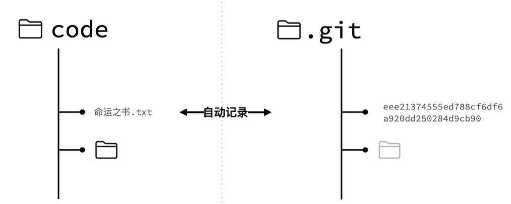
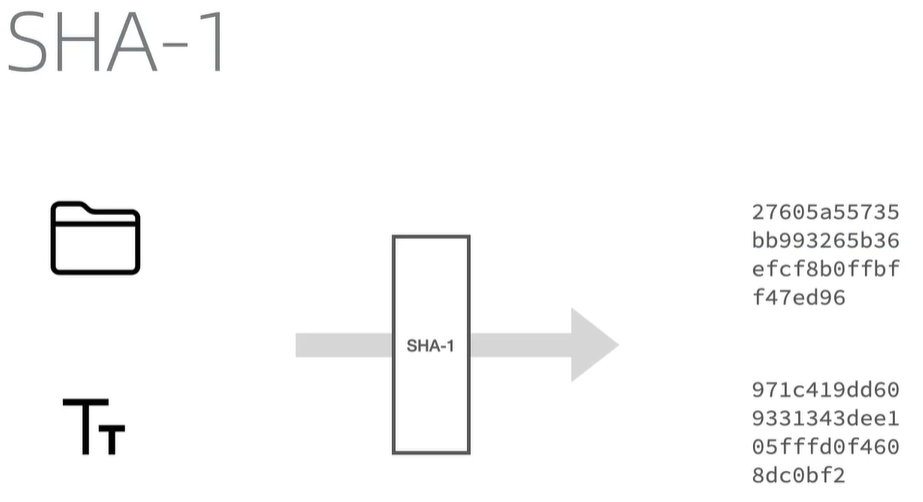
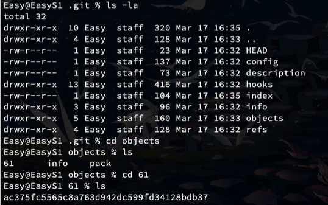
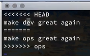
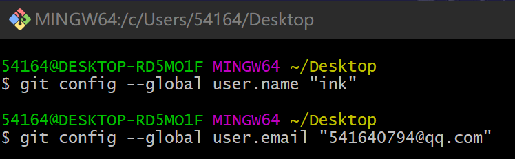
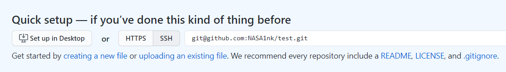
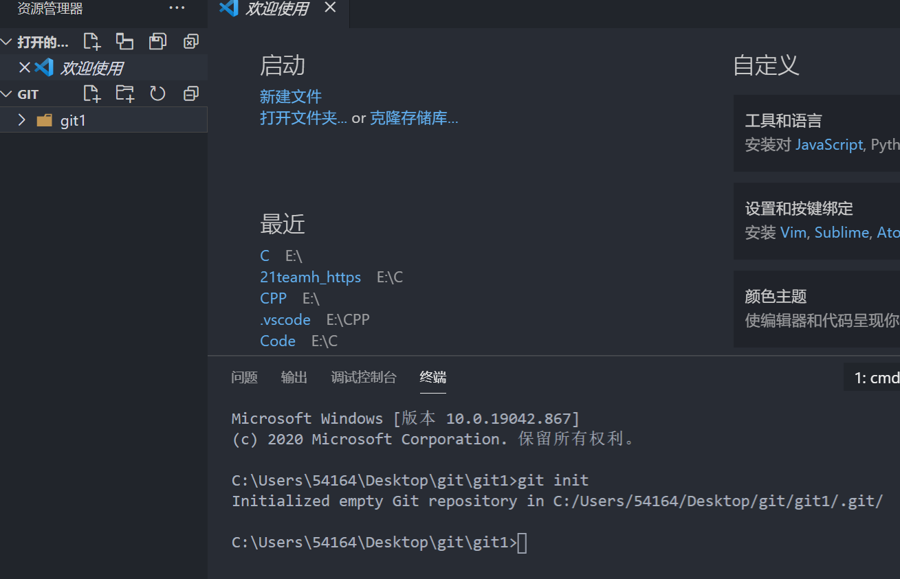
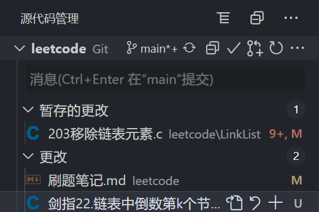
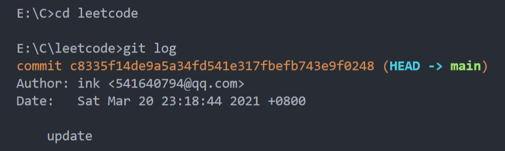
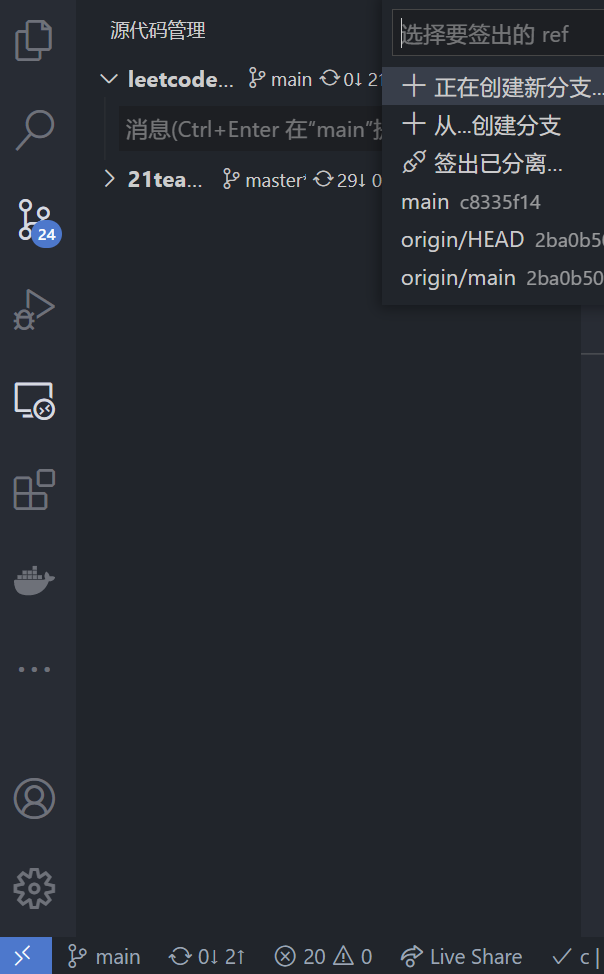

# Git原理

版本管理

- 全量方案
- 增量方案



## 版本库

所有版本信息存放在`.git`文件夹中（不要传上去）

文件命名：使用文件的`SHA-1`值作为文件名

SHA-1是一个哈希函数，使用文件的内容计算出一串数字作为文件特征。这样回滚后相同内同的文件也只会保留一份。



## 目录结构

树形结构

- blob：数据文件（二进制）
- tree：目录结构


使用`object`管理所有的目录结构，并且用SHA-1的前两位对文件分级（避免存储过多，索引太慢）


## 暂存区

本地仓库

- git add
- git commit


## 文件状态


## 快照

`commit`会产生一个新的快照（多次commit形成一条链表），每个对应不同的SHA-1值，HEAD会指向最新的快照

## 协同分支

冲突和合并

合并方式：

- Merge：
  - git checkout
  - git merge
- Rebase（会修改历史，建议本地用）
  - git checkout
  - git rebase
- Cheey-pick（合并某一版本）
  - git checkout
  - git cheery-pick

# Git命令

## 初始化

将文件夹变成仓库（创建隐藏文件夹`.git`）

```bash
git init
```

## 添加

由本地文件添加到暂存区

```bash
#查看已修改的文件
git status

git add filename

#全部加入
git add .
```

## 提交

`git add`后提交到版本库，可以在head文件中看到

> 使用`git log`查看提交历史

```bash
git commit -m "注释"
```

## 撤销

gitjk工具

提示命令，在想撤销的命令后一条输入gitjk（紧挨着）

> 会输出用于撤销的命令

```bash
git add .
gitjk

git commit file_name -m "注释"
gitjk
```

命令

```bash
# 撤销git add
git reset

# 仅取消git add带来的效果，本地的修改还在，但是取消了add的状态
git reset --mixed 

# 撤销git commit
git reset --soft 'HEAD^'()

# 版本回退
git checkout SHA-1

# 版本回退并将之创建为新的分支
git checkout -b SHA-1
```


## 查看

### 查看git仓库

这里面objects下就是存放的文件目录分级

61就是存在的文件的**SHA-1值的前两位**，打开后就是**剩下的SHA-1值**，拼接后才是完整的文件的SHA-1值，就可以定位到文件

```bash
cd .git && ls -la
cd objects && ls -la
```



### 查看文件内容

```bash
git cat-file -p SHA-1
```

### 查看暂存区

```bash
git ls-files --stage
```

### 查看日志

```bash
git log 
```

## 分支

在新的分支上对文件的修改**不会影响**到原来分支上的文件

### 查看分支

```bash
git branch
```

### 创建新分支

```bash
# 创建后不会自动切换到新的分支
git branch branch_name

# 创建新分支并立即切换到该分支下
git checkout -b branch_name
```

### 切换分支

```bash
git checkout branch_name
```

### 修改默认分支

> 修改默认分支为 `main` 分支

```bash
git config --global init.defaultBranch main
```

### 删除分支

```bash
git branch -d branch_name
```

### 合并分支

```bash
#先回到master主分支
git checkout master

#合并分支
git merge branch_name
```

### 分支冲突

假设a分出b和c

a分出的分支b对**原分支**a的合并会直接覆盖，不会冲突

独立无关的分支b和c相互合并则会冲突

- 放弃合并

  ```bash
  git merge -abort
  ```

- 手动修改冲突

  ```bash
  #1.打开冲突文件,git会自动显示冲突的内容（2者均显示）
  #	branch1
  #   <<<< 
  #   file1
  #	====
  #   file2
  #   >>>>
  #   branch2
  
  #2.修改内容，并删除内容外的所有指示符号（<,=,>,branch_name）
  
  #3.重新提交修改后内容
  ```



## 暂存修改

假如在修改的时候需要去pull远程仓库的内容，此时可能报错。所以需要把修改暂存到一个地方

```bash
#1.执行后文件回到修改之前,先pull
git stash

#2.pull后查看之前的修改
git stash list

#3.添加之前的修改
git stash apply

#4.清除暂存的修改
git stash clear
```


# Git配置




# 远程仓库

```bash
git remote
git remote -v
```

## 链接远程仓库

本地一般使用master做主分支，git使用main做主分支，需要修改

添加后，远程库的名字是`origin`（Git默认）



```bash
#1.create a new repository
git init
git add .
git commit -m "first commit"
git branch -M main
git remote add origin git@github.com:NASA1nk/test.git
git push -u origin main

#2.push an existing repository
git remote add origin git@github.com:NASA1nk/test.git
git branch -M main
git push -u origin main

#3.从远程仓库拉取文件,默认origin(main)分支
git pull

#4.提交文件到远程仓库,默认origin(main)分支
git push
```

## 删除远程仓库

```bash
git remote rm name
```

## 修改远程仓库名

```bash
git remote rename old_name new_name
```

## 配置其他仓库

```bash
#1.查看远程仓库分支
git remote

#2.查看远程仓库分支内容
#  可以查看配置的仓库内容进而修改
git remote show branch_name

#3.删除配置
git remote remove branch_name

#4.配置仓库url
git remote add origin repository_url

#5.提交
git push -u origin main
```

# Git工具

## VSCode

1.初始化

新建文件夹，在终端中执行git init



2.在git模块点√提交文件（输入的是commit的注释）

- U：unstage


- M：modified




3.查看历史信息

可以git checkout SHA-1切换版本



4.创建和切换分支

点击左下角的mian图标



5.提交文件

在main图标旁边的就是push按钮