# Git原理

版本管理

- 全量方案
- 增量方案


## 版本库

- 所有版本信息存放在`.git`文件夹中（不会传上去）

- 文件命名
  - 使用文件的`SHA-1`值作为文件名
  - SHA-1是一个哈希函数，**使用文件的内容计算出一串数字作为文件特征**，这样回滚后相同内同的文件也只会保留一份


## 目录结构

树形结构

- `blob`：数据文件（二进制）
- `tree`：目录结构


使用`object`管理所有的目录结构

- 使用SHA-1的前两位对文件分级（避免存储过多，索引太慢）


## 暂存区

本地仓库

- `git add`
- `git commit`


## 文件状态


## 快照

- 每一次`commit`都会产生一个新的快照
  - 多次commit形成一条链表
- 每个快照都对应不同的SHA-1值，HEAD会指向最新的快照

## 协同分支

冲突和合并

合并方式：

- Merge
  - `git checkout`
  - `git merge`
- Rebase（会修改历史，建议本地用）
  - `git checkout`
  - `git rebase`
- Cheey-pick（合并某一版本）
  - `git checkout`
  - `git cheery-pick`


# Git配置

执行`git init`初始化后

当前本地仓库的配置文件如下

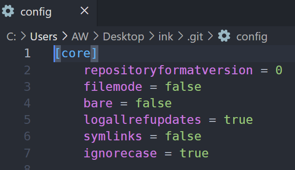

## 配置用户信息

```bash
# 查看当前Git环境所有配置
# 可以配置一些命令别名
git config --list 
```

 

## SSH连接GitHub

在`config`文件中保存着连接的url

- 使用https url，通过git提交的时候要输入用户名和密码
- 使用ssh url，通过git提交的时候不需要繁琐的验证过程

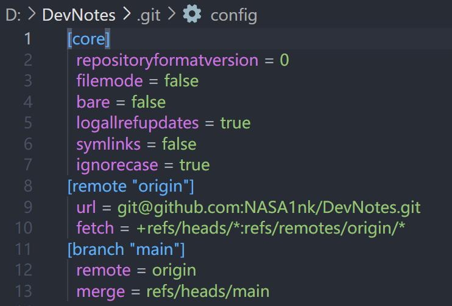

### 创建密钥

在`~/.ssh`目录下生成密钥

```bash
ssh-keygen -t rsa -C "541640794@qq.com"
```

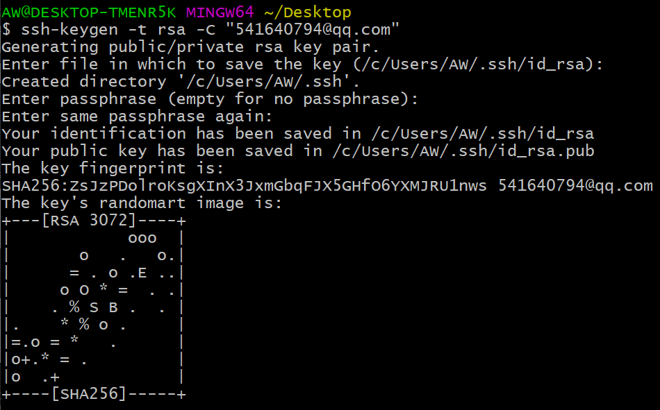

### 获取密钥

将公钥`id_rsa.pub`作为ssh key

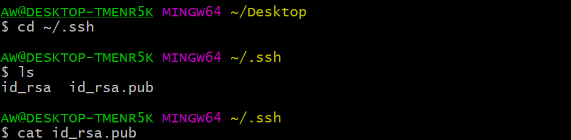

### 创建SSH Key

1. `GitHub-Setting`
2. `SSH and GPG keys`
3. `New SSH key`
4. 复制`id_rsa.pub`即可 


# Git默认编码

使用命令行提交代码的时候会出现中文乱码问题

- 因为UTF-8编码在git默认的配置上不能正常显示

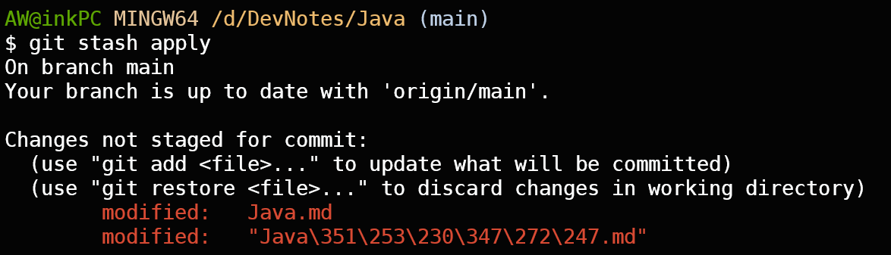

设置编码

- 修改`core.quotepath`参数
  - `core.quotepath`设为`false`就不会对`0×80`以上的字符进行quote，中文显示正常

```bash
# status编码

git config --global core.quotepath false

# gui编码
git config --global gui.encoding utf-8

# commit编码
git config --global i18n.commit.encoding utf-8

# log编码
git config --global i18n.logoutputencoding utf-8
```


linux下

- 进入git安装目录，修改配置

`etc\gitconfig`

```bash
# 代码库统一使用utf-8
[gui]
encoding = utf-8

# log编码 
[i18n]
commitencoding = utf-8

# 支持中文路径  
[svn]
pathnameencoding = utf-8
```


# Git命令

## 初始化

将文件夹变成仓库

- 创建隐藏文件夹`.git`

```bash
git init
```

## 添加到暂存区

由本地文件添加到**暂存区**

```bash
# 查看已修改的文件
git status

git add fileName

# 全部加入
git add .
```

## 提交

### 提交到本地仓库

`git add`后再提交到版本的本地库，可以在`head`文件中看到

- 每个commit都是一个版本

- 使用`git log`查看提交历史，可以查看`commit id`

```bash
git commit -m "注释"
```

### 提交到远程仓库

```bash
git push 远程仓库
```


## 分支

在新的分支上对文件的修改**不会影响**到原来分支上的文件

### 查看分支

```bash
git branch

# 查看远程分支
git branch -r

# 查看本地和远程分支
git branch -a

# 查看远程分支和本地分支的对应关系
git remote show origin
```

### 创建新分支

```bash
# 创建后不会自动切换到新的分支
git branch branch_name

# 创建新分支并切换到该分支下
git checkout -b branch_name
```

### 重命名分支

```bash
# 重命名分支
git branch -m oldName newName 

# -M：强制重命名，即使newName分支存在
git branch -M oldName newName

#= 或者切换到要重命名的分支下执行
git branch -M newName
```

### 切换分支

```bash
git checkout branch_name

# 切换到上一个分支
git checkout -
```

### 修改默认分支

- 修改默认分支为`main`分支

```bash
git config --global init.defaultBranch main
```

### 删除分支

```bash
# 删除本地分支
git branch -d branchName

# 删除远程分支
git branch -d -r branchname 
```

### 合并分支

```bash
#先回到master主分支
git checkout master

#合并分支
git merge branch_name
```

### 分支冲突

假设a分出b和c

a分出的分支b对**原分支**a的合并会直接覆盖，不会冲突

独立无关的分支b和c相互合并则会冲突

- 放弃合并

  ```bash
  git merge -abort
  ```

- 手动修改冲突

  ```bash
  #1.打开冲突文件,git会自动显示冲突的内容（2者均显示）
  #	branch1
  #   <<<< 
  #   file1
  #	====
  #   file2
  #   >>>>
  #   branch2
  
  #2.修改内容，并删除内容外的所有指示符号（<,=,>,branch_name）
  
  #3.重新提交修改后内容
  ```

   

## 暂存修改

假如在修改的时候需要去pull远程仓库的内容，此时可能报错。所以需要把修改暂存到一个地方

```bash
#1.执行后文件回到修改之前,先pull
git stash

#2.pull后查看之前的修改
git stash list

#3.添加之前的修改
git stash apply

#4.清除暂存的修改
git stash clear
```


## 撤销

gitjk工具

提示命令，在想撤销的命令后一条输入`gitjk`（紧挨着）

> 会输出用于撤销的命令

```bash
git add .
gitjk

git commit file_name -m "注释"
gitjk
```

撤销命令

```bash
# 撤销git add
git reset

# 仅取消git add带来的效果，本地的修改还在，但是取消了add的状态
git reset --mixed 

# 撤销git commit
git reset --soft 'HEAD^'()

# 版本回退
git checkout SHA-1

# 版本回退并将之创建为新的分支
git checkout -b SHA-1
```


## 查看

### 查看git仓库

- `objects`下就是存放的文件目录分级

- `61`是存在的文件的**SHA-1值的前两位**，打开后就是**剩下的SHA-1值**
  - 拼接后才是完整的文件的SHA-1值，就可以定位到文件

```bash
cd .git && ls -la
cd objects && ls -la
```

 

### 查看文件内容

```bash
git cat-file -p SHA-1
```

### 查看暂存区

```bash
git ls-files --stage
```

### 查看日志

按q退出

```bash
git log 
```

### 查看区别

`git diff commit_id_1 commit_id_2`

```bash
# 比较两个版本之间的差异
git diff commit_id_1 commit_id_2 > d:/diff.txt
# 结果文件diff.txt中
# "-"号开头的表示 commit_id_2 相对 commit_id_1 减少了的内容。
# "+"号开头的表示 commit_id_2 相对 commit_id_1 增加了的内容。
```

# 远程仓库

`origin`：远程地址的别名

```bash
# 显示远程仓库
git remote

# fetch 和 push
git remote -v

# 查看远程仓库信息
git remote show remoteUrl
```

## 链接远程仓库

- 因为使用命令行创建的存储库的默认分支名称是`master`，而在GitHub中创建的仓库默认分支是`main`，所以需要修改

  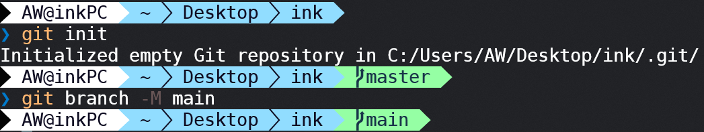

- 远程仓库的名字默认是`origin`


```bash
# 1.create a new repository
git init
git add .
git commit -m "first commit"
# 修改分支名
git branch -M main
# 将本地仓库与远端仓库建立链接
# origin是远程仓库名
git remote add origin git@github.com:NASA1nk/test.git
git push -u origin main
```

## 删除远程仓库

```bash
git remote rm name
```

## 修改远程仓库名

```bash
git remote rename oldName newName
```

## 配置其他仓库

```bash
#1.查看远程仓库分支
git remote

#2.查看远程仓库分支内容
#  可以查看配置的仓库内容进而修改
git remote show branch_name

#3.删除配置
git remote remove branch_name

#4.配置仓库url
git remote add origin repository_url

#5.提交
git push -u origin main
```

# Git工具

## VSCode

1.初始化

新建文件夹，在终端中执行`git init`


2.在git模块点√提交文件（输入的是commit的注释）

- U：unstage


- M：modified 


 

3.查看历史信息

可以`git checkout SHA-1`切换版本

 

4.创建和切换分支

点击左下角的main图标

 

5.提交文件

在main图标旁边的就是push按钮


## IDEA

1. 查看idea中的git配置

   1. 在`settings-Version Control`中点击`Test`，出现git版本号则表示成功

   

2. 配置本地仓库

   1. 在工具栏选择`VCS-Create Git Repository`，选择本地目录
   2. 创建完成后会出现`.git`目录

    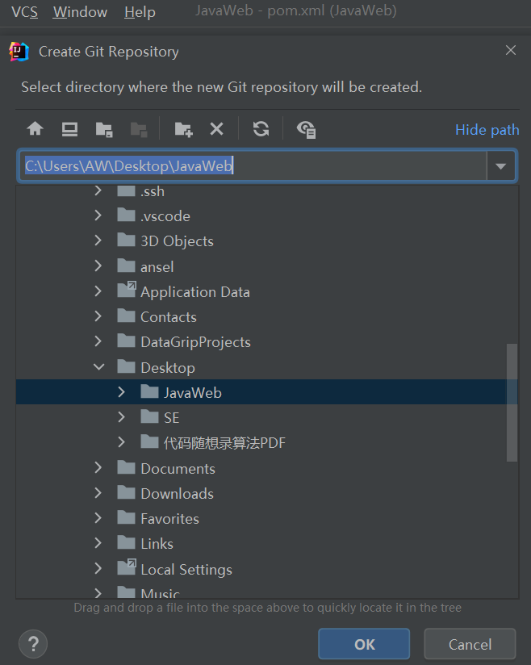

3. 右键想要提交的文件，选择`Git-Add`

   1. 更改或新增的文件颜色会变为红色
   2. `Add`过后的文件颜色会变为绿色

    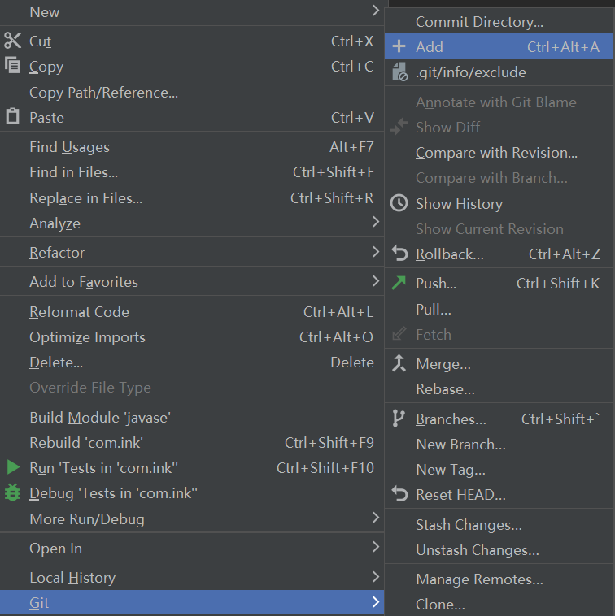

4. 右键想要提交的文件，选择`Git-Commit Directory`

   1. 填写commit message
   2. 上方可以选择或取消文件
   3. 然后点击右下方的`Commit`

   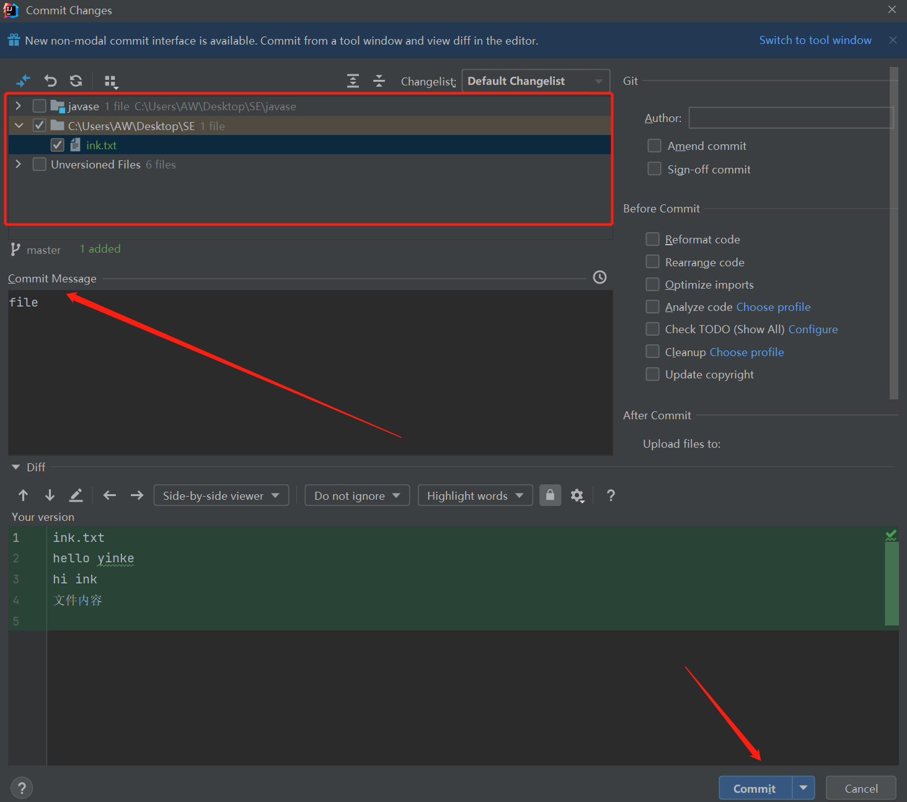

5. 右键要提交的项目，选择`Git-push`

   1. 第一次提交需要链接远程仓库

      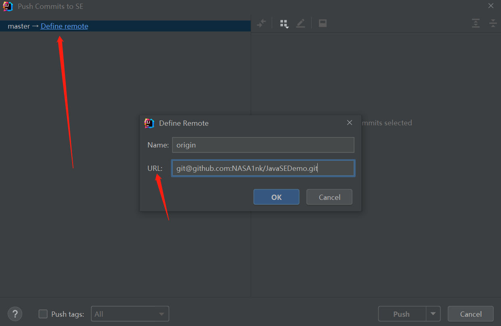

   2. 提交文件到远程仓库

      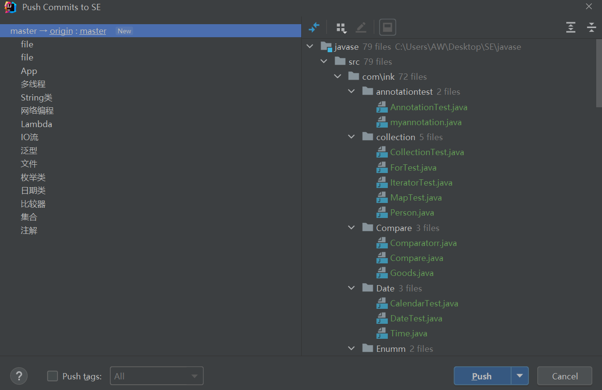

   
   


