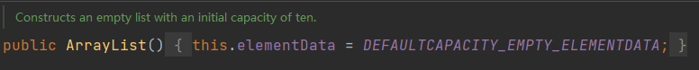
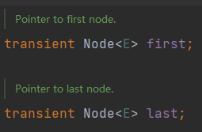
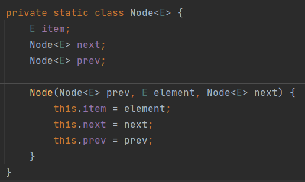
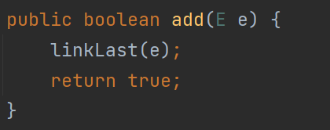
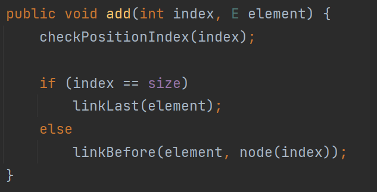
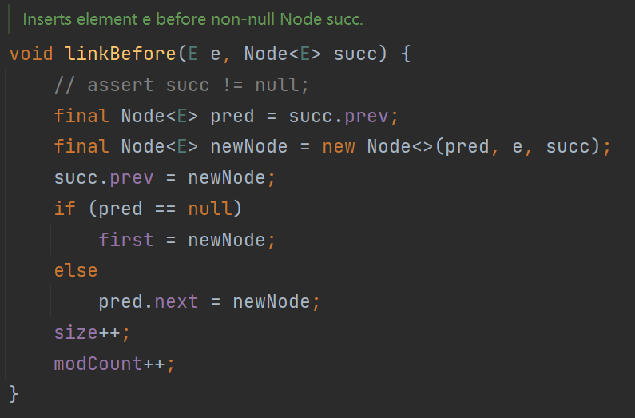
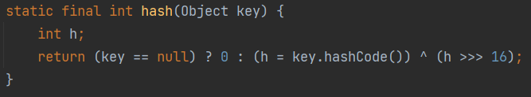

# 集合

## ArrayList

底层基于数组`Object[] elementData`实现

### JDK7

饿汉式

- **直接创建一个初始容量为10的数组**

> 搜索类快捷键：`ctrl+n`
>
> 搜索类中方法快捷键：`ctrl+F12`

````java
// 空参构造器：创建一个初始容量为10的Object数组
ArrayList list = new Arraylist();

// elementData[0] = new Integer(123)
list.add(123);

// 当添加导致容量不够时,默认扩容为原来容量的1.5倍,再将原数组数据复制到新数组中
````

 

### JDK8

懒汉式

- **一开始创建一个长度为0的数组，当添加第一个元素时再创建一个始容量为10的数组**
- 延迟数组的创建时间，节省内存

```java
// 空参构造器：创建一个空的Object[] elementData
// 并没有创建一个长度为10的Object[] elementData
ArrayList list = new Arraylist();

// 创建一个长度为10的Object[] elementData
// elementData[0] = new Integer(123)
list.add(123);

// 当添加导致容量不够时,默认扩容为原来容量的1.5倍,再将原数组数据复制到新数组中
```

 

 

### 扩容

**目的**

- 提高容量以便至少满足最少`minCapacity`大小的容量

> `oldCapacity`为旧容量，`newCapacity`为新容量，`minCapaciyt`为这次扩容最小需要的容量，`MAX_ARRAY_SIZE`是`Integer.MAX_VALUE - 8`

**步骤**

1. 将新容量更新为旧容量的1.5倍（预计要扩容到的容量）
   1. 并不是扩容到`minCapacity + 1`，这是为了避免频繁扩容，所以预先申请1.5倍的容量，采用了空间换时间的思想
2. 检查新容量是否大于最小需要容量，如果小于最小需要容量，那么就把最小需要容量当作数组的新容量
3. 检查新容量是否大于`MAX_ARRAY_SIZE`
   1. 如果大于`MAX_ARRAY_SIZE`，就扩容到int的最大值`Integer.MAX_VALUE`

> 因为数组理论上的最大长度就是`Integer.MAX_VALUE`，`MAX_ARRAY_SIZE`是个别JVM设计上的问题，但并不是说一定因为个别JVM就一定不让扩容到最大长度

 

```java
// 减8是因为有些JVM需要用数组中的8个字节空间去保存header words，如果分配超过MAX_ARRAY_SIZE，可能会OOM
private static final int MAX_ARRAY_SIZE = Integer.MAX_VALUE - 8;

private static int hugeCapacity(int minCapacity) {
    if (minCapacity < 0)
        throw new OutOfMemoryError();
    return (minCapacity > MAX_ARRAY_SIZE) ? Integer.MAX_VALUE : MAX_ARRAY_SIZE;
}
```

### 更新

1. 插入操作需要先检查**是否需要扩容**
2. 插入和删除操作的移位操作都是利用**复制数组**完成

`public static void arraycopy(Object src, int srcPos, Object dest, int destPos, int length)`

```java
// 将index及其之后的所有元素都向后移一位
System.arraycopy(elementData, index, elementData, index + 1, size - index);

// 将index+1及之后的元素向前移动一位，覆盖被删除值
System.arraycopy(elementData, index+1, elementData, index, numMoved);
```

## LinkedList

底层使用**双向链表**存储

- 存储元素过程中无需像`ArrayList`那样进行扩容

```java
// 内部声明了Node（双向链表）类型的first和last属性，默认为NULL
LinkedList list = new LinkedList();

// 将123封装到Node中（相当于创建了Node对象）
list.add(123);
```

 

 

### 插入

**在链表尾部插入元素**

1. 创建节点，并指定节点前驱为链表尾节点`last`，后继引用为`null`
2. 将`last`引用指向新节点
3. 判断尾节点是否为空
   1. 尾节点为空表示当前链表还没有节点
4. 让原尾节点后继引用`next`指向新的尾节点`newNode`

 

 


**在指定位置插入元素**

1. 判断index是否是链表尾部位置，如果是，直接将元素节点插入链表尾部即可
2. 如果不是，调用`linkBefore(E e, Node<E> succ)`将元素节点插入到`succ`之前的位置
   1. 初始化节点`newNode`，并指明前驱`pred`和后继`succ`
      1. `pred`是`succ`之前的前驱
   2. 将`succ`的前驱引用`prev`指向新节点`newNode`
   3. 判断尾节点是否为空
      1. 尾节点为空表示当前链表还没有节点
   4. 将`pred`的后继引用指向新节点`newNode`

> 就是链表插入操作

 




## HashMap

### JDK7

底层结构：**数组+链表**

1. 底层数组是`Entry[]`
   1. 实例化对象后，底层创建了**长度为16**的一维数组`Entry[]`
2. 使用链表解决哈希冲突

### JDK8

底层结构：**数组+链表+红黑树**

1. 底层数组是`Node[]`（`Node<K,V>[] table`）
   1. 实例化对象后，底层**并不直接创建**了长度为16的一维数组
   2. 调用`put()`方法后，底层才创建**长度为16**的一维数组`Node[]`

#### 红黑树

当满足两个条件时，执行**链表转红黑树**操作（树化）

1. 数组的某个位置上以链表形式存在的**数据个数 > 8**（默认阈值为 8）
2. 当前**数组长度 > 64**

> 此位置上所有的**数据改为使用红黑树存储**，以此来加快搜索速度
>
> 如果不满足条件，则对数据扩容

#### 存储过程

调用`key`所在类的`hascode()`方法计算`key`的hashcode值，通过**散列函数**找到`key`在`Entry`数组中的存放位置

- 如果此位置没有数据，直接添加`key:value`
- 如果此位置有数据，逐一比较`key`和已经存在的数据的hashcode值
  - 如果`key`和已经存在数据的hashcode值都不同，则**以链表的方式**添加`key:value`
  - 如果`key`和已经存在的某个数据的hashcode值相同，则再调用`equals()`方法比较
    - 如果返回`false`，则**以链表的方式**添加`key:value`
    - 如果返回`true`，则执行覆盖操作
      - 将要添加的`value`**替换已经存在的相同数据**的`value`值

#### 常量

- `DEFAULT_INITIAL_CAPACITY`：HashMap的默认容量（16）
- `MAXIMUM_CAPACITY`：HashMap支持的最大容量（2<sup>30</sup>）
- `DEFAULT_LOAD_FACTOR`：HashMap的默认负载因子（0.75）
- `TREEIFY_THRESHOLD`：Bucket中存储的`Node`个数大于该默认值时转化为红黑树（8）
- `UNTREEIFY_THRESHOLD`：Bucket中红黑树存储的`Node`个数小于该默认值时转化为链表（6）
- `MIN_TREEIFY_CAPACITY`：Bucket中的`Node`被树化时最小的hash表容量（64）
- `entrySet`：HashMap存储具体元素的集合
- `size`：HashMap存储的键值对的数量
- `modCount`：HashMap扩容和结构改变的次数
- `loadFactor`：填充因子`DEFAULT_LOAD_FACTOR`
- `threshold`：HashMap扩容的临界值（**容量*负载因子**：16*0.75 = 12）

##### Bucket

`Node`数组中可以**存放元素的位置**称之为桶（Bucket）

- 每个Bucket都有一个对应的索引
  - 可以根据索引快速的查找到Bucket中存储的元素

- 每个Bucket中存储一个`Node`对象，每一个`Node`对象可以带一个引用变量（用于指向下一个元素）
  - 所以在一个Bucket中可能是一个`Node`链


- 当Bucket中存储的`Node`个数大到需要转化红黑树存储时，如果HashMap的容量小于`MIN_TREEIFY_CAPACITY`，执行`resize()`扩容而不转化为红黑树

> `MIN_TREEIFY_CAPACITY`的值至少是`TREEIFY_THRESHOLD`的4倍

##### 负载因子

`threshold`

- 按照其他语言的参考及研究经验，会考虑将负载因子设置为0.7~0.75，此时**平均检索长度接近于常数**

负载因子的大小决定了HashMap的**数据密度**

- 负载因子越大，密度越大，**发生碰撞的几率越高**，数组中的链表越容易长，造成查询或插入时的比较次数增多，性能会下降

- 负载因子越小，**越容易触发扩容**，数据密度也越小，意味着发生碰撞的几率越小，数组中的链表也就越短，查询和插入时比较的次数也越小，性能会更高
  - 但是会浪费一定的内存空间。而且**经常扩容也会影响性能**，建议初始化预设大一点的空间

> 当超出`threshold`值时，如果要存放的位置非空，则默认扩容为原来容量的2倍
>

 


#### 扩容

扩容后需要重新计算所有元素存放的位置

 

HashMap索引计算

 

`tab[i = (n - 1) & hash]`

- 当HashMap长度为$2^n$时，模运算`%`可以变换为按位与`&`运算：`X % length = X & (length - 1)`
  - 位运算`&`是要比模运算`%`效率高出很多
  - 所以要求HashMap的容量必须为$2^n$

```java
final V putVal(int hash, K key, V value, boolean onlyIfAbsent,
               boolean evict) {
    Node<K,V>[] tab; Node<K,V> p; int n, i;
    // 把当前的table赋值给tab
    if ((tab = table) == null || (n = tab.length) == 0)
        // 首次进入,使用resize()创建数组
        n = (tab = resize()).length;
    // 找到对应位置,查看是否有数据
    if ((p = tab[i = (n - 1) & hash]) == null)
        // 为空直接添加
        tab[i] = newNode(hash, key, value, null);
    else {
        // p是现有数据(第一个)的值
        Node<K,V> e; K k;
        // 先判断hashcode值
        if (p.hash == hash &&
            ((k = p.key) == key || (key != null && key.equals(k))))
            // 相同的话，把p添加到e中
            e = p;
        else if (p instanceof TreeNode)
            e = ((TreeNode<K,V>)p).putTreeVal(this, tab, hash, key, value);
        else {
            // 和第一个数据的hashcode值不相等
            // 依次和所有的数据比较
            for (int binCount = 0; ; ++binCount) {
                // 只有一个元素
                if ((e = p.next) == null) {
                    
                    p.next = newNode(hash, key, value, null);
                    if (binCount >= TREEIFY_THRESHOLD - 1) // -1 for 1st
                        treeifyBin(tab, hash);
                    break;
                }
                // 还有元素，继续比较
                // 上面判断已经赋值了e = p.next
                if (e.hash == hash &&
                    ((k = e.key) == key || (key != null && key.equals(k))))
                    break;
                p = e;
            }
        }
        if (e != null) { 
            // existing mapping for key
            V oldValue = e.value;
            if (!onlyIfAbsent || oldValue == null)
                // key相等时替换对应的value
                e.value = value;
            afterNodeAccess(e);
            return oldValue;
        }
    }
    ++modCount;
    if (++size > threshold)
        resize();
    afterNodeInsertion(evict);
    return null;
}
```

```java
final Node<K,V>[] resize() {
    Node<K,V>[] oldTab = table;
    // 首次进入oldCap，oldThr均为0
    int oldCap = (oldTab == null) ? 0 : oldTab.length;
    int oldThr = threshold;
    int newCap, newThr = 0;
    if (oldCap > 0) {
        if (oldCap >= MAXIMUM_CAPACITY) {
            threshold = Integer.MAX_VALUE;
            return oldTab;
        }
        else if ((newCap = oldCap << 1) < MAXIMUM_CAPACITY &&
                 oldCap >= DEFAULT_INITIAL_CAPACITY)
            newThr = oldThr << 1; // double threshold
    }
    else if (oldThr > 0) // initial capacity was placed in threshold
        newCap = oldThr;
    else {               
        // zero initial threshold signifies using defaults
        // 首次进入执行,newCap = 16
        newCap = DEFAULT_INITIAL_CAPACITY;
        // newThr = 16*0.75 = 12
        newThr = (int)(DEFAULT_LOAD_FACTOR * DEFAULT_INITIAL_CAPACITY);
    }
    if (newThr == 0) {
        float ft = (float)newCap * loadFactor;
        newThr = (newCap < MAXIMUM_CAPACITY && ft < (float)MAXIMUM_CAPACITY ?
                  (int)ft : Integer.MAX_VALUE);
    }
    // threshold = 12
    threshold = newThr;
    @SuppressWarnings({"rawtypes","unchecked"})
    // newCap = 16,创建好了长度为16的数组
    Node<K,V>[] newTab = (Node<K,V>[])new Node[newCap];
    table = newTab;
    if (oldTab != null) {
        for (int j = 0; j < oldCap; ++j) {
            Node<K,V> e;
            if ((e = oldTab[j]) != null) {
                oldTab[j] = null;
                if (e.next == null)
                    newTab[e.hash & (newCap - 1)] = e;
                else if (e instanceof TreeNode)
                    ((TreeNode<K,V>)e).split(this, newTab, j, oldCap);
                else { // preserve order
                    Node<K,V> loHead = null, loTail = null;
                    Node<K,V> hiHead = null, hiTail = null;
                    Node<K,V> next;
                    do {
                        next = e.next;
                        if ((e.hash & oldCap) == 0) {
                            if (loTail == null)
                                loHead = e;
                            else
                                loTail.next = e;
                            loTail = e;
                        }
                        else {
                            if (hiTail == null)
                                hiHead = e;
                            else
                                hiTail.next = e;
                            hiTail = e;
                        }
                    } while ((e = next) != null);
                    if (loTail != null) {
                        loTail.next = null;
                        newTab[j] = loHead;
                    }
                    if (hiTail != null) {
                        hiTail.next = null;
                        newTab[j + oldCap] = hiHead;
                    }
                }
            }
        }
    }
    return newTab;
}
```

