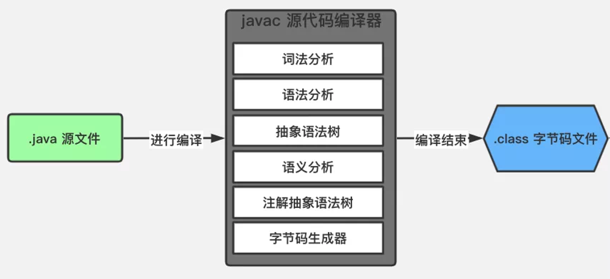
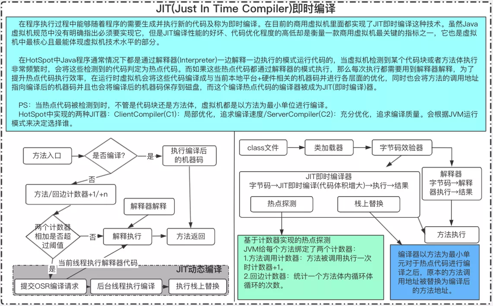
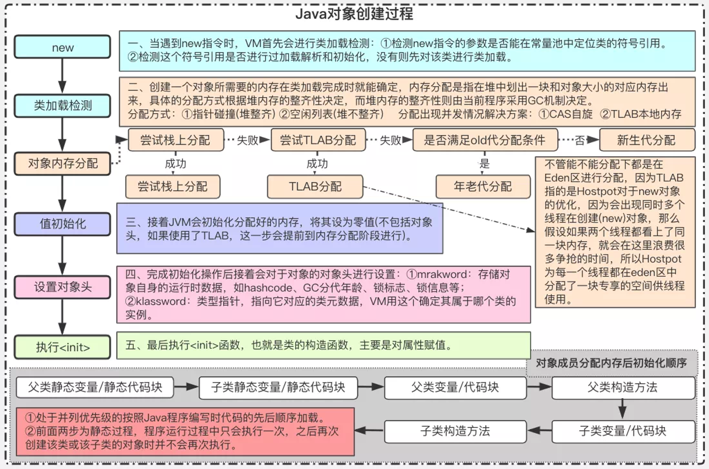

# 字节码

在 Java 中，JVM可以理解的代码就叫做字节码（即扩展名为 `.class` 的文件）

- 它不面向任何特定的处理器，**只面向虚拟机**
- Java 语言通过字节码的方式，在一定程度上**解决了传统解释型语言执行效率低的问题**，同时又保留了解释型语言可移植的特点

**运行过程**

1. `.java`文件通过javac编译成`.class`文件
2. `.class`文件通过解释器和JIT编译成机器码

## 编译与解释

高级编程语言按照**程序的执行方式**分为两种

- **编译型语言**
  - 通过编译器将源代码**一次性翻译**成可被该平台执行的机器码
  - 一般情况下，编译语言的执行速度比较快，开发效率比较低
  - 常见的编译性语言有C、C++、Go、Rust等
- **解释型语言** 
  - 通过**解释器一句一句**的将代码解释（interpret）为机器代码后再执行
  - 解释型语言开发效率比较快，执行速度比较慢
  - 常见的解释性语言有Python、JavaScript、PHP等

**编译与解释共存**

- 首先由Java**编译器**将源程序**一次性编译**成`.class`字节码文件
- JVM**类加载器**加载字节码文件，然后通过解释器**逐行解释**执行
- 编译+解释的方式比较慢，考虑到有些方法和代码块是经常需要被调用的（所谓的热点代码），于是引进了 JIT（just-in-time compilation） **编译器优化**
  - JIT属于**运行时编译**

  - 当JIT编译器完成第一次编译后，会**将字节码对应的机器码保存到磁盘中，下次可以直接使用**

> HotSpot采用了惰性评估（Lazy Evaluation）的做法，根据二八定律，消耗大部分系统资源的只有那一小部分的代码（热点代码），这也就是JIT所需要编译的部分
>
> 由于java对于多种不同的操作系统有不同的JVM，所以 Java实现了真正意义上的跨平台

# 内存区域

**运行时数据区**

## 程序计数器

Program Counter **Register**

- **线程私有**
- 保证线程切换时能正确恢复

## 虚拟机栈

Java Virtual Machine **Stack**

- **线程私有**
- 每个方法被执行时，JVM都会创建一个**栈帧**
  - **栈帧用来保存参数，局部变量，中间计算过程和其他数据**
- 栈中的**局部变量表**存放编译时可知的**基本数据类型变量和对象的引用变量**
  - 数据类型在表中的存储空间表示为局部变量槽
  - 所需要的内存空间在编译时确定，**方法运行期间不会改变大小**

- **栈中存放对象引用**，但是对象不在栈中，而是存放在堆中（new出来的对象）或常量池中（字符串常量）

## 本地方法栈

Native Method **Stack**

- **线程私有**
- 为本地方法服务

## 堆

Java **Heap**

- **被所有线程共享**
- JVM管理的内存区域的最大的一块内存
- 几乎所有**对象实例和数组**都存放在堆中（在堆上为其分配内存）
  - 有的对象在栈上分配
- **垃圾收集器管理的主要内存区域，也称为GC堆**
  - 收集器基本都采用**分代垃圾收集算法**，所以堆还可以细分为新生代和老年代
    - 进一步划分的目的是更好地回收内存，以及更快地分配内存
    - jdk8移除整个永久代，取而代之的是一个叫元空间（Metaspace）的区域
- 堆可以划分出多个**线程私有的分配缓冲区TLAB**
  - TLAB：**Thread** Local Allocation Buffer
  - 为了更好的回收，以及更快的分配内存
- 堆可以处于物理上不连续的内存空间，**但逻辑上应该被视为连续的**

## 方法区

Method Area

- **被所有线程共享**
- 存储被JVM加载的**类型信息，常量，静态变量**
- 为了让GC可以像管理堆一样管理方法区，HotSpot虚拟机在JDK8之前使用**永久代**来实现方法区

### 运行时常量池

- 在堆中
  - JDK7及之后版本的JVM将运行时常量池**从方法区中移了出来**，在Java**堆中**开辟了一块区域存放运行时常量池

- `.class`文件中有一项**常量池表**（Constant Pool Table），存放编译时生成的各种**字面量和符号引用**，在**类加载后**存放在运行时常量池中
- 不同于`.class`文件中的常量池表，**运行时常量池具有动态性**
  - 运行期间可以将新的常量放入池中

### 直接内存

Direct Memory

- **不是JVM中定义的内存区域，也不是JVM运行时数据区的一部分**
  - 受本机内存和处理器寻址空间限制
- JDK1.4引入了NIO（`New Input/Ouput`）类，引入了基于**通道**（Channel）和**缓冲区**（Buffer）的I/O方式
  - 使用`Native`函数直接分配**堆外内存**，然后通过存储在堆中的`DirectByteBuffer`对象作为这块**内存的引用**进行操作

## 对象

HotSpot虚拟机在**堆（heap）**中操作对象

### 对象的创建

**`new`+普通的Java对象**：只要使用`new`方法，便需要创建新的对象

> 还有复制，反序列化出对象，还有数组和`class`对象
>

1. JVM检查指令参数能否**在常量池中定位到一个类的符号引用**，并且进行**类加载检查**

   1. 检查符号引用代表的类是否已经被加载，解析和初始化，如果没有，则需要先执行相应的类加载过程

2. JVM为对象分配内存，**分配空间大小在类加载完成后就可以确定**，JVM从堆中划分一块区域，划分方法取决于**堆内存的规整性**，堆内存的规整性由使用的**垃圾收集器是否能进行空间压缩整理**所决定的

   1. **堆内存规整**：采用**指针碰撞**（Bump The Pointer）的分配方式
      1. 使用过的内存和未使用的内存之间**用一个指针作为分界指示器**
      2. 分配内存只需要将指针向空闲内存方向挪动对象大小的距离
   2. **堆内存不规整**：采用**空闲列表**（Free List）的分配方式
      1. 使用过的内存和未使用的内存交织在一起，需要**维护一个列表来记录未使用的内存块**
      2. 从列表上找到一个足够大的空间分配给对象实例，然后更新表

3. 并发场景下的内存分配（线程不安全）

   > 可能在给对象A分配内存的时候，给对象B同时分配内存，并且使用了同一个指针

   1. **本地线程分配缓冲**（TLAB：Thread Local Allocation Buffer）
      1. 将内存分配的动作根据线程划分在不同空间之间进行
      2. 给每个线程预先在堆内存中分配一块区域，即TLAB，线程分配内存时，就在TLAB中分配
      2. **TLAB用完后才使用同步锁定在堆中分配**
   2. **CAS自旋**

4. JVM**将分配的内存空间初始化为零值**

   1. 如果有TLAB，则可以提前到TLAB分配时初始化
   2. 保证对象实例在代码中**不赋初始值也可以直接使用**

5. JVM设置对象信息，存放在**对象头**（Object Header）中

   1. 对象是哪个类的实例
   2. 对象的hashcode值
   3. 对象的GC分代年龄

6. 按照代码的意愿（**构造函数**）初始化对象，构造出一个真正可用的对象实例

   1. 执行`.class`文件的`<init>()`方法

### 并发场景下的内存分配

在实际开发过程中，创建对象是很频繁的事情，虚拟机必须要保证线程是安全的，通常虚拟机采用两种方式来**保证线程安全**

- **CAS+失败重试**
  
  - CAS是乐观锁的一种实现方式
  - **虚拟机采用CAS配上失败重试的方式保证更新操作的原子性**
  
  > 乐观锁：每次不加锁而是假设没有冲突而去完成某项操作，如果因为冲突失败就重试，直到成功为止
  
- **TLAB**
  
  - **为每一个线程预先在Eden区分配一块儿内存**
  - JVM在给线程中的对象分配内存时，首先在TLAB分配
  - 当对象大于TLAB中的剩余内存或TLAB的内存已用尽时，再采用上述的CAS进行内存分配

## 对象的内存布局

对象在堆内存中的存储布局

### **对象头**

Header

- **Mark Word**：存储对象自身的运行时数据
  - hashcode值
  - GC分代年龄
  - 锁状态标志
  - **线程持有的锁**
- **类型指针**：对象指向它的类型元数据的指针
  - JVM通过指针来确定**是哪个类的对象实例**

### 实例数据

Instance Data

- 对象的有效信息，即代码中定义的**字段内容**
- 相同宽度的对象会被放在一起
  - 父类中定义的变量会放在子类之前

### 对齐填充

Padding

- 非必须，HotSpot虚拟机要求对象的起始地址是8字节的整数倍

## 对象的访问定位

Java程序通过**栈中的对象引用来操作堆中的对象**

JVM决定引用来定位访问对象的实现

- **句柄访问**：Java堆中会划分出一块内存作为**句柄池**
  - 引用中存放**对象的句柄地址**
  - 句柄中存放**对象实例数据**和**对象类型数据**的具体地址信息
  - 在对象被移动时只需要修改句柄中的实例地址，引用中的句柄地址不变
- **直接指针访问**：需要考虑如果存放**对象类型数据**信息
  - 引用中存放的直接就是对象在堆中的地址
  - 少一次间接访问的开销

# 垃圾收集器

GC：Garbage Collection

**考虑问题**：哪些内存需要回收，什么时候回收，如何回收

> GC比Java久

**确定性**

- 程序计数器，虚拟机栈，本地方法栈**随线程创建，消亡**
- 栈帧**随方法的进入，退出执行出入栈**
- 当方法或线程结束时，内存就回收了

**不确定性**

- Java**堆和方法区**，这些内存的回收是动态的

Java自动内存管理最核心的功能是**堆内存中对象的分配与回收**

## 对象死亡

堆内存中几乎存放着所有的对象实例，堆垃圾回收前**要判断哪些对象已经死亡**，即不能再被任何途径使用的对象

### 引用计数算法

给对象添加一个**引用计数器**。每当有一个地方引用它，计数器就加1，当引用失效，计数器就减1

- 任何时候**计数器为0的对象就是不能再被使用的**

引用计数法实现简单，效率高，但是**目前主流的虚拟机中并没有选择这个算法来管理内存**

- 其最主要的原因是它很**难解决对象之间相互循环引用的问题**

- 对象之间的**相互引用会导致它们的引用计数器都不为0**，于是引用计数算法无法通知GC回收器回收它们

### 可达性分析算法

通过一系列的称为**GC Roots**的对象作为起点集，从这些节点开始，根据引用关系向下搜索，**搜索过程所走过的路径称为引用链**（Reference Chain）

- 当一个对象到GC Roots之间没有任何引用链的话，**则GC Roots到此对象不可达**，此对象就是不能再被使用的

> Java，c#都是用此方法进行GC

### 自我拯救

**不可达的对象不一定一定死亡**

- **即使在可达性分析法中不可达的对象，也并非是非死不可的**
- 要真正宣告一个对象死亡，**至少要经历两次标记过程**
  - 可达性分析法中**不可达的对象被第一次标记并且进行一次筛选**，筛选的条件是此对象是否有必要执行`finalize()`方法
    - 当对象没有覆盖`finalize()`方法，或`finalize()`方法已经被JVM调用过时，JVM会将这两种情况视为**没有必要执行**
  - **被判定为需要执行的对象将会被放在一个队列中进行第二次标记**
  - 除非这个对象进行**自我拯救**：与引用链上的任何一个对象建立关联，否则就会被真的回收（真的死亡）

> 当一个对象被判定要执行`finalize()`方法时，该对象会被放置在一个F-Queue队列中
>
> - 然后由JVM自动建立的Finalizer线程去执行它们的`finalize()`方法
> - 但不一定会等待它们运行结束，因为如果某一个对象的`finalize()`方法执行缓慢或者陷入了死循环，那么其他对象就要永久等待，甚至可能导致整个内存回收子系统崩溃
> - 任何一个对象的`finalize()`方法都只会执行一次，如果对象面临下一次回收，它的`finalize()`方法不会再执行

### 引用

无论是通过引用计数算法判断对象引用数量，还是通过可达性分析算法判断对象的引用链是否可达，**判定对象的存活都与引用有关**

- JDK1.2前，引用的定义是**如果reference类型的数据存储的数值代表的是另一块内存的起始地址，就称这个数据是代表某块内存或某个对象的引用**，这种定义下只有引用和被引用的概念，不够具体

- JDK1.2后扩充了引用的概念，下面4种引用强度逐渐减弱

  - **强引用**

  - **软引用**

  - **弱引用**

  - **虚引用**

#### 强引用

- 强引用就是最传统的引用，即程序中普遍存在的**引用赋值**
- **如果一个对象具有强引用，垃圾回收器就绝不会回收它**
- 当内存空间不足时，JVM宁可抛出OutOfMemoryError使程序异常终止，也不会靠随意回收具有强引用的对象来解决内存不足问题

#### 软引用

- 如果一个对象只具有软引用，**如果内存空间足够，垃圾回收器就不会回收它**，**如果内存空间不足，就会回收这些对象的内存**
  - 如果回收后内存空间还是不足，JVM才会抛出`Out Of Memory Error`
- 只要垃圾回收器没有回收具有软引用的对象，它就可以被程序使用
- **软引用可用来实现内存敏感的高速缓存**
- 软引用可以和一个引用队列（ReferenceQueue）联合使用
  - 如果软引用所引用的对象被垃圾回收，JVM就会把这个软引用加入到与之关联的引用队列中

#### 弱引用

- 弱引用与软引用的区别在于：**只具有弱引用的对象拥有更短暂的生命周期**
- 如果一个对象只具有弱引用，它只能生存到下一次垃圾回收为止
  - 不管当前内存空间足够与否，都会回收弱引用对象的内存
  - 不过由于垃圾回收器是一个优先级很低的线程， 因此它不一定会很快发现那些只具有弱引用的对象
- 弱引用可以和一个引用队列（ReferenceQueue）联合使用
  - 如果弱引用所引用的对象被垃圾回收，JVM就会把这个弱引用加入到与之关联的引用队列中

#### 虚引用

- 又叫**幽灵引用**和**幻影引用**，是最弱的一种引用关系
- 虚引用与其他几种引用都不同，虚引用并不会决定对象的生命周期
- **如果一个对象仅持有虚引用，那么它就和没有任何引用一样，在任何时候都可能被垃圾回收**
- 虚引用的作用只是在垃圾回收时可以收到通知，可以用来跟踪对象被垃圾回收的活动

- 虚引用与软引用和弱引用的一个区别在于： **虚引用必须和引用队列（ReferenceQueue）联合使用**
  - 当垃圾回收器准备回收一个对象时，如果发现它还有虚引用，就会在回收该对象的内存之前把这个虚引用加入到与之关联的引用队列中
  - 程序可以通过判断引用队列中是否已经加入了虚引用来了解被引用的对象是否将要被垃圾回收
  - 程序如果发现某个虚引用已经被加入到引用队列，那么就可以在所引用的对象的内存被回收之前采取必要的行动 

> 在程序设计中一般很少使用弱引用与虚引用，使用软引用的情况较多。因为**软引用可以加速JVM对垃圾内存的回收速度，可以维护系统的运行安全，防止内存溢出（OutOfMemory）等问题的产生**

### 回收方法区

- JVM规范不要求在方法区中实现垃圾收集

方法区的垃圾收集主要是回收**废弃的常量**和**不再使用的类型**

#### 废弃常量

**运行时常量池**主要回收的是废弃的常量

- 如果**当前没有任何字符串对象引用常量池中的字符串常量的话**，就说明该常量是废弃常量
- 如果这时发生内存回收的话**而且有必要的话**，字符串常量就会被系统清理出常量池

> JDK1.7后JVM将运行时常量池从方法区中移了出来，在堆（Heap）中开辟了一块区域存放运行时常量池

#### 无用类

不再使用的类型需要同时满足3个条件 

- **该类所有的实例都已经被回收**，即堆中不存在该类的任何实例
- **加载该类的ClassLoader已经被回收**
- 该类对应的`java.lang.Class`对象没有在任何地方被引用，**无法在任何地方通过反射访问该类的方法**

> JVM可以对无用类进行回收，但并不会和死亡对象一样必然被回收

## 垃圾收集算法

内存回收的方法论（思想）

- 引用计数式垃圾收集：Reference Counting GC
- **追踪式垃圾收集**：Tracing GC

> 主流JVM使用追踪式GC，后续算法均为追踪式

### 标记-清除算法

最基础的收集算法，效率也很高。分为**标记**和**清除**两个阶段

1. 首先标记出所有需要回收的对象
   1. 标记过程就是判断对象是否死亡的过程

2. 在标记完成后**统一回收所有被标记的对象**

**存在问题**

- 效率问题：大量的对象都是需要回收的，所以需要大量的标记和清除
- 空间问题：标记清除后会**产生大量不连续的碎片**
  - 分配大对象时会因为内存不够不得不提前触发另一次垃圾收集

### 标记-复制算法

为了**解决效率问题**而设计的复制收集算法

1. 它可以将**内存分为大小相同的两块**，每次使用其中的一块
2. 当这一块的内存使用完后，**就将还存活的对象复制到另一块中**，然后再把使用的空间一次清理掉
3. 这样就使每次的内存回收都是**对内存区间的一半进行回收**

**存在问题**

- 可用内存变成原来的一半
- 如果对象多数都是存活的，会产生大量的内存间复制开销

**复制算法多用于新生代，因为新生代的对象98%都要被回收，所以也不需要划分成大小相同的两块，而是将新生代划分为一块较大的eden空间和两块较小的survivor空间**

- 每次分配内存只是用eden和survivor1的空间
- 垃圾收集时，将eden和survivor1中仍然存活的对象一次性复制到survivor2中，然后直接清理掉eden和survivor1的空间
- 当survivor2的空间不够一次Minor GC之后的存活对象时，就需要依赖其他内存区域进行**分配担保**
  - 大多是老年代，即将对象直接放入老年代

> eden和survivor的比例是8:1，即新生代可用的空间是90%（80%eden + 10%survivor1）

### 标记-整理算法

考虑到复制算法效率低的问题，根据**老年代的特点**设计的一种标记算法

- **标记过程和标记-清除算法一样**
- 但不直接对可回收对象回收，而是**让所有存活的对象向一端移动，然后直接清理掉端边界以外的内存**
  - **对象移动时必须全部暂停用户线程才能进行**，这种**停顿**被称为Stop The World

> 标记-清除算法不移动对象停顿时间会更短（甚至没有），但从整个程序的吞吐量来看，移动会更划算

### 分代收集算法

**分代理论**

符合大多数程序实际运行的经验法则

- **弱分代假说**：绝大多数对象都是朝生夕灭的
- **强分代假说**：熬过越多次的GC的对象就越难以消亡
  - 熬过多少次即为对象的**年龄**

**所以收集器应该将堆划分成不同的区域，然后将对象依据年龄分配到不同的区域中存储**

- 对于朝生夕灭的对象，集中管理，只需要关心少数存活的对象
  - 可以以较低的代价回收大量的空间
- 剩下难以消亡的对象，集中管理
  - 可以以较低的频率回收空间

**所以一般将堆划分为新生代和老年代，新生代中每次垃圾收集都有大量的对象消亡，回收后的少量对象就会逐步移到老年代中存放**

划分不同的区域后，垃圾收集器就可以回收部分或多个区域，就出现了一些回收类型

- **Partial GC**：部分收集，目标不是完整的堆的垃圾收集

  - **Minor GC**：新生代收集，目标只是新生代的垃圾收集
    - **Minor GC非常频繁，回收速度一般也比较快**
  - **Major GC**：老年代收集，目标只是老年代的垃圾收集
    - **只有CMS收集器会有老年代收集**
    - Major GC的速度一般会比Minor GC的慢10倍以上
  - **Mixed GC**：混合收集，目标是整个新生代和部分老年代的垃圾收集
    - 只有G1收集器会有混合收集
- **Full GC**：整堆收集，收集整个堆和方法区的垃圾收集

> 分代的困难：对象不是孤立的，对象之间会存在跨代引用
>
> - 新生代的对象可能被老年代引用

当前虚拟机的垃圾收集都采用分代收集（Generational Collection）算法

- 分代收集算法根据**对象存活周期**的不同将内存分为几块
- 一般**将Java堆分为新生代和老年代**，这样就可以根据各个年代的特点选择合适的垃圾收集算法
  - 比如在新生代中，每次垃圾收集都会有大量对象死去，所以可以选择**复制算法**
    - 只需要付出少量对象的复制成本就可以完成垃圾收集
  - 老年代的对象存活几率比较高，而且没有额外的空间对它进行分配担保，所以必须选择**标记-清楚**或**标记-整理**算法进行垃圾收集

> HotSpot为什么要分为新生代和老年代？
>
> - 划分的目的是更好地回收内存，以及更快地分配内存
> - 可以根据各个年代的特点选择合适的垃圾收集算法

## 算法实现

HotSpot

### 根节点枚举

寻找作为GC Roots的节点

- **收集器在这一步必须暂停用户线程**（Stop The World）
- 必须**在一个保证一致性的快照中进行**根节点枚举，即**整个枚举期间根节点集合的对象引用关系不能变化**
- JVM可以直接知道哪些地方有对象引用
  - 使用Oop数据结构存储，直接扫描即可

### 安全点

可能导致对象引用关系改变的指令非常多（导致Oop改变），只在特点位置生成Oop，即安全点

需要在垃圾收集时**让所有线程到达最近的安全点，然后停顿下来**（Stop The World）

- **抢占式中断**
  - **垃圾收集时系统将所有用户线程中断**
  - 如果发现有线程不在安全点，就恢复执行，直到跑到安全点
- **主动式中断**
  - **垃圾收集时系统不对线程进行操作**
  - 简单设置一个标志位，**各个线程在执行过程中不断主动轮询这个标志位**
  - 一旦发现中断标志为真，则在最近的安全点上主动挂起

> 现在都是主动式

### 安全区域

当程序不执行时，**线程无法响应JVM的中断请求，不能走到安全点再中断挂起自己，JVM也不能等到线程重新被激活**

安全区域（Safe Region）是指**引用关系不会发生变化的一段代码片段**。所以在安全区域的任意位置进行垃圾收集都是安全的

- 用户线程执行到安全区域的代码时会**标识自己进入了安全区域**，JVM在这段时间发起垃圾收集就不用管这些在安全区域的线程
- 当线程要离开安全区域时，它要检查JVM是否完成了根节点枚举（**或其它需要停顿的阶段**）
  - 如果完成了，线程就当无事发生，继续执行
  - **如果未完成，就要一直等待，直到收到可以离开安全区域的信号为止**

### 记忆集和卡表

为了解决分代收集的对象跨代引用带来的问题，垃圾收集器在新生代中建立了记忆集（ Remembered Set）

**记忆集**：用于记录从非收集区域指向收集区域的指针集合的抽象数据结构

- 最简单的实现方式：用**非收集区域的所以跨代引用的对象数组**实现
  - 记录了全部的对象，空间占用和维护成本较高

**卡精度**：选择更粗犷的记录粒度，每个记录精确到一块内存区域，该内存区域内有对象含有跨代指针

- 用**卡表**（Card Table）的表示实现记忆集
- 卡表最简单的形式就是一个字节数组，数组中每个元素都对应其标识的内存区域中一块特定大小的内存块，称为卡页（Card Page）
- 一个卡页中有多个对象，只要有对象的字段存在跨代指针，就要将**卡页的对应的数组元素标识为1**，称为**元素变脏**
- 垃圾收集时，只要筛选出数组中变脏的元素即可

### 写屏障

**当有其他分代区域的对象引用被区域的对象是时，其对应的卡表元素就应该变脏，变脏时间点原则上是应该发生在引用类型赋值的那一刻**

JVM使用**写屏障**（ Write Barrier）来维护卡表状态

- 写屏障可以看成是JVM层面对于**引用类型字段赋值**这个动作的**AOP切面**
- 在引用对象赋值时会产生一个环形通知，供程序执行额外的动作
  - 即赋值前后都在写屏障的覆盖范围内
  - 赋值前的部分是写前屏障，赋值后的部分是写后屏障

> G1收集器出现之前，其他收集器都是使用写后屏障，即在赋值后更新卡表状态
>
> AOP：Aspect Oriented Programming，面向切面编程
>
> - 通过预编译和运行期动态代理的方式实现程序功能的统一维护的一种技术

**伪共享（False Sharing）问题**

卡表在高并发场景下会面临伪共享问题

- 现代CPU缓存系统是以缓存行为单位存储的，当**多个线程修改的相互独立的变量都恰好在同一个缓存行中**，就会影响
  - 一个卡表元素占一个字节，如果缓存行大小为64字节，则64个卡表元素就会共享同一个缓存行
  - 64个卡表元素对应32kb的内存，即如果不同线程更新的对象在这32kb的内存区域中，就会导致更新卡表时出现伪共享问题
- 解决方法是不采用无条件的写屏障，而是先检查卡表标记，如果该卡表元素未被标记才将其标记变脏

### 并发的可达性分析

主流的垃圾收集器都是**依靠可达性分析算法来判断对象是否存活**，而可达性分析算法要求全过程都基于一个能**保证一致性的快照**中才能进行分析，这**要求停顿所有的用户线程**

- 根节点枚举中，GC Roots相比较堆中全部的对象还是少数，且在Oop优化下，停顿非常短暂且时间固定
- 但从GC Roots往下遍历对象图的停顿时间和堆容量直接成正比
  - **堆越大，存储对象越多，对象图结构越复杂，要标记的对象就更多，停顿的时间就更长**
  - 而包含标记阶段是追踪式垃圾收集算法的共同特征

> 为什么可以在一个保证一致性的快照中进行对象图的遍历

#### 三色标记算法

`Tri-color Marking`：将遍历对象图过程中的对象，按**是否访问过**标记为白，黑，灰三种颜色

- **白色**：表示对象尚未被垃圾收集器访问过
  - 在可达性分析刚刚开始的阶段，所有的对象都是白色的
  - **在可达性分析结束的阶段，白色的对象表示不可达**，即这些对象已经死亡，需要清除
- **黑色**：表示对象已经被垃圾收集器访问过，且**这个对象的所有引用都已经被扫描过**
  - 在可达性分析结束的阶段，黑色的对象表示是安全存活的，**如果有其他对象引用指向了黑色对象，则无需重新扫描一遍**
  - 黑色对象不可能直接指向一个白色对象，但可能通过一个灰色对象指向一个白色对象
- **灰色**：表示对象已经被垃圾收集器访问过，且**这个对象的至少还存在一个引用还没有被扫描过**

**遍历过程**

1. **初始状态**：所有的对象都是白色的，只有GC Roots是黑色的
2. **初始标记阶段**：GC Roots将直接关联（可达）的对象标记为灰色
3. **并发标记阶段**：扫描整个引用链
   1. 没有子节点的话，将本节点变为黑色
   2. 有子节点的话，则当前节点变为黑色，子节点变为灰色、
4. **重复并发标记阶段**：直至灰色对象没有其它子节点引用时结束
   1. 没有子节点的灰色对象会变成黑色，即最后没有灰色节点就结束

> 三色标记算法也并不能完全解决Stop The World问题，只能尽可能缩短Stop The World的时间，尽可能达到停顿时间最少

**并发标记阶段**

在并发场景下，**垃圾收集器在对象图上标记颜色**，**用户线程在修改引用关系**，即修改对象图结构

**因为黑色对象不会再被扫描，所以修改引用关系后可能会出现危险**

- **多标**：如果将原本消亡的对象标记为存活，是可以容忍的，只是产生了一点逃过本次垃圾收集的**浮动垃圾**
  - 浮动垃圾并不会影响应用程序的正确性，只是需要等到下一轮垃圾回收中才被清除

- **漏标**：如果**把原本存活的对象标记为已消亡**，则会产生致命的后果，程序肯定会因此发生错误

#### 漏标问题

**当且仅当以下两个条件同时满足**，才会出现**漏标**（对象消失）问题

- 赋值器插入了一条或多条从黑色对象到白色对象的新引用，即**一个或者多个黑色对象重新引用了白色对象**（黑色对象成员变量增加了新的引用）
- 赋值器删除了全部从灰色对象到该白色对象的直接或间接引用，即灰色对象原来成员变量的引用发生了变化

> 无法通过灰色对象遍历到白色对象，而黑色对象不会再被扫描，所以无法遍历到白色对象

所以要解决并发扫描时的对象消失问题，**只要破坏其中任意一个条件即可**，因此有有两种解决方法

- **增量更新**（Incremental Update）
- **原始快照**（Snapshot At The Beginning，SATB）

**增量更新**

破坏第一个条件：解决新增了黑色对象但未遍历的问题

- 当黑色对象插入新的指向白色对象的引用关系时，**将这个新插入的引用记录下来**
- 等并发扫描结束后，再将这些**记录过的引用关系中的黑色对象为根**，重新扫描一遍

> 黑色对象一旦插入新的指向白色对象的引用关系，它就变回灰色对象

**原始快照**

破坏第二个条件：解决删除灰色对象引用遍历不到相连对象的问题

- 当灰色对象要删除指向白色对象的引用关系时，**将这个要删除的引用记录下来**
- 等并发扫描结束后，再将这些**记录过的引用关系中的灰色对象为根**，重新扫描一遍

> 无论删除与否，都按照刚开始扫描的那一刻的对象快照图来进行搜索

都是通过写屏障实现的并发标记

- 重新标记是需要Stop The World的，因为应用程序一直运行则该集合可能会一直增加新的对象，导致永远都结束不了

## 垃圾收集器

内存回收的具体实现

> 现在还没有最好的垃圾收集器出现，更没有万能的垃圾收集器。要根据具体的应用场景选择适合的垃圾收集器
>

### Serial收集器

串行收集器收集器是最基本、历史最悠久的垃圾收集器，它是一个**单线程收集器**

- **它只会使用一个垃圾收集线程去完成垃圾收集工作**
- 它在进行垃圾收集工作的时候**必须暂停其他所有的工作线程**，直到它收集结束
- **新生代采用复制算法，老年代采用标记-整理算法**
- 用户线程的停顿导致体验很差，但由于没有线程交互的开销，有很高的单线程收集效率

### Serial Old收集器

**Serial收集器的老年代版本**。同样是一个单线程收集器，主要有两大用途

- 在JDK1.5以及以前的版本中与Parallel Scavenge收集器搭配使用
- 作为CMS收集器的后备方案

### ParNew收集器

ParNew收集器其实就是**Serial收集器的多线程版本**

- 除了使用多线程进行垃圾收集外，其余行为（控制参数、收集算法、回收策略等等）和Serial收集器完全一样
- **新生代采用复制算法，老年代采用标记-整理算法**

> 除了Serial收集器外，只有ParNew收集器能与CMS收集器配合工作

### Parallel Scavenge收集器

Parallel Scavenge收集器类似于ParNew收集器

- Parallel Scavenge收集器的关注点是吞吐量，如何高效率的利用CPU

  - 吞吐量就是CPU中用于**运行用户代码的时间**与CPU总消耗时间的比值。 

  - 提供了很多参数**供用户找到最合适的停顿时间或最大吞吐量**

-  **新生代采用复制算法，老年代采用标记-整理算法**

> CMS等垃圾收集器的关注点更多的是用户线程的停顿时间（提高用户体验）

### Parallel Old收集器

**Parallel Scavenge收集器的老年代版本**

- 使用多线程和**标记-整理算法**
- 在注重吞吐量以及CPU资源的场合，都可以优先考虑Parallel Scavenge收集器和Parallel Old收集器

### CMS收集器

CMS（Concurrent Mark Sweep）：同时标记扫描

- 一种以**获取最短回收停顿时间**为目标的收集器，非常符合在注重用户体验的应用上使用
- 是HotSpot虚拟机第一款**真正意义上的并发收集器**，它第一次实现了**让垃圾收集线程与用户线程（基本上）同时工作**
- 基于**增量更新**来做并发标记

CMS收集器使用**标记-清除算法**实现，整个回收过程分为四个步骤

- **初始标记**
  - **暂停所有的其他线程**，并记录下直接与GC Roots相连的对象
  - 初始标记阶段速度很快
- **并发标记**
  - **同时开启GC线程和用户线程**，用一个闭包结构去记录可达对象
  - 因为用户线程可能会不断的更新引用域，所以GC线程无法保证可达性分析的实时性，即这个闭包结构**并不能保证包含当前所有的可达对象**，所以这个算法里会**跟踪记录这些发生引用更新的地方**
- **重新标记** 
  - 修正并发标记期间因为用户程序运行导致的标记产生变动的那一部分对象的标记记录
  - 重新标记阶段的停顿时间一般会比初始标记阶段的时间稍长，**远远比并发标记阶段时间短**
- **并发清除**
  - 开启用户线程，同时GC线程开始对为标记的区域做清扫

> 只在初始标记阶段暂停其他用户线程

**优点**

- 并发收集，低停顿

**缺点**

- 对CPU资源敏感
- 无法处理浮动垃圾
- 使用标记-清除算法会导致收集结束时会有大量空间碎片产生

### G1收集器

G1（Garbage-First）：**面向服务器的垃圾收集器**，主要针对配备**多颗处理器及大容量内存**的机器。以极高概率满足GC停顿时间要求的同时还具备高吞吐量性能特征

- **并行与并发**
  - G1收集器能充分利用CPU、多核环境下的硬件优势，使用多个CPU或者CPU核心来缩短Stop The World停顿时间
  - 部分其他收集器原本需要停顿Java线程执行的GC动作，G1收集器仍然**可以通过并发的方式让java程序继续执行**
  - 基于**原始快照**来做并发标记
  
- **分代收集**
  - 虽然**G1可以不需要其他收集器配合就能独立管理整个GC堆**，但还是保留了分代的概念

- **空间整合**
  - 与CMS的标记-清理算法不同，**G1从整体来看是基于标记-清除算法实现的收集器，从局部上来看是基于复制算法实现的**

- **可预测的停顿**
  - 是G1相对于CMS的另一个大优势，**降低停顿时间**是G1和CMS共同的关注点
  - G1除了追求低停顿外，还能**建立可预测的停顿时间模型**，能让使用者明确指定在一个长度为M毫秒的时间片段内

G1收集器的整个回收过程分为四个步骤

- **初始标记**
- **并发标记**
- **最终标记**
- **筛选回收**

**G1收集器在后台维护了一个优先列表**

- **每次根据允许的收集时间，优先选择回收价值最大的Region**
- 这种使用Region划分内存空间以及**具有优先级的内存区域回收方式**，保证了G1收集器在有限时间内有尽可能高的收集效率

> 这也是它名字Garbage-First的由来

## 内存分配

堆内存分为

- **新生代**
- **老年代**
- **永久代**

**元空间**

- 在JDK8中移除了整个永久代，取而代之的是一个叫**元空间**（Metaspace）的区域
  - **永久代使用的是JVM的堆内存空间**
  - **元空间使用的是物理内存**，直接受到本机的物理内存限制

### 分配策略

目前主流的垃圾收集器都会采用**分代回收算法**，因此需要将堆内存分为新生代和老年代，这样就**可以根据各个年代的特点选择合适的垃圾收集算法**

- 对象优先在eden区分配
- 大对象直接进入老年代
- 长期存活的对象将进入老年代

> 大对象：需要大量连续内存空间的对象，如字符串和数组

### 新生代

- **Eden区**
- **Survior1区**
- **Survior2区**

大多数情况下，**对象在新生代中eden区分配**，**当eden区没有足够空间进行分配时，虚拟机将发起一次Minor GC**

- 即使程序什么也不做，新生代也会使用2000多k内存
- 执行Minor GC后，后面分配的对象如果能够存放在eden区，还是会在eden区分配内存

### 老年代

大对象直接进入老年代，避免为大对象分配内存时由于**分配担保机制**带来的复制而降低效率

长期存活的对象将进入老年代，为了在GC时能够识别哪些对象应该放在新生代，哪些对象应该放在老年代，JVM给每一个对象设置了一个**对象年龄计数器**（Age）

**对象年龄计数器**

- 如果对象在eden区出生并经过**第一次**Minor GC后仍然能够存活并且能被Survivor区容纳的话，**将被移动到Survivor区中，并将对象年龄设为1**
- 对象在Survivor区每经历一次MinorGC，年龄就增加1岁
- 当对象的年龄增加到一定程度（**默认为15岁**），就会被晋升到老年代中。
  - 对象晋升到老年代的**年龄阈值**可以通过参数`-XX:MaxTenuringThreshold`设置

**动态对象年龄判断**

- 为了更好的适应不同程序的内存情况，JVM不是永远要求对象年龄必须达到了某个值才能进入老年代
- 如果**Survivor区中相同年龄所有对象大小的总和大于Survivor区大小的一半**，那么年龄大于或等于该年龄的对象就可以直接进入老年代，无需达到要求的年龄

# 类加载

类加载的过程

- 加载
  - 通过全类名获取类的二进制字节流
  - 将类的静态存储结构转化为方法区的运行时数据结构
  - 在内存中生成类的Class对象，作为方法区数据的入口

- 验证
  - 对文件格式，元数据，字节码，符号引用等验证正确性

- 准备
  - 在方法区内为类变量分配内存并设置为0值 

- 解析
  - 将符号引用替换为直接引用
  - 类和接口、类方法、接口方法、字段等解析 

- 初始化
  - 执行类构造器的`clinit`方法，真正初始化

## 类加载器

- Bootstrap ClassLoader：启动类加载器，加载`/lib`下的jar包和类，C++实现
- Extention ClassLoader：扩展类加载器，加载`/lib/ext`目录下的jar包和类，Java实现
- App ClassLoader：应用类加载器，加载当前`classPath`下的jar包和类，Java实现

## 双亲委派机制

- 一个类加载器收到类加载请求之后，首先判断当前类是否被加载过，已经被加载的类会直接返回
- 如果没有被加载，除了顶层的**启动类加载器**以外，其余的类加载器在加载之前，都会**委派给它的父加载器进行加载**，一层层向上传递，只有当父类加载器无法完成时才尝试自己加载

双亲委派机制的优点

- 避免类的重复加载，**相同的类被不同的类加载器加载会产生不同的类**，双亲委派保证了Java程序的稳定运行
- 保证核心API不被修改

**双亲委派机制可以被违背**

- Tomcat对于一些需要加载的非基础类，会由一个叫作`WebAppClassLoader`的类加载器**优先加载**，**并不会传递给父类的加载器**
  - 等`WebAppClassLoader`加载不到的时候，再交给上层的ClassLoader进行加载
- Tomcat通过继承`ClassLoader`类和重写`loadClass()`和`findClass()`方法来违背双亲委派
