<!-- TOC -->

- [Dos](#dos)
- [Java](#java)
  - [Java开发环境](#java开发环境)
  - [第一个程序](#第一个程序)
- [集成开发环境](#集成开发环境)
  - [idea使用](#idea使用)
  - [idea开发](#idea开发)
  - [idea设置](#idea设置)
  - [idea刷题](#idea刷题)
- [基础语法](#基础语法)
  - [注释](#注释)
    - [修改注释](#修改注释)
  - [标识符](#标识符)
  - [数据类型](#数据类型)
    - [整型](#整型)
    - [浮点类型](#浮点类型)
    - [char类型](#char类型)
    - [枚举类型](#枚举类型)
    - [字符串](#字符串)
    - [类型转换](#类型转换)
  - [变量](#变量)
    - [作用域](#作用域)
    - [常量](#常量)
    - [命名规范](#命名规范)
- [基本运算符](#基本运算符)
- [package包](#package包)
- [JavaDoc](#javadoc)
  - [编写文档注释](#编写文档注释)
  - [命令行生成API文档](#命令行生成api文档)
  - [IDEA生成JavaDoc文档](#idea生成javadoc文档)
- [输入输出](#输入输出)
  - [Scanner](#scanner)
  - [Console](#console)
  - [文件](#文件)
- [流程控制](#流程控制)
  - [选择结构](#选择结构)
    - [if选择结构](#if选择结构)
    - [switch选择结构](#switch选择结构)
    - [查看反编译文件](#查看反编译文件)
  - [循环结构](#循环结构)
    - [while循环](#while循环)
    - [do while循环](#do-while循环)
    - [for循环](#for循环)
    - [增强for循环](#增强for循环)
- [方法](#方法)
  - [方法定义](#方法定义)
  - [方法调用](#方法调用)
  - [方法重载](#方法重载)
  - [命令行传参](#命令行传参)
  - [编译问题](#编译问题)
  - [可变参数](#可变参数)
  - [递归](#递归)
- [数组](#数组)
  - [数组声明](#数组声明)
  - [数组创建](#数组创建)
  - [数组访问](#数组访问)
  - [初始化](#初始化)
  - [数组拷贝](#数组拷贝)
  - [数组使用](#数组使用)
  - [多维数组](#多维数组)
  - [不规则数组](#不规则数组)
  - [Arrays类](#arrays类)
  - [稀疏数组](#稀疏数组)
  - [内存分析](#内存分析)
- [面向对象](#面向对象)
  - [对象](#对象)
  - [自定义类](#自定义类)
  - [构造器](#构造器)
  - [内存分析](#内存分析-1)
  - [封装](#封装)
  - [继承](#继承)
    - [子类构造器](#子类构造器)
    - [继承层次](#继承层次)
    - [覆盖方法](#覆盖方法)
    - [final类](#final类)
    - [Object类](#object类)
    - [方法重写](#方法重写)
  - [多态](#多态)
  - [类型转换](#类型转换-1)
  - [对象包装器](#对象包装器)
  - [枚举类](#枚举类)
  - [static](#static)
  - [抽象类](#抽象类)
- [接口](#接口)
  - [接口特点](#接口特点)
  - [默认方法](#默认方法)
  - [实现类](#实现类)
- [lambda表达式](#lambda表达式)
  - [语法](#语法)
  - [函数式接口](#函数式接口)
  - [方法引用](#方法引用)
  - [构造器引用](#构造器引用)
- [内部类](#内部类)
  - [成员内部类](#成员内部类)
  - [静态内部类](#静态内部类)
  - [局部内部类](#局部内部类)
  - [匿名内部类](#匿名内部类)
- [异常](#异常)
  - [异常体系结构](#异常体系结构)
  - [异常处理](#异常处理)
    - [捕获异常](#捕获异常)
    - [抛出异常](#抛出异常)
    - [再次抛出异常](#再次抛出异常)
    - [堆栈轨迹](#堆栈轨迹)
  - [自定义异常](#自定义异常)
- [JUnit单元测试](#junit单元测试)
- [Jar包](#jar包)

<!-- /TOC -->
# Dos

```bash
#盘符切换	D:
#查看当前目录文件	dir
#切换目录	 cd (change directory), 跨盘符需要加/d (cd /d f:\ink)
#返回上一级	cd ..
#退出终端	 exit
#清空窗口	 cls (clear screen)		
#查看ip	   ifconfig
#ping		ping www.baidu.com  可以得到其ip地址
#创建文件夹	 md ink (mkdir-make directory)
#删除文件夹	 rd ink (remove directory)
#创建文件	 cd> ink.txt
#删除文件	 del ink.txt
```

在目录文件路径前输入`cmd`，快速打开命令行

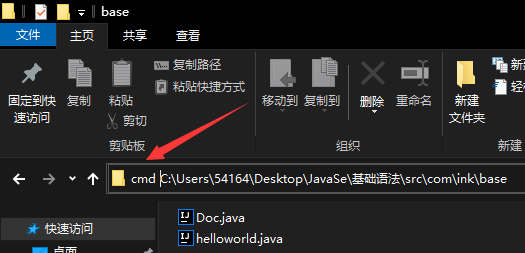


# Java

- **版本**
  - **JavaSE** ：标准版（桌面程序，控制台开发）
  - **JaveEE** ：企业级开发（web端，服务器开发）

- **JDK**：`Java Development Kit`开发者工具（jdk包含了jre）

- **JRE**：`Java Runtime Environment`运行时环境

- **JVM**：`Java Virtual Machine` JAVA虚拟机

  > JVM规范：HotSpot


## Java开发环境

**JDK**：Java developmen kit	开发工具包

- **卸载JDK**
  1. 查找jdk位置：在环境变量中找到`JAVA_HOME`
  2. 删除对应目录下文件，然后删除`JAVA_HOME`，最后删除**PATH**中关于java的目录
  3. 验证：`java -version`
- **安装JDK**
  1. 下载
  2. 配置环境变量：在path中添加`jdk\bin`路径

> jdk11已经不用配置jre了
>
> bin目录下存放可执行程序exe，如java.exe，javac.exe


## 第一个程序

- **文件名**和**类名**保持一致

- **首字母大写**

进入`cmd`运行

```bash
javac HelloWorld.java	#编译	生成.class文件
java HelloWorld			#运行	不带class后缀
```

- `public`：访问修饰符（access modifier），用于控制程序其他部分对这段代码的访问级别
- `class`：表面Java中的全部内容包含在类中，只需要将类作为一个加载程序逻辑的容器
- 源文件的名字必须和公共类的名字相同，并用`.java`作为扩展名
- Java编译器将**字节码文件**自动命名为类名`.class`
- 使用`java`命令运行程序，Java虚拟机将从指定类的`main`方法开始执行，`main`方法必须声明为`public`（**静态**方法）
- Java中所有函数都属于某个类的方法（**不称为成员函数**），所以`main`方法必须有一个外壳类
- main方法没有为操作系统返回 **"退出代码"**，如果main方法正常退出，Java应用程序的退出代码是0（表示成功运行程序）


# 集成开发环境

**IDE**： `Integrated Development Environment`。一般包括编辑器，编译器，调试器和图形界面

## idea使用

**安装目录**

- `bin`：
  - 启动文件，64位是`idea64.exe`（32位是`idea.exe`）
  - 相关的一些虚拟机的配置信息（在`idea64.exe.vmoptions`文件中）
  - IDEA基本的属性信息（在`idea.properties`文件中）
- `help`：快捷键文档和其他帮助文档
- `jbr`：在jbr目录中已经提供好了Java的运行环境（JRE），如果要开发Java程序需要独立安装JDK
- `lib`：IDEA依赖的一些相关的类库
- `license`：相关插件的许可信息
- `plugins`：插件

**配置目录**

- `config`：`C:\Users\54164\AppData\Roaming\JetBrains\IntelliJIdea2021.1`

**系统目录**

- `system`：`C:\Users\54164\AppData\Local\JetBrains\IntelliJIdea2021.1`

> 在对IntelliJ IDEA进行配置后，想进行还原，就可以找到本机上的这两个目录，把它们都删掉，然后重启IDEA。这时IDEA就会生成最初的类似config和system的那两个目录，就还原成最初的一个状态了


## idea开发

- IDEA的每一个Project都具备一个工作空间
- Module是模块化的概念，普通的根目录Project下面的子工程称为模块，每一个子模块之间可以相关联，也可以没有任何关联
- 对于每一个IDEA的项目工程（Project）而言，它的每一个子模块（Module）都可以使用独立的JDK和MAVEN配置（一个项目下的多个业务模块）

1. `File`-`new`-`Empty Project`-`new`-`module`-`new`-`package`

   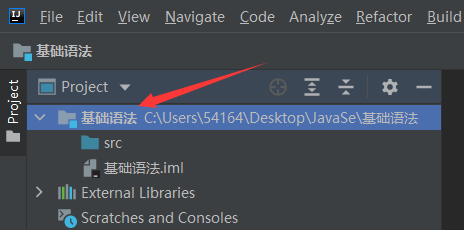
   
2. 查看项目结构`Project Structure`（也可以在File中查看）

   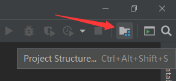

3. 在`Project`中修改**SDK**（对应的`Project Language Level` 也要修改）

   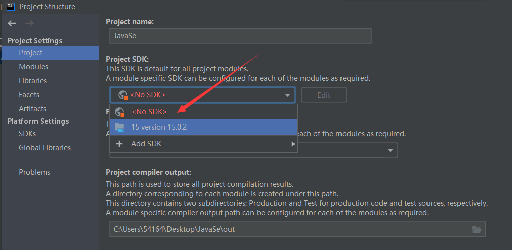

4. 在`src`目录下的`package`下新建类编写代码

   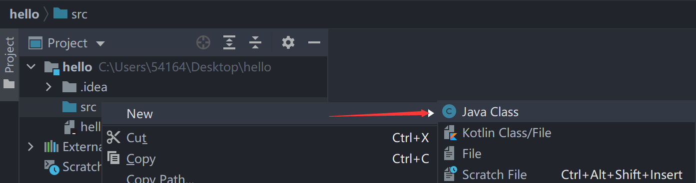

6. 运行

   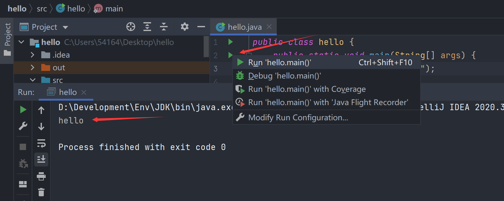
   
6. **删除Module**

   `remove`后的`module`才能`delete`（`remove`后就是第一个普通的文件目录而不是`module`了）

   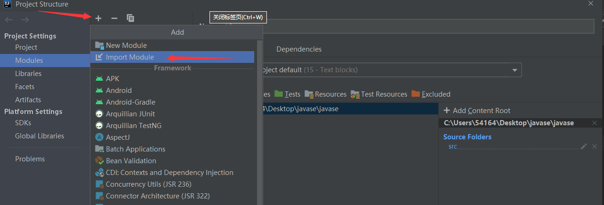


## idea设置

设置页面：`File`-`Setting`

**设置主题，菜单栏字体**

`Appearance & Behavio`-`Appearance`

**鼠标滚轮修改字体**

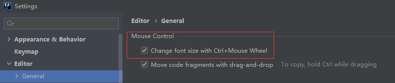

**显示行号和方法分隔符**

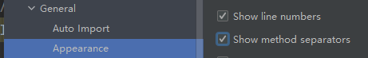

**忽略大小写，自动补全**

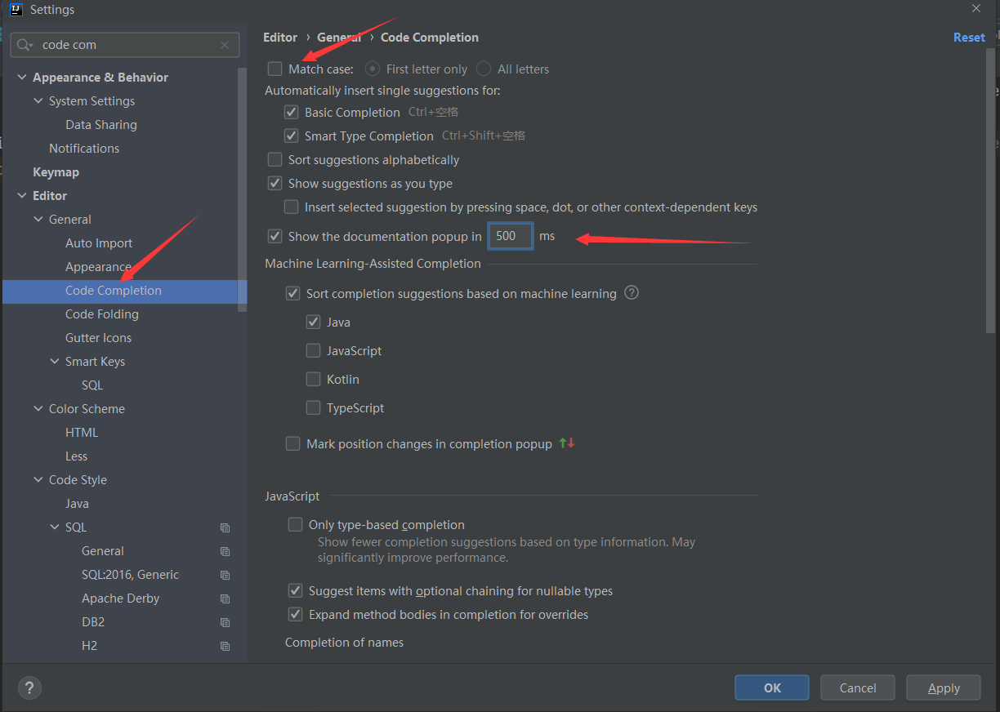

**设置自动导包**

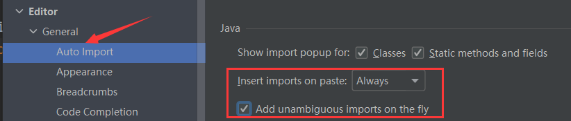

**取消单行显示taps（全部显示）**

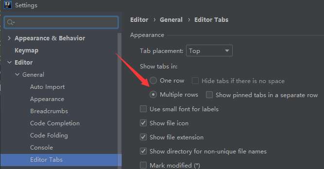

**修改注释样式**

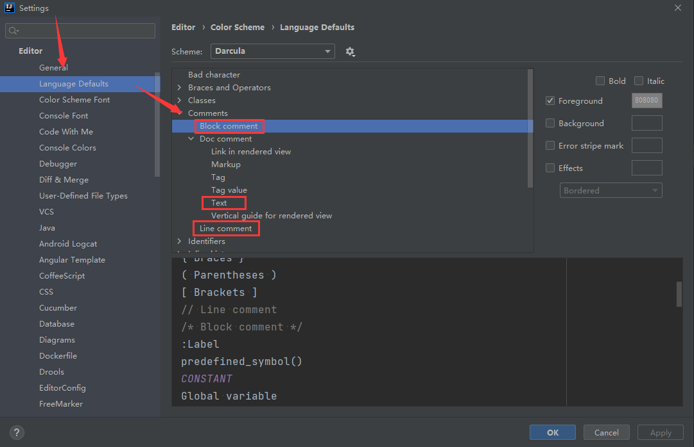

**配置类头的文档注释模板**

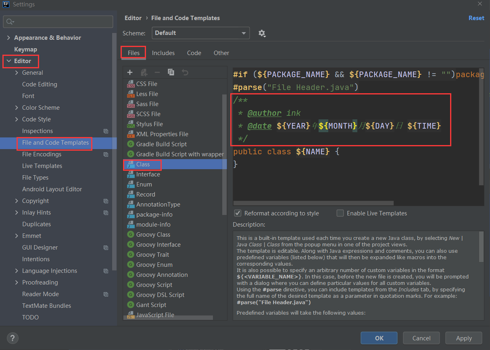

**修改编码**

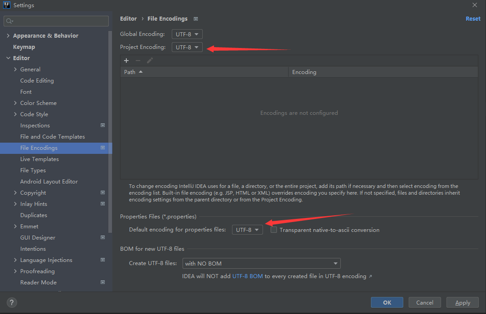

**自动编译（构建）**

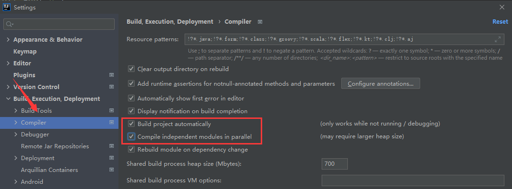

**快捷键设置**

- 右上搜索栏可以**搜索某一功能**对应的快捷键，右键即可修改（添加，移除）
- 搜索栏后面的放大镜可以搜索**快捷键**
- 可以在最上方应用别的快捷键

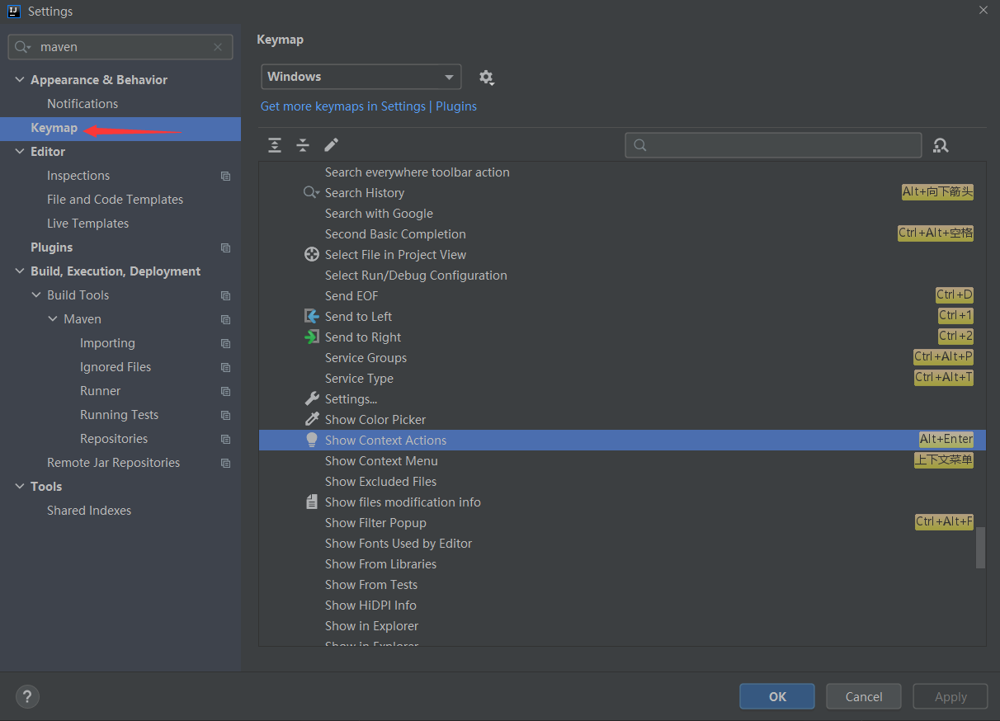

**设置模板Template**

`Postfix Completion`：不可修改

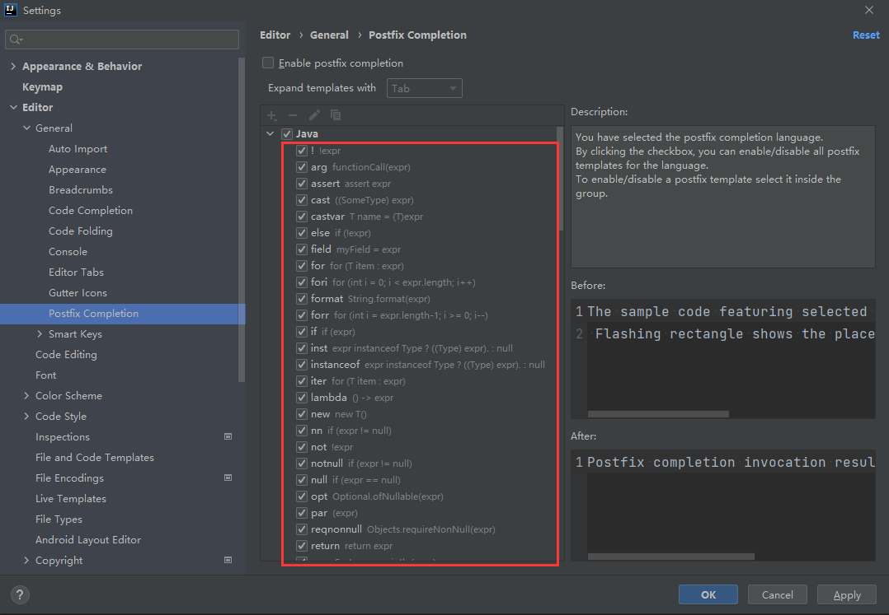

`Live Template`：可以修改（右侧**加号**）

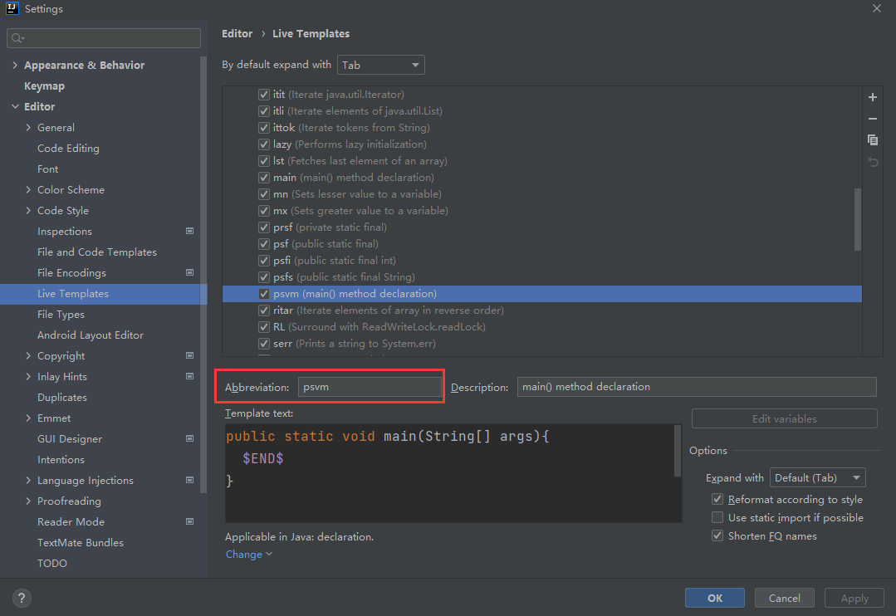


## idea刷题

1. 下载插件

   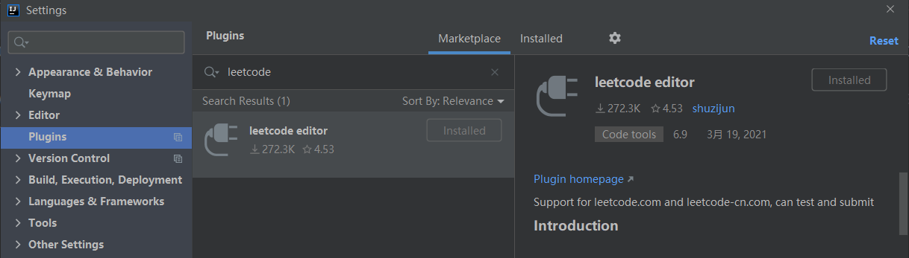

2. 配置力扣账号

   插件在右下角

   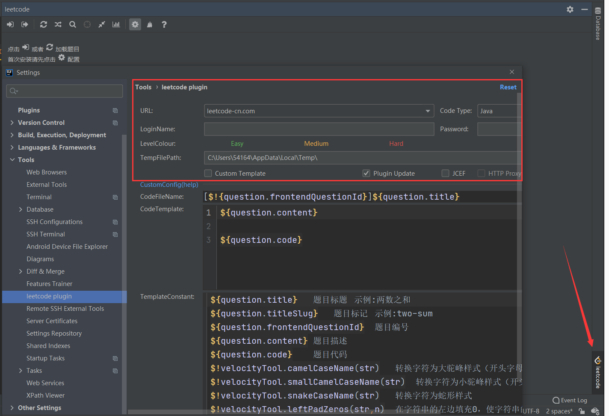

3. 查看题目

   - **open question**：题目在注释中
   - **open content**：md格式的题目
   - **open solution**：查看答案（详情：md格式）
   - **Run code**：在leetcode上运行代码
   - **Submit**：提交

   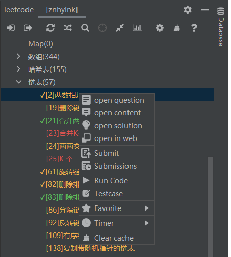


# 基础语法

## 注释

`Comments`

- **单行注释**：line comment

  快捷键：`ctrl+/`

  ```java
  //
  ```

- **多行注释**：Block comment

  快捷键：`ctrl+shift+/`

  ```java
  /**/
  ```

- **文档注释**：**JavaDoc**

  快捷键：`/**+空格`
  
  ```java
  /**
   * 
   */
  ```

> 有趣的代码注释


### 修改注释

- 修改样式

  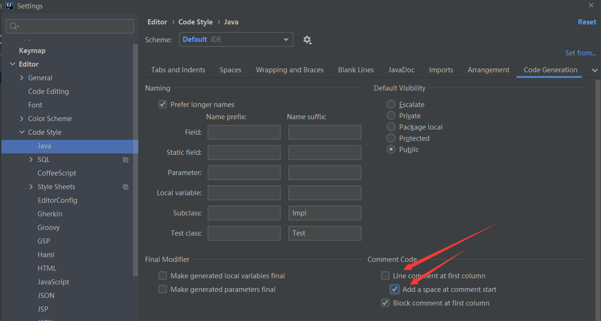

- 修改字体颜色

  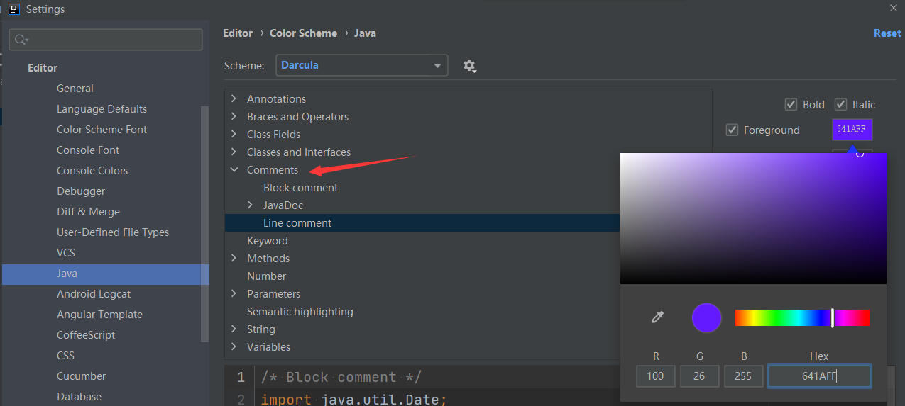


## 标识符

Java所有的组成部分都需要起名，如类名，变量名，方法名...这些名字被称为**标识符**，不可以用**关键字**起名字。

> 关键字：public，static，class，void等

标识符

- 首字母只能是**字母**，**$**，**_**

- **大小写敏感**

> 标识符可以用中文（不推荐）
>
> ```java
> String 工作 = "摸鱼";
> ```


## 数据类型

Java将数据类型分为两种：

- **基本类型**
- **引用数据类型**
  - Java本身不支持C++中的结构（struct）或联合（union）数据类型
  - Java的复合数据类型一般都是通过类或接口进行构造（类中提供捆绑数据和方法的方式）

> **Java是强类型语言**。要求变量的使用严格按照规定（先定义变量类型再使用）指定的数据类型不经过转换就永远是指定的类型
>
> JavaScript是**弱**类型语言

基本类型`primitive type`
- **数值类型**

  **数值类型所占字节数与平台无关**

  - **整数**
    - `byte`：1个字节（-128-127）
    - `short`：2个字节（-32768-32767）
    - `int`：4个字节（**-2147483648-2147483647**）
    - `long`：8个字节（数字后 + **l/L**后缀）
  - **浮点数**
    - `float`：4个字节（数字后 + **f/F**后缀）
    - `double`：**8个字节**（**非必须**：数字后 + **d/D**后缀）
  - **字符**
    - `char`：2个字节（用**' '**单引号包围）

- **Boolean类型**（占一位）
  
  - `true`
  - `false`

- **引用类型**`reference type`：

  除了基本类型，都是引用类型

  - **类**：**对象**是通过引用来操作的（栈->堆）
  - **接口**
  - **数组**

> - 位`bit`：数据存储的最小单位
> - 字节`byte`：数据处理的基本单位
> - 一个中文字符需要2个字节，所以`char`也可以写中文
> - 大数`big number`不是一种类型，而是一个java对象


### 整型

- 二进制`0b`
- 八进制`0`（不推荐使用）
- 十六进制`0x`

> BigDecimal 数学工具类


**JDK7特性**：数字可以用下划线分割

```java
int a = 100_000;
```


### 浮点类型

- 精度问题（不精确表示，存在舍入误差，**无法比较**）
- 表示溢出和出错的三个特殊浮点值：
  - 正无穷大：类型`.POSITIVE_INFINITY`
  - 负无穷大：类型`.NEGATIVE_INFINITY`
  - **NaN（不是一个数字）**：类型`.NaN`
    - 0/0或者负数的平方根结果为NaN
    - 无法使用值比较，使用`isNaN()`方法判断


### char类型

> Java核心技术不建议使用此类型

**本质还是数字**（char s = 97）

`char`原本用来表示单个字符，现在现在有些`Unicode`字符使用一个`char`值描述，有些使用两个`char`值。

- **Unicode编码**

  从Java SE 5.0开始，`Unicode`的码点（code point）采用16进制书写并加上前缀`U+`，`UTF-16`编码采用不同长度的编码表示所有的`Unicode`编码，每个字符用16位表示，Java中`char`类型描述了`UTF-16`的一个代码单元

  > 码点：一个编码表中某个字符对应的代码值

  ```java
  char s = '\u0063';
  ```

- **转义字符**：

  转义序列会在解析代码前就被处理。如

  ```java
  // 并不是一个字符串，\u0022会在解析前变为",所以是""+"",得到一个空串
  "\u0022+\u0022";
  
  // 并不是一个注释，因为\u00A0会替换为一个换行符
  // \u00A0 is a new line 
  
  // 程序中的路径出现 \user:等，\u后面没有跟4个16进制数，会报错
  ```

  - `\t`：制表符
  - `\n`：换行
  - `\r`：回车
  - `\b`：退格
  - `\\`：反斜杠


### 枚举类型

变量取值只在一个有限的集合内，此时可以自定义枚举类型（包含有限个命名的值）

```java
enum Size{SMALL,MEDIUM,LARGE};

//Size类型的变量只能存储这个类型声明中的枚举值和null
Size s = Size.MEDIUM;
```


### 字符串

Java没有内置的字符串类型，但在标准Java类库中提供了一个预定义类`String`，每个字符串都是`String`类的一个实例

`String`：Java字符串就是Unicode字符序列。

`String`对象是**不可变字符串**（无法修改字符串中的字符）

> 任何一个java对象都可以转换为字符串
>
> 因为字符串不可变，编译器可以让字符串共享（公共的存储池）
>
> 不要认为字符串是字符数组

- **子串**

  `substirng()`

- **空串**

  空串是一个Java对象，是**长度为0**，**内容为空**的字符串（`s.length = 0`）

- **null**

  表示目前没有任何对象和该变量关联

- **拼接**

  使用`+`拼接两个字符串，每次拼接都会构建一个新的`String`对象

  - 当一个字符串和一个非字符串的值拼接时，后者被转化为字符串
  - 多个字符串用分隔符拼接，可以用静态`join`方法

- **StringBuilder**

  空的**字符串构建器**，可以用`append`方法像其中添加内容

  ```java
  StringBuilder s = new StringBuilder();
  s,append("sh");
  ```

  再使用`tostring`方法构建字符串

  ```java
  String str = s.tostring();
  ```

- **判断相等**

  - `equals()`

  - `equalsIgnoreCase()`

    > 不要用`==`判断


### 类型转换

运算中，不同类型数据先转换为同一类型，再进行运算。 

`byte`，`short`，`char`，`int`，`long`，`float`，`double`（低—高）

- **强制转换**（高->低）:（类型）变量名
- **自动转换**（低->高）：自动

**注意**：

1. **内存溢出**问题（可能转换之前就已经溢出）
2. **精度**问题（不会四舍五入）
3. 不能对boolean值转换
4. 不能把**对象类型**转换为不相干的类型


## 变量

- 变量作用域
- 变量类型
- 变量名

> Java变量是程序中最基本的存储单元


**Java不区分变量的声明和定义**，声明后要对变量进行**显示初始化**

**声明**：数据类型 变量名 = 值；


### 作用域

- **局部**变量：方法中声明的变量（必须初始化）
- **实例**变量：从属于对象的变量
  - 除了基本类型，默认都是空`null`
  - `boolean`默认是`false`
- **类**变量：`static`关键字声明的变量，从属于类


### 常量

初始化后值不可再改变，用`final`定义（变量名一般**大写**）

```java
final double PI = 3.14;
```

类常量：`static final`

### 命名规范

1. **类成员**变量：首字母小写，驼峰原则：monthSalary
2. **局部**变量：首字母小写，驼峰原则
3. **常量**：大写字母，下划线：MAX_VALUE
4. **类名**：首字母大写，驼峰原则：Man，GoodMan
5. **方法名**：首字母小写，驼峰原则：run()，runMan()


# 基本运算符

**Operator**

- 算术运算符：

  - 二元运算符：`+`，`-`，`*`，`/`，`%`

    ```java
    // +前面是String类型时，后面的数字转换为字符串进行拼接
    // +后面是String类型时，前面的数字正常计算
    public class Demo {
        public static void main(String[] args) {
            int a = 10;
            int b = 20;
            System.out.println(""+a+b); //输出1020
            System.out.println(a+b+""); //输出30
        }
    }
    ```

  - 一元运算符：`++`，`--`

- 赋值运算符：`=`，`+=`，`*=`

- 关系运算符：`>`，`>=`，`==`，`!=`，`instanceof`

- 逻辑运算符：`&&`，||，`!`

  > **短路**方式：如果左边可以直接决定结果，那么右边就不会再计算

- 条件运算符：`? :`

- 位运算符：`&`，`|`，`^`，`~`（取反），`>>`，`<<`（左移），`>>>`

  - 异或`^`：不进位的二进制加法，相同为0，不同为1。一个数和自己异或可以实现清0。
  - `>>`：用符号位填充高位
  - `>>>`：用0填充高位

> 别的运算使用**工具类**来实现


# package包

为了更好的组织类，用于**区别类名**的命名空间，确保**类名的唯一性**

> 包具有一个层次结构，标准的Java类库分布在多个包中


1. 一般使用公司**域名倒置**作为包名，如blog.ink.com就建立`com.ink.blog`

   > 将Compact勾选掉才会自动分级

   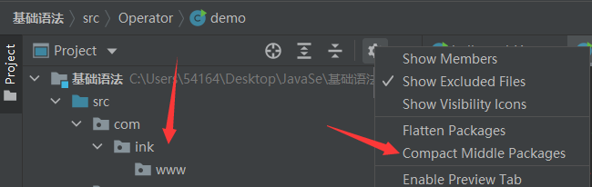

2. `Package`修饰，放在最上面（idea自动生成）

   

3. 在`com`下建立新的包，在`com.ink`后面输入包名

   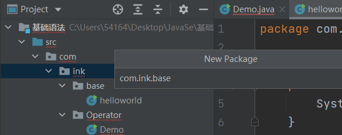

4. `import`导包（使用**其他包**的类）

   通配符`*`，导入一个包下的所有类
   
   ```java
   import java.util.*;
   ```
   
   > `import`语句应该位于源文件的顶部，但必须在`Package`语句下面
   
   导入其他包下的同名类会冲突，所以最好在使用类前加上完整的包名
   
   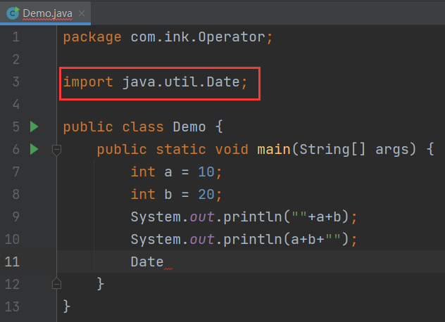
5. 静态导入包：

   可以直接使用`random()`方法（不用加类名）

   ```java
   import static java.lang.Math.random;
   ```

6. 将类放入包中：

   用`package`语句将包名放在源文件最上面

   > 编译器在编译源文件时不坚持目录结构，即使源文件没有在包中也不会出现编译错误，但无法运行（jvm在目录中找不到类）

# JavaDoc

将**注释**信息生成**API文档**

- 类的注释
- 方法的注释

> JDK帮助文档

参数信息（注解）

- `@author`：作者名
- `@version`：版本号
- `@since`：需要最早使用的JDK版本
- `@param`：参数名
- `@return`：返回情况
- `@throws`：异常抛出情况


## 编写文档注释

`/**`+回车

```java
package com.ink.base;

/**
 * @author ink
 * @version 1.0
 * @since 1.5
 */
public class Doc {
    String name;

    /**
     * 
     * @param name
     * @return
     * @throws Exception
     */
    public String test(String name) throws Exception{
        return name;
    }
}
```


## 命令行生成API文档

进入对应目录

1. 在命令行中执行命令生成文档

   ```bash
   javadoc -encoding UTF-8 -charset UTF-8 Doc.java
   ```

   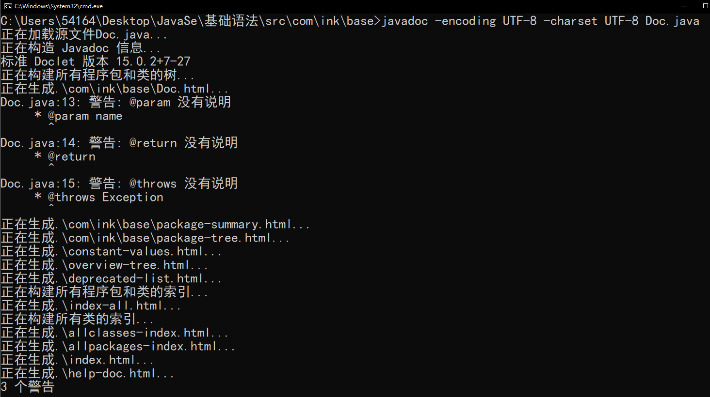

2. 在对应目录下生成文档，进入index.html

   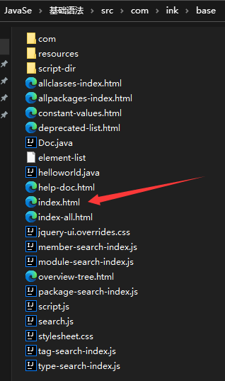

3. 查看API文档

   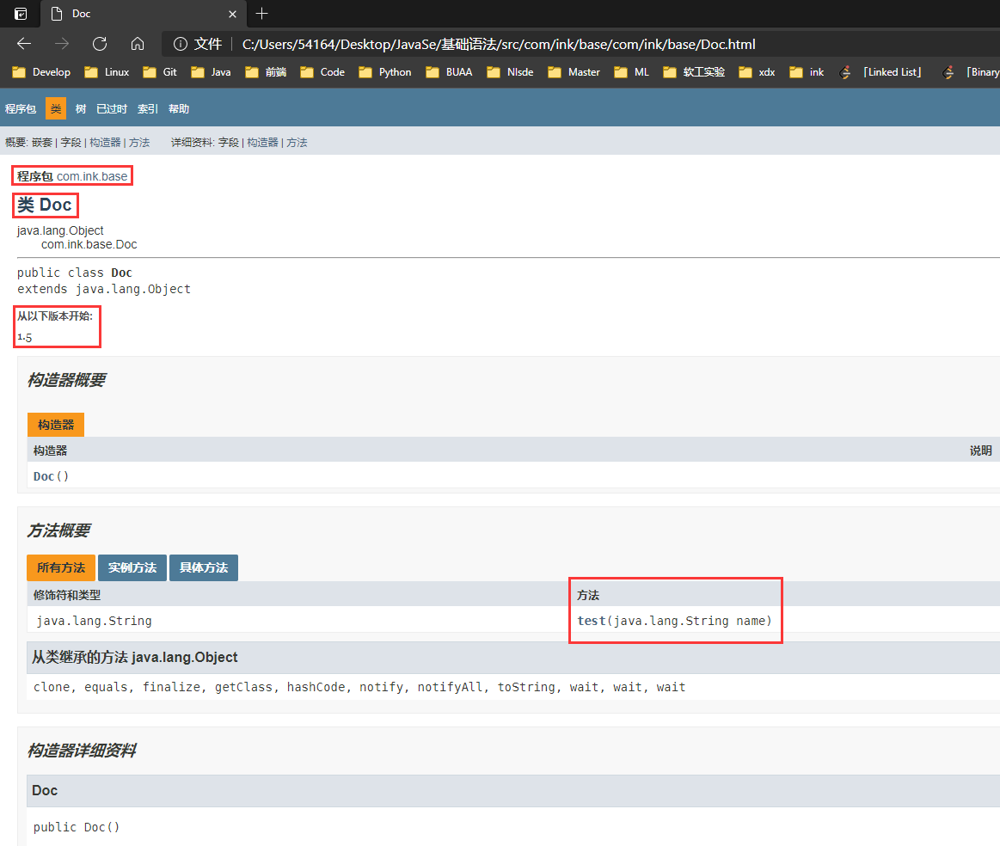


## IDEA生成JavaDoc文档

1. 打开idea`Tools`中的  `Generate JavaDoc`

2. 生成 JavaDoc 的**源代码对象**一般以模块`Module`为主，必要时可以单独选择Java源代码文件，不推荐以`Project`为JavaDoc生成的源范围。

3. ` Locale`：可选填项，表示生成的JavaDoc的**语言**版本，填写`zh_CN`

   > 根据javadoc.exe的帮助说明，它对应的是javadoc.exe的`-locale`参数。指JavaDoc框架中各种通用的固定显示区域都是中文，注释内容不变。

4. `Other command line arguments`：可选填项，直接向javadoc.exe传递的参数（一些重要的设置只能通过直接参数形式向Javadoc.exe传递）。填写如下参数：

   - `-encoding`：填写 `UTF-8`，表示**源代码**（含有符合 JavaDoc 标准的注释）是基于UTF-8编码的，以免处理过程中出现中文等非英语字符乱码

   - `-charset`：填写 `UTF-8`，表示在处理并生成 JavaDoc 超文本时使用的**字符集**是基于UTF-8编码的（目前所有浏览器都支持UTF-8，这样具有通用性）

   - `-windowtitle`：填写 “文本” ，表示生成的JavaDoc超文本在浏览器中打开时浏览器窗口标题栏显示的文字内容

   - `-link` ：填写[Overview (Java SE 16 & JDK 16) (oracle.com)](https://docs.oracle.com/en/java/javase/16/docs/api/index.html)，表示生成的JavaDoc中涉及到对其他**外部Java类**的引用是使用**全限定名称**还是带有**超链接的短名称**

     > 实质上是告诉javadoc.exe根据提供的外部引用类的JavaDoc**地址**去找一个叫`package-list`的文本文件，其中包含了所有外部引用类的全限定名称，因此生成的新JavaDoc不必使用外部引用类的全限定名，只需要使用短名称，同时自动创建指向其外部引用JavaDoc中的详细文档**超链接**。每个JavaDoc都会在根目录下有一个package-list文件，包括自己生成的JavaDoc
     >
     > 例如创建一个方法 `public void func(String arg)`，这个方法在生成JavaDoc时如果不指定`-link`参数，则JavaDoc中对该方法的表述就会自动变为`public void func(java.lang.String arg)`，因为`String`这个类就是外部引用的类（虽然它是Java 标准库的类）
     >
     > 如果指定了 -link [Overview (Java SE 16 & JDK 16) (oracle.com)](https://docs.oracle.com/en/java/javase/16/docs/api/index.html) 参数，则javadoc.exe在生成JavaDoc时会使用String这个短名称而非全限定名称`java.lang.String`，同时自动为 String短名称生成一个**超链接**，指向官方 JavaSE 标准文档 [Overview (Java SE 16 & JDK 16) (oracle.com)](https://docs.oracle.com/en/java/javase/16/docs/api/index.html) 中对 String 类的详细文档地址。


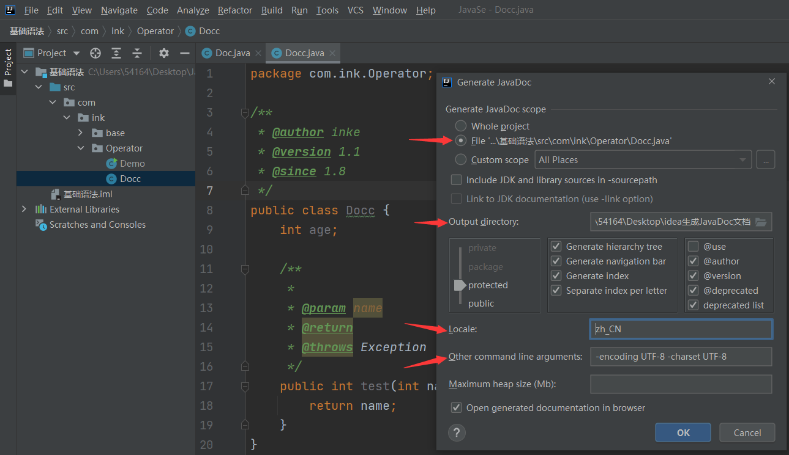


# 输入输出

## Scanner

> `Java.util.Scanner`是JavaSE5的新特性（`Java.util`包）
>
> 所有不在`Java.lang`包中的关键字都需要`import`导包

通过`Scanner`类获取用户的输入

- 判断是否有输入数据
  - `hasNext()`
  - `hasNextLine()`

- 获取输入数据

  - `next()`：

    要读取到有效字符才可以结束输入，对输入有效字符之前的空格会**自动去掉**，输入有效字符后将其后面的空白作为结束符（得不到带有空格的字符串）

  - `nextLine()`

    以Enter作为结束符，返回回车前的所有内容（可以获得空白）

- 关闭

  `scanner.close();`

> 输入IO流的的类，使用完都要关闭否则会一直占用资源

```java
// idea快速返回生成类对象定义3种方法
// 1. 	ctrl + alt + v
// 2. 	alt + 2次回车
// 3.	.var

// 导包
import java.util.Scanner;

public class Demo01 {
  public static void main(String[] args) {
    // 构造Scanner对象，关联标准输入流System.in
    Scanner scanner = new Scanner(System.in);
    System.out.println("使用next获取输入");
    // 判断用户是否输入
    if (scanner.hasNext()) {
      String str = scanner.next();
      System.out.println("获取的输入为：" + str);
    }
    // 关闭
    scanner.close();
  }
}
```


**获取具体类型**的方法：

- `nextInt()`
- `nextDouble()`
- `nextBoolean()`
- `nextBigInteger()`

等等......

```java
import java.util.Scanner;

public class Demo02 {
  public static void main(String[] args) {
    System.out.println("请输入整数:");
    int i;
    Scanner scanner = new Scanner(System.in);
    if (scanner.hasNextInt()) {
      i = scanner.nextInt();
      System.out.println("输入的整数是：" + i);
    } else {
      System.out.println("输入的不是整数");
    }
  }
}
```


**查看Scanner源码**

按住**crtl**点击`Scanner`类，点击**Structure**可以看到`Scanner`类种的方法

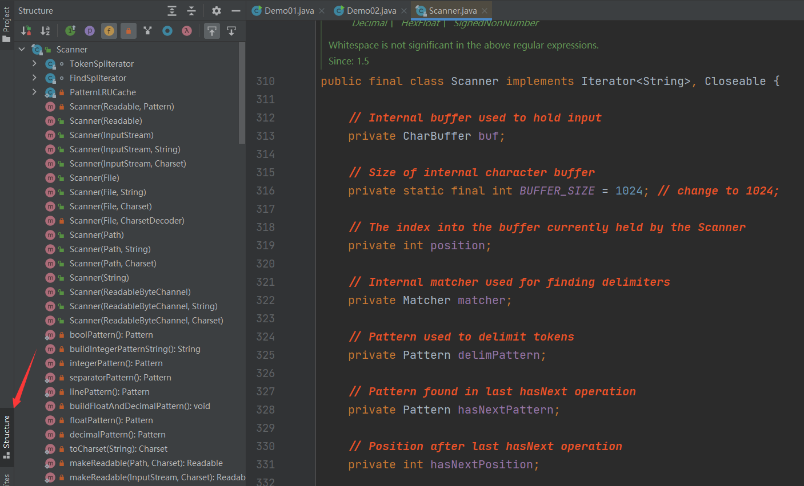


## Console

`Scanner`输入可见，不适合从控制台读取密码。JavaSE6引入`Console`类

- 返回的密码存放在一维字符数组中，而非字符串
- 每次只能读一行输入，不能只读一个单词等

```java
Console cons = System.console();
String name = cons.readLine();
char[] password = con.readPassword();
```


## 文件

- 读取文件

  用`File`对象构造`Scanner`对象对文件进行读取

  - 文件名中有`\`，需要加额外的`\`
  - 指定相对文件名时，文件位于Java虚拟机启动路径的相对位置

  ```java
  Scanner in = new Scanner(Paths.get("c:\\myfile.txt"),"UTF-8");
  ```

- 写入文件

  构造`PrintWriter`对象，如果该文件不存在，则创建它

  ```java
  PrintWriter out = new PrintWriter(Paths.get("c:\\myfile.txt"),"UTF-8");
  ```

如果用一个不存在文件创建`Scanner`，或者用一个不能被创建的文件名构造一个`PrintWriter`，就会发生异常


# 流程控制

## 选择结构

### if选择结构

一个`if`语句可以有多个`else if`语句，但最多有一个`else`语句。一旦其中一个`else if`语句为`true`，后续语句都不会执行。

```java
if (布尔表达式 1){
    表达式1的值为true时执行的语句;
}else if(布尔表达式 2){
    表达式2的值为true时执行的语句;
}else{
    表达式1和2的值都为false时执行的语句;
}
```


### switch选择结构

`switch case`语句是用来**匹配**一个变量和一系列值中的某一个值，其中每一个值都称为`switch`的一个**分支**

- `case`标签必须为**字符串常量**或者**字面量**（**可以是枚举类型的对象常量**）
- `break`结束判断（否则会**case穿透，**将后面全部输出）
- `default`默认情况

> 也可以不加break，使用case穿透实现一些其他功能

```java
public static void main(String[] args) {
    char grade = 'C';
    switch (grade) {
        case 'A':
            System.out.println("优秀");
            break;
        case 'B':
            System.out.println("良好");
            break;
        case 'C':
            System.out.println("及格");
            break;
        case 'D':
            System.out.println("挂科");
            break;
        default:
            System.out.println("输入错误");
    }
}
```


从JDK 7开始，switch中支持`String`类型

> 字符的本质还是数字

```java
public static void main(String[] args) {
  String name = "平安";
  switch (name) {
    case "平安":
      System.out.println("平安");
      break;
    case "富贵":
      System.out.println("富贵");
      break;
    case "英俊":
      System.out.println("英俊");
      break;
    default:
      System.out.println("其他");
  }
}
```


### 查看反编译文件

Java程序执行是生成了`class`文件

1. 查看编译文件输出路径

   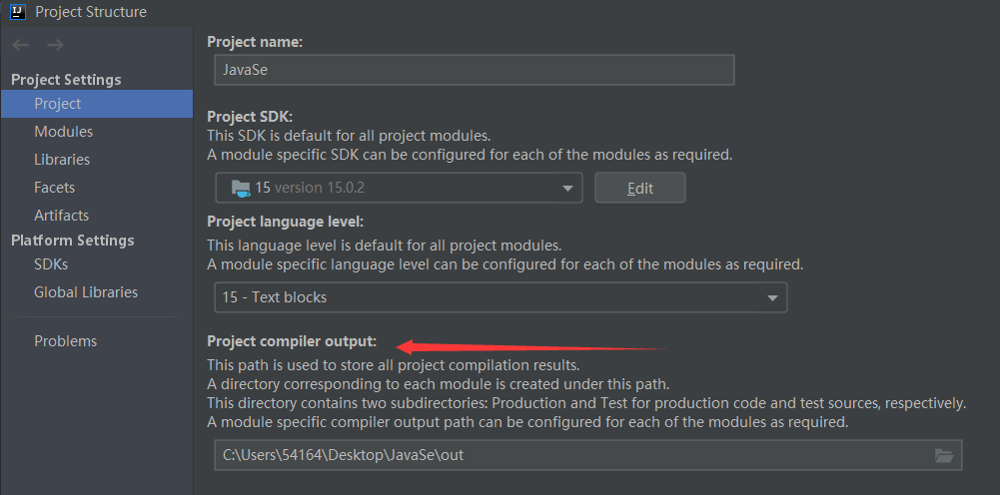

2. 正常查看编译的`class`文件（乱码）

   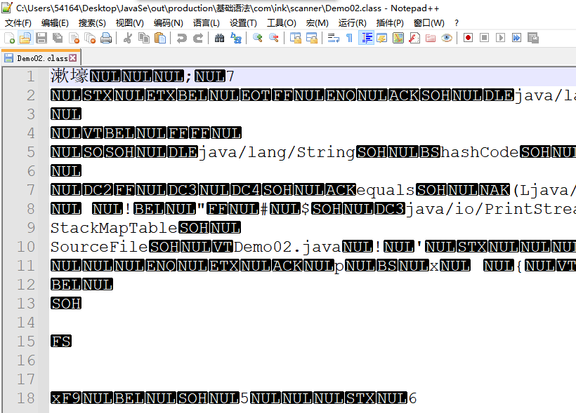

3. 在idea中打开`.java`文件所在的文件夹

   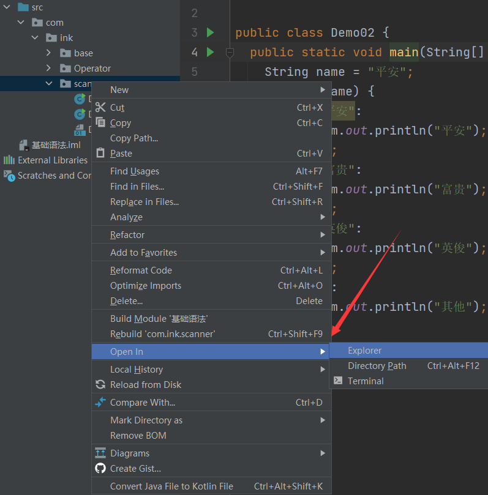

4. 将`class`文件复制进文件夹

   

5. 在idea中查看`class`文件

   发现字符串匹配其实最后找的还是`case`后面的**哈希值**

   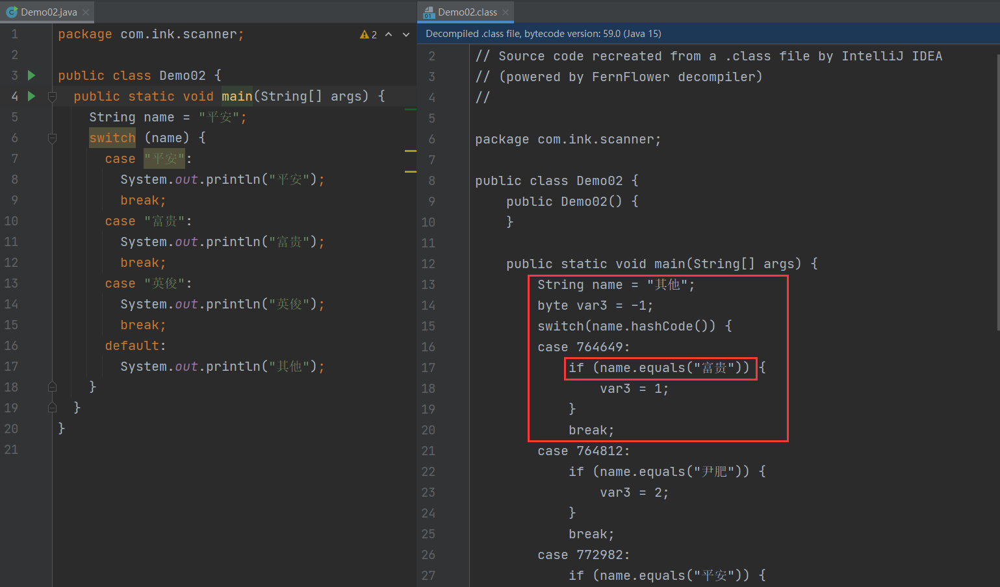


## 循环结构

- `break`：用于强行退出整个循环，不执行循环中剩下的语句

- `continue`：用于退出某一次循环，跳过本次循环中剩下的语句，然后继续执行下一次循环


### while循环

必须满足条件才能进入循环执行语句（先判断，后执行）

```java
while(布尔表达式){
    布尔表达式值为true时的循环语句;
}
```

特殊事件需要永远执行（**死循环**）

```
while(true){
    等待客户端连接;
    定时检查;
}
```


### do while循环

即使不满足条件也**至少执行一次**语句（先执行，后判断）

```java
do {
    执行语句;
} while (布尔表达式);
```


### for循环

一种支持**迭代**的通用结构（最有限，最灵活），它的循环次数是在执行前就确定的。

1. **初始化**步骤：可以**初始化多个变量**，也可以为空语句`；`
2. 检查**布尔表达式**的值：可以有多个表达式
3. **更新**循环控制变量：可以更新多个变量值

```java
//正常循环
for (初始化; 布尔表达式; 迭代更新) {
  布尔表达式值为true时的循环语句;
}

//死循环
for (; ;) {
  执行语句;
}
```

生成布尔表达式是`i<n`的的for循环快捷键：n.for

```java
int n;
for (int i = 0; i < n; i++) {
  //
}
```


### 增强for循环

> JDK5中引入，**主要用于数组**

1. **声明语句**：声明新的**局部变量**
   - 该变量**类型**必须和数组元素的类型相匹配
   - 该变量**作用域**限定在循环语句块中
   - 该变量**值**和数组元素值相等
2. **表达式**：
   - 是要访问的数组名
   - 是返回值为数组的方法

```java
for (声明语句 : 表达式) {
  执行语句;
}
```

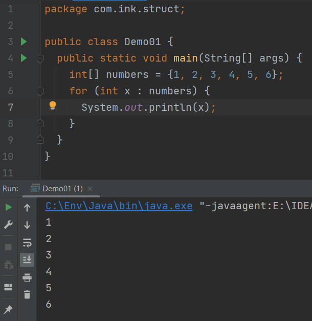


# 方法

> 面向对象

Java方法是语句的集合，它们在一起执行一个功能（功能块）

- 方法包含于类或者对象中
- 方法在程序中被创建，在其他地方被**调用**

> 设计方法原则：保持方法的原子性（一个方法只实现一个功能）
>
> 命名规则：首字母小写+驼峰命名


`public static void main(String[] args)`：main方法

`System.out.println()`：调用系统类中的标准输出对象的打印方法

- `System`：类
- `out`：类中的一个对象
- `println()`：类中的一个方法

```java
public class Demo01 {
  public static void main(String[] args) {
    int sum = add(1, 2);
    System.out.println(sum);
  }

  public static int add(int a, int b) {
    return a + b;
  }
}
```


## 方法定义

方法包含一个**方法头**和一个**方法体**

- **修饰符**：可选，可以有多个。定义方法的**访问类型**（告诉编译器如何调用该方法，如`public`，`static`，`final`）
- **返回值类型**：没有返回值的时候是`void`，有返回值时必须`return`返回
- **方法名**：首字母**小写**+**驼峰**命名
- **参数类型**：可选，可以有多个参数，也可以不包含任何参数。方法被调用时传递值给参数，这个值被称为实参或变量，**参数列表**是指方法的参数类型，顺序和参数的个数
  - **形式参数**：调用方法时用于**接收外界**的输入数据（定义作用）
  - **实参**：调用方法时**实际传给方法**的数据
- **异常抛出**：`throws` 
- **方法体**：定义该方法的功能

```java
修饰符 返回值类型 方法名(参数类型 参数名) {
  方法体
  return 返回值;
}
```


## 方法调用

调用方法：**对象名.方法名（实参列表）**	`object.method(parameters)`

> object是隐式参数

**调用过程**：

1. 编译器查看对象的声明类型和方法名
2. 编译器查看调用方法时提供的参数类型（重载解析）
3. 如果是private，static，final方法，编译器可以准确调用（**静态绑定**）
4. 程序运行时可以实现**动态绑定**，动态绑定时jvm调用与`object`引用对象的实际类型最合适的类的方法（本类，超类）

> 每次调用方法都要搜索，开销大。jvm预先为每个类创建一个方法表（method table），查表即可


不同**类之间**调用方法

- 静态方法（**类方法**）：`static`修饰符，直接通过**类名**调用

  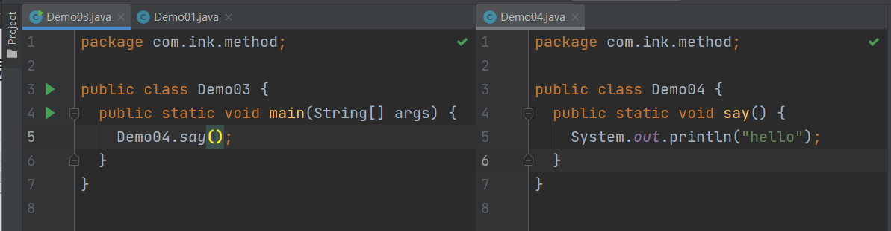

- 非静态方法：先**实例化**类的对象，通过**对象**调用

  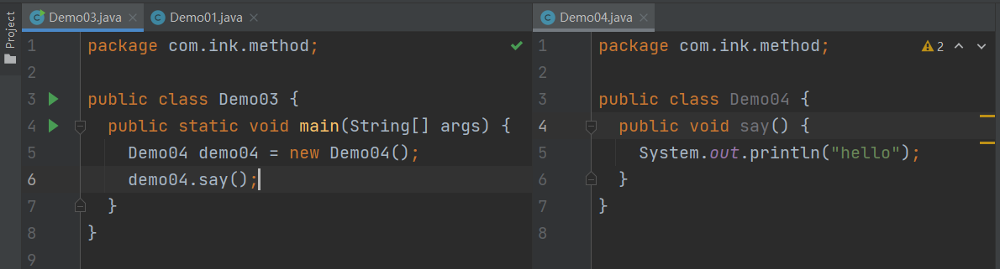


不同**方法之间**调用方法

- **静态方法**可以互相直接调用
- **非静态方法**可以互相直接调用
- **静态方法不能直接调用非静态方法**

> `static`静态方法是和类一起加载的（存在的早），非静态方法是通过类实例化后才存在（存在的晚），此时调用会报错


**Java是按值调用**，得到参数值的一份拷贝。

- **按值调用**（call by value）
- **按引用调用**：(call by reference) 传递对象变量地址


**按引用调用本质还是按值调用**（对象的地址值）

1. 一个方法可以改变一个对象参数的状态
2. 一个方法不能让对象参数引用一个新的对象


## 方法重载

**重载**`overload`：一个类中，**相同的函数名**，**不同的形参**（编译器逐个匹配）

**重载规则**：

- 方法名相同
- 参数列表不同（个数，类型，排列顺序等不同）
- 返回类型可以相同也可以不同

> 只有返回类型不同不是重载

**方法签名**：`signature` 方法名+参数类型（可以完整描述一个方法）

## 命令行传参

当一个程序运行时才给它传递信息，通过传递**命令行参数**给`main()`方法实现

> public static void main(String[] args)中`String[] args`是参数

```java
package com.ink.method;

public class Demo02 {
  public static void main(String[] args) {
    for (int i = 0; i < args.length; i++) {
      System.out.println("args[" + i + "]" + args[i]);
    }
  }
}
```

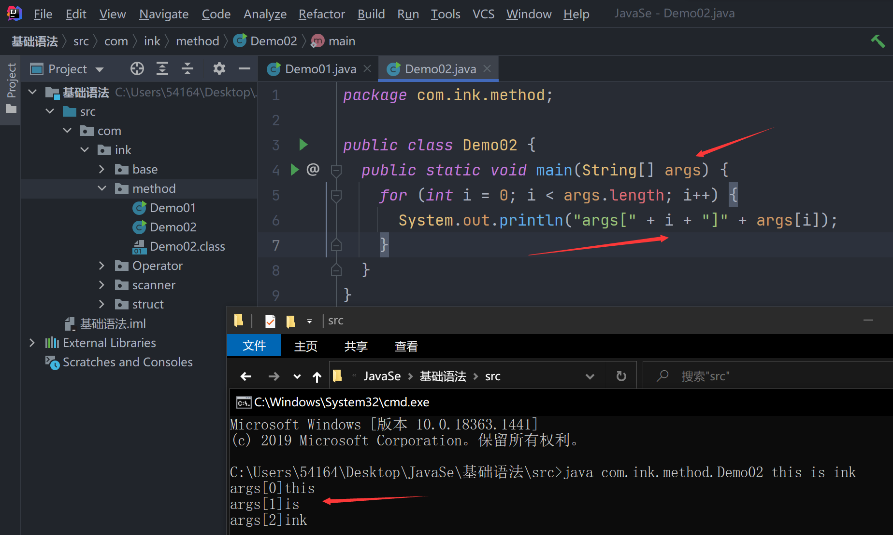


## 编译问题

在`package`中的java程序编译运行问题

1. 错误一

   直接在idea终端带包名编译

   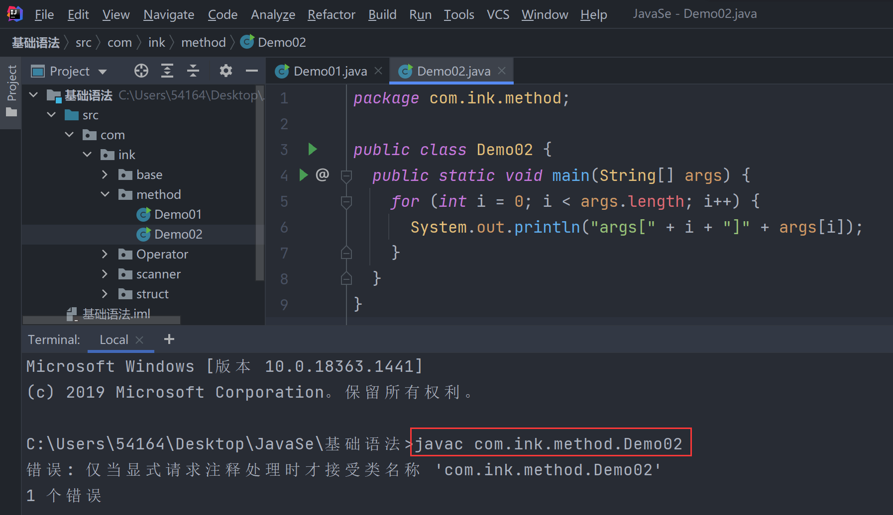

2. 错误二

   在文件目录下命令行直接运行（可以编译）

   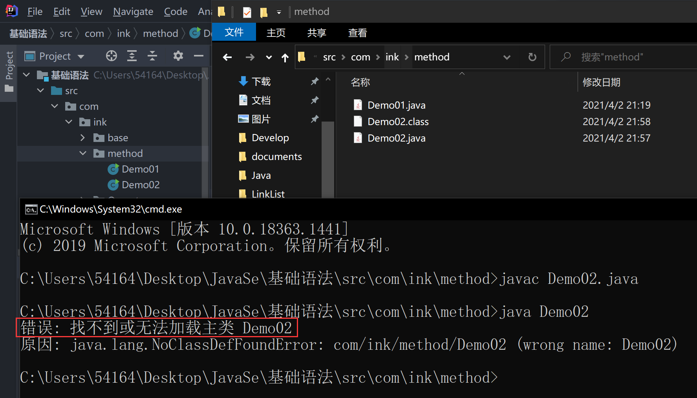

3. 正确运行

   回到`src`主目录**带包名运行**

   > `cd ../` 回到上级目录

   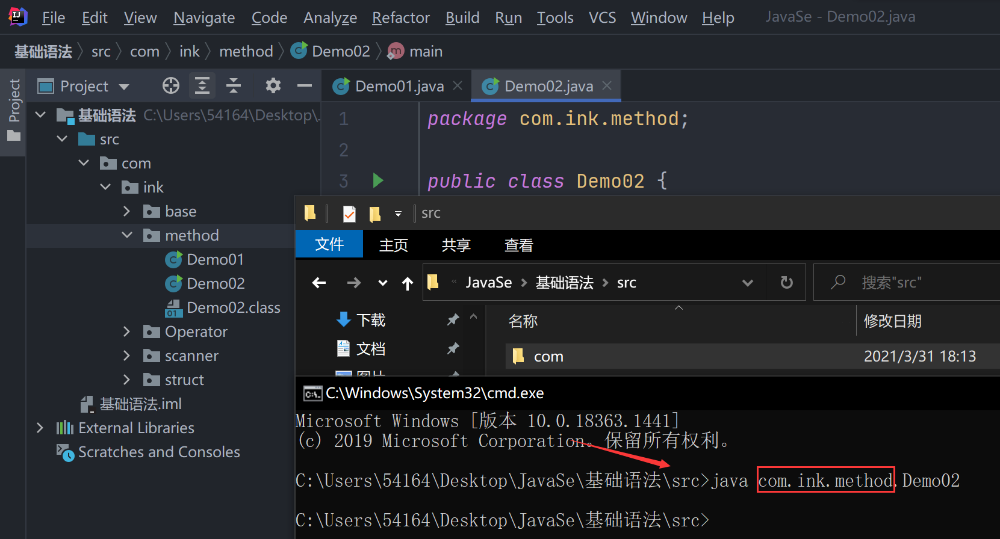


## 可变参数

**不定项参数**

> JDK1.5开始支持传递同类型的可变参数

在方法声明中，在指定**参数类型**后加一个省略号`...`

- 一个方法只能指定**一个**可变参数，
- 可变参数必须放在**最后**，普通参数必须在它之前声明

```java
public class Demo02 {
  public static void main(String[] args) {
    printMax(20, 30, 40, 50, 60, 70);
  }

  public static void printMax(double... number) {
    if (number.length == 0) {
      System.out.println("No argument passed");
      return;
    }
    double result = number[0];
    for (int i = 0; i < number.length; i++) {
      if (number[i] > result) {
        result = number[i];
      }
    }
    System.out.println("The max vaule is " + result);
  }
}
```


## 递归

一种思想：方法本身调用自己这个方法

递归结构：

- **递归头**：何时结束递归，不再调用自身
- **递归体**：何时需要递归，调用自身

> StackOverflowError栈溢出


# 数组

相同类型数据的有序集合，数组中的每一个数据称为一个数组元素，可以用下标（索引）来访问它们。

数组的基本特点：

- **长度确定**，一旦被创建大小就不可以改

- 数组元素必须是**相同类型**

- **数组元素**可以是任何数据类型（**基本数据类型**和**引用数据类型**）

- **数组变量是引用类型**，数组也可以看成是**对象**，数组中的每个元素相当于该对象的成员变量

  数组可以看成是对象，所以**数组对象本身是在堆中**


## 数组声明

**先声明后使用**

```java
//首选，类型后面加[]
dataType[] array;

//相同效果，变量名后面加[]，不推荐(C风格)
dataType array[];
```

> `int[]` 其实就相当说加了`[]`后，把整体看作**int数组**类型


## 数组创建

Java使用`new`操作符创建数组，数组元素会被**默认**初始化

> Java中允许数组长度为0（与null不同）

- 数字：初始化为0
- boolean：初始化为false
- 对象：初始化为null

```java
// 1.声明 相当于dataType[] array = null;
dataType[] array;

// 2.创建
array = new dataType[arraysize];

// 一步到位
dataType[] array = new dataType[arraysize];
```


## 数组访问

数组元素通过下标（索引）访问，下标从0开始

获取数组长度（边界）：`arrays.length` 是[0，length-1]

> 越界错误：`java.lang.ArrayIndexOutOfBoundsException`

**遍历数组**

- **for循环**

  ```java
  int[] arrays = {1,2,3,4,5};
  for (int i = 0; i < arrays.length; i++) {
      System.out.println(arrays[i]);
  }
  ```

- **增强for循环**（无下标）

  快捷键：数组名.for

  ```java
  int[] arrays = {1, 2, 3, 4, 5};
  for (int array : arrays) {
      System.out.println(array);
  }
  ```

  > JDK1.5


## 初始化

- **静态初始化**

  ```java
  // 创建 + 赋值
  int[] a = {1,2,3,4,5};
  //
  Man[] men = {new Man(),new Man()};
  ```

- **动态初始化**

  ```java
  // 包含了默认初始化，分配空间后b[i]默认都是0
  int a = new int[10];
  b[0] = 10;
  ```

- **默认初始化**

  数组是**引用类型**，数组元素相当于类的**实例变量**，因此数组一经分配空间，每个数组元素就按照实例变量同样的方法被**默认（隐式）初始化**。

## 数组拷贝

允许将一个数组变量拷贝给另一个数组变量，两个变量引用同一个数组

```java
int[] a = b;
```

` Arrays.copyOf`方法：

但长度小于原始数组的长度，则只拷贝最前面的数据元素

```java
int[] a = Arrays.copyOf(b,b.length)
```


## 数组使用

1. **数组参数**：将数组封装为参数

   ```java
   package com.ink.array;
   
   public class Demo01 {
     public static void main(String[] args) {
       int[] arrays = {1, 2, 3, 4, 5};
       printArray(arrays);
     }
   
     public static void printArray(int[] arrays) {
       for (int i = 0; i < arrays.length; i++) {
         System.out.println(arrays[i]);
       }
     }
   }
   ```

2. **数组返回值**：

   ```java
   package com.ink.array;
   
   public class Demo02 {
     public static void main(String[] args) {
       int[] arrays = {1, 2, 3, 4, 5};
       int[] reveseArray = reveseArray(arrays);
       for (int i = 0; i < reveseArray.length; i++) {
         System.out.println(reveseArray[i]);
       }
     }
       
     public static int[] reveseArray(int[] arrays) {
       int[] result = new int[arrays.length];
       for (int i = 0, j = result.length - 1; i < arrays.length; i++, j--) {
         result[j] = arrays[i];
       }
       return result;
     }
   }
   ```


## 多维数组

**数组的数组**（每一个数组元素都是一个**一维数组**）

二维数组：

```java
// 2行5列的二维数组
int arrays[][] = new int[2][5];
int[][] arrays = {{1,2},{2,3},{3,4}};
```

> 每一个arrays[i]都是一行数组的首地址（arrays[i] [j]）


可以单独把`arrays[i]`作为一个数组参数，也可以使用`arrays[i].length`（区分`arrays.length`）

```java
package com.ink.array;

public class Demo03 {
  public static void main(String[] args) {
    int[][] arrays = {{1, 2}, {2, 3}, {3, 4}};
    for (int i = 0; i < arrays.length; i++) {
      for (int j = 0; j < arrays[i].length; j++) {
        System.out.println(arrays[i][j]);
      }
    }
  }
}
```


**二维数组的增强for循环**：

一个`for each`不能遍历二维数组的每一个元素，它是按照行处理。要将`arrays[i]`作为遍历元素。

```java
package com.ink.array;

public class Demo03 {
  public static void main(String[] args) {
    int[][] arrays = {{1, 2}, {2, 3}, {3, 4}};
    for (int[] array : arrays) {
      for (int data : array) {
        System.out.println(data);
      }
    }
  }
}
```


## 不规则数组

1. 先创建一个具有所含行数的数组
2. 单独创建每一行行组（`new`）

```java
int[][] odds = new int[MMAX+1][];
for(int i=0; i<= NMAX; i++){
    odd[i] = new intp[i+1];
}
```


## Arrays类

数组的**工具类**：`Java.util.Arrays`

Arrays类中的方法都是`static`修饰的**静态方法**，在使用时可以直接使用**类名调用**，而不用使用对象调用（不用，但是可以）。

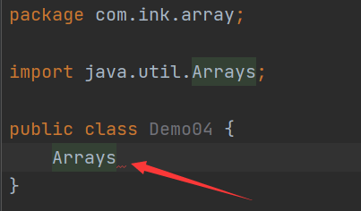

> 除了`array.length`，数组本身没有什么方法供调用
>
> `util`工具包中提供Arrays工具类


**常用功能**：

- `fill`：给数组元素赋值（**左闭右开**）
- `sort`：给数组元素排序（升序）
- `equals`：**比较数组元素是否相等**
- `toString`：打印数组元素
- `binarySearch`：对排序好的数组经行**二分查找**

> **ctrl点击**`Arrays`查看源码，点击左下角**structure**可以查看Arrays中的方法


> **ctrl点击**`tostring`查看源码

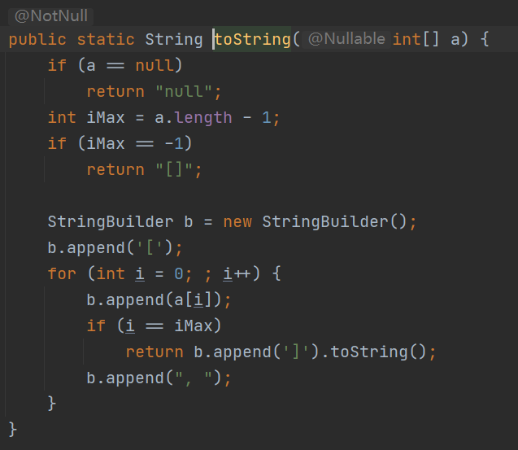


## 稀疏数组

当一个数组中大部分元素都是0或同一个值，就可以用稀疏数组来保存

> 稀疏数组可以看做是普通数组的**压缩**。普通数组是指**无效**数据量**远大于**有效数据量的数组
>
> - 数组中存在大量的无效数据，占据了大量的存储空间，真正有用的数据很少
> - 压缩存储可以节省存储空间以避免资源浪费，在数据序列化到磁盘时，压缩存储还可以提高IO效率


**创建稀疏数组**

1. 记录数组**行列数**，有多少**不同的元素**
2. 把不同元素的**行列和值**记录在一个小规模的数组中（**固定3列**）

```java
// n个元素
int[][] array = new int[n+1][3];
array[k][0] = i;
array[k][1] = j;
array[k][2] = data;
```

**还原普通数组**

```java
// n个元素
int[][] rarray = new int[array[0][0]][array[0][1]];
// i从1开始，第0行是数组信息
rarray[array[i][0]][array[l][1]] = array[i][2]
```

6行7列8个不同的元素，第一个有效值22：第0行第3列

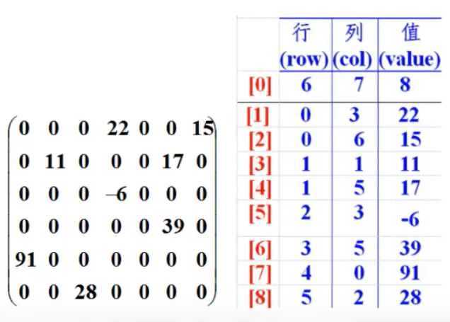


## 内存分析

Java内存：

- **堆**：存放`new`出来的**对象**和**数组**，可以被所有的线程共享，不会存放别的对象引用
- **栈**：存放**基本类型变量**（包括变量值），**引用对象的变量**（包括这个引用在堆里面的**地址**）
- **方法区**：包含了所有的`class`和`static`变量，可以被所有的线程共享

> 1. 声明数组变量，在栈中存放
> 2. 创建数组，在堆中开辟一片空间（分成数组长度的小空间），并将数组元素默认初始化，再将栈中的数组变量指向堆中的分配的空间首地址


# 面向对象

OO（`Object Oriented`）：面向对象，一种软件开发方法，一种编程范式

OOP（`Object Oriented Programming`）：面向对象编程，程序由对象组成

**OOP的本质：以类的方式组织代码，以对象的方式封装数据**

> 类是一种抽象的数据类型，对象是抽象概念的具体实例
>
> 物以**类**聚（分类）


Java中所有类都来自于一个"超类"`Object`

- **核心思想：抽象**

- **三大特性**
  - **封装**
  - **继承**
  - **多态**

> - 认识论：先有对象后有类
>   - 对象：具体食物
>   - 类：对对象的抽象
> - OOP：先有类后有对象，**类是对象的模板**


**规范项目结构**

1. 一个项目应该只存在一个main方法，在`Application`类中。其他类不要在写main方法，只是**单纯的类（包含属性和方法）**

   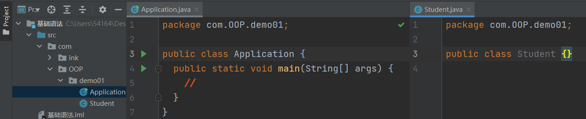

2. 添加`out`目录，显示编译后的`.class`文件

   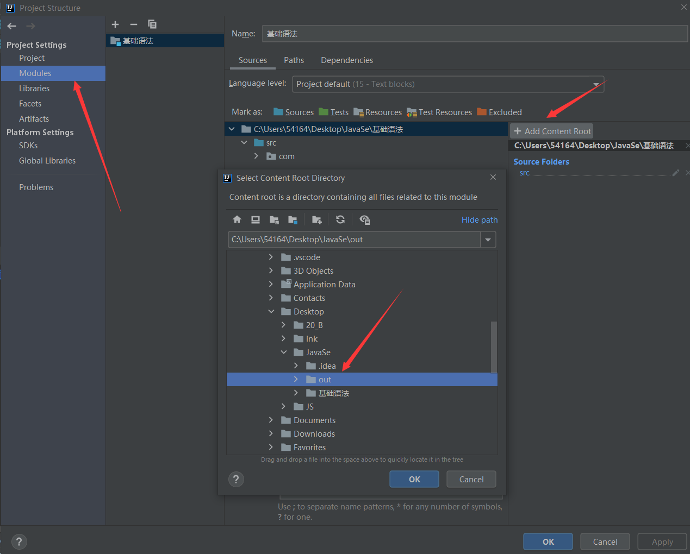


## 对象

**对象**：

- 数据：实例域`instance field`
- 方法

> 实例域标记为`private`

**对象的三大特性**：

- 对象行为：可以对对象施加的方法
- 对象状态：施加方法时，对象的响应
- 对象标识：辨别相同行为和状态的不同对象

**创建对象**：使用`new`关键字

1. 分配内存空间
2. 默认初始化对象
3. 调用类中的构造器（**在堆中被构造**）

```java
Student student = new Student();
```

**对象和对象变量**：

一个对象变量可以引用各种类型的对象。单纯的声明`student`这个变量时它并不是一个对象。可以用对象去初始化它，此时它引用了一个对象。

**Java中任何一个对象变量的值都是对存储在另一个地方的一个对象的引用**

**`new`的返回值也是一个引用**

```java
Student student;
student = new Student(); 
```

`final`**实例域**：

构建对象时候必须初始化`final`实例域，并且在之后不能对它进行修改（没有对应的`set`方法）


## 自定义类

通常自定义类没有`main`方法，但有自己的实例域和实例方法

一个完整的程序是将若干类组合在一起，**其中只有一个类有`main`方法**

> 一个源文件中只能有一个`public`类，文件名必须和`public`类名相同


`Student.java`文件

> 以对象的方式封装数据

```java
package com.OOP.demo01;

public class Student {
  // 属性（成员变量）：字段Field  
  String name;
  int age;
  // 方法
  public void study() {
    System.out.println("hello " + this.name);
  }
}
```

`Application.java`文件

> 以类的方式组织代码

```java
package com.OOP.demo01;

public class Application {
  public static void main(String[] args) {
    // 实例化Student类,返回一个对象，把对象存到变量中
    Student student = new Student();
    
    student.name = "ink";
    student.age = 23;
    System.out.println(student.name);
    System.out.println(student.age);
  }
}
```


## 构造器

特殊的**方法**：构造并初始化对象

**构造器**：`constructor`

- 构造器总是伴随`new`操作一起调用，**不能对已经存在的对象调用构造器**
- 每个类可以有一个以上的构造器
- 必须和类有**相同的名字**
- 可以有多个参数

- 必须**没有返回值类型**，也不加`void`

> 不要在构造器中定义和实例域重名的局部变量

`Person`类中不写内容也可以`new`一个`Person`对象，在`out`目录查看编译后的`Person.class`文件，发现加上了一个**构造器**（无参构造）。

```java
public class Person {
    public Person() {
    }
}
```

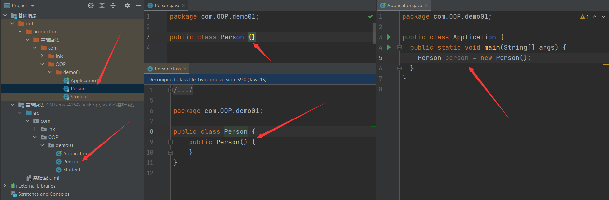


**构造器分类**：

- **无参构造**：可以隐式定义，构造器中所有实例域被设置为默认值

- **有参构造**：一旦定义了有参构造，**无参构造就必须显式定义**，否则无参构造`new Person()`就会失效，但可以使用有参构造

  无参构造：（报错）

  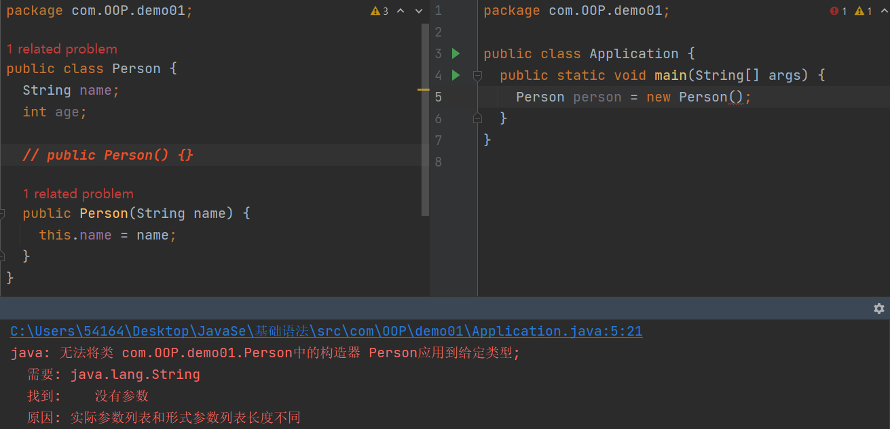

  有参构造：（正常运行）

  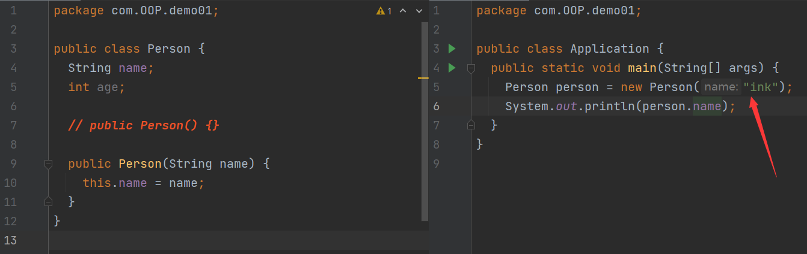


**this**

- 参数变量可以用同样的名字屏蔽实例域，用`this`可以访问实例域
- `this`还可以在构造器中第一行去调用重载的构造器


**快捷键**：alt+insert，快速生成构造器

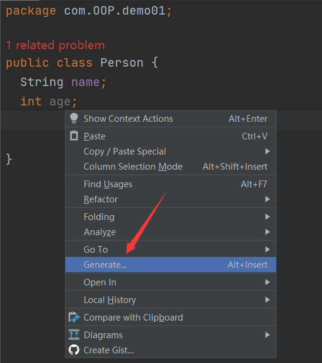

选中生成对应的**有参**构造器，`Select None`生成**无参**构造器

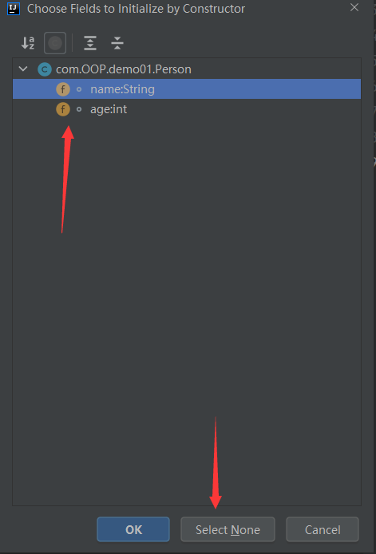


**Java有自动的垃圾回收器，不支持析构器**


## 内存分析

```java
package com.OOP.demo01;

public class Pet {
  public String name;
  public int age;

  // 无参构造

  public void shout() {
    System.out.println("叫了一声");
  }
}
```

```java
package com.OOP.demo01;

public class Application {
  public static void main(String[] args) {
    Pet dog = new Pet();
    dog.name = "旺财";
    dog.age = 3;
    dog.shout();
    Pet cat = new Pet();
  }
}
```

> `String`类的修饰符有`final`，所以`dog.name`是常量
>
> 堆中的对象的方法还是调用的方法区中类的方法

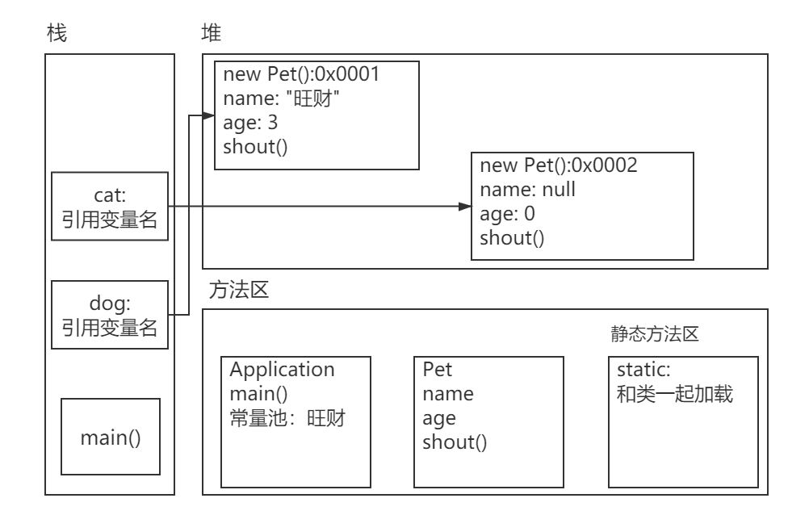


## 封装

数据隐藏：禁止外部**直接访问**一个对象中的数据，而应该通过**接口**来访问。

- `get`：（**域访问器**）**获得**实例域值
- `set`：（**域更改器**）**设置**实例域值

> 封装赋予了对象"黑盒"特征
>
> 高内聚：类的内部数据操作细节自己完成，不对外暴露
>
> 低耦合：仅暴露少量方法供外部操作
>
> **可以提高代码的安全性，隐藏代码的实现细节，统一接口，增加了系统的可维护性**


1. 属性私有

   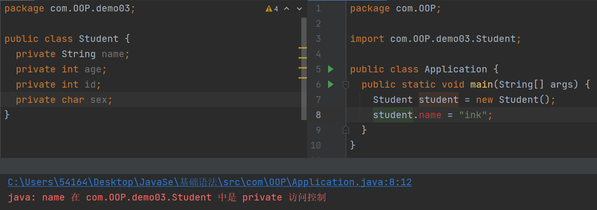

2. **接口方法**（驼峰命名）

   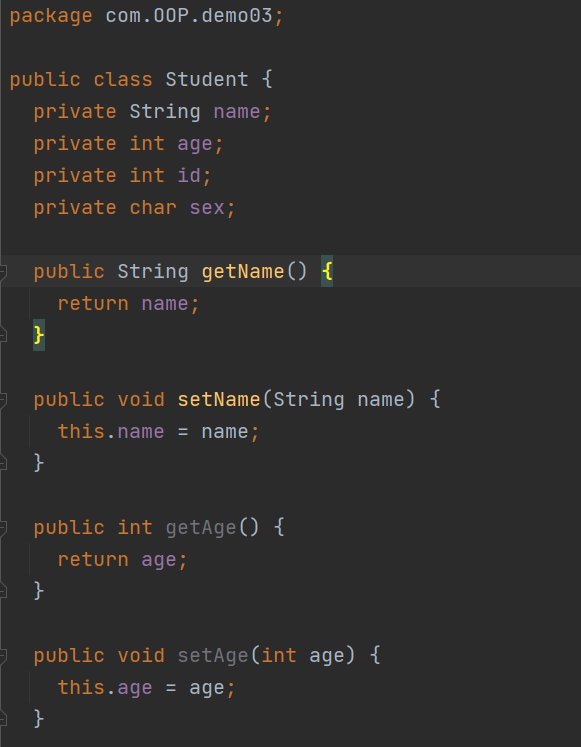

   使用`set`方法设置属性值

   使用`get`方法获取属性值

   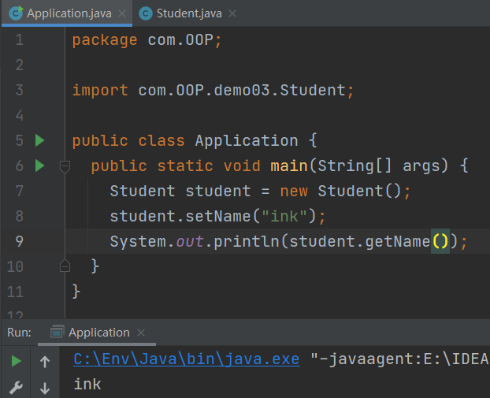

   

   快捷键：alt+insert

   **Getter and Setter** 自动生成最原始的接口方法

   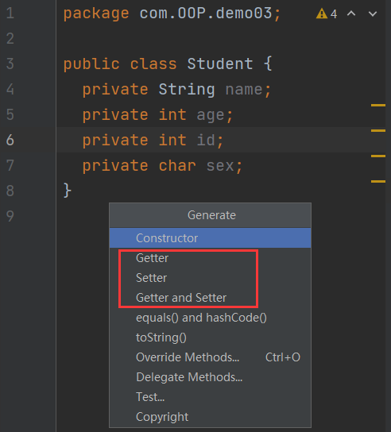

3. 可以在接口方法内增添代码实现各种功能

   ```java
   public void setAge(int age) {
     if (age < 0 || age > 120) {
       this.age = 0;
     } else {
       this.age = age;
     }
   }
   ```


## 继承

`inheritance`

继承是类和类之间的一种关系。继承关系的两个类，一个为**超类`superclass`（基类，父类）**，一个为**子类`subclass`（派生类，孩子类）**，用关键字`extends`表示

子类拥有超类的所有`public`修饰的属性和方法，`private`的属性和方法不会被继承（通过共有接口访问超类的私有属性）

**继承的本质**：对某**一批类**的抽象（对类再抽象）

> Java中类只有单继承，没有多继承。所有继承都是公有继承
>
> 类和类之间的关系还有**依赖**，**组合**，**聚合**等


### 子类构造器

- 子类的构造器可以通过`super`调用超类的构造器（必须放在第一条语句）

- 子类的**无参构造器**中默认调用超类的无参构造器，当显式调用时，超类的构造器必须在最前面
- 当超类存在**有参构造器**时（超类如果有无参构造也必须显式）。如果此时超类没有显式定义无参构造，则**子类的无参构造中也必须显示调用超类的有参构造**，而不能隐式调用超类的无参构造。

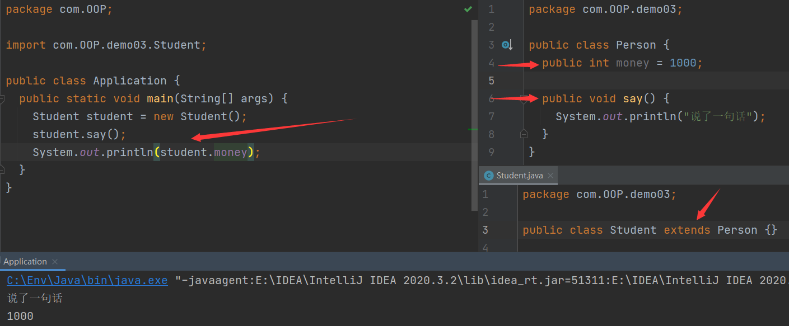


### 继承层次

由一个公共超类派生出来的所有类的集合被称为继承层次（inheritance hierarchy），在继承层次中，从某个特定类到其祖先的路径被称为该类的**继承链**（inheritance chain）

快捷键：ctrl+h 打开**继承树**

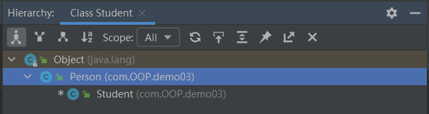


### 覆盖方法

想调用超类的方法而不是子类的方法时，`super`指示编译器调用超类`public`修饰的属性和方法

> `private`的属性和方法不会继承，所以`super`无法调用
>
> `super`不是一个对象的引用，不能将`super`赋给另一个对象变量


**super**：

- 只能在**继承**的前提下才可以使用

- 子类通过`super`调用父类的构造器时，必须放在第一位
- `super`只能出现在子类的方法中
- `super`和`this`不能同时调用构造器（都必须在第一位）

```java
package com.OOP.demo03;

public class Person {
  protected String name = "Person_name";

  public void print() {
    System.out.println("Person");
  }
}
```

```java
package com.OOP.demo03;

public class Student extends Person {
  private String name = "Student_name";

  public void test1() {
    // 当前类的属性
    System.out.println(this.name);
    // 父类的属性
    System.out.println(super.name);
  }

  public void print() {
    System.out.println("student");
  }

  public void test2() {
    // 当前类的方法
    print();
    this.print();
    // 父类的方法
    super.print();
  }
}
```

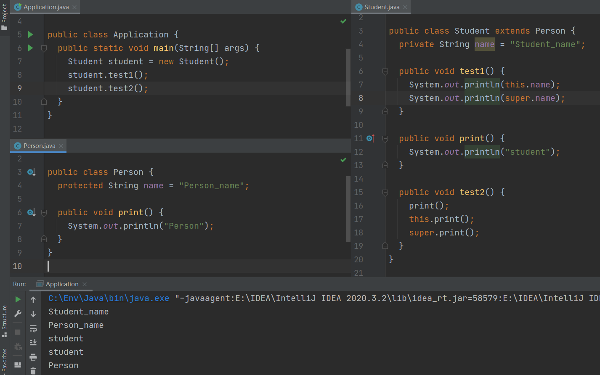

### final类

被`final`修饰的类无法被继承

类中的方法也可以被声明为`final`，子类无法覆盖这个final方法

`final`类中方法自动成为`final`方法


### Object类

即使类中不写方法，在`new`一个对象后仍然有方法可以调用。这是因为在Java中**所有类都默认直接或者间接继承`Object`类**

可以用`Object`类型的变量引用任何类型的对象，但想要对其中的内容进行操作，还需要强制类型转换。

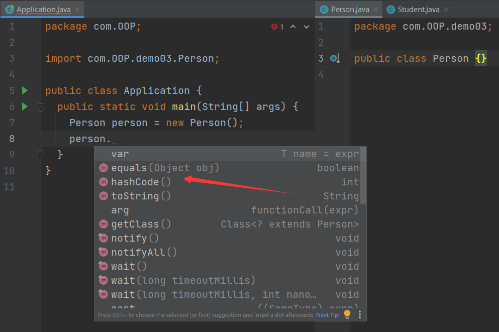

查看`Object`类

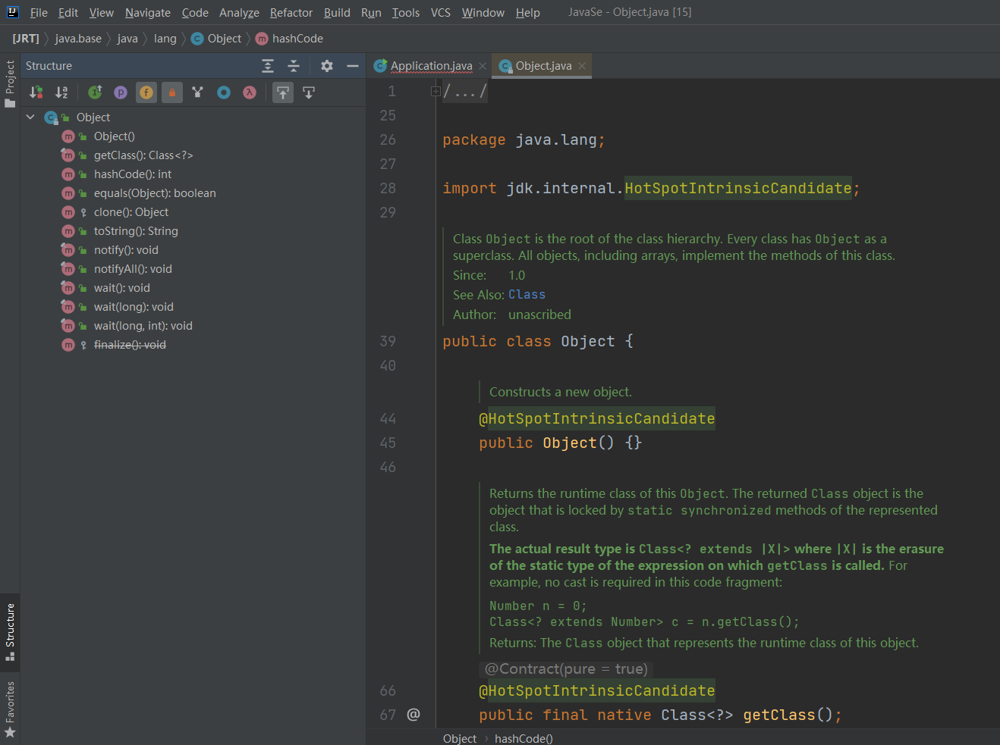

`Object`类中的方法

- `equals()`：判断两个对象是否具有相同的引用
- `hashCode()`：散列码
- `toString()`：返回标识对象值的字符串


### 方法重写

`@Override`：**注解**（有功能的注释）

方法的重写需要有**继承**关系，是子类重写父类的**（非静态）方法**

- 重写的**方法名**必须相同
- 重写的方法**参数列表**必须相同
- 重修的方法的**修饰符**范围可以扩大，但不能缩小（`public` > `protected` > `Default` >  `private`）
- 抛出的**异常**范围可以缩小，但不能扩大
- `private`修饰的方法无法重写


快捷键：ctrl+o

> 重写的方法对应的**侧边栏**会有符号箭头表示

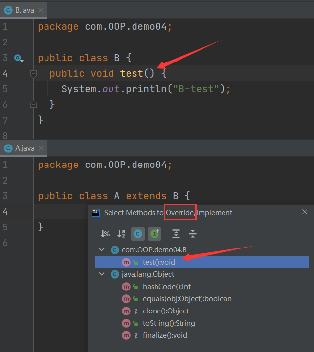

```java
package com.OOP.demo04;

public class B {
  public void test() {
    System.out.println("B-test");
  }
}
```

```java
package com.OOP.demo04;

public class A extends B {
  @Override
  public void test() {
    // 默认调用了父类的test()方法
    super.test();
    // 可以修改成自己的方法
  }
}
```


**重写只对非静态方法有用**

> 重写静态方法编译器不会报错（Java不会阻止这么做）但得不到预期的结果
>
> 静态方法在**编译阶段**就被编译出来的类型进行绑定。使用对象引用来访问静态方法只是Java设计者给程序员的自由。应该**直接使用类名来访问静态方法**，而不要使用对象引用来访问。

1. **静态方法**：静态方法是**类的方法**，方法调用只和左边定义的**类**有关

   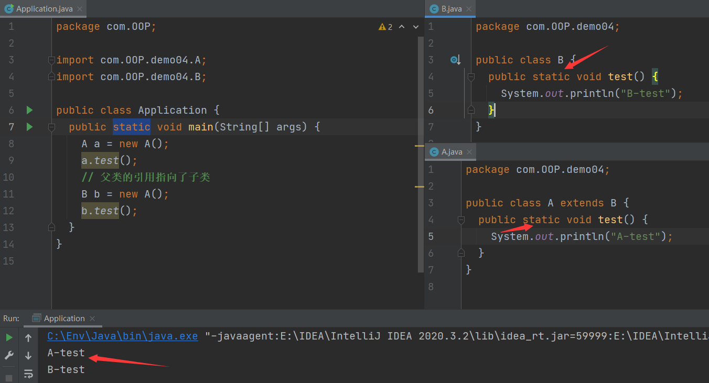

   

2. **非静态方法**：非静态方法是**对象的方法**，要看对象左边的**类**。b是A类`new`出来的对象，所以b调用的是**A类的方法**。

   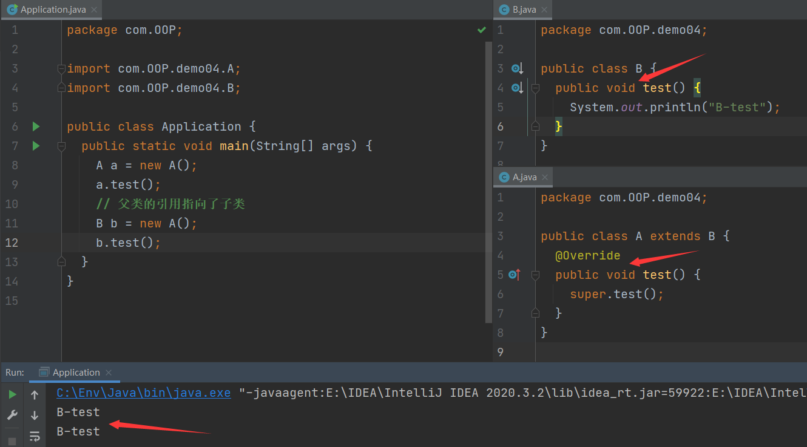


## 多态

同一个方法根据对象的不同而采取不同的行为方式，即一个对象变量可以指示多种实际类型

Java中，**对象变量是多态的**，可以将子类对象赋给超类变量（但不能将父类对象赋给子类变量）

> 在运行时能自动选择调用哪个方法的现象称为动态绑定（dynamic binding）

**无法重写的方法无法实现多态**（`static`，`final`，`private`修饰的方法都不行）

多态的前提：

- 有**继承**关系

- 子类**重写**了父类的方法

- **父类引用指向子类对象**（关键）

  ```java
  Father f = new Son();
  ```

> 多态可以实现动态编译，增加程序的可扩展性。
>
> 类型的**执行状态**只有在程序执行的时候才能确定，在编写的时候是确定不了的。


一个对象的**实际类型**是确定的，但是可以**指向对象的引用类型**有很多

> 父类引用指向子类对象

```java
// 右侧的对象实际类型new Student()是确定的
// 左侧指向对象的引用可以有很多类型(必须有继承关系)
Student s1 = new Student();
Person s2 = new Student();
Object s3 = new Student();
```


非静态方法是**对象的方法**，只能调用对象左边的**类**中的方法。

**调用方法**情况：

1. 父类引用正常执行父类自己的方法
2. **子类重写了父类的方法**，那么父类引用会执行子类的方法（共有的方法）
3. **父类不能调用子类独有的方法**（需要强制类型转换）

> 类型转换异常：`ClassCastException`

```java
package com.OOP.demo03;

public class Person {
  // 父类自己的方法
  public void print() {
    System.out.println("Person");
  }
}
```

```java
package com.OOP.demo03;

public class Student extends Person {
  // 重写父类的方法
  @Override
  public void print() {
    System.out.println("Student");
  }
  // 子类自己的方法 
  public void stu() {
    System.out.println("子类独有的方法");
  }
}
```

```java
package com.OOP;

import com.OOP.demo03.Person;
import com.OOP.demo03.Student;

public class Application {
  public static void main(String[] args) {
    Student s1 = new Student();
    Person s2 = new Student();
    Object s3 = new Student();
    s1.print();
    // 重写了方法，所以调用的是子类的方法
    s2.print();
    // 必须强制类型转换才可以调用stu()方法
    ((Student) s2).stu();
  }
}
```

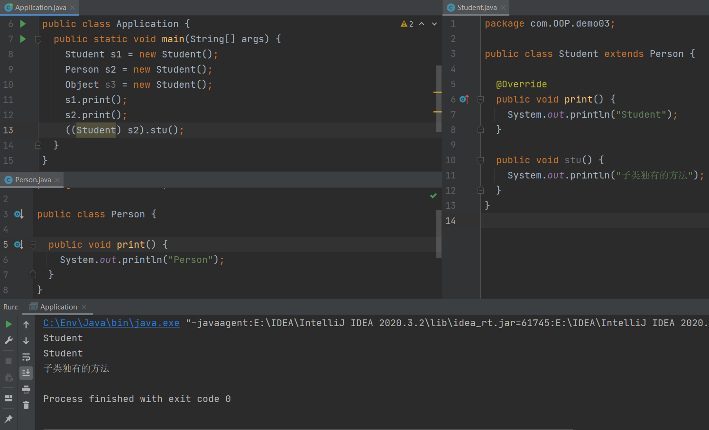


## 类型转换

**引用类型**间的类型转换

`instanceof`可以判断两个（有联系的）类之间**是否存在继承关系**

完全没有联系的类判断不了（直接**编译报错**）

```java
public class Application {
  public static void main(String[] args) {
    Object object = new Student();
    System.out.println(object instanceof Student);
    System.out.println(object instanceof Person);
    System.out.println(object instanceof Object);
    // Teacher就会返回false
  }
}
```

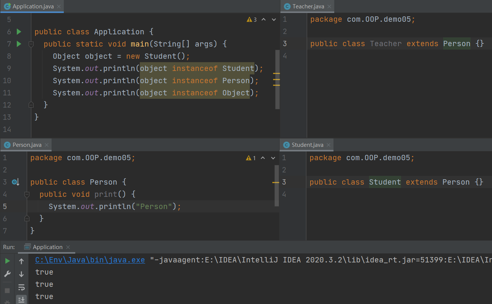


**转换**：

1. 子类引用对象（低）转父类引用对象（高）：**自动转换**

   **向上转型，会丢失子类中原本可以直接调用的方法**

   ```java
   public class Application {
     public static void main(String[] args) {
       Student student = new Student();
       Person person = student;
       // 无法调用Student类的p方法
       person.p();
     }
   }
   ```

2. 父类引用对象（高）转子类引用对象（低）：**强制类型转换**

   **向下转型，会丢失父类被子类重写的方法**

   ```java
   public class Application {
     public static void main(String[] args) {
       // 高            低
       Person obj = new Student();
       // 强制转换
       Student s = (Student) obj;
       s.student();
     }
   }
   ```


## 对象包装器

将基本类型转换为对象。所有的基本类型都有一个与之对应的类，这些类被称为包装器（wrapper）。

- `int`：`Integer`
- `char`：`Character`
- `double`：`Double`
- `boolean`：`Boolean`
- `byte`：`Byte`

> 数值型包装类都继承超类`Number`，而字符型和布尔型继承超类`Object`

一旦构造了包装器，就不再允许更改包装在其中的值。并且对象包装器类是`final`，不能定义它们的子类

**自动装/拆箱机制**

因为包装器的引用可以为`null`，所以自动装箱可能会抛出`NullPointerException`异常

```java
ArrayList<Integer> list = newArrayList<>();
list.add(3);
// 自动装箱,相当于
list.add(Integer.valueOf(3))
// 当给一个Integer对象赋int值时,会自动拆箱
```


## 枚举类

```java
public enum Size{SMALL,MEDIUM,LARGE};
```

声明类型是一个类，刚好有3个实例。尽量不要构造新对象。

- 在比较两个枚举类型的值时，永远不要调用`equals`，要直接使用`= =`
- 所有枚举类都是`Enum`类的子类


## static

**静态**修饰符

- **静态变量**（类变量）：对于类而言内存中只有一个，被**类的所有对象共享**

  > 普通的实例域在每个对象都有一份自己的拷贝

- **静态方法**（类方法）：跟类一起加载 ，**不能操作对象**，**用类名调用**

  `main`方法就是一个静态方法

  > 没有this参数的方法
  >
  > 静态方法可以访问自身类中的静态域
  >
  > 工厂方法

- **静态代码块**：**类一加载就直接执行，只执行一次** 

  > **静态代码块只执行一次** ！只有实例化第一个对象的时候会调用，后面不会再执行
  >
  > **执行先后顺序**：
  >
  > 1. 静态代码块
  > 2. 匿名代码块
  > 3. 构造器


## 抽象类

只想将祖先类作为派生其他类的基类。

- `abstract `
  - **抽象类**：`abstract`关键字修饰的类
  - **抽象方法**：`abstract`关键字修饰的方法
- 抽象类中**可以没有抽象方法**，此时必须将**子类也标记为抽象类**
- **有抽象方法的类必须被声明为抽象类**
- **抽象类中可以有具体数据和方法**
- **抽象类不能使用`new`关键字创建对象**（不能被实例化）
- 可以定义一个**抽象类的对象变量**，但**只能引用非抽象子类的对象**
- **抽象方法是用来让子类实现的**，只有方法声明，没有方法实现
- **子类继承抽象类就必须实现抽象类没有实现的抽象方法**，否则要将子类也声明为抽象类

```java
// 抽象类
public abstract class Action {
  // 抽象方法
  public abstract void dosth();
}
```

```java
// 子类继承
public class A extends Action {
	// 重写
    @Override
    public void dosth() {
    }
}
```

**局限性**：

抽象类离不开继承`extends`，但是java只能是单继承

> 通过接口实现多继承

> 思考：
>
> 1. 不能被实例化，是否存在构造器
> 2. 存在的意义


# 接口

`interface `

接口不是类，而是对类的一组需求描述，这些类要遵从接口描述

> 接口就是规范，定义了一组规则，制定好后大家一起遵守
>
> 面向接口编程

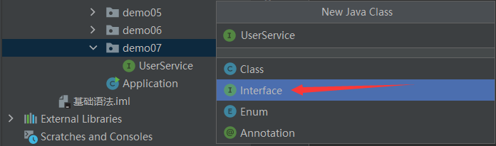


**区别**：

- **普通类**：只有具体实现

- **抽象类**：具体实现和**规范**（抽象方法）

- **接口**：**只有规范**（没有实现）

  > 约束和实现分离


## 接口特点

- 接口中的所有的**变量定义**都默认是`public static final`修饰（即可以有常量）
- 接口中的所有的**方法定义**都默认是`public abstract`修饰（抽象）
- 接口不能含有实例域（可以看成没有实例域的抽象类）
- 接口**不能被实例化**，**没有构造方法**（和抽象类相同），但可以声明接口变量
- 接口需要有**实现类**，**重写**接口里面的规范（方法）
  - **实现类名**：接口名+`Impl`	
  - **实现类关键字**：`implements`（可以实现多个类）
  - 实现类自动继承接口中的常量
- **接口变量**必须引用实现了接口的类对象（`instanceof`判断）
- 接口也可以被**继承**


## 默认方法

可以给接口方法提供一个默认实现，用`default`修饰符标记。子类的每一一个实际实现都会覆盖这个方法。

当超类或者另一个接口也定义了同样的方法，就会发生冲突

**冲突解决**：

1. **超类优先**
2. **接口冲突**


## 实现类

**可以实现多个接口**，相当于实现了多继承（伪）

1. 将类声明为实现给定的接口：`implements`
2. 对接口中所有的方法进行定义（方法必须声明为`public`）

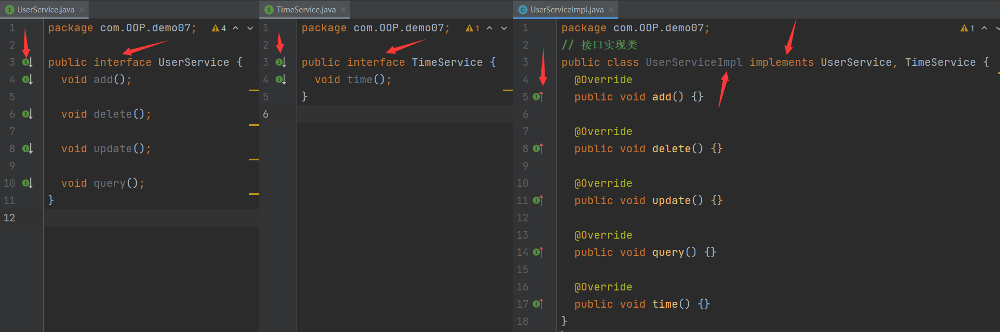

```java
// 接口
public interface UserService {
  void add();
  void delete();
  void update();
  void query();
}

// 接口
public interface TimeService {
  void time();
}
```

```java
// 接口实现类
// 实现两个接口(重写两个接口的所有方法)
public class UserServiceImpl implements UserService, TimeService {
  @Override
  public void add() {}
  @Override
  public void delete() {}
  @Override
  public void update() {}
  @Override
  public void query() {}
  @Override
  public void time() {}
}
```


# lambda表达式

**lamda表达式（λ）**是一个可传递的代码块，可以在**将来**执行一次或多次。

> 带参数变量的表达式被称为lambda表达式

## 语法

1. **参数**：
   1. 没有参数就用`()`
   2. 可以推导出一个lambda表达式的参数类型时，可以忽略其类型
   3. 如果方法只有一个参数且参数类型可以推导出，还可以省略`()`
2. **->**：箭头
3. **表达式**
4. **{}**：如果代码实现无法放在一个表达式中，可以放在`{}`中

> 不需要指出表达式的返回类型，会由上下文推出

```java
// 表达式
(String f,String s)
	->f - s
        
//
(String f,String s)->
	{
        if(f < s)return -1;
        else if(f > s)return 1;
        else return 0;
    }
```


## 函数式接口

对于**只有一个抽象方法的接口**，需要这种接口的对象时，可以**提供一个lambda表达式**，这种接口称为函数式接口

> Object不是一个函数式接口，不能把lambda表达式赋给类型为Object的变量


## 方法引用

传递方法当作参数


## 构造器引用


# 内部类

`inner class`：在一个类的内部再定义一个类（**外部类**和**内部类**）

1. 内部类方法可以访问该类定义所在的作用域中的数据，**包括私有数据**
2. 内部类可以对**同一个包中的其他类**隐藏起来
3. 当想要定义一个回调函数时，使用**匿名内部类**比较方便

> 一个java类中可以有多个`class`类，但只能有一个`public class`
>
> 内部类的中声明的所有静态域都必须是`final`（一个静态域只有一个实例）
>
> 内部类中不能由`static`方法


**内部类类型**：

- **成员**内部类
- **静态**内部类
- **局部**内部类
- **匿名**内部类

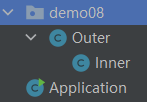


## 成员内部类

- **内部类的对象由外部类对象构造**`Outer.Inner inner =  outer.new Inner();`
- 内部类的对象总有一个**隐式引用**指向创建它的外部类的对象
- **内部类的对象可以获得外部类的私有的属性和方法**

```java
// 外部类
public class Outer {
  private int id = 10;

  public void out() {
    System.out.println("这是外部类方法");
  }
  // 成员内部类
  public class Inner {
    public void in() {
      System.out.println("这是内部类方法");
    }
    // 获得外部类的私有属性
    public void getId() {
      System.out.println(id);
    }
  }
}
```

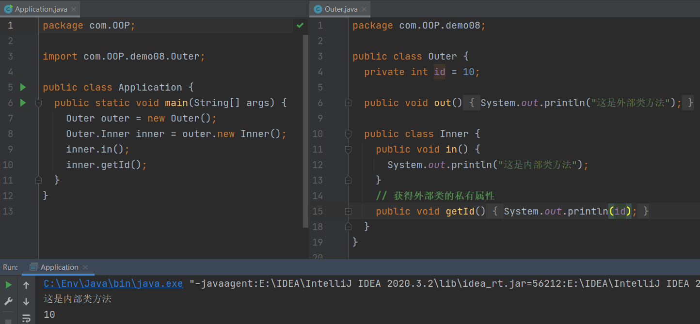


## 静态内部类

在**成员内部类**前加上`static`关键字

**无法获得外部类的非静态属性**

- 静态内部类可以有静态域和方法
- 声明在接口中的内部类自动称为`static`和`public`类

```java
// 外部类
public class Outer {
  private int id = 10;

  public void out() {
    System.out.println("这是外部类方法");
  }
    
  // 静态内部类
  public static class Inner {
    public void in() {
      System.out.println("这是内部类方法");
    }
    // 无法获得外部类的私有属性
    // public void getId()
  }
}
```


## 局部内部类

在**方法中**定义的内部类

- 局部类不能用`public`或者`private`声明，它的**作用域被限定在声明局部类的块中**
- 局部类对外界完全隐藏，除了声明的方法，外部类中的其他代码也无法访问它
- 局部类可以访问（事实上为`final`的）局部变量

```java
public class Outer {
  public void method() {
    
    //局部内部类
    class Inner {
      public void in() {}
    }
  }
}
```


## 匿名内部类

`anonymous inner class`

没有名字去初始化类，只创建这个类的一个对象，不用将实例保存到变量中

**匿名内部类没有构造器**（构造器名必须和类名相同），要将**构造器参数传给超类构造器**。

```java
public class Application {
  public static void main(String[] args) {
    new A().b();
  }
}

class A {
  public void b() {
    System.out.println("c");
  }
}
```


# 异常

`Exception`

- **检查性**异常`CheckedException`：在编译时不应被忽略
- **运行时**异常`RuntimeException`：可以在编译时被忽略

`Error`：**错误**不是异常，在编译时也检查不到（如：栈溢出） 

**区别**：

- `Error`是程序无法控制和处理的，出现时JVM一般选择终止线程
- `Exception`通常是可以被程序处理的，并且程序中应当尽可能的去处理异常


**实际中的异常处理**：

- 处理运行时异常时，尽量使用**逻辑**合理规避和`try-catch`处理
- 在多种`catch`的**最后**可以加一个`catch (Exception e)`来处理可能遗漏的异常
- 对不确定的代码增加`try-catch`处理潜在的异常
- 尽量添加`finally`语句去**释放占用资源**


## 异常体系结构

`Throwable`

1. Java把**异常也当作对象**处理
2. Java中定义了一个基类：`java.lang.Throwable`，将它作为**所有异常的超类**

> `java.lang.Error`是错误信息
>
> `java.lang.Exception`是异常信息

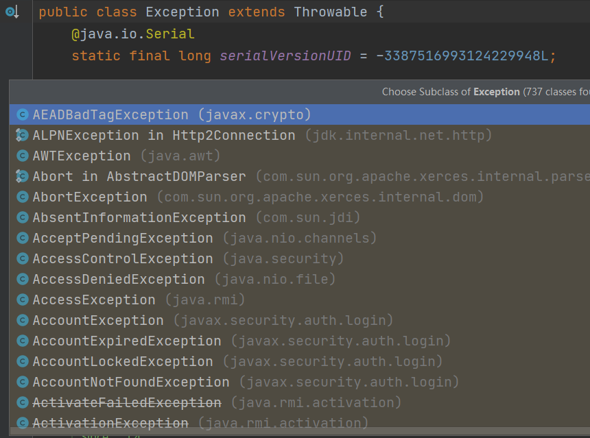


Java API中定义了很多异常类，分为两大类：

- **错误**`Error`：Error类对象由**Java虚拟机**生成并抛出
  - Java虚拟机运行错误：JVM一般会选择**线程终止**
- **异常**`Exception`
  - **运行时**异常：程序中可以选择**捕获**，也可以不处理
    - **算术异常**
    - **丢失资源**
    - **找不到类**
    - **空指针**
    - **数组下标越界**

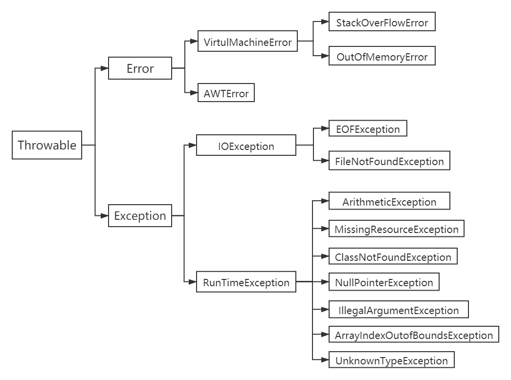


## 异常处理

- 抛出异常：不用处理
- 捕获异常
- 捕获异常并再次抛出异常

> 异常处理不能代替简单的测试


### 捕获异常

**快捷键**：选中 + `Ctrl + Alt +t`

1. `try`：监控代码块
2. `catch`：捕获异常
3. `finally`：无论是否有异常被捕获都会执行

`try`语句块中的任意代码抛出了一个在`catch`子句中说明的异常类时，程序就将跳过`try`语句块中的其余代码并指向`catch`子句中的处理代码

`try`语句块中的任意代码抛出了一个没有在`catch`子句中说明的异常类时，方法就会立刻退出

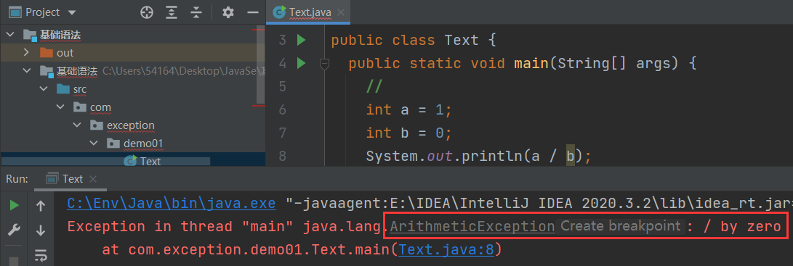


1. `try`和`catch`要一起使用
2. `catch`中的**参数**是想要捕获的**异常类型**
3. `catch`可以多次使用（捕获多种异常），但是**范围大的异常需要放在最后**（否则报错）并且多`catch`类似于`else if`，只会生效一个（底下范围大的异常不会再生效）

> 捕获多种异常的时候，默认异常变量隐含为`final`变量

```java
package com.exception.demo01;

public class Text {
  public static void main(String[] args) {
    int a = 1;
    int b = 0;

    try { // 监控
      System.out.println(a / b);
    } catch (ArithmeticException e) { // 捕获异常
      System.out.println("算术异常");
    } finally { // 善后工作
      System.out.println("finally");
    }
  }
}
```

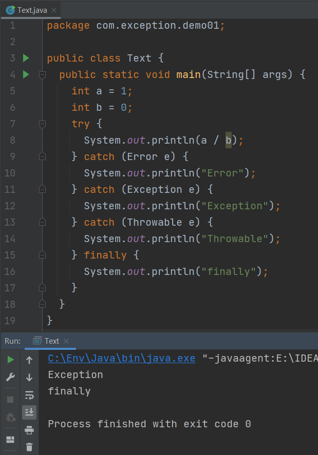


快捷键：ctrl+alt+t

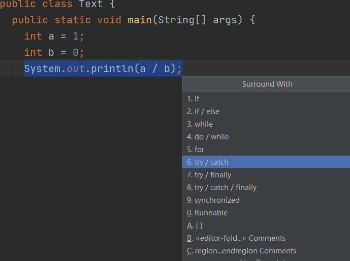


打印错误信息`printStackTrace()`

```java
catch (Exception e) {
    e.printStackTrace();
}
```


### 抛出异常

方法应该在首部声明所有可能抛出的异常，异常类之间用逗号隔开

如果子类重写了超类的一个方法，**子类方法中声明的受查异常不能比超类方法中声明的异常更通用**，即子类可以抛出更特定的异常或者根本不抛出异常

**如果超类方法没有抛出任何异常，则子类也不能抛出任何异常**

一旦方法抛出了异常，这个方法就不会返回到调用者

**找到合适的异常类，创建这个异常类的一个对象，将这个对象抛出**

- `throw`：在**方法中**主动抛出异常对象（`new`）
- `throws`：假设方法处理不了这个异常，在**方法上**主动抛出异常

```java
package com.exception.demo02;

public class Test {

  public static void main(String[] args) {
  	// 匿名内部类
    new Test().test(1, 0);
  }
  
  // throws 在方法上主动抛出异常
  public void test(int a, int b) throws ArithmeticException {
    if (b == 0) {
      // throw 在方法中主动抛出异常
      throw new ArithmeticException();
    }
    System.out.println(a / b);
  }
}
```

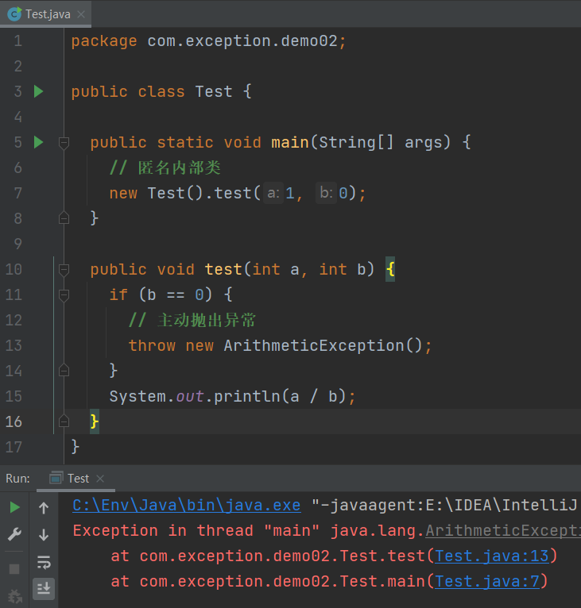


### 再次抛出异常

在`try catch`语句中的`catch`子句中通过`throw`抛出异常

**包装**：**将原始异常设置成新异常的原因**，既可以抛出高级异常，又不会丢失原始异常


### 堆栈轨迹

**stack trace**

- `printStackTrace()`：访问堆栈轨迹的文本描述信息
- `getStackTrace()`：返回`StackTraceElement`对象的一个数组
- `StackTraceElement`类：含有能获得文件名和当前执行的代码行号的方法和获得类名和方法名的方法。

## 自定义异常

1. 创建自定义异常类，只需要**继承`Exception`类**即可

2. 自定义异常类需要有两个构造器，一个是默认的构造器，一个是**带有详细信息的构造器**

3. 在方法中通过`throw`关键字抛出创建异常类的一个对象

4. 在当前抛出异常的方法中处理异常，可以用`try-catch`捕获异常并处理

5. 如果当前方法无法处理，在方法的声明处通过`throws`指明要抛出给调用者的异常，由调用者捕获异常并处理

   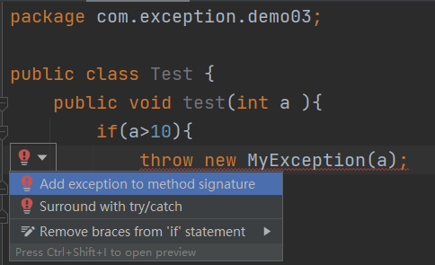


**自定义异常**

```java
package com.exception.demo03;

public class MyException extends Exception {
  // 传递
  private int id;

  // 构造器,传递异常信息需要有参构造
  public MyException(int a) {
    this.id = a;
  }

  // toStrng:异常打印信息
  @Override
  public String toString() {
    return "MyException{" + "异常值是" + id + '}';
  }
}
```

**调用**

```java
package com.exception.demo03;

public class Test {
  // 可能会出现异常,throws交给调用者处理异常
  static void test(int a) throws MyException {
    // 当传入值大于10时异常
    if (a > 10) {
      // 抛出自定义异常对象
      throw new MyException(a);
    }
    System.out.println("OK,无异常");
  }

  public static void main(String[] args) {
    try {
      test(10);
      test(11);
    } catch (MyException e) {
      System.out.println("MyException: " + e);
    }
  }
}
```

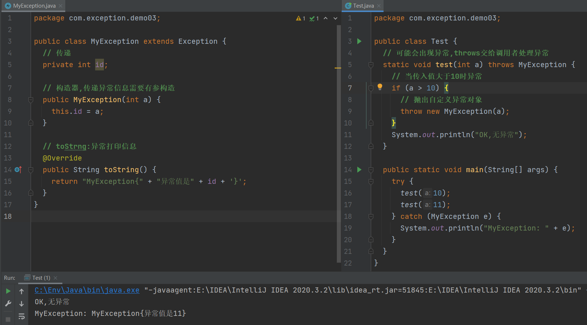


# JUnit单元测试

`JUnit`

1. 选择当前工程，右键`Build Path`，然后`Add Libraries-JUnit`
2. 创建单元测试类
   - 此类是`public`
   - 此类提供公共的无参构造器（默认不写即可）
3. 在类中声明单元测试方法：`public void testXxx{}`
   - 方法权限为`public`
   - 没有返回值和形参
4. 在此单元测试方法上加上注解`@Test`，并在单元测试类中导入
5. 在单元测试方法体内测试相关代码
6. 左键双击选中单元测试方法名-右键`Run As`-`JUnit Test`

> 单元测试方法可以直接调用单元测试类中的属性，不用再通过对象调用


快捷：

1. 创建单元测试类
2. 在类中声明单元测试方法
3. 在此单元测试方法上加上注解`@Test`
4. `alt+enter`一键导入：`import org.junit.Test;`


# Jar包

导入jar包，使用API

1. 创建`lib`目录，并将jar包复制进去
2. 右键`Add as Library`

