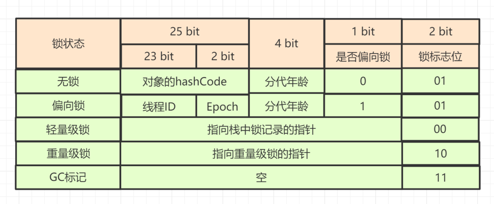

# JUC并发编程

`java.util.concurrent`

- 并发执行不一定比串行快，**因为线程创建和上下文切换会有开销**，即多线程不一定快

- 资源限制：程序的执行速度受限于计算机硬件和软件资源

  - 硬件资源：带宽的上传，下载速度，硬盘读写速度，CPU处理速度

  - 软件资源：数据库的连接，socket连接数

# volatile

volatile轻量级的synchronized，**在并发中保证共享变量的可见性**

- **可见性**：当一个线程修改了变量值，这个新值能被其他线程立刻观察到
- 比synchronized的使用和执行成本低，因为volatile不会引起线程上下文的切换和调度
- volatile不能保证原子性

volatile可以**禁止指令重排**来保证其修饰变量的**有序性**

- volatile在其汇编代码中有一个lock操作，这个操作相当于一个内存屏障，指令重排不能越过内存屏障。具体来说在执行到volatile变量时，内存屏障之前的语句一定被执行过了且结果对后面是已知的，而内存屏障后面的语句一定还没执行到；在volatile变量之前的语句不能被重排后其之后，相反其后的语句也不能被重排到之前。

## 实现原理

> Java允许线程访问共享变量，为了确保共享变量能够被准确和一致的更新，线程需要确保通过排它锁单独获得这个共享变量

如果一个字段被声明为volatile，Java内存模型会确保所有线程看到的变量值是一样的

### volatile实现原则

#### 可见性

volatile修饰的共享变量进行写操作时会多出一条Lock汇编指令，Lock前缀指令在多核处理器中会引发两件事情

1. **将当前处理器缓存行的数据写回到系统内存**
2. **写回到系统内存操作会让其他CPU里缓存改内存地址的数据无效**

> Lock指令会导致在执行指令期间，声言处理器的LOCK#信号，LOCK#信号会把缓存锁住（锁总线开销太大）

CPU不直接与内存通信，而是将内存数据先读到缓存中再进行操作，但不知何时将其写回内存。如果对volatile修饰的共享变量进行了写操作，JVM就会向处理器发送Lock前缀指令，将在缓存行中的数据写回内存

在多处理器下，为了保证各个处理器的缓存是一致的，就会实现**缓存一致协议**

- 每个处理器通过嗅探在总线上传播数据来检查自己的缓存是否过期
- **如果处理器发现自己缓存行对应的内存地址被修改了，就会将当前的缓存行设置为无效状态**
- 处理器并不会直接修改缓存，而是当处理器需要对这个数据进行修改操作时，重新从内存中读取到缓存中

> 缓存一致性机制会阻止同时修改两个以上处理器缓存的内存区域数据

#### 有序性

volatile的Lock汇编指令相当于一个内存屏障，指令重排不能越过内存屏障

- 在执行到volatile变量时，内存屏障之前的语句一定被执行过了且结果对后面是已知的，而内存屏障后面的语句一定还没执行到
- 在volatile变量之前的语句不能被重排后其之后，相反其后的语句也不能被重排到之前

# Synchronized

**重量级锁**

> JVM关键字，依赖于操作系统的系统调用实现

synchronized可以保证操作的原子性

- 当有多个线程同时操作共享数据时，任何时刻只有一个线程能进入临界区操作共享数据，其他线程必须等待

- synchronized通过同步锁保证线程安全，进入临界区前必须获得对象的锁，其他没有获得锁的线程不可进入。当临界区中的线程操作完毕后，它会释放锁，此时其他线程可以竞争锁，得到锁的那个线程便可以进入临界区

synchronized还可以保证可见性

- 对一个变量的unlock操作之前，必须先把变量同步回主内存中

synchronized还可以保证有序性

- 一个变量在任何时刻只能有一个线程对其进行lock操作，即任何时刻只有一个线程可以获得该锁对象，所以持有同一把锁的两个同步块只能串行进入

## 实现原理

Java中**任何对象都可以作为锁**

- 普通同步方法：锁的是当前实例对象
- 静态同步方法：锁的是当前类的Class对象
- 同步方法块：锁的是Synchronized括号中的对象

当一个线程试图**访问同步代码块时，它必须先获得锁，退出或抛出异常时必须释放锁**

### Synchronized在JVM中的实现

JVM基于进入和退出**Monitor对象**来实现方法和代码块同步

- 代码块同步：**使用monitorenter和monitorexit指令实现**
  - monitorenter指令是在编译后插入到同步代码块的开始位置
  - monitorexit指令则是插入到方法结束处或者异常处
- 方法同步：用另一种方式实现，也可以和代码块同步一样实现

JVM保证每个monitorenter指令后面都要有一个对应的monitorexit指令来配对

**任何对象都有一个moniot相关联**，当且仅当一个monitor被持有后，它将处于锁定状态，线程执行到monitorenter指令时，会尝试获取对象所对应的monitor的所有权，**这就是获取对象的锁**

## Java对象头

Synchronized使用的**锁存在Java对象头中**

**Java对象头**

- **Mark Word**
  - 存储对象的hashcode值，分代年龄，锁标志位等
- **Class Metadata Address**
  - 存储到对象类型的指针
- **Array length**
  - 数组的长度

**Mark Word**

- **锁状态**
- **是否是偏向锁**
- **锁标志位**
- 对象的hashcode值
- 对象分代年龄

其中根据锁标志位，Mark Word存储的数据会发生变化

- 00：轻量级锁
- 10：重量级锁
- 11：GC标记
- 01：偏向锁

## 锁状态

JDK1.6为了减少获得锁和释放锁带来的性能消耗，**引入了偏向锁和轻量级锁**

因此锁分为4种状态，依次是

- 无锁状态
- 偏向锁状态
- 轻量锁状态
- 重量锁状态

## 锁升级

**JVM对锁的一种优化**

- 4种锁状态会随着竞争逐渐升级
- **锁可以升级但不能降级**，这样可以提高获得和释放锁的效率

> JVM对锁的优化还有锁升级，锁粗化，锁消除等
>
> 锁升级的过程使得synchronized锁有了很大的性能提升

## 锁消除

JVM即时编译时对一些代码上要求同步，**对被检测到不可能存在共享数据竞争的锁进行消除**

锁消除的依据来源于**逃逸分析**技术

- 堆上的所有数据都不会逃逸出去被其他线程访问到，就可以把它们当栈上的数据对待，认为它们是线程私有的，同步加锁就是没有必要的

# 偏向锁

大多数情况，**锁不仅不存在多线程竞争，而且总是由同一线程多次获得**

- 持有偏向锁的线程永远不需要再进行同步
- **偏向锁在无竞争的情况下把整个同步都消除掉，CAS操作也没有了**
- 适合于同一个线程请求同一个锁，不适用于不同线程请求同一个锁

## 偏向锁的获取

- 当一个线程访问同步代码块并获取锁时，会在**对象头**和**栈帧中的锁记录中**存储锁偏向的线程ID
- 以后该偏向的线程在进出同步代码块时**不需要进行CAS操作来加锁和解锁**，只需要测试对象头的Mark Word里是否存储着指向当前线程的偏向锁
  - 如果测试成功，表示线程已经获得了锁
  - 如果测试失败，再测试Mark Word中偏向锁的标识是否设置为1（表示是偏向锁）
    - 如果没有设置为1，则使用CAS竞争锁
    - **如果设置为1，则尝试用CAS将对象头中的偏向锁指向当前线程**

## 偏向锁的释放

偏向锁不会主动释放，它是等到竞争时才释放锁，**即当其他线程尝试竞争偏向锁时，持有偏向锁的线程才会释放锁**，并且偏向锁的释放需要等到**全局安全点**（在这个点上没有正在执行的字节码）

1. 释放偏向锁首先需要**暂停持有偏向锁的线程**，然后检查持有偏向锁的线程是否存活
2. 如果线程不存活，则将对象头设置为**无锁状态**
3. 如果线程依然存活，**持有偏向锁的线程的栈**会被执行，遍历偏向对象的锁记录
   1. 栈中的锁记录和对象头的Mark Word要么重新偏向于其他线程
   2. 要么**恢复到无锁状态**或者**标记该对象不适合作为偏向锁**

>  JDK1.6和JDK1.7默认启动偏向锁，如果关闭偏向锁，程序会默认进入轻量锁状态

**偏向锁是乐观锁**

- 在一个对象刚开始实例化，没有任何线程来访问它的时候，它是可偏向的
  - **这意味着它现在认为只可能有一个线程来访问它**，所以当第一个线程来访问它的时候，它会偏向这个线程
- 此后对象持有偏向锁，偏向第一个线程，这个线程在修改对象头成为偏向锁的时候使用CAS操作，并将对象头中的ThreadID改成自己的ID
  - 之后该线程再次访问这个对象时，只需要对比ID，不需要再使用CAS进行操作
- 一旦有第二个线程访问这个对象，因为偏向锁不会主动释放，所以第二个线程可以看到对象的偏向状态
  - 表明在这个对象上已经存在竞争了
- 该线程会检查原来持有该对象锁的线程是否依然存活
  - 如果原来的线程已经死亡，则可以将对象变为无锁状态，然后重新偏向自己
  - 如果原来的线程依然存活，则马上执行那个线程的操作栈，检查该对象的使用情况
    - 如果原来的线程仍然需要持有偏向锁，则该偏向锁升级为轻量级锁（偏向锁就是这个时候升级为轻量级锁的）
    - 如果原来的线程不再使用偏向锁，则可以将对象回复成无锁状态，然后重新偏向

# 自旋锁

**spinlock**

轻量级锁膨胀成重量级锁后，JVM**为了避免线程真实地在操作系统层面挂起阻塞**，JVM还会做最后的努力，即自旋锁

- 因为如果共享数据的锁定状态只有很短的一段时间，为了这段时间去挂起和恢复线程并不值得，因为都都需要陷入内核态

- 所以此时会让后面请求锁的那个线程稍微等待下，**但不放弃处理器的执行时间**
  - 这里的等待其实就是**执行了忙循环，即所谓的自旋**
- 自旋锁等待期间，线程的状态不会改变（`active`）

- JVM会让当前线程执行若干个忙循环，若干次循环后如果得到了锁，就顺利进入临界区
  - 如果还是没得到，这才将线程在操作系统层面挂起阻塞
- 自旋锁本身无法保证公平性，同时也无法保证可重入性，但基于自旋锁，可以实现具备公平性和可重入性质的锁

# 轻量级锁和重量级锁

根据获取不到锁的线程如何处理来划分

## 重量级锁

如果锁已经被持有了，**当前线程获取不到锁，则当前线程挂起**，等待锁的释放以及被唤醒

## 轻量级锁

如果锁已经被持有了，当前线程获取不到锁，那么**虚拟机不会立即挂起线程，而是会使用一种称为轻量级锁的优化手段，即自旋一段时间**，等待锁的释放

- **轻量级锁的加锁和解锁都是通过CAS操作完成的**
- 如果线程获得轻量级锁成功，则可以顺利进入临界区
- 如果轻量级锁加锁失败，表示其他线程抢先得到了锁，**轻量级锁将膨胀为重量级锁**

> 先自旋尝试，再升级

**设计原因**

- 大部分情况下占用锁的线程很快就执行完了，在很短的时间内就释放了锁
- 如果是重量级锁，那么下一个线程想获取锁继续执行的话**需要经历挂起以及唤醒，这个过程需要CPU上下文切换，这个时间开销甚至大于用户代码执行的时间**
- 所以轻量级锁让线程等一会，锁一旦释放，当前线程可以立马获取到，省去了不必要的上下文切换的开销

### 轻量级锁加锁

- 线程在执行同步代码块前，JVM会先**在当前线程的栈帧中创建一个用于存储锁记录的空间**
- **将对象头中的Mark Word复制到线程栈帧的锁记录空间中**，成为Displaced Mark Word
- 然后线程会尝试**使用CAS将对象头中的Mark Word替换为指向锁记录的指针**
  - 如果成功，当前线程获得该锁
  - 如果失败，表示其他线程竞争该锁，**尝试使用自旋来获取锁**

### 轻量级锁解锁

- 解锁时使用CAS将Displaced Mark Word替换**回**到对象头中
  - 如果成功，表示没有竞争，释放锁会唤醒等待进程
  - 如果失败，表示其他线程竞争该锁，锁会膨胀成重量级锁

**锁升级**

- 其他锁在竞争锁时会采用自旋，但无用的自旋会消耗CPU

- **一旦升级成了重量级锁，就不会恢复到轻量级锁状态**
  - 如果自旋超过一定的次数，**或者一个线程在持有锁，一个在自旋，又有第三个线程竞争锁时**，轻量级锁就会膨胀为重量级锁

- 重量级锁状态下，其他线程试图获得锁失败时都会被阻塞（防止CPU空转），当持有锁的线程释放锁后就会唤醒这些阻塞线程，被唤醒的线程就会进行新一轮锁的竞争

# 锁的区别

**偏向锁**

- 加锁和解锁不需要额外的消耗
- 如果线程间存在锁竞争，会带来额外的释放锁的消耗
- 适用于只有一个线程访问同步场景

**轻量级锁**

- 竞争的线程不会阻塞，提高了程序的响应速度
- 如果使用得不到锁的线程，使用自旋会消耗CPU
- 适用于追求响应时间的场景

**重量级锁**

- 线程竞争不使用自旋，不会消耗CPU
- 线程阻塞，响应时间慢
- 适用于追求吞吐量的场景

# 悲观锁和乐观锁

根据默认是否有其他线程修改数据来划分

## 悲观锁

悲观锁认为**对于同一个数据的并发操作，一定会有其他线程来修改**，因此对于同一份数据的并发操作，**悲观锁采取加锁的形式**，

- 悲观锁适用于**多写场景**

- `Sychronized`以及`ReentrantLock`都是悲观锁

> 悲观的认为不加锁并发操作一定会出问题

## 乐观锁

乐观锁认为**并发操作期间不会有其他线程来一起修改数据**，**操作数据不加锁**，只会在最后更新数据时**检查数据有没有被修改**，没有的话才更新

- 乐观锁严格来说并不是锁，**通过原子性来保证数据的同步**
- `java.util.concurrent.atomic`包下的**原子类**就是使用CAS实现的
- 乐观锁适用于**多读场景（写比较少）**
- 偏向锁和轻量级锁都是乐观锁
  - 轻量级锁认为竞争存在，但是竞争的程度很轻

### CAS机制

CAS：Compare and swap ，即**比较并交换**

- CAS是乐观锁的一种实现
- CAS操作是由硬件支持的，现在的处理器基本支持原子化的CAS指令
  - 依赖于CPU的`cmpxchg`指令实现

> 自旋锁或乐观锁的核心操作
>
> CAS也是无锁的一种实现

**实现过程**：CAS机制当中使用了3个基本操作数

- 内存地址V
- 旧的预期值A
- 要修改的新值B

线程更新一个变量的时候，只有当**变量的预期值A和内存地址V当中的实际值相同时（比较），才会将内存地址V对应的值修改为B**

- 如果比较发现值不相同，则修改失败，线程会重新获取内存地址V的值，并重新计算期望值A
  - **重新尝试的过程被称为自旋**

> 工作内存会拷贝一份主内存的值，以此来计算期望值
>

**缺点**

- CAS可能会造成**ABA问题**
- CPU开销较大，在并发量比较高的情况下，如果许多线程反复尝试更新某一个变量，却又一直更新不成功，循环往复，会给CPU带来很大的压力
- 不能保证代码块的原子性，CAS机制所保证的只是一个变量的原子性操作，而不能保证整个代码块的原子性

> 当需要保证3个变量共同进行原子性的更新，就必须使用Synchronized

### ABA问题

当一个值从A被更新为B，然后又改回A，普通的CAS机制发现不了，因为CAS只比较期望值和当前值，不在乎中间状态 

**解决方法**

- 可以为数据添加时间戳，每次成功修改数据时，不仅更新数据的值，同时要更新时间戳的值
- CAS操作时，不仅要比较当前值和预期值，还要比较当前时间戳和预期时间戳。两者都必须满足预期值才能修改成功 

# 公平锁和非公平锁

根据抢锁规则的设计来划分

## 公平锁

公平锁是指多个线程**按照申请锁的顺序来获取锁**，线程直接进入**队列**中排队，队列中的第一个线程才能获得锁

**优点**

- 等待锁的线程不会饿死

**缺点**

- 整体吞吐效率相对非公平锁要低，**等待队列中除第一个线程以外的所有线程都会阻塞**
- CPU唤醒阻塞线程的开销比非公平锁大

## 非公平锁

非公平锁是指线程加锁时**直接使用CAS尝试获取锁，如果此时锁刚好可用，那么这个线程可以无需阻塞直接获取到锁**，获取不到才会到等待队列的队尾等待

- 所以非公平锁**有可能出现后申请锁的线程先获取锁的场景**

**优点**

- 可以减少唤起线程的开销，整体的吞吐效率高 。因为线程有几率不阻塞直接获得锁，CPU不必唤醒所有线程

**缺点**

- 处于等待队列中的线程可能会饿死，或者等很久才会获得锁

> Synchronized是非公平锁

 

# 分段锁

分段锁**是一种锁的设计，并不是具体的一种锁**

`ConcurrentHashMap`在JDK1.7版本就是通过分段锁的形式来实现高效的并发操作

- 一个Segment就相当于一把锁，**它只锁住这个槽位，其他的并不受影响**
- `ConcurrentHashMap`将Hash表分为16个Segment（默认值），get`，`put`，`remove`等常用操作**只锁当前需要用到的Segment**

**优点**

- 这样就可以允许多个线程进入

# 可重入锁

`java.util.concurrent.locks.ReentrantLock`

- `ReentrantLock`只是`Lock`接口的一个实现
- JDK1.5新增的一种**颗粒度更小的锁**，它完全可以替代`synchronized`关键字来实现它的所有功能
- `ReentrantLock`锁的灵活度要远远大于`synchronized`关键字
- `ReentrantLock`既支持非公平锁又支持公平锁，默认非公平锁

可重入锁也叫做递归锁，是指在同一个线程**在外层方法获取锁的时候，在进入内层方法会自动获取锁**

- 即**线程可以进入任何一个它已经拥有的锁所同步着的代码块**
- 可重入锁最大的作用是**避免死锁**，因为如果没有可重入锁，内层方法无法获取锁，外层方法无法完成内层方法而无法释放锁，导致死锁
- **基于AQS实现**

> 记录当前获取锁的线程记录为`ownerThread`，如果当前线程在获取锁的时候，发现自己就`ownerThread`，那么当前线程可以不用去抢锁而直接执行

# 独占锁和共享锁

## 独占锁

如果有一个线程已经获取到了锁，其他线程不可以继续获取锁，锁只能有此线程独占

- `ReentrantLock`是独占锁

## 共享锁

一个锁可以有多个线程共享，即一个线程获取到了锁，其他线程还可以继续获取锁

- `Semaphore`是共享锁
  - 基于AQS实现

# AQS

`java.util.concurrent.locks`

AQS：AbstractQueuedSynchronizer，**抽象队列式同步器**

- AQS中维护了一个**共享变量**（`volatile int state`）和一个CLH（Craig，Landin，and Hagersten）**队列**
- CLH队列是一个虚拟的**双向队列**（虚拟即不存在队列实例），而是仅存在节点之间的关联关系

**核心思想**

- 如果被请求的共享资源空闲，则将当前请求资源的线程设置为有效的工作线程，并将共享资源设置为锁定状态
- 如果被请求的共享资源被占用，那么就需要CLH队列来实现一套**线程阻塞等待以及被唤醒时锁分配机制**

## 具体实现

AQS**将每一条请求共享资源的线程封装成一个CLH队列的一个结点（Node）**

- Node中会有一个`waitStatus`属性

线程通过CAS去改变`state`，成功则获取锁成功，失败则进入等待队列，等待被唤醒

- 如果`state = 0`，则执行CAS操作，尝试更新`state = 1`，如果更新成功则代表当前线程加锁成功
  - 会设置对象独占锁线程为当前线程
- 如果`state = 1`时表示当前对象锁已经被占用，则需要判断占有锁的线程是否为当前线程
  - 如果是则累加`state`值，即可重入锁的具体实现
- 如果不是则加锁失败，失败的线程进入等待队列后会被`UNSAFE.park()`操作挂起

**线程进入等待队列**

- 第一次将线程加入等待队列会创建一个哨兵节点，即`head`节点

- 第二次将线程对应的`node`节点挂载到`head`节点后面并返回当前线程创建的节点信息

**等待队列中的线程抢占锁**

- 判断当前传入的`node`节点对应的前置节点是否为`head`，如果是则说明是第一个线程，就尝试加锁
  - 如果加锁成功则将当前节点设置为`head`节点，然后删除之前的`head`节点
  - 如果加锁失败或者当前节点的前置节点不是`head`节点，就会将`head`节点的`waitStatus = -1`，并调用挂起当前线程

**线程释放锁**

- 先将`state = 0`，然后将`Lock`对象的独占锁被设置为`null`，如果释放成功就要唤醒等待队列中的线程
- 先判断`head`节点的`waitStatus `值，如果`waitStatus = -1`，则唤醒`head`节点的后置节点
  - 将`head`节点的`waitStatus`值设为0，然后令`head.next = null`，等待被垃圾回收
- 被唤醒的线程会使用CAS来修改`state`，尝试获取锁

