# 常用类

## String类

Java程序中所有的**字符串**的字面值都是`String`类的**一个实例**

- `String`是一个`final`类，它无法被继承
- `String`对象的字符内容存储在一个字符数组`value[]`中（`private final`类型的数组）
- `String`实现了`Serializable`接口，表示字符串是**可以序列化的**（IO流）
- `String`实现了`Comparable`接口，表示字符串是**可以比较大小**
- **字符串是常量，创建后不能更改**（**不可变的字符序列**）
  - 当对字符串**重新赋值**时，需要重新指定内存区域
  - 当对字符串进行**拼接**时，需要重新指定内存区域
  - 当对字符串进行**替换**时，需要重新指定内存区域

> 方法区中包含字符串常量池，常量池不会存储相同内容的字符串


### 字符串修改

**值传递**：引用数据类型**传递的是地址值**

- `str`将自己**指向的地址**传递给了`change`方法
  - `str`有不可变性，所以`str`不会变
- `ch`指向堆中的一片区域，可以在方法中改变

```java
package com.ink.String;

public class Test {
    String str = new String("good");
    char[] ch = {'t','e','s','t'};
    public void change(String str,char[] ch){
        str = "ok";
        ch[0] = 'b';
    }
    public static void main(String[] args) {
        Test ex = new Test();
        ex.change(ex.str,ex.ch);
        System.out.println(ex.str + "and" + ex.ch);
    }
}
```

 

> 如果将 `str = "ok";`改为`this. str = "ok";`就会一起改变！


### 字符串实例化

- **字面量定义**

  - 字符串常量**存储在常量池**中共享

- `new`+**构造器**

  - 字符串**非常量对象存储在堆中**，保存在堆空间的地址，由**堆中的对象指向常量池**

    > 相当于创建了两个对象，一个是堆中的`new`结构，一个是`char[]`对应的常量池中的数据

```java
package com.ink.String;

import java.util.Arrays;

public class Astring {
    // 常量池声明
    String str = "abc";
    
    //  this.value = new char[0];
    String s1 = new String();
    
    // this.value = original.value;
    String s2 = new String(String original);
    
    // this.value = ArrayscopyOf(value,value.length);
    String s3 = new String(char[] s);
    
    String s4 = new String(char[] s, int startIndex, int count);
}
```


### 字符串比较

- `==`：比较字符串引用的**地址值**

- `equals`：比较字符串的**内容**

  > `String`类重写了`equals`方法


### 字符串拼接

- **字面量**值拼接

  - 常量和常量的拼接结果在**常量池**中
  - `final`定义的变量是常量，拼接结果在常量池中

- 存在**变量**参与拼接

  - 只要存在一个变量，拼接结果就在**堆**中


```java
package com.ink.String;

public class Astring {
    public static void main(String[] args) {
        String s1 = "abc";
        String s2 = "def";
        String s3 = "abcdef";
        String s4 = s1 + "def";
        String s5 = "abc" + s2;
        String s6 = "abc" + "def";
        System.out.println(s3 == s4);
        System.out.println(s3 == s5);
        System.out.println(s3 == s6);
        System.out.println(s4 == s6);
        String s7 = s5.intern();
        System.out.println(s3 == s7);
    }
}
```

 

如果拼接结果调用`intern()`方法，**返回值在常量池中**

```java
// true
String s7 = s5.intern();
System.out.println(s3 == s7);
```

### 字符串方法

- `int length()`：返回字符串长度
- `char charAt(int index)`：返回索引处的字符
- `boolean isEmpty()`：判断字符串是否为空
- `String trim()`：返回字符串的副本，去除**所有前导空格和尾部空格**
- `boolean equals(Object obj)`：比较字符串内容是否相同
- `boolean equalsIgnoreCase(Object obj)`：忽略大小写，比较字符串内容是否相同
- `String toLowerCase()`：将字符串中所有字符转换为小写
- `String toUpperCase()`：将字符串中所有字符转换为大写
- `String concat(String str)`：将字符串连接到字符串的尾部，**等价于"+"**
- `int compareTo(String anotherString)`：比较两个字符串的大小（`Comparable`接口中的抽象方法）
- `String substring(int beginIndex)`：从字符串的`beginIndex`开始，返回一个新字符串
- `String substring(int beginIndex,int endIndex)`：返回字符串`[beginIndex,endIndex)`的子串
- `boolean contains(CharSequence s)`：当且仅当此字符串包含指定的char值序列时，返回true
- `String replace(char oldChar,char newChar)`：用新的字符替换字符串中**所有的旧字符**，返回新的字符串
- `String replace(CharSequence target,CharSequence replacement)`：用指定的字面值替换字符串中所有匹配字面值的子字符串，返回新的字符串
- `String split(String regex)`：根据给定的**正则表达式**的匹配拆分字符串


### 类型转换

`String`类和**其他结构**之间的转换

- 只有子父类**继承关系**的类型才可以强制类型转换

#### 包装类

- `String`转换为基本数据类型
  - 调用包装类的**静态方法**：`Integer.parseInt(str)`
  
- 基本数据类型转换为`String`

  - 调用String重载的`valueOf()`方法：`String.valueOf(num)`
  - 也可以使用`+`拼接：`num + ""`
    - 有变量拼接的字符串在堆中

#### 字符数组

- `String`转换为`char[]`
- 调用`String`的`toCharArray()`方法
    - `String`的底层就是一个`char[]`

- `char[]`转换为`String`
  - 调用String的有参构造器：`new String(char[])`

#### StringBuffer/StringBuilder

- `StringBuffer/StringBuilder`转换为`String`
  - 调用`StringBuffer/StringBuilder`的`toString()`方法

- `String`转换成`StringBuffer/StringBuilder`
  - 调用`StringBuffer/StringBuilder`的有参构造器：`new StringBuffer(str)`

#### 字节数组

- `String`转换为`byte[]`
  - 调用`String`的`getBytes()`方法
    - 默认的字符编码集
    - `getBytes(charsetName)`：指定字符编码集

- `byte[]`转换为`String`
- 调用`String`的构造器：`new String(byte[])`


## StringBuffer类

- **可变的字符序列**
- **线程安全的**，**效率低**

`StringBuffer`对象的字符内容存储在一个`char`数组`value[]`中（没有`final`修饰，可变）

### 源码

1. **无参构造**

   无参的构造器会初始化**长度为16**的`char`数组

    

2. **有参构造**

   有参的构造器会初始化**长度为参数长度+16**的`char`数组

   > 如果将`null`作为构造器参数，则会抛**空指针异常**

    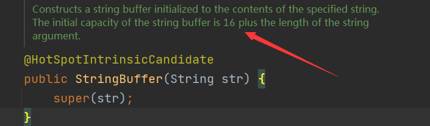

3. **字符串长度**

   `length()`方法返回**实际长度**，而不是`value.length`

   > 调用`append()`方法长度就会就+1

    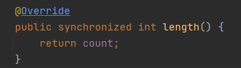

4. **数组扩容**

   1. 调用超类的`append()`方法

        .png)

   2. 超类的`append()`方法

      判断已有长度和添加的长度和是否超过数组长度

       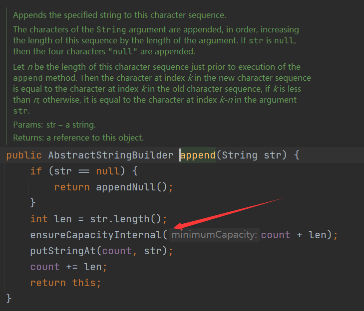

   3. 如果超过数组长度，调用`copyOf()`方法**复制数据**

       

   4. 在创建新的数组时候扩容

      默认情况是`(old.length << 1) + 2`

      > 会有**特殊情况**，比如扩容后还是不够，或者**超过最大长度**...

      


### 方法

**快捷键**：`ctrl+F12`

查看`StringBuffer`的所有方法

- `int length()`：返回长度
- `StringBuidler append(obj)`：字符串拼接	
  - `append(null)`会将null转换为**`null`字符串**添加进去
- `StringBuffer delete(int start,int end)`：删除`[start,end)`的内容
- `StringBuffer deleteCharAt(int index)`：删除`index`位置的字符
- `StringBuffer replace(int start,int end,String str)`：把`[start,end)`位置的内容替换为`str`
- `StringBuffer insert(int offset,obj)`：字符插入
- `StringBuffer reverse()`：反转字符串

> 调用`append()`和`insert()`时，如果原来的数组长度不够，**可以扩容**

 

**方法链操作**

- **方法链**：可以`...`一直调用（**返回`this`**）

 


## StringBuilder类

`StringBuilder`对象的字符内容存储在一个字符数组`value[]`中（没有`final`修饰，可变）

- **可变的字符序列**
- **线程不安全的，效率高**

> 不考虑线程安全时优先使用

**效率**

- `StringBuilder` > `StringBuffer` > `String`


## System类

`java.lang.System`

> JDK8之前日期和时间的API

方法

`public static long currentTimeMillis()`

- 返回**时间戳**：**当前时间**和**1970年1月1日0时0分0秒**之间的时间差（以**毫秒**为单位）


## Date类

`java.util.Date`

> JDK8之前的日期时间API
>
> 还有一个`java.sql.Date`类，对应**数据库**中的日期类型变量

### 构造器

- `Date()`

  - 创建一个对应**当前时间**的Date对象

- `Date(long date)`

  - 创建一个对应**指定时间**（毫秒数）的Date对象
  
  > `@Deprecated`：注解，过时但还能用

```java
package com.ink.Date;

import java.util.Date;

public class DateTest {
    public static void main(String[] args) {
        Date date1 = new Date();
        System.out.println(date1);
        System.out.println(date1.getTime());
        Date date2 = new Date(1618391227838l);
        System.out.println(date2);
    }
}
```

 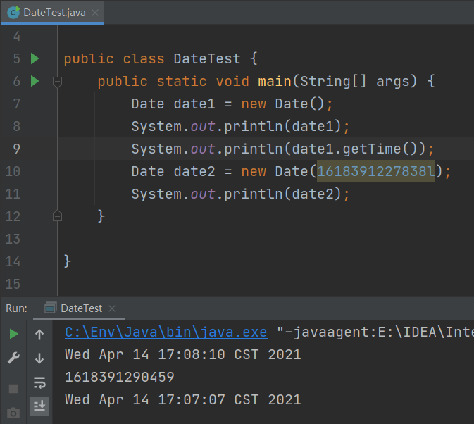


### 方法

- `getTime()`

  - 返回**当前时间**和1970年1月1日0时0分0秒之间的时间差（以**毫秒**为单位）

- `toString()`

  - 把Date对象转换为dow month day hour:minute:second zzz year格式
  - dow：day of week
    - zzz：时间标准
> `Date`类重写了`toString()`方法


## SimpleDateFormat类

`java.text.SimpleDateFormat`

> JDK8之前的日期时间API
>
> Date类的API不易于国际化，大部分都废弃不用了

`SimpleDateFormat`类是一个用**和语言环境无关的方式**来**格式化和解析**日期的类（对`java.util.Date`类进行操作）

- 无参构造
- 有参构造：`pattern`规定生成日期格式

 

### 日期格式化

**日期 -> 文本（字符串）**

`format()`方法

```java
package com.ink.Date;

import java.text.SimpleDateFormat;
import java.util.Date;
import java.util.SimpleTimeZone;

public class DateTest {
    public static void main(String[] args) {
        Date date1 = new Date();
        System.out.println(date1);
        // 默认构造器
        SimpleDateFormat simpleDateFormat = new SimpleDateFormat();
        String format = simpleDateFormat.format(date1);
        System.out.println(format);
    }
}
```


### 日期解析

**文本（字符串） -> 日期**

> 字符串要求：年-月-日 a/pm hour:minute
>
> 格式化输出的字符串就是默认的形式

`parse()`方法

```java
// 输出Wed Apr 14 17:33:00 CST 2021
String str = "2021/4/14 下午5:33";
try {
    Date parse = simpleDateFormat.parse(str);
    System.out.println(parse);
}catch (ParseException e){
    System.out.println("exception");
}
```


## Calendar类

`Calendar`（日历类）是一个**抽象类**，主要用于完成日期字段之间相互操作的功能。 

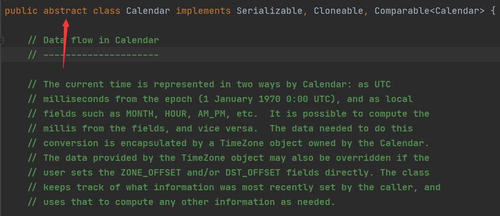

**抽象类不可以实例化**

- 调用它的**子类**：`GregorianCalendar`

- 调用它的**静态方法**：`Calendar.getInstance()`

  调用静态方法返回子类`GregorianCalendar`对象

   


### Calendar方法

一个`Calendar`的实例是系统时间的抽象表示，通过get(int field)方法来取得想要的时间信息，比如YEAR，MONTH，DAT_OF_WEEK，HOUR_OF_DAY，MINUTE，SECOND

> 查看API文档，`Calendar`类中定义了很多常量属性


**对Calendar对象操作**

- `get()`：获得对象本身属性
  - 月份从0开始
  - 星期从周日开始（为1）
- `set()`：void方法，直接修改对象本身属性
- `add()`：void方法，直接修改对象本身属性（减就是加负数）

```java
package com.ink.Date;

import java.util.Calendar;

public class CalendarTest {
    public static void main(String[] args) {
        Calendar instance = Calendar.getInstance();
        System.out.println(instance.getClass());
        int days = instance.get(Calendar.DAY_OF_YEAR);
        System.out.println(days);
        System.out.println(instance.get(Calendar.DAY_OF_YEAR));
        instance.set(Calendar.DAY_OF_YEAR,22);
        System.out.println(instance.get(Calendar.DAY_OF_YEAR));
        instance.add(Calendar.DAY_OF_YEAR,3);
        System.out.println(instance.get(Calendar.DAY_OF_YEAR));
    }
}
```

 


**Calendar和Date转换操作**

- `getTime()`：由`Calendar`类返回`Date`对象
- `setTime()`：由`Date`类返回`Calendar`子类对象

```java
package com.ink.Date;

import java.util.Calendar;
import java.util.Date;

public class CalendarTest {
    public static void main(String[] args) {
        Calendar instance = Calendar.getInstance();
        Date time = instance.getTime();
        System.out.println(time);
        Date date = new Date();
        instance.setTime(date);
        int days = instance.get(Calendar.DAY_OF_YEAR);
        System.out.println(days);
    }
}
```

 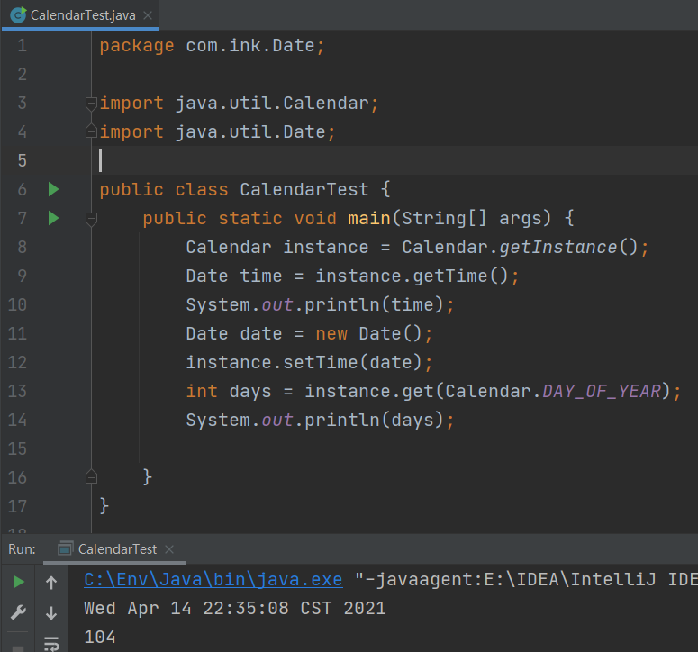


## java.time

`Calendar`类和`Date`类缺点：

- **可变性**：日期应该是不可变的
- **偏移性**：`Date`的年份从1900年开始，月份从0开始（正常表示需要**减去偏移量**）
- **格式化**：格式化只对`Date`有用（`SimpleDateFormat`），对`Calendar`无用
- **线程不安全**
- **无法处理闰秒**

> 对日期和时间的操作一直比较复杂


 JDK8吸收了Joda-Time（jar包），创建了新的API——`java.time`

包含常用包：

- `java.time.format`
- `java.time.temporal`
- `java.time.zone`
- `java.time.chrono`

包含常用类：

- `LocalDate`
- `LocalTime`
- `LocalDateTime`
- `ZonedDateTime`
- `Duration`

```java
package com.ink.Date;


import java.time.LocalDate;
import java.time.LocalDateTime;
import java.time.LocalTime;

public class Time {
    public static void main(String[] args) {
        LocalDate now = LocalDate.now();
        LocalTime now1  = LocalTime.now();
        LocalDateTime now2 = LocalDateTime.now();
        System.out.println(now);
        System.out.println(now1);
        System.out.println(now2);
    }
}
```

 


## Instant类

时间线上的一个**瞬间时间点**，可能被用来记录程序中的事件事件戳（面向机器）

返回**当前时间**和**1970年1月1日0时0分0秒**之间的时间差（以**毫秒**为单位）

> 精度可以达到纳秒


## DateTimeFormatter类

`java.time.format.DateTimeFormatter`类，提供三种格式化方法

- **预定义的标准格式**
  - `ISO_LOCAL_DATE`
  - ``ISO_LOCAL_TIME`
- **本地化相关格式**
- **自定义格式**
- `ofPattern()`方法


# 比较器

比较**对象**，实际是比较**对象的属性**

**对象排序**的两种方式（**接口**）

- 自然排序
  - `java.lang.Comparable`
- 定制排序
  - `java.util.Comparator`

**对比**

- `Comparable`方式是**让对象所属的类去实现接口**（作为实现类），对象**在任何位置都可以比较大小**
- `Comparator`方式是**临时创建实现类**去比较，


## Comparable接口

`java.lang.Comparable`

- `compareTo()`方法并没有在`Object`类中声明，它是`Comparable`接口的唯一方法
- `compareTo()`是一个泛型
- 类实现了`Comparable`接口，就表明它的实例具有内在的排序关系

### String和包装类

已经实现了`Comparable`接口，重写了`compareTo(obj)`方法（**默认从小到大排序**）

```java
public int compareTo(String anotherString) {
    int len1 = value.length;
    int len2 = anotherString.value.length;
    int lim = Math.min(len1, len2);
    char v1[] = value;
    char v2[] = anotherString.value;
    int k = 0;
    while (k < lim) {
        char c1 = v1[k];
        char c2 = v2[k];
        if (c1 != c2) {
            return c1 - c2;
        }
        k++;
    }
    return len1 - len2;
}
```

 

 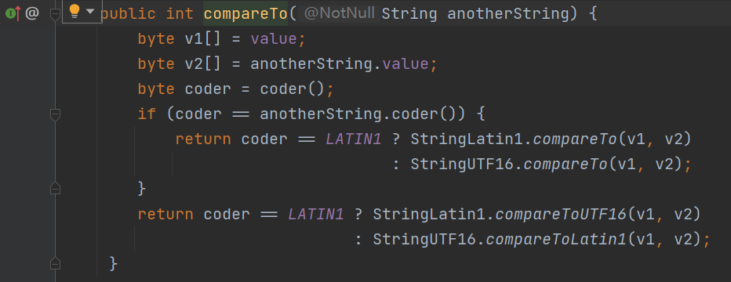

### 规则

重写`this.compareTo(obj)`方法

- 当返回值大于0时，将形参`obj`放在当前对象`this`之前
- 当返回值小于0时，将当前对象`this`放在形参`obj`之前

**升序排列**

- 当前对象`this`大于形参`obj`，返回正整数
- 当前对象`this`小于形参`obj`，返回负整数
- 当前对象`this`等于形参`obj`，返回0

**降序排列**

- 当前对象`this`大于形参`obj`，返回正整数
- 当前对象`this`小于形参`obj`，返回负整数
- 当前对象`this`等于形参`obj`，返回0

> `compareTo()`只有在`equals(Object)` 返回`true`时才返回 0

### 自定义排序

- 自定义类需要实现`Comparable`接口，重写`compareTo()`方法指明**排序规则**
- 使用`Arrays.sort()`即可排序

```java
package com.ink.Compare;

public class Goods implements Comparable{
    private String name;
    private double price;

    public Goods() {
    }

    public Goods(String name, double price) {
        this.name = name;
        this.price = price;
    }

    public String getName() {
        return name;
    }

    public void setName(String name) {
        this.name = name;
    }

    public double getPrice() {
        return price;
    }

    public void setPrice(double price) {
        this.price = price;
    }

    @Override
    public String toString() {
        return "name='" + name + '\'' +
                ", price=" + price + '\n';
    }

    // 按照商品价格从低到高排序
    @Override
    public int compareTo(Object o) {
        if(o instanceof Goods){
            Goods goods = (Goods) o;
            if(this.price > goods.price){
                return 1;
            }else if(this.price < goods.price){
                return -1;
            }else{
                // name是String,已经重写了compareTo()方法
                return this.name.compareTo(goods.name);
                // 如果想要利用String重写的compareTo()方法，但是要从高到低排序
				// return -this.name.compareTo(goods.name);
            }
        }
        // return Double.compare(this.price,goods.price)
        throw new RuntimeException("传入的数据类型不一致");
    }
}
```

```java
package com.ink.Compare;

import java.util.Arrays;

public class Compare {
    public static void main(String[] args) {
        Goods[] arr = new Goods[6];
        arr[0] = new Goods("12",62);
        arr[1] = new Goods("232",24);
        arr[2] = new Goods("1100",24);
        arr[3] = new Goods("230923",37);
        arr[4] = new Goods("12983138930",37);
        arr[5] = new Goods("92",37);
        Arrays.sort(arr);
        System.out.println(Arrays.toString(arr));
    }
}
```

 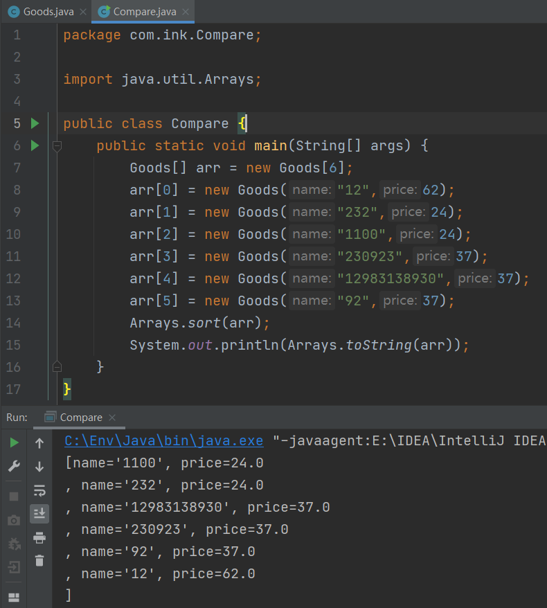


## Comparator接口

`java.util.Comparator`

使用`Comparator`的对象来排序，重写`compare()`抽象方法

- 元素的类型没有实现`java.lang.Comparable`接口且不方便修改代码
- 元素的类型实现了`java.lang.Comparable`接口的排序规则，但是不适合当前操作

> `<T>`：泛型

 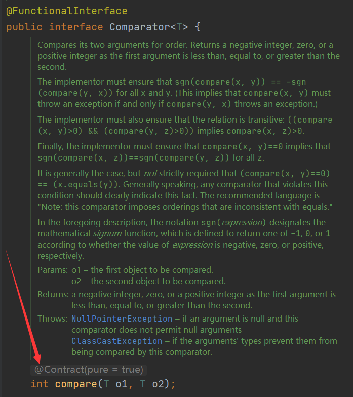

### 规则

重写`compare(Object o1,Object o2)`方法

- 当返回值大于0时，将第二个参数`o2`放在第一个参数`o1`之前
- 当返回值小于0时，将第一个参数`o1`放在第二个参数`o2`之前

**升序排列**

- `o1`大于`o2`，返回正整数
- `o1`小于`o2`，返回负整数
- `o1`等于`o2`，返回0

**降序排列**

- `o1`小于`o2`，返回正整数
- `o1`大于`o2`，返回负整数
- `o1`等于`o2`，返回0

> `Comparator`排序实际上就是二叉树排序：使用第一个元素作为根节点，如果之后的元素比第一个小，则放到左子树，否则放到右子树，之后按中序遍历

 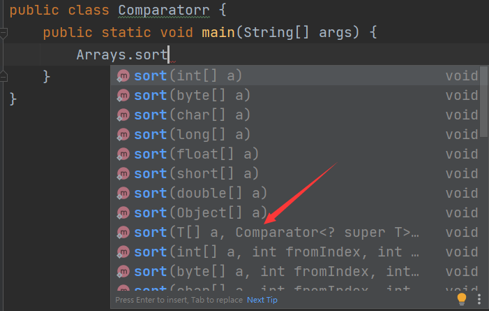

### 自定义排序

使用**匿名内部类**在`Arrays.sort()`中重写`compare()`方法

```java
package com.ink.Compare;

import java.util.Arrays;
import java.util.Comparator;

public class Compare {
    public static void main(String[] args) {
        String[] arr = new String[]{"A","B","C","D","E"};
        // 根据指定比较器产生的顺序对指定对象数组进行排序
        Arrays.sort(arr, new Comparator<String>() {
            @Override
            public int compare(String o1, String o2) {
                // String重写的compareTo()方法
                return -o1.compareTo(o2);
            }
        });
        // 输出E,D,C,B,A
        System.out.println(Arrays.toString(arr));
    }
}
```

使用**lambda表达式**在`Arrays.sort()`中重写`compare()`方法

```java
package com.ink.Compare;

import java.util.Arrays;
import java.util.Comparator;

public class Compare {
    public static void main(String[] args) {
        String[] arr = new String[]{"A","B","C","D","E"};
        // 根据指定比较器产生的顺序对指定对象数组进行排序
        Arrays.sort(arr, (o1, o2)-> -o1.compareTo(o2));
        // 输出E,D,C,B,A
        System.out.println(Arrays.toString(arr));
    }
}
```

对二维数组进行排序

```java
Arrays.sort(points,(t1,t2)->{
    if(t1[0] != t2[0]){
        return t1[0] - t2[0];
    }
    else{
        return t1[1] - t2[1];
    }
});
```


# 枚举类

类的对象只有**有限个，确定的**（星期，性别，季节）。当需要定义**一组常量**时，建议使用枚举类

如果枚举类中**只有一个对象**，可以作为**单例模式**的实现方式

> 单例模式


## 自定义枚举类

> JDK5.0之前

1. 类的对象的属性都设置为`private final`，final常量需要赋值
   - 显式赋值
   - **构造器赋值**
   - 代码块赋值
2. 私有化类的构造器（否则被外部调用无法确定对象个数）
3. 提供当前枚举类的对象，声明为`public static final`
4. 获取枚举类对象的属性（`get()`方法）
5. 重写`toString()`方法

```java
package com.ink.Enumm;

import javax.swing.*;

public class SeasonTest {
    public static void main(String[] args) {
        Season spring = Season.SPRING;
        // 输出: Season{seasonName='春天', seasonDesc='1'}
        System.out.println(spring);
    }
}
// 自定义枚举类
class Season{
    private final String seasonName;
    private final String seasonDesc;
    private Season(String seasonName,String seasonDesc){
        this.seasonName = seasonName;
        this.seasonDesc = seasonDesc;
    }
    public static final Season SPRING = new Season("春天","1");
    public static final Season SUMMER = new Season("夏天","2");
    public static final Season AUTUMN = new Season("秋天","3");
    public static final Season WINTER = new Season("冬天","4");

    public String getSeasonName() {
        return seasonName;
    }

    public String getSeasonDesc() {
        return seasonDesc;
    }

    @Override
    public String toString() {
        return "Season{" +
                "seasonName='" + seasonName + '\'' +
                ", seasonDesc='" + seasonDesc + '\'' +
                '}';
    }
}
```


## enum关键字

> JDK5.0引入

使用`enum`关键字（不再是`class`）**定义枚举类**（不再需要复杂的声明）

定义的枚举类默认继承`java.lang.Enum`类，默认使用`Enum`类中的`toString()`方法


1. 先写枚举类对象，多个对象用**逗号**隔开，最后一个用分号
2. 私有化类的构造器（否则被外部调用无法确定对象个数）
3. 获取枚举类对象的属性（`get()`方法）

```java
package com.ink.Enumm;

public class EnumTest {
    public static void main(String[] args) {
        Season summer = Season.SUMMER;
        System.out.println(summer);
        System.out.println(Season.class.getSuperclass());
    }
}

enum Season{
    SPRING("春天","1"),
    SUMMER("夏天","2"),
    AUTUMN("秋天","3"),
    WINTER("冬天","4");

    private final String seasonName;
    private final String seasonDesc;

    private Season(String seasonName,String seasonDesc){
        this.seasonName = seasonName;
        this.seasonDesc = seasonDesc;
    }

    public String getSeasonName() {
        return seasonName;
    }

    public String getSeasonDesc() {
        return seasonDesc;
    }
}
```

 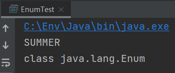


**enum枚举类实现接口**

**每一个枚举类对象都可以实现接口**

```java
package com.ink.Enumm;

public class EnumTest {
    public static void main(String[] args) {
        Season spring = Season.SPRING;
        spring.show();
        Season summer = Season.SUMMER;
        summer.show();
    }
}
interface Info{
    void show();
}
enum Season implements Info{

    SPRING("春天","1"){
        @Override
        public void show() {
            System.out.println("这是春天");
        }
    },
    SUMMER("夏天","2"){
        @Override
        public void show() {
            System.out.println("这是夏天");
        }
    },
    AUTUMN("秋天","3"){
        @Override
        public void show() {
            System.out.println("这是秋天");
        }
    },
    WINTER("冬天","4"){
        @Override
        public void show() {
            System.out.println("这是冬天");
        }
    };

    private final String seasonName;
    private final String seasonDesc;

    private Season(String seasonName,String seasonDesc){
        this.seasonName = seasonName;
        this.seasonDesc = seasonDesc;
    }

    public String getSeasonName() {
        return seasonName;
    }

    public String getSeasonDesc() {
        return seasonDesc;
    }
}
```

 


## 方法

- `values()`：返回枚举类型的**对象数组**

   

- `valueOf(String str)`：将字符串转换为对应的枚举类对象，**要求字符串必须是枚举类对象的"名字"**

  > 如果找不到枚举类对象，会抛异常

   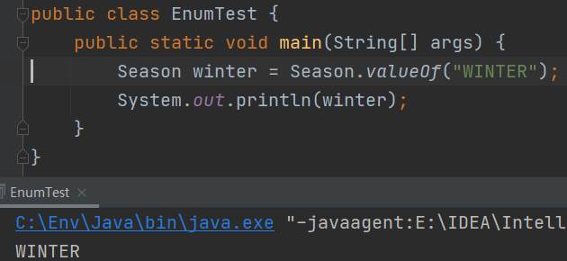

- `toString()`：返回当前枚举类对象**常量的名字**


# 注解

> JDK5.0开始 Java增加了对**元数据**（MetaData）的支持，也就是**注解**（Annotation）
>
> JavaSE的注解使用比较简单，而在JavaEE中注解很重要，比如用来配置应用程序的切面，XML配置等
>
> **框架 = 注解+反射+设计模式**

`Annotation`是代码中的特殊标记，这些标记可以在编译，加载，运行时**被读取并执行**相应处理。

`Annotation`可以像修饰符一样被修饰**包，类，构造器，方法，成员变量，参数，局部变量**。这些信息保存在`Annotation`的`"name = value"`对中

## 常用注解

**生成文档**

- `@author`：多个作者之间使用,分割
- `@version`：标明该类模块的版本
- `@see`：参考转向
- `@since`：从哪个版本开始增加的
- `@param`：对方法中某参数的说明，如果没有参数就不能写
- `@return`：对方法返回值的说明，如果方法的返回值类型是void就不能写
- `@exception`：对方法可能抛出的异常进行说明，如果方法没有用throws显式抛出的异常就不能写

> `@param`，`@return`和`@exception`这三个标记都是只用于方法的。


**在编译时进行格式检查**

> JDK内置的三个基本注解

`@Override`：表明重写父类或接口的方法, 该注解只能用于方法（编译时**校验**是否重写）

`@Deprecated`：表示所修饰的元素(类, 方法等)已过时（过时还是可以用的）

`@SuppressWarnings`：抑制编译器**警告**（含有成员）


**跟踪代码依赖性，实现替代配置文件功能**

Servlet3.0提供了注解(annotation)，使得不再需要在web.xml文件中进行Servlet的部署


**spring框架中关于事务的管理**


## 自定义注解

`@interface`

- 使用`@interface`关键字自定义Annotation类型（加上`@`）

- 自定义注解自动继承了`java.lang.annotation.Annotation`接口

- Annotation的**成员变量**以**无参数方法**的形式来声明，其方法名和返回值定义了该成员的名字和类型，称为**配置参数**
- 成员变量的类型只能是八种基本数据类型、String类型、Class类型、enum类型、Annotation类型和以上所有类型的数组。
- 可以在定义成员变量时使用`default`关键字**指定初始值**
- 如果只有一个参数成员，建议使用参数名为`value`（`String value()`）
- 如果定义的注解含有配置参数，那么**使用时必须指定参数值**（除非它有默认值）。格式是`value=参数值`，如果只有一个参数成员，且名称为value，可以省略`value=`
- **没有成员变量**的Annotation称为**标记**（如`@Override`），**包含成员变量**的Annotation称为**元数据**Annotation

> 自定义注解必须配上注解的**信息处理流程**才有意义
>
> 自定义注解通常会指明两个元注解`@Retention`和`@Target`


**自定义注解**

`New`-`Java Class`选择Annotation

```java
package com.ink.annotationtest;

public @interface myannotation {
    // 默认值hello
    String value() default "hello";
}

```

**使用注解**

```java
package com.ink.annotationtest;

public class annotationtest {
    public static void main(String[] args) {

    }
}
// 自定义注解使用
@myannotation(value = "hi")
class test{
    private String name;
    private int age;
	@myannotation
    public test(String name, int age) {
        this.name = name;
        this.age = age;
    }
}
```


## 元注解

`meta-annotation`

JDK 的元注解用于修饰其他注解

JDK5.0提供了4个标准的元注解类型

- `@Retention`
- `@Target`
- `@Documented`
- `@Inherited`

 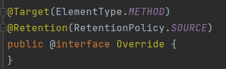

> 元数据
>
> `String name = "ink";`，`String` 和`name` 用来修饰`ink`


**@Retention**

用于修饰一个注解, 指定被修饰的注解的**生命周期**

`@Rentention`包含一个成员变量`RetentionPolicy`（枚举类），使用`@Rentention`时必须为该成员变量指定值

- `SOURCE`：在源文件中保留），编译器会丢弃这种注解，编译后的`.class`文件不会保留这个注解（反编译看不到）
- `CLASS`：在`.class`文件中保留，当运行Java 程序时, JVM会丢弃注解（**默认值**）
- `RUNTIME`：在运行时保留，当运行Java 程序时, JVM 会保留注解在内存中，程序可以通过**反射**读取该注解

**@Target**

用于修饰一个注解，指定被修饰的注解能**修饰哪些元素**

`@Target` 也包含一个成员变量`ElementType`（枚举类）

- `CONSTRUCTOR`：用于描述是否能修饰构造器
- `FIELD`：用于描述域
- `TYPE`：用于描述类，接口（包括注解类型），或enum声明
- `METHOD`：用于描述方法
- `PACKAGE`：用于描述包

**@Documented**

用于修饰一个注解，指定被修饰的注解将被javadoc工具**保留提取成文档**

被`@Documented`修饰的注解必须设置`@Retention`值为`RUNTIME`

> 默认情况下，javadoc是不包括注解的

**@Inherited**

用于修饰一个注解，指定被修饰的注解将具有继承性。如果某个类使用了被`@Inherited`修饰的注解，则其子类将自动具有该注解


## 可重复注解

> JDK8新特性

JDK8前：是声明一个**注解数组**

JDK8后：使用`@Repeatable`修饰重复使用的注解。`@Repeatable`中成员值为**注解数组**，保持两者的`@Retention`，`@Target`和`@Inherited`相同：


## 类型注解

> JDK8新特性

JDK8前：注解只能是在**声明**的地方所使用

JDK8后：注解可以应用在**任何地方**

在`@Target`中的`ElementType`表明可以修饰的元素

- `TYPE_PARAMETER`：表示该注解能写在**类型变量的声明语句**中（如：泛型声明）
- `TYPE_USE`：表示该注解能写在使用类型的**任何语句**中


# 集合

为了方便对多个对象的操作，就要使用**容器**对对象进行**存储**（**内存**层面）。集合可以**动态**地把多个**对象的引用**放入容器中

数组在存储方面的**弊端**

- 初始化以后长度不可变，不便于扩展
- 提供的属性和方法少，不便于进行增删改等操作，且效率不高（也可以用`Object`类的方法）
- 无法直接获取实际存储元素的个数
- 存储的数据是有序的、可重复的


**Java集合类**可以用于存储数量不等的多个对象，还可用于保存具有**映射关系**的关联数组

Java集合分为`Collection`和`Map`两种体系（接口）

- `Collection`接口：**单列集合**，存储一个个对象
  - `List`接口：元素**有序**、**可重复**的集合（动态数组）
    - `Vector`
    - `Arraylist`
    - `LinkedList`
  - `Set`接口：元素**无序**、**不可重复**的集合
    - `HashSet`
    - `LinkedHashSet`
    - `TreeSet`
- `Map`接口：**双列集合**，存储具有**映射**关系key-value对
  - `HashMap`
  - `LinkedHashMap`


## Collection接口

- `Collection`接口是`List`、`Set` 和`Queue`接口的**父接口**，接口里定义的方法可用于操作`Set`、`List`和`Queue`
- JDK不提供`Collection`接口的任何**直接实现**，而是提供更具体的子接口实现（`Set`和`List`）
- JDK5之前Java集合会丢失容器中对象的**数据类型**，把所有对象都当成`Object`类型处理

> JDK5增加了**泛型**以后Java集合可以记住容器中对象的数据类型

### 方法

- **向集合中添加元素**
  - `add(Object obj)`
  - `addAll(Collection c)`
- **获取集合中有效元素的个数**
  - `int size()`
- **清空集合**
  - `void clear()`
- **判断集合是否为空**
  - `boolean isEmpty()`
- **判断集合是否包含某个元素**
  - `boolean contains(Object obj)`：调用对象所在类的`equals`方法来判断集合中每一个元素是否是目标元素（**obj对象需要重写`equals`方法**）
  - `boolean containsAll(Collection c)`：调用对象所在类的`equals`方法来比较集合的每一个元素是否被包含
- **删除**
  - `boolean remove(Object obj)` ：调用对象所在类的`equals`方法判断是否是要删除的那个元素，只会删除匹配的第一个元素（**obj对象需要重写`equals`方法**）
  - `boolean removeAll(Collection c)`：删除当前集合内两个集合的交集（取当前两个集合的差集）
- **取两个集合的交集**
  - `boolean retainAll(Collection c)`：把交集的结果存在当前集合中，不影响c
- **判断集合是否相等**
  - `boolean equals(Collection c)`：比较两个集合中的每一个元素（当使用`Arraylist`时需要按顺序比较）
- **集合转成对象（Object）数组**
  - `Object[] toArray()`
  - `list.toArray(new String[list.size()])`
- **数组转换为集合**
  - `Arrays.asList()`：调用`Arrays`类的静态方法
    - `Arrays.asList()`方法返回的对象是Arrays的内部类，是一个固定长度的`List`集合（既不是ArrayList实例也不是Vector实例）
    - 不支持`add()`,`remove()`操作
    - 不能用于基本类型
- **获取集合对象的哈希值**
  - `hashCode()`
- **遍历**
  - `iterator()`：返回迭代器对象（Iterator接口实例），用于遍历集合元素

```java
package com.ink.collection;

import org.junit.Test;

import java.util.ArrayList;
import java.util.Arrays;
import java.util.Collection;
import java.util.Date;

public class CollectionTest {

    @Test
    public void test1(){
        Collection coll = new ArrayList();
        coll.add("A");
        coll.add("b");
        // 自动装箱
        coll.add(123);
        coll.add(new Date());
        // 4
        System.out.println(coll.size());
        Collection coll1 = new ArrayList();
        coll1.add("C");
        coll1.add("D");
        coll1.add("456");
        coll.addAll(coll1);
        // [A, b, 123, Tue May 18 22:38:09 CST 2021, C, D, 456]
        System.out.println(coll);
        // false
        System.out.println(coll.isEmpty());
        coll.clear();
        // true
        System.out.println(coll.isEmpty());
    }
    @Test
    public void test2(){
        Collection coll = new ArrayList();
        coll.add("A");
        coll.add("b");
        coll.add(new String("ink"));
        coll.add(123);
        coll.add(false);
        coll.add(new Person("ink",20));
        boolean contains = coll.contains(123);
        // true
        System.out.println(contains);
        // contains判断的是内容,true
        System.out.println(coll.contains(new String("ink")));
        // 调用equals方法
        // 当Person类没有重写equals方法时默认调用Object类的equals方法，就是==，为false
        // 重写equals方法时后为true
        System.out.println(coll.contains(new Person("ink",20)));
        Collection coll1 = Arrays.asList("A","b");
        // true
        System.out.println(coll.containsAll(coll1));
        Collection coll2 = Arrays.asList("A","c");
        // false
        System.out.println(coll.containsAll(coll2));
    }
    @Test
    public void test3(){
        Collection coll = new ArrayList();
        coll.add("A");
        coll.add("b");
        coll.add(new String("ink"));
        coll.add(123);
        coll.add(false);
        coll.add(new Person("ink",20));
        Collection coll1 = Arrays.asList("A","b");
        // [A, b, ink, 123, false, Person{name='ink', age=20}]
        System.out.println(coll);
        coll.remove(new Person("ink",20));
        // A, b, ink, 123, false]
        System.out.println(coll);
        coll.removeAll(coll1);
        // [ink, 123, false]
        System.out.println(coll);
    }
    @Test
    public void test4(){
        Collection coll = new ArrayList();
        coll.add("A");
        coll.add("b");
        coll.add(123);
        coll.add(false);
        Collection coll1 = new ArrayList();
        coll1.add("A");
        coll1.add("b");
        coll1.add(123);
        coll1.add(false);
        // true
        System.out.println(coll.equals(coll1));
        Collection coll2 = new ArrayList();
        coll2.add("b");
        coll2.add("A");
        coll2.add(123);
        coll2.add(false);
        // false
        System.out.println(coll.equals(coll2));
    }
    @Test
    public void test5(){
        Collection coll = new ArrayList();
        coll.add("A");
        coll.add("b");
        coll.add(123);
        coll.add(false);
        coll.add(new Person("ink",20));
        Object[] array = coll.toArray();
        // A b 123 false Person{name='ink', age=20}
        for (int i = 0; i < array.length; i++) {
            System.out.print(array[i]+" ");
        }
        List<String> list = Arrays.asList(new String[]{"ink", "java"});
        // [ink, java]
        System.out.println(list);
        List<int[]> list1 = Arrays.asList(new int[]{123, 456});
        // [[I@56cbfb61],int[]会被认为整体是一个元素
        System.out.println(list1);
        List<Integer> list2 = Arrays.asList(new Integer[]{123, 456});
        // [123, 456],包装类可以被识别为两个元素
        System.out.println(list2);
    }
}
```


### 迭代器Iterator

使用迭代器`iterator`接口**遍历集合元素**

- `iterator`对象称为**迭代器**（设计模式的一种），主要用于遍历`Collection`集合中的元素
- **GOF**给**迭代器模式**的定义为：**提供一种方法访问一个容器(container)对象中各个元素，而又不需暴露该对象的内部细节**（迭代器模式就是为容器而生）
- `Collection`接口继承了`java.lang.Iterable`接口，该接口有一个`iterator()`方法。所有实现了`Collection`接口的集合类都有一个`iterator()`方法，用以返回一个实现了`Iterator`接口的对象

**方法**

- `next()`：返回集合的下一个元素
- `hasnext()`：判断集合是否存在元素
- `remove()`：移除集合中的元素

> 调用`next()`方法之前要使用`hasnext()`方法判断，否则可能会抛出异常
>
> Iterator删除集合的元素是遍历过程中通过**迭代器对象**的`remove()`方法，而不是集合对象的`remove()`方法
>
> 如果还未调用`next()`或者在调用`next()`后已经调用了`remove()`方法，再调用`remove()`就会报异常`IllegalStateException`（指针还未指向集合元素）

```java
package com.ink.collection;

import org.junit.Test;

import java.util.ArrayList;
import java.util.Collection;
import java.util.Iterator;

public class IteratorTest {
    @Test
    public void test1(){
        Collection coll = new ArrayList();
        coll.add("A");
        coll.add("b");
        coll.add(new String("ink"));
        coll.add(123);
        coll.add(false);
        coll.add(new Person("ink",20));
        // 方法一,不推荐
        // 依次遍历集合的6个元素
        Iterator iterator = coll.iterator();
        System.out.println(iterator.next());
        System.out.println(iterator.next());
        System.out.println(iterator.next());
        System.out.println(iterator.next());
        System.out.println(iterator.next());
        System.out.println(iterator.next());
        // 报异常java.util.NoSuchElementException
        System.out.println(iterator.next());
        // 方法二,不推荐
        for (int i = 0; i < coll.size(); i++) {
            System.out.println(iterator.next());
        }
        // 方法三,推荐
        while(iterator.hasNext()){
            System.out.println(iterator.next());
        }
    }
    @Test
    public void test2(){
        Collection coll = new ArrayList();
        coll.add("A");
        coll.add("b");
        coll.add(new String("ink"));
        coll.add(123);
        coll.add(false);
        Iterator iterator = coll.iterator();
        while(iterator.hasNext()){
            Object obj = iterator.next();
            if("ink".equals(obj)){
                // 迭代器对象的方法
                iterator.remove();
                System.out.println("remove ink");
            }
        }
        Iterator iterator1 = coll.iterator();
        while(iterator1.hasNext()){
            System.out.println(iterator1.next());
        }
    }
}
```

**迭代器执行原理**

`Iterator iterator = coll.iterator();`

- `iterator`**仅用于遍历集合**，`iterator`本身并不提供承存储对象的能力（并不是容器）。创建`Iterator`对象**必须有一个被迭代的集合**
- 集合对象每次调用`iterator()`方法都得到**一个全新的迭代器对象**，**默认游标都在集合的第一个元素之前**（`next()`先下移，再返回元素）

```java
package com.ink.collection;

import org.junit.Test;

import java.util.ArrayList;
import java.util.Collection;
import java.util.Iterator;

public class IteratorTest {
    @Test
    public void test(){
        Collection coll = new ArrayList();
        coll.add("A");
        coll.add("b");
        coll.add(123);
        coll.add(false);
        coll.add(new Person("ink",20));
        // 错误:死循环
        while(coll.iterator().hasNext()){
           System.out.println(coll.iterator().next());
        }
    }
}
```


### 增强for循环

`for each`循环用于遍历**集合和数组**

- 遍历操作不需获取`Collection`或数组的长度，无需使用索引访问元素
- 遍历集合的**底层**还是调用**迭代器**`iterator`完成操作

> `for(集合元素类型 局部变量 : 集合对象)`

```java
package com.ink.collection;

import org.junit.Test;

import java.util.ArrayList;
import java.util.Collection;

public class ForTest {
    @Test
    public void test() {
        Collection coll = new ArrayList();
        coll.add("A");
        coll.add(123);
        coll.add(false);
        coll.add(new Person("ink", 20));
        for(Object obj : coll){
            System.out.println(obj);
        }
    }
}
```


### List接口

- List容器中的元素**有序、可重复**

- List容器中的元素都对应一个整数型的**索引**，可以根据索引存取容器中的元素

- `List`集合除了从`Collection`集合继承的方法外，还添加了一些**根据索引来操作集合元素**的方法

> List有索引所以使用普通的for循环遍历（`list.size()`）

List接口的常用**实现类**

- `ArrayList`

  - List接口的主要（典型）实现类

  - **线程不安全的，效率高**

  - 底层使用`Object[] elementData`存储

      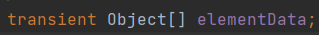

- `LinkedList`

  - 底层使用**双向链表**存储
  - **线程不安全的，效率高**
  - 对于频繁的插入，删除操作效率比`ArrayList`高

- `Vector`

  - List接口的古老实现类
  
  - **线程安全的，效率低**
  
  - 底层使用`Object[] elementData`存储（扩容是2倍）
  
    > `Vector`由于效率问题已经被弃用


#### ArrayList

- `ArrayList`是一个采用类型参数的**泛型类**
- 底层使用`Object[] elementData`存储

> 建议使用带参构造器


**源码分析**

JDK7：饿汉式

- **直接创建一个初始容量为10的数组**

> 搜索类快捷键：`ctrl+n`
>
> 搜索类中方法快捷键：`ctrl+F12`

````java
// 空参构造器的底层创建一个初始容量为10的Object数组elementData
ArrayList list = new Arraylist();

// elementData[0] = new Integer(123)
list.add(123);

// 当添加导致容量不够时,默认扩容为原来容量的1.5倍,再将原数组数据复制到新数组中
````

 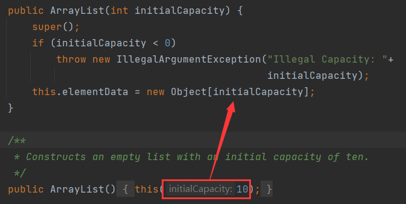

 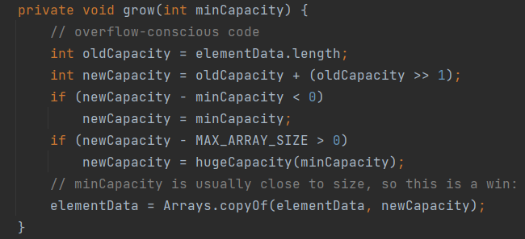

JDK8：懒汉式

- **一开始创建一个长度为0的数组，当添加第一个元素时再创建一个始容量为10的数组**（延迟数组的创建时间，节省内存）

```java
// 空参构造器的底层创建一个空的Object[] elementData
// 并没有创建一个长度为10的Object[] elementData
ArrayList list = new Arraylist();

// 创建一个长度为10的Object[] elementData
// elementData[0] = new Integer(123)
list.add(123);

// 当添加导致容量不够时,默认扩容为原来容量的1.5倍,再将原数组数据复制到新数组中
```

 

 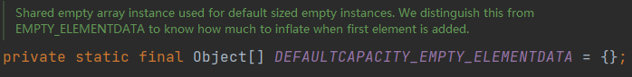


#### LinkedList

`LinkedList`继承`AbstractSequentialList`类

- 是`List`
- 是`Queue`
- 是`Deque`

底层使用**双向链表**存储

- 分配内存空间不是必须连续
- 插入、删除操作时间复杂度为`O(1)`
- 访问遍历元素时间复杂度为`O(n)`

```java
// 内部声明了Node(双向链表)类型的first和last属性,默认为NULL
LinkedList list = new LinkedList();

// 将123封装到Node中(相当于创建了Node对象)
list.add(123);
```

 

 

 

 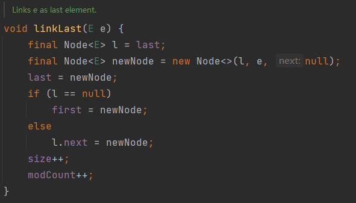


##### 方法

添加元素add

- `boolean add(E e)`：在链表末尾添加一个元素，成功返回`true`，否则返回`false`

- `void add(int index, E e)`：在链表的index位置添加元素e

- `void addFirst(E e)`：在链表头部插入元素e

- `void addLast(E e)`：在链表尾部添加元素e

- `boolean addAll(int index, Collection e)`：从index位置开始将e中的**所有元素**添加进来

获取元素get

- `Object get(int index)`：获取指定index位置的元素
- `Object getFirst()`：获取链表头部元素
- `Object getLast()`：获取链表尾部元素
- `int indexOf(E e)`：返回e在集合中**第一次**出现的位置（没有则返回`-1`）
- `int lastIndexOf(E e)`：返回e在当前集合中**最后一次**出现的位置（没有则返回`-1`）
- `List subList(int fromIndex, int toIndex)`：返回从fromIndex到toIndex位置的**子集合**

删除元素remove

- `Object remove(int index)`：删除链表index位置的元素并返回
  - `List`中的`remove()`方法重载了`Collection`的方法，一个根据索引删除，一个根据元素删除
  - 因为`Collection`集合添加`int`类型的元素也会自动装箱为`Integer`，所以当参数是`int`类型时默认是索引
  - 如果想删除元素，则需调用`new Integer(val)`
- `Object removeFirst()`:删除链表头部元素并返回
- `Object removeLast()`:删除链表尾部元素并返回

更新元素

- `Object set(int index, E e)`：设置链表index位置的元素为e

```java
// 数组泛型的List
List<int[]> list = new ArrayList<>();

// 获取List中元素数组的元素
list.get(index)[0]
    
// 转换为数组
list.toArray(new int[list.size()][]);
```


### set接口

- Set容器中的**无序**、**不可重复**
- Set接口没有提供额外的方法
- Set判断两个对象是否相同是根据`equals()`方法，而不是使用`==`运算符
- 存放在Set容器中的对象所在类一定要重写`equals()`和`hashCode()`方法，以实现**对象相等规则**

> 无序性：不是随机性。只是存储的数据在底层并非按照数组索引顺序添加
>
> 不可重复性：相同元素只能添加一个（调用`equals()`方法判断）
>
> 对象相等规则：相等的对象必须具有相等的散列码


- `Set`的**实现类**
  - `HashSet`
    - `Set`接口的主要实现类
    - **线程不安全的，效率高**
    - 底层用**数组储存**
    - 不能保证元素的排列顺序
    - 可以存储`null`值
    - 通过`hashCode()`方法比较相等
  - `LinkedHashSet`
    - `HashSet`的一个子类
    - **可以按照添加的顺序遍历内部数据**
  - `TreeSet`
    - 可以按照添加的对象的指定属性进行**排序**

#### HashSet

**底层原理**

1. **HashMap**
2. **数组+链表**：初始容量为16，当使用率超过75%就会扩大为原来的2倍


**添加对象过程**（数组+链表）

**hashcode()找位置，equals()判断**

1. `HashSet`调用要添加对象**所在类**的`hashCode()`方法来得到该对象的hashCode值
2. 散列函数根据hashCode值决定该对象在`HashSet`底层数组中的**存储位置**（散列函数会利用**底层数组的长度**计算得到对象在数组中的下标，**散列函数计算会尽可能保证能均匀存储**。越是散列分布，该散列函数设计的越好）
3. 如果该存储位置上**没有其他对象，则添加该对象**
4. 如果该存储位置上有其他对象，则需要比较两个对象的hashCode值
   1. 如果两个对象的**hashCode值不相等，则通过链表的方式添加该对象**
   2. 如果两个对象的hashCode值相等，HashSet再调用`equals()`方法
      1. 如果`equals()`方法结果为true，则添加失败
      2. 如果`equals()`方法结果为false，则添加该对象。但是由于该位置已经有元素了（可能已经链接了多个元素），就会**通过链表的方式添加该对象**


**hashCode**

重写`hashCode()`方法

- 同一个对象多次调用`hashCode()`方法应该返回相同的值
- 当两个对象的`equals()`方法比较返回true 时，两个对象的`hashCode()`方法的返回值也应相等
- 对象中用作`equals()`方法比较的属性，都应该用来计算hashCode值

> IDEA中在自定义类调用工具自动重写`equals()`和`hashCode()`方法时默认使用31
>
> - 31只占用5bits，相乘造成数据溢出的概率较小
> - 31可以由i*31== (i<<5)-1来表示，现在很多虚拟机里面都有做相关优化（提高算法效率）
> - 31是一个素数，一个数字乘以素数的最终结果只能被素数本身和被乘数还有1来整除（减少冲突）
> - 选择系数的时候要选择尽量大的系数，因为计算出来的hash地址越大，冲突就越少，查找起来效率也会提高


#### LinkedHashSet

- `LinkedHashSet`根据对象的hashCode值来决定对象的存储位置，但它同时使用**双向链表维护元素的次序**，这使得元素看起来是以插入顺序保存的
- `LinkedHashSet`插入性能略低于`HashSet`，但在迭代访问`Set`里的全部元素时有很好的性能


#### TreeSet

- `TreeSet`是`SortedSet`接口的实现类，可以确保集合中元素处于排序状态
- `TreeSet`底层**使用红黑树结构存储数据**
- `TreeSet`可以按照添加的对象的指定属性进行**排序**，所以要求添加的都是相同类的对象（有相同属性）
- `TreeSet`有自然排序和定制排序两种排序方法，默认情况下采用自然排序

**自然排序**

- `TreeSet`会调用对象所在类的`compareTo()` 方法来比较对象之间的大小关系，然后将对象按升序（默认情况）排列
- 要想将一个对象添加到`TreeSet`中，该对象所在类必须实现`Comparable`接口（必须实现`compareTo()`方法）
- 比较两个对象是否相同通过`compareTo()`方法（返回0），不再是`equals()`方法
- 向TreeSet中添加元素时，只有第一个元素**无须比较**`compareTo()`方法，后面添加的所有元素都会调用`compareTo()`方法进行比较

**定制排序**

- 通过`Comparator`接口来实现，需要重写`compare()`方法
- 比较两个对象是否相同通过`Comparator`（返回0），不再是`equals()`方法

### Deque接口

**双端队列**（Double Ended Queue）

- `Deque`扩展了`Queue`接口
  - `public interface Deque<E> extends Queue<E> {}`
- 最常用的实现类是`LinkedList`，因为要经常进行增删操作

**方法**

插入元素offer

- `offerFirst()`：向队首插入元素，如果插入成功返回`true`，否则返回`false`

- `offerLast()`：向队尾插入元素，如果插入成功返回`true`，否则返回`false`

  > - `addFirst()`：向队首插入元素，如果元素为空，则抛出异常
  > - `addLast()`： 向队尾插入元素，如果为空，则抛出异常

移除元素poll

- `pollFirst()`：返回并移除队首元素，如果队列无元素，则返回`null`

- `pollLast()`：返回并移除队尾元素，如果队列无元素，则返回`null`

  > - `removeFirst()`： 返回并移除队头元素，如果该元素是`null`，则抛出异常
  > - `removeLast()`：返回并移除队尾元素，如果该元素是`null`，则抛出异常

获取元素peek

- `peekFirst()`：获取队头元素但不移除，如果队列无元素，则返回`null`

- `peekLast()`：获取队尾元素但不移除，如果队列无元素，则返回`null`

  > - `getFirst()`：获取队头元素但不移除，如果队列无元素，则抛出异常
  > - `getLast()`：获取队尾元素但不移除，如果队列无元素，则抛出异常

栈操作

- `pop()`：弹出栈中元素，也就是返回并移除队头元素，等价于`removeFirst()`，如果队列无元素，则抛出异常
- `push()`：向栈中压入元素，也就是向队头增加元素，等价于`addFirst()`
  - 如果元素为`null`，则抛出异常
  - 如果栈空间受到限制，则抛出异常


#### LinkedList实现

在使用`LinkedList`的时候，总是用特定的接口来引用它，因为持有接口说明代码的抽象层次更高，而且接口本身定义的方法代表了特定的用途

> 抽象编程的一个原则：尽量持有接口，而不是具体的实现类

```java
// 不推荐的写法
LinkedList<String> d1 = new LinkedList<>();
d1.offerLast("z");

// 推荐的写法
Deque<String> d2 = new LinkedList<>();
d2.offerLast("z");
```

#### ArrayDeque实现

底层循环数组实现

### Queue接口

- 底层是一个特殊的线性表
- 因为队列要经常进行增删操作，因此使用`LinkedList`链表来实现`Queue`接口更合适效率更高（而不是`ArrayList`）
- `Queue`实现通常不允许插入`null`元素，尽管某些实现（如`LinkedList`）并不禁止插入`null`
  - 即使在允许`null`的实现中，也不应该将`null`插入到`Queue`中，因为`null`也用作`poll()`方法的一个特殊返回值，表明队列不包含元素

**方法**

- `offer()`：从队尾添加元素并返回，超出容量时返回`false`
- `poll()`：删除队首元素并返回，容量为0时会返回`false`
- `peek()`：返回队首元素，容量为0时会返回`false`

> 推荐使用`offer()`,`poll()`,`peek()`
>
> - `element()`：返回队首元素，容量为0时会抛出异常
> - `add()`：从队尾添加元素并返回，超出容量时会抛出异常
> - `remove()`：删除并返回被删除的元素，容量为0时会抛出异常

### Stack

`java.util.Stack`

`Stack`是`Vector`的一个子类，它实现了一个标准的后进先出的栈

- `public class Stack<E> extends Vector<E>{}`

> `LinkedList`具有能够直接实现栈所有功能的方法，因此可以直接将`LinkedList`作为栈使用

Java堆栈`Stack`类已经过时，官方推荐使用`Deque`替代`Stack`使用

- `Stack`是一个类，`Deque`是一个接口
- Java只能单继承，但Java中的类可以实现任意数量的接口
- 使用`Deque`接口消除了对具体`Stack`类及其祖先的依赖，有了更大的灵活性

**方法**

- `boolean empty()`：判断堆栈是否为空
- `Object peek()`：获取堆栈顶部的对象
- `Object pop()`：移除堆栈顶部的对象并返回
- `Object push(Object element)`：将元素压入堆栈顶部
- `int search(Object element)`：返回元素在堆栈中的位置，以1为基数

> 一般还是使用`isEmpty()`方法


## Map接口

- `Map`用于存储**具有映射关系的双列数据**：`key:value`键值对
- `Map`中的`key`和`value`可以是**任何引用类型的数据**
- `key`和`value`之间存在**单向一对一**映射关系，通过指定的`key`总能找到**唯一确定**的`value`
- `Map`中的`key`使用`Set`存储，所以`key`所在类必须重写`hashCode()`和`equals()`方法
- `Map`中的的`value`使用`Collection`存储，所以`value`所在类要重写`equals()`方法
- 一个`key:value`构成一个`Entry`对象，`Entry`使用`Set`存储

> `Entry`对象表示一个映射项，映射项有两个属性：`key`和`value`
>
> Map中一个`key`有且只有一个`value`，但是一个`value`可以对应多个`key`值


**接口继承树**（常用实现类）

- `HashMap`
  - `LinkedHashMap`
- `Hashtable`
  - `Properties`
- `SortedMap`接口
  - `TreeMap`

> `Properties`：常用来处理配置文件，`key`和`value`都是String类型


### 方法

- `int size()`：返回map中`key:value`对的个数
- `boolean isEmpty()`：判断当前map是否为空
- `Object put(Object key,Object value)`：将指定`key:value`添加（或修改）到当前map中
- `void putAll(Map m)`：将m中的所有`key:value`对存放到当前map中
- `Object get(Object key)`：获取指定`key`对应的`value`（没有返回`null`）
- `Object getOrDefault(Object key, V defaultValue)`：获取指定`key`对应的`value`，没有就返回设置的默认值`defaultValue`
- `Object remove(Object key)`：移除指定`key`的`key:value`对并返回对应的`value`
- `void clear()`：清空map中的所有数据（并不是将map赋值为`null`）
- `boolean containsKey(Object key)`：查询是否包含指定的`key`
- `boolean containsValue(Object value)`：查询是否包含指定的`value`
- `boolean equals(Object obj)`：判断当前map和参数对象obj是否相等
- `Set keySet()`：返回所有`key`构成的Set集合
- `Collection values()`：返回所有`value`构成的Collection集合
- `Set entrySet()`：返回所有`key:value`对构成的Set集合

> 迭代器是用来遍历collection集合的，遍历map集合一般是操作`key`或者`value`，再使用迭代器
>
> `Map.Entry`：内部接口`interface Entry<K,V>`

```java
package com.ink.collection;

import org.junit.Test;

import java.util.HashMap;
import java.util.Map;

public class MapTest {
    @Test
    public void test1(){
        // {A=87, b=898, 45=23}
        // {GG=87, A=87, 23=898, b=898, 45=23}
        // {GG=87, 23=898, b=898, 45=23}
        // 0
        // 23
        // null
        // true
        // false
        // 4
        // [GG, 23, b, 45]
        // [87, 898, 898, 23]
        // [GG=87, 23=898, b=898, 45=23]
        // A:87
		// b:898
		// 45:23
        Map map = new HashMap();
        map.put("A",87);
        map.put("b",898);
        map.put(45,23);
        System.out.println(map);
        Map map1 = new HashMap();
        map1.put("GG",87);
        map1.put("23",898);
        map1.put(45,23);
        map.putAll(map1);
        System.out.println(map);
        Object value = map.remove("A");
        System.out.println(map);
        map1.clear();
        System.out.println(map1.size());
        System.out.println(map.get(45));
        System.out.println(map.get("45"));
        System.out.println(map.containsKey(45));
        System.out.println(map.containsKey("45"));
        System.out.println(map.size());
        System.out.println(map.keySet());
        System.out.println(map.values());
        System.out.println(map.entrySet());
        Set set = map.entrySet();
        Iterator iterator = set.iterator();
        while(iterator.hasNext()){
            Object obj = iterator.next();
			// 内部接口Entry
            Map.Entry entry = (Map.Entry)obj;
            System.out.println(entry.getKey() + ":" + entry.getValue());
        }
    }
}
```

### HashMap

- `Map`的主要实现类
- **线程不安全的 ，效率高**
- 可以存储`null`值的`key`或者`value`
- 与`HashSet`一样，不保证映射的顺序


**底层原理**

**JDK7**

1. 底层数组是`Entry[]`
2. 底层结构：**数组+链表**
3. 实例化对象后，底层创建了**长度为16**的一维数组`Entry[]`


**JDK8**

1. 底层数组是`Node[]`（`Node<K,V>[] table`）
2. 底层结构：**数组+链表+红黑树**
3. 当数组的某个位置上以链表形式存在的**数据个数>8**且当前**数组长度>64**时，此位置上所有的**数据改为使用红黑树存储**（方便查找）
4. 实例化对象后，底层**并不直接创建**了长度为16的一维数组
5. 调用`put()`方法后，底层才创建**长度为16**的一维数组`Node[]`
6. 调用`key`所在类的`hascode()`方法计算`key`的hashcode值，通过**散列函数**找到`key`在`Entry`数组中的存放位置
   - 如果此位置没有数据，则添加`key:value`
   - 如果此位置有数据（一个或多个数据（链表形式）），逐一比较`key`和已经存在数据的hashcode值
     - 如果`key`和已经存在数据的hashcode值都不同，则**以链表的方式**添加存储`key:value`
     - 如果`key`和已经存在的某个数据的hashcode值相同，则调用equals()方法比较
       - 如果返回false，则**以链表的方式**添加存储`key:value`
       - 如果返回true，将要添加的`value`**替换已经存在的相同数据**的`value`值（覆盖）


**源码中重要常量**

- `DEFAULT_INITIAL_CAPACITY`：HashMap的默认容量（16）
- `MAXIMUM_CAPACITY`：HashMap支持的最大容量（2<sup>30</sup>）
- `DEFAULT_LOAD_FACTOR`：HashMap的默认负载因子（0.75）
- `TREEIFY_THRESHOLD`：Bucket中存储的Node个数大于该默认值时转化为红黑树（8）
- `UNTREEIFY_THRESHOLD`：Bucket中红黑树存储的Node个数小于该默认值时转化为链表（6）
- `MIN_TREEIFY_CAPACITY`：Bucket中的Node被树化时最小的hash表容量（64）
- `entrySet`：HashMap存储具体元素的集合
- `size`：HashMap存储的键值对的数量
- `modCount`：HashMap扩容和结构改变的次数
- `loadFactor`：填充因子`DEFAULT_LOAD_FACTOR`
- `threshold`：HashMap扩容的临界值（**容量*负载因子** 16*0.75 = 12）

**负载因子**

- 负载因子的大小决定了HashMap的数据密度
- 负载因子越大，密度越大，发生碰撞的几率越高，数组中的链表越容易长，造成查询或插入时的比较次数增多，性能会下降
- 负载因子越小，就越容易触发扩容，数据密度也越小，意味着发生碰撞的几率越小，数组中的链表也就越短，查询和插入时比较的次数也越小，性能会更高。但是会浪费一定的内容空间。而且经常扩容也会影响性能，建议初始化预设大一点的空间
- 按照其他语言的参考及研究经验，会考虑将负载因子设置为0.7~0.75，此时平均检索长度接近于常数

> 当超出threshold临界值时，若要存放的位置非空，则默认扩容为原来容量的2倍
>
> 扩容后需要重新计算所有元素存放的位置
>
> Node数组中可以存放元素的位置称之为bucket（桶）
>
> - 每个bucket都有一个对应的索引，可以根据索引快速的查找到bucket中存储的元素
> - 每个bucket中存储一个Node对象，每一个Node对象可以带一个引用变量（用于指向下一个元素）所以在一个bucket中可能是一个Node链
>
> 当Bucket中存储的Node个数大到需要转化红黑树存储时，若hash表容量小于`MIN_TREEIFY_CAPACITY`，执行`resize()`扩容而不转化为红黑树
>
> `MIN_TREEIFY_CAPACITY`的值至少是`TREEIFY_THRESHOLD`的4倍


**HashMap扩容**

 

 

 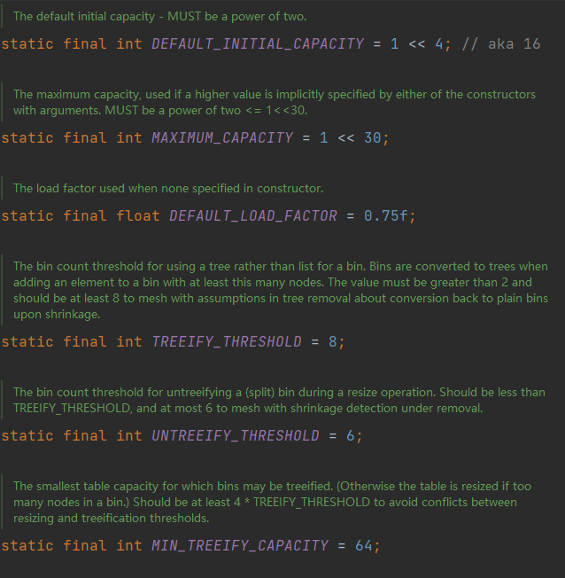

```java
final V putVal(int hash, K key, V value, boolean onlyIfAbsent,
               boolean evict) {
    Node<K,V>[] tab; Node<K,V> p; int n, i;
    // 把当前的table赋值给tab
    if ((tab = table) == null || (n = tab.length) == 0)
        // 首次进入,使用resize()创建数组
        n = (tab = resize()).length;
    // 找到对应位置,查看是否有数据
    if ((p = tab[i = (n - 1) & hash]) == null)
        // 为空直接添加
        tab[i] = newNode(hash, key, value, null);
    else {
        // p是现有数据(第一个)的值
        Node<K,V> e; K k;
        // 先判断hashcode值
        if (p.hash == hash &&
            ((k = p.key) == key || (key != null && key.equals(k))))
            // 相同的话，把p添加到e中
            e = p;
        else if (p instanceof TreeNode)
            e = ((TreeNode<K,V>)p).putTreeVal(this, tab, hash, key, value);
        else {
            // 和第一个数据的hashcode值不相等
            // 依次和所有的数据比较
            for (int binCount = 0; ; ++binCount) {
                // 只有一个元素
                if ((e = p.next) == null) {
                    
                    p.next = newNode(hash, key, value, null);
                    if (binCount >= TREEIFY_THRESHOLD - 1) // -1 for 1st
                        treeifyBin(tab, hash);
                    break;
                }
                // 还有元素，继续比较
                // 上面判断已经赋值了e = p.next
                if (e.hash == hash &&
                    ((k = e.key) == key || (key != null && key.equals(k))))
                    break;
                p = e;
            }
        }
        if (e != null) { 
            // existing mapping for key
            V oldValue = e.value;
            if (!onlyIfAbsent || oldValue == null)
                // key相等时替换对应的value
                e.value = value;
            afterNodeAccess(e);
            return oldValue;
        }
    }
    ++modCount;
    if (++size > threshold)
        resize();
    afterNodeInsertion(evict);
    return null;
}
```

```java
final Node<K,V>[] resize() {
    Node<K,V>[] oldTab = table;
    // 首次进入oldCap，oldThr均为0
    int oldCap = (oldTab == null) ? 0 : oldTab.length;
    int oldThr = threshold;
    int newCap, newThr = 0;
    if (oldCap > 0) {
        if (oldCap >= MAXIMUM_CAPACITY) {
            threshold = Integer.MAX_VALUE;
            return oldTab;
        }
        else if ((newCap = oldCap << 1) < MAXIMUM_CAPACITY &&
                 oldCap >= DEFAULT_INITIAL_CAPACITY)
            newThr = oldThr << 1; // double threshold
    }
    else if (oldThr > 0) // initial capacity was placed in threshold
        newCap = oldThr;
    else {               
        // zero initial threshold signifies using defaults
        // 首次进入执行,newCap = 16
        newCap = DEFAULT_INITIAL_CAPACITY;
        // newThr = 16*0.75 = 12
        newThr = (int)(DEFAULT_LOAD_FACTOR * DEFAULT_INITIAL_CAPACITY);
    }
    if (newThr == 0) {
        float ft = (float)newCap * loadFactor;
        newThr = (newCap < MAXIMUM_CAPACITY && ft < (float)MAXIMUM_CAPACITY ?
                  (int)ft : Integer.MAX_VALUE);
    }
    // threshold = 12
    threshold = newThr;
    @SuppressWarnings({"rawtypes","unchecked"})
    // newCap = 16,创建好了长度为16的数组
    Node<K,V>[] newTab = (Node<K,V>[])new Node[newCap];
    table = newTab;
    if (oldTab != null) {
        for (int j = 0; j < oldCap; ++j) {
            Node<K,V> e;
            if ((e = oldTab[j]) != null) {
                oldTab[j] = null;
                if (e.next == null)
                    newTab[e.hash & (newCap - 1)] = e;
                else if (e instanceof TreeNode)
                    ((TreeNode<K,V>)e).split(this, newTab, j, oldCap);
                else { // preserve order
                    Node<K,V> loHead = null, loTail = null;
                    Node<K,V> hiHead = null, hiTail = null;
                    Node<K,V> next;
                    do {
                        next = e.next;
                        if ((e.hash & oldCap) == 0) {
                            if (loTail == null)
                                loHead = e;
                            else
                                loTail.next = e;
                            loTail = e;
                        }
                        else {
                            if (hiTail == null)
                                hiHead = e;
                            else
                                hiTail.next = e;
                            hiTail = e;
                        }
                    } while ((e = next) != null);
                    if (loTail != null) {
                        loTail.next = null;
                        newTab[j] = loHead;
                    }
                    if (hiTail != null) {
                        hiTail.next = null;
                        newTab[j + oldCap] = hiHead;
                    }
                }
            }
        }
    }
    return newTab;
}
```


### LinkedHashMap

- `LinkedHashMap`是`HashMap`的子类 
- 在`HashMap`存储结构的基础上，使用双向链表来**记录添加元素的顺序**（`before`，`after`）
- `LinkedHashMap`可以维护Map的迭代顺序（迭代顺序与`key:value`键值对的插入顺序一致）
- `LinkedHashMap.keySet()`拿到的Set也是按照顺序的


### TreeMap

TreeMap实现的是 `NavigableMap`， 而不是直接实现 `Map`

> 继承体系: `Map -> SortMap -> NavigbleMap`

- `TreeSet`底层使用红黑树结构存储数据
- `TreeMap`存储`key:value`对时，会根据key进行排序
- `TreeMap`判断两个`key`相等的标准：两个`key`通过`compareTo()`方法或者`compare()`方法返回0
- `TreeMap`的`key`的排序：
  - **自然排序**：TreeMap的所有的`key`必须实现`Comparable`接口，且都应该是同一个类的对象，否则将会抛出`ClasssCastException`异常
  - **定制排序**：`TreeMap`创建时传入一个`Comparator`对象，该对象负责对`TreeMap`中的所有`key`进行排序。不需要`key`实现`Comparable`接口


### Properties

- `Properties`类是`Hashtable`的子类，用于**处理属性文件**
- 因为属性文件里的`key`和`value` 都是字符串类型，所以`Properties`里的`key`和`value`都是**字符串类型**
- 创建文件：`New`-`File`（手动添加`properties`后缀）或者`Resource Bundle`（自动添加）
- 存取数据时使用`setProperty()`方法和`getProperty()`方法

```java
Properties pros = new Properties();
FileInputSream fis = new FileInputStream("jdbc.properties");
pros.load(fis);
String usernamer = pros.getProperty("username");
String password = pros.getProperty("password");
System.out.println(user);
```

遇到乱码问题，需要勾上，再重新导入`properties`文件

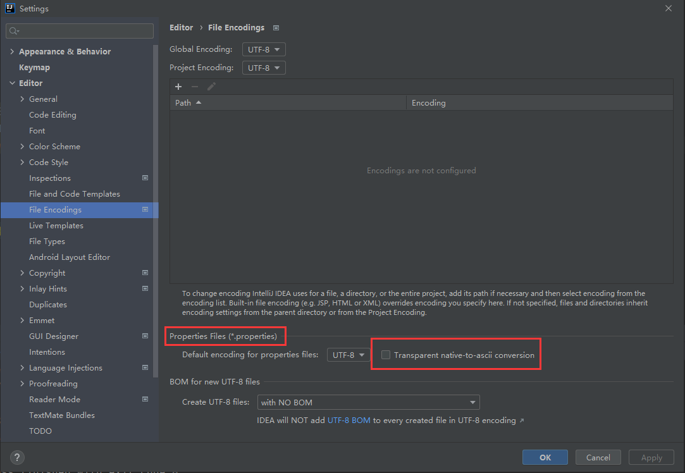


## Collections工具类

`Collections`是一个操作`Set`、`List`和`Map`等集合的工具类

`Collections`中提供了一系列**静态方法**，用来对集合元素进行排序、查询和修改等操作，还提供了对集合对象设置不可变、对集合对象实现同步控制等方法

> 操作数组的工具类：`Arrays`


**排序(静态方法)**

- `reverse(List)`：反转`List`中元素的顺序（修改`list`）
- `shuffle(List)`：对`List`中元素进行随机排序
- `sort(List)`：对`List`中元素按升序排序（根据元素的自然顺序）
- `sort(List,Comparator)`：根据指定`Comparator`的顺序对`List`中元素进行排序
- `swap(List,int,int)`：将指定`List`中的i处元素和j处元素进行交换
- `int frequency(Collection,Object)`：返回指定集合中指定元素的出现次数
- `void copy(List dest,Listsrc)`：将src中的内容复制到dest中（要求长度满足）
- `boolean replaceAll(List list,Object oldVal,Object newVal)`：使用`newVal`替换List对象的所有`oldVal`

**同步控制**

**Collections**类中提供了多个`synchronizedXxx()`方法，可以**将指定集合包装成线程同步的集合**，从而可以解决多线程并发访问集合时的**线程安全问题**

### 自定义排序

`sort(List,Comparator)`：根据指定`Comparator`的顺序对`List`中元素进行排序

```java
Collections.sort(dictionary,new Comparator<String>(){
    @Override
    public int compare(String s1,String s2){
        if(s1.length() == s2.length()){
            int i = 0;
            while(i < s1.length()){
                if(s1.charAt(i) != s2.charAt(i)){
                    return s1.charAt(i) - s2.charAt(i);
                }
                i++;
            }
        }   
        else{
            return -(s1.length()-s2.length());
        }
    }
});
```


# 泛型

**Generic**

集合容器类在设计阶段和声明阶段**不能确定容器中实际存的是什么类型的对象**

- JDK5之前只能把元素类型设计为`Object`
- JDK5之后改写了集合框架中的全部接口和类，为这些接口、类增加了泛型支持
  - 把**元素的类型设计成一个参数**（这时除了元素的类型不确定，其他的部分是确定的），这个**类型参数**就叫做泛型
  - 从而可以在声明集合变量、创建集合对象时传入类型实参

**本质**

- 泛型的本质是参数化类型，即将所操作的数据类型指定为一个参数


> JDK5的新特性


`<E>`

- E表示**类型**
  - 必须是类，不能是基本数据类型

- 允许在定义类、接口时通过一个标识（**类型参数**）表示类中某个属性类型或者某个方法返回值及参数类型
- 实例化集合类时指定具体的泛型类型
  - 在集合类或者接口中定义类或者接口时，内部结构使用到类的泛型的位置都指定为实例化时的泛型类型
  - 实例化时没有指明泛型类型，默认为`java.lang.Object`

**优点**

- **类型安全**
  - 只有指定类型才可以添加到集合中
  - 泛型为了安全，所有与泛型相关的异常都应该在编译期间发现
- **便捷**
  - 读取出来的对象不需要使用`instanceof`判断再类型强制转换
  - 运行时不会产生`ClassCastException`异常
    - `java.lang.ClassCastException: java.lang.Integer cannot be cast to java.lang.String`

> 使用`Object`的**缺点**
>
> - **类型不安全**：任何类型都可以添加到集合中（没有类型检查）
> - **繁琐**：读取出来的对象需要强转，可能有`ClassCastException`

`List`和`List <Object>`的区别

- List属于原始类型，不会进行安全类型检查，也不存在泛型类型的限制
- `List<Object>`泛型为Object，会进行安全类型检查，受泛型的限制

```java
package com.ink.Generic;

import org.junit.Test;

import java.util.*;

public class GenericTest {
    @Test
    public void test(){
//        指定类型为Integer
        ArrayList<Integer> list = new ArrayList<>();
        list.add(12);
        list.add(25);
//        for中可以使用int,Integer自动拆箱
        for (int number: list
             ) {
            System.out.println(number);
        }
        Iterator<Integer> iterator = list.iterator();
        while(iterator.hasNext()){
            System.out.println(iterator.next());
        }
    }
    @Test
    public void test2(){
        HashMap<String,Integer> map = new HashMap<>();
        map.put("ink",23);
        map.put("yinke",24);
//        泛型嵌套
        Set<Map.Entry<String, Integer>> entry = map.entrySet();
        Iterator<Map.Entry<String, Integer>> iterator = entry.iterator();
        while(iterator.hasNext()){
            Map.Entry<String, Integer> e = iterator.next();
            String key = e.getKey();
            Integer value = e.getValue();
            System.out.println(key + ":" + value);
        }
    }
}
```

## 类型擦除

所有的类型参数都用限定的类型替换

- 泛型只在**编译阶段**有效，通过类型擦除实现
- 在对象进入和离开方法处添加类型检验和类型转换方法，编译后的.class文件是不包含任何泛型信息的

泛型擦除不等价于`Object`

- 指定`Object`编译时会类型检查，必须按照`Object`处理
- 擦除则编译不会类型检查


**Java编译器擦除泛型的步骤**

1. 检查泛型类型，获取目标类型
2. 擦除类型变量，并替换为限定类型
   1. 如果泛型类型的类型变量没有限定()，则用Object作为原始类型
   2. 如果有限定()，则用`XClass`作为原始类型 如果有多个限定`(T extends XClass1&XClass2)`，则使用第一个边界XClass1作为原始类
3. 在必要时插入类型转换以保持类型安全
4. 生成桥方法以在扩展时保持多态性

## 泛型的使用

- 泛型的类型参数只能是类类型，不能是简单类型。
- 不能对确定的泛型类型使用`instanceof`操作（编译时会出错）

- 如果泛型结构是一个接口或抽象类，则不可创建泛型类的对象
- 不能声明泛型数组`new E[]`
  - 虚拟机本身的实现就不支持泛型数组。因为**数组是协变，擦除后就没法满足数组协变的原则**
  - 可以使用`Object`数组类型强制转换：`E[] elements = (E[])new Object[capacity]`
- 异常类不能是泛型的
- 实例化后，操作原来泛型位置的结构必须与指定的泛型类型一致
- 泛型如果不指定，就会被擦除（编译不会类型检查），泛型对应的类型均按照`Object`处理
- 泛型不同的引用不能相互赋值
  - `ArrayList<String>`和`ArrayList<Integer>`不能相互赋值
- JDK7后，泛型简化了操作（后面不用再加泛型）
  - `ArrayList<String> f = new ArrayList<>()`
- 在类、接口上声明的泛型在本类、接口中即代表了某种类型
  - 可以作为非静态属性的类型、非静态方法的参数类型、非静态方法的返回值类型
  - 但不能在**静态方法**中使用类的泛型
    - 因为泛型是在**实例化的时候确定**，而静态方法是随着类的创建一起加载的，所以无法使用类的泛型

> 泛型要使用就要一直使用，否则就都不用

## 自定义泛型结构

**三种结构**

- 自定义泛型类
- 自定义泛型接口
- 自定义泛型方法

### 自定义泛型类/接口

定义时不知道数据类型（在实例化的时候才知道）

- 泛型类可以有多个参数，在尖括号内用逗号隔开
  - `<E1,E2,E3>` 
- 泛型类的构造器没有变化
  - 但是在实例化的时候需要加上`<T>`，不指明默认泛型类型是`Object`类型）

> 常用`<T>`表示（Type的缩写）

```java
package com.ink.Generic;

public class Order<T>{
    String orderName;
    int orderId;
    // 在类的内部使用类的泛型
    T orderT;
	
    // 构造器没有变化
    public Order() {
    }

    public Order(String orderName, int orderId, T orderT) {
        this.orderName = orderName;
        this.orderId = orderId;
        this.orderT = orderT;
    }
    
    // 可以作为非静态方法的返回值类型 
    public T getOrderT() {
        return orderT;
    }

    public void setOrderT(T orderT) {
        this.orderT = orderT;
    }

    @Override
    public String toString() {
        return "Order{" +
                "orderName='" + orderName + '\'' +
                ", orderId=" + orderId +
                ", orderT=" + orderT +
                '}';
    }
}
```

```java
package com.ink.Generic;

import org.junit.Test;

import java.util.*;

public class GenericTest {
    @Test
    public void test(){
        // 实例化时指明泛型的类型
        Order<String> order = new Order<String>("A",1001,"order(A)");
        // Order{orderName='A', orderId=1001, orderT=order(A)}
        System.out.println(order.toString());
        order.setOrderT("AA:order");
        // Order{orderName='A', orderId=1001, orderT=AA:order}
        System.out.println(order.toString());
    }
}
```


### 自定义泛型方法

在**方法中**使用了泛型结构的方法

- 泛型方法的泛型参数与方法所在类的泛型参数无关
- 泛型方法和所在类或接口无关（与它们是不是泛型类无关）
- 泛型方法可以声明为静态
  - 因为泛型参数是在调用方法时确定的，而不是在实例化的时候确定的

> 不是方法中使用了类或接口的泛型就是泛型方法

**泛型方法格式**

- `[访问权限] <泛型> 返回类型 方法名（[泛型标识 参数名称]） 抛出的异常`

```java
public class Order<T>{
    String orderName;
    int orderId;
    T orderT;

    public Order() {
    }
    // 泛型方法
    public <E> List<E> copyFromArrayToList(E[] arr){
        ArrayList<E> list = new ArrayList<>();
        for (E e:arr
        ) {list.add(e);
        }
        return list;
    }
}
```

```java
package com.ink.Generic;

import org.junit.Test;

import java.util.*;

public class GenericTest {
    @Test
    public void test(){
        Order<String> order = new Order<>();
        Integer[] arr = new Integer[]{1,2,3,4};
        List<Integer> list = order.copyFromArrayToList(arr);
        System.out.println(list);
        String[] arr1 = new String[]{"ink","yinke"};
        List<String> strings = order.copyFromArrayToList(arr1);
        System.out.println(strings);
    }
}
```

**实际应用**

- 数据库字段的返回值类型不确定

```java
// data(base) access object
public class DAO<T>{
    public <E> E get(int id, E e){
        E result = null;
        return result;                        
    }
}
```


## 泛型与继承

B是A的一个**子类型**（子类或者子接口），G是具有泛型声明的类或接口

- `G<B>`并不是`G<A>`的子类型（`List<String>`并不是`List<Object>`的子类），二者是并列关系
- `B<G>`是`A<G>`的子类型（`ArrayList<String>`是`List<String>`的子类）

> 即容器里装的东西之间有继承关系，但容器之间是没有继承关系的，所以引入了限定通配符

### 泛型类的继承

父类有泛型，子类可以选择**保留泛型**或者**指定泛型类型**

- **指定了泛型类型的子类不再是泛型类**
  - 实例化时不再需要指明泛型类型
- **保留了泛型类型的子类仍然是泛型类**
  - 可以全部保留也可以部分保留，部分指定
  - 还可以增加子类自己的泛型
- 没有保留也没有指定泛型类型，则泛型擦除

```java
package com.ink.Generic;

// 继承带泛型的父类时指明了泛型类型为Integer
public class SubOrder extends Order<Integer>{
}
```

```java
package com.ink.Generic;

import org.junit.Test;

import java.util.*;

public class GenericTest {
    @Test
    public void test(){
        // 实例化时不再需要指明泛型类型
        SubOrder subOrder = new SubOrder();
        subOrder.setOrderT(1122);
        // Order{orderName='null', orderId=0, orderT=1122}
        System.out.println(subOrder.toString());
    }
}
```

```java
package com.ink.Generic;

// 继承带泛型的父类时,没有指明泛型类型，SubOrder也是泛型类
public class SubOrder<T> extends Order<T>{
}
```

```java
package com.ink.Generic;

import org.junit.Test;

import java.util.*;

public class GenericTest {
    @Test
    public void test(){
        // 实例化时需要指明泛型
        SubOrder<String> subOrder = new SubOrder<>();
        subOrder.setOrderT("ink");
        // Order{orderName='null', orderId=0, orderT=ink}
        System.out.println(subOrder.toString());
    }
}
```


## 非限定通配符 <?>

`<?>`

可以用任意类型来替代

- B是A的一个**子类型**（子类或者子接口），G是具有泛型声明的类或接口
  - `G<B>`并不是`G<A>`的子类型，二者是并列关系，共同的父类是`G<?>`

```java
package com.ink.Generic;

import org.junit.Test;

import java.util.*;

public class GenericTest {
    @Test
    public void test(){
        List<String> list1 = null;
        List<Integer> list2 = null;
        List<?> list = null;
        list = list1;
        list = list2;
        // 只能添加null
        list.add(null);
        
    }
    public void print(List<?> list){
        Iterator<?> iterator = list.iterator();
        while(iterator.hasNext()){
            Object next = iterator.next();
            System.out.println(next);
        }
    }
}
```

### 非限定通配符的使用

- 通配符**不能**用在泛型方法声明上
- 通配符**不能**用在泛型类的声明上
- 通配符**不能**用在创建对象上
- 使用通配符后，除了`null`不能再向其中写入数据，**但是可以读取其中的数据**（`Object`类型）

> 读取`List<?>`的对象list中的元素永远是安全的，因为不管list的真实类型是什么，它包含的都是Object

```java
// 编译错误，不能用在泛型方法声明上
public static <?> void test(ArrayList<?> list){
}
// 编译错误，不能用在泛型类的声明上
class GenericTypeClass<?>{
}
// 编译错误，不能用在创建对象上
ArrayList<?> list = newArrayList<?>();
```


## 限定通配符

**Wildcards**

限定通配符对类型进行了限制，指定了赋值的**区间范围**

- 指定上界`<? extends T>`
  - 使用时指定的类型必须**继承某个类**或者**实现某个接口**（<=） 
  - 类型实参只能传入类型为T和T的子类
- 指定下界`<? super T>`
  - 使用时指定的类型**不能小于操作的类**（>=）
  - 类型实参只准传入类型为T和T的父类

> 注意读取数据时的赋值对象（多态）
>
> 让容器之间有了继承关系

```java
// 只允许泛型为实现Comparable接口的实现类的引用调用
<? extends Comparable>

package com.ink.Generic;

import com.ink.collection.Person;
import org.junit.Test;

import java.util.*;

public class GenericTest {
    @Test
    public void test(){
       List<? extends Person> list1 = null;
       List<? super Person> list2 = null;

       List<Student> list3 = null;
       List<Person> list4 = null;
       List<Object> list5 = null;
       // 可以赋值
       list1 = list3;
       list1 = list4;
       // 报错, Object超过了Person
       list1 = list5;
       
       // 报错, Student低于Person
       list2 = list3;
       // 可以赋值
       list2 = list4;
       list2 = list5;
    }
}
```

### 限定通配符的问题

边界让不同泛型之间的转换更容易了，但是容器的部分功能可能会失效

- 指定上界`<? extends T>`后，无法再向容器内存数据，但可以取数据
  - 因为编译器只知道容器中的类型是T类或者T的子类
- 指定下界`<? super T>`后，可以向容器内存数据，但从容器中取数据只能存入`object`对象中
  - 因为编译器只知道容器中的类型是T类或者T的父类
  - 这样数据的类型信息就丢失了


# IO流

`input/output` 输入输出流

- I/O技术用于处理**设备之间的数据传输**
- Java对于数据的输入输出操作以**流**stream的方式进行
- `java.io`包提供了各种**流**类和接口用以获取**不同种类的数据**，并通过**标准输入输出**数据

## 字符集

- ASCII：美国标准信息交换码，**用一个字节的7位可以表示**
- Unicode：国际标准码，包含了全球目前使用的所有字符，为每个字符分配唯一的字符码，用两个字节表示所有字符
- GB2312：中文编码表，**最多用两个字节表示所有字符**
- GBK：中文编码表的升级，融合了更多的中文文字符号，**最多用两个字节表示所有字符**
- UTF-8：变长编码，可用1-4个字节来表示一个字符
- ISO8859-1：拉丁码表（欧洲码表），用一个字节的8位表示

> 在Unicode出现之前所有的字符集都是和具体编码方案绑定在一起的（即字符集≈编码方式），直接将字符和最终字节流绑定

**Unicode的问题**

Unicode存在三个问题

1. 英文字母只用一个字节8位表示就够了
2. 如何才能区别Unicode和ASCII？计算机如何知道两个字节表示一个符号，而不是分别表示两个符号？
3. 如果和GBK等双字节编码方式一样用最高位是1或0表示两个字节和一个字节， 就不够表示所有字符

**UTF（Universal Character Set Transfer Format）标准**

是针对Unicode的一种可变长度字符编码

- UTF-8
- UTF-16

> 这是为传输而设计的编码，可以显示全世界上所有文化的字符

## File类

`java.io.File`

- File类是**文件和文件目录路径**的抽象表示形式，与平台无关
- File类能**新建、删除、重命名**文件和目录，但**File类不能访问文件内容本身**
- 访问文件内容本身需要使用**IO流**
- **一个File类的对象代表一个文件或文件目录**
- 在Java程序中表示一个**真实存在**的文件或文件目录必须有一个`File`对象，但是有一个`File`对象，可能没有一个真实存在的文件或文件目录
- File对象作为**参数**传递给**流构造器**，指明读取或写入的**对象**

> 万物皆对象


### 构造器

**构造器创建File对象后只是在内存层面存在一个对象，还没有对应硬盘中的真实文件或文件目录**（文件夹中没有）

- `public File(String pathname)`：以`pathname`为路径创建File对象，可以是**绝对路径或相对路径**
  - 单元测试方法中相对路径是相对于当前的`module`（文件和`src`目录同级）
  - `main()`方法中相对路径是相对于当前的工程（文件和`src`目录同级）
- `public File(String parent,String child)`：以`parent`为父路径，`child`为子路径创建File对象
- `public File(File parent,String child)`：根据一个父文件对象和子文件路径创建File对象

```java
package com.ink.File;
import org.junit.Test;
import java.io.File;

public class FileTest {
    @Test
    public void test(){
        File file1 = new File("ink.md");
        // ink.md
        System.out.println(file1);
        // win下反斜杠
        File file2 = new File("C:\\Users\\54164\\Desktop\\File");
        // C:\Users\54164\Desktop\File
        System.out.println(file2);
        
        File file3 = new File("C:\\Users\\54164\\Desktop\\File", "ink");
        // C:\Users\54164\Desktop\File\ink
        System.out.println(file3);
        
        File file4 = new File("file3", "ink.txt");
        // file3\ink.txt
        System.out.println(file4);
    }
}
```

### 文件属性


### 路径分隔符

- 文件目录的**路径分隔符**需要转义
- 路径分隔符和系统有关：
  - **Windows和DOS系统使用`\`来表示（用`/`也可以识别出）**
  - **Unix和Url使用`/`来表示**
- File类提供了一个**常量**`separator`（`public  static final String`），可以根据操作系统**动态提供分隔符**

```java
// Windows
File file1= newFile("d:\\ink\\info.txt");

// Unix
File file3= newFile("d:/ink");

// separator
File file2= newFile("d:"+ File.separator+ "ink"+ File.separator+ "info.txt");
```


### 常用方法

**文件信息获取**

- `public String getAbsolutePath()`：获取绝对路径

- `public String getPath()`：获取路径

  - 绝对路径创建：绝对路径
  - 相对路径创建：文件或文件目录名

- `public String getName()`：获取名称 

- `public String getParent()`：获取**上层文件目录**路径，无则返回`null`

- `public long length()`：获取文件长度（字节数），**不能获取目录的长度**

- `public long lastModified()`：获取最后一次的修改时间（毫秒值）

  > 可以通过`new Date(file.lastModified())`获取具体时间

```java
package com.ink.File;
import org.junit.Test;
import java.io.File;

public class FileTest {
    @Test
    public void test(){
        File file1 = new File("ink.md");
        File file2 = new File("C:\\Users\\54164\\Desktop\\File");
        System.out.println(file1.getAbsoluteFile());
        System.out.println(file1.getPath());
        System.out.println(file1.getName());
        System.out.println(file1.getParent());
        System.out.println(file1.length());
        System.out.println(file1.lastModified());
        System.out.println();
        System.out.println(file2.getAbsoluteFile());
        System.out.println(file2.getPath());
        System.out.println(file2.getName());
        System.out.println(file2.getParent());
        System.out.println(file2.length());
        System.out.println(file2.lastModified());
        // 转换为当前时间
        System.out.println(new Date(file2.lastModified()));
    }
}
```

没有真正创建ink.md，所以返回null和0，创建了空的File文件目录，返回了修改时间

 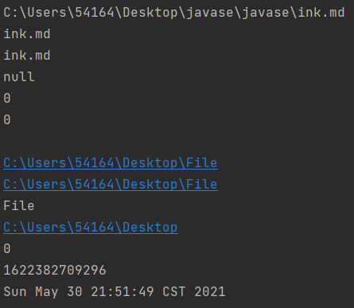


**目录文件信息获取**

- `public String[] list()`：获取指定目录下的所有文件或文件目录的**名称数组**（包含后缀 ）
- `public File[] listFiles()`：获取指定目录下的所有文件或文件目录的**File数组**

```java
package com.ink.File;
import org.junit.Test;
import java.io.File;
import java.util.Date;

public class FileTest {
    @Test
    public void test(){
        File file = new File("C:\\Users\\54164\\Desktop\\javase\\javase\\src\\com\\ink");
        String[] lists = file.list();
        for(String l : lists){
            System.out.println(l);
        }
        File[] files = file.listFiles();
        for(File f : files){
            System.out.println(f);
        }
    }
}
```

File类对象输出是调用的`tostring()`方法输出的**路径字符串**

 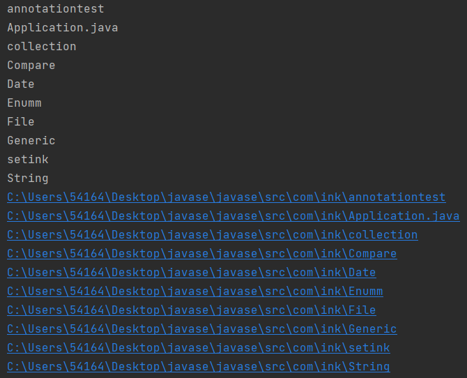


**文件移动和重命名**

- `public boolean renameTo(File dest)`：把文件移动到指定的文件路径并重命名，返回值表示是否成功

> 如果是相对路径创建的文件，要求文件在`module`下，而不是`package`下
>
> 如果想返回true：要求源文件存在且指定的文件路径的文件不存在

```java
package com.ink.File;
import org.junit.Test;
import java.io.File;

public class FileTest {
    @Test
    public void test(){
        File file1 = new File("ink.txt");
        File file2 = new File("C:\\Users\\54164\\Desktop\\File\\yinke.txt");
        // 将ink.txt移动到C:\Users\54164\Desktop\File下并重命名为yinke.txt
        boolean renameTo = file1.renameTo(file2);
        System.out.println(renameTo);
    }
}
```


**判断文件属性**

- `public boolean exists()`：**判断是否存在**
- `public boolean isFile()`：判断是否是文件
- `public boolean isDirectory()`：判断是否是目录文件
- `public boolean canRead()`：判断是否可读
- `public boolean canWrite()`：判断是否可写
- `public boolean isHidden()`：判断是否隐藏


**创建文件**

- `public boolean createNewFile()`：使用File类对象在**硬盘中**创建对应的文件，若文件存在则不创建，返回`false`


**创建文件目录**

- `public boolean mkdir()`：在**硬盘中**创建对应的文件目录
  - 如果文件目录**存在则不创建**
  - 如果文件目录的**上层目录不存在则不创建**
- `public boolean mkdirs()`：创建文件目录，如果上层文件目录**不存在则一起创建**

> 如果创建文件或文件目录没有写盘符路径，默认在**项目路径**下创建


**删除文件**

- `public boolean delete()`：删除文件或文件目录

> Java中的删除不是放进回收站
>
> 删除一个文件目录要求该文件目录内不能包含子文件或子文件目录

```java
package com.ink.File;
import org.junit.Test;
import java.io.File;
import java.io.IOException;
import java.util.Date;

public class FileTest {
    @Test
    // 抛出异常
    public void test6() throws IOException {
        File file = new File("ink.md");
        if(!file.exists()){
            file.createNewFile();
            System.out.println("创建成功");
        }
        else{
            file.delete();
            System.out.println("删除成功");
        }
    }
}
```


## 流类

Java的IO流共涉及40多个类，**都是从4个抽象基类派生的**

由这4个抽象基类派生出来的子类名称都是**以其父类名作为子类名后缀**

> 抽象类不能实例化

| 抽象基类 | 字节流       | 字符流 |
| -------- | ------------ | ------ |
| 输入流   | InputStream  | Reader |
| 输出流   | OutputStream | Writer |

### 流的分类

- 按操作**数据单位**不同分为：

  - 字节流(8 bit)：用于图片，视频等非文本数据传输

  - 字符流(16 bit)：`char`，用于文本数据传输

- 按流的**流向**不同分为：

  - 输入流
  - 输出流

- 按流的**角色**的不同分为：

  - 节点流：**直接作用于文件**的流
  - 处理流：**封装**了节点流

> 字节流操作字节，如.mp3，.avi，.rmvb，mp4，.jpg，.doc，.ppt
>
> 字符流操作字符，只能操作普通文本文件，如.txt和.java，.c，.cpp等语言的源代码
>
> Java的字节是有符号类型，字符是无符号类型

 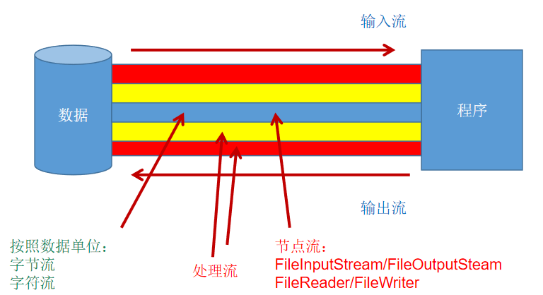


### 节点流

- `FileInputStream`
- `FileOutputStream`
- `FileReader`
- `FileWriter`

#### 字符流

- `FileReader`
- `FileWriter`


**文件流的使用**

`FileReader`读入

- `File`类的实例化
- `FileReader`流的实例化
- 使用`read()`方法读入文件内容（**读入的文件必须存在**）
- 使用`close()`方法手动关闭流资源

> `read()`方法可以重载
>
> 垃圾回收机制只回收JVM堆内存中的对象空间，对IO流等物理连接没有办法处理（程序中打开的文件IO资源不属于内存里的资源），需要手动关闭


**read()方法**

读取单个字符。作为整数读取的字符，范围在0到65535之间(0x00-0xffff)（2个字节的Unicode码），如果已到达流的末尾，则返回-1

```java
package com.ink.IO;

import org.junit.Test;

import java.io.File;
import java.io.FileReader;
import java.io.IOException;

public class FileReaderWriterTest {
    @Test
    public void test() throws IOException {
//        实例化File对象，指明操作文件
        File file = new File("ink.txt");
//        提供具体流的实例化对象
        FileReader fr = new FileReader(file);
//        读入read():返回读入的一个字符,达到文件末尾返回-1
        int data;
        while((data = fr.read()) != -1){
            System.out.print((char) data);
        }
//        关闭流
        fr.close();
    }
}
```

 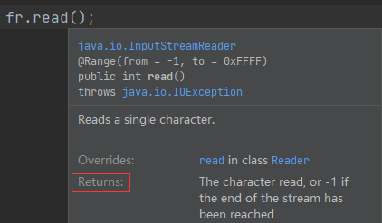

**read(charbuffer)方法**

将字符读入charbuffer数组，如果已到达流的末尾，则返回-1，否则**返回本次读取的字符数**

> 在遍历时不要使用`charbuffer.lenth`，而要使用返回的字符数`len`。因为最后一次读取的长度可能不够数组长度，此时**数组中剩下的内容还是上一次存储的文件内容，而没有被覆盖**，会输出错误的信息

```java
package com.ink.IO;

import org.junit.Test;

import java.io.File;
import java.io.FileReader;
import java.io.IOException;

public class FileReaderWriterTest {
    @Test
    public void test(){
        FileReader fr = null;
        try {
//            实例化File对象，指明操作文件
            File file = new File("ink.txt");
//            提供具体流
            fr = new FileReader(file);
            char[] charbuffer = new char[5];
            // 使用每次读取返回的字符个数
            int len;
//            read(charbuffer):返回每次读入到charbuffer数组中的字符的个数,达到文件末尾返回-1
            while((len = fr.read(charbuffer)) != -1){
                for (int i = 0; i < len; i++) {
                    System.out.print("第 " + i + "次" + " ");
                    System.out.print(charbuffer[i] + " ");
                }
                System.out.println();
            }
        } catch (IOException e) {
            e.printStackTrace();
        } finally {
//            if中try catch也可以
            try {
//                关闭流
                if(fr != null) {
                    fr.close();
                }
            } catch (IOException e) {
                e.printStackTrace();
            }
        }
    }
}
```

 .png)


**流的异常处理**

关于流的异常处理，要使用`try catch finally`处理`close()`之前的内容

- 如果使用`throws`抛出异常的话，可能无法正确关闭流
- 如果`fr = new FileReader(file)`实例化时候捕捉了异常，则`finally`中的关闭操作也无法执行，所以要添加判断

> 代码自动添加的`FileReader fr = null`

**快捷键**：选中 + `Ctrl + Alt +t`

```java
package com.ink.IO;
import org.junit.Test;
import java.io.File;
import java.io.FileReader;
import java.io.IOException;

public class FileReaderWriterTest {
    @Test
    public void readtest(){
        FileReader fr = null;
        try {
//            实例化File对象，指明操作文件
            File file = new File("ink.txt");
//            提供具体流
            fr = new FileReader(file);
//            read():返回读入的一个字符,达到文件末尾返回-1
            int data;
            while((data = fr.read()) != -1){
                System.out.print((char) data);
            }
        } catch (IOException e) {
            e.printStackTrace();
        } finally {
//            if中try catch也可以
            try {
//                关闭流
                if(fr != null) {
                    fr.close();
                }
            } catch (IOException e) {
                e.printStackTrace();
            }
        }
    }
}

```


`FileWriter`写出

- `File`类的实例化
- `FileWriter`流的实例化
- 使用`write()`方法将内容写出到文件中（**写出的文件不存在会自动创建**）
- 使用`close()`方法手动关闭流资源

> 写出文件存在时，通过FileWriter的构造器中的`append`参数选择覆盖或者追加内容

```java
package com.ink.IO;
import org.junit.Test;
import java.io.File;
import java.io.FileReader;
import java.io.FileWriter;
import java.io.IOException;

public class FileReaderWriterTest {
    @Test
    public void writetest(){
        FileWriter fw = null;
        try {
            File file = new File("yinke.txt");
            // 设定append为false
            fw = new FileWriter(file,false);

            fw.write("FileWriter test\n");
            fw.write("write test");
        } catch (IOException e) {
            e.printStackTrace();
        } finally {
            if(fw != null){
                try {
                    fw.close();
                } catch (IOException e) {
                    e.printStackTrace();
                }
            }
        }
    }
}
```


**读入写出实现复制文件操作**

- `File`类的实例化（读入和写出）
- `FileReader`和`FileWriter`流的实例化
- 使用`read()`和`write()`方法复制内容
- 使用`close()`方法手动关闭流资源

```java
package com.ink.IO;
import org.junit.Test;
import java.io.File;
import java.io.FileReader;
import java.io.FileWriter;
import java.io.IOException;

public class FileReaderWriterTest {
    @Test
    public void copytest() throws IOException {
        FileReader fr = null;
        FileWriter fw = null;
        try {
            File srcFile = new File("ink.txt");
            File destFile = new File("copy.txt");
            fr = new FileReader(srcFile);
            fw = new FileWriter(destFile);
            char[] cbuf = new char[5];
            int len;
            while((len = fr.read(cbuf)) != -1){
                fw.write(cbuf,0,len);
            }
        } catch (IOException e) {
            e.printStackTrace();
        } finally {
//            方法一
//            try {
//                if(fw != null){
//                    fw.close();
//                }
//            } catch (IOException e) {
//                e.printStackTrace();
//            } finally {
//                try {
//                    if(fr != null){
//                        fr.close();
//                    }
//                } catch (IOException e) {
//                    e.printStackTrace();
//                }
//            }
//          方法二
            try {
                if(fw != null){
                    fw.close();
                }
            } catch (IOException e) {
                e.printStackTrace();
            }
            try {
                if(fr != null){
                    fr.close();
                }
            } catch (IOException e) {
                e.printStackTrace();
            }
        }
    }
}
```


#### 字节流

- `FileInputStream`
- `FileOutputStream`

> UTF-8中英文一个字符就是一个字节，所以字节流也可以处理
>
> `buffer[]`数组一般设置大小位1024

```java
package com.ink.IO;
import org.junit.Test;
import java.io.File;
import java.io.FileInputStream;
import java.io.FileOutputStream;
import java.io.IOException;

public class FileInputOutputStreamTest {
    @Test
    public void copytest(){
        FileInputStream fis = null;
        FileOutputStream fos = null;
        try {
            File srcFile = new File("ink.png");
            File destFile = new File("yinke.png");
            fis = new FileInputStream(srcFile);
            fos = new FileOutputStream(destFile);
            byte[] buffer = new byte[1024];
            int len;
            while((len = fis.read(buffer)) != -1){
                fos.write(buffer,0,len);
            }
        } catch (IOException e) {
            e.printStackTrace();
        } finally {
            if(fos != null){
                try {
                    fos.close();
                } catch (IOException e) {
                    e.printStackTrace();
                }
            }
            if(fis != null){
                try {
                    fis.close();
                } catch (IOException e) {
                    e.printStackTrace();
                }
            }
        }
    }
}
```


### 处理流

对节点流进行**包装**

#### 缓冲流

为了**提高数据读写的速度**，Java API提供了带缓冲功能的流类。使用这些流类时会创建一个**内部缓冲区数组**（默认使用8Kb的缓冲区）

> `BufferedOutputStream`中存在`flush()`方法，用来强制刷新缓冲区（输出并清空）

 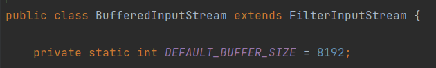

缓冲流要**包装**在相应的节点流之上

- `BufferedInputStream`
- `BufferedOutputStream`
- `BufferedReader`
- `BufferedWriter`


**缓冲流的使用**

-  `File`类的实例化（读入和写出）
- 节点流的实例化
- 处理流的实例化
- 使用`read()`和`write()`方法复制内容
- 使用`close()`方法手动关闭流资源

> 要求先关闭外层的处理流，再关闭内层的节点流
>
> 关闭外层流的同时内层流会自动关闭，可以省略
>
> 带缓冲区的流对象的`close()`方法，不但会关闭流，还会在关闭流之前**刷新缓冲区**，关闭后不能再写出

- `BufferedInputStream`
- `BufferedOutputStream`

```java
package com.ink.IO;

import org.junit.Test;

import java.io.*;

/**
 * @author ink
 * @date 2021年06月01日20:57
 */
public class BufferedTest {
    @Test
    public void test(){
        BufferedInputStream bis = null;
        BufferedOutputStream bos = null;
        try {
            File srcFile = new File("yinke.png");
            File destFile = new File("inkyinke.png");
            
            FileInputStream fis = new FileInputStream(srcFile);
            FileOutputStream fos = new FileOutputStream(destFile);
            
            bis = new BufferedInputStream(fis);
            bos = new BufferedOutputStream(fos);
            
            byte[] buffer = new byte[10];
            int len;
            while((len = bis.read(buffer)) != -1){
                bos.write(buffer,0,len);
                // 自动执行
                // bos.flush();
            }
        } catch (IOException e) {
            e.printStackTrace();
        } finally {
            if(bos != null){
                try {
                    bos.close();
                } catch (IOException e) {
                    e.printStackTrace();
                }
            }
            if(bis != null){
                try {
                    bis.close();
                } catch (IOException e) {
                    e.printStackTrace();
                }
            }
//           fos.close();
//           fis.close();
        }
    }
}
```


- `BufferedReader`
- `BufferedWriter`

`readLine()`方法可以一次读一行数据

 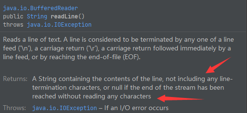

**可以使用匿名对象一次性直接创建缓冲流对象**

```java
package com.ink.IO;
import org.junit.Test;
import java.io.*;

public class BufferedTest {
    @Test
    public void test(){
        BufferedReader br = null;
        BufferedWriter bw = null;
        try {
            // br = new BufferedReader(new FileReader("ink.txt"));
            br = new BufferedReader(new FileReader(new File("ink.txt")));
            bw = new BufferedWriter(new FileWriter(new File("yinke.txt")));
//        方法一:
//        char[] cbuf = new char[1024];
//        int len;
//        while((len = br.read(cbuf)) != -1){
//            bw.write(cbuf,0,len);
//        }
//        方法二:
            String data;
            while((data = br.readLine()) != null) {
//                不包括换行符
                bw.write(data);
            }
        } catch (IOException e) {
            e.printStackTrace();
        } finally {
            if(br != null){
                try {
                    br.close();
                } catch (IOException e) {
                    e.printStackTrace();
                }
            }
            if(bw != null){
                try {
                    bw.close();
                } catch (IOException e) {
                    e.printStackTrace();
                }
            }
//           fos.close();
//           fis.close();
        }
    }
}
```

**Demo**

**获取文本上字符出现的次数并把数据写入文件**

 1. 遍历文本的每一个字符
 2. 把字符出现的次数存在Map中
 3. 把Map中的数据写入文件

``` java
package com.atguigu.java;

import org.junit.Test;

import java.io.*;
import java.util.HashMap;
import java.util.Map;
import java.util.Set;

public class WordCount {
    @Test
    public void testWordCount() {
        FileReader fr = null;
        BufferedWriter bw = null;
        try {
            // 1.创建Map集合
            Map<Character, Integer> map = new HashMap<Character, Integer>();

            // 2.遍历每一个字符,将次数放到map中
            fr = new FileReader("dbcp.txt");
            int c = 0;
            while ((c = fr.read()) != -1) {
                // int 还原 char
                char ch = (char) c;
                // 判断char是否在map中第一次出现
                if (map.get(ch) == null) {
                    map.put(ch, 1);
                } else {
                    map.put(ch, map.get(ch) + 1);
                }
            }

            // 3.把map中数据存在文件count.txt
            // 3.1 创建Writer
            bw = new BufferedWriter(new FileWriter("wordcount.txt"));

            // 3.2 遍历map,再写入数据
            Set<Map.Entry<Character, Integer>> entrySet = map.entrySet();
            for (Map.Entry<Character, Integer> entry : entrySet) {
                switch (entry.getKey()) {
                    case ' ':
                        bw.write("空格=" + entry.getValue());
                        break;
                    case '\t'://\t表示tab 键字符
                        bw.write("tab键=" + entry.getValue());
                        break;
                    case '\r'://
                        bw.write("回车=" + entry.getValue());
                        break;
                    case '\n'://
                        bw.write("换行=" + entry.getValue());
                        break;
                    default:
                        bw.write(entry.getKey() + "=" + entry.getValue());
                        break;
                }
                bw.newLine();
            }
        } catch (IOException e) {
            e.printStackTrace();
        } finally {
            //4.关闭流
            if (fr != null) {
                try {
                    fr.close();
                } catch (IOException e) {
                    e.printStackTrace();
                }

            }
            if (bw != null) {
                try {
                    bw.close();
                } catch (IOException e) {
                    e.printStackTrace();
                }

            }
        }
    }
}
```


#### 转换流

使用转换流可以实现**字节流和字符流之间的转换**

**转换流属于字符流**

- `InputStreamReader`：将**字节**的输入流`InputStream`转换为**字符**的输入流`Reader`
- `OutputStreamWriter`：将**字符**的输出流`Writer`转换为**字节**的输出流`OutputStream`

**应用场景**

使用转换流实现编码和解码的功能（处理文件乱码问题）

- 编码：字符——字节
- 解码：字节——字符

> 字节流中的数据都是字符时，转成字符流操作更高效

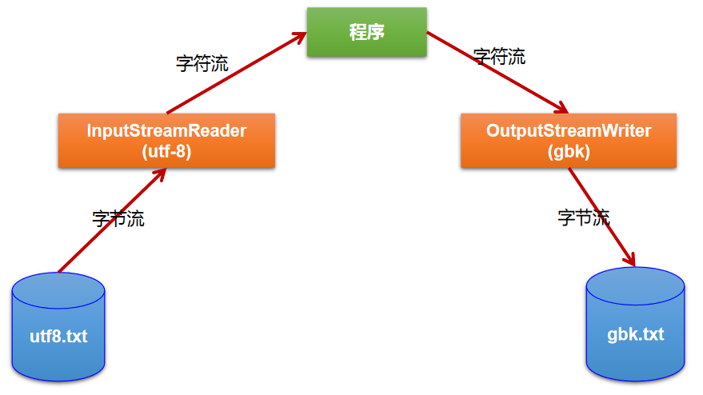

**构造器**

`InputStreamReader(InputStresam in,String charsetName)`

- `InputStresam in`：输入字节流，用来读取文件中保存的字节
- `String charsetName`：指定读入时的编码名称，不指定则使用平台默认的字符编码

OutputStreamWriter(OutputStream out, String charsetName)

- `OutputStream out`：输出字节流，用来保存从文件中读取的字节
- `String charsetName`：指定写入时的编码名称，不指定则使用平台默认的字符编码

> 每次调用`write()`方法时都会在给定字符上调用编码转换器。**生成的字节**在写入底层输出流之前在缓冲区中累积（传递给`write()`方法的字符不会被缓冲）
>
> 为了获得最高效率，一般在BufferedWriter中包装OutputStreamWriter以避免频繁的调用编码转换器

```java
package com.ink.IO;

import org.junit.Test;

import java.io.*;

public class InputStreamReaderTest {
    @Test
    public void test1(){
        InputStreamReader isr = null;
        try {
            FileInputStream fis = new FileInputStream("copy.txt");
//        参数2指明了字符集，具体使用哪个字符集取决于文件保存时使用的字符集
//        使用系统默认的字符集
//        InputStreamReader isr = new InputStreamReader(fis);
//        使用UTF-8字符集
            isr = new InputStreamReader(fis,"UTF-8");

            char[] cbuf = new char[20];
            int len;
            while((len = isr.read(cbuf)) != -1){
                String str = new String(cbuf,0,len);
                System.out.print(str);
            }
        } catch (IOException e) {
            e.printStackTrace();
        } finally {
            try {
                if(isr != null){
                    isr.close();
                }
            } catch (IOException e) {
                e.printStackTrace();
            }
        }

    }
    @Test
    public void test2() throws Exception {
        InputStreamReader isr = null;
        OutputStreamWriter osw = null;
        try {
            File file1 = new File("copy.txt");
            File file2 = new File("copy_gbk.txt");

            FileInputStream fis = new FileInputStream(file1);
            FileOutputStream fos = new FileOutputStream(file2);

            isr = new InputStreamReader(fis,"utf-8");
            osw = new OutputStreamWriter(fos,"gbk");

            char[] cbuf = new char[20];
            int len;
            while((len = isr.read(cbuf)) != -1){
                osw.write(cbuf,0,len);
            }
        } catch (IOException e) {
            e.printStackTrace();
        } finally {
            try {
                if(isr != null){
                    isr.close();
                }
            } catch (IOException e) {
                e.printStackTrace();
            }
            try {
                if(osw != null){
                    osw.close();
                }
            } catch (IOException e) {
                e.printStackTrace();
            }
        }
    }
}

```


### 标准输入/输出流

`System`

- `err`
- `in`：
- `out`：系统标准的输出（显示器）

**System.in**

- 系统标准的输入设备（键盘）
- `System.in`的类型是`InputStream`

**System.out**

- 系统标准的输出设备（显示器）
- `System.out`的类型是`PrintStream`（OutputStream的子类）

**重定向**

通过System类的`setIn()`，`setOut()`方法对默认设备进行改变

- `public static void setIn(InputStream in)`
- `public static void setOut(PrintStream out)`

```java
package com.ink.IO;

import java.io.BufferedReader;
import java.io.IOException;
import java.io.InputStreamReader;

public class OtherStreamTest {
//    从键盘输入字符串，要求将读取到的整行字符串转成大写输出，然后继续进行输入操作，直至当输入“e”或者“exit”时退出程序
//    方法一：使用Scanner实现，调用next()返回一个字符串
//    方法二：使用System.in实现。System.in-->转换流-->BufferedReader的readLine()方法

    public static void main(String[] args) {
//        单元测试方法不支持System.in
        BufferedReader br = null;
        try {
//            System.in的类型是InputStream，所以需要转换流来转换
            InputStreamReader isr = new InputStreamReader(System.in);
            br = new BufferedReader(isr);

            while (true) {
                System.out.println("请输入字符串：");
                String data = br.readLine();
//                用字符串来比较（放前面）
                if ("e".equalsIgnoreCase(data) || "exit".equalsIgnoreCase(data)) {
                    System.out.println("程序结束");
                    break;
                }
                String upperCase = data.toUpperCase();
                System.out.println(upperCase);

            }
        } catch (IOException e) {
            e.printStackTrace();
        } finally {
            if (br != null) {
                try {
                    br.close();
                } catch (IOException e) {
                    e.printStackTrace();
                }
            }
        }
    }
}
```

### 打印流

- `PrintStream`
  - `println`
- `PrintWriter` 

**将基本数据类型的数据格式转化为字符串输出**

- `PrintStream`和`PrintWriter`提供了一系列重载的`print()`和`println()`方法用于多种数据类型的输出
- `PrintStream`和`PrintWriter`的输出不会抛出`IOException`异常
- `PrintStream`和`PrintWriter`有自动`flush`功能（刷新）
- `PrintStream`打印的所有字符都使用平台的默认字符编码转换为字节。在需要写入字符的情况下应该使用`PrintWriter`
- System.out返回的是PrintStream的实例

```java
package com.ink.IO;

import org.junit.Test;

import java.io.*;

public class OtherStreamTest {
    @Test
    public void test1() {
        PrintStream ps = null;
        try {
            FileOutputStream fos = new FileOutputStream(new File("C:\\Users\\54164\\Desktop\\File\\text.txt"));
            // 创建打印输出流,设置为自动刷新模式(写入换行符或字节 '\n' 时都会刷新输出缓冲区)
            ps = new PrintStream(fos, true);
            if (ps != null) {
                // 把标准输出流(控制台输出)改成输出到文件
                System.setOut(ps);
            }
            for (int i = 0; i <= 255; i++) { // 输出ASCII字符
                System.out.print((char) i);
                if (i % 50 == 0) { // 每50个数据一行
                    System.out.println(); // 换行
                }
            }
        } catch (FileNotFoundException e) {
            e.printStackTrace();
        } finally {
            if (ps != null) {
                ps.close();
            }
        }
    }
}
```


### 数据流

操作基本数据类型和String的数据

- `DataInputStream`
- `DataOutputStream`

**DataInputStream方法**

- `boolean readBoolean()` 
- `byte readByte()`
- `char readChar()` 
- `float readFloat()`
- `double readDouble()` 
- `short readShort()`
- `long readLong()` 
- `int readInt()`
- `String readUTF()`                          
- `void readFully(byte[] b)`

> DataOutputStream中的方法就是将上述方法的read改为write即可
>
> 读出的顺序和写入的顺序要求一致，否则会报异常


### 对象流

存储和读取基本数据类型数据或**对象**的处理流。可以把Java中的对象写入到数据源中，也能把对象从数据源中还原出来

- `ObjectInputStream`
- `OjbectOutputSteam`

**序列化和反序列化**

- **序列化**：用`ObjectOutputStream`类将基本类型数据或对象**从内存中保存到磁盘中**
- **反序列化**：用`ObjectInputStream`类将基本类型数据或对象**从磁盘中读取到内存中**

**持久化存储和传输**

- **对象序列化机制**可以把内存中的Java对象转换成平台无关的二进制流，从而把二进制流持久地保存在磁盘上或通过网络将二进制流传输到另一个网络节点（其它程序获取了这种二进制流，就可以恢复成原来的Java对象）
- 序列化是RMI（Remote Method Invoke远程方法调用）过程的参数和返回值都必须实现的机制，RMI是JavaEE的基础，因此序列化机制是JavaEE平台的基础
- 如果要让某个对象支持序列化机制，则必须让对象所属的类及其属性是可序列化的，为了让某个类是可序列化的，该类必须实现如下两个接口之一，否则，会抛出`NotSerializableException`异常
  - `Serializable`
  - `Externalizable`
- 如果某个类的属性不是基本数据类型或String 类型而是另一个引用类型，那么这个引用类型必须是可序列化的，否则拥有该类型的Field的类也不能序列化

**java.io.Serializable接口**

标识接口：空方法接口，用于序列化

> 序列化机制能自动补偿操作系统间的差异，不必关心数据在不同机器上如何表示，也不必关心字节的顺序或者其他任何细节

 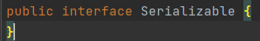

 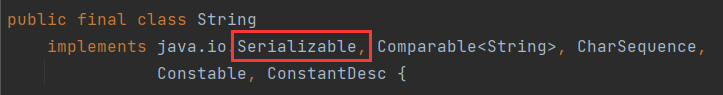

**序列化版本标识符**

- `private static final long serialVersionUID;`

- Java的序列化机制是通过在运行时判断类的serialVersionUID来验证版本一致性的

- 在进行反序列化时JVM会把传来的字节流中的serialVersionUID与本地相应实体类的serialVersionUID进行比较，如果相同就认为是一致的，可以进行反序列化，否则就会出现序列化版本不一致的异常(InvalidCastException)


> 源码注释：ANY-ACCESS-MODIFIER static final long serialVersionUID = 42L
>
> serialVersionUID用来表明类的不同版本间的兼容性。其目的是以序列化对象进行版本控制，有关各版本反序列化时是否兼容。如果类没有显示定义这个静态常量，它的值是Java运行时环境根据类的内部细节自动生成的。若类的实例变量做了修改，serialVersionUID可能发生变化。建议显式声明


**可序列化要求**

 * 实现`Serializable`接口
 * 当前类提供一个全局常量`serialVersionUID`
 * 除了当前类需要实现`Serializable`接口之外，还必须保证**其内部所有属性也必须是可序列化的**（默认情况下基本数据类型可序列化）
 * `ObjectOutputStream`和`ObjectInputStream`不能序列化`static`和`transient`修饰的成员变量

```java
package com.ink.IO;

import java.io.Serializable;

public class Person implements Serializable{

    public static final long serialVersionUID = 475463534532L;

    private String name;
    private int age;
    private int id;
    private Account acct;

    public Person(String name, int age, int id) {
        this.name = name;
        this.age = age;
        this.id = id;
    }

    public Person(String name, int age, int id, Account acct) {
        this.name = name;
        this.age = age;
        this.id = id;
        this.acct = acct;
    }

    @Override
    public String toString() {
        return "Person{" +
                "name='" + name + '\'' +
                ", age=" + age +
                ", id=" + id +
                ", acct=" + acct +
                '}';
    }

    public int getId() {
        return id;
    }

    public void setId(int id) {
        this.id = id;
    }

    public String getName() {
        return name;
    }

    public void setName(String name) {
        this.name = name;
    }

    public int getAge() {
        return age;
    }

    public void setAge(int age) {
        this.age = age;
    }

    public Person(String name, int age) {
        this.name = name;
        this.age = age;
    }

    public Person() {
    }
}
//Account也要序列化
class Account implements Serializable{
    public static final long serialVersionUID = 4754534532L;
    private double balance;

    @Override
    public String toString() {
        return "Account{" +
                "balance=" + balance +
                '}';
    }

    public double getBalance() {
        return balance;
    }

    public void setBalance(double balance) {
        this.balance = balance;
    }

    public Account(double balance) {
        this.balance = balance;
    }
}
```

> 注意写出一次就要`flush()`一次

```java
package com.ink.IO;

import org.junit.Test;

import java.io.*;

public class ObjectInputOutputStreamTest {
//    序列化:将内存中的java对象保存到磁盘中或通过网络传输出去
    @Test
    public void testObjectOutputStream(){
        ObjectOutputStream oos = null;
        try {
            oos = new ObjectOutputStream(new FileOutputStream("object.dat"));
            oos.writeObject(new String("我爱北京天安门"));
//            刷新
            oos.flush();
            oos.writeObject(new Person("ink",24));
            oos.flush();
            oos.writeObject(new Person("yinke",23,1001,new Account(5000)));
            oos.flush();
        } catch (IOException e) {
            e.printStackTrace();
        } finally {
            if(oos != null){
                try {
                    oos.close();
                } catch (IOException e) {
                    e.printStackTrace();
                }
            }
        }
    }

//    反序列化：将磁盘文件中的对象还原为内存中的一个java对象
    @Test
    public void testObjectInputStream(){
        ObjectInputStream ois = null;
        try {
            ois = new ObjectInputStream(new FileInputStream("object.dat"));

            Object obj = ois.readObject();
            String str = (String) obj;

            Person p = (Person) ois.readObject();
            Person p1 = (Person) ois.readObject();

            System.out.println(str);
            System.out.println(p);
            System.out.println(p1);

        } catch (IOException e) {
            e.printStackTrace();
        } catch (ClassNotFoundException e) {
            e.printStackTrace();
        } finally {
            if(ois != null){
                try {
                    ois.close();
                } catch (IOException e) {
                    e.printStackTrace();
                }
            }
        }
    }
}
```


### 随机存取文件流

`RandomAccessFile`

- 声明在`java.io`包下，但直接继承于`java.lang.Object`类（和4个抽象基类无关）
- 实现了`DataInput`和`DataOutput`2个接口，**既可以读也可以写**（一个对象只能做一件事）
- 支持**随机访问**的方式，可以直接跳到文件的任意地方读、写文件
  - 只访问文件的部分内容
  - 向已存在的文件后追加内容

**构造器**

创建`RandomAccessFile`类实例需要指定`mode`参数来指定`RandomAccessFile`的访问模式

- `public RandomAccessFile(File file, String mode)` 
- `public RandomAccessFile(String name, String mode)`
  - `r`：以只读方式打开
  - `rw`：打开以便读取和写入
  - `rwd`：打开以便读取和写入；同步文件内容的更新
  - `rws`：打开以便读取和写入；同步文件内容和元数据的更新

> 没有`w`模式，必须用`rw`
>
> 模式为只读r时不会创建文件，而只会去读取一个已经存在的文件。如果读取的文件不存在则会出现异常。
>
> 模式为rw读写，如果文件不存在则会去创建文件，如果存在则不会创建
>
> `RandomAccessFile`作为输出流时如果写出到的文件存在，则会对原有文件内容进行覆盖（默认情况下从头覆盖）

**记录指针**

可以实现**插入**效果

- `RandomAccessFile`对象包含一个记录指针，用以标示**当前读写处的位置**
- `RandomAccessFile`类对象可以自由移动记录指针
  - `long getFilePointer()`：获取文件记录指针的当前位置
  - `void seek(long pos)`：将文件记录指针定位到目标位置

```java
package com.ink.IO;

import org.junit.Test;

import java.io.File;
import java.io.IOException;
import java.io.RandomAccessFile;

/**
 * @author ink
 * @date 2021年08月01日21:46
 */
public class RandomAccessFileTest {
        @Test
        public void test1() {

            RandomAccessFile raf1 = null;
            RandomAccessFile raf2 = null;
            try {
                raf1 = new RandomAccessFile(new File("ink.png"),"r");
                raf2 = new RandomAccessFile(new File("yinke.png"),"rw");

                byte[] buffer = new byte[1024];
                int len;
                while((len = raf1.read(buffer)) != -1){
                    raf2.write(buffer,0,len);
                }
            } catch (IOException e) {
                e.printStackTrace();
            } finally {
                if(raf1 != null){
                    try {
                        raf1.close();
                    } catch (IOException e) {
                        e.printStackTrace();
                    }
                }
                if(raf2 != null){
                    try {
                        raf2.close();
                    } catch (IOException e) {
                        e.printStackTrace();
                    }

                }
            }
        }

        @Test
        public void test2(){
            RandomAccessFile raf1 = null;
            try {
                raf1 = new RandomAccessFile("ink.txt","rw");
//            将指针调到角标为3的位置
                raf1.seek(3);
                raf1.write("xyz".getBytes());//
            } catch (IOException e) {
                e.printStackTrace();
            } finally {
                if(raf1 != null){
                    try {
                        raf1.close();
                    } catch (IOException e) {
                        e.printStackTrace();
                    }
                }
            }
        }

//        使用RandomAccessFile实现数据的插入效果
        @Test
        public void test3(){
            RandomAccessFile raf1 = null;
            try {
                raf1 = new RandomAccessFile("ink.txt","rw");
//            将指针调到角标为3的位置
                raf1.seek(3);
//            保存指针3后面的所有数据到StringBuilder中
//            数组长度用file.length()获得
                StringBuilder builder = new StringBuilder((int) new File("ink.txt").length());
                byte[] buffer = new byte[20];
                int len;
                while((len = raf1.read(buffer)) != -1){
                    builder.append(new String(buffer,0,len)) ;
                }
//            调回指针，写入“yinke”
                raf1.seek(3);
                raf1.write("yinke".getBytes());
//            将StringBuilder中的数据写入到文件中
                raf1.write(builder.toString().getBytes());
            } catch (IOException e) {
                e.printStackTrace();
            } finally {
                if(raf1 != null){
                    try {
                        raf1.close();
                    } catch (IOException e) {
                        e.printStackTrace();
                    }
                }
            }
        }
}
```


# NIO

- Java NIO（New IO，Non-Blocking IO）是从Java 1.4版本引入的一套新的IO API，可以替代标准的Java IO API
- NIO与原来的IO有同样的作用和目的，但是使用的方式完全不同，**NIO支持面向缓冲区的、基于**
  **通道的IO操作**（IO是面向流的），NIO以更加高效的方式进行文件的读写操作
- Java API中提供了两套NIO
  - 针对标准输入输出NIO
  - 网络编程NIO

> 通道：Channel
>
> 随着JDK 7 的发布，Java对NIO进行了极大的扩展，增强了对文件处理和文件系统特性的支持，称为NIO.2
> NIO已经成为文件处理中越来越重要的部分

## Path

早期的Java只提供了一个File类来访问文件系统，但File类的功能有限，所提供的方法性能也不高。而且大多数方法在出错时仅返回失败而并不会提供异常信息。

NIO. 2为了弥补这种不足，引入了Path接口，代表一个平台无关的平台路径，描述了目录结构中文件的位置

**java.nio.file**

- `Path`
- `Paths`
- `Files`

> Path可以看成是File类的升级版本，实际引用的资源也可以不存在

```java
// 以前IO操作
import java.io.File;
File file = new File("index.html");

// Java7
import java.nio.file.Path; 
import java.nio.file.Paths; 
Path path = Paths.get("index.html");
```

**方法**

- `String toString()`：返回调用Path对象的字符串表示形式
- `boolean startsWith(String path)`：判断是否以path路径开始
- `boolean endsWith(String path)`：判断是否以path路径结束
- `boolean isAbsolute()`：判断是否是绝对路径
- `Path getParent()`：返回Path对象包含整个路径，不包含Path对象指定的文件路径
- `Path getRoot()`：返回调用Path对象的根路径
- `Path getFileName()`：返回与调用Path对象关联的文件名
- `int getNameCount()`：返回Path根目录后面元素的数量
- `Path getName(int index)`：返回指定索引位置index的路径名称
- `Path toAbsolutePath()`：作为绝对路径返回调用Path对象
- `Path resolve(Path p)`：合并两个路径，返回合并后的路径对应的Path对象
- `File toFile()`：将Path转化为File类的对象

## Paths

`Paths`包含了两个返回Path的**静态工厂方法**`get()`

**实例化**

- `static Path get(String first, String ... more)`：用于将多个字符串连成路径
- `static Path get(URI uri)`：返回指定uri对应的Path路径

## Files

`java.nio.file.Files`

**方法**

- `Path copy(Path src, Path dest, CopyOption ... how)`：文件的复制
- `Path createDirectory(Path path, FileAttribute<?> ... attr)`：创建一个目录
- `Path createFile(Path path, FileAttribute<?> ... arr)`：创建一个文件
- `void delete(Path path)`：删除一个文件/目录，如果不存在，则报错
- `void deleteIfExists(Path path)`：Path对应的文件/目录如果存在，则执行删除
- `Path move(Path src, Path dest, CopyOption...how)`：将src 移动到dest 位置
- `long size(Path path)`：返回path 指定文件的大小


# 多线程

**程序program**

- 一组指令的集合。一段静态的代码（静态对象）

**进程process**

- 程序的一次执行过程，或者是正在运行的一个程序
- 是一个动态的过程，有它自身的产生、存在和消亡的过程（生命周期）
- 进程是CPU进行资源分配的单位，系统在运行时会为每个进程分配不同的内存区域

> 程序是静态的，进程是动态的

**thread**

- 是一个程序内部的**一条独立的执行路径**
- 若一个进程同一时间**并行**执行多个线程，就是支持多线程的进程
- 线程作为**CPU调度和执行的单位**，每个线程拥有独立的**运行栈和程序计数器**（pc），线程切换的开销小
- 一个进程中的多个线程**共享相同的内存单元/内存地址空间**，它们**从同一堆中分配对象**，可以访问相同的变量和对象。这就使得**线程间通信更简便、高效**。但多个线程操作共享的系统资源可能就会带来安全的隐患

> 栈空间操作起来最快但是栈很小，通常大量的对象都是放在堆空间
>
> 栈和堆的大小都可以通过 JVM的启动参数来进行调整
>
> 栈空间用光了会引发`StackOverflowError`，堆和常量池空间不足则会引发`OutOfMemoryError`

**后台线程**

一个Java应用程序java.exe至少有三个线程

- `main()`主线程：系统的入口，用于执行整个程序
- `gc()`垃圾回收线程
- 异常处理线程

> 如果发生异常，会影响主线程

**并行与并发**

- 并行：多个CPU在同一时刻互不干扰的处理多个任务
- 并发：
  - 一个CPU（采用时间片）同时执行多个任务
  - 并发相对的是串行
  - 并发的多个任务可以彼此穿插着进行，可以是并行的，

> 并行和并发都可以是多个线程
>
> 单核单线程CPU的电脑也存在并行。只不过这个并行并不是CPU内部的、线程之间的并行，而是CPU执行程序的同时，DMA控制器也在执行着网络报文收发、磁盘读写、音视频播放/录制等任务

## 线程创建

1. 继承`Thread`类
2. 实现`Runnable`接口
3. 实现`Callable`接口

> `Thread`类实现了`Runnable`接口


### Thread类

**创建子线程**

1. 自定义线程类继承`Thread`类
2. 重写`run()`方法（线程执行体）
3. 创建线程对象，调用`start()`方法开启线程

**开启子线程**

- `start()`方法：多条执行路径，主线程和子线程并行交替执行（开辟一个新的线程去执行`run()`方法）

> `run()`方法：只有主线程一条执行路线（没有启动多线程模式）

```java
package com.ink.Thread;

public class TestThread extends Thread{
    @Override
    public void run() {
        for (int i = 0; i < 20; i++) {
            System.out.println("线程执行-" + i);
        }
    }

    public static void main(String[] args) {
        TestThread testThread1 = new TestThread();
        testThread1.run();
        System.out.println("start调用");
        testThread1.start();

        for (int i = 0; i < 200; i++) {
            System.out.println("线程-" + i);
        }
    }
}
```

**特性**

- 每个线程都是通过某个特定Thread对象的`run()`方法来完成操作的，`run()`方法的主体称为**线程体** 
- 通过该Thread对象的`start()`方法来启动这个线程，而非直接调用`run()`方法
- 一个线程对象只能调用一次`start()`方法启动，如果重复调用则抛出`IllegalThreadStateException`异常

> 线程停止后就不能再运行了

**Demo**

```java
package com.ink.Thread;

import org.apache.commons.io.FileUtils;

import java.io.File;
import java.io.IOException;
import java.net.URL;

public class DownloadDemo extends Thread{
    private String url;
    private String name;

    public DownloadDemo(String url, String name) {
        this.url = url;
        this.name = name;
    }

    @Override
    public void run() {
        WebDownload webDownload = new WebDownload();
        webDownload.downloader(url,name);
        System.out.println("下载了文件：" + name);
    }

    public static void main(String[] args) {
        DownloadDemo Test1 = new DownloadDemo("https://www.baidu.com/img/PCfb_5bf082d29588c07f842ccde3f97243ea.png", "1.png");
        DownloadDemo Test2 = new DownloadDemo("https://www.baidu.com/img/PCfb_5bf082d29588c07f842ccde3f97243ea.png", "2.png");
        DownloadDemo Test3 = new DownloadDemo("https://www.baidu.com/img/PCfb_5bf082d29588c07f842ccde3f97243ea.png", "3.png");
        Test1.start();
        Test2.start();
        Test3.start();
    }
}

class WebDownload{
    public void downloader(String url, String name){
        try {
            FileUtils.copyURLToFile(new URL(url),new File(name));
        } catch (IOException e) {
            e.printStackTrace();
            System.out.println("IO异常，downloader方法出现问题");
        }
    }
}
```

 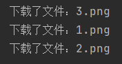


### Runnable接口

**创建子线程**

1. 实现`Runnable`接口
2. 重写`run()`方法
3. 创建实现类对象
4. 使用实现类对象创建线程对象

> 代理
>
> `Thread`类也实现了`Runnable`接口

**开启子线程**

- `start()`方法

 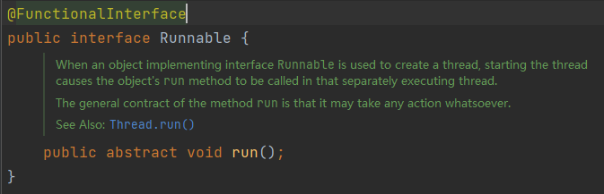

 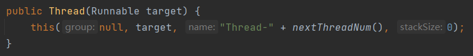

```java
package com.ink.Thread;

public class RunnableTest implements Runnable{
    @Override
    public void run() {
        for (int i = 0; i < 20; i++) {
            System.out.println("子线程执行" + i);
        }
    }

    public static void main(String[] args) {
        RunnableTest runnableTest = new RunnableTest();
//        Thread thread = new Thread(runnableTest);
//        thread.start();
//        创建Tread对象，传入实现类
        new Thread(runnableTest).start();
        
        for (int i = 0; i < 200; i++) {
            System.out.println("主线程执行" + i);
        }
    }
}
```


**比较**

- 继承`Thread`类
  - 子类继承Thread类具备多线程能力
  - 子类对象调用`start()`方法启动线程
  - **不建议使用**
    - 避免OOP**单继承局限性**

- 实现`Runnable`接口
  - 实现接口Runnable具备多线程能力
  - 在Thread构造器中传入目标对象然后调用`start()`方法启动线程
  - **推荐使用**
    - **避免单继承局限性**
    - **方便同一个对象被多个线程共享使用**（适合多个相同线程来处理同一份资源）

### Demo

**买票**

`static void sleep(long millis)`：

- 指定时间为毫秒

- 令当前活动线程在指定时间段内**放弃对CPU控制**
- 使其他线程有机会被执行，时间到后**重新排队**
- 抛出`InterruptedException`异常

```java
package com.ink.Thread;

public class Ticket implements Runnable{
    private int ticketNums = 10;

    @Override
    public void run() {
        while(true){
            if(ticketNums <= 0){
                break;
            }
//            模拟延时
            try {
                Thread.sleep(200);
            } catch (InterruptedException e) {
                e.printStackTrace();
            }
            System.out.println(Thread.currentThread().getName() + "-拿到了第" + ticketNums-- + "张票");
        }
    }

    public static void main(String[] args) {
        Ticket ticket = new Ticket();
        new Thread(ticket,"ink").start();
        new Thread(ticket,"yinke").start();
        new Thread(ticket,"inke").start();
    }
}
```

 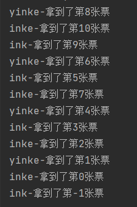

**并发问题**

会发现ink和yinke都拿到了第一张票

**多个线程操作同一资源时，线程不安全**

> 如果没有延时是不会存在买到重复票的


**龟兔赛跑**

```java
package com.ink.Thread;

public class Race implements Runnable{
    public static String winner;
    @Override
    public void run() {
        for (int i = 0; i <= 100; i++) {
            if(Thread.currentThread().getName().equals("ink") && i%10 == 0){
                try {
                    Thread.sleep(10);
                } catch (InterruptedException e) {
                    e.printStackTrace();
                }
            }
            boolean flag = gameOver(i);
            if(flag) {
                break;
            }
            System.out.println(Thread.currentThread().getName() + "跑了" + i + "步");
        }
    }
    private boolean gameOver(int step) {
        if(winner != null) {
            return true;
        }
        if(step >= 100) {
            winner = Thread.currentThread().getName();
            System.out.println("winner is " + winner);
            return true;
        }
        return false;
    }

    public static void main(String[] args) {
        Race race = new Race();
        new Thread(race,"ink").start();
        new Thread(race,"yinke").start();
    }
}
```

 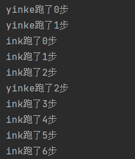

### Callable接口

- 实现`Callable`接口**可以有返回值**
- 重写`call()`方法**可以抛出异常**
- 支持**泛型**的返回值
- 需要借助`FutureTask`类（比如获取返回结果）

> JDK5.0新增的线程创建方式

**创建子线程**

1. 创建目标对象
2. 创建执行服务
3. 提交执行
4. 获取结果
5. 关闭服务

```java
package com.ink.Thread;

import java.util.concurrent.*;

public class CallableTest implements Callable<Boolean> {
    private String url;
    private String name;

    public CallableTest(String url, String name) {
        this.url = url;
        this.name = name;
    }
    
    @Override
    public Boolean call() throws Exception {
        WebDownload webDownload = new WebDownload();
        webDownload.downloader(url,name);
        System.out.println("下载了文件：" + name);
        return true;
    }
    
    public static void main(String[] args) throws ExecutionException, InterruptedException {
        DownloadDemo Test1 = new DownloadDemo("https://www.baidu.com/img/PCfb_5bf082d29588c07f842ccde3f97243ea.png", "11.png");
        DownloadDemo Test2 = new DownloadDemo("https://www.baidu.com/img/PCfb_5bf082d29588c07f842ccde3f97243ea.png", "22.png");
        DownloadDemo Test3 = new DownloadDemo("https://www.baidu.com/img/PCfb_5bf082d29588c07f842ccde3f97243ea.png", "33.png");
        
//        创建执行服务（线程池）
        ExecutorService ser = Executors.newFixedThreadPool(3);
//        提交执行
        Future<Boolean> result1 = (Future<Boolean>) ser.submit(Test1);
        Future<Boolean> result2 = (Future<Boolean>) ser.submit(Test2);
        Future<Boolean> result3 = (Future<Boolean>) ser.submit(Test3);
//        获取结果
        boolean r1 = result1.get();
        boolean r2 = result2.get();
        boolean r3 = result3.get();
//        关闭服务
        ser.shutdownNow();
    }
}
```


## Lambda表达式

一个可传递的简洁的语法定义代码块，可以在将来执行一次或多次

- 避免**匿名内部类**定义过多
- 属于**函数式编程**的概念

> JDK8新特性
>
> 带参数变量的表达式被称为lambda表达式


### 函数式接口

**functional interface**

- 注解
  - `@FunctionalInterface`
  - 放在一个接口前表示这个接口是一个函数式接口
  - 非必须

- 只包含一个抽象方法的接口就是函数式接口（如`Runnable`）
- 函数式接口可以通过Lambda表达式来创建该接口的对象

> Object不是一个函数式接口，不能把lambda表达式赋给类型为Object的变量

### 语法

1. **参数**
   1. 没有参数就用`()`
   2. 可以推导出lambda表达式的**参数类型**时，可以忽略其类型（多个参数也可以）
   3. 如果方法**只有一个参数**且参数类型可以推导出，还可以省略`()`
2. `->`
   1. 箭头操作符
3. **表达式**
   1. 只有一行的lambda表达式可以省略`{}`
4. `{}`：
   1. 如果代码实现无法放在一个lambda表达式中，可以放在`{}`中

> 不需要指出表达式的返回类型，会由上下文推出

`(String f,String s) -> f - s;`       

```java
package com.ink.Lambda;

public class TestLambda {
//    2.静态内部类
//    成员内部类+static
    static class yinke2 implements Ink{
        @Override
        public void lambda(int a) {
            System.out.println("lambda表达式->" + a);
        }
    }
    public static void main(String[] args) {
//        3.局部内部类
//        方法中声明
        class yinke3 implements Ink{
            @Override
            public void lambda(int a) {
                System.out.println("lambda表达式->" + a);
            }
        }
        Ink ink1 = new yinke1();
        ink1.lambda(1);
        Ink ink2 = new yinke2();
        ink2.lambda(2);
        Ink ink3 = new yinke3();
        ink3.lambda(3);

//        4.匿名内部类
//        没有构造器，必须借助接口或者父类的构造器
        new Ink(){
            @Override
            public void lambda(int a) {
                System.out.println("lambda表达式->" + a);
            }
        }.lambda(4);

//        5.lambda简化-1
//        简化构造器和方法名
        Ink ink5 = (int a) -> {
            System.out.println("lambda表达式->" + a);
        };
        ink5.lambda(5);
//        lambda简化-2
//        简化参数类型
        Ink ink6 = (a) -> {
            System.out.println("lambda表达式->" + a);
        };
        ink6.lambda(6);

//        lambda简化-3
//        简化括号()
        Ink ink7 = a -> {
            System.out.println("lambda表达式->" + a);
        };
        ink7.lambda(7);

//        lambda简化-4
//        简化花括号{}
        Ink ink8 = a -> System.out.println("lambda表达式->" + a);
        ink8.lambda(7);
    }
}

//函数式接口
interface Ink{
//    只有一个抽象方法
    void lambda(int a);
}

//1.实现类
class yinke1 implements Ink{
    @Override
    public void lambda(int a) {
        System.out.println("lambda表达式->" + a);
    }
}
```


### 方法引用

传递方法当作参数


### 构造器引用


## 静态代理模式

`StaticProxy`

- 真实对象和代理对象都要实现同一个接口
- 代理对象要代理真实对象 

**优点**

- 真实对象专注于自己的工作
- 代理对象可以做真实对象做不了的工作


`new Thread(runnableTest).start();`和静态代理的关系

```java
package com.ink.Thread;

public class ProxyStaticTest {
    public static void main(String[] args) {
//        真实对象，被代理
        You you = new You();
//        代理对象
        Company company = new Company(you);
//        代理对象执行方法
        company.HappyMarry();
//        简写
        new Company(new You()).HappyMarry();
//        对比线程Thread
        new Thread( ()-> System.out.println("代理实现Runnable接口的对象") ).start();
    }
}

//函数式接口
interface Marry{
    void HappyMarry();
}
//真实对象
class You implements Marry{
    @Override
    public void HappyMarry() {
        System.out.println("真实对象，被代理人-----结婚");
    }
}
class Company implements Marry{
//    接口对象
    private Marry target;

    public Company(Marry target) {
        this.target = target;
    }

    @Override
    public void HappyMarry() {
        before();
        this.target.HappyMarry();
        after();
    }
    
    private void after() {
        System.out.println("婚礼结束");
    }

    private void before() {
        System.out.println("婚礼开始");
    }
}
```


## 线程状态

`Thread.State`

定义了线程的5种状态

1. **创建（NEW）**
   1. 当一个`Thread`类或其子类的对象被声明并创建时，新生的线程对象处于创建状态
2. **就绪（RUNNABLE）**
   1. 处于创建状态的线程被`start()`后将进入线程队列等待CPU时间片
   2. 此时它已具备了运行的条件，只是没分配到CPU资源
3. **运行（BlOCKED）**
   1. 当就绪的线程被调度并获得CPU资源时就进入运行状态
   2. `run()`方法定义了线程的操作和功能
4. **阻塞（WAITING/TIMED_WAITING）**
   1. 在某种特殊情况下，被人为挂起或执行输入输出操作时，让出CPU并临时中止自己的执行，进入阻塞状态
5. **死亡（TERMINATED）**
   1. 线程完成了它的全部工作或线程被提前强制性地中止或出现异常导致结束
   2. 结束后的线程不能再次启动

> 常量
>
> 生命周期：不会一直存在于内存中


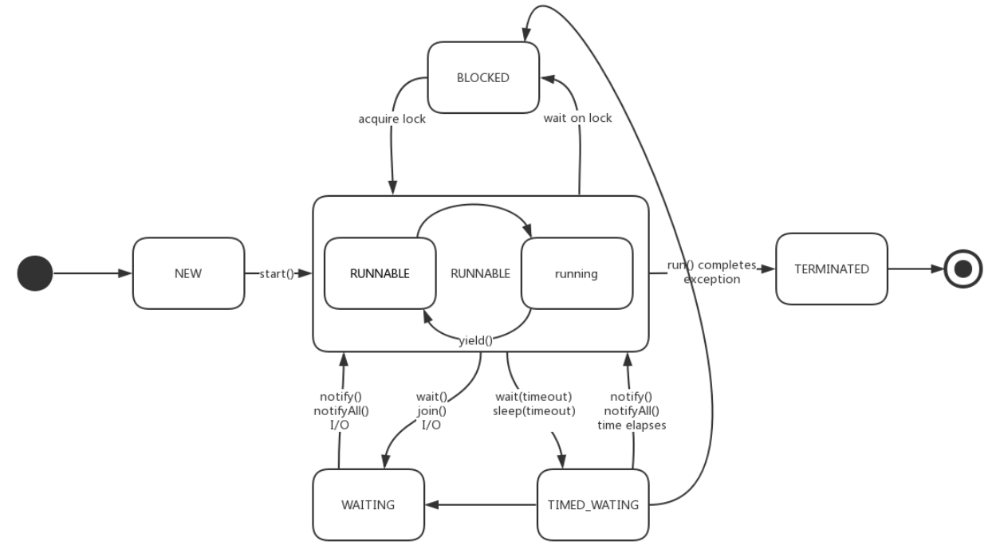

```java
package com.ink.Thread;

/**
 * @author ink
 * @date 2021年08月03日19:50
 */
public class StateTest {
    public static void main(String[] args) throws InterruptedException {
//        Thread类实现了Runnable接口
        Thread thread = new Thread( () -> {
//            线程体
            for (int i = 0; i < 5; i++) {
                try {
                    Thread.sleep(1000);
                } catch (InterruptedException e) {
                    e.printStackTrace();
                }
            }
            System.out.println("结束");
        });
//        查看线程状态
        Thread.State state = thread.getState();
//        NEW
        System.out.println(state);

//        启动线程
        thread.start();
        state = thread.getState();
//        RUNNABLE
        System.out.println(state);

        while (state != Thread.State.TERMINATED){
            Thread.sleep(100);
            state = thread.getState();
            System.out.println(state);
        }
    }
}
```


## 线程方法

- `void start()`：启动线程，并执行对象的`run()`方法 
- `run()`：线程在被调度时执行的操作 
- `String getName()`：返回线程的名称 
- `void setName(String name)`：设置线程名称 
- `static Thread currentThread()`：返回当前线程，在`Thread`子类中就 是`this`，通常用于主线程和`Runnable`接口实现类

> `Thread.currentThread().getName();`获取当前线程的名字

### 线程休眠

`sleep()`

- 指定当前线程阻塞的**毫秒数**
- 时间达到后线程进入**就绪状态**
- 需要抛出`InterruptedException`异常
- 每一个对象都有一个锁，`sleep()`**不会释放锁**
- 可以模拟网络延时，倒计时等（[sleep](#Demo)）

> 模拟网络延时可以放大问题的发生性

```java
package com.ink.Thread;

public class SleepTest implements Runnable{
    private int ticketNums = 10;

    @Override
    public void run() {
        while(true){
            if(ticketNums <= 0){
                break;
            }
//            模拟网络延时
            try {
                Thread.sleep(200);
            } catch (InterruptedException e) {
                e.printStackTrace();
            }
            System.out.println(Thread.currentThread().getName() + "-拿到了第" + ticketNums-- + "张票");
        }
    }

    public static void main(String[] args) {
        SleepTest sleepTest = new SleepTest();
        new Thread(sleepTest,"ink").start();
        new Thread(sleepTest,"yinke").start();
        new Thread(sleepTest,"inke").start();
    }
}
```


### 线程让步

`yield()`

- 暂停当前正在执行的线程，把执行机会让给优先级相同或更高的线程
- 将当前线程从运行状态转为就绪状态（不阻塞）
- 线程让步不一定成功

> 线程让步后，CPU在就绪队列中选择线程执行，有可能还是选择原线程执行，所以线程让步不一定成功

```java
package com.ink.Thread;

public class YieldTest {
    public static void main(String[] args) {
        YieldT yieldT = new YieldT();
        new Thread(yieldT,"yinke").start();
        new Thread(yieldT,"ink").start();
    }
}

class YieldT implements Runnable{

    @Override
    public void run() {
        System.out.println(Thread.currentThread().getName() + "线程开始执行");
        Thread.yield();
        System.out.println(Thread.currentThread().getName() + "线程停止执行");

    }
}
```


### 线程合并

`join()`

- 当某个程序执行流中调用其他线程的`join()`方法时，调用线程将被阻塞，直到`join()`方法加入的线程执行完为止
- 低优先级的线程也可以获得执行

> 相当于插队，其他线程被阻塞

```java
package com.ink.Thread;

public class JoinTest implements Runnable{
    @Override
    public void run() {
        for (int i = 0; i < 200; i++) {
            System.out.println("join VIP线程" + i);
        }
    }

    public static void main(String[] args) throws InterruptedException {
        JoinTest joinTest = new JoinTest();
//        代理
        Thread thread = new Thread(joinTest);
        thread.start();

//        主线程
        for (int i = 0; i < 500; i++) {
            if(i == 100){
//                插队，阻塞主线程
                thread.join();
            }
            System.out.println("main方法主线程" + i);
        }
    }
}
```


### 线程停止

- 不推荐使用JDK提供的`stop()`和`destroy()`方法（已废弃）
- 推荐使用标志位进行终止，**让线程自己停止下来**

```java
package com.ink.Thread;

public class StopTest implements Runnable{
//    设置标志位
    private boolean flag = true;

    @Override
    public void run() {
        int i = 0;
        while(flag) {
            System.out.println("run Thread..." + i);
            i++;
        }
    }
//    设置方法转换标志位
    public void stop(){
        this.flag = false;
    }

    public static void main(String[] args) {
        StopTest stopTest = new StopTest();
        new Thread(stopTest).start();
        for (int i = 0; i < 1000; i++) {
            System.out.println("main线程" + i);
            if(i == 900) {
//                转换标志位，停止线程
                stopTest.stop();
                System.out.println("线程停止了");
            }
        }
    }
}
```


## 线程优先级

Java提供一个**线程调度器**来监控程序中启动后进入**就绪状态**的所有线程，线程调度器按照**优先级**决定应该调度哪个线程来执行

**低优先级只是获得调度的概率低，并非一定是在高优先级线程之后才被调用**

线程的优先级用数字表示（范围1~10）

- `Thread.MIN_PRIORITY=1;`
- `Thread.MAX_PRIORITY=10;`
- `Thread.NORM_PRIORITY=5;`

**方法**

- 获取线程优先级
  - `getPriority()`
- 改变线程优先级
  - `setPriority(int newPriority)`
  - 超过范围（1~10）会抛出`IllegalArgumentException`异常

> 子线程被创建时继承父线程的优先级
>
> 先设置优先级，再`start()`启动

```java
package com.ink.Thread;

public class PriorityTest implements Runnable{
    @Override
    public void run() {
        System.out.println("当前线程"+Thread.currentThread().getName() +"优先级为"+ Thread.currentThread().getPriority());
    }

    public static void main(String[] args) {
//        主线程默认优先级
        System.out.println("主线程"+Thread.currentThread().getName() +"优先级为"+ Thread.currentThread().getPriority());

        PriorityTest priorityTest = new PriorityTest();

        Thread thread01 = new Thread(priorityTest,"01");
        Thread thread02 = new Thread(priorityTest,"02");
        Thread thread03 = new Thread(priorityTest,"03");
        Thread thread04 = new Thread(priorityTest,"04");
        Thread thread05 = new Thread(priorityTest,"05");
        Thread thread06 = new Thread(priorityTest,"06");

        thread01.start();
//        10
        thread02.setPriority(Thread.MAX_PRIORITY);
        thread02.start();

        thread03.setPriority(6);
        thread03.start();

        thread04.setPriority(5);
        thread04.start();
//        IllegalArgumentException
        thread05.setPriority(-1);
        thread05.start();

        thread05.setPriority(11);
        thread05.start();
    }
}
```


## 线程分类

Java中的线程分为两类

- **用户线程**
  - `main()`主线程
- 守护线程
  - 守护线程是用来服务用户线程的
  - 在`start()`方法前调用`thread.setDaemon(true)`可以**把一个用户线程变成一个守护线程**

> Java垃圾回收`gc()`线程就是一个典型的守护线程
>
> 正常的线程都是用户线程，`thread.setDaemon()`默认是`false`

**区别**

判断JVM何时退出

- JVM必须确保**用户线程**执行完毕
- JVM不用等待**守护线程**执行完毕

> 若JVM中都是守护线程，当前JVM将退出

```java
package com.ink.Thread;

public class DaemonTest {
    public static void main(String[] args) {
        God god = new God();
        You you = new You();
//        正常的线程都是用户线程
        Thread thread = new Thread(god);
//        设置为守护线程
        thread.setDaemon(true);

        thread.start();
        new Thread(you).start();
    }
}
class God implements Runnable{
    @Override
    public void run() {
        while (true){
            System.out.println("守护线程存在...");
        }
    }
}

class You implements Runnable{
    @Override
    public void run() {
        for (int i = 0; i < 365; i++) {
            System.out.println("用户线程存在...");
        }
        System.out.println("用户线程结束");
    }
}
```


## 线程同步

**线程同步其实就是一种等待机制**

- 处理多线程问题时，多个线程访问同一个对象，如果某些线程想修改这个对象，就需要线程同步

- 需要同时访问此对象的线程进入这个**对象的等待池**形成队列，等待前面线程使用完毕，下一个线程再使用


### 线程不安全

**原因**

多条语句在操作同一个线程共享数据时，**一个线程对多条语句只执行了一部分，还没有执行完**，另一个线程参与进来执行。导致共享数据出现错误

> `ArrayList`是线程不安全的 [List接口](#List接口)

**车站买票**

```java
package com.ink.Thread;

public class SafeTicket {
    public static void main(String[] args) {
        BuyTicket buyTicket = new BuyTicket();
        new Thread(buyTicket,"ink").start();
        new Thread(buyTicket,"yinke").start();
        new Thread(buyTicket,"inke").start();
    }
}

class BuyTicket implements Runnable{
    private int ticketNums = 10;
    boolean flag = true;

    @Override
    public void run() {
        while(flag){
            try {
                buy();
            } catch (Exception e) {
                e.printStackTrace();
            }
        }
    }
    private void buy() throws InterruptedException {
        if(ticketNums <= 0){
            flag = false;
            return ;
        }
//        模拟延时
        Thread.sleep(1000);
        System.out.println(Thread.currentThread().getName() + "拿到" + ticketNums + "张票");
        ticketNums--;
    }
}
```

**银行取钱**

```java
package com.ink.Thread;

public class BankTest {
    public static void main(String[] args) {
        Account ink = new Account("ink", 100);
        Bank you = new Bank(ink, 50, "你");
        Bank girl = new Bank(ink, 100, "对象");
        you.start();
        girl.start();
    }
}

class Account extends Thread{
    String name;
    int money;

    public Account(String name, int money) {
        this.name = name;
        this.money = money;
    }
}

class Bank extends Thread{
    Account account;
    int drawingMoney;
    int nowMoney;
    public Bank(Account account,int drawingMoney, String name){
//        子类通过super调用父类的构造器时，必须放在第一位
//        调用Thread的构造器，传入name
        super(name);
        this.account = account;
        this.drawingMoney = drawingMoney;

    }

    @Override
    public void run() {
        if(account.money - drawingMoney < 0){
            System.out.println(Thread.currentThread().getName() + "存款不够，无法取钱");
            return;
        }
        try {
            Thread.sleep(1000);
        } catch (InterruptedException e) {
            e.printStackTrace();
        }
        account.money -= drawingMoney;
        nowMoney += drawingMoney;
        System.out.println(account.name + "账户余额为：" + account.money);
//        this.getName() = Thread.currentThread().getName();
//        Bank继承了Thread，所以也可以使用this
        System.out.println(Thread.currentThread().getName() + "手里的余额为：" + nowMoney);
    }
}
```


### 锁机制 

**同步监视器**：俗称**锁**

为了保证共享资源在方法中被访问时的正确性，在访问时加入锁机制

- 必须确保使用同一个资源的多个线程**共用一把锁**，否则就无法保证共享资源的安全
- 当一个线程获得**对象的排它锁**，独占资源，其他线程必须等待
- **任意一个类的对象都可以作为锁**
- 所有对象都自动含有**单一的锁**

> 对于并发工作，你需要某种方式来防止两个任务访问相同的资源（共享资源竞争）。 防止这种冲突的方法就是当资源被一个任务使用时，在其上加锁。第一个访问某项资源的任务必须锁定这项资源，使其他任务在其被解锁之前就无法访问它了，而在其被解锁之时，另一个任务就可以锁定并使用它了

**存在问题**

- 一个线程持有锁会导致**其他所有需要此锁的线程挂起**
- 在多线程竞争下，加锁，释放锁会导致比较多的**上下文切换和调度延时**，引起性能问题
- 如果一个优先级高的线程等待一个优先级低的线程释放锁会导致**优先级倒置**，引起性能问题


### 同步方法

针对**方法**
- 同步方法
- 同步代码块

> 数据对象可以通过`private`关键字来保证只能被方法访问

**同步方法**

`public synchronized void method(int args){}`

- `synchronized`关键字控制**对象**对方法的访问，**每个对象对应一把锁**
- 每个`synchronized`方法都必须获得**调用该方法的对象的锁**才能执行，否则线程会阻塞
- 方法一旦执行就独占该锁，直到该方法返回才释放，后面被阻塞的线程才能获得这个锁，继续执行
- **同步方法的锁**：一个线程类中
  - 所有**静态方法**共用同一把锁（`类名.class`）
  - 所有**非静态方法**共用同一把锁（`this`）

**缺陷**

将整个方法申明为`synchronized`会**影响效率**（锁的太多）

```java
package com.ink.Thread;

public class SafeTicket {
    public static void main(String[] args) {
        BuyTicket buyTicket = new BuyTicket();
        new Thread(buyTicket,"ink").start();
        new Thread(buyTicket,"yinke").start();
        new Thread(buyTicket,"inke").start();
    }
}

class BuyTicket implements Runnable{
    private int ticketNums = 10;
    boolean flag = true;

    @Override
    public void run() {
        while(flag){
            try {
                buy();
            } catch (Exception e) {
                e.printStackTrace();
            }
        }
    }
//    同步方法
//    锁的是this（默认）
    private synchronized void buy() throws InterruptedException {
        if(ticketNums <= 0){
            flag = false;
            return ;
        }
//        模拟延时
        Thread.sleep(1000);
        System.out.println(Thread.currentThread().getName() + "拿到" + ticketNums + "张票");
        ticketNums--;
    }
}
```


**同步代码块**

`synchronized (同步监视器){// 需要被同步的代码;}`

- 同步代码块的`同步监视器`可以是任何对象，推荐使用共享资源作为**同步监视器**
- 需要被同步的代码就是操作共享数据的代码
- 操作同步代码时只能有一个线程参与，相当于是一个单线程的过程

> 同步方法中无需指定同步监视器，因为同步方法的同步监视器就是`this` 对象本身，或者是`class`

```java
package com.ink.Thread;

public class BankTest {
    public static void main(String[] args) {
        Account ink = new Account("ink", 100);
        Bank you = new Bank(ink, 50, "你");
        Bank girl = new Bank(ink, 100, "对象");
        you.start();
        girl.start();
    }
}

class Account extends Thread{
    String name;
    int money;

    public Account(String name, int money) {
        this.name = name;
        this.money = money;
    }
}

class Bank extends Thread{
    Account account;
    int drawingMoney;
    int nowMoney;
    public Bank(Account account,int drawingMoney, String name){
//        子类通过super调用父类的构造器时，必须放在第一位
//        调用Thread的构造器，传入name
        super(name);
        this.account = account;
        this.drawingMoney = drawingMoney;
    }

    @Override
    public void run() {
//        锁的对象就是变化的量（增删改）
        synchronized (account) {
            if(account.money - drawingMoney < 0){
                System.out.println(Thread.currentThread().getName() + "存款不够，无法取钱");
                return;
            }
            try {
                Thread.sleep(1000);
            } catch (InterruptedException e) {
                e.printStackTrace();
            }
            account.money -= drawingMoney;
            nowMoney += drawingMoney;
            System.out.println(account.name + "账户余额为：" + account.money);
//        this.getName() = Thread.currentThread().getName();
//        Bank继承了Thread，所以也可以使用this
            System.out.println(Thread.currentThread().getName() + "手里的余额为：" + nowMoney);
        }
    }
}
```


### 同步范围

**代码是否存在线程安全问题**

- 明确哪些代码是多线程运行的代码
- 明确多个线程是否有共享数据
- 明确多线程运行代码中是否有多条语句操作共享数据

**解决**

对多条操作共享数据的语句，只能让一个线程都执行完。在执行过程中其他线程不可以参与执行，即所有操作共享数据的这些语句都要放在同步范围中

> 范围太小：没锁住所有有安全问题的代码
>
> 范围太大：没发挥多线程的功能


### 锁的释放

**释放锁的操作**

- 当前线程的同步方法、同步代码块执行结束
- 当前线程在同步代码块、同步方法中遇到`break`、`return`终止了该代码块、 该方法的继续执行
- 当前线程在同步代码块、同步方法中出现了未处理的`Error`或`Exception`，导致异常结束
- 当前线程在同步代码块、同步方法中执行了线程对象的`wait()`方法，当前线程暂停并释放锁

**不会释放锁的操作**

- 线程执行同步代码块或同步方法时，程序调用`Thread.sleep()`、 `Thread.yield()`方法暂停当前线程的执行
- 线程执行同步代码块时，其他线程调用了该线程的`suspend()`方法将该线程挂起，该线程不会释放锁（同步监视器）

> 尽量避免使用`suspend()`和`resume()`来控制线程


## 死锁

`DeadLock`

多个线程各自占有一些共享资源，并且互相等待其他线程占有的资源才能运行，而导致两个或者多个线程都在等待对方释放资源，都停止执行的情形

某一个同步块**同时拥两个以上对象的锁**时，就可能会发生死锁问题

> 出现死锁后，不会出现异常，不会出现提示，只是所有的线程都处于阻塞状态，无法继续

产生死锁的四个**必要条件**：

- **互斥条件**：一个资源每次只能被一个进程使用
- **请求与保持条件**：一个进程因请求资源而阻塞时，对已获得的资源保持不放
- **不剥夺条件**：进程已获得的资源，在未使用完之前，不能强行剥夺
- **循环等待条件**：若干进程之间形成一种头尾相接的循环等待资源关系

> 上述四个条件，只要破坏其任意一个就可避免死锁的发生

```java
package com.ink.Thread;

public class DeadLock {
    public static void main(String[] args) {
        Makeup hu1 = new Makeup(0, "hu1");
        Makeup hu2 = new Makeup(1, "hu2");
        hu1.start();
        hu2.start();
    }
}

class Mirror1{

}

class Lipstick{

}
class Makeup extends Thread{
//    保证需要的资源只有一份
    static Lipstick lipstick = new Lipstick();
    static Mirror1 mirror = new Mirror1();

    int choice;
    String girlName;

    public Makeup(int choice, String girlName) {
        this.choice = choice;
        this.girlName = girlName;
    }

    @Override
    public void run() {
        try {
            makeup();
        } catch (InterruptedException e) {
            e.printStackTrace();
        }
    }

    private void makeup() throws InterruptedException {
        if(choice == 0){
            synchronized (lipstick) {
                System.out.println(this.girlName + "获得口红的锁");

                Thread.sleep(1000);
                synchronized (mirror) {
                    System.out.println(this.girlName + "获得镜子的锁");
                }
            }
        }
        else {
            synchronized (mirror) {
                System.out.println(this.girlName + "获得镜子的锁");

                Thread.sleep(1000);
                synchronized (lipstick) {
                    System.out.println(this.girlName + "获得口红的锁");
                }
            }
        }
    }
}
```

**解决方法**

避免锁的嵌套

```java
package com.ink.Thread;

public class DeadLock {
    public static void main(String[] args) {
        Makeup hu1 = new Makeup(0, "hu1");
        Makeup hu2 = new Makeup(1, "hu2");
        hu1.start();
        hu2.start();
    }
}

class Mirror1{

}

class Lipstick{

}
class Makeup extends Thread{
//    保证需要的资源只有一份
    static Lipstick lipstick = new Lipstick();
    static Mirror1 mirror = new Mirror1();

    int choice;
    String girlName;

    public Makeup(int choice, String girlName) {
        this.choice = choice;
        this.girlName = girlName;
    }

    @Override
    public void run() {
        try {
            makeup();
        } catch (InterruptedException e) {
            e.printStackTrace();
        }
    }

    private void makeup() throws InterruptedException {
        if(choice == 0){
            synchronized (lipstick) {
                System.out.println(this.girlName + "获得口红的锁");

                Thread.sleep(1000);
            }
            synchronized (mirror) {
                System.out.println(this.girlName + "获得镜子的锁");
            }
        }
        else {
            synchronized (mirror) {
                System.out.println(this.girlName + "获得镜子的锁");
                Thread.sleep(1000);
            }
            synchronized (lipstick) {
                System.out.println(this.girlName + "获得口红的锁");
            }
        }
    }
}
```


## Lock锁

从JDK5开始，Java提供了更强大的线程同步机制

- 通过**显示定义同步锁对象**来实现同步，同步锁使用**Lock对象**充当
- `java.util.concurrent.locks.Lock`接口是控制多个线程对共享资源进行访问的工具
- 锁提供了对共享资源的独占访问，每次只能有一个线程对**Lock对象**加锁，线程开始访问共享资源之前应**先获得Lock对象**
- `ReentrantLock`类实现了Lock，它拥有与`synchronized`**相同的并发性和内存语义**
- 在实现线程安全的控制中，比较常用的是ReentrantLock，可以显示加锁、释放锁


**Lock和synchronized对比**

- **Lock是显示锁**（手动开启和关闭），synchronized是隐式锁（出了作用域自动释放）
- **Lock只有代码加锁**，synchronized有代码块锁和方法锁
- 使用Lock锁，**JVM将花费较少的时间来调度线程，性能更好，并具有更好的扩展性**（提供更多的子类）
- **优先使用顺序**：Lock > 同步代码块（已经进入了方法体，分配了相应资源）> 同步方法（在方法体之外）


**可重入锁**

`ReentrantLock`

> 如果同步代码有异常，要将`unlock()`写入`finally`语句块

```java
class A{
//    定义Lock锁
    private final ReentrantLock lock = new ReentrantLock();
    public void n() {
//        加锁
        lock.lock();
            try {
                // 保证线程安全的代码
            } finally {
//                解锁
                lock.unlock();
            }
        }
    }
}
```

```java
package com.ink.Thread;

import java.util.concurrent.locks.ReentrantLock;

public class TestLock {
    public static void main(String[] args) {
        LockTest lockTest = new LockTest();
        new Thread(lockTest,"ink").start();
        new Thread(lockTest,"yinke").start();
        new Thread(lockTest,"inke").start();
    }
}

class LockTest implements Runnable{

    private int ticketNums = 10;

//    定义Lock锁
    private final ReentrantLock lock = new ReentrantLock();

    @Override
    public void run() {
        while(true){
            try {
//            加锁
                lock.lock();
                if(ticketNums > 0){
                    try {
                        Thread.sleep(1000);
                    } catch (InterruptedException e) {
                        e.printStackTrace();
                    }
                    System.out.println(Thread.currentThread().getName() + "拿到" +ticketNums--);
                }
                else {
                    break;
                }
            } finally {
//                解锁
                lock.unlock();
            }
        }
    }
}
```


## 线程通信

### 生产者消费者

一个线程同步问题

- 生产者和消费者**共享同一个资源**
- 生产者和消费者之间**相互依赖，互为条件**


在生产者消费者问题中，仅有`synchronized`是不够的，`synchronized`实现了同步，但不能用来实现**不同线程之间的消息传递**（通信）

- 生产者：
  - 没生产产品之前要通知消费者等待
  - 生产产品之后通知消费者消费
- 消费者
  - 消费后要通知生产者已经结束消费，需要生产新的产品以供消费

**问题**

- 生产者比消费者快时，消费者会漏掉一些数据没有取到
- 消费者比生产者快时，消费者会取到相同的数据


### 通信方法

都是`Object`类的方法

- `wait()`
  - **调用方法的必要条件**：当前线程必须具有对该对象的**监控权（加锁）**
  - 在当前线程中调用，让当前线程挂起并放弃CPU、同步资源并等待，让别的线程可访问并修改共享资源
  - 调用此方法后，当前线程将**释放对象监控权（锁）** ，然后进入等待
  - 当前线程**排队等候**其他线程调用`notify()`或`notifyAll()`方法唤醒，唤醒后**等待重新获得对监视器的所有权**后才能**从断点处**继续执行
- `notify()`
  - **调用方法的必要条件**：当前线程必须具有对该对象的**监控权（加锁）**
  - 唤醒正在排队等待同步资源的线程中**优先级最高者**
- `notifyAll()`
  - **调用方法的必要条件**：当前线程必须具有对该对象的**监控权（加锁）**
  - 唤醒正在排队等待资源的所有线程

> 这三个方法只能在**同步方法**或者**同步方法块**中使用，否则会抛出`IllegalMonitorStateException`异常
>
> 因为这三个方法必须有**锁对象**调用，而任意对象都可以作为`synchronized`的同步锁， 因此这三个方法只能在`Object`类中声明


### 管程法

**利用缓冲区**

**存在问题**

`wait()`表示持有对象锁的线程准备释放对象锁权限和让出cpu资源进入等待状态。如果有多个消费者，比如X1，X2，X3，假如此时X1，X2，X3都处于等待状态，这时容量为0生产者拿到锁，生产者生产了一个产品让出锁，X1拿到锁消费完之后容量又为0，然后X1释放锁并`notifyAll()`通知JVM去唤醒所有竞争缓冲区对象锁的线程，如果这个锁被X2拿到，那么就会导致**数组下标越界的问题**

**解决方案**

把消费的`if`判断换成`while`，让消费者线程被唤醒的时候不立刻执行下面的代码，而是再去判断当前容量

> `println`应该放在`pop()`和`push()`方法体里面，因为可能正要打印的时候线程切换了，要保证增改操作和打印是原子操作

```java
package com.ink.Thread;

public class TestPC {
    public static void main(String[] args) {
        SynContainer synContainer = new SynContainer();
//        只适用于一个生产者一个消费者的情况
        new Productor(synContainer).start();
        new Consumer(synContainer).start();
    }
}

//生产者
class Productor extends Thread{
    SynContainer container;

    public Productor(SynContainer container) {
        this.container = container;
    }
//    生产
    @Override
    public void run() {
        for (int i = 0; i < 100; i++) {
            container.push(new Chicken(i));
            System.out.println("生产了第" + i + "只鸡");
        }
    }
}

//消费者
class Consumer extends Thread{
    SynContainer container;

    public Consumer(SynContainer container) {
        this.container = container;
    }

    @Override
    public void run() {
        for (int i = 0; i < 100; i++) {
            System.out.println("消费了第" + container.pop().id + "只鸡");
        }
    }
}
//产品
class Chicken{
    int id;
    public Chicken(int id) {
        this.id = id;
    }
}

//缓冲区
class SynContainer {
//    容器大小
    Chicken[] chickens = new Chicken[10];
//    容器计数器
    int count = 0;
//    生产者生产产品
    public synchronized void push(Chicken chicken){
//        如果容器满了,就需要通知消费者,并等待消费者消费
        if(count == chickens.length){
            try {
                this.wait();
            } catch (InterruptedException e) {
                e.printStackTrace();
            }
        }
//        如果容器没有满,就需要生产产品,并通知消费者消费
        chickens[count++] = chicken;
        this.notifyAll();
    }


//    消费者消费产品
    public synchronized Chicken pop(){
//        如果容器空了,就需要通知生产者,并等待生产者生产
        if(count == 0){
            try {
//                释放对象锁权限,让出CPU,唯一的生产者重新拿到锁权限进行生产
                this.wait();
            } catch (InterruptedException e) {
//                TODO Auto-generated catch block
                e.printStackTrace();
            }
        }

//        如果容器非空,就需要消费产品,并通知生产者生产产品
//        count需要先减少才能得到有产品的位置,因为生产者放完后count会++
        count--;
        Chicken chicken = chickens[count];
        this.notifyAll();
        return chicken;
    }
}
```


### 信号量法

**利用标志位**

```java
package com.ink.Thread;

public class TestPC2 {
    public static void main(String[] args) {
        Tv tv = new Tv();
        new Player(tv).start();
        new Wathcher(tv).start();
    }
}

class Player extends Thread{
    Tv tv;

    public Player(Tv tv) {
        this.tv = tv;
    }

    @Override
    public void run() {
        for (int i = 0; i < 20; i++) {
            if(i%2==0){
                this.tv.play("buaa");
            }else{
                this.tv.play("neau");
            }
        }
    }
}

class Wathcher extends Thread{
    Tv tv;
    public Wathcher(Tv tv){
        this.tv = tv;
    }

    @Override
    public void run() {
        for (int i = 0; i < 20; i++) {
            tv.watch();
        }
    }
}

class Tv{
//    表演节目
    String voice;
//    标志位
//    演员表演,观众等待  T
//    观众观看,演员等待  F
    boolean flag = true;

//    表演
    public synchronized void play(String voice){
        if(!flag){
//            观众观看,演员等待
            try {
                this.wait();
            } catch (InterruptedException e) {
                e.printStackTrace();
            }
        }
        System.out.println("演员表演 : " + voice);
//        通知唤醒
        this.notifyAll();
        this.voice = voice;
//        修改标志位
        this.flag = !flag;
    }

//    观看
    public synchronized void watch(){
        if (flag){
//            演员表演,观众等待
            try {
                this.wait();
            } catch (InterruptedException e) {
                e.printStackTrace();
            }
        }
        System.out.println("观众观看 : " + voice);
//        通知唤醒
        this.notifyAll();
//        修改标志位
        this.flag = !this.flag;
    }
}
```


## 线程池

**背景**

经常创建和销毁、使用量特别大的资源，比如并发情况下的线程， 对性能影响很大

**方法**

**提前创建好多个线程放入线程池中**，使用时直接获取，使用完放回线程池中。可以避免频繁创建销毁、实现重复利用

**优点**

- 提高响应速度（减少了创建新线程的时间）
- 降低资源消耗（重复利用线程池中线程，不需要每次都创建）
- 便于线程管理
  - `corePoolSize`：核心池的大小
  - `maximumPoolSize`：最大线程数
  - `keepAliveTime`：线程没有任务时最多保持多长时间后会终止

> JDK5.0新增的线程创建方式

### ExecutorService

真正的**线程池接口**：`public interface ExecutorService extends Executor`

常见子类：`ThreadPoolExecutor`

- `void execute(Runnable command)`：执行任务/命令，没有返回值，一般用来执行`Runnable`
- `<T>Future<T> submit(Callable<T> task)`：执行任务，有返回值，一般用来执行`Callable`
- `void shutdown()`：关闭连接池

### Executors

工具类、线程池的工厂类，用于**创建并返回不同类型的线程池** 

- `Executors.newCachedThreadPool()`：创建一个可根据需要创建新线程的线程池 
- `Executors.newFixedThreadPool(n)`：创建一个可重用的固定线程数的线程池 
- `Executors.newSingleThreadExecutor()`：创建一个只有一个线程的线程池 
- `Executors.newScheduledThreadPool(n)`：创建一个线程池，可以在给定延迟后运行命令或者定期地执行

```java
package com.ink.Thread;

import java.util.concurrent.ExecutorService;
import java.util.concurrent.Executors;

public class PoolTest {
    public static void main(String[] args) {
//        1.创建服务,创建线程池
        ExecutorService service = Executors.newFixedThreadPool(10);
//        执行
        service.execute(new MyThread());
        service.execute(new MyThread());
        service.execute(new MyThread());
        service.execute(new MyThread());

//        2.关闭连接
        service.shutdown();
    }
}
class MyThread implements Runnable{
    @Override
    public void run() {
        System.out.println(Thread.currentThread().getName());
    }
}
```


# 网络编程

套接字编程

**目的**

- 数据交换、通信


**实现**

- 需要准确定位到网络上的一台主机（IP、端口、资源），然后进行通信


> 与Javaweb网页编程的B/S架构不同，**网络编程是C/S编程**（TCP/IP）

**网络通信**

- 通信双方的地址
  - ip：port
- 通信的协议（规则）
  - TCP/IP
  - OSI

> 传输层：TCP/UDP

## IP地址

- 127.0.0.1：`localhost` 本机

- IPV4：32位，4个字节
- IPV6：128位，8个无符号整数

> 42亿多IPV4的地址，30亿都在北美，亚洲只有4亿


### 域名

`host`

- `C:\Windows\System32\drivers\etc\hosts`文件

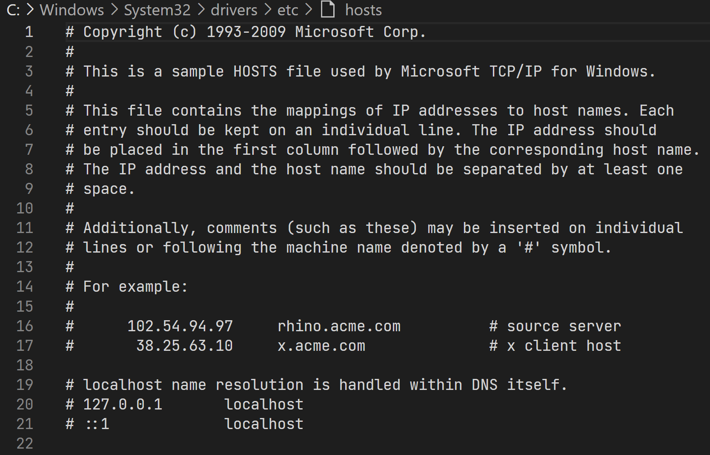


### InetAdress类

`java.net.InetAddress`

- **没有构造器**
  - 无法`new`类的实例
- **没有字段**

- 只能通过类中的`static`**静态方法**返回该类的对象


```java
package com.ink.Network;

import java.net.InetAddress;
import java.net.UnknownHostException;

public class InetAddressTest {
    public static void main(String[] args) {
        try {
//            获取本机地址
            InetAddress inetAddress1 = InetAddress.getByName("127.0.0.1");
            InetAddress inetAddress2 = InetAddress.getByName("localhost");
            InetAddress inetAddress3 = InetAddress.getLocalHost();
            System.out.println(inetAddress1);
            System.out.println(inetAddress2);
            System.out.println(inetAddress3);

//            获取网站ip地址
            InetAddress inetAddress4 = InetAddress.getByName("www.baidu.com");
            System.out.println(inetAddress4);

        } catch (UnknownHostException e) {
            e.printStackTrace();
        }
    }
}
```

 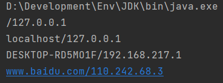

## 端口

表示计算机上的一个程序的进程

- 不同的进程有不同的端口号，用来区分软件
- 端口号范围：0~65535

**端口分类**

- 公有端口：0~1023

  - HTTP：80
  - HTTPS：443
  - FTP：21
  - Telent：23

- 程序注册端口：1024~49151
  - Tomcat：8080
  - MySQL：3306
  - Oracle：1521

- 动态端口：49152~65535

**windows查看端口**

```bash
# 查看所有端口
netstat -ano

# 查找指定端口
netstat -ano | findstr "8080"

# 查找指定端口对应的进程
tasklist | findste "8696"
```


### InetSocketAddress类

**构造器**

- `public InetSocketAddress(InetAddress addr, int port)`

```java
package com.ink.Network;

import java.net.InetAddress;
import java.net.InetSocketAddress;

public class InetSocketAddressTest {
    public static void main(String[] args) {
        InetSocketAddress inetSocketAddress1 = new InetSocketAddress("127.0.0.1", 12345);
        InetSocketAddress inetSocketAddress2 = new InetSocketAddress("localhost", 12345);
        System.out.println(inetSocketAddress1);
        System.out.println(inetSocketAddress2);
        InetAddress address = inetSocketAddress1.getAddress();
        String hostName = inetSocketAddress1.getHostName();
        int port = inetSocketAddress1.getPort();
        System.out.println(address);
        System.out.println(hostName);
        System.out.println(port);
    }
}
```


## 通信协议

**网络通信协议**

- 速率
- 传输码率
- 代码结构
- 传输控制

**TCP/IP协议簇**

- TCP：用户传输协议
- UDP：用户数据报协议
- IP：网络互连协议

### TCP/UDP

- **TCP**
  - 有连接、稳定
  - **三次握手、四次挥手**
  - 客户端与服务端
  - 传输需要释放、效率低
- **UDP**
  - 无连接、不稳定
  - 客户端服务端无明确界限
  - 无需准备 
  - DDOS洪泛攻击

## TCP实现通信

**服务端**

1. 通过`ServerSocket`建立服务的端口
2. 通过`accept()`监听客户端的socket连接
   1. `accept()`阻塞式监听，一直等待客户端连接
3. 使用**字节流**读取客户端发送的消息

**客户端**

1. 获取服务端的ip:port
2. 创建`socket`连接，连接服务端
3. 使用**字节流**向服务端发送消息

### Socket类

```java
package com.ink.Network;

import java.io.IOException;
import java.io.OutputStream;
import java.net.InetAddress;
import java.net.Socket;

public class TCPClientTest {
//    客户端
    public static void main(String[] args) {
        Socket socket = null;
        OutputStream os = null;
        try {
//        获取服务端的IP:PORT
            InetAddress serverIp = InetAddress.getByName("127.0.0.1");
            int port = 12345;
//            创建socket连接
            socket = new Socket(serverIp,port);
//            使用字节流发送信息
            os = socket.getOutputStream();
//            String的getBytes()方法
            os.write("客户端通过TCP连接向服务端发送消息".getBytes());
        } catch (IOException e) {
            e.printStackTrace();
        } finally {
//            关闭资源
            if(os != null){
                try {
                    os.close();
                } catch (IOException e) {
                    e.printStackTrace();
                }
            }
            if(socket != null){
                try {
                    socket.close();
                } catch (IOException e) {
                    e.printStackTrace();
                }
            }
        }

    }
}
```

### ServerSocket类

```java
package com.ink.Network;

import java.io.ByteArrayOutputStream;
import java.io.IOException;
import java.io.InputStream;
import java.net.ServerSocket;
import java.net.Socket;

public class TCPServerTest {
//    服务端
    public static void main(String[] args) {
        ServerSocket serversocket = null;
        Socket accept = null;
        InputStream is = null;
        ByteArrayOutputStream baos = null;
        try {
//            服务端地址
            serversocket = new ServerSocket(12345);
//            监听客户端连接，accept即客户端创建的socket
            accept = serversocket.accept();
//            使用字节流读取客户端的消息
            is = accept.getInputStream();
//            直接读入数据存在问题
//            如果读入的是中文信息，并且最后长度超过数组长度，就会乱码
//            所以需要用管道流包装一下
//            byte[] buffer = new byte[1024];
//            int len;
//            while((len = is.read(buffer)) != -1){
//                String msg = new String(buffer, 0, len);
//                System.out.println(msg);
//            }
//            管道流包装
            baos = new ByteArrayOutputStream();
            byte[] buffer = new byte[1024];
            int len;
            while((len = is.read(buffer)) != -1){
                baos.write(buffer,0,len);
            }
//            避免乱码
            System.out.println(baos);
        } catch (IOException e) {
            e.printStackTrace();
        } finally {
//            关闭i资源
            if(baos != null){
                try {
                    baos.close();
                } catch (IOException e) {
                    e.printStackTrace();
                }
            }
            if(is != null){
                try {
                    is.close();
                } catch (IOException e) {
                    e.printStackTrace();
                }
            }
            if(accept != null){
                try {
                    accept.close();
                } catch (IOException e) {
                    e.printStackTrace();
                }
            }
            if(serversocket != null){
                try {
                    serversocket.close();
                } catch (IOException e) {
                    e.printStackTrace();
                }
            }
        }
    }
}
```

通信结果

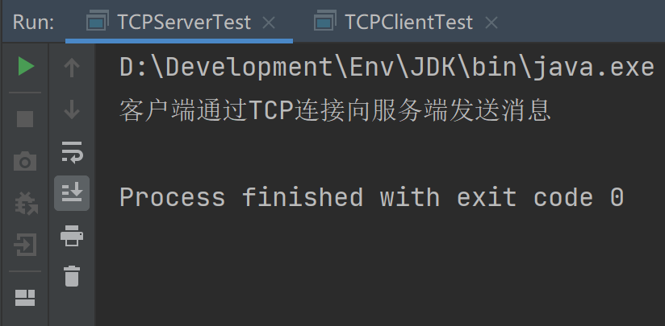

## TCP实现文件上传

服务端

```java
package com.ink.Network;

import java.io.File;
import java.io.FileOutputStream;
import java.io.IOException;
import java.io.InputStream;
import java.net.ServerSocket;
import java.net.Socket;

public class UploadFileServerTest {
    public static void main(String[] args) throws IOException {
//        创建服务端口
        ServerSocket serverSocket = new ServerSocket(9000);
//        监听客户端的连接
        Socket accept = serverSocket.accept();
//        获取输入流
        InputStream is = accept.getInputStream();
//        输出文件，跟src同级
        FileOutputStream fos = new FileOutputStream(new File("receive.txt"));
        byte[] buffer = new byte[1024];
        int len;
        while((len = is.read(buffer)) != -1){
            fos.write(buffer,0,len);
        }
//        关闭资源
        fos.close();
        is.close();
        accept.close();
    }
}
```

客户端

```java
package com.ink.Network;

import java.io.File;
import java.io.FileInputStream;
import java.io.OutputStream;
import java.net.InetAddress;
import java.net.Socket;

public class UploadFileClientTest {
    public static void main(String[] args) throws Exception {
//        创建socket连接
        Socket socket = new Socket(InetAddress.getByName("127.0.0.1"), 9000);
//        创建输出流
        OutputStream os = socket.getOutputStream();
//        用文件流读取文件，文件的相对路径是相对项目javase下的，和src同级
        FileInputStream fis = new FileInputStream(new File("ink.txt"));
//        写出文件
        byte[] buffer = new byte[1024];
        int len;
        while((len = fis.read(buffer))!= -1){
            os.write(buffer,0,len);
        }
//        关闭资源
        fis.close();
        os.close();
        socket.close();
    }
}
```


**通信缺陷**

1. 客户端上传完毕后需要通知服务端
2. 服务端在接收完成后通知客户端断开连接
3. 客户端在确认服务端接收完成后断开连接

服务端

```java
package com.ink.Network;

import java.io.*;
import java.net.ServerSocket;
import java.net.Socket;

public class UploadFileServerTest {
    public static void main(String[] args) throws IOException {
//        创建服务端口
        ServerSocket serverSocket = new ServerSocket(9000);
//        监听客户端的连接
        Socket accept = serverSocket.accept();
//        获取输入流
        InputStream is = accept.getInputStream();
//        输出文件
        FileOutputStream fos = new FileOutputStream(new File("receive.txt"));
        byte[] buffer = new byte[1024];
        int len;
        while((len = is.read(buffer)) != -1){
            fos.write(buffer,0,len);
        }
//        通知客户端接收完成
//        创建输出流
        OutputStream os = accept.getOutputStream();
        os.write("接收完成，可以断开连接了".getBytes());
//        关闭资源
        os.close();
        fos.close();
        is.close();
        accept.close();
    }
}
```

客户端

```java
package com.ink.Network;

import java.io.*;
import java.net.InetAddress;
import java.net.Socket;

public class UploadFileClientTest {
    public static void main(String[] args) throws Exception {
//        创建socket连接
        Socket socket = new Socket(InetAddress.getByName("127.0.0.1"), 9000);
//        创建输出流
        OutputStream os = socket.getOutputStream();
//        用文件流读取文件，相对路径是相对项目javase下的
        FileInputStream fis = new FileInputStream(new File("ink.txt"));
//        写出文件
        byte[] buffer = new byte[1024];
        int len;
        while((len = fis.read(buffer))!= -1){
            os.write(buffer,0,len);
        }
//        通知服务器，上传完成
        socket.shutdownOutput();

//        确定服务端接收完成，断开连接
//        获取输入流
        InputStream is = socket.getInputStream();
//        创建管道流
        ByteArrayOutputStream baos = new ByteArrayOutputStream();
//        写出文件
        byte[] buffer2 = new byte[1024];
        int len2;
        while((len2 = is.read(buffer2))!= -1){
            baos.write(buffer2,0,len2);
        }
        System.out.println(baos);
//        关闭资源
        baos.close();
        is.close();
        fis.close();
        os.close();
        socket.close();
    }
}
```

 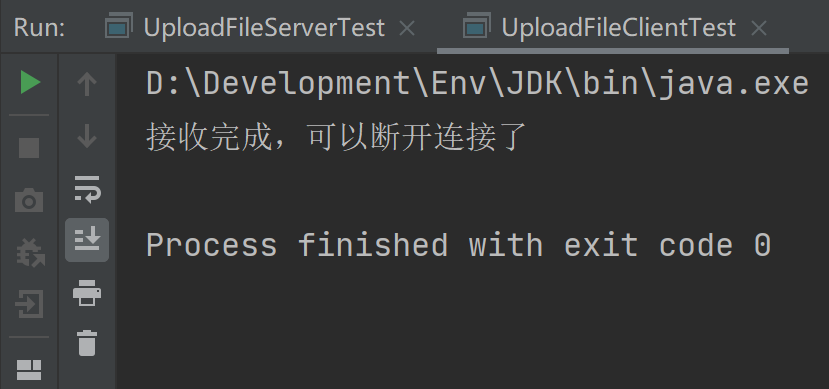


## UDP实现网络通信

- 不用建立连接，只需要知道对方的ip地址
