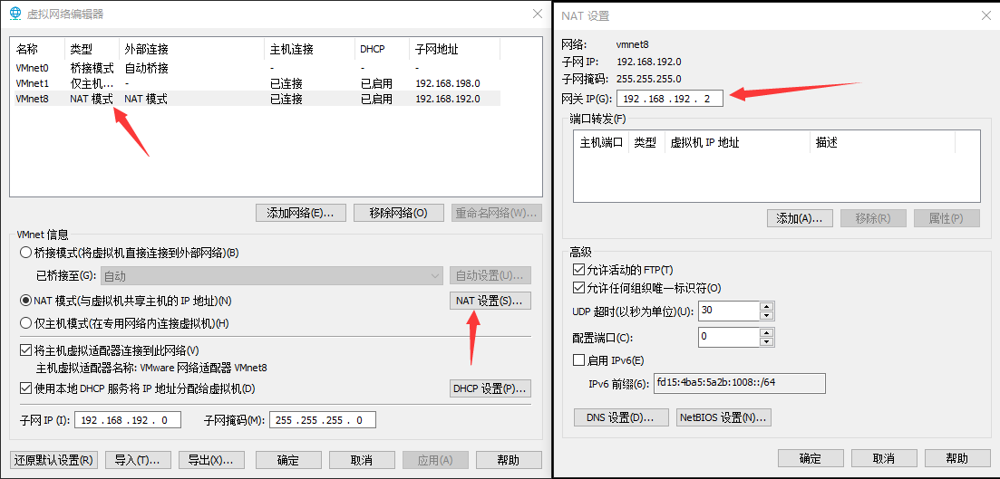
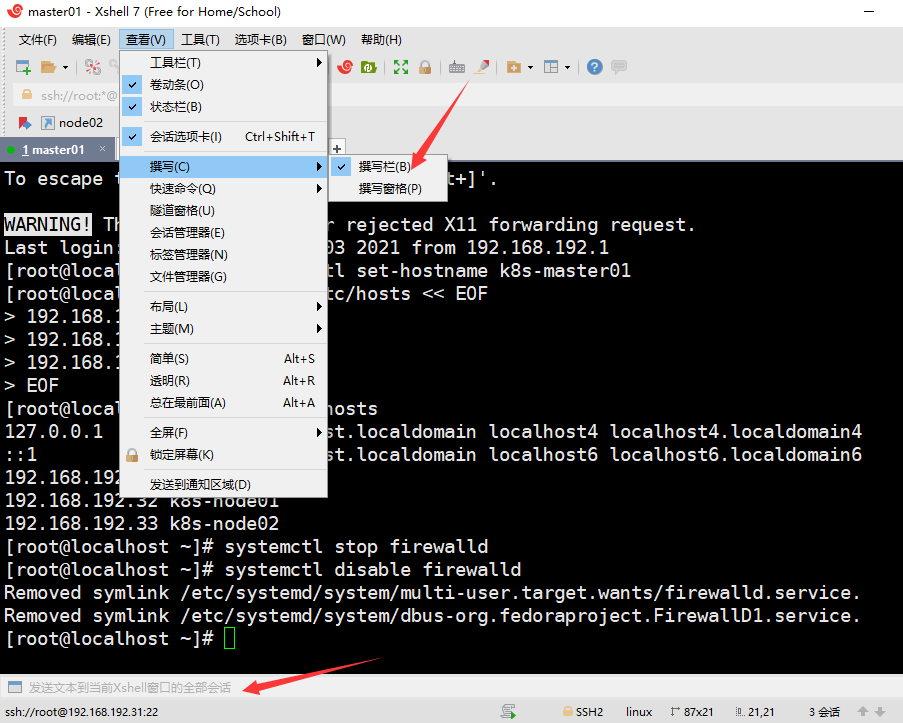
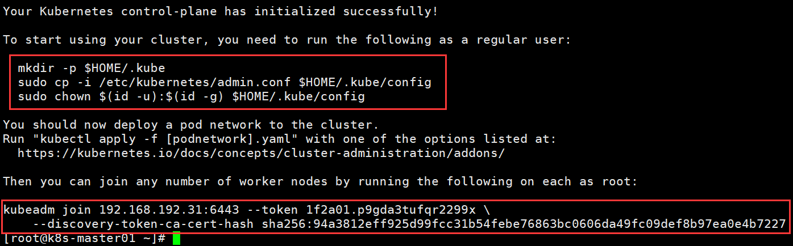
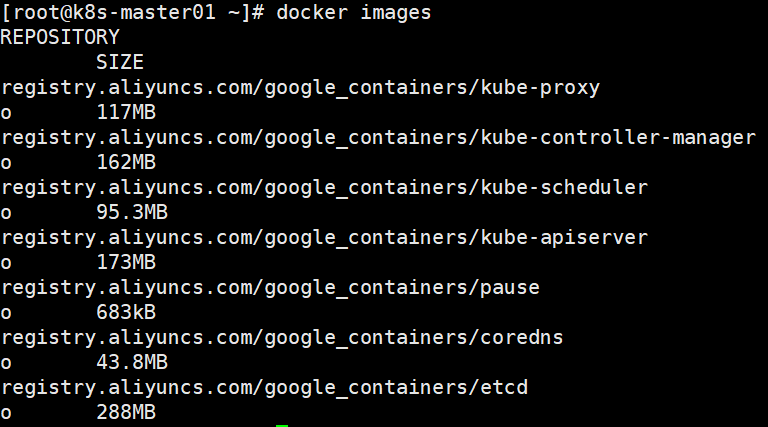
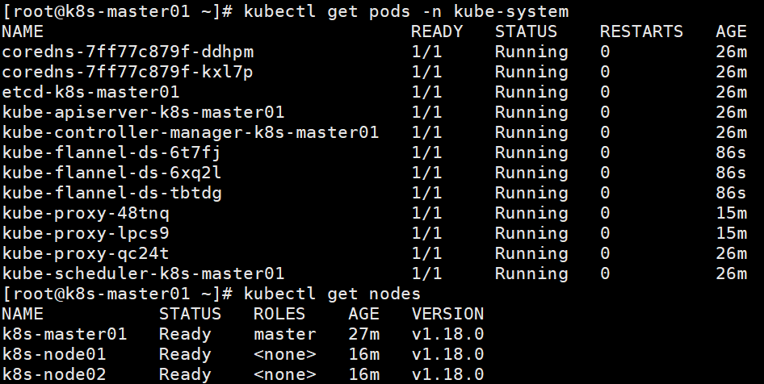
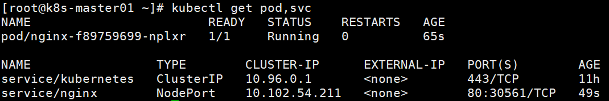

# Kubernetes

> 领航员，舵手

**背景**：微服务的组件越来越多，配置和管理来保持系统的正常运行变得困难，把组件部署在合适的地方变得难以决策

所以需要自动化措施来自动调度，配置，监控和故障处理

- kubernetes是一个**软件系统**，依赖于Linux容器的特性来**运行异构的应用**
- kubernetes将底层基础设施抽象，简化应用的开发，部署和运维

> 帮助企业标准化了云端部署和内部部署的应用交付方式

## 特点

- 开源，轻量级
- 弹性伸缩 
- 基于容器的应用部署、维护和滚动升级
- 无状态服务和有状态服务
- 负载均衡和服务发现
- 插件机制保证扩展性
- 跨机器和跨地区的集群调度


> - Pod
>  - 资源清单
>   - Pod的生命周期
> - 控制器类型
>   - Pod控制器的特点以及使用定义方式
> - 服务发现
>   - SVC原理及其构建方式
> - 服务分类
>
>   - 有状态服务：DBMS，数据持久化存储  
> - 无状态服务：LVS，APACHE
>- K8S网络通讯模式
> 
>
> - 存储
>  - 多种存储类型的特点
>   - 不同环境中选择合适的存储方案
>- 调度器
>  - 调度器原理
>   - 根据要求把Pod定义到特定的节点运行
> - 安全
>   - 集群的认证，鉴权，访问控制
> - HELM
>   - 类似Linux的yum
>   - HELM 原理
>   - HELM自定义模板
>   - HELM部署一些常用插件
> - 高可用集群
>   - 副本数据最好是3个以上的（3，5，7，9）
> 

# Kubernetes集群架构


## Master

**主节点**：集群控制节点，执行所有的命令，通常占据一个独立服务器

- **Api Server**（kube-apiserver）：所有服务（node）访问的唯一入口，提供HttpRest接口的服务进程
- **CrontrollerManager**（kube-controller-manager）：所有资源对象的自动化控制中心，维持副本期望数目
- **Scheduler**（kube-scheduler）：负责接受任务并实现资源调度，选择合适的节点进行分配任务
- **Etcd**：键值对数据库，采用http协议，储存K8S集群所有重要信息
  - 一个可信赖的分布式键值存储服务，能够为整个分布式集群存储一些关键数据，协助分布式集群的正常运转
    - 可信赖指天生支持集群化，不需要其他组件
    - 正常运转：保存分布式存储持久化的配置信息

## Node

**工作节点**：除了Master节点外K8S集群中的**其他负载节点**，**Pod真正运行的主机**，可以是物理机也可以是虚拟机

- 为了管理Pod，每个Node节点上至少需要三个组件
  - container runtime
  - kubelet
  - kube-proxy

- Kubelet：负责和Api Server通信，直接跟容器引擎交互**实现容器的生命周期管理**
- Kube-proxy：负责写入规则至IpTables、Ipvs，从而实现服务映射访问，实现Kubernetes，Service的通信与负载均衡机制的重要组件
- Docker Engine（docker）：Docker引擎，负责容器创建和管理工作

> Node本质上不是Kubernetes来创建的， Kubernetes只是管理Node上的资源

## 其他组件

- CoreDns：可以为集群中的SVC创建一个域名IP的对应关系解析
- DashBoard：给Kubernetes集群提供一个B/S结构访问体系
- **IngressController**：Ingress可以实现七层代理
  - 官方只能实现四层代理

- Federatiom：提供一个可以跨集群中心多Kubernetes统一管理功能
- **Prometheus**：提供Kubernetes集群的监控能力
- **Efk**：提供Kubernetes集群日志统一分析介入平台

# 部署Kubernetes集群

集群类型

- 单Master集群
- 多Master集群

先部署一套单Master架构（3台），再扩容为多Master架构（4台或6台）

**单Master服务器规划**

| **角色**   | **IP**        | **组件**                                                     |
| ---------- | ------------- | ------------------------------------------------------------ |
| k8s-master | 192.168.31.71 | kube-apiserver，kube-controller-manager，kube-scheduler，etcd |
| k8s-node1  | 192.168.31.72 | kubelet，kube-proxy，docker，etcd                            |
| k8s-node2  | 192.168.31.73 | kubelet，kube-proxy，docker，etcd                            |

**服务器要求**

- 2核CPU，2G内存，30G硬盘

- 集群中所有机器之间网络互通

- 可以访问外网，需要拉取镜像（NAT）

- 禁止swap分区

| **软件**   | **版本**               |
| ---------- | ---------------------- |
| 操作系统   | CentOS7.x_x64 （mini） |
| 容器引擎   | Docker CE 19           |
| Kubernetes | Kubernetes v1.20       |

**搭建方式**

- **kubeadm**：K8s 部署工具，快速部署Kubernetes集群
  - `kubeadm init`：创建Master节点
  - `kubeadm join`：将Node节点加入集群`kubeadm join <Master节点IP:端口>`
- **二进制**：手动部署每个组件，组成Kubernetes集群

> Kubeadm 降低部署门槛，但屏蔽了很多细节，遇到问题很难排查
>
> 使用二进制包部署Kubernetes 集群更容易可控，也利于后期维护

## 安装虚拟机

**新建虚拟机**

- 稍后安装OS
- 2个处理器，2个内核
- 2G内存
- 100G磁盘
- 磁盘存储为单个文件

**虚拟机设置**

- CD/DVD选择CentOS镜像
- 网络适配器选择NAT模式
- 安装位置默认
- 最小化安装
- 密码：空格

**地址分配**

| 节点         | IP             |
| ------------ | -------------- |
| k8s-master01 | 192.168.192.31 |
| k8s-node01   | 192.168.192.32 |
| k8s-node02   | 192.168.192.33 |

## 系统初始化

**查看NAT网关**

1. VMware-编辑-虚拟网络编辑器-更改设置
2. 选择NAT模式的网卡，点击NAT设置
3. 查看网关IP：192.168.192.2



```bash
# 设置IP地址
vi /etc/sysconfig/network-scripts/ifcfg-ens33
# 修改
BOOTPROTO=static
ONBOOT=yes
# 增加 
# 三个节点分别是31,32,33
IPADDR=192.168.192.31
NETMASK=255.255.255.0
GATEWAY=192.168.192.2

# 设置DNS
vi /etc/resolv.conf
# 增加
nameserver 192.168.192.2
# 重启
service network restart
# 验证
ping www.baidu.com

# 安装wget
yum install wget
```

 

同时写入三个节点

```bash
# 根据规划设置主机名
hostnamectl set-hostname <hostname>

# 添加hosts
cat >> /etc/hosts << EOF
192.168.192.31 k8s-master01
192.168.192.32 k8s-node01
192.168.192.33 k8s-node02
EOF

# 关闭防火墙
systemctl stop firewalld
systemctl disable firewalld

# 关闭selinux
sed -i 's/enforcing/disabled/' /etc/selinux/config  # 永久
setenforce 0  # 临时

# 关闭swap
swapoff -a  # 临时
sed -ri 's/.*swap.*/#&/' /etc/fstab    # 永久

# 重启

# 将桥接的IPv4流量传递到iptables的链
cat > /etc/sysctl.d/k8s.conf << EOF
net.bridge.bridge-nf-call-ip6tables = 1
net.bridge.bridge-nf-call-iptables = 1
EOF
# 生效
sysctl --system  

# 时间同步
yum install ntpdate -y
ntpdate time.windows.com

## 安装docker

Kubernetes 默认CRI（容器运行时）为Docker，因此先安装Docker

​```bash
# 下载Docker
wget https://mirrors.aliyun.com/docker-ce/linux/centos/docker-ce.repo -O /etc/yum.repos.d/docker-ce.repo

# 安装指定版本
yum -y install docker-ce-18.06.1.ce-3.el7

# 设置开机启动
systemctl enable docker && systemctl start docker

# 验证
docker --version

# 设置仓库
cat > /etc/docker/daemon.json << EOF
{
"registry-mirrors": ["https://b9pmyelo.mirror.aliyuncs.com"]
}
EOF

# 重启docker
systemctl restart docker

# 验证
docker info

# 添加yum源
cat > /etc/yum.repos.d/kubernetes.repo << EOF
[kubernetes]
name=Kubernetes
baseurl=https://mirrors.aliyun.com/kubernetes/yum/repos/kubernetes-el7-x86_64
enabled=1
gpgcheck=0
repo_gpgcheck=0
gpgkey=https://mirrors.aliyun.com/kubernetes/yum/doc/yum-key.gpg
https://mirrors.aliyun.com/kubernetes/yum/doc/rpm-package-key.gpg
EOF
```

## 安装k8s组件

- kubeadm
- kubectl
- kubelet

```bash
# 指定版本
yum install -y kubelet-1.18.0 kubeadm-1.18.0 kubectl-1.18.0

# 设置开机启动
systemctl enable kubelet
```

## 部署Master节点

- apiserver-advertise-address：当前节点IP
- image-repository：阿里云镜像
- kubernetes-version：指定版本

> 默认拉取镜像地址k8s.gcr.io国内无法访问，指定阿里云镜像仓库地址

```bash
# 在Master节点上执行
kubeadm init \
--apiserver-advertise-address=192.168.192.31 \ 
--image-repository registry.aliyuncs.com/google_containers \ 
--kubernetes-version v1.18.0 \ 
--service-cidr=10.96.0.0/12 \
--pod-network-cidr=10.244.0.0/16
```

验证安装成功

- 提示成功信息**initialized successfully**
- 提示接下来步骤



查看下载的镜像

 

按提示操作

```bash
# 在master上运行
mkdir -p $HOME/.kube
sudo cp -i /etc/kubernetes/admin.conf $HOME/.kube/config
sudo chown $(id -u):$(id -g) $HOME/.kube/config

# 查看节点,只有master节点,状态是NotReady
kubectl get nodes
```

## 添加Node节点

按提示操作

> 默认的token：`sha256:94a3812eff925d99fcc31b54febe76863bc0606da49fc09def8b97ea0e4b7227`有效期是24h，过期需要重新创建

```bash
# 在node上运行
kubeadm join 192.168.192.31:6443 --token 1f2a01.p9gda3tufqr2299x \
    --discovery-token-ca-cert-hash sha256:94a3812eff925d99fcc31b54febe76863bc0606da49fc09def8b97ea0e4b7227
    
# 查看节点,有master节点和node节点,状态都是NotReady
kubectl get nodes

# 重新创建token
kubeadm token create --print-join-command
```

## 部署CNI网络插件

节点状态NotReady：缺少网络组件

> 默认镜像地址无法访问，sed命令修改为docker hub镜像仓库。

```bash
# 下载网络插件配置
wget https://raw.githubusercontent.com/coreos/flannel/master/Documentation/kube-flannel.yml

kubectl apply -f https://raw.githubusercontent.com/coreos/flannel/master/Documentation/kube-flannel.yml

# 查看pods
kubectl get pods -n kube-system
```

状态变为Ready



[K8S应用FLANNEL失败解决INIT:IMAGEPULLBACKOFF](https://www.cnblogs.com/pyxuexi/p/14288591.html)

## 测试k8s集群

在Kubernetes集群中创建一个pod验证是否正常运行

在master节点上运行

```bash
kubectl create deployment nginx --image=nginx
kubectl expose deployment nginx --port=80 --type=NodePort
kubectl get pod,svc
```

访问：http://192.168.192.32:30561  




## Harbor

>  企业级 Docker 私有仓库

安装底层需求

- Python应该是2.7或更高版本
- Docker引擎应为1.10或更高版本
- Docker Compose需要为1.6.0或更高版本

```bash
# 添加假证书
vim /etc/docker/daemon.json
# 中括号后加逗号，
"insecure-registries": ["[https://hub.atguigu.com](https://hub.atguigu.com/)"]

# 重启
systemctl restart docker
mv docker-compose /usr/local/bin
chmod a+x /usr/local/bin/docker-compose

# 解压
tar -zxvf harbor-offline-installer-v1.2.0.tgz
mv harbor /usr/local/
cd /usr/local/harbor
mkdir -p /data/cert

openssl genrsa -des3 -out server.key 2048
# 创建密码：123456

openssl req -new -key server.key -out server.csr
# 输入密码：123456
# 输入国家CN
# 输入城市BJ
# 默认城市BJ
# 组织atguigu

# 备份私钥
cp server.key server.key.org
# 退出密码
openssl rsa -in server.key.org -out server.key
openssl x509 -req -days 365 -in server.csr -signkey server.key -out server.crt
mkdir  /data/cert
chmod -R 777 /data/cert
docker ps -a

# 访问hub.atguigu.com
# 登陆：admin
# 密码：Harbor12345
# 访问尝试
docker login https://hub.atguigu.com
# 下载镜像
docker pull wangyanglinux/myapp:v1
# 命令名称
# 规范：docker tag SOURCE_IMAGE[:TAG] hub.atguigu.com/library/IMAGE[:TAG]
# 把SOURCE_IMAGE[:TAG]和IMAGE[:TAG]替换掉
docker tag wangyanglinux/myapp:v1 hub.atguigu.com/library/myapp:v1
# 上传镜像到仓库
docker  push hub.atguigu.com/library/myapp:v1
# 链接私有仓库
kubectl run nginx-deployment --image=hub.atguigu.com/library/myapp:v1 --port=80 --replicas=1
# replicas标识副本数目，必须保持为1
# 删除
kubectl delete pod +名称
# 修改数目
kubectl scale --replicas=3 deployment/nginx-deployment
kubectl get deployment
kubectl get node -o wide

# 查看帮助文档
kubectl expose --help
# 访问模板
kubectl expose deployment nginx --port=80 --target-port=8000
# 访问服务的80端口，访问容器的8000端口（Create a service for an nginx deployment, which serves on port 80 and connects to the containers on port 8000）
# 修改虚拟ip为外网ip
kubectl edit svc nginx-deployment
# 将type里的ClusterIP改为NodePort
netstat -anpt | grep :30000
```

## Rancher

- Rancher的集群管理基于角色的访问控制策略，策略管理和工作负载等功能在导入集群中可用
- 对于除K3s集群外的所有导入的 Kubernetes 集群，必须在Rancher外部编辑集群的配置，需要自己在集群中修改Kubernetes组件的参数、升级Kubernetes版本以及添加或删除节点
- Rancher中不能配置或扩展导入的集群

**搭建Rancher环境**

> ERROR: Rancher must be ran with the --privileged flag when running outside of Kubernetes

在浏览器中访问：https://192.168.192.31，首次访问会提示设置admin管理员密码

```bash
sudo docker run --privileged -d  --restart=unless-stopped -p 80:80 -p 443:443 rancher/rancher:stable
```


# YAML

Kubernetes集群中对**资源管理**和**资源对象编排部署**都可以通过YAML文件（声明样式文件）来解决

- 可以把需要对资源对象的操作编辑到YAML格式文件中，把这种文件叫做**资源清单文件**
- 通过kubectl命令直接使用资源清单文件就可以实现对大量的资源对象进行编排部署

> Kubernetes中所有的配置都是json格式的，为了读写方便通常会将这些配置写成yaml格式，运行的时候yaml引擎将其转化为json格式
>
> apiserver仅接受json格式的数据

**书写格式**

- YAML是一种**标记语言**，**以数据做为中心**，而不是以标记语言为重点
- YAML是一个可读性高，用来表达数据序列的**格式**

## 基本语法

* 大小写敏感
* 使用缩进表示层级关系，使用**空格做为缩进**
  * 缩进的空格数目不重要，只要相同层级的元素左侧**对齐即可**
  * **低版本缩进时不允许使用Tab键，只允许使用空格**
* **使用`#`标识注释**
  * 从`#`字符一直到行尾，都会被解释器忽略
* `---`为可选的分隔符，当需要在一个文件中定义多个同级的结构的时候使用
  * 如同时在一个yaml文件中定义Secret和ServiceAccount两个同级资源类型

## 数据结构

字符串，整数，小数，布尔值，null等类型

### 字符串

**Plain Style**：除了特殊符号`& * { } [ ] : # !` 等，**其他直接使用**

```yaml
abcdef
foo: bar
```

等价json

```json
"abcdef"
{
  "foo": "bar"
}
```

**Quoted Style**：使用`''`或`""`，使用`\`可以连接多行内容

- 如果**直接换行则会用空格连接多行内容**

> 同一个`''`或`""`包裹

```yaml
"abcdef"
1: 'foo'
2: "bar\
    bar\
    bar"
3: "baz
    baz
    baz"
```

等价json

```json
"abcdef"
{
  "1": "foo", 
  "2": "barbarbar", 
  "3": "baz baz baz"
}
```

**Block Style**：使用`|`连接多行，保留末尾换行，或使用`>`，用空格连接多行

```json
literal: |
  some
  text
folded: >
  some
  text
quoted: "some\ntext\n"
```

等价json

```json
{
  "literal": "some\ntext\n", 
  "folded": "some text\n", 
  "quoted": "some\ntext\n"
}
```

**Trailing Empty Lines**

- `|`和`>`默认保留一个末尾换行
- `|+`和`>+`会保留所有末尾换行
- `|-`和`>-`会去除所有末尾换行

```yaml
1: |
   line 1


2: |+
   line 1


3: |-
   line 1


4: line 1
```

等价json

```json
{
  "1": "line 1\n", 
  "2": "line 1\n\n\n", 
  "3": "line 1", 
  "4": "line 1"
}
```

### 对象

键值对集合

- 映射（mapping）：`{ key: value }` 或 `key: value`
- 哈希（hashes）
- **字典**（dictionary）：用`:`标识
  - 普通字典
  - 多层嵌套字典：值也是字典

```yaml
1: { a: b, c: d }
2: {
 a: b,
 c: d, e: f
}
3:
  a: b
  c: d
```

等价json

```json
{
  "1": {
    "a": "b", 
    "c": "d"
  }, 
  "2": {
    "a": "b", 
    "c": "d", 
    "e": "f"
  }, 
  "3": {
    "a": "b", 
    "c": "d"
  }
}
```

### 数组

一组按次序排列的值，通常使用`-`标识

- 序列（sequence）
- **列表**（list）：`[]`或`-`

```yaml
1: [ a, b, c ]
2: [
  a, b,
  c,
]
3:
  - a
  - b
  - c
```

等价json

```json
{
  "1": ["a", "b", "c"], 
  "2": ["a", "b", "c"],
  "3": ["a", "b", "c"]
}
```

**Demo**

```yaml
volumes:
- name: kubernetes-dashboard-certs

# 解析为json
{"volumes":[{"name":"kubernetes-dashboard-certs"}]}
```

## 定义复用

使用`&`定义数据，使用`*`复用（引用）**已定义的数据**（必须在引用前定义）

```yaml
key_1: &def value_1
key_2: *def


jobs:
  job_a:
    steps:
      - &init_step
        name: Init Step
        commands: [ ls, pwd, whoami ]
  job_b:
    steps:
      - *init_step
      
      
1: &array_of_string
  type: array
  items:
    type: string
2:
  type: boolean
3: *array_of_string
```

等价json

```json
{
  "key_1": "value_1", 
  "key_2": "value_1"
}


{
  "jobs": {
    "job_a": {
      "steps": [
        {
          "commands": [
            "ls",
            "pwd",
            "whoami"
          ],
          "name": "Init Step"
        }
      ]
    }, 
    "job_b": {
      "steps": [
        {
          "commands": [
            "ls",
            "pwd",
            "whoami"
          ],
          "name": "Init Step"
        }
      ]
    }
  }
}


{
  "1": {
    "items": {
      "type": "string"
    },
    "type": "array"
  }, 
  "2": {
    "type": "boolean"
  }, 
  "3": {
    "items": {
      "type": "string"
    },
    "type": "array"
  }
}
```

### map合并

在复用定义的时候，可以使用`<<`将已定义的map展开和当前map合并

- 根据锁进展开对应的map

> 就是在复用map的时候可以在后面追加新的内容

```yaml
1:
  a: b
2: &2
  c: d
<<: *2


1: &array_of_string
  type: array
  items:
    type: string
2:
  type: boolean
3:
  required: true
  <<: *array_of_string
```

等价json

```json
{
  "1": {
    "a": "b"
  }, 
  "2": {
    "c": "d"
  },
  "c": "d"
}

{
  "1": {
    "items": {
      "type": "string"
    },
    "type": "array"
  },
  "2": {
    "type": "boolean"
  }, 
  "3": {
    "required": true,
    "items": {
      "type": "string"
    },
    "type": "array"
  }
}
```


# kubectl

`kubectl command type name flags`

- `comand`：指定**对资源执行的操作**
  - `create`，`get`，`describe`和`delete`

- `type`：指定**资源类型**
  - 大小写敏感，可以是单数、复数和缩略的形式
  - `pod`，`pods`和`po`

- `name`：**指定资源的名称**
  - 大小写敏感，省略名称会显示所有的资源

- `flags`：**指定可选的参数**
  - 用`-s`或者`–server`参数指定API server 的地址和端口


# Kuboard

**在Kuboard中集群概览的展示形式**

- 上层：运行于计算资源与存储资源上的名称空间（应用）

- 下层：计算资源、存储资源并列

**在Kuboard中名称空间的展示形式：以微服务参考分层架构的形式，将所有的微服务分为如下几层**

- 展现层：终端用户访问的 Web 应用
- API网关层：Spring Cloud Gateway / Zuul /Kong 等接口网关
- 微服务层：Spring Boot 微服务，或 PHP / Python 实现的微服务
- 持久层：MySQL 数据库等（开发及测试环境里将MySQL部署于K8s可以极大地降低环境维护的任务量）
- 中间件层
  - 消息队列
  - 服务注册 Eureka / Zookeeper / Consul
- 监控层
  - Prometheus + Grafana
  - Pinpooint


# Pod

**为什么需要pod**

- 因为不能将多个进程聚集在单独的容器内，所以需要更高级的结构来将容器绑定在一起，将其作为一个单元管理

> 倾向于单容器pod

## Pod特征

- Pod是一组紧密关联的**容器集合**，是Kubernetes**调度和扩缩容的基本单位**


- Pod内的多个容器在一个Pod中**共享Linux namespace，IPC、Network和文件系统**
  - 默认情况下每个容器的文件系统和其他容器隔离，但可以通过Volume共享文件目录
  - 多个容器共享ip和端口，所以不能绑定到同一个端口上
  - 多个容器可直接通过localhost互相通信
  - 可以通过**进程间通信**和**文件共享**这种简单高效的方式**完成服务**


- 删除Pod的时候会先给其内的进程发送`SIGTERM`信号，等待一段时间（grace period）后才强制停止依然还在运行的进程
- **特权容器**（通过SecurityContext配置）具有改变系统配置的权限
  - 在网络插件中大量应用

> Pod的设计理念是每个Pod都有一个唯一的IP
>
> Pod绝对不会跨node工作，Pod内的所有容器都在同一节点
>

## Pod策略

- 支持**三种重启策略**（restartPolicy）
  - `Always`
  - `OnFailure`
  - `Never`
- 支持**三种镜像拉取策略**（imagePullPolicy）
  - `Always`
  - `Never`
  - `IfNotPresent`

## Pod生命周期

- **Init container在所有容器运行之前执行，常用来初始化配置**
- **容器生命周期钩子函数**，用于监听容器生命周期的特定事件，并在事件发生时执行已注册的回调函数，**支持两种钩子函数**
  - `postStart`：在容器启动后执行
  - `preStop`：在容器停止前执行
- 提供两种**健康检查探针**
  - `livenessProbe`：用于**探测容器是否存活**，如果探测失败，则根据重启策略进行重启操作
  - `redinessProbe`：用于**检查容器状态是否正常**，如果检查容器状态不正常，则请求不会到达该Pod

## Pod分类

**生命周期**

- **自主式Pod**：Pod退出了，此类型的Pod不会被创建
  - 无法确保稳定

- **控制器管理的Pod**：在控制器的生命周期里，**始终要维持Pod的副本数目**

**编程**

- **声明式编程（Deployment）**：侧重于定义想要什么，然后告诉计算机让它帮你实现
  - `apply > create`  
- **命令式编程（ReplicaSet）**：侧重于如何实现程序，把实现过程按逻辑一步步写出
  -  `create > apply`      

## Pod网络

**平坦pod间网络**

- 集群中的所有pod都在同一个共享网络地址空间中，所有pod都可以通过其他pod的ip地址来相互访问，它们之间没有NAT网关


## 创建pod

使用`yaml`文件创建pod

- 格式要对齐，同一级别的对象要放在同一列，不用tab

`vim ini-pod.yaml`

```yaml
# kubernetes api版本
apiVersion: v1
# kubernetes资源对象
kind: Pod
# pod元数据，名称，标签，注解
metadata:
  # pod名称
  name: myapp-pod
  labels:
    # pod标签
    app: myapp
# pod内容，容器列表，volume
spec:
  # 节点选择器
  nodeSelceter:
    # node节点的标签
    gpu: true
  containers:
  # 容器名称
  - name: myapp-container
    image: busybox
    ports:
    # 应用监听端口
    - containerPort: 8080
      protocol: TCP
    command: [ 'sh', '-c', 'echo The app is running! && sleep 3600' ]
  initContainers:
  -  name: init-myservice
     image: busybox
     command: [ 'sh', '-c', 'until nslookup myservice; do echo waiting for myservice; sleep 2; done;' ]
  - name: init-mydb
     image: busybox
     command: [ 'sh', '-c', 'until nslookup mydb; do echo waiting for mydb; sleep 2; done;' ]
```

## 操作pod

```bash
# 创建pod
kubectl create -f ini-pod.yaml

# 查看pod详细信息
kubectl describe pod myapp-pod

# 报错时候查看
kubectl describe pod podname

# 查看日志信息，pod里面单个容器
kubectl logs podname

# 查看日志信息，pod里面多个容器，-c指定容器名
kubectl logs podname -c containername

# 查看pod详细信息（IP和node）
kubectl get pod -o wide

# 查看pod详细信息，追踪状态
kubectl get pod -w

# 删除pod
kubectl delete pod myapp-pod

# 删除所有的pod
kubectl delete pod --all
```

## 端口转发

通过将本地网络端口转发到pod中的端口来测试pod

```bash
kubectl port-forward podname hostport:podport
```

## 标签

**label**：通过使用标签来组织一系列的pod

> 也可以组织其他kubernetes对象，比如node

**标签**：可以附加到资源的任意键值对，可以通过**标签选择器**选择具有该标签的资源

- 要求标签的key在资源中唯一
- 节点选择器也可以根据标签来将pod调度到指定的节点
- 每个node都有一个唯一的标签：`key = kubernetes.io/hostname`

```bash
# 查看pod的标签信息
kubectl get pods --show-labels

# 只查看指定标签，使用标签选择器过滤pod
kubectl get pods -L labelkey
# 列出没有标签的pod，用''包裹
kubectl get pods -L '!labelkey'

# 修改pod标签
kubectl label pod podname key=value

# 修改node标签
kubectl label node nodename key=value
```

## 命名空间

**namespace**：对一组资源和对象的抽象集合

- 可以用来**将系统内部的对象划分为不同的项目组或者用户组**

- 常见的pod、service、replicaSet和deployment等都是属于某一个namespace的（默认是`default`）
- node, persistentVolumes等则不属于任何namespace

```bash
# 查询所有namespace
kubectl get namespace
kubectl get ns

# 指定namespace
kubectl get po --namespace namespacensname
kubectl get po -n namespacensname

# 删除namespace
kubectl delete namespacensname
```

### 创建namespace

**直接创建**

```bash
# 创建namespace
kubectl create namespacensname
```

**使用yaml文件创建**

`vim cusnamespace.yaml`

```yaml
apiVersion: v1
kind: namespace
metadata:
  name: cusnamespace
```

### 删除namespace

- 删除一个namespace会**自动删除所有属于该namespace的资源**
- `default`和`kube-system`namespace不可删除
- PersistentVolumes是不属于任何namespace的，但PersistentVolumeClaim是属于某个特定namespace的
- Events是否属于namespace取决于产生events的对象

## job

执行单个任务的pod

- 当内部进程成功结束时，不再重启容器
- **一般用于临时任务和定时任务**
- job不能使用`Always`的重启策略
- job可以创建多个pod，以串行或并行的方式运行它们

### Cronjob

- 定时任务
- 定时重复任务

cronjob资源会创建job资源，job资源会创建pod

**配置时间表**

时间表从左到右包含5个条目，**同一个条目多个值用逗号隔开，不同条目用空格隔开**

- 分钟
- 小时
- 每个月的第几天
- 月
- 星期几：0表示星期天

`schedule: "0,15,30,45 * * * *`：每天在每小时的0，15，30，45分钟执行，即每隔15分钟执行一次

- 0，15，30，45：即0，15，30，45分钟

- 第一个*：每小时
- 第二个*：每月的每一天
- 第三个*：每年的每个月
- 第四个*：每周的每一天

`schedule: "0,30 * 1 * * `：每个月的第一天在每小时的0，30分钟执行，即每个月的第一天每隔30分钟执行一次


# 服务

**Service**：是对**一组提供相同功能的Pods的抽象**，为它们**提供一个统一的入口**

- 一组或多组提供相同服务的pod对外暴露为服务的静态ip地址
- 由于pod的动态性，新的pod就会有新的ip:port，因此服务就用来对外暴露一个稳定的ip:port以供访问
  - 服务是静态的ip
  - 客户端通过ip连接到服务，由服务去选择pod接收这个连接（转发）

- 借助Service，应用可以方便的**实现服务发现与负载均衡**，并实现应用的**零宕机升级**
- Service**通过标签（label）**来选取属于该服务的Pod，一般配合ReplicaSet或者Deployment来保证后端容器的正常运行
  - Controller会保证pod的数量来稳定的提供服务

> pod并不重要，pod是用来提供服务的
>
> 外部客户端->服务1->pod1->服务2->pod2

## 服务类型

Service有四种类型

- ClusterIP：默认类型，**自动分配一个仅集群内部可以访问的虚拟IP**
- NodePort：在ClusterIP的基础上为Service**在每台机器上绑定一个端口**，外部应用可以通过`NodeIP:NodePort`访问该服务
- LoadBalancer：在NodePort的基础上，借助cloud provider创建一个**外部的负载均衡器**，并将**外部的请求转发**到`NodeIP:NodePort`来访问集群内部的服务
- ExternalName：将服务通过DNS CNAME记录方式**转发到指定的域名**

> 也可以将已有的服务**以Service的形式加入到Kubernetes集群中**来

## 创建服务

`vim myservice.yaml`

- 创建服务，它将80端口接收到的外部请求转发到具有`app=myapp`标签的pod中的9376端口

```yaml
apiVersion: v1
kind: Service
metadata:
  name: myservice
spec:
  ports:
  - protocol: TCP
    # 服务的可用端口
    port: 80
    # 服务将连接转发到容器的端口
    targetPort: 9376
  selector:
    # 具有app=myapp标签的pod都属于该服务
    app: myapp
```

## 验证服务

- 进入kubernetes集群中的任意节点，然后使用`curl`命令访问服务
- 使用`exec`命令进入一个存在的pod，然后使用`curl`命令访问服务

> `--`代表kubectl命令结束，后面的命令是在pod中执行的命令

服务代理通常会将请求随机指向选中后端pod中的一个

- 可以使用`sessionAffinity`来设置**会话亲和性**，使得来自**同一个客户端的所有请求都转发到同一个pod中**

```bash
# 获取服务ip
kubctl get svc
# 访问服务，服务会重定向请求到pod中
kubectl exec podname -- curl -s serviceip

# 进入单容器pod
kubectl exec -it readiness-httpget-pod -- /bin/sh

# 进入多容器pod需要指明容器
kubectl exec -it readiness-httpget-pod -c containername -- /bin/sh
```

## 多端口服务

创建有多个端口的服务，**必须给每个端口都指定一个名字**

- 但是服务的标签选择器是应用于整个服务的，不能单独对一个端口做配置

```bash
apiVersion: v1
kind: Service
metadata:
  name: myservice
spec:
  ports:
  # 指定端口名字
  - name: http
  	protocol: TCP
    port: 80
    targetPort: 9080
  # 指定端口名字
  - name: https
  	protocol: TCP
    port: 443
    targetPort: 9443
  selector:
    app: myapp
```

## pod命名端口

可以在pod中指定对外暴露端口的名字，这样在服务中，就可以用名字指定转发的pod上的端口

```yaml
apiVersion: v1
kind: Pod
metadata:
  name: myapp-pod
  labels:
    app: myapp
spec:
  nodeSelceter:
    gpu: true
  containers:
  - name: myapp-container
    image: busybox
    ports:
    - name: http
      containerPort: 9080
    - name: https
      containerPort: 9443
```

```yaml
apiVersion: v1
kind: Service
metadata:
  name: myservice
spec:
  ports:
  - name: http
  	protocol: TCP
    port: 80
    targetPort: http
  - name: https
  	protocol: TCP
    port: 443
    targetPort: https
  selector:
    app: myapp
```

## 服务发现

### 环境变量

pod开始运行时，kubernetes会初始化一系列的环境变量指向现在存在的服务

- 如果服务早于pod创建，pod上的进程就可以根据环境变量来获取服务的ip和端口

```bash
# 查看环境变量，会显示服务的ip和端口
kubectl exec podname env
```

### DNS服务器

kube-dns pod运行DNS服务，集群的其他pod都被配置使用其作为dns

- 通过修改容器中的`/etc/resolv.conf`文件实现
- 该DNS服务知道系统中所有运行的服务

## 连接外部服务

### Endpoint

- 服务并不是和pod直接相连的，在两者之间有一种**Endpoint资源**（并不是服务的属性）
- 服务的标签选择器会创建Endpoint资源，Endpoint资源就是一个暴露服务对应的一组pod的ip和端口的列表，当收到客户端请求时，服务代理选择列表中的一个ip和端口并重定向

**手动配置Endpoint**

- 当服务不设置标签选择器时，kubernetes不会创建Endpoint资源

**无标签选择器的服务**

```yaml
apiVersion: v1
kind: Service
metadata:
  name: ex-service
spec:
  ports:
  - port: 80
```

**对应的Endpoint**

```yaml
apiVersion: v1
kind: Endpoints
metadata:
  # 和对应的无标签选择器的服务名称相同
  name: ex-service
subsets:
  - addresses:
    - ip: 10.2.2.2
    - ip: 10.2.1.2
    ports:
    - port: 80
```

## 服务暴露

客户端在外部访问服务

1. 将服务的类型设置成`NodePort`
2. 将服务的类型设置成`LoadBalancer`
3. 使用`Ingress`

### NodePort

- NodePort类型的服务会让集群中的**所有节点都保留一个相同的端口**，该端口会将传入的请求转发给服务对应的pod
- **外部客户端可以通过节点ip和端口来访问服务**

> 不指定nodePort就会随机分配一个

```yaml
apiVersion: v1
kind: Service
metadata:
  name: nodeportservice
spec:
  # 设置类型
  type: NodePort
  ports:
  - port: 80
    # 转发给pod的8888端口
    targetPort: 8888
    # 通过集群节点的33212端口，就可以访问该服务
    nodePort: 33212
  selector:
    app: myapp
```

### LoadBalancer

- 负载均衡是NodePort的拓展

- 负载均衡器拥有自己独一无二的可公开访问的ip
- 创建负载均衡类型的服务后，云基础架构会花费一段时间创建负载均衡器并将其ip写入服务对象，即服务的`EXTERNAL-IP`

> LoadBalancer型的服务是一个具有额外基础设施提供的负载均衡器的NodePort服务
>
> 负载均衡器接收到外部请求后，仍然会和NodePort服务一样转发到node上的一个随机端口，然后再转发到pod中

**缺点**

- 可能增加网络跳数
- 会改变源ip导致无法记录

```yaml
apiVersion: v1
kind: Service
metadata:
  name: loadbalancerservice
spec:
  # 设置类型
  type: LoadBalancer
  ports:
  - port: 80
    targetPort: 8888
  selector:
    app: myapp
```

### Ingress

Kubernetes中的负载均衡主要有**内外两种机制**

- **Service**：使用Service提供**集群内部的负载均衡**，Kube-proxy负责将service请求负载均衡到后端的Pod中
- **Ingress Controller**：使用Ingress提供**集群外部的负载均衡**
  - Ingress可以给service提供集群外部访问的URL、负载均衡、HTTP路由等
  - 只有ingress controller在集群中运行，ingress资源才能正常工作
  - 常用的ingress controller：nginx，traefik，Kong，Openresty


> **Service和Pod的IP仅可在集群内部访问**，集群外部的请求需要通过**负载均衡**转发到service所在节点暴露的端口上，然后再由kube-proxy通过边缘路由器将其转发到相关的Pod

**优点**

- 每个LoadBalancer型的服务都需要一个负载均衡器和一个公网ip，而ingress只需要一个公网ip就可以为许多服务提供访问，即**通过一个ingress即可暴露多个服务**

#### 创建Ingress

- host即指定了请求的`header`中的`host`字段

```yaml
apiVersion: extensions/v1beta1
kind: Ingress
metadata:
  name: appingress
spec:
  # rules和paths都是数组
  rules:
  # ingress将app.example.com映射到对应的nodeport服务
  - host: app.example.com
  http:
    # paths数组可以配置多个服务
    paths:
    - path: /
      backend:
        # 将app.example.com收到的请求转发到nodeportservice服务的80端口
        serviceName: nodeportservice
        servicePort: 80
    - path: /foo
      backend:
        serviceName: fooservice
        servicePort: 80
```

#### 使用Ingress

- 配置dns服务器将域名和ip对应写入

```bash
# 查看对应ingress的ip，这个ip即对应host: app.example.com
kubectl get ingresses
```


# 控制器

## ReplicationController

ReplicationController资源对象用来创建和管理pod副本数量（replicas），实现pod的水平伸缩

- ReplicationController会持续监控正在运行的pod列表，保证相应类型的pod的数量和期望相符

ReplicationController结构

- 标签选择器
- 副本个数
- pod模板（template）

## ReplicaSet

> 替代ReplicationController

ReplicatSet的标签选择器功能更强

## DaemonSet

需要pod在每个节点上运行，并且每个节点都需要正好一个运行的pod

- 当一个新节点被添加到集群中时，DaemonSet会立即部署一个新的pod实例
- DaemonSet管理的pod会绕过调度器，即使是不可调度的节点，也会有DaemonSet管理的pod

> 如日志收集器


# 资源调度

```bash
# 将node标志为不可调度
kubectl cordon nodename

# 将node标志为可调度
kubectl uncordon nodename
```

## 污点

**taint**：可以**给某个node节点设置污点**

- Node被设置上污点之后就和Pod之间存在了一种相斥的关系，可以让Node拒绝Pod的调度执行，甚至将Node已经存在的Pod驱逐出去

- 每个污点的组成：`key=value:effect`

- 当前taint effect支持三个选项

  - `NoSchedule`：表示k8s将不会将Pod调度到具有该污点的Node上

  - `PreferNoSchedule`：表示k8s将尽量避免将Pod调度到具有该污点的Node上

  - `NoExecute`：表示k8s将不会将Pod调度到具有该污点的Node上，同时会将Node上已经存在的Pod驱逐出去

```bash
# 为node0设置不可调度污点
kubectl taint node node0 key1=value1:NoShedule

# 将node0上key值为key1的污点移除
kubectl taint node node0 key-

# 为kube-master节点设置不可调度污点
kubectl taint node node1 node-role.kubernetes.io/master=:NoSchedule

# 为kube-master节点设置尽量不可调度污点
kubectl taint node node1 node-role.kubernetes.io/master=PreferNoSchedule
```

## 容忍

Tolerations

设置了污点的Node将根据taint的effect和Pod之间产生互斥的关系，Pod将在一定程度上不会被调度到Node上。

可以在Pod上设置容忍（Toleration），设置了容忍的Pod将可以容忍污点的存在，可以被调度到存在污点的Node上


# 存储卷

**Volume**

> 默认情况下**容器的数据是非持久化**的，容器消亡以后数据也会跟着丢失，所以**Docker提供了Volume机制以便将数据持久化存储**

Kubernetes提供了更强大的Volume机制和插件，解决了**容器数据持久化**以及**容器间共享数据**的问题

- Kubernetes将存储卷作为pod的一部分，存储卷的生命周期与Pod绑定


- 容器挂掉后**重启容器时Volume的数据依然还在**，只有**删除Pod时Volume才会清理**
- 数据是否丢失取决于具体的Volume类型
  - emptyDir的数据会丢失，而PV的数据则不会丢

目前Kubernetes主要支持以下Volume类型

- **emptyDir**：Pod存在，emptyDir就会存在，容器挂掉不会引起emptyDir目录下的数据丢失，但是pod被删除或者迁移，emptyDir也会被删除
- **hostPath**：hostPath允许挂载Node上的文件系统到Pod里面去
- **NFS**：Network File System，网络文件系统，Kubernetes中通过简单地配置就可以挂载NFS到Pod中，而NFS中的数据是可以永久保存的，同时NFS支持同时写操作
- **glusterfs**：同NFS一样是一种网络文件系统，Kubernetes可以将glusterfs挂载到Pod中，并进行永久保存
- **cephfs**：一种分布式网络文件系统，可以挂载到Pod中，并进行永久保存
- **subpath**：Pod的多个容器使用同一个Volume时，会经常用到
- **secret**：密钥管理，可以将敏感信息进行加密之后保存并挂载到Pod中
- **persistentVolumeClaim**：用于将持久化存储（PersistentVolume）挂载到Pod中

## 持久化存储卷

PersistentVolume（PV） 

PersistentVolume是集群之中的一块**网络存储资源**

- PersistentVolume（PV） 和PersistentVolumeClaim（PVC）提供了方便的持久化卷
  - PV提供网络存储资源，PVC请求存储资源并将其挂载到Pod中

**访问模式**

PV的访问模式（accessModes）有三种

- ReadWriteOnce（RWO）：是最基本的方式，可读可写，但只支持被单个Pod挂载。

- ReadOnlyMany（ROX）：可以以只读的方式被多个Pod挂载

- ReadWriteMany（RWX）：可以以读写的方式被多个Pod共享

不是每一种存储都支持这三种方式，**在PVC绑定PV时通常根据两个条件来绑定**，一个是存储的大小，另一个就是访问模式

**回收策略**

PV的回收策略（persistentVolumeReclaimPolicy）有三种

- Retain：不清理，保留Volume，需要手动清理
- Recycle：删除数据，即`rm -rf /thevolume/*` 
  - 只有NFS和HostPath支持
- Delete：删除存储资源

# 无状态应用

**Deployment**：一般情况不需要手动创建Pod实例，而是**采用更高一层的抽象或定义来管理Pod**

针对无状态类型的应用，Kubernetes使用Deloyment的Controller对象与之对应，典型的应用场景包括

- 定义Deployment来创建Pod和ReplicaSet
- 滚动升级和回滚应用
- 扩容和缩容
- 暂停和继续Deployment

Deployment和ReplicaSet

- **使用Deployment来创建ReplicaSet**
  - ReplicaSet在后台创建pod，检查Pod启动状态
- 当执行更新操作时，会创建一个新的ReplicaSet
  - Deployment会按照控制的速率将pod从旧的ReplicaSet移动到新的ReplicaSet中

```bash
# 查找Deployment
kubectl get deployment --all -namespaces 

# 查看某个Deployment
kubectl describe deployment deploymentname

# 编辑Deployment定义
kubectl edit deployment deploymentname

# 删除某Deployment
kubectl delete deployment deploymentname

# 扩缩容操作，修改Deployment下的Pod实例个数
kubectl scale deployment/deploymentname --replicas=2 
```

# 有状态应用

StatefulSet

StatefulSet是Kubernetes为了有状态服务而设计，其应用场景包括

- **稳定的持久化存储**：Pod重新调度后还是能访问到相同的持久化数据，基于PVC来实现
- **稳定的网络标志**：Pod重新调度后其PodName和HostName不变，基于Headless Service（即没有Cluster IP的Service）来实现
- **有序部署和有序扩展**：Pod是有顺序的，在部署或者扩展的时候要依据定义的顺序依次进行操作
  - 在下一个Pod运行之前所有之前的Pod必须都是Running和Ready状态，基于init containers来实现
- **有序收缩**：按标号有序删除

StatefulSet支持**两种更新策略**

- OnDelete：当.spec.template更新时，并不立即删除旧的Pod，而是等待用户手动删除这些旧Pod后自动创建新Pod
  - 默认的更新策略，兼容v1.6版本的行为
- RollingUpdate：当.spec.template 更新时，自动删除旧的Pod并创建新Pod替换，在更新时这些Pod是按逆序的方式进行
  - 依次删除、创建并等待Pod变成Ready状态才进行下一个Pod的更新

# 守护进程集

DaemonSet 

DaemonSet保证在**特定或所有Node节点上都运行一个Pod实例**，常用来部署一些集群的日志采集、监控或者其他系统管理应用，典型的应用包括

- 日志收集：比如fluentd，logstash等
- 系统监控：比如Prometheus Node Exporter，collectd等
- 系统程序：比如kube-proxy，kube-dns，glusterd，ceph，ingress-controller等

**DaemonSet会忽略Node的unschedulable状态**，有两种方式来指定Pod只运行在指定的Node节点上

- `nodeSelector`：只调度到匹配指定label的Node上
- `nodeAffinity`：功能更丰富的Node选择器，比如支持集合操作
- `podAffinity`：调度到满足条件的Pod所在的Node上

目前支持两种策略

- OnDelete：默认策略，更新模板后，只有手动删除了旧的Pod后才会创建新的Pod
- RollingUpdate：更新DaemonSet模版后，自动删除旧的Pod并创建新的Pod

# HPA

Horizontal Pod Autoscaling：水平伸缩

**kubernetes的基本原则**：不要告诉kubernetes应该执行什么操作，而是声明性的改变系统的期望状态，让它检查当前状态和期望的状态是否一致

**HPA可以根据CPU、内存使用率或应用自定义metrics自动扩展Pod数量** 

- 支持replication controller、deployment和replica set
- 控制管理器**默认每隔30s查询metrics的资源使用情况**

  - 可以通过`--horizontal-pod-autoscaler-sync-period`修改
- 支持三种metrics类型
- - 预定义metrics（比如Pod的CPU）以利用率的方式计算
  - 自定义的Pod metrics，以原始值（raw value）的方式计算
  - 自定义的object metrics
- 支持两种metrics查询方式

  - Heapster
  - 自定义的REST API
- 支持多metrics


# Etcd

Etcd是一个分布式的、高可用的、一致的`key-value`存储数据库，主要用于共享配置和服务发现

- **高可用性**：一个leader得到写入后就可以返回给用户，**然后异步的复制给副本**，无需用户等待

- **一致性**：副本会同步leader的数据

## 为什么需要etcd

在分布式系统中，各种**服务配置信息的管理共享和服务发现**是一个很基本也是很重要的问题

etcd可**集中管理配置信息**

- 服务端将配置信息存储在etcd
- 客户端通过etcd得到服务配置信息
- etcd监听配置信息的改变，发现改变通知客户端
- 为了防止单点故障，还可启动多个etcd组成集群

> etcd集群使用**raft一致性算法**处理日志复制，保证多节点数据的强一致性

## etcd的raft算法

raft协议中，一个节点任意时刻处于以下三个状态之一

- leader：主节点
- follower：从节点
- candidator：候选主节点

### 主节点选举

1. etcd集群中有一个主节点leader，负责写操作，多个从节点follower，负责读操作，主节点会发送**心跳包**给从节点，从节点进行响应
2. 从节点若超过一定时间（一定范围内的随机值）没有收到主节点的心跳包，则认为主节点已不可用，**自身可成为候选主节点**candidate，发起选举投票
   1. 也许此时还没有选出leader，大家都在等，也许leader挂了，也许只是leader与该follower之间网络故障了
   2. 先切换到candidate状态并投自己一票，并行给其他节点发送 RequestVote RPCs请求（请求投票），然后等待其他节点的回复
   3. 若超过一半节点响应（含自己的一票），则可成为新的主节点（可能会有几轮争夺）
   4. 如果发现其他节点比自己先成为了leader，则主动切换到follower
   5. 在每一轮投票中，参与投票的所有节点，**只响应收到的第一个投票请求**，对后续请求不作响应
3.  根据来自其他节点的消息，可能出现三种结果
   1. 收到超过半数（majority）的投票（含自己的一票），则赢得选举，成为leader
   2. 被告知别人已当选，那么自行切换到follower
   3. 一段时间内没有收到majority投票或者两个candidate平票，则保持candidate状态，重新发出选举
      1. 经常性的平票会让节点不停地重新选举，导致长时间不可用，所以raft引入了randomized election timeouts来尽量避免平票情况（每个节点的选举超时时间都是随机的）
      2. 同时leader-based共识算法中，节点的数目都是奇数个，尽量保证majority的出现

### 数据更新

客户端的一切请求来发送到leader，leader来调度这些并发请求的顺序，并且保证leader与followers状态的一致性

leader将客户端请求（command）封装到一个个log entry中，将这些log entries复制（replicate）到所有followers，然后leader和followers按相同顺序应用（apply）log entry中的command，从而实现状态的一致性

1. **第一阶段**：主节点将修改记录到本地日志，**并将日志复制给所有从节点**，**若超过一半节点响应**，则认为操作成功，通知客户端
   1. 一旦向客户端返回成功消息，那么系统就必须保证log（其实是log所包含的command）在任何异常的情况下都不会发生回滚
2. **第二阶段**：主节点提交本地修改（持久化到磁盘），通知所有从节点也进行数据修改提交

### 脑裂问题

**brain split**

raft算法保证**任一任期内最多一个leader被选出**，即在一个复制集中任何时刻只能有一个leader

**如果系统中同时有多个leader，被称之为脑裂**，这是非常严重的问题，会导致数据的覆盖丢失

在raft中使用两个要求保证任一人气内最多只有一个leader被选出

- 一个节点某一任期内最多只能投一票
- 只有获得majority投票的节点才会成为leader

在**网络分割**（network partition）的情况下，可能会出现两个leader，但两个leader所处的任期是不同的

- 由于网络问题出现了分割，被分割网络的节点就无法收到来自leader的消息，就会重新选举出新的leader
  - 新的leader会是新的任期，原leader还是会认为自己是leader，但处于旧的任期
- 此时客户端发送请求，原leader发现自己无法将log entry复制到大多数的节点，因此不会告诉客户端写入成功
- 但如果另外的客户端往发送了写请求，且新选举的leader能将log entry复制到大多数的节点，那么新leader所在的网络分区是能正常接收请求的

**当网络被修复后**，原leader及其follower发现自己所在的任期比新leader的任期小，就会退化为follower并同步集群数据

## 服务注册与发现

Grpc利用etcd进行**服务注册与发现**，可以**让客户端调用服务端在etcd上注册过的服务**

- 在gRPC里，**客户端可以直接调用不同机器上的服务应用的方法**，就像是本地对象一样，所以创建分布式应用和服务就很简单了
- 在很多RPC系统里，gRPC是基于定义一个服务，指定一个可以远程调用的带有参数和返回类型的的方法
  - 在服务端，服务实现这个接口并且运，gRPC服务处理客户端调用
  - 在客户端，有一个stub提供和服务端相同的方法。
