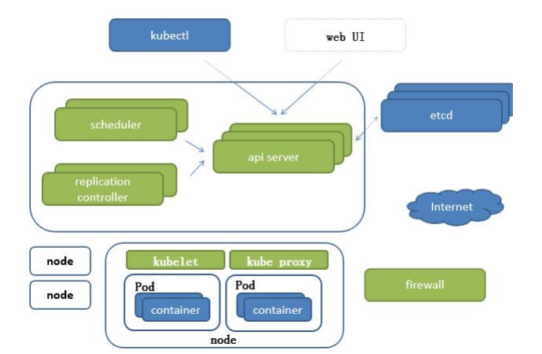

# kubernetes

kubernetes是一个软件系统，依赖于Linux容器的特性来运行异构的应用，它将底层基础设施抽象，简化应用的开发，部署和运维

基础概念： Pod，控制器类型，K8S网络通讯模式

资源清单：掌握资源清单的语法，编写 Pod，掌握Pod 的生命周期

Pod 控制器：掌握各种控制器的特点以及使用定义方式

服务发现：掌握 SVC原理及其构建方式

服务分类：

- 有状态服务：DBMS （数据库管理系统）<-- k8s -->数据持久化存储  
- 无状态服务：LVS，APACHE  <-- docker

存储：掌握多种存储类型的特点，能够在不同环境中选择合适的存储方案

调度器：掌握调度器原理，能够根据要求把Pod 定义到特定的节点运行

安全：集群的认证，鉴权，访问控制，原理及其流程

HELM：类似Linux的yum，掌握 HELM 原理，HELM模板自定义，HELM部署一些常用插件

运维：修改Kubeadm 达到证书可用期限（默认证书一年，一年更新一次），能够构建高可用的 Kubernetes 集群

高可用集群：副本数据最好是3个以上的（3，5，7，9）


## 云计算架构

经典的云计算架构分为三大服务层：

1. IaaS（Infrastructure as a Service）基础设施即服务

   IaaS 层通过虚拟化技术提供计算、存储、网络等基础资源，可以在上面部署各种 OS 以及应用程序。开发者可以通过云厂商提供的 API 控制整个基础架构，无须对其进行物理上的维护和管理

2. PaaS（Platform as a Service）平台即服务

   PaaS 层提供软件部署平台（runtime），抽象掉了硬件和操作系统，可以无缝地扩展（scaling）。开发者只需要关注自己的业务逻辑，不需要关注底层

3. SaaS（Software as a Service，软件即服务）。

   SaaS 层直接为开发者提供软件服务，将软件的开发、管理、部署等全部都交给第三方，用户不需要再关心技术问题，可以拿来即用

## Borg

Google 10年容器化基础架构（GO 语言）      

 特点：

- 轻量级：消耗资源小 
- 开源
- 弹性伸缩 
- 负载均衡：IPVS


# Kubernetes组件



**K8S架构：**

- Master：集群控制节点，执行所有的命令，通常占据一个独立服务器
  - Api Server（kube-apiserver）：所有服务访问唯一入口，提供HttpRest接口的服务进程
  - CrontrollerManager（kube-controller-manager）：所有资源对象的自动化控制中心，维持副本期望数目
  - Scheduler（kube-scheduler）：负责接受任务，选择合适的节点进行分配任务，即资源调度（Pod调度）
  - Etcd：键值对数据库，采用http协议，储存K8S集群所有重要信息。官方将它定位成一个可信赖的分布式键值存储服务，能够为整个分布式集群存储一些关键数据，协助分布式集群的正常运转（可信赖：天生支持集群化，不需要其他组件。正常运转：保存分布式存储持久化的配置信息）
- Nod：除了Master控制节点，Kubernetes集群中的其他机器(工作负载节点)
  - Kubelet：直接跟容器引擎交互实现容器的生命周期管理
  - Kube-proxy：负责写入规则至 IpTables、Ipvs 实现服务映射访问，实现Kubernetes，Service的通信与负载均衡机制的重要组件
  - Docker Engine（docker）：Docker引擎，负责容器创建和管理工作。

**Pod：**

分类（生命周期不一致）  

- 自主式 Pod：Pod 退出了，此类型的 Pod 不会被创建（无法确保稳定性）  
- 控制器管理的 Pod：在控制器的生命周期里，始终要维持 Pod 的副本数目

**编程：**

- 声明式编程（Deployment）：侧重于定义想要什么，然后告诉计算机让它帮你实现。apply>create  
- 命令式编程（ReplicaSet）：侧重于如何实现程序，把实现过程按逻辑一步步写出。   create>apply      

**其他组件：**

- CoreDns：可以为集群中的SVC创建一个域名IP的对应关系解析
- DashBoard：给 K8S 集群提供一个 B/S 结构访问体系
- IngressController：Ingress 可以实现七层代理（官方只能实现四层代理）
- Federatiom：提供一个可以跨集群中心多K8S统一管理功能
- Prometheus：提供K8S集群的监控能力
- Efk：提供 K8S 集群日志统一分析介入平台

# kubernetes集群架构

- 主节点（控制面版）
  - kubernetesAPI服务器
  - Scheculer
  - Controller Manager
  - etcd
- 工作节点
  - 容器（docker，rtk）
  - kubelet
  - kube-proxy


# 部署k8s集群

安装依赖包

```bash
yum install -y conntrack ntpdate ntp ipvsadm ipset jq iptables curl sysstat libseccomp wget vim net-tools git
```

设置防火墙为iptables

```bash
systemctl stop firewalld
systemctl disable firewalld
yum -y install iptables-services && systemctl start iptables && systemctl enable iptables && iptables -F && service iptables save
```


关闭Selinux

```bash
swapoff -a && sed -i  '/ swap / s/^\(.*\)$/#\1/g' /etc/fstab
setenforce 0 && sed -i 's/^SELINUX=.*/SENLINUX=disabled/' /etc/selinux/config
```

调整内核参数

```bash
cat > kubernetes.conf <<EOF
net.bridge.bridge-nf-call-iptables=1
net.bridge.bridge-nf-call-ip6tables=1
net.ipv4.ip_forward=1
net.ipv4.tcp_tw_recycle=0
vm.swappiness=0
vm.overcommit_memory=1
vm.panic_on_oom=0
fs.inotify.max_user_instances=8192
fs.inotify.max_user_watches=1048576
fs.file-max=52706963
fs.nr_open=52706963
net.ipv6.conf.all.disable_ipv6=1
net.netfilter.nf_conntrack_max=2310720
EOF


cp kubernetes.conf /etc/sysctl.d/kubernetes.conf

sysctl -p /etc/sysctl.d/kubernetes.conf
```

关闭系统不需要服务

```bash
systemctl stop postfix && systemctl disable postfix
```

设置日志保存方式（rsyslogd和systemd journald）

```bash
mkdir /var/log/journal
mkdir /etc/systemd/journald.conf.d
cat > /etc/systemd/journald.conf.d/99-prophet.conf <<EOF
[Journal]
Storage=persistent
Compress=yes
SyncIntervalSec=5m
RateLimitInterval=30s
RateLimitBurst=1000
SystemMaxUse=10G
SystemFileSize=200M
SystemMaxUse=10G
MaxRetentionSec=2week
ForwardToSyslog=no
EOF

systemctl restart systemd-journald
```

升级内核为4.44

```bash
rpm -Uvh http://www.elrepo.org/elrepo-release-7.0-3.el7.elrepo.noarch.rpm

yum --enablerepo=elrepo-kernel install -y kernel-lt

grub2-set-default 'CentOS linux (4.4.189-1.el7.elrepo.x86_64)  7 (Core)'
```


# 配置kubernetes集群

## minikube

配置本地单节点集群

> 官方文档：https://minikube.sigs.k8s.io/docs/start/

**Installation**

下载二进制文件并存放

```bash
curl -LO https://storage.googleapis.com/minikube/releases/latest/minikube-linux-amd64

sudo install minikube-linux-amd64 /usr/local/bin/minikube
```

**Start**

```bash
minikube start
```

## kubectl

kubectl CLI客户端用来和kubernetes交互

查看集群信息

```bash
kubectl cluster-info
```


## Google Kubernetes Engine

