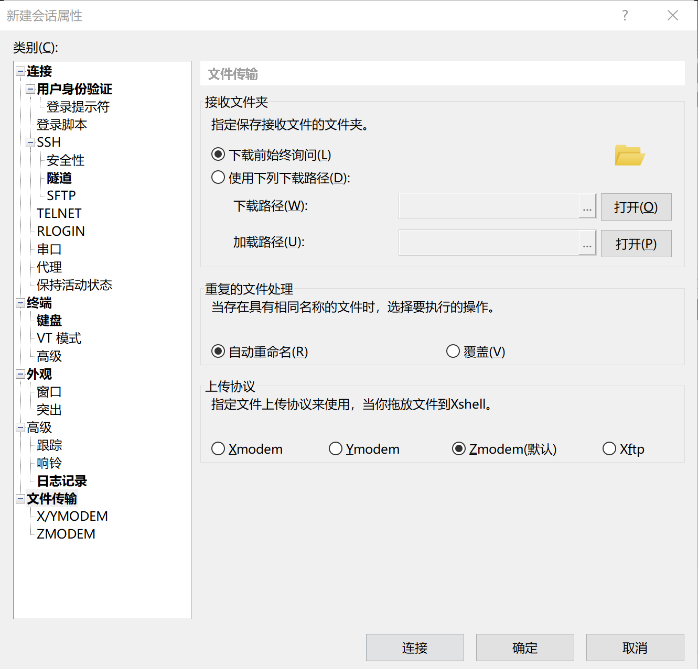

# Linux

1. Linux系统是一个多用户多任务的分时操作系统
2. linux操作系统将所有的设备都看作文件，它将整个计算机的资源都整合成一个大的文件目录
3. Linux系统中用户是按组分类的，一个用户属于一个或多个组。文件所有者以外的用户又可以分为文件所有者的同组用户和其他用户。因此Linux系统按文件所有者、文件所有者同组用户和其他用户来规定了不同的文件访问权限

## 目录结构

 /       根目录
├── bin   存放用户二进制文件
├── boot   存放内核引导配置文件
├── dev   存放设备文件
├── etc   存放系统配置文件
├── home  用户主目录
├── lib   动态共享库
├── lost+found 文件系统恢复时的恢复文件
├── media  可卸载存储介质挂载点
├── mnt   文件系统临时挂载点
├── opt   附加的应用程序包
├── proc  系统内存的映射目录，提供内核与进程信息
├── root  root 用户主目录（~）
├── sbin  存放系统二进制文件
├── srv   存放服务相关数据
├── sys   sys虚拟文件系统挂载点
├── tmp   存放临时文件
├── usr   存放用户应用程序
└── var   存放邮件、系统日志等变化文件


## 用户权限

Linux系统中每个用户的角色和权限划分的很细致，每个文件都设有访问权限来决定用户是否能通过某种方式对文件进行读、写、执行等操作

- `r`：4（100）可读（read）
- `w`：2（010）可写（write）
- `x`：1（001）可执行（execute）

用**数字和**改变权限（三个权限的位置不会改变，如果没有权限显示减号`-`）

- 7：可读可写可执行
- 5：可读可执行
- 4：只读

操作文件的**用户有3种不同类型**

- 文件所有者
- 群组用户
- 其他用户

最高位表示文件所有者的权限值，中间位表示群组用户的权限值，最低位则表示其他用户的权限值

> 不要用chmod 777 指令修改`usr`等文件的权限，系统会崩溃

```bash
# 可读可写可执行
# 三个7分别对应三种用户的权限值
chmod 777 dirName
```


# 常用命令

### su

`switch user`：用于变更为其他使用者的身份

> 除root外，需要输入使用者的密码

`su`和`su -` 的区别：

- `su`是切换用户存取权限，但是没有获得环境变量，所以PATH没有被带入
- `su -`是完全切换用户，可以获得环境变量

```bash
# 显示当前用户
whoami 

# 切换用户，如su root,exit退出
su 用户名
# 切换用户，改变环境变量
su - 用户名

# 使用root权限运行单个命令
sudo 命令
```

> 执行sudo命令时，系统以root用户身份运行命令之前提示输入当前用户帐户的密码， 它不会切换到root用户或需要单独的root用户密码


### uname

`unix name`：显示系统信息

- `-a (--all)`：显示全部的信息
- `-m (--machine)`：显示电脑的处理器架构
- `-n (--nodename)`：显示在网络上的主机名称
- `-r (--release)`：显示操作系统的发行编号（内核版本）
- `-s (--sysname)`：显示操作系统名称
- `-v`：显示操作系统的版本和时间


### cd

`change directory`：切换当前工作目录

> 目录名称省略，则切换到使用者的`home`目录

- `cd /`：跳转到根目录（所有普通用户的父目录都是home目录）即/代表根目录
- `cd ~`：跳转到当前用户的`home`目录
  - 如果是root用户，`cd ~`相当于`cd /root`
  - 如果是普通用户，`cd ~`相当于`cd /home/当前用户名`
- `cd -`：返回**进入此目录之前所在目录**
- `cd ./`：进入当前目录下的某个目录
- `cd ../` 返回上一级目录（`/`可省略）

> `~`表示为home目录 ，`.` 表示目前所在的目录， `..` 表示目前目录位置的上一级目录


### ls

`list files`：按英文字母顺序显示指定工作目录下之内容（文件和子目录)

- `-a`：列出所有目录和文件 （`.`开头的**隐藏文件**也会列出）
- `-l`：列出目录和文件的详细资料（文件名、权限、拥有者、大小等）
- `-d`：仅列出目录本身，而不列出目录的文件数据
- `-r`：将文件以**相反次序**列出
- `-t`：按文件建立时间顺序列出
- `-h`：将文件容量以易读的方式列出（GB，kB等）
- `-F`：在列出的文件名后加符号（可执行档则加`*`, 目录则加`/`）
- `-R`：连同子目录的内容一起列出（递归列出）

> 参数可以组合使用


### passwd

更改使用者的密码

- `-S`：显示密码信息
- `-d`：删除密码

```bash
# 设置ink用户的密码
passwd ink	
```


### pwd

`print work directory`：显示当前工作目录


### mkdir

`make directory`：创建目录


### rmdir

`remove directory`：删除空的目录

```bash
# 在工作目录下的A目录中删除子目录B
# 若B删除后A目录成为空目录，则删除A
rmdir -p A/B
```


### cat

`concatenate`：查看文本文件的内容（从第一行开始）

> 连接文件并打印到标准输出设备上
>
> `tac`：从最后一行开始显示（tac是倒着写的cat）

- `-n (--number)`：由1开始对所有输出的行数**编号**
- `-b (--number-nonblank)`：由1开始对所有输出的行数**编号**，空白行不编号
- `-s (--squeeze-blank)`：当有连续两行以上的空白行，就替换为一行的空白行
- `-v (--show-nonprinting)`：查看文件中是否有`^M`（windows中的回车）
- `-E (--show-ends)` : 在每行结束处显示`$`
- `-T (--show-tabs)`: 将TAB字符显示为`^I`

> `-A (--show-all)`：等价于`-vET`
>
> `-e`：等价于`-vE`
>
> `-t`：等价于`-vT`

```bash
# 清空/etc/test.txt文档内容
cat /dev/null > /etc/test.txt
```

> 在类Unix系统中，`/dev/null`称空设备，是一个特殊的设备文件。它丢弃一切写入其中的数据（但报告写入操作成功），读取它则会立即得到一个EOF


### nl

`number of lines`：将输出的文件内容自动的加上行号（默认空行不加行号）

> 将指定的文件内容添加行号标注后写到标准输出

- `-b`：指定行号样式
  - `-b a`：不论是否为空行都同样列出行号（类似`cat -n`）
  - `-b t`：如果有空行则不列出行号（默认）
  - `-b n`：不打印任何行号
- `-n`：指定行号格式
  `-n ln`：行号左对齐
  `-n rn`：行号右对齐
  `-n rz`：行号右对齐，空格用0填充
- `-w`：指定行号位数（默认六位）


### more

查看文件内容，一页一页翻动

- `-num`：一次显示的行数
- `+num`：从第num行开始显示
- `-p`：不以滚动的方式显示每一页，而是先清空屏幕再显示内容
- `-c`：不以滚动的方式显示每一页、先显示内容再清空屏幕
- `-s`：当遇到有连续两行以上的空白行，就替换为一行的空白行

**操作**

- **space**空格：向下翻**一页**

- **Enter**回车：向下翻n行（默认**一行**）

- **b**：代表往回翻页（只对文件有用）

- **/string**：在显示的内容中**向下**搜寻`string`关键字

- **=**：显示当前行的行号

- **:f**：显示出文件名以及当前显示的行数

- **V**：调用vi编辑器

- **!命令**：调用Shell执行命令

- **q**：退出，不再显示内容

  

### less

查看文件内容，一页一页翻动

- `-b <缓冲区大小>`：设置缓冲区的大小
- `-e`：当文件显示结束后，自动离开
- `-f`：强制打开特殊文件（例如外围设备代号、目录和二进制文件）
- `-g`：只标志最后搜索的关键词
- `-i`：忽略搜索时的大小写
- `-m`：显示百分比
- `-N`：显示每行的行号
- `-o <文件名>`：将less输出的内容在指定文件中保存起来
- `-s`：当遇到有连续两行以上的空白行，就替换为一行的空白行

**操作**

- **space**空格：向下翻**一页**
- **Enter**回车：向下翻**一行**
- **u**：向上翻半页
- **y**：向上翻一行
- **pagedown**： 向下翻一页
- **pageup**： 向上翻一页
- **b**：向上翻一页
- **d**：向后翻半页
- **h**：显示帮助界面
- **/string**：在显示的内容中**向下**搜寻`string`关键字
- **/string**：在显示的内容中**向上**搜寻`string`关键字
- **Q**：退出


### head

显示文件前几行

- `-n num`：显示前num行（默认显示前十行）
- `-c num`：显示num字节

```bash
# 显示前20行
head -n 20 /etc/man.config
```


### tail

显示文件后几行

- `-n num`：显示后num行（默认显示最后十行）
- `-n +num`：显示第num行到末尾（默认显示最后十行）
- `-c num`：显示num字节
- `-f`：显示正在改变的日志文件（`ctr+c`结束）

```bash
# 显示最后20行
tail -n 20 /etc/man.config

# 显示从第20行到文件末尾
tail -n +20 /etc/man.config

# 跟踪文件
# 当将某些行添加到man.config文件时，tail命令会继续显示这些行，直到按下Ctrl+C停止
# 只要 更新就可以看到最新的文件内容
tail -f /etc/man.config
```

### grep

### find

### rm

`remove`：删除目录或者文件

- `-i`：删除前询问确认
- `-f`：直接强行删除，无需确认（即使属性是只读）
- `-r`：向下递归删除（不管有多少级目录）

删除文件可以直接使用`rm`命令，若删除目录则必须配合选项`-r`

```bash
# 删除当前目录下的所有文件及目录
rm -rf ./*
```


### mv

- 为文件或目录改名
- 将文件从一个目录移入另一个目录中（剪切）
  - 目标文件是文件夹，则源文件直接移动到该文件夹内，名字不变
  - 目标文件是文件，则源文件移动的同时还会更改名字
  - 源文件为多个，则目标必须是目录，并且统一移动到目录下

`mv [options] 源文件或目录 目标文件或目录`

**参数**

`-b`：当目标文件存在时，先进行备份在覆盖

`-f`：当目标文件存在时，强制覆盖（指定此参数后`i`参数将不再起作用）

`-i`：当目标文件存在时，询问是否覆盖（默认选项）

`-v`：显示过程

```bash
# 将文件test.txt重命名为ink.txt：
mv test.txt ink.txt

# 将/usr/ink中的所有文件移到当前目录(用.表示)中：
mv /usr/ink/* .

# 将当前目录的一个子目录里的文件移动到另一个子目录里
mv 文件名/*  另一个目录

# 移动当前文件夹下的所有文件到上一级目录
mv * ../另一个目录
```


### netstat

用于显示系统的网络状态

- `-a/--all`：显示所有socket套接字，包括正在监听的（LISTEN）
- `-n/--numeric`：直接显示IP地址，而不通过域名服务器（可以加速操作）
- `-p/--programs`：显示正在使用Socket的进程标识符和程序名称
- `-l/--listening`：仅显示监听的服务器的socket
- `-t/--tcp`：显示TCP端口
- `-u/--udp`：显示UDP端口

> 关闭端口对应进程：`kill -9 pid`
>
> **windows**
>
> - 查看系统当前使用所有端口：`netstat -ano`
> - 查看已知的端口是否被占用：`netstat -ano |findstr 1081`

```bash
# -anp常用来筛选
# 查看已知的端口是否被占用
netstat -anp |grep 9100

# 查看服务器已使用的所有端口
netstat -nultp
```


### shutdown

可以用来关机，也可以用来重启

- `-h`：关机
- `-r`：重启
- `-n`：强行关闭所有执行程序后自行关机
- `-t`: 设定在**几秒钟之后**关机
- `-c`：取消目前已经进行中的关机指令

```bash
# 立即关机
shutdown -h now

# 在10分钟后关机
shutdown -h 10

# 重新启动相当于reboot
shutdown -r now

# 取消进行中的关机指令
shutdown –c
```

# 修改root密码

1. 重启Linux系统主机

2. 在出现引导界面时，按下键盘上的`e`键进入内核编辑界面

3. 在`linux16`参数这行的最后面追加`rd.break`参数

4. 按下`Ctrl + X`组合键来运行修改过的内核程序 

5. ```bash
   mount -o remount,rw /sysroot
   chroot /sysroot
   passwd
   touch /.autorelabel
   exit
   reboot
   ```

# 挂载


# /etc/passwd

- 在`/etc/passwd`文件中每个用户都有一个对应的记录行，它记录了这个用户的一些基本属性
- 系统管理员经常修改这个文件的以完成对用户的管理工作
- 这个文件对所有用户都是可读的


记录行被**冒号分隔为7个字段**，其格式和具体含义如下：

**用户名**:**口令**:**用户标识号**:**组标识号**:**注释性描述**:**主目录**:**登录Shell**

1. **用户名(login_name)**：代表**用户账号**的字符串。通常长度不超过8个字符，由大小写字母和/或数字组成。**登录名中不能有冒号**（冒号在这里是分隔符）

   > 为了兼容起见，登录名中最好不要包含`.`，不要使用`-`和`+`开头

2. **口令(passwd)**：存放加密后的用户口令，这个字段存放的只是用户口令的**加密串**，不是明文，由于`/etc/passwd`文件对所有用户都可读，所以它一个安全隐患。

   > 现在许多Linux系统都使用了**shadow技术**，把真正的加密后的用户口令字存放到`/etc/shadow`文件中，而在`/etc/passwd`文件的口令字段中只存放一个特殊的字符，例如`x`或者`*`

3. **用户标识号(UID)**：系统内部用它来标识用户。一般情况下它与用户名是一一对应的。**如果几个用户名对应的用户标识号是一样的，系统内部将把它们视为同一个用户**，但是它们可以有不同的口令、不同的主目录以及不同的登录Shell等

   UID取值范围是0-65535

   - 0是超级用户root的标识号
   - 1-99由系统保留作为管理账号
   - 普通用户的标识号从100开始（在Linux系统中界限是500）

4. **组标识号(GID)**：用户所属的用户组。它对应着`/etc/group`文件中的一条记录

5. **注释性描述(users)**：记录用户的一些个人情况（例如用户的真实姓名、电话、地址等）

   > 这个字段并没有什么实际的用途。不同的Linux系统中格式没有统一。在许多Linux系统中这个字段存放的是一段任意的注释性描述文字，用做finger命令的输出

6. **主目录(home_directory)**：用户的起始工作目录，它是**用户在登录系统后所处的目录**

   > 在大多数系统中，用户的主目录都被组织在同一个特定的目录下，而用户主目录的名称就是该用户的登录名。各用户对自己的主目录有读、写、执行（搜索）权限，其他用户对此目录的访问权限则根据具体情况设置

7. **登录Shell(Shell)**：用户登录后要启动一个进程，**负责将用户的操作传给内核**，这个进程是用户登录到系统后运行的命令解释器或某个特定的程序（即Shell）。**Shell是用户与Linux系统之间的接口**

   Linux的Shell有许多种，每种都有不同的特点

   - sh(BourneShell)
   - bash(BourneAgainShell)
   - csh(CShell)

   系统管理员可以为用户指定Shell。如果不指定Shell，**系统使用sh为默认的登录Shell**（字段值为`/bin/sh`）


# Anaconda

```bash
# 下载
wget https://mirrors.tuna.tsinghua.edu.cn/anaconda/archive/Anaconda3-5.2.0-Linux-x86_64.sh
# 安装
sh Anaconda3-5.2.0-Linux-x86_64.sh

# 创建环境
conda create --name env_name

# 启用环境
conda activate env_name
```

> 提示环境存放路径
>
> environment location: /usr/local/anaconda3/envs/buaa_test
>
> 添加环境变量
>
> export PATH=/root/anaconda3/bin:$PATH
>
> source ~/.bashrc


# 打包压缩

linux主要有三种压缩方式：

1. `gzip`：压缩这速度最快，压缩大文件的时候与其他的压缩方式相比更加明显，历史最久，应用最广泛的压缩方式
2. `bzip`：压缩形成的文件小，但是可用性不如gzip
3. `xz`：最新的压缩方式，可以自动提供最佳的压缩率

> 压缩速度：gz > bz2 > xz
> 压缩率：xz > bz2 > gz

Linux中	

- 打包文件一般是以`.tar`结尾的
- 压缩文件一般是以`.gz`（gzip）结尾的

一般情况下**打包和压缩是一起进行的**，打包并压缩后的文件的后缀名一般是`.tar.gz`

**打包跟压缩的区别**

- 打包是指将多个文件或者目录放在一起，形成一个总的包，这样便于保存和传输，但是**大小是没有变化的**
- 压缩是指将一个或者多个大文件或者目录通过压缩算法使文件的体积变小以达到压缩的目的，可以节省存储空间，**在压缩的时候通常是先打包再压缩**

## tar

- tar命令参数前面加不加`-`执行命令的结果是没有区别的，区别只要是在于linux风格方面
- tar命令会自己选择跟压缩方式对应的方式去解压


**常用参数**：

- `-z`（--gzip）：使用gzip工具（解）压缩，后缀为`.gz`
- `-j`（--bzip2）：使用bzip2工具（解）压缩，后缀为 `.bz2`
- `-J`：使用xz工具（解）压缩，后缀为 `.xz`

- `-c`（--create）：打包文件，后缀为`.tar`

- `-x`（--extract）：解压缩、提取打包的内容

- `-v`：显示压缩或者打包过程

- `-t`（--list）：查看压缩包内容

  > 不和`-c`，`-x`同时出现

- `p`  保留备份数据的原本权限与属性

  > 常用于备份重要的配置文件

- `-P`  保留绝对路径

  > 在压缩文件的时候使用了`-P`，那么在解压的时候也要加上`-P`

- `-f`（--file）：指定文件名（后面接压缩后的包名）

  > tar命令中`-f`是必选的，且放在所有参数的最后（右）

- `-C`：指定解压缩包内容和打包的内容存放的目录

  > tar  参数  被解压的文件名   -C 指定目录

- `--exclude`：压缩或打包时排除指定的文件

```bash
# 常用压缩参数组合：zcvf
tar -zcvf xxx.tar.gz filename1 filename2

# 常用解压参数组合：
# 后缀名为.tar.gz的压缩包用zxvf
tar -zxvf xxx.tar.gz dir_name

# 后缀名为.tar的压缩包用xvf
tar -xvf xxx.tar.gz dir_name
```


**增量备份**

`-g`：后接增量备份的快照文件（备份目录最好用相对路径）

## zip unzip

**安装**

```bash
# 在 Ubuntu 和 Debian 上安装解压缩
sudo apt install unzip

# 在 CentOS 和 Fedora 上安装解压缩
sudo yum install unzip
```


**zip常用参数**：

- `-m`：将文件压缩后，删除原文件
- `-o`：将压缩文件内的所有文件的最新变动时间设为压缩的时间
- `-q`：在压缩的时候不显示指令执行的过程（安静模式）
- `-r`：递归压缩，将自定**目录下**的所有子文件以及文件一起处理
- `-x`：压缩时排除指定的文件

**unzip常用参数**：

- `-c`：显示解压缩的结果，并没有解压压缩包

  > 显示每一个目录下的每一个文件的内容，同时对字符做适当的转换

- `-l`：显示压缩包内所包含的文件

- `-t`：检查压缩文件是否正确

  > OK表示正确

- `-v`：执行时显示压缩文件的详细信息

  > 使用`-v`显示的信息比使用`-l`显示的信息更加详细

- `-q`：执行时不显示任何信息（安静模式）

- `-d`：指定文件解压后存储的目录

- `-x`：解压缩时排除指定的文件

```bash
# 压缩成zip格式
zip -q -r filename.zip

# 解压zip格式的压缩包
unzip filename.zip -d dir_name
```


# 文件传输

- **Linux文件传输到Windows**
- **Windows文件传输到Linux**
- **Linux文件传输到Linux**

## rz sz

**安装**

```bash
# 查看是否安装lrzsz
rz

# CentOS安装
sudo yum -y install lrzsz

# Ubuntu下安装
sudo apt-get install lrzsz

# 确认是否正确安装
rpm -qa lrzsz
```

**传输**

```bash
# Windows向Linux传输文件，路径默认是linux服务器当前目录
rz

# Linux向Windows传输文件
sz filename
```

**修改传输路径**




# SSH

`Secure Shell`（SSH）

目前较可靠的，专为远程登录会话和其他网络服务提供安全性的**协议**。通过 SSH Client 可以连接到安装运行了 SSH Server 的远程机器上

SSH 的连接分为两步：

- 客户端和服务端建立连接
- 用户身份鉴权

## SSH连接

**客户端和服务端建立连接**

1. 客户端联系服务端，双方沟通自己支持的SSH协议的版本，约定使用某个共同支持的版本
2. 服务端将自己的`Host Key`，加密方法和其他一些参数发给客户端
3. 客户端通过服务端发送的`Host Key`验证服务端身份，双方用服务端发来的参数和`Diffie-Hellman`算法生成`Session Key`
4. 加密通道建立完成

**Host Key**

Host Key由SSH自行生成，分为两种：

- Public Key
- Private Key

服务端拥有Public Key和Private Key，并将Public Key发送给客户端

如果客户端通过Host Key发现从来没有连接过这台服务器，会询问用户是否要继续连接，用户同意连接后客户端会在本地的`.ssh\known_hosts`文件记录这台服务器的信息，下次连接时客户端就不会再次询问用户

**证书**

仅靠服务端发送Host Key的方法无法防范中间人攻击，后来又出现了Public Key Certificates，由一个可靠的第三方机构给服务端签发证书从而确保了安全性

**Session Key**

Session Key用于连接之后通讯时**对消息进行加密和解密**

使用Session Key加密的机制被称作**对称加密**（Symmetric Encryption），也就是两端使用的相同的Key来加密和解密信息

> SSH传输信息的加密解密时并不是用生成的Public Key或Private Key，而是用Session Key


**Session Key生成**

1. 客户端和服务端使用沟通后确定的加密算法以及双方都知道的一个数字
2. 客户端和服务端各自生成只有自己才知道的private密码，并用它对数字进行加密生成**新的密码**
3. 客户端和服务端交换各自加密后的密码
4. 客户端和服务端分别将对方发来的密码再加上自己的private密码，从而得到相同的Session Key


**用户身份鉴权**

在客户端生成的Public Key和Private Key就是用来进行身份鉴权的，客户端需要将Public Key上传到服务器上（改名为Authorized Key）

1. 客户端用Private Key生成签名向服务器发起登录请求
2. 服务端验证签名（检查自己有没有和这个签名匹配的Public Key）
3. 服务端生成一串随机字符串，用Public Key加密后发送给客户端
4. 客户端用对应的Private Key解密字符串，再使用MD5 hash 和Session Key加密该字符串，将加密后的字符串发送给服务端
5. 服务端使用同样的MD5 hash 和Session Key计算这串字符的加密结果，并和客户端发来的结果做比对，结果一样则允许登录
6. 然后双方将使用Session Key进行通讯

使用Public Key和Private Key的加密机制被称作**不对称加密**（Asymmetry Encryption），即使用不同的Key来对信息进行加密解密。

客户端使用Private Key可以解密服务端使用Public Key加密的信息，服务端使用Public Key 无法解密客户端使用Private Key发来的加密信息

> 身份鉴权除了使用Host Key登录，也可以使用密码登录


## SSH Server

**CentOS**

- OpenSSH Server安装完成后在`/etc/init.d`目录下会增加一个名为**sshd**的服务
- 配置信息保存目录：`/etc/ssh`
- sshd服务配置文件：`/etc/ssh/sshd_config`

> 通常Linux系统会默认安装openssh的客户端软件**openssh-client**，需要自己安装服务端**openssh-server**

```bash
yum install openssh-server

# 查看服务
chkconfig --list sshd

# 手动启动sshd服务
/etc/init.d/sshd start
```

**Ubuntu**

```bash
sudo apt-get update

sudo apt-get install openssh-server

# 生成SSH钥匙后开启openssh服务
sudo /etc/init.d/ssh start

# 验证
ps -e | grep ssh
```


## SSH Client

**连接远程机器**

- `user`：远程机器上登录的用户名，如果不指定的话默认为当前用户
- `remote`：远程机器的地址，可以是 IP，域名或者是**别名**
- `port`：SSH Server 监听的端口，如果不指定的话就为默认值22

> 执行了 `ssh` 命令之后远程机器会询问密码。输入密码时屏幕上不会显示明文密码，也不会显示 `******`（隐藏密码长度）

```bash
ssh user@remote -p port
```


## SSH密钥

在客户端生成SSH密钥

- `-t`表示类型选项，采用`rsa`加密算法
- 要求设置保存位置，一般存放在默认路径，回车即可
- 要求设置私钥口令`passphrase`，不设置则为空

```bash
ssh-keygen -t rsa
```

会在`/home/当前用户`目录下生成`.ssh`文件夹

- **公钥**： `~/.ssh/id_rsa.pub`
- 私钥： `~/.ssh/id_rsa`

> RSA密钥对也可以在服务器生成
>
> - 公钥在服务器端：`~/.ssh/authorized_keys`
> - 私钥在客户端：`/home/当前用户/.ssh/id_rsa`


将**公钥**`id_rsa.pub`上传到远程服务器的 `~/.ssh`目录，并改名为`authorized_keys`

```bash
ssh-copy-id -i .ssh/id_rsa.pub user@remote -p port
mv id_rsa.pub authorized_keys
```

没有 `ssh-copy-id` 的情况（比如在 Windows 上）

在远程服务器上新建 `.ssh` 目录，然后把**公钥**`id_rsa.pub` **追加**到远程主机的 `.ssh/authorized_keys` 中

> `mkdir -p`：递归创建目录，当上级目录不存在时会按目录层级自动创建目录

```bash
ssh user@remote -p port 'mkdir -p .ssh && cat >> .ssh/authorized_keys' < ~/.ssh/id_rsa.pub
```


**配置别名**

登录不用每次输ip

```bash
# 修改bashrc
sudo vim ~/.bashrc
# 在最下面附加 
alias nlsde="ssh user@remote" 
# 更新
source ~/.bashrc
```

或者在 `~/.ssh/config` 里面追加内容，保存后即可用 `ssh nlsde` 登入

```
Host nlsde
    HostName remote
    User user
    Port port
```


## know_hosts

ssh会把你每个你访问过计算机的公钥(public key)都记录在known_hosts。当下次访问相同计算机时，OpenSSH会核对公钥。如果公钥不同，OpenSSH会发出警告， 避免你受到DNS Hijack之类的攻击。

从上面的图中可以看出，known_hosts中的格式是

```
CopyIp或域名  主机名 host-key
```

## Windows连接服务器

>  ssh会把你每个你访问过计算机的公钥(public key)都记录在~/.ssh/known_hosts

1. 在**应用和功能**里的**管理可选功能**中**开启openss服务**

2. 搜索`服务`，在服务里将`openssh Authentication Agent`设置为**自动启动**并启动

3. **创建无密密钥**

   ```bash
   ssh-keygen  -t  rsa
   ```

## Xshell连接云服务器

1. **腾讯云生成密钥**

   1. 下载密钥文件`ink.pem`

   2. 点击刚创建的SSH密钥，复制其中的**公钥**，然后放在同一个文件夹中

      > 公钥的名称和密钥一样，后缀为`.pub`，密钥没有文件名后缀

2. **绑定云主机**

3. **Xshell加载密钥**

   1. 点击XShell左上角的新建连接按钮，输入主机名和ip，点击连接
   2. 账号密码登录，输入密码
   3. SSH登录，选择下载的密钥`ink.pem`(腾讯云生成的时候没有密码，不用输入)

## 服务器端口

> CentOS 7.0默认使用firewall作为防火墙

**nmap**

```bash
# 安装(非最新)
yum install nmap
# 无法更新
yum update nmap
# 安装最新版本
# 先卸载
yum remove nmap
rpm -vhU https://nmap.org/dist/nmap-7.70-1.x86_64.rpm
```

查看端口

```bash
# 查看主机当前开放的端口
nmap localhost    
# 查看主机端口（1024-65535）中开放的端口
nmap -p 1024-65535 localhost  
# 探测目标主机开放的端口
nmap -PS 192.168.21.163    
# 探测所列出的目标主机端口            
nmap -PS22,80,3306  192.168.21.163   
# 探测目标主机操作系统类型
nmap -O 192.168.21.163
# 探测目标主机操作系统类型
nmap -A 192.168.21.163  
# 更多nmap参数请查询帮助信息
nmap --help                             
```

8080端口

```bash
# 开启端口
firewall-cmd --zone=public --add-port=8080/tcp --permanent
# 关闭端口
firewall-cmd --permanent --remove-port=9200/tcp
# 重启防火墙
systemctl restart firewalld.service
```


# WSL

`Windows Subsystem for Linux（`简称WSL）是一个为在Windows 10上能够原生运行**Linux二进制可执行文件**（ELF格式）的兼容层

WSL不是虚拟机而是子系统，是Windows的一部分，并不像虚拟机一样与宿主系统隔离，**windows下的所有文件在Linux subsystem里都有映射的**，所以在Linux subsystem里运行一些危险指令也会影响到Windows

目标是使纯正的Ubuntu 14.04 "Trusty Tahr"映像能下载和解压到用户的本地计算机，并且映像内的工具和实用工具能在此子系统上原生运行。

> 它是由微软与Canonical公司合作开发

## 安装

1. 启用适用于Linux的Windows子系统：

   1. 使用管理员身份打开 PowerShell，执行以下命令：

      ```bash
      dism.exe /online /enable-feature /featurename:Microsoft-Windows-Subsystem-Linux /all /norestart
      ```

   2. 或者在搜索栏中搜索并打开**启用或关闭Windows功能**，勾选**适用于Linux的Windows子系统**项

   3. 重启

2. 检查运行 WSL 2 的要求

   安装WSL2，对不同架构的 CPU有不同的 Win10版本要求，需要确保Win10版本号为 2004（内部版本19041或更高）即可。

   使用 `win + r` 输入 `winver` 可快速查看 Windows 版本。如果Win10版本号低于 2004，可使用Windows 10易升工具手动升级。下载 Windows 10 易升工具，下载后运行等待完成升级即可

   ```bash
   https://www.microsoft.com/zh-cn/software-download/windows10
   ```

3. 启用虚拟机功能

   以管理员身份打开 PowerShell 并运行：

   ```bash
   dism.exe /online /enable-feature /featurename:VirtualMachinePlatform /all /norestart
   ```

4. 下载 Linux 内核更新包并运行

   > 提示：WSL 2 需要更新其内核组件。有关信息，请访问 https://aka.ms/wsl2kernel

5. 将WSL2设置为默认版本

   ```bash
   wsl --set-default-version 2
   ```

6. 在微软应用商店搜索Linux，选择合适的发行版，这里选用Ubuntu 18.04 LTS

7. 启动Ubuntu 18.04 LTS，创建用户名及密码

8. 验证：查看WSL版本，确保WSL的版本为 2.0

   ```bash
   $ wsl -l -v
   ```
   
9. 设置WSL的默认版本

   ```bash
   wsl --set-version Ubuntu-18.04 2
   ```


## 账号

**Ubuntu 18.04 LTS**

```sh
#给root设置密码
su passwd root

#切换root
su root
```

## 查看文件

1. 在 Linux 查看windows其他分区（WSL可以将其它盘符挂载在`/mnt` 下），windows中C、D、E盘都对应在子系统中`/mnt`目录中

2. 在 Windows 下查看 WSL 文件位置

   wsl ubuntu 文件在本地磁盘的位置

   ```bash
   # 绝对路径
   C:\Users\用户\AppData\Local\Packages\CanonicalGroupLimited.Ubuntu18.04onWindows_79rhkp1fndgsc\LocalState\rootfs
   ```

## 安装git

```bash
#确保系统和apt包列表完全更新
sudo apt-get update -y
sudo apt-get upgrade -y

# 安装
sudo apt-get install git

# 验证
git --version

# 个人信息
git config --global user.name "ink"
git config --global user.email "541640794@qq.com"

# 查看(q+enter退出)
git config --list
```

配置ssh

# oh-my-zsh

> Linux发行版的默认命令解释器是Bash
>
> Zsh就是另一个常用的命令解释器，相比于默认的 Bash，Zsh有更多的自定义选项，并支持扩展。因此Zsh可以实现更强大的命令补全，命令高亮等一系列酷炫功能
>
> 默认的Zsh配置比较麻烦。在GitHub 上有一个配置文件oh-my-zsh，是目前为止最流行的Zsh配置


在PowerShell中**安装Powerline字体集合**

> 安装额外的字体来支持oh-my-zsh显示特殊的符号

```bash
git clone https://github.com/powerline/fonts.git
cd fonts
.\install.ps1
```

**安装**zsh

```bash
sudo apt update
sudo apt install git zsh -y

#查看是否已安装了zsh
zsh --version
```

**安装oh-my-zsh**

```bash
sh -c "$(curl -fsSL https://raw.githubusercontent.com/ohmyzsh/ohmyzsh/master/tools/install.sh)"
```

配置zsh，将主题设置为 `agnoster`

```bash
# 配置 zsh
vim ~/.zshrc
# 修改ZSH_THEME
```

打开 WindowsTerminal 的JSON配置文件，在 `schemes` 中添加一个主题（主题名随意） 这里为`inswsl2`，并把字体改为一个 Powerline 字体：

```json
"schemes": [
    {
        "name" : "inkwsl2",
        "background" : "#002B36",
        "black" : "#002B36",
        "blue" : "#268BD2",
        "brightBlack" : "#657B83",
        "brightBlue" : "#839496",
        "brightCyan" : "#D33682",
        "brightGreen" : "#B58900",
        "brightPurple" : "#EEE8D5",
        "brightRed" : "#CB4B16",
        "brightWhite" : "#FDF6E3",
        "brightYellow" : "#586E75",
        "cyan" : "#2AA198",
        "foreground" : "#93A1A1",
        "green" : "#859900",
        "purple" : "#6C71C4",
        "red" : "#DC322F",
        "white" : "#93A1A1",
        "yellow" : "#B58900"
    }
],
```

然后在该JSON文件中把 wsl 终端的主题设置为该 `inkwsl2` 主题，并把字体改为喜欢的一个 Powerline 字体：

```json
            {
                "guid": "{c6eaf9f4-32a7-5fdc-b5cf-066e8a4b1e40}",
                "hidden": false,
                "name": "Ubuntu-18.04",
                "colorScheme": "inkwsl2",
                "source": "Windows.Terminal.Wsl",
                "fontFace": "DejaVu Sans Mono for Powerline"
            },
```

再做一点美化：把命令行的机器名称去掉，并调整用户名的背景色。编辑 agnoster 主题文件：

显示行号：按esc按`:`输入`set nu`

```bash
vi ~/.oh-my-zsh/themes/agnoster.zsh-theme

# 把 92 行修改为
prompt_segment green black "%(!.%.)%n"
```


# MobaXterm

- 支持各种连接 SSH，X11，RDP，VNC，FTP，MOSH
- 支持 Unix 命令(bash，ls，cat，sed，grep，awk，rsync，…)
- 连接 SSH 终端后支持 SFTP 传输文件
- 各种丰富的插件(git/dig/aria2…)
- 可运行 Windows 或软件


# WindowsTerminal

**设置默认Ubuntu**

点击标签右边的下拉三角-选择设置-打开JSON 配置文件-在`profiles`-`list`中找到Ubuntu的guid复制-粘贴到文件开头的 `defaultProfile` 的值

# Shell

