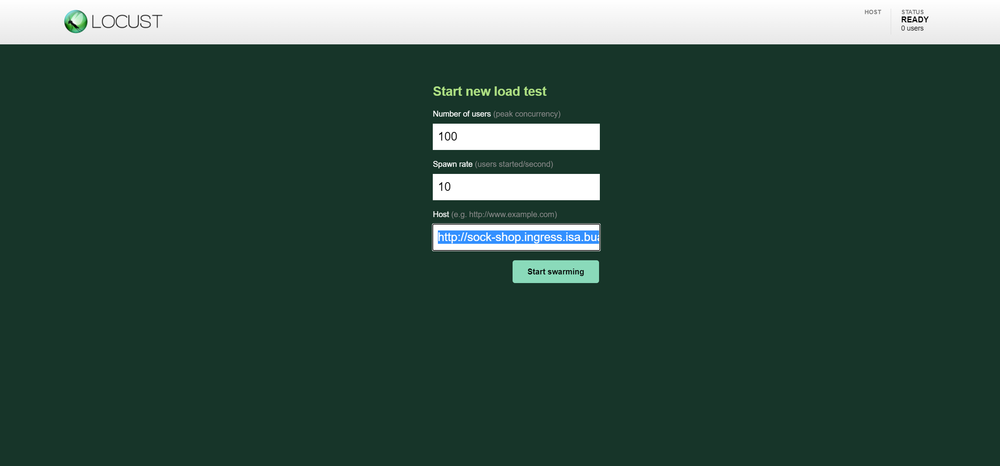
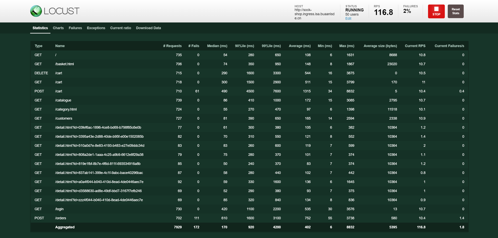
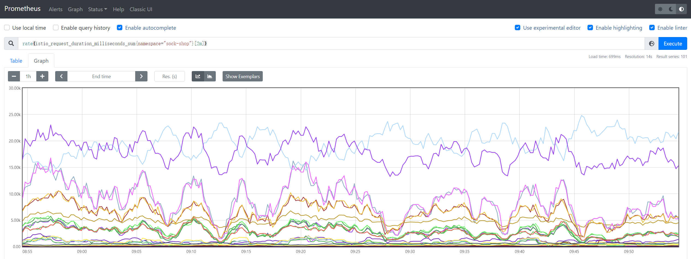
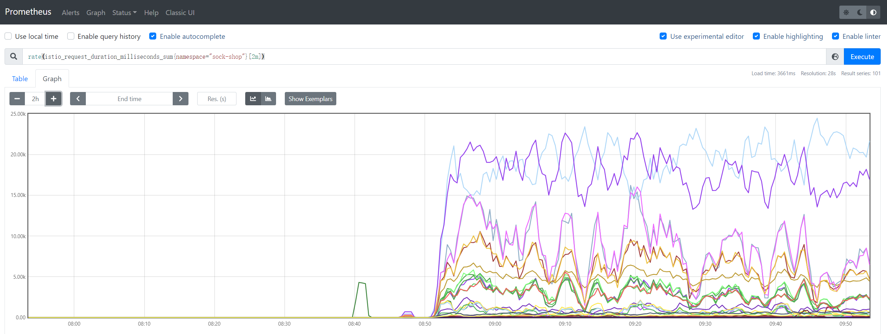

# Locust

> 蝗虫

[Locust - A modern load testing framework](https://locust.io/)

## 定义

- 开源性能测试工具，基于Python开发
- 使用Python代码来定义用户行为，可以模拟百万计的并发用户访问系统
- 完全基于事件和异步方法（协程），一个locust节点也可以在一个进程中支持数千并发用户
- 不使用回调，通过[gevent](http://www.gevent.org/)使用轻量级过程（即在自己的进程内运行）

## 特点

- 不需要编写笨重的UI或者臃肿的XML代码，基于协程而不是回调
- 有一个基于we简洁的HTML+JS的UI用户界面，可以实时显示相关的测试结果
- 支持分布式测试，用户界面基于网络，因此具有跨平台且易于扩展的特点
- 所有繁琐的I/O和协同程序都被委托给gevent，替代其他工具的局限性

## 局限

- 目前其本身对测试过程的监控和测试结果展示不如jmeter全面和详细


## 安装

```bash
pip install locust
```

# locustfile

- **定义一个任务类**，类继承`TaskSequence`类或`TaskSet`类（从`locust`包中引入`TaskeSequence`或`TaskSet`类）
- 当类里面的任务请求有先后顺序时，继承`TaskSequence`类， 没有先后顺序继承`TaskSet`类
- `Locust`将为每个正在模拟的用户生成一个`Locust`类实例

## TaskSet类

- `TaskSet`是任务的集合，这些任务是普通的python可调用对象
- 声明任务的典型方式是使用[task](https://docs.locust.io/en/stable/api.html#locust.core.task)装饰器`@task`（从`locust`包中引入`task`）
  - `task`修饰的方法就是一个任务，一个任务就可以是很多个接口的请求

### 启动负载测试

1. Locust类的每个实例将开始执行其TaskSet
2. 每个TaskSet将选择一个任务并调用它
3. 然后它将等待Locust类的wait_time方法指定的秒数（除非已直接在TaskSet上声明了wait_time方法，在这种情况下，它将使用自己的方法）
4. 然后它将再次选择要调用的新任务，再次等待...


## task_set

task_set属性应该指向一个TaskSet类，这个类定义了用户的行为(即最开始写的类)

- `task_set = MyTaskSet`

也可以通过设置[`tasks`](https://docs.locust.io/en/stable/api.html#locust.core.TaskSet.tasks)属性来定义TaskSet的任务（列表或字典）

- 如果task属性被定义在列表中，那么每次执行任务时都将从tasks属性中随机选择任务
  - `tasks = [WebTasks]`（`class WebTasks(TaskSet)`）
- 如果tasks是一个带有关健字和数值调用的字典，被执行的任务将会被随机选择以数字的比率来执行
  - `{task: 3, another_task:1}`

### wait_time

- 声明一个[wait_time](https://docs.locust.io/en/stable/api.html#locust.core.Locust.wait_time)方法，用于确定模拟用户在执行任务之间将等待多长时间
- Locust提供了一些内置的函数用于返回wait_time的方法，最常用的是[between](https://docs.locust.io/en/stable/api.html#locust.wait_time.between)，可以使模拟的用户在每次执行任务后等待介于最小值和最大值之间的随机时间
  - 每个用户将在任务之间等待0.1到0.3秒：`wait_time = between(0.1, 0.3)`	

> 其他内置的等待时间函数有[constant](https://docs.locust.io/en/stable/api.html#locust.wait_time.constant)和[constant_pacing](https://docs.locust.io/en/stable/api.html#locust.wait_time.constant_pacing)


### client属性

- HttpSession的一个实例，可用于发送HTTP请求，
- 该请求将使用`get`，`post`，`put`，`delete`，`head`，`patch`和`options`方法的统计数据提交给Locust
- `TaskSet`类有一个属性`client`，该属性返回`self.locust.client`
  - `self.client.get("/")`

> HTTP client


# 运行

运行性能测试脚本

- 可以用`-f`参数和`--host`参数指定脚本文件和测试网站
- 可以用`--web-host`和`-P`参数指定ip和端口
  - ip不能带`http://`
- `--step-load`参数可以增加步长压力，实现负载测试
```python
locust -f sample.py --host=https://www.baidu.com

locust -f sample.py  --web-host ip -P port

locust -f sample.py --step-load


# locust -H "http://sock-shop.ingress.isa.buaanlsde.cn" -f locustfile.py --worker

# locust -H "http://sock-shop.ingress.isa.buaanlsde.cn" -f locustfile.py -u 100 -r 20 --headless --run-time=60m --csv=example

# locust -H "http://sock-shop.ingress.isa.buaanlsde.cn" -f locustfile.py -u 2 -r 2
```

输入`locust`，打开UI界面：[http://localhost:8089/](http://localhost:8089/)，运行成功显示如下

> 默认打开0.0.0.0，需要修改为localhost



- Number of users：设置模拟的用户总数（50）
- Spawn rate（users started/second）：每秒启动的虚拟用户数（1）
- Host：服务地址（http://sock-shop.ingress.isa.buaanlsde.cn）
- Number of users to increase by step：逐步增加的用户数
- Step duration：步长持续运行时间
- Start swarming：执行locustfile脚本

50个用户，每秒启动一个用户，结果如下

- RPS：Total Requests per Second



查看请求数量变化率



前后对比

- 前面零星的请求是手动在网站测试的


