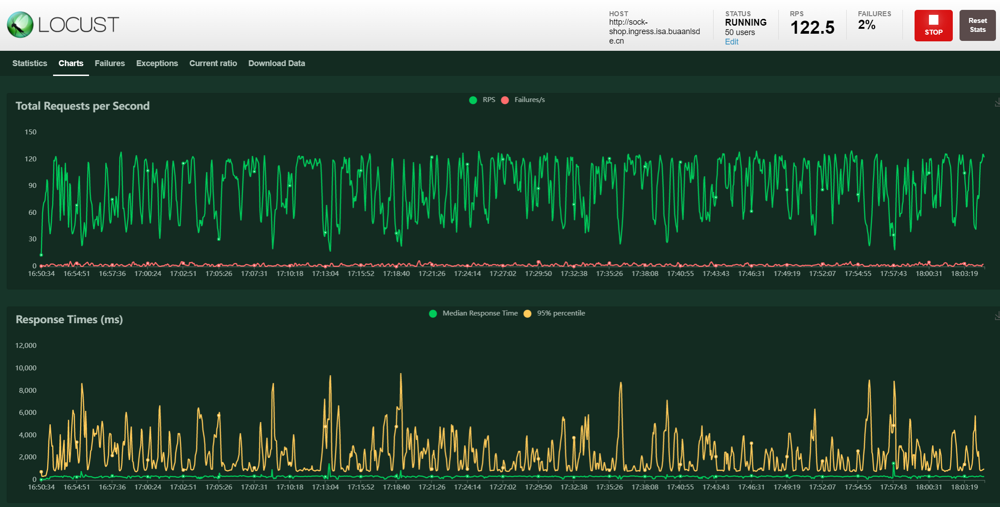
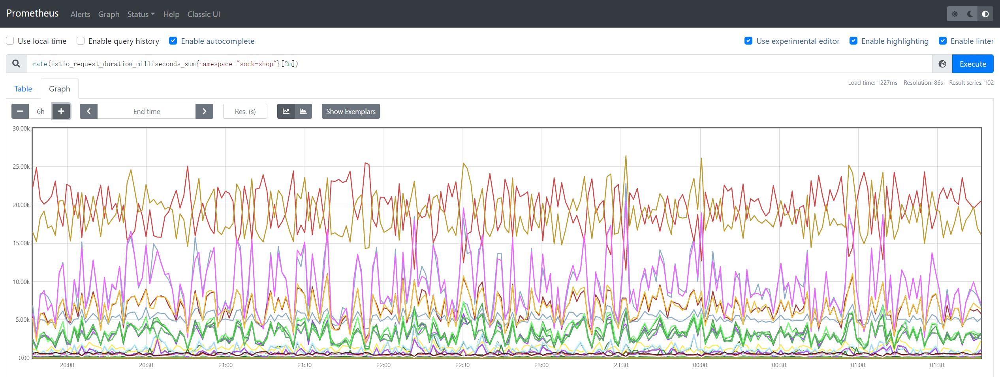
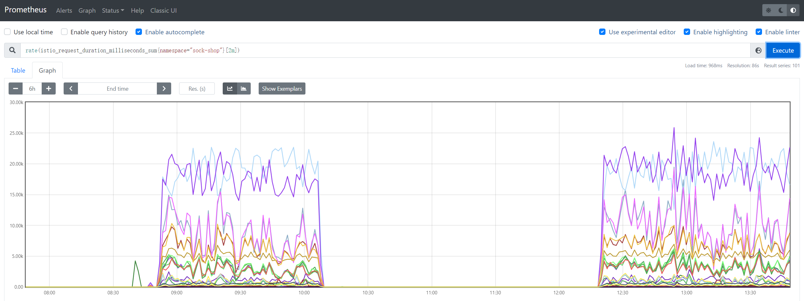

# Locust

> 蝗虫

[Locust - A modern load testing framework](https://locust.io/)

## 定义

- 开源性能测试工具，基于Python开发
- 使用Python代码来定义用户行为，可以模拟百万计的并发用户访问系统
- 完全基于事件和异步方法（协程），一个locust节点也可以在一个进程中支持数千并发用户
- 不使用回调，通过[gevent](http://www.gevent.org/)使用轻量级过程（即在自己的进程内运行）
- 有webui图形界面、无图形界面、分布式等多种运行方式

> 真实模拟用户操作，模拟有效并发
>
> 而对于其它协议类型的系统，Locust也提供了接口，只要能用Python编写对应的请求客户端，就能方便地采用Locust实现压力测试。从这个角度来说，Locust可以用于压测任意类型的系统
>
> 在模拟有效并发方面，Locust的优势在于其摒弃了进程和线程，完全基于事件驱动，使用gevent提供的非阻塞IO和coroutine来实现网络层的并发请求，因此即使是单台压力机也能产生数千并发请求数；再加上对分布式运行的支持，理论上来说，Locust能在使用较少压力机的前提下支持极高并发数的测试。

## 特点

- 不需要编写笨重的UI或者臃肿的XML代码，基于协程而不是回调
- 有一个基于we简洁的HTML+JS的UI用户界面，可以实时显示相关的测试结果
- 支持分布式测试，用户界面基于网络，因此具有跨平台且易于扩展的特点
- 所有繁琐的I/O和协同程序都被委托给gevent，替代其他工具的局限性

## 局限

- 目前其本身对测试过程的监控和测试结果展示不如jmeter全面和详细


## 安装

```bash
pip install locust

# 验证
# 获取locust的帮助信息
locust --help

# 查看locust的版本信息
locust -V
```

# locustfile

- **定义一个任务类**，类继承`TaskSequence`类或`TaskSet`类（从`locust`包中引入`TaskeSequence`或`TaskSet`类）
- 当类里面的任务请求有先后顺序时，继承`TaskSequence`类， 没有先后顺序继承`TaskSet`类
- `Locust`将为每个正在模拟的用户生成一个`Locust`类实例

## TaskSet类

性能测试工具要模拟用户的业务操作，就需要通过脚本模拟用户的行为，`TaskSet`类控制着`Locust`实例的具体行为

- `TaskSet`是**任务的集合**，这些任务是普通的python可调用对象
- 声明任务的典型方式是使用[task](https://docs.locust.io/en/stable/api.html#locust.core.task)装饰器（从`locust`包中引入`task`）
- `task`修饰的方法就是一个任务，一个任务可以有很多个接口的请求

### task_set

`task_set`指向一个`TaskSet`类，`TaskSet`类**定义了用户的行为**

- `task_set = MyTaskSet`

也可以通过设置[`tasks`](https://docs.locust.io/en/stable/api.html#locust.core.TaskSet.tasks)属性来定义`TaskSet`的任务（列表或字典）

- 如果`task`被定义在列表中（即`tasks`是一个`list`），那么**每次执行任务时都将从`tasks`中随机选择任务**
  - `tasks = [WebTasks]`（`class WebTasks(TaskSet)`）
- 如果`tasks`是一个带有关健字和数值调用的字典，那么**每次执行的任务将会被以数字的比率随机选择来执行**
  - `{task: 3, another_task:1}`

### wait_time

- 声明一个[wait_time](https://docs.locust.io/en/stable/api.html#locust.core.Locust.wait_time)方法，用于确定**模拟用户在执行任务之间将等待多长时间**
- `Locust`提供了一些内置的函数用于返回`wait_time`的方法，最常用的是[`between`](https://docs.locust.io/en/stable/api.html#locust.wait_time.between)，可以使**模拟的用户在每次执行任务后等待介于最小值和最大值之间的随机时间**
  - 每个用户将在任务之间等待0.1到0.3秒：`wait_time = between(0.1, 0.3)`	

> 其他内置的等待时间函数有[constant](https://docs.locust.io/en/stable/api.html#locust.wait_time.constant)和[constant_pacing](https://docs.locust.io/en/stable/api.html#locust.wait_time.constant_pacing)

### client

- `client`是`HttpSession`的一个实例，可用于发送HTTP请求
- 该请求将使用`get`，`post`，`put`，`delete`，`head`，`patch`和`options`方法的统计数据提交给Locust
- `TaskSet`类有一个属性`client`，该属性返回`self.locust.client`
  - `self.client.get("/")`

### 启动压测

测试开始后，每个虚拟用户（`Locust`实例）的运行逻辑如下

1. 执行`on_start`（只执行一次）作为初始化
2. 从Tasks中随机挑选（如果定义了任务间的权重关系，那么就是按照权重关系随机挑选）一个任务执行
3. 根据`Locust`类中`min_wait`和`max_wait`定义的间隔时间范围（如果`TaskSet`类中也定义了`min_wait`或者`max_wait`，以`TaskSet`中的优先），在时间范围中随机取一个值，休眠等待
   1. 或者是`wait_time`方法定义的间隔时间范围
4. 重复2，3步骤

## 模板

```python
import random
from locust import TaskSequence, HttpLocust, task, seq_task, between

class MyTaskCase(TaskSequence):
    # 初始化方法，相当于 setup
    def on_start(self):
        pass

    # @task，说明下面的方法是一个任务，任务就可以是一个接口请求
    # 装饰器后的数字代表在所有任务中执行的比例
    @task
    # @seq_task定义有执行顺序的任务，扩展中的数字，从小到大，代表先后执行顺序
    @seq_task(1)  
    def regist_(self): 
        # 接口请求的URL地址
        url = '/erp/regist'  
        # 定义请求头为类变量，这样其他任务也可以调用该变量
        self.headers = {"Content-Type": "application/json"}  
        self.user = "locust_" + str(random.randint(10000, 100000))
        self.pwd = '1234567890'
        data = {"name": self.user, "pwd": self.pwd}
        # 使用self.client发起请求，请求的方法根据接口选择
        # catch_response值为True，即允许为失败，name设置任务标签名称（可选参数）
        rsp = self.client.post(url, json=data, headers=self.headers, catch_response=True, name='api_regist')
        if rsp.status_code == 200:
            rsp.success()
        else:
            rsp.failure('regist_ 接口失败！')

    @task  
    # 说明下面的任务，第二个执行
    @seq_task(2)  
    def login_(self):
        url = '/erp/loginIn'
        data = {"name": self.user, "pwd": self.pwd}
        rsp = self.client.post(url, json=data, headers=self.headers,
                               catch_response=True)  # 使用self.client发起请求，请求的方法 选择post
        self.token = rsp.json()['token']    # 提取响应json 中的信息，定义为 类变量
        if rsp.status_code == 200 and rsp.json()['code'] == "200":
            rsp.success()
        else:
            rsp.failure('login_ 接口失败！')

    @task
    # 第三个执行
    @seq_task(3)  
    def getuser_(self):
        url = '/erp/user'
        # 引用上一个任务的类变量值，实现参数关联
        headers = {"Token": self.token}  
        rsp = self.client.get(url, headers=headers, catch_response=True) 
        if rsp.status_code == 200:
            rsp.success()
        else:
            rsp.failure('getuser_ 接口失败！')

    # 结束方法， 相当于teardown
    def on_stop(self):
        pass


# 定义一个运行类，继承HttpLocust类
class UserRun(HttpLocust):
    # 定义固定的task_set，指定前面的任务类名称
    task_set = MyTaskCase
    # 设置运行过程中间隔时间，需要引入between
    wait_time = between(0.1, 3)  
```


# 运行

运行性能测试脚本

- 可以用`-f`参数和`--host`参数指定脚本文件和测试网站
- 可以用`--web-host`和`-P`参数指定ip和端口
  - ip不能带`http://`
- `--step-load`参数可以增加步长压力，实现负载测试
```python
locust -f sample.py --host=https://www.baidu.com

locust -f sample.py  --web-host ip -P port

locust -f sample.py --step-load


# locust -H "http://sock-shop.ingress.isa.buaanlsde.cn" -f locustfile.py --worker

# locust -H "http://sock-shop.ingress.isa.buaanlsde.cn" -f locustfile.py -u 100 -r 20 --headless --run-time=60m --csv=example

# locust -H "http://sock-shop.ingress.isa.buaanlsde.cn" -f locustfile.py -u 2 -r 2
```

输入`locust`，打开UI界面：[http://localhost:8089/](http://localhost:8089/)，运行成功显示如下

> 默认打开0.0.0.0，需要修改为localhost


- Number of users：设置模拟的用户总数（50）
- Spawn rate（users started/second）：每秒启动的虚拟用户数（1）
- Host：服务地址（http://sock-shop.ingress.isa.buaanlsde.cn）
- Number of users to increase by step：逐步增加的用户数
- Step duration：步长持续运行时间
- Start swarming：执行locustfile脚本

50个用户，每秒启动一个用户，结果如下


RPS：Total Requests per Second



查看请求数量变化率




前后对比

- 前面零星的请求是手动在网站测试的


停止后再开启



# 配置文件

> 暂未生效

```conf
locustfile = ./locustfile.py    # locust 功能脚本文件路径
logfile = ./locust.log          # 日志文件路径
loglevel = debug                # 日志等级
web-port = 8000                 # web页面端口。设置默认时间可忽略该端口 
host = http://sock-shop.ingress.isa.buaanlsde.cn        # 待测服务地址
headless = true         # 禁用web界面，并立即开始测试，使用-u和-t来控制用户数量和运行时间
users = 50              # 并发用户的峰值数
spawn-rate = 1          # 生成用户的速率(用户每秒)，主要与-headless或-autostart一起使用
run-time = 2m           # locust运行时间
```

使用配置文件启动locust压测

```bash
locust --config=locust.conf

locust -H "http://sock-shop.ingress.isa.buaanlsde.cn" -f locustfile.py -u 50 -r 10 --headless --run-time=2m -P 8000
```


