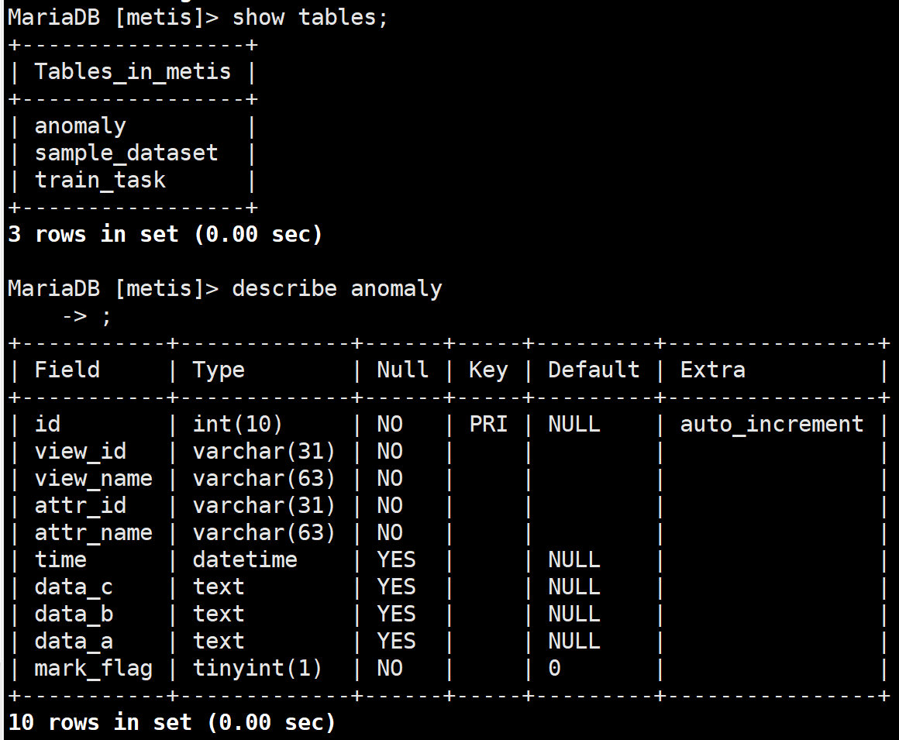

# Metis

**Metis**是一系列AIOps领域的应用实践集合。

主要解决在质量、效率、成本方面的智能运维问题。当前版本开源的时间序列异常检测学件是从机器学习的角度来解决时序数据的异常检测问题。

时间序列异常检测学件的实现思路是基于统计判决、无监督和有监督学习对时序数据进行联合检测。
通过统计判决、无监督算法进行首层判决，输出疑似异常，其次进行有监督模型判决，得到最终检测结果。检测模型是经大量样本训练生成，可根据样本持续训练更新。


# 1.手工部署

## 1.1. 依赖环境

| 软件         | 软件要求         |
| ------------ | ---------------- |
| linux发行版: | CentOS 7.4       |
| python版本:  | 2.7版本          |
| MySQL版本:   | 5.6.26及以上版本 |
| Node.js版本: | 8.11.1及以上版本 |
| Django版本:  | 1.x.x 版本       |

服务器要求：

- linux系统（推荐CentOS系统）
- 开放80和8080端口
- 代码目录是 `root/aiops/Metis/`


> Metis依赖80和8080端口，腾讯云服务器默认开通了80但没有开通8080的外网访问权限，需要手动在安全组中增加对8080端口的放通


## 1.2. 数据库环境

MySQL安装，安装好后检测MySQL服务是否正常工作

```bash
yum install mariadb-server
systemctl start mariadb
```

初始化数据库

> 为了方便快速体验，提供了10+异常检测结果数据和300+样本数据供大家使用

```bash
# 查看服务状态
systemctl status mariadb.service
# 登陆数据库,密码无,直接回车
mysql -u root -p

# 修改密码
# 修改MySQL的登录设置
vim /etc/my.cnf
# 在[mysqld]的段中加上
skip-grant-tables
# 重新启动
service mariadb restart
# 连接数据库,密码无，直接回车
mysql -u root -p
# 使用mysql数据库
use mysql
# 修改密码(空格)
update user set password = password (' ') where user = 'root'; 
# 将MySQL的登录设置修改回来
vim /etc/my.cnf
# 将刚才在[mysqld]的段中加上的skip-grant-tables注释
# 重新启动
service mariadb restart
```

创建需要的数据库用户名并授权，连接MySQL客户端并执行

```mysql
grant all privileges on metis.* to metis@127.0.0.1  identified by 'metis@123';

flush privileges;
```

创建数据库 `metis`（在**命令行下**执行）

```bash
mysqladmin -umetis -pmetis@123 -h127.0.0.1 create metis
```

进入`/root/aiops/Metis/app/sql/time_series_detector/`目录，将sql初始化文件导入数据`metis`数据库

```
mysql -umetis -pmetis@123 -h127.0.0.1 metis < anomaly.sql
mysql -umetis -pmetis@123 -h127.0.0.1 metis < sample_dataset.sql
mysql -umetis -pmetis@123 -h127.0.0.1 metis < train_task.sql
```

查看sql文件信息

```bash
cat anomaly.sql
# DROP TABLE IF EXISTS `anomaly`;
# CREATE TABLE `anomaly`(
# )
```

查看数据库信息

```bash
# 登陆数据库,进入MariaDB [(none)]
mysql -u root -p
```

```mysql
show databases;
use metis;
show tables;
describe anomaly;
```




将数据库配置信息更新到服务端配置文件`database.py`

```bash
vim /Metis/app/dao/db_common/database.py

# 修改配置
DB = 'metis'
USER = 'metis'
PASSWD = 'metis@123'
HOST = '127.0.0.1'
PORT = 3306
```


## 1.3. 服务端环境

服务端python程序需要依赖django、numpy、tsfresh、MySQL-python、scikit-learn等包

```bash
conda create -n metis python=2.7
conda activate metis
```

安装依赖包

```bash
yum install python-pip
pip install --upgrade pip
yum install gcc libffi-devel python-devel openssl-devel
yum install mysql-devel
```

进入`/root/aiops/Metis/docs/`目录下，通过`requirements.txt`安装python依赖包

> 安装MYSQL-python报错，需要先安装mysql-devel

```bash
yum -y install mysql-devel
pip install -I -r requirements.txt
```

 将工作目录加入环境变量

> 为了保证下次登陆可以导入环境变量，将环境变量配置写入服务器的`/etc/profile`文件中

```bash
export PYTHONPATH=/root/aiops/Metis:$PYTHONPATH
```

启动服务端

进入`/root/aiops/Metis`，启动模式为Django的调试模式。

> 如果需要部署生产环境，可通过nginx和uwsgi部署
>
> 报错：AttributeError: 'module' object has no attribute '__version__'
>
> 删除当前文件夹中有关.pyc或者.pyo文件

```bash
python app/controller/manage.py runserver 49.232.207.245:8080
```

> 报错：Error: That IP address can't be assigned to.
>
> 在`settings.py`中设置
>
> 其中`'49.232.207.245'`是服务器的ip，`0.0.0.0：8000`是必须有的
>
> 然后启动时使用`0.0.0.0:8080`

```bash
ALLOWED_HOSTS = ['49.232.207.245', 'localhost', '0.0.0.0:8080', '127.0.0.1']
# ALLOWED_HOSTS = ['0.0.0.0']、
python manage.py runserver 0.0.0.0:8080
```

> Error: That port is already in use.

```bash
# 列出所有端口
netstat -ntlp

# 关闭端口对应进程
kill -9 pid

python manage.py runserver 0.0.0.0:8080
```


## 1.4. WEB管理端环境

安装Node.js（版本不低于 8.11.1）

```bash
# 更新
yum -y update
# 安装
yum -y install gcc make gcc-c++ openssl-devel

# 进入目录
cd /usr/local/src
# 下载nodejs 8.11.1
wget https://nodejs.org/dist/v8.11.1/node-v8.11.1.tar.gz
# 解压
tar xvzf node-v8.11.1.tar.gz 
```

进入`/root/aiops/Metis/uweb`目录下，安装`pacakge.json`配置文件中依赖的第三方安装包

```bash
npm install
```

修改`/root/aiops/Metis/uweb/src/app.json`文件的后端地址

```json
"origin": "http://49.232.207.245:8080" 
```

运行

```bash
npm run build
```


将`uweb`目录下的`custom`文件夹复制到`uweb`目录下生成的`dist`文件夹中

将nginx配置文件中的root定位到uweb目录下的dist文件夹

nginx配置如下：

```
server {
        listen       80;
        root /*/uweb/dist;
        location / {
                add_header Cache-Control max-age=0;
                gzip on;
                gzip_min_length 1k;
                gzip_buffers 16 64k;
                gzip_http_version 1.1;
                gzip_comp_level 6;
                gzip_types text/plain application/x-javascript text/css application/xml;
                gzip_vary on;
                    try_files $uri $uri/ /index.html;
        }

        location /index.html {
                add_header Cache-Control 'no-store';
        }
    }
```

启动WEB服务

nginx正常启动后，打开浏览器并访问 `http://49.232.207.245:80/`

> 如本地修改代码，发布更新方式如下：
>
> npm run build 项目代码开发完成后，执行该命令打包项目代码。在项目根目录会生成一个 dist 目录，然后复制custom目录，放至dist目录下。
>
> 发布时，将 dist 目录中的全部文件作为静态文件，放至服务器指定的静态文件目录即可
>
> 安装完成后，请参考API使用说明进行API调用


# 2. docker部署

## 2.1. 安装docker

```
yum install docker
service docker start
```

## 2.2. 部署docker

进入`/root/aiops/Metis/docker`目录

```bash
# 执行部署文件
sh start.sh 49.232.207.245
# 查看
docker ps
```

三个容器如正常启动则安装成功

- metis-db
- metis-web
- metis-svr


如安装成功，可以通过浏览器直接访问: `http://49.232.207.245`

> Metis依赖80和8080端口，腾讯云服务器默认开通了80但没有开通8080的外网访问权限，需要手动在安全组中增加对8080端口的放通。
>
> 请参考API使用说明进行API调用 

