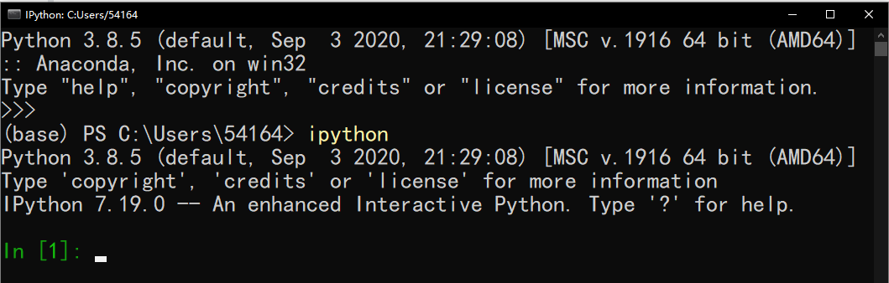
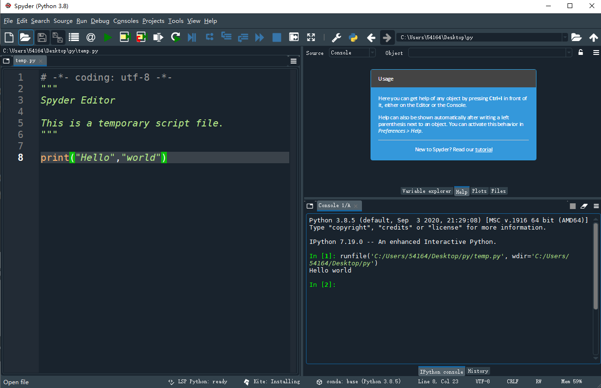
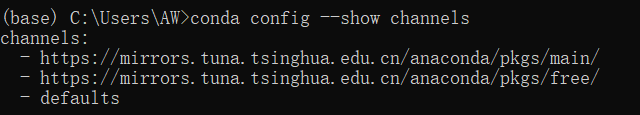
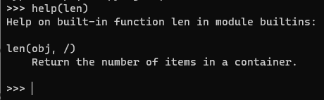

# Python

- **解释型语言**
- 代码不能加密
  - 解释型语言发布程序必须把源码发布出去
- python目前有两个版本，**这两个版本是不兼容的**
  - 2.x版本
  - 3.x版本


## 安装

标准的python环境安装后有

- Python解释器（负责运行Python程序）
- 命令行交互环境
- 简单的集成开发环境

**安装完成后在命令提示符窗口输入`python`后提示版本信息说明Python安装成功**

- 编写Python代码得到的是一个包含Python代码的以`.py`为扩展名的文本文件
- 运行代码需要**Python解释器**去执行`.py`文件
- 官方版本的python解释器：CPython（C语言开发）
  - 在命令行下运行`python`就是启动CPython解释器，CPython用`>>>`作为提示符


> IPython基于CPython之上的一个交互式解释器
>
> - IPython只是在交互方式上有所增强，但是执行Python代码的功能和CPython是完全一样的
>
> - IPython用`In []:`作为提示符

## 运行

- 输入`python`进入**交互式界面**
- 输入`ipython`进入**交互式界面**
- `ctrl+d`退出

**交互式**



**bash方式**

```bash
# 批量处理
python temp.py
```




# Anconda

Anaconda是python的一个发行版，包括了python和很多科学计算的第三方库以及一个包管理器conda

## Windows安装

- 在清华开源站下载：[Index of /anaconda/archive/ | 清华大学开源软件镜像站 | Tsinghua Open Source Mirror](https://mirrors.tuna.tsinghua.edu.cn/anaconda/archive/)
- Anaconda默认不建议添加到环境变量中，可能导致出错
  - 选择默认使用python的版本

> 选择`All Users`

## 配置环境变量

Anaconda安装在`C:\Env\Anaconda`

> **找到在自己的电脑上Anaconda安装的位置**，可以在Anaconda Prompt中输入`where conda`查找

在环境变量中添加目录

- `C:\Env\Anaconda`
  - Python需要
- `C:\Env\Anaconda\Scripts`
  - conda自带的脚本
- `C:\Env\Anaconda\Library\mingw-w64\bin`
  - 使用C with python需要
- `C:\Env\Anaconda\Library\bin`
  - jupyter notebook动态库

## 验证

1. 在cmd中输入`python`查看是否有Python环境
2. 在cmd中输入`conda --version`或者`conda info`查看是否有conda环境


## 修改镜像地址

更换到国内镜像源地址

> 在Anaconda prompt中执行

```bash
conda config --add channels https://mirrors.tuna.tsinghua.edu.cn/anaconda/pkgs/free/

conda config --add channels https://mirrors.tuna.tsinghua.edu.cn/anaconda/pkgs/main/

# 设置搜索时显示通道地址
conda config --set show_channel_urls yes

# 验证
conda config --show channels
```




## conda

在Anaconda中，conda和pip安装的包都是python环境的一部分（安装在同一路径），项目对于包的使用是没有区别的

- conda下载的包，conda和pip都可以更新和卸载
- pip下载的包，只能由pip更新和卸载，conda卸载不了

conda可以自动处理包之间的依赖关系（相比pip）

- `which conda/conda -version`：检查是否安装正确
- `conda list`：查看安装的包
- `conda install *`：安装
- `conda update`：升级
- `remove/uninstall *`：卸载

```bash
# 创建环境
conda create -n ink python=3.6

# 查看环境
conda env list

# 激活环境
conda activate ink

# 退出环境
conda deactivate ink
```

## 环境迁移

### 相同操作系统之间

```bash
# 导出
conda list --explicit > msops.txt

# 导入
conda create --name msops --file msops.txt
```

### 不同的平台和操作系统之间

1. 先进入需要导出的环境执行命令，在当前文件夹下会出现一个`env.yaml`文件，就是conda的环境文件
   1. yaml文件包括Pyhton版本和所有包的名称，在终端中上可以看到导出的环境文件路径
   2. yaml文件只是一个安装目录，并不是安装包本身，导入时候仍会下载
   3. 由conda基于软件包的名称构建环境
2. 该文件在conda内安装的时候只会安装由conda下载的包，并不会安装由pip下载的包，所以还需要将pip下载的包单独导出
3. 先导入`env.yaml`创建环境，进入环境后再导入`pip.txt`

```bash
# 导出
conda env export > env.yaml
pip freeze > pip.txt
# 导入
conda env create -f env.yaml
conda activate env
pip install -r pip.txt
```

### 更新环境

先进入环境，然后更新环境

```bash
# -f表示要导出文件在本地的路径
conda env update -f=/path/environment.yaml
```

## pip代理

 ```bash
 # 本次设置
 pip install tensorboardX --proxy=10.134.143.124:1080
 
 # 临时设置，重连后失效
 # 设置之后可能使用ping时还是无法连接外网，但是pip时可以的，因为ping的协议不一样，不能使用这个代理
 export http_proxy='http://代理服务器IP:端口号
 export https_proxy='http://代理服务器IP:端口号'
 
 # 永久设置
 vim /etc/profile
 
 export http_proxy='http://代理服务器IP:端口号'
 export https_proxy='http://代理服务器IP:端口号'
 
 source /etc/profile
 ```

# 基础语法

- python是动态语言，**变量不用声明**
- python没有终止符，`;`可以让多个语句写在一行
- python没有代码块，用相同的**缩进**表示同一代码块，一般是**4个空格**
- `help()`：展示帮助信息

 

## 编码

- **内存中使用Unicode编码**
- **硬盘或者传输的时候使用UTF-8编码**
  - 当python源代码中**包含中文时就要指定保存为UTF-8编码**


当python**解释器**读取源代码时，为了让它按UTF-8编码读取，通常在文件开头加上如下代码

- 可以让`.py`文件直接在Unix/Linux/Mac上运行
- 表示`.py`文件本身使用标准UTF-8编码

```python
#!/usr/bin/env python3 
# -*- coding: utf-8 -*-
```

### Unicode

- 计算机只能处理数字，如果要处理文本也**必须先把文本转换为数字**才能处理
- **Unicode字符集使用两个字节表示一个字符**，把所有语言都统一到一套编码里，这样就不会有乱码问题
  

### UTF-8

把Unicode编码转化为**可变长编码**的UTF-8编码，UTF-8编码把一个Unicode字符根据不同的数字大小编码成1-6个字节
- 常用的英文字母被编码成1个字节（ASCII码）
- 汉字通常是3个字节

> 如果传输文本包含大量英文字符，用UTF-8编码就可以节省很多空间

### 字符

**单个字符**的编码

- `ord()`函数：获取字符的整数表示
- `chr()`函数：把编码转换为对应的字符

```python
# 65
ord('A')

# 20013
ord('中')

# 'B'
chr(66)

# '文'
chr(25991)
```


### 字符串

- 字符串的类型是`str`
  - **在内存中以Unicode编码表示**，一个字符对应若干个字节
- 在网络上传输或保存到磁盘时，就需要把字符串`str`转换成**以字节为单位**的`bytes`
  - `bytes`类型的数据用带`b`前缀的单引号或双引号表示

```python
# str的一个字符对应若干个字节
x = 'ABC'	
# bytes的一个字符都只占用一个字节
x = b'ABC'	
```

#### `encode()`

- `str`通过`encode()`方法编码为指定的`bytes`

```python
# b'ABC'
'ABC'.encode('ascii')

# b'\xe4\xb8\xad\xe6\x96\x87'
'中文'.encode('utf-8')

# 报错，因为中文超出了ascii码的范围（0-127）
'中文'.encode('ascii')	
```

#### `decode()`

- `bytes`通过`decode()`方法转换为`str`

```python
# 'ABC'
b'ABC'.decode('ascii')

# '中文'
b'\xe4\xb8\xad\xe6\x96\x87'.decode('utf-8')
```


## 注释

- 单行注释：`#`
- 多行注释：`''' '''`

## 关键字

保留字不可以做变量名

- `and`
- `as`
- `assert`
- `class`
- `def`
- `del`
- `elif`
- `except`
- `try`
- `lambda`
- `None`


## 输入输出

### 输入

`input()`

- 接受并返回用户输入内容，返回的数据类型是`str`

```python
# 提示输入
a = input("please enter your age: ")

# 可以用int()强制转换
age = int(a)
```

### 输出

`print()`

- 依次打印输出每个字符串，遇到`,`会**输出一个空格**，末尾自动换行

```python
# 输出Hello world
print("Hello","world")

# 取消换行
print("Hello","world", end="")
```

### 格式化输出

`f-string`

- 用`f`指定f-string格式化输出

- 以对应的变量替换字符串中包含的含**对应变量名**的`{}`

> `{r}`被变量`r`的值替换，`{s:.2f}`被变量`s`的值替换

```python
# 输出The area of a circle with radius 2 is 12.56
r = 2
s = 3.14 * r * 2
print(f"The area of a circle with radius {r} is {s:.2f}")
```

`.format`

- 用传入的参数依次替换字符串内的占位符`{}`

> `:.1f` ：`:`后面的`.1f`指定了格式化参数（保留一位小数）

```python
# 输出Hello world
print("{} {}".format("Hello","world"))

# 输出Hello ink, 成绩提升了20.1%
print("Hello {}, 成绩提升了{:.1f}%".format("ink", 20.12))
```

`%`

在字符串内部

- `%s`：表示字符串
  - 会把任何数据类型都转换为字符串
- `%d`：表示整数
- `%f`：表示浮点数

**转义字符**

- `%%`：`%`
- `\\`：`\`

> 有几个`%`占位符后面就跟几个变量或者值（顺序对应，写在括号中）
>
> 如果只有一个`%`，括号可以省略

```python
# 输出ink
print("%s" % "ink")

# 输出Hi ink, you have 1000000元
print("Hi %s, you have %d元" % ("ink",1000000))
```

## 运算符

### 逻辑运算符

优先级：`() > not > and > or`

- `and`
- `or`
- `not`

```python
# 2
2 or 3

# 5
5 or 0.0

# 3
[] or 3

# {}
0 or {}

# 0
{} or 0
```


# 数据类型

python允许在数字中间以`_`分隔

- `10_000_000_000`和`10000000000`是一样的
- 十六进制数也可以写成`0xa1b2_c3d4`

## None

- `None`是`NoneType`的唯一类型

- `None`不是没定义，是`null`值类型，不是一个关键字

```python
ink = None
# None
print(ink)

# 判断
if ink is None:
    pass
if ink is not None:
    pass
```

## 字符串

`str`

- 不可变对象
- 调用不可变对象自身的任意方法**都不会改变对象自身的内容**，**这些方法会创建新的对象并返回**，这样就保证了不可变

```python
# b = 'Abc'，a = 'abc'不变，replace会创建了一个新的字符串"Abc"并用变量b指向它
a = 'abc'
b = a.replace('a', 'A')	

# 以三个双引号或单引号开头的字符串可以折行
c = """
hello, 
world!
"""

# 使用\来表示转义，使用\\来表示\

# 转义'，输出"'hello world'"
s = '\'hello, world!\''

# 在字符串的最前面加上r来阻止字符串中的\表示转义

# 输出\'hello, world!\'
s1 = r'\'hello, world!\''

# 输出\n\\hello, world!\\\n
s2 = r'\n\\hello, world!\\\n'
```

### 切割

`split(delimiter)`

- 将字符串根据`delimiter`分隔符切割成一些单词存入`list`中

- `delimiter`默认为所有的空字符，包括空格、换行`\n`、制表符`\t`等

```python
s = "hello-world"
delimiter = '-'      	
# t = ['hello', 'world']
t = s.split(delimiter)
```

### 拼接

`delimiter.join(list)`

- 将`list`中的字符串元素拼接起来，需要指定`delimiter`分隔符

`+`

- 拼接两个字符串

**区别**

- 在上万次循环的大规格场景下，使用`join()`要比`+`快很多
  - 因为Python中**字符串是不可变对象**，修改字符串就得将原字符串中的值复制，开辟一块新的内存，加上修改的内容后写入到新内存中
- 在使用`+`拼接字符串时，是重复性的复制、申请新内存、写入值到新内存的
  - 一遍遍的将字符串的值修改，N个字符串拼接总共需要申请N-1次内存，严重影响了执行效率
  - 并且在整个字符拼接的过程中，S1相当于被复制N-1次，S2被复制N-2次…SN复制1次，所以`+`的拼接时间复杂度近似为`o(n^2)`
- 使用`join()`拼接字符串时，会**先计算总共需要申请多少内存，然后一次性申请所需内存并将字符串复制过去**
  - 省去了重复性的内存申请和写入，节省了时间消耗
  - `join()`的拼接时间复杂度为`o(n)`

```python
# 用-拼接列表t中的元素
# s = hello-world
delimiter = '-'        
s = delimiter.join(t)	
```

### 重复

- 使用`*`运算符来重复一个字符串的内容


### 包含

- 使用`in`和`not in`来判断一个字符串是否包含另外一个字符串


```python
# False
print('good' in 'odd')

# True
print('good' in 'gooddee')
```

### 长度

`len()`

- 计算`str`包含多少个字符
- 计算`byte`包含多少个字节
- 计算`list`元素的个数

### 判断

```python
# 检查字符串是否由数字构成
print(s.isdigit())  

# 检查字符串是否以字母构成
print(s.isalpha())

# 检查字符串是否以数字和字母构成
print(s.isalnum())

# 获得字符串修剪左右两侧空格之后的拷贝
print(s.strip())
```

## 列表

`list`

- 可变对象
- `list`是一种有序的集合`[]`，里面元素可以改变
- `list`里面的元素的**数据类型可以不同**，也可以是一个`list`
  - 元素中的`list`计算时只算一个元素，相当于一个二维的数组
- 空`list`长度为0
  - `Len([]) = 0`

### 切片

`list[start:end:step]`

- `start`：可以为空，**默认是0**
- `end`：可以为空，**默认是列表的长度**，`len(list)`
- `step`：步长，可以为空，**默认为1**
  - **当步长为-1时，返回原序列的倒序**

### 创建

- 直接创建空`list`
- 使用`[0]`和`*`运算符创建元素都为0的`list`
- 使用`range()`函数生成整数序列（默认从0开始），再通过`list()`函数生成对应的`list`
   - `range(1, 101, 2)`：可以用来产生1到100的奇数
   - `range(100, 0, -2)`：可以用来产生100到1的偶数（倒序）
- 用字符串创建`list`，`list`的**每一个元素就是字符串的每一个字符**
- 使用切片`[:]`创建`list`
  - `[:]`相当于重新定义列表元素，指向到`=`右侧**可迭代对象的所有元素**

```python
# 空列表，l = []
l = []

# m = [0, 0, 0, 0, 0, 0, 0, 0, 0, 0]
n = 10
m = [0]*n

# [0, 2, 4, 6, 8, 10, 12, 14, 16, 18]
list(range(0, 20, 2))

# ['1', '1', '1']	
list1 = list('111')	

# ['2', '3', '4']
list[:] = ['2','3','4']
```

### 赋值

- 将`list`中的元素分别对应赋值给变量，变量个数要和`list`的元素个数相同

- 可以使用**切片**`[:]`来改变要赋值的`list`的元素个数


```python
a = [1, 2, 3]

# b = 1, c = 2, a = 3 相当于b,c,d依次获得了列表a的各个元素
b, c, d = a		
print(b,c,d)

# e = 1, f = 2 相当于e,f依次获得了列表a的第一个元素和第二个元素
e,f  = a[0:2]
print(e,f)
```

### 替换

- 使用索引来修改列表元素值


```python
# a = [1, 'ink', 3]
a = [1, 2, 3]
a[1] = 'ink'
print(a)
```

### 索引

`list`的**索引可以是负数，表示从末尾倒数取元素**

- `[-1]`：倒数第一个元素

> 步长同理

```python
# 输出world
print(t[-1])
```

### 添加

`append()`

- `append()`的参数会作**为一个元素**追加到列表末尾

```python
# t = ['hello', 'world', 'ink']
t.append("ink")	

# t = ['hello', 'world', 'ink', ['1', '2', '3']]
t.append(["2","3","4"])
```

### 插入

`insert()`

- 插入元素到`list`的指定索引位置

```python
# t = ['hello', 'god', 'world', 'ink']
t.insert(1,"god")
```

### 删除

`pop()`

- 删除`list`的指定索引位置元素，如果不提供索引则默认删除末尾元素

- 会返回被删除的元素

`del()`

- 直接删除对应索引位置的元素

`remove()`

- 直接删除对应的元素

```python
# t = ['hello', 'god', 'world']
t.pop()

# t = ['god', 'world', 'ink']
t.pop(0)
```

### 包含

- 使用`in`来判断`list`是否包含某个值

```python
if x in list:
    print('在list中')
```

### 拼接

- `+=`：直接拼接
- `extend()`：`extend()`的参数是**可迭代对象**，会遍历`list`后追加到`list`末尾
  - `str`也是一种`list`，**每个元素就是一个字符**，`extend()`会切分字符串
- `[len(list):]`：通过切片从`len()`后追加元素
  - **列表的末尾不是-1而是`None`**（是-1的后一位）
  - 列表的切片**不会越界**（追加到最后）

> 推荐使用`extend()`

```python
# list1 = ['1', '1', '1']
# list2 = ['ink']
# 把list2中的所有元素追加到list1中 
# list1 = ['1', '1', '1', 'ink']
list1 += list2  		
list1 = list1 + list2 	
list1.extend(list2)  	
list1[len(list1):] = list2

# list1 = ['1', '1', '1', '2', '3', '4']
list1.extend('234')

# list1 = ['1', '1', '2', '3', '4', '1']
list1[-1:-1] = '234'

# list1 = ['1', '1', '2', '3', '4']
list1[-1:] = '234'

# list1 = ['1', '1', '1', '2', '3', '4']
list1[5:5] = '234'	
```


## 元组

`tuple`

- 不可变对象
- `tuple`可以看作是不可变的`list`
  - `tuple`**一旦初始化就不能修改**，因此定义一个`tuple`时里面的元素就必须被确定下来

  - 当`tuple`的元素中有`list`时，`list`中的元素可以改变
- 只有1个元素的`tuple`会用`,`和`1`区分，打印时也会显示
- `list`中的元素也可以是`tuple`
  - 访问列表元素时，`i[0]`表示`tuple`里第一个元素，`i[1]`表示`tuple`里第二个元素

```python
# 空的tuple 
t = ()		

# 1个元素的tuple
t = (1,)

# 用一组tuple表示学生名字和成绩
L = [('Bob', 75), ('Adam', 92), ('Bart', 66), ('Lisa', 88)]	
```

### 优点

- **元组中的元素是无法修改的**，在多线程环境中更喜欢使用的是那些不变对象
  - 因为对象状态不能修改，一个不变的对象要比可变的对象更加容易维护
  - 没有任何一个线程能够修改不变对象的内部状态，一个不变对象自动就是线程安全的，这样就可以省掉处理同步化的开销
- **元组在创建时间和占用的空间上面都优于列表**
  - 可以使用`sys`模块的`getsizeof`函数来检查存储同样的元素的元组和列表各自占用了多少内存空间
  - 也可以在ipython中使用魔法指令`%timeit`来分析创建同样内容的元组和列表所花费的时间

> 如果不需要对元素进行添加、删除、修改的时候，可以考虑使用元组
>
> 如果一个方法要返回多个值，使用元组也是不错的选择

## 字典

`dict`

- `dict[key] = value`

- `dict`使用哈希表实现，使用`key-value`键值对存储，一个`{key:value}`是`dict`中的一个`item`
  - 所以`dict`的键`key`必须是不可变对象，因为可变对象在哈希时可能映射成别的值，无法正确工作
    - 所以列表`list`不能作为键`key`，只能作为值`value`
  - 并且`dict`的键`key`必须是可哈希的，`hashable`

- `dict`需要占用大量的内存，内存浪费多，是用空间来换取时间的一种方法（相比于`list`）

```python
# dictt[key]就是value，对dictt[key]操作就是对value操作
# {'on': 'no'}  
dictt['on'] = 'no'
```

### 创建

```python
# 创建字典的字面量语法
# {'ink': 95, 'yinke': 78, 'inke': 82}
dictt = {'ink': 95, 'yinke': 78, 'inke': 82}

# 创建字典的构造器语法
# {'one': 1, 'two': 2, 'three': 3, 'four': 4}
dictt = dict(one=1, two=2, three=3, four=4)

# 通过zip函数将两个序列压成字典
{'a': '1', 'b': '2', 'c': '3'}
dictt = dict(zip(['a', 'b', 'c'], '123'))

# 创建字典的推导式语法
# {1: 1, 2: 4, 3: 9, 4: 16, 5: 25, 6: 36, 7: 49, 8: 64, 9: 81}
dictt = {num: num ** 2 for num in range(1, 10)}
```

### 查找

`dict`中的`item`的存储顺序是未知的，所以`dict`中的元素不使用整数索引而是用键`key`来查找对应的值`value`

- `dict`使用哈希`Hash`算法，无论字典中有多少项`item`，`in`运算符搜索所需的时间都是一样的
- `get(key,defaultValue)`：接受一个`key`和一个默认值作为参数
  - `dict`中存在`key`，返回`key`对应`value`
  - `dict`中不存在`key`，返回传入的默认值，对`dict`不影响

> `list`中`in`操作符会随着列表的增长搜索时间成正比增长

```python
# 对字典中所有键值对进行遍历
# for key in dictt 和 for key in dictt.keys()等价
for key in dictt:
    print(f'{key}: {dictt[key]}')
    
for value in dictt.values():
    print(value)

for key,value in dictt.items():
    print(value)
    
# get方法可以设置默认值，在获取不到对应key的value值时返回默认值
dictt.get('ink', 0)
```


### 存储

`key-value`在存的时候必须根据`key`算出`value`的存放位置，这样取的时候才能根据`key`直接拿到`value`

- `dict`内部存放的顺序和`key`放入的顺序是没有关系的
- 一个`key`只能对应一个`value`，多次对相同`key`放入`value`会覆盖，只保存最后一次存入的`value`


### 删除

- `pop(key)`：删除`dict`中的`key`和对应的`value`
- `clear()`：清空字典

## 集合

`set`

- **无序，无重复元素**
- `set`是一组`key`的集合，因为`key`不能重复，所以`set`中没有重复的元素，传入重复的元素在`set`中会被自动过滤
- `set`的原理和`dict`一样，**不能放入可变对象**（因为无法判断两个可变对象是否相等，也就无法保证`set`内部**不会有重复元素**）

### 创建

- 使用`{}`
  - 可以在`{}`初始化的时候传入一个元组
- 使用set()函数
  - 向`set()`函数中传入一个`list`作为输入创建`set`
  - 向`set()`函数中传入一个字典会自动就把`dict`中的所有`key`组合成一个`set`

```python
s = {1,2,3,4}

s = = {(2,3,5,6)}

# 传入空集合
s = set()

s = set([1, 2, 3])

s = set({"name": "ink", "age": 20})
```

### 添加

`add()`：添加元素到set中，重复添加不会显示

```python
# s = {1, 2, 3, 4}
s.add(4)
s.add(4)
```

### 删除

`remove()`：删除元素

```python
# s = {1, 2, 3}
s.remove(4)
```


# 控制结构

## 条件判断

- 只要是非零数值，非空`str`，非空`list`等就判断为`True`
- 对于`None`值的比较，使用`is`

```python
# 输出ink
if 2>4:
    print("Yes")
elif 2==4:
    print("No")
else:
    print("ink")

# 一行赋值形式
result = 'ink' if a >= b else 'yinke'
```

### is判断

```python
# None
a =""
# False
if a is None
# True
if a is not None


```


### ==和is

**区别**

- `is`：用来比较**是不是指向同一个内存单元**
- `==`：用来比较**指向的内存单元中的值是不是相等**

**小整数对象池**

- 根据python的垃圾回收机制，python为了优化速度，会把`[-5,256]`之间的数据提前存放在小整数对象池中，不会进行垃圾回收

- 程序中用`[-5,256]`之间的数据不会再重新创建一份，**而都是指向对象池中的同一份数据**

  - 所以此区间内的数据使用`==`和`is`是相同的
  - 这个区间之外的数据每次使用时系统都会重新申请一块内存

  

## 循环

### for循环

#### 遍历元素

- `in`：变量`x`依次将`list`或`tuple`中的每个元素迭代出来

```python
names = ['Michael', 'Bob', 'Tracy']
# x是元素,不是下标
for x in names:			
    print(x)
```

#### 遍历索引

- 使用`range()`和`len()`函数生成索引，在使用`in`遍历


```python
# 0 Michael
# 1 Bob
# 2 Tracy
names = ['Michael', 'Bob', 'Tracy']
for index in range(len(names)):
   print(index,names[index])
```

### while循环

```python
while 条件:		
    执行
```

### break

- `break`语句可以提前**退出循环**

### continue

- `continue`语句可以**跳过当前的这次循环，直接开始下一次循环**


# 函数

## 递归函数

- 函数调用是通过栈`stack`实现的
  - 每进入一个函数，栈就会加一层**栈帧**，每当函数返回，栈就会减一层**栈帧**
- 栈的大小不是无限的，所以**递归调用的次数过多会导致栈溢出**，所以使用递归函数要防止栈溢出，解决递归调用栈溢出的方法是通过**尾递归优化**
  - 尾递归是指**在函数返回的时候调用自身，并且return语句不能包含表达式**
  - 这样编译器或者解释器就可以把尾递归做优化，使**递归本身无论调用多少次都只占用一个栈帧**，不会出现栈溢出的情况

## 定义函数

- 函数的返回值用`return`语句
- 如果没有`return`语句，函数执行完后隐式返回`None`

```python
def my_abs(x):
    if x >= 0:
        return x
    else:
        return -x
```

## 调用函数

- 函数名是**指向一个函数对象的引用**
- **可以把函数名赋给一个变量，相当于给这个函数起了一个别名**

```python
# 变量a指向abs函数
a = abs	    
# 可以通过a调用abs函数，返回1
a(-1) 		
```

## 空函数

用`pass`语句定义一个**什么事也不做**的空函数（用于占位）

```python
# 暂存还未完成的函数
def nop():	
    pass
```

## 函数返回值

函数可以返回多个值，**多个值其实返回的是一个`tuple`**

- 返回一个`tuple`时可以省略括号
- 多个变量可以同时接收一个`tuple`返回值，按位置分别对应赋值

```python
import math

def move(x, y, step, angle=0):
    nx = x + step * math.cos(angle)
    ny = y - step * math.sin(angle)
    return nx, ny
    
# (151.96152422706632, 70.0)
r = move(100, 100, 60, math.pi / 6)
```


## 函数参数

### 位置参数

调用函数时，传入值按照**位置顺序**依次赋给参数

```python
# 第一个是x,第二个是n
def power(x, n):	
    s = 1
    while n > 0:
        n = n - 1
        s = s * x
    return s
```

### 默认参数

常用或默认的参数值可以直接写在函数中从而简化函数的调用，**当传入的数据与默认参数不符合时会传入实际传入的参数值**

- **必选参数在前，默认参数在后**
- 当函数有多个默认参数时，调用时按位置顺序提供默认参数
  - 调用时不按顺序提供部分默认参数要写清楚参数名和对应值

- **定义默认参数必须指向不变对象**（如`str`，`None`）

- 在函数体里面执行了会改变默认参数的值的操作就会引发错误

> 当函数有多个参数时，把变化大的参数放前面，变化小的参数放后面，变化小的参数就可以作为默认参数

```python
# power(5)实际上是power(5, 2)
def power(x, n=2):		
    s = 1
    while n > 0:
        n = n - 1
        s = s * x
    return s
```

### 可变参数

`*args`

- 可变参数`*args`会将一个**非键值对的可变数量的参数列表**作为参数传递给函数
  - 如果事先不确定函数接受参数的个数，就在参数前面加`*`，参数接收到的就是一个`tuple`

- 在`list`或`tuple`前面加`*`可以把`list`或`tuple`的元素变成可变参数

> `arg`不重要，`*`是必须的

```python
def calc(*numbers):		
    sum = 0
    for n in numbers:
        sum = sum + n * n
    return sum

# 5
calc(1, 2)

# 0
calc()

nums = [1, 2, 3]
# 14
calc(*nums)
```

### 关键字参数

`**kwargs`

- 关键字`**kwargs`会将一个**键值对的可变数量的参数列表**作为参数传递给函数
  - 这些键值对参数会在函数内部自动组装为一个`dict`

- 在`dict`前面加上`**`，可以把`dict`转换为关键字参数
  - 这个`dict`中的所有`key-value`键值对都会传入到函数的关键字参数，`kwargs`获得的`dict`的一份拷贝，对`kwargs`的改动不会影响到原`dict`

```python
def person(name, age, **kwargs):
    print('name:', name, 'age:', age, 'other:', kwargs)
    
# name: Bob age: 35 other: {'city': 'Beijing'}    
person('Bob', 35, city='Beijing')

# name: Jack age: 24 other: {'city': 'Beijing', 'job': 'Engineer'}
extra = {'city': 'Beijing', 'job': 'Engineer'}
person('Jack', 24, **extra)
```

可以在函数内部通过关键字参数`kw`检查传入了哪些参数

```python
#检查是否有city和job参数
def person(name, age, **kw):
    if 'city' in kw:
        print("有city")
    if 'job' in kw:
        print("有job")
    print('name:', name, 'age:', age, 'other:', kw)
    
# 有city
# name: Bob age: 35 other: {'city': 'Beijing'
person('Bob', 35, city='Beijing')
```

### 命名关键字参数

关键字参数`**kwargs`接受的`key-value`不受限制，如果想限制传入的关键字参数就要使用**命名关键字参数**

- 命名关键字参数需要一个特殊分隔符`*`，`*`后面的参数被视为命名关键字参数
- 如果函数中已经有了一个可变参数`*args`，后面的命名关键字参数就不再需要特殊分隔符`*`
- **命名关键字参数具有默认值时，调用函数时可不传入此参数**

```python
# 只接收city和job作为关键字参数
def person(name, age, *, city, job):	
    print(name, age, city, job)

# 命名关键字参数必须传入参数名
person('Jack', 24, city='Beijing', job='Engineer') 
Jack 24 Beijing Engineer

# 不再需要特殊分隔符*
def person(name, age, *args, city, job):
    print(name, age, args, city, job)
    
#city具有默认值
def person(name, age, *, city='Beijing', job):		
    print(name, age, city, job)

# Jack 24 Beijing Engineer
person('Jack', 24, job='Engineer')	
```

### 组合参数

**可变参数+关键字参数**

- 任意函数都可以通过类似`func(*args, **kw)`的形式调用，无论它的参数是如何定义的

## 偏函数

`from functools import partial`

偏函数通过`functools`模块被用户调用

- 函数在执行时要带上所有必要的参数进行调用，但有时**参数可以在函数被调用之前提前获知**，这种情况下一个函数有一个或多个参数预先就能用上，**以便函数能用更少的参数进行调用**
  - 通常应用的场景是要频繁调用某个函数时，其中某些参数是已知的固定值，可以调用这个函数多次，但看上去似乎代码有些冗余

> 它可以扩展函数的功能，但又不完成等价于装饰器
>
> 简单来说作用就是把一个函数的某些参数给固定住（也就是设置默认值），返回一个新的函数，调用这个新函数会更简单

### 定义

`类func = functools.partial(func, *args, **keywords)`

partial一共接受三个参数

- `func`：需要被扩展的函数，返回的函数其实是一个类func的函数
- `*args`：需要被固定的**位置参数**
- `**kwargs`：需要被固定的**关键字参数**

如果有更多的位置参数提供调用，它们会被**附加到位置参数中**，如果有额外的关键字参数提供，它们将会**扩展并覆盖原有的关键字参数**

### 对比

**不使用偏函数**

- 第一种，100这个固定值会返回出现，代码总感觉有重复
- 第二种，就是当想要修改100这个固定值的时候，需要改动`add()`这个方法

```python
# 第一种做法：
def add(*args):
    return sum(args)

print(add(1, 2, 3) + 100)
print(add(5, 5, 5) + 100)

# 第二种做法
def add(*args):
    # 对传入的数值相加后，再加上100返回
    return sum(args) + 100

# 106
print(add(1, 2, 3)) 
# 115
print(add(5, 5, 5))  
```

**使用偏函数**

```python
from functools import partial

def add(*args):
    return sum(args)

add_100 = partial(add, 100)
# 106
print(add_100(1, 2, 3))  

# 107
add_101 = partial(add, 101)
print(add_101(1, 2, 3))  
```

**加入的关键字参数的偏函数**

```python
def add(*args, **kwargs):
    # 打印位置参数
    for n in args:
        print(n)
    print("-"*20)
    # 打印关键字参数
    for k, v in kwargs.items():
       print('%s:%s' % (k, v))
    # 暂不做返回，只看下参数效果，理解 partial 用法

# 普通调用
add(1, 2, 3, v1=10, v2=20)
"""
1
2
3
--------------------
v1:10
v2:20
"""

# partial
add_partial = partial(add, 10, k1=10, k2=20)
# 附加1，2，3
# 扩展k1，k2，k3并覆盖k1，k2
add_partial(1, 2, 3, k3=20)
"""
10
1
2
3
--------------------
k1:10
k2:20
k3:20
"""

# 覆盖k1
add_partial(1, 2, 3, k1=20)
"""
10
1
2
3
--------------------
k1:20
k2:20
"""
```


## 函数注释

> type hints是Python3.5新加的功能

### 静态注释

**一般规则**

- **参数名后加一个冒号**，然后再跟一个expression
  - 冒号是参数的**类型建议符**，即希望传入的实参的类型
  - 这个expression可以是任何形式
- annotation可被保存为函数的attributes

这些注释信息都是函数的元信息，保存在`f.__annotations__`字典中，python对注释信息和``f.__annotations__``的一致性，不做检查，不做强制，不做验证

> 即使传入的实际参数与建议参数不符，也不会报错

```python
def f(text:str, max_len:'int>0'=80) ->str:
```

函数声明中

- `text:str`：`text`是参数，冒号后面`str`是参数注释
- 如果参数有默认值也要写上，**未传入实参时该参数即为默认值**
  - `max_len:'int>0'=80`

- `->str`：函数返回值的注释

```python
def f(ham: 42, eggs: int = 'spam') -> "Nothing to see here":
    print("函数注释", f.__annotations__)
    print("参数值", ham, eggs)
    print(type(ham),type(eggs))
   
# 函数注释 {'ham': 42, 'eggs': <class 'int'>, 'return': 'Nothing to see here'}
# 参数值 www spam
# <class 'str'> <class 'str'>
f("www")


def twoSum(num1: int, num2: int=100) -> int:
    sum = num1 + num2
    return sum
    
# {'num1': <class 'int'>, 'num2': <class 'int'>, 'return': <class 'int'>}
# 3
# 101
# I love Arsenal（不会报错）
if __name__ == "__main__":
    print(twoSum.__annotations__)
    print(twoSum(1,2))
    print(twoSum(1))
    print(twoSum('I love ','Arsenal'))
```

### 动态注释

在函数中或者装饰器中动态的增加，删除，更改，注释内容

- `f.__annotations__` 是一个字典，可以使用字典的所有操作，所以就可以动态的更改注释了

## hash和id

`id`：取对象的地址（cpython中）

区分可变类型和不可变类型

- **不可变类型**：改变对象会创建一个新的对象并指向新的对象（地址发生变化）
- **可变类型**：值改变时，地址不发生变化
  - 无法用于hash函数
  

> 可变类型`list`就是一个unhashable type


`hash`

- `hash`的实现和地址有关系

- 相同内容的哈希值一定是相同的


**哈希碰撞**

`collision`：不同的输入得到同一个哈希值

防止哈希碰撞的最有效方法就是扩大哈希值的取值空间

> 黑客攻击的一种方法就是设法制造"哈希碰撞"，然后入侵系统窃取信息


# 高级特性

## 切片

`slice`

切片操作符`[n:m]`：返回从第n个元素到第m个元素的`list`或`turple`，**包括第一个但不包括最后一个**：`[)`

> 字符串`str`也可以看成是一种`list`，**每个元素就是一个字符**。因此字符串也可以用切片操作

- 省略第一个索引n，切片将从列表头开始（第一个索引0也可以省略）

- 倒数第一个元素的索引是`-1`，省略第二个索引m，切片将到列表尾结束

- 两个索引n和m都省略就是操作整个`list`或`turple`

- `[n:m:l]`：可以间隔切片，`l`是步长，**当`l`为负数时，表示倒序**（此时n要大于m）

  > [::-1]切片：从列表最后一位开始，步长为-1，即从[-1]开始，索引值每次累加-1，累加值为`-len()`时结束

```python
L = [0,1,2,3,4,5,6,7,8,9,10]
# 取前10个元素
L[:10]		

# 取后10个元素
L[-10:]	

# 前11-20个元素	
L[10:20]	

# 末尾2个元素(倒数第二个和倒数第一个元素)
L[-2:]

# 倒数第二个元素
L[-2:-1]

# 前10个数,从第一个数开始,每两个取一个[0, 2, 4, 6, 8]
L[:10:2]

# 所有数,从第一个数开始,每5个取一个[1, 6]
L[::5]	

# 倒序
# [10, 9, 8, 7, 6, 5, 4, 3, 2, 1, 0]
L[::-1]

# [10, 7, 4, 1]
L[::-3]

# [6, 5, 4, 3]
L[6:2:-1]

# []
L[2:6:-1]
```


## 迭代

`iteration`

- 通过`for`循环来遍历`list`或`tuple`称为迭代`Iteration`

### 可迭代对象

`iterable`

- 可迭代对象都可以作用于`for`循环
- 自定义的数据类型只要符合迭代条件就可以使用`for`循环

通过`collections`模块的`Iterable`类型可以判断**是不是可迭代对象**`iterable`

```python
from collections import Iterable

# True,str可迭代
isinstance('abc', Iterable)   

# True,list可迭代
isinstance([1,2,3], Iterable)

# False,整数不可迭代
isinstance(123, Iterable)   

# True,dict可迭代
isinstance({'a':'1'}, Iterable)
```

**字典**

- `dict`默认迭代的是键`key`

  - 迭代值`value`：`for value in d.values()`

  - 迭代`key`和`value`：`for k, v in d.items()`


```python
# a
# b
# c
d = {'a': 1, 'b': 2, 'c': 3}
for key in d:
    print(key)
```

**字符串**

- `str`迭代的是字符串的每一个字符

```python
# A
# B
# C
for ch in 'ABC':
    print(ch)
```

**下标迭代**

`enumerate()`

- 可以把`list`转换成**索引-元素对**，这样就可以在`for`循环中同时迭代索引和元素本身

```python
# 0 A
# 1 B
# 2 C
for i, value in enumerate(['A', 'B', 'C']):
    print(i, value)
```


## 列表生成式

`list comprehensions`

快速创建`list`，避免繁琐的循环

`[表达式  循环体(for)  条件语句]`

- 表达式：`for`前面

  - 可以写生成式

  - 可以写函数，元素必须可以调用函数

  - 可以写`if`表达式，必须包括`else`

- 条件语句：`for`后面

  - 可以写`if`表达式，不能有`else`，**因为条件语句是筛选的作用**

- `for`可以嵌套

```python
# 生成式,[1, 4, 9, 16, 25, 36, 49, 64, 81, 100]
[x * x for x in range(1, 11)]					

# 调用函数,['hello', 'world', 'ibm', 'apple']
L = ['Hello', 'World', 'IBM', 'Apple']			
[s.lower() for s in L]

# if-else表达式,[-1, 2, -3, 4, -5, 6, -7, 8, -9, 10]
[x if x % 2 == 0 else -x for x in range(1, 11)]	

# if表达不加else,[4, 16, 36, 64, 100]
[x * x for x in range(1, 11) if x % 2 == 0]		

# 两层for循环,['AX', 'AY', 'AZ', 'BX', 'BY', 'BZ']
[m + n for m in 'AB' for n in 'XYZ']			

# 多个变量生成list,['y=B', 'x=A', 'z=C']
[k + '=' + v for k, v in d.items()]				
```


## 生成器

`generator`

- 如果`list`的元素可以按照某种**算法**推算出来，就可以在循环的过程中**不断推算出后续的元素**
- 这样在一开始就不必创建完整的`list`，从而节省大量的空间

这种**一边循环一边计算**的机制称为生成器

### 创建

**列表创建**

- 把列表生成式的`[]`改成`()`就创建了一个`generator`

```python
# 列表生成式,[0, 1, 4, 9, 16]
L = [x * x for x in range(5)]

# 不显示列表,<generator object <genexpr> at 0x00000237FFE714C0>
g = (x * x for x in range(5))
print(g)
```

**函数创建**

- 生成算法比较复杂时可能用类似列表生成式的`for`循环无法实现，此时可以用函数实现

- 在函数中用`yield`关键字代替`return`就创建了一个`generator`

```python
def fib():
    n, a, b = 0, 0, 1
    while true:
        # 将return改为yield
        yield b			
        # 给a,b同时赋值
        a, b = b, a + b			
        n = n + 1
    return 'done'
```

**调用函数创建的`generator`和函数的执行流程不一样**

1. 调用前要生成一个`generator`对象
2. 在每次调用`next()`的时候执行，遇到`yield`语句返回
3. 再从上次返回的`yield`语句处继续执行
4. 当没有`yield`可以执行时调用`next()`就会报错

```python
# yield代替了return,odd()是一个generator
def odd():
    print('step 1')
    yield 1				
    print('step 2')
    yield 2
    print('step 3')
    yield 3

# 1.生成generator对象
o = odd()	

# 2.调用next()函数
# step 1
# 1
next(o)			

#从上一个停止的yield处开始
# step 2
# 2
next(o)			

# 再next(o)就会报错
# step 3
# 3
next(o)			
```

### 读取

列表创建的`generator`可以使用`for`循环读取，因为`generator`也是**可迭代对象**

```python
# 0 1 4 9......
g = (x * x for x in range(10))
for n in g:
    print(n)
```

**返回值**

- `for`循环调用`generator`时得不到`generator`的`return`的返回值
- 想要拿到返回值必须捕获`StopIteration`错误，返回值包含在`StopIteration`的`value`中

> `generator`保存的是**算法**，每次调用`next(g)`就计算出`g`的下一个元素的值直到最后一个元素，当没有更多的元素时抛出`StopIteration`的错误

```python
# g: 1
# g: 1
# g: 2
# Generator return value: done
def fib(n):
    a, b = 0, 1
    while n:
        yield b
        a, b = b, a + b
        n = n - 1
    return 'done'

while True:
     try:
         x = next(g)
         print('g:', x)
     except StopIteration as e:
         print('Generator return value:', e.value)
         break

g = fib(3)
```


## 迭代器

`iterator`

- 可以被`next()`函数调用并不断返回下一个值的**对象**称为迭代器：`Iterator`

- 使用`isinstance()`判断一个对象是否是迭代器（即`Iterator`对象）

  - 生成器`generator`都是`Iterator`对象

  - `list`、`dict`、`str`是可迭代对象`Iterable`，但不是迭代器`Iterator`


- 使用`iter()`函数可以将`list`、`dict`、`str`等可迭代对象`Iterable`转换成迭代器`Iterator`

```python
from collections.abc import Iterator

# True
isinstance((x for x in range(10)), Iterator)

# False
isinstance([], Iterator)

# False
isinstance({}, Iterator)

# False
isinstance('abc', Iterator)

# True
isinstance(iter([]), Iterator)

# True
isinstance(iter('abc'), Iterator)
```


# 函数式编程

**函数式编程就是一种抽象程度很高的编程范式**

- 函数式编程的一个特点就是**允许把函数本身作为参数传入另一个函数，还允许返回一个函数**

> 纯粹的函数式编程语言编写的函数**没有变量**，因此任意一个函数只要输入是确定的，输出就是确定的，**这种纯函数称之为没有副作用**
>
> python对函数式编程提供部分支持，因为python允许使用变量，因此python不是纯函数式编程语言

## 高阶函数

### Map

`map()`

- `map()`接收两个参数，一个是函数，一个是可迭代对象`Iterable`

- `map()`将传入的函数**依次作用到序列的每个元素**，并把结果作为新的迭代器`Iterator`返回

```python
# r = [1, 4, 9, 16, 25, 36, 49, 64, 81]
def f(x):
    return x * x
r = map(f, [1, 2, 3, 4, 5, 6, 7, 8, 9])
list(r)
```

### Reduce

`reduce()`

- `reduce()`接收两个参数，一个是函数，一个是可迭代对象`Iterable`

- `reduce()`将传入的函数**作用在一整个序列上来计算累积结果**

> 函数将一个数据集合（列表，元组等）中的所有数据进行下列操作：用传给`reduce`中的函数（有两个参数）先对集合中的第 1、2 个元素进行操作，得到的结果再与第三个数据用函数运算，最后得到一个结果

```python
# reduce(f, [x1,x2,x3,x4]) = f(f(f(x1,x2),x3),x4)
from functools import reduce

def f(x,y):
    return x * y
# S = 24
s = reduce(f, [1,2,3,4])

# 把str转换为int
def fn(x, y):
    return x * 10 + y

def char2num(s):
    digits = {'0': 0, '1': 1, '2': 2, '3': 3, '4': 4, '5': 5, '6': 6, '7': 7, '8': 8, '9': 9}
    # 返回key对应的value
    return digits[s]

# 输出13579
reduce(fn, map(char2num, '13579'))
```

### Filter

`filter()`

- `filter()`是一个**筛选**函数

- `filter()`接收两个参数，一个是函数，一个是可迭代对象`Iterable`

- `filter()`把传入的函数**依次作用于序列的每个元素**，然后**根据返回值是`True`还是`False`决定保留还是丢弃该元素**

- `filter()`函数返回的是一个迭代器`Iterator`，也就是一个惰性序列，只有在迭代至某个元素时才计算该元素，所以要强迫`filter()`完成计算结果需要用`list()`函数获得所有结果并返回`list`

```python
# 删掉list中的偶数
def is_odd(n):
    return n % 2 == 1

# [1, 5, 9, 15]
list(filter(is_odd, [1, 2, 4, 5, 6, 9, 10, 15]))	
```


**素数**

`Iterator`是惰性计算的序列，所以可以用Python表示**全体自然数，全体素数**这样的序列

```python
# 生成器,构造一个从3开始的无限奇数序列	
def _odd_iter():							
    n = 1					
    while True:
        n = n + 2
        # 惰性,返回3停止,调用next()才会继续算n+2
        yield n								

# 筛选函数
def _not_divisible(n):			
    # lambda可以理解为一个函数生成器,返回的是一个函数
    # :之前的是输入, :之后的是输出
    return lambda x: x % n > 0				
											
# 生成器,生成素数列表			
def primes():
    # 第一个素数2
    yield 2					
    # 生成generator对象,序列从3开始，后面的到next()调用再计算
    it = _odd_iter()						
    while True:
        # 返回序列的第一个数
        n = next(it) 						
        yield n
        # 利用filter()不断产生筛选后的新的序列
        it = filter(_not_divisible(n), it) 	

# 打印1000以内的素数
for n in primes():							
    if n < 1000:
        print(n)
    else:
        break
```


### Sorted

`sorted()`

- `sorted()`是一个模默认**升序**排序的函数

- `sorted()`可以接收一个函数来实现自定义排序，函数**作用于每一个元素上**，并根据函数返回值进行排序
- `sorted()`还可以接收第三个参数`reverse`，`True`即是反向排序

> 两个`str`或者两个`dict`的比较必须通过函数，字符串排序默认情况下按照ASCII的大小进行比较

```python
# 按绝对值大小排序,[5, 9, -12, -21, 36]
sorted([36, 5, -12, 9, -21], key=abs)	

# ['Credit', 'Zoo', 'about', 'bob']
sorted(['bob', 'about', 'Zoo', 'Credit'])

# ['Zoo', 'Credit', 'bob', 'about']
sorted(['bob', 'about', 'Zoo', 'Credit'], key=str.lower, reverse=True)
```


## 返回函数

**嵌套函数（Nested Function）**

- 高阶函数除了**可以接受函数作为参数外，还可以把函数作为结果值返回，返回的函数并不会立刻执行**
- 每次调用都会返回一个新的函数（即使传入相同的参数），彼此不受影响

内部函数可以引用外部函数的参数和局部变量，当外部函数返回内部函数时，**相关参数和变量都保存在返回的函数中**，称为**闭包**

```python
def lazy_sum(*args):
    # 在外部函数lazy_sum中定义内部函数sum
    # 内部函数sum可以引用外部函数lazy_sum的参数args和局部变量
    def sum():					
        ax = 0					
        for n in args:
            ax = ax + n
        return ax
    # 返回函数sum
    return sum					

# 调用lazy_sum()时返回的是函数sum
f = lazy_sum(1, 3, 5, 7, 9)

# 调用f时才真正计算求和的结果25
f()							

# f1()和f2()的调用结果互不影响。
f1 = lazy_sum(1, 3, 5, 7, 9)
f2 = lazy_sum(1, 3, 5, 7, 9)

# False	
f1 == f2		
```


## 匿名函数

有时传入函数不需要显式地定义函数，直接传入匿名函数会更方便

**优点**

- 不必担心函数名冲突

- 匿名函数也是一个函数对象，也可以把匿名函数赋值给一个变量，再利用变量来调用该函数

```python
# [1, 4, 9, 16, 25, 36, 49, 64, 81]
list(map(lambda x: x * x, [1, 2, 3, 4, 5, 6, 7, 8, 9]))

# 关键字lambda表示匿名函数，冒号前面的x表示函数参数
# 相当于
def f(x):
    return x * x


f = lambda x: x * x
# 25
f(5)
```


# 模块

## Module

- 在python中一个`.py`文件就称之为一个**模块**，使用模块可以**避免函数名和变量名冲突**
- 模块名不要和python自带的模块名称冲突

> 检查方法：在python交互环境执行`import 模块名`，成功则说明系统存在此模块

## Package

`Package.module`

在python中引入了**按目录来组织模块**的方法避免模块名冲突，称为**包**

- 只要模块所在的包名不冲突，那包下所有模块都不会冲突（相当于使用了**包名.模块名**）

**文件目录作为包的条件**
- 每一个包目录下面都必须存在一个`__init__.py`文件，否则python就把这个目录当成普通目录而不是一个包
  - `__init__.py`可以是空文件
  - `__init__.py`本身也是一个模块，它的模块名就是包名
- 不能作为顶层模块来执行该文件夹中的`.py`文件

## 作用域

python通过`_`**前缀**来实现变量和函数的作用域

- 正常的函数和变量名是**公开的**，即`public`，可以被直接引用
- `_x`和`__x`这类的函数和变量是**非公开的**，即`private`，**不应该被直接引用**
  - `private`的函数和变量只是**不应该被直接引用**，但不是**不能被直接引用**。因为python并没有方法完全限制访问`private`的函数或变量
- `__xxx__`这类的变量是**特殊变量**，可以被直接引用，但是有特殊用途
  - `__name__`
  - `__author__`变量可以表明作者

> 从编程习惯上不应该引用private函数或变量
>
> 外部不需要引用的函数全部定义成`private`，需要引用的函数定义为`public`


## 第三方模块

在python中安装第三方模块：通过包管理工具`pip`完成


## 模块使用

### 标准文件模板

1. `#!/usr/bin/env python3`：让`.py`文件直接在Unix/Linux/Mac上运行
2. `# -*- coding: utf-8 -*-`：表示`.py`文件本身使用标准UTF-8编码
3. 模块代码的**第一个字符串**都被视为模块的文档注释


### 导入模块

使用`import`导入模块，导入`sys`模块后就有了变量`sys`指向该模块，利用`sys`这个变量就可以访问`sys`模块的所有功能

`__name__`

- 在**命令行运行**`.py`模块文件时，python解释器把特殊变量`__name__`置为`__main__`
- 在在其他地方导入该模块时，`__name__`则是`py`文件名

因此这种`if`测试可以让一个模块通过**命令行运行**时执行一些额外的代码，最常见的就是运行测试

```python
if __name__=="__main__":
    test()
```

### 自定义模块

- 当试图加载一个模块时，python会在**指定的路径**下搜索对应的`.py`文件，如果找不到就会报错
- 默认情况下python解释器会搜索**当前目录**、**所有已安装的内置模块**和**第三方模块**
- 搜索路径存放在`sys`模块的`path`变量中，可以在`path`中追加路径来实现自定义搜索

**环境变量**

`PYTHONPATH`：Python的搜索路径，默认`import`的模块都会从`PYTHONPATH`里面寻找

- **在命令行添加搜索路径**
  - 此方法只在当前命令行窗口生效，如果打开一个新的窗口，打印`PYTHONPATH`是没有刚才加入的路径的
- **在python文件中添加**

```python
# 命令行
export PYTHONPATH=$PYTHONPATH:/home/ink
  
# 持久化，在.bashrc中写入
vim .bashrc
export PYTHONPATH=$PYTHONPATH:/home/ink
source .bashrc

# 在python文件中添加
import sys
sys.path.append('/home/ink/')
```


**同级的自定义模块**

- 直接导入即可
- 无需加后缀`.py`
- 使用模块中函数要加上引入的**前缀**

**下级目录下的自定义模块**

- 要在下级包中建立一个`__init__.py`文件
- 按照包的格式引入
  - `from dir import file`
  - `import dir.file`（后面需要一直带着路径`dir`书写，可以起别名）

> 相对导入时文件夹实质上充当的是package的角色（如果是普通文件夹就无法导入）

**上级目录下的自定义模块**

需要手动添加搜索路径

- 直接修改`sys.path`，添加搜索的目录 
  - 在运行时修改，运行结束后失效
  - `.`和linux中一样表示当前工作目录
  - `..`和linux中一样表示当前工作目录的上级目录

    ```python
    import sys
    sys.path.append('..')
    
    import file
    ```

- 设置环境变量`PYTHONPATH`，环境变量的内容会被自动添加到模块搜索路径中
  - 设置方式与设置`Path`环境变量类似，只需要添加自己的搜索路径，python本身的搜索路径不受影响

**同级目录下的自定义模块**

- 添加上级目录

    ```python
    import sys
    sys.path.append('..')
    
    from dir import file
    ```

# 面向对象

面向对象编程OOP：`Object Oriented Programming`

- 一种程序设计思想，OOP把**对象作为程序的基本单元**，一个对象包含了数据和操作数据的函数

**面向对象的三大特点**

- 封装
- 继承
- 多态

> python中所有数据类型都可以视为对象


## 类和实例

1. 在python中通过`class`关键字定义类
2. `(object)`表示该类是从哪个类继承下来的，如果没有合适的继承类就使用`object`类（所有类最终都会继承的类）
3. `__init__`方法
   1. 第一个参数`self`表示创建对象的**实例本身**，在`__init__`方法内就可以把各种属性绑定到实例上，即`self`
   2. 有了`__init__`方法，在创建实例的时候就不能传入空的参数，必须传入与`__init__`方法匹配的参数，不需要传`self`，python解释器自己会把实例变量传进去
4. python是动态语言，允许对实例变量绑定任何数据，也就是说同一个类的不同实例变量可以拥有的不同的变量名称
5. `isinstance()`可以判断实例是否是某个类的实例

```python
class Student(object):
	
    # 创建实例的时候绑定name，score属性
    def __init__(self, name, score):
        self.name = name
        self.score = score

    def print_score(self):
        print('%s: %s' % (self.name, self.score))

# 变量bart指向的就是一个Student类的对象实例        
bart = Student('Bart Simpson', 59)
lisa = Student('Lisa Simpson', 87)
bart.print_score()
lisa.print_score()

bart.age = 8
# 8
bart.age
# Traceback (most recent call last):
#   File "<stdin>", line 1, in <module>
# AttributeError: 'Student' object has no attribute 'age'
lisa.age
```

## 访问限制

**让外部代码不能随意修改对象内部的状态**

- 如果要让内部属性不被外部访问，可以在**属性的名称前**加上两个下划线`__`
- 在python中**实例的变量名**如果以`__`开头就是一个**私有变量**，即`private`，只有内部可以访问，外部不能访问

> 注意不要和特殊变量（`__xxx__`）混淆
>
> **双下划线开头的实例变量**不是一定不能从外部访问
> - 不能从外部直接访问`__name`是因为python解释器对外把`__name`变量改成了`_Student__name`，所以可以通过`_Student__name`来访问`__name`变量
>
> - 不同版本的python解释器可能会把`__name`改成不同的变量名
>
> - 所以外部即使设置同名变量也不是内部的变量，而是新增了一个变量

```python
class Student(object):

    def __init__(self, name, score):
        # name,score是私有变量,无法从外部访问
        self.__name = name
        self.__score = score

    def print_score(self):
        print('%s: %s' % (self.__name, self.__score))
```


## 继承和多态

### 单继承

没有继承就继承`(object)`

- 当子类和父类都存在相同的方法时，子类的方法会覆盖了父类的方法，即代码运行的时候总会调用子类的方法

- 在继承关系中如果一个实例的数据类型是某个子类，那它的数据类型也可以被看做是父类，反过来不行

```python
class Animal(object):
    def run(self):
        print('Animal is running...')

# 继承Animal类
class Dog(Animal):
    pass

class Cat(Animal):
    pass

# a是Animal类型
a = Animal() 
# b是Dog类型
b = Dog() 

# True
isinstance(a, Animal)
# True
isinstance(b, Dog)
# False
isinstance(a, Dog)
```

> **静态语言 vs 动态语言**
>
> 对于静态语言（例如Java）来说，如果需要传入`Animal`类型，则传入的对象必须是`Animal`类型或者它的子类，否则无法调用`run()`方法
>
> 对于python这样的动态语言来说，则不一定需要传入`Animal`类型，只需要保证传入的对象有一个`run()`方法就可以了（`file-like object`）

### 多重继承

**通过组合而非多层次继承**

MixIn：设计目的是给一个类增加多个功能。在设计类的时候优先考虑通过多重继承来组合多个MixIn的功能，而不是设计多层次的复杂的继承关系

```python
class Runnable(object):
    def run(self):
        print('Running...')

class Flyable(object):
    def fly(self):
        print('Flying...')

# 多继承
class bird(Animal,Flyable,Runnable):
    pass
```


## 对象信息

**对象类型**

- `type()`：判断对象类型，指向函数或者类的变量也可以判断
- `type()`函数会返回对应的`class`类型
- 使用`types`模块中定义的常量判断一个对象是否是函数
  - `FunctionType`
  - `BuiltinFunctionType`
  - `LambdaType`
- `isinstance()`：判断有继承关系的class类型（父继承链）
  -  优先使用`isinstance()`来判断类型

**对象属性和方法**

`dir()`：返回一个包含**对象的所有属性和方法**的list

> 如果试图获取不存在的属性会抛出`AttributeError`的错误


```python
# int
type(123)

# str
type('str')

# NoneType
type(None)

# builtin_function_or_method
type(abs)

# True
type(123)==type(456)

# True
>>> type(123)==int

# True
>>> type('abc')==type('123')

# True
>>> type('abc')==str

# False
>>> type('abc')==type(123)
```

## 属性和方法

**实例属性和类属性**

- python是动态语言，根据类创建的对象实例可以**任意绑定属性**

- 通过实例变量或者`self`变量给实例绑定属性，**相同名称的实例属性将屏蔽掉类属性**，当删除实例属性后再使用相同的名称访问到的将是类属性

  - 实例属性属于各个实例所有，互不干扰
  - 类属性属于类所有，所有实例共享

**实例方法和类方法**

- 实例可以**任意绑定方法**，给一个实例绑定的方法对另一个实例是不起作用的

- `class`绑定方法后所有实例均可调用

### slots

`__slots__`

- 在定义class的时候定义一个特殊的`__slots__`变量来限制该class**实例能添加的属性**

- `__slots__`变量定义的属性仅对**当前类**实例起作用，对继承的子类不起作用
- 如果要限制子类实例绑定属性，就要在子类中也定义`__slots__`
  - 子类实例允许定义的属性就是自身的`__slots__`加上父类的`__slots__`

```python
class Student(object):
    # 用tuple定义允许绑定的属性
    __slots__ = ('name', 'age') 
```

### @property

python内置的装饰器，用来把一个函数变成属性（属性的方法名不要和实例变量重名）

- 把方法变成属性只需要在函数上加`@property`，属性的值就是该函数`return`的值
- **用函数设置属性可以保证对参数进行必要的检查**
- `@property`本身会创建了另一个装饰器`@func.setter`和`@func.deleter`，负责把`setter`函数和`del`函数变成属性赋值
  - `func`即`@property`修饰的函数名


> `property`底层是基于描述符协议的，property的源码只是一份类似文档一样的伪源码，并没有其具体的实现逻辑

**property实例**

- 被`@property`修饰的`func`不再是一个函数，而是`Property`类的一个实例，所以第二个`func`可以使用 `func.setter`来装饰，本质是调用`Property.setter` 来产生一个新的`Property`实例赋值给第二个`func`
- 第一个`func`和第二个`func`是两个不同的`Property`实例，但它们都属于同一个描述符类`Property`
- 当对`func`赋值时，就会进入 `Property.__set__`，当对`func`进行取值里，就会进入 `Property.__get__`

```python
class Student(object):

    @property
    def score(self):
        return self._score
    
    @score.setter
    def score(self, value):
        if not isinstance(value, int):
            raise ValueError('score must be an integer!')
        if value < 0 or value > 100:
            raise ValueError('score must between 0 ~ 100!')
        self._score = value

s = Student()

# 实际转化为s.set_score(60)
s.score = 60 

# 实际转化为s.get_score()
# 输出60
s.score 

# Traceback (most recent call last):
#   ...
# ValueError: score must between 0 ~ 100!
s.score = 9999
```


## 定制类

### 打印

- `__str__`：调用`print()`返回的方法
- `__repr__`：直接打印变量返回的方法

> 通常`__str__()`和`__repr__()`代码都是一样的

```python
class Student(object):
    def __init__(self, name):
        self.name = name
    def __str__(self):
        return 'Student object (name=%s)' % self.name
    # 偷懒写法
    __repr__ = __str__
```

### 循环

- `__iter__`：如果一个类想被用于`for in`遍历就必须实现`__iter__()`方法，该方法**返回一个可迭代对象**
- `__next__`：`for`循环不断调用该迭代对象的`__next__()`方法拿到循环的下一个值，直到遇到`StopIteration`错误时退出循环

```python
# 斐波那契类
class Fib(object):
    def __init__(self):
        # 初始化两个计数器a,b
        self.a, self.b = 0, 1 
	
    # 实例本身就是迭代对象,返回自己
    def __iter__(self):
        return self 

    def __next__(self):
        # 计算下一个值
        self.a, self.b = self.b, self.a + self.b 
        # 退出循环条件
        if self.a > 10: 
            raise StopIteration()
        # 返回下一个值
        return self.a 

# 1 1 2 3 5 8
for n in Fib():
    print(n)
```

### 索引

`__getitem__`
- 实现`__getitem__()`方法就可以**按下标访问数列的任意一项**
- `__getitem__()`传入的参数可以是一个`int`，也可以是一个切片对象`slice`

> 没有对step参数作处理，也没有对负数作处理

```python
class Fib(object):
    def __getitem__(self, n):
        # n是索引
        if isinstance(n, int): 
            a, b = 1, 1
            for x in range(n):
                a, b = b, a + b
            return a
        # n是切片
        if isinstance(n, slice): 
            start = n.start
            stop = n.stop
            if start is None:
                start = 0
            a, b = 1, 1
            L = []
            for x in range(stop):
                if x >= start:
                    L.append(a)
                a, b = b, a + b
            return L
# 3
f[3]
# 1 1 2
f[0:3]
```

## 枚举类

`Enum`

- 定义常量时通常用大写变量通过整数来定义
- 为枚举变量定义一个`class`类型，**每个常量都是`class`的一个唯一实例**

> `class`不可变，`class`中成员可以直接比较

```python
from enum import Enum

# 可以直接使用Month.Jan来引用一个常量,或者枚举它的所有成员
Month = Enum('Month', ('Jan', 'Feb', 'Mar', 'Apr', 'May', 'Jun', 'Jul', 'Aug', 'Sep', 'Oct', 'Nov', 'Dec'))

```

**自定义枚举类**

- 继承`Enum`类
- `@unique`装饰器可以帮助检查保证没有重复值

```python
from enum import Enum, unique

@unique
class Weekday(Enum):
    # Sun的value被设定为0
    Sun = 0 
    Mon = 1
    Tue = 2
    Wed = 3
    Thu = 4
    Fri = 5
    Sat = 6
```

**访问枚举变量**

- 根据**成员名称**引用枚举常量
- 根据`value`获得枚举常量

```python
day1 = Weekday.Mon

# Weekday.Mon
print(day1)

# Weekday.Tue
print(Weekday.Tue)

# Weekday.Tue
print(Weekday['Tue'])

# 2
print(Weekday.Tue.value)

# Weekday.Mon
print(Weekday(1))

# True
print(day1 == Weekday.Mon)

# True
print(day1 == Weekday(1))


# Sun => Weekday.Sun
# Mon => Weekday.Mon
# Tue => Weekday.Tue
# Wed => Weekday.Wed
# Thu => Weekday.Thu
# Fri => Weekday.Fri
# Sat => Weekday.Sat
# value属性则是自动赋给成员的int常量,默认从1开始计数
for name, member in Weekday.__members__.items():
    print(name, '=>', member)
```

## 元类

**动态语言**：函数和类的定义不是在编译时定义，而是运行时动态创建

# 错误和调试

python的错误也是一个`class`，所有的错误类型都继承自`BaseException`
- `Exception`并非是python中所有异常的基类
- 直接`except`相当于`except BaseException`，这样对于`KeyboardInterrupt`等外部终端进程的请求，也会捕获到，造成进程没有办法正确处理一些信号
  - 所以任何情况都不要不带异常类型，直接`except`

## 错误处理

**捕获错误**

`try except finally`

某些代码可能会出错时就可以用`try`来运行这段代码。如果执行出错则后续代码不会继续执行，而是直接跳转至错误处理代码，即`except`代码块，执行完`except`后，如果有`finally`代码块，则执行`finally`代码块

- 可以有多个`except`来捕获不同类型的错误
- 可以在`except`语句块后面加一个`else`，当没有错误发生时会自动执行`else`语句
- 可以没有`finally`语句，但如果有`finally`，就一定会被执行
> 不需要在每个可能出错的地方去捕获错误，只要在合适的层次去捕获错误就可以

```python
try:
    print('try...')
    r = 10 / int('2')
    print('result:', r)
except ValueError as e:
    print('ValueError:', e)
except ZeroDivisionError as e:
    print('ZeroDivisionError:', e)
else:
    print('no error!')
finally:
    print('finally...')
print('END')
```

**抛出错误**

`raise`

- 错误是也是一个`class`，捕获一个错误就是捕获到该`class`的一个实例
- 要抛出错误，可以定义一个错误的`class`，然后用`raise`语句抛出一个错误的实例
- `raise`语句如果**不带参数就会把当前错误原样抛出**

```python
class FooError(ValueError):
    pass

def foo(s):
    n = int(s)
    if n==0:
        raise FooError('invalid value: %s' % s)
    return 10 / n

foo('0')
```

**组合处理**

处理错误并抛出

- 捕获错误目的只是记录以便于后续追踪
- 当前函数不知道应该怎么处理该错误时就继续往上抛，让顶层调用者去处理错误

```python
def foo(s):
    n = int(s)
    if n==0:
        raise ValueError('invalid value: %s' % s)
    return 10 / n

def bar():
    try:
        foo('0')
    except ValueError as e:
        print('ValueError!')
        raise

bar()
```

## 调试

`assert`

- 用`print()`来辅助查看的地方都可以用断言`assert`来替代
- 如果断言失败，`assert`语句就会抛出`AssertionError`
- 启动python解释器时可以用`-O`参数来关闭`assert`，关闭后所有的`assert`语句都当成`pass`

```python
def foo(s):
    n = int(s)
    # 表达式n != 0应该是True，否则根据程序运行的逻辑后面的代码会出错
    assert n != 0, 'n is zero!'
    return 10 / n

def main():
    foo('0')

# 运行
python -O err.py
```

`logging`

- 用`print()`来辅助查看的地方都可以用`logging`来替代
- `logging`不会抛出错误，但可以输出到文件

```python
import logging
logging.basicConfig(level=logging.INFO)

s = '0'
n = int(s)
logging.info('n = %d' % n)
print(10 / n)
```

`pdb`

 - 启动python的调试器pdb，让程序以单步方式运行

```
python -m pdb err.py
```


# IO编程

`Input/Output`

- **数据交换**的地方通常是磁盘、网络等，需要**IO接口**

- CPU和内存的速度远远高于外设的速度，所以在IO编程中存在**速度不匹配**的问题

  - 同步IO

  - 异步IO


## 文件读写

**系统调用**：在磁盘上读写文件的功能都是由**操作系统**提供的，现代操作系统不允许普通的程序直接操作磁盘，所以读写文件就是

1. `open()`：**通过系统调用打开一个文件对象**（即**文件描述符**）
2. `read()/write()`：通过系统调用从文件对象中读取数据或者把数据**写入文件对象**


### 读文件

1. 调用`open()`以读文件的模式打开一个文件对象并传入文件名和标示符`'r'`，即`read()`
   1. 读取二进制文件（例如图片、视频）用`'rb'`模式打开
   2. 读取非UTF-8编码的文本文件需要给`open()`额外传入`encoding`参数
2. 调用`read()`读取文件的全部内容到内存，用一个`str`对象表示
   1. `read()`一次性读取文件的全部内容，如果文件太大会爆内存
   2. 调用`readline()`每次读取文件的一行内容
   3. 调用`readlines()`一次读取文件的所有内容并按行返回一个`list`
3. 调用`close()`关闭文件
   1. 文件使用完毕后必须关闭，因为文件对象会占用操作系统的资源，并且操作系统同一时间能打开的文件数量也是有限的

> 如果文件不存在，`open()`会抛出`IOError`错误，给出错误码和详细的信息告诉文件不存在
>
> 默认读取UTF-8编码的文本文件

```python
f = open('/path/test.txt', 'r')

f.read()
f.close()

# 打开二进制文件
f = open('/path/test.jpg', 'rb')

# 打开GBK编码的文件
f = open('/path/test.txt', 'r', encoding='gbk')

# for in list
for line in f.readlines():
    print(line.strip()) 
```


**file-like Object**

- 像`open()`返回的对象，它有`read()`方法，在python中统称为`file-like Object`
- 除了文件外还可以是内存的字节流，网络流，自定义流等
- `file-like Object`不要求从特定类继承，只要有`read()`方法就可以


### 写文件

1. 调用`open()`方法以写文件的模式打开一个文件对象并传入文件名和标示符`w`，即`write()`
   1. 以`'w'`模式写入文件时，如果文件已存在则会直接覆盖，相当于删掉后新写入一个文件
   2. 如果希望追加内容到文件末尾可以传入`'a'`

2. 调用`write()`方法写内容到文件中
   1. 可以反复调用`write()`来写入文件
   2. `write()`里面必须是`str`
      1. 将`list`、`tuple`、`dict`转为字符串使用`str`
      2. 将`str`逆转化使用`eval()`函数
3. 调用`close()`方法关闭文件

> OS往往不会立刻把数据写入磁盘，而是放到内存缓存起来，空闲的时候再慢慢写入（刷盘）
> 只有调用`close()`方法时OS才保证把没有写入的数据全部写入磁盘，如果没有调用`close()`，那么数据可能只写了一部分到磁盘，剩下的丢失


```python
f = open('/path/test.txt', 'w')

# 写入Hello, world
f.write('Hello, world!')

f.close()
```

### with

- 文件读写时都有可能产生`IOError`，一旦出错后面的`f.close()`就不会再调用
- 所以为了**保证无论是否出错都能正确地关闭文件**，可以使用`try finally`来实现

```python
try:
    f = open('/path/to/file', 'r')
    print(f.read())
finally:
    if f:
        f.close()
```

python引入了`with`语句来自动调用`close()`方法

```python
with open('/path/file', 'r') as f:
    print(f.read())

with open('/path/test.txt', 'w') as f:
    f.write('Hello, world!')
```

## StringIO

在内存中读写`str`

写入`StringIO`

1. 创建一个`StringIO`
2. 像文件一样写入
3. `getvalue()`方法用于获得写入后的`str`

```python
from io import StringIO

f = StringIO()

f.write('hello')
f.write(' ')
f.write('world!')

# hello world!
print(f.getvalue())
```

读取`StringIO`

1. 用一个`str`初始化`StringIO`
2. 像读文件一样读取

```python
from io import StringIO

# 初始化,\n是换行
f = StringIO('Hello!\nHi!\nGoodbye!')

# Hello!
# Hi!
# Goodbye!
while True:
    s = f.readline()
    if s == '':
        break
    print(s.strip())
```

## BytesIO

在内存中读写`bytes`（二进制数据）

```python
from io import BytesIO

f = BytesIO()
f.write('中文'.encode('utf-8'))

# b'\xe4\xb8\xad\xe6\x96\x87'
print(f.getvalue())


from io import BytesIO

f = BytesIO(b'\xe4\xb8\xad\xe6\x96\x87')

# b'\xe4\xb8\xad\xe6\x96\x87'
f.read()
```


## 文件目录

python内置的`os`模块可以直接调用操作系统提供的接口函数

- `os`模块的某些函数是跟操作系统相关的
  - 在Windows上不提供`uname()`函数
- 操作系统中定义的环境变量保存在`os.environ`变量

> - `posix`：`Linux`、`Unix`或`Mac OS X`系统
> - `nt`：`Windows`系统

```python
import os

# 操作系统类型,'nt'
os.name 

# 获取详细的系统信息
os.uname()

# 环境变量
os.environ

# 获取某个环境变量的值
os.environ.get('PATH')
```


### 操作文件和目录

操作文件和目录有两个模块

- `os`模块
  - `os.mkdir()`：创建文件夹
  - `os.rmdir()`：删除文件夹
  - `os.rename`：文件重命名
  - `os.remove`：删除文件

- `os.path`模块
  - `os.path.abspath('.')`：查看当前目录的绝对路径
  - `os.path.dirname(path)`：去掉文件名返回目录路径 
  - os.`path.join()`：合并路径
  - `os.path.split()`：拆分路径
  - `os.path.splitext()`：获取文件扩展名

**注意**

- 合并路径时不要直接拼字符串而要通过`os.path.join()`函数，这样可以正确处理不同操作系统的路径分隔符

- 拆分路径时不要直接去拆字符串而要通过`os.path.split()`函数，这样可以把一个路径拆分为两部分，后一部分总是**最后级别的目录或文件名**
> 这些合并、拆分路径的函数并不要求目录和文件要真实存在，它们只对字符串进行操作

```python
# 查看当前目录的绝对路径:'C:\\Users\\54164\\Desktop\\py'
os.path.abspath('.')

# 创建新目录之前把新目录的完整路径表示出来:'C:\\Users\\54164\\Desktop\\py\\testdir'
os.path.join('C:\\Users\\54164\\Desktop\\py', 'testdir')

# 然后创建新目录
os.mkdir('C:\\Users\\54164\\Desktop\\py\\testdir')

# 删掉目录
os.rmdir('C:\\Users\\54164\\Desktop\\py\\testdir')

# 拆分目录和文件路径:('/Users/michael/testdir', 'file.txt')
os.path.split('/Users/michael/testdir/file.txt')

# 获取文件扩展名:('/path/to/file', '.txt')
os.path.splitext('/path/to/file.txt')

# 对文件重命名
os.rename('test.txt','test.py')

# 删除文件
>>> os.remove('test.py')
```


**获取文件目录路径**

- `__file__`：表示当前文件的路径

- `os.path.dirname(__file__)`：获取当前文件的绝对路径

> 必须是实际存在的`.py`文件，如果在命令行执行会报异常


## 序列化和反序列化

`pickle`

- `pickle`只在python之间使用
- `pickle`可以序列化所有的数据类型，包括类和函数

### 序列化

**将对象从内存中变成可存储或传输的字节序列形式**， 序列化之后就可以把内容写入磁盘，或者通过网络传输到别的机器上

- `pickle.dumps()`：把对象序列化成一个`bytes`
- `pickle.dump()`：直接把对象序列化后写入一个`file-like Object`
  - 可以认为序列化后写入到文件中

### 反序列化

把变量从序列化的字节序列形式重新恢复成对象

- `pickle.loads()`：反序列化出一个对象
- `pickle.load()`：从一个`file-like Object`中反序列化出对象

### pkl文件

`.pkl`：python保存文件的一种文件格式，直接打开会显示序列化的二进制数据，需要使用`rb`类型来打开（读取2进制文件）

```python
import pickle

d = dict(name='Bob', age=20, score=88)

# 把一个对象序列化并写入文件:b'\x80\x03}q\x00(X\x03\x00\x00\x00ageq\x01K\x14X\x05\x00\x00\x00scoreq\x02KXX\x04\x00\x00\x00nameq\x03X\x03\x00\x00\x00Bobq\x04u.'
pickle.dumps(d)

f = open('dump.txt', 'wb')
pickle.dump(d, f)
f.close()

f = open('dump.txt', 'rb')
d = pickle.load(f)
f.close()

# {'age': 20, 'score': 88, 'name': 'Bob'}
d
```

## JSON

JSON（JavaScript Object Notation）：一种轻量级的**数据交换格式**

在不同的编程语言之间传递对象必须把对象**序列化**为**标准格式**（XML或JSON...)

- JSON表示出来就是一个字符串，可以被所有语言读取，也可以方便地存储到磁盘或者通过网络传输
- JSON比XML更快，而且可以直接在Web页面中读取
- JSON表示的对象就是标准的JavaScript对象
- JSON标准规定编码是UTF-8

JSON和Python内置的数据类型对应如下

| JSON类型   | Python类型 |
| :--------- | :--------- |
| {}         | dict       |
| []         | list       |
| "string"   | str        |
| 12/1234.56 | int或float |
| true/false | True/False |
| null       | None       |

`json`

- python内置的`json`模块提供了Python对象到JSON格式的转换
  - python的`dict`对象可以直接序列化为JSON的`{}`

**序列化**

- `json.dumps()`：将数据类型序列化为json字符串，内容是标准JSON格式
- `json.dump()`：将数据类型转换成json字符串，并存储在文件中

> `indent=2`：序列化时将数据格式化

**反序列化**

- `json.loads()`：把Json字符串反序列化成数据类型
- `json.load()`：从文件中读取Json字符串，并反序列化成数据类型

```python
import json

d = dict(name='Bob', age=20, score=88)

# '{"name": "Bob", "age": 20, "score": 88}'
json.dumps(d)
# json.dumps(d,incent=2)

json_str = '{"age": 20, "score": 88, "name": "Bob"}'

# {'age': 20, 'score': 88, 'name': 'Bob'}
json.loads(json_str)
```

**进阶**

`json`只能序列化最基本的数据类型（列表、字典、列表、字符串、数字）

- 正常情况类的**实例对象**不是一个可序列化为Json字符串的对象

所以使用`class`表示对象，然后再序列化

`json.dumps()`方法的可选参数`default`可以把**任意一个对象变成一个可序列为JSON的对象**

- `class`的实例都有一个`__dict__`属性，它就是一个`dict`，用来存储实例变量
- 先将实例对象转换为`dict`再序列化

```python
print(json.dumps(s, default=lambda obj: obj.__dict__))
```

## JSON2CSV

数据文件通常是CSV格式（数据之间用逗号分隔）

1. 提取json文件中所需要的数据对应的`key`和`value`
2. 对数据进行类型转换，不做处理默认是`str`
3. 使用`pandas`写入csv文件

```python
# 转换成json格式:loads()
# dict数据处理
time_str = json_data['values'].keys()
time_list = [int(time) for time in time_str]

val_str = json_data['values'].keys()
val_list = [float(val) for val in val_str]

# 构建 dataframe
import pandas as pd
import json
import csv
# 
time_series = pd.Series(time_list,name='timestamp')
val_series = pd.Series(val_list,name='value')

# axis=1是横向拼接,axis=0是竖向拼接
ret_df = pd.concat([time_series,val_series],axis=1)

# 调用to_csv()方法时不加上index = None，则会默认在csv文件里最左边加上一列索引
ret_df.to_csv('./data/lstmdata.csv', index = None)
```

```python
# 使用readjson()方法读入json数据，直接将json数据读取为DataFrame对象
import pandas as pd
# 乱码设置encoding参数
json_data = pd.read_json('planets.json')
json_data.head()
# 使用to_csv()方法将数据保存为本地csv文件
# to_excel()
json_data.to_csv('planets_json_to_csv.csv',index=False)
```


# 进程和线程

对于操作系统

- `Process`：操作系统的一个任务就是一个进程
- `Thread`：进程内的一个子任务就是一个线程

多任务实现

- 多进程模式
- 多线程模式
- 多进程+多线程模式

> python既支持多进程又支持多线程

## 多进程

`fork()`

- Unix/Linux提供了`fork()`系统调用，用于从已存在的进程中创建一个新进程
- `fork()`调用一次会返回两次
- 因为操作系统自动把当前进程（父进程）复制了一份（子进程），然后分别在父进程和子进程内返回
- 子进程永远返回`0`，而**父进程返回子进程的PID**
- 一个父进程可以`fork()`出很多子进程，所以父进程要记下每个子进程的PID
- 子进程调用`getppid()`可以拿到父进程的PID

> 有了`fork`调用，一个进程在接到新任务时就可以复制出一个子进程来处理新任务
> 常见的Apache服务器就是由父进程监听端口，每当有新的http请求时就`fork()`出子进程来处理新的http请求
> 普通的函数调用调用一次返回一次


`fork`

- python的`os`模块封装了`fork`系统调用

>  **Only works on Unix/Linux/Mac**


### 进程对象

`multiprocessing.Process`

- `multiprocessing`是python中**跨平台版本**的**多进程模块**，提供了一个`Process`类来代表一个进程对象
  - Windows没有`fork`调用，`multiprocessing`其实是**模拟**`fork()`的效果，父进程所有python对象都必须通过`pickle`序列化再传到子进程中
- 创建子进程（`Process`对象）时，只需要传入一个执行函数`target`和函数的参数`args`

  - `start()`：启动进程
  - `join()`：等待子进程结束后再继续往下运行，通常用于进程间的同步

```python
from multiprocessing import Process
import os

# 子进程要执行的代码
def run_proc(name):
    print('Run child process %s:%s...' % (name, os.getpid()))

    
# Parent process 15696.
# Child process will start
# Run child process test:3004...
# Child process end
if __name__=='__main__':
    print('Parent process %s.' % os.getpid())
    # 在main进程中创建一个子进程
    p = Process(target=run_proc, args=('test',))
    print('Child process will start')
    # 启动子进程并等待其结束
    p.start()
    # 先执行子进程
    p.join()
    print('Child process end')
```

### 进程池

`Pool`

- 需要启动大量的子进程的时候可以用**进程池**的方式批量创建子进程
  - 进程池的默认大小是CPU的核数
- 对`Pool`对象调用`join()`方法会等待所有子进程执行完毕
  - 调用`join()`之前必须先调用`close()`，调用`close()`之后就不能继续添加新的进程了

```python
from multiprocessing import Pool
import os, time, random

def long_time_task(name):
    print('Run task %s:%s...' % (name, os.getpid()))
    start = time.time()
    time.sleep(random.random() * 3)
    end = time.time()
    print('Task %s runs %0.2f seconds.' % (name, (end - start)))

if __name__=='__main__':
    print('Parent process %s' % os.getpid())
    # 批量创建子进程
    p = Pool(4)
    for i in range(5):
        p.apply_async(long_time_task, args=(i,))
    print('Waiting for all subprocesses done...')
    p.close()
    p.join()
    print('All subprocesses done')
```

### 子进程

`subprocess`

- `subprocess`模块可以启动一个子进程，然后控制其输入和输出

- `subprocess.call()`：调用

- `communicate()`：输入

```python
import subprocess

print('$ nslookup www.python.org')
r = subprocess.call(['nslookup', 'www.python.org'])
print('Exit code:', r)

print('$ nslookup')
p = subprocess.Popen(['nslookup'], stdin=subprocess.PIPE, stdout=subprocess.PIPE, stderr=subprocess.PIPE)

output, err = p.communicate(b'set q=mx\npython.org\nexit\n')
print(output.decode('utf-8'))
print('Exit code:', p.returncode)
```

### 进程通信

`multiprocessing`

`multiprocessing`模块包装了底层机制，提供了`Queue`、`Pipes`等多种方式来交换数据

`Queue`

- `put()`
- `get()`

```python
from multiprocessing import Process, Queue
import os, time, random

# 写数据进程
def write(q):
    print('Process to write: %s' % os.getpid())
    for value in ['A', 'B', 'C']:
        print('Put %s to queue...' % value)
        q.put(value)
        time.sleep(random.random())

# 读数据进程
def read(q):
    print('Process to read: %s' % os.getpid())
    while True:
        value = q.get(True)
        print('Get %s from queue.' % value)

if __name__=='__main__':
    # 父进程创建Queue,并传给各个子进程：
    q = Queue()
    pw = Process(target=write, args=(q,))
    pr = Process(target=read, args=(q,))
    # 启动子进程pw,写入:
    pw.start()
    # 启动子进程pr,读取:
    pr.start()
    # 等待pw结束:
    pw.join()
    # pr进程里是死循环，无法等待其结束，只能强行终止:
    pr.terminate()
```

## 多线程

线程是操作系统直接支持的执行单元，多任务可以由多进程完成，也可以由一个进程内的多线程完成

- python的线程是真正的`Posix Thread`，而不是模拟出来的线程
- python标准库提供了两个模块，大多数情况下只需要使用`threading`高级模块
- - `_thread`：低级模块
  - `threading`：高级模块，对`_thread`进行了封装
- 任何进程都会默认启动一个主线程`MainThread`    
  - 主线程可以启动新子线程，子线程的名字在创建时指定
  - `threading`模块中的`current_thread()`函数会返回当前的线程实例

> 启动一个线程就是把一个函数`target`传入并创建`Thread`实例，然后调用`start()`开始执行

```python
import time, threading

# 新线程
def loop():
    print('thread %s is running...' % threading.current_thread().name)
    n = 0
    while n < 5:
        n = n + 1
        print('thread %s : %s' % (threading.current_thread().name, n))
        time.sleep(1)
    print('thread %s ended.' % threading.current_thread().name)

print('thread %s is running...' % threading.current_thread().name)
t = threading.Thread(target=loop, name='LoopThread')
t.start()
t.join()
print('thread %s ended.' % threading.current_thread().name)
```

