# ES6

## let

- ES6之前`var`，`if`和`for`中都没有块级作用域的概念，使用`var`声明的变量就是全局变量
- ES6以后`let`拥有了块级作用域

> ES6之前所以很多时候需要使用function的作用域，比如闭包


## const

- const定义的常量必须赋值
- 不能改变`const`常量指向的对象，但可以改变对象的属性

> 开发中优先使用`const`，只有需要改变一个标识符的时候才使用`let`

 

## 对象字面值

**增强写法**

- 属性的增强写法
- 函数的增强写法

```javascript
const name = "ink";
const age = 24;
// ES6以前
const user = {
  name: name,
  age: age
}
// ES6:属性的增强写法
const user = {
	name,
    age
}

// ES6以前
const obj = {
  run: function(){
     console.log("奔跑");
  }
}
// ES6:函数的增强写法
const obj = {
  run(){
     console.log("奔跑");
  },
  eat(){
      
  }
}
```


## 字符串

使用``包裹的字符串可以换行


## 箭头函数

**将函数作为参数使用**时一般使用箭头函数

一种**定义函数**的方式

```javascript
// 传统定义函数 
const f = function () {
    
}

// 对象字面量中定义函数
const obj = {
    f: function(){
        
    },
    // 简化
    f () {
        
    }
}

// ES6中箭头函数
const f = () => {
    
}
```

箭头函数**参数**

- 只有一个参数时`()`可以省略

```javascript
// 两个参数,正常
const sum = (num1,num2) => {
    return num1 + num2 
}
// 一个参数,省略()
const power = num => {
  return num * num
}
```

箭头函数**代码块**

- 只有一行代码时，可以省略`return`

> 无论是否有返回值
>
> 类似lambda表达式

```javascript
// 多行代码,正常
const print = () =>{
  console.log("hello ink")
  console.log("hello yinke")
}
// 一行代码,省略
const mul = (num1,num2) => num1* num2
const print = () => console.log("ink")
```

**this和作用域**

- 箭头函数中的`this`：向外层作用域中，一层层的查找`this`

```java
setTimeout(() => {
    // 找的是window的this
	console.log(this)
}, 1000);
```

这里`this`引用的是**最近作用域**（`f`函数）的`this`

```javascript
const obj = {
    f(){
        setTimeout(function () {
            // window的this
            console.log(this)
        });
        console.log(this)
        setTimeout(() => {
            // obj的this
            console.log(this)
        });
    }
}
```

**最近作用域**

```javascript
const obj = {
    f() {
        setTimeout(function () {
            setTimeout(function () {
                // window
                console.log(this) 
            })
            setTimeout(() => {
                // window
                console.log(this) 
            })
        })
        setTimeout(() => {
            setTimeout(function () {
                // window
                console.log(this) 
            })
            setTimeout(() => {
                // obj
                console.log(this) 
            })
        })
    }
}
```


# Vue.js

**渐进式**JavaScript框架：将Vue作为应用的一部分**嵌入其中**

> 尤雨溪
>
> Vue被设计为可以自底向上逐层应用
>
> `Soc`：Separation of concerns 关注点分离原则
>
> [Vue新手入门指南](https://zhuanlan.zhihu.com/p/25659025)

**Vue生态**

- 网络通信：Axios
- 页面跳转：Vue-router
- 状态管理：Vuex
- Vue-UI：ICE，Element-UI

**虚拟DOM**

预先通过JavaScript进行各种计算，把最终的DOM计算出来并优化的技术。这个DOM操作属于**预处理操作**，没有真正的操作DOM。


## MVVM模式

**软件架构设计模式**

- Model：模型层（JavaScript对象）
- View：视图层（DOM）
- **ViewModel**：双向数据绑定（核心中间件）
  - DOM Listeners
  - Data Bindings


**MVVM架构不允许数据和视图直接通信，必须通过ViewModel来通信**

- **ViewModel能观察数据变化，对视图对应的内容进行更新**
- **ViewModel能监听视图变化，通知数据发生改变**


**Vue.js是ViewModel层的实现者**

**Vue特点**：

1. **低耦合（视图和数据）**

   View可以独立于model变化和修改。一个ViewModel可以绑定到不同的View上

   - 当View变化的时候Model可以不变
   - 当Model变化的时候View可以不变

2. **可复用组件**

   可以把视图逻辑放在一个ViewModel里面，让很多View复用这个视图逻辑

3. **前端路由技术**

4. **状态管理**

5. **虚拟DOM**

6. **可测试**


## 安装Vue.js

**CDN引入**

- 开发版本
- 生产版本

```html
<script src="https://cdn.jsdelivr.net/npm/vue/dist/vue.js"></script>
```


**下载和引用**

导入后会暴露一个全局的变量`Vue()`

- [开发版本](https://cn.vuejs.org/js/vue.js)：包含完整的警告和调试模式
- [生产版本](https://cn.vuejs.org/js/vue.min.js)：删除了警告，33.30KB min+gzip

```html
<body>
  <script src="vue.js"></script>
</body>
```

打开控制台查看到以下信息即成功

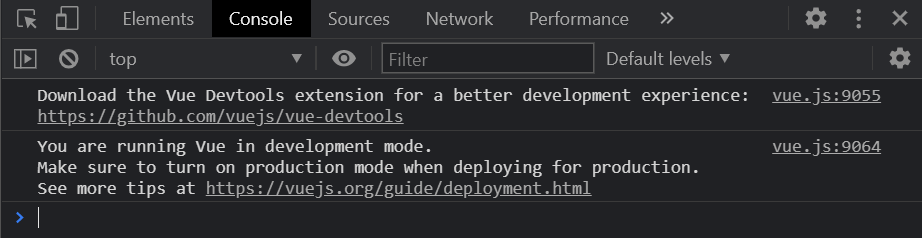


**NPM安装**

在用Vue构建大型应用时推荐使用NPM安装。

NPM能很好地和诸如webpack模块打包器配合使用。同时Vue也提供配套工具来开发单文件组件

```shell
npm install vue
```


## Vue源码

选择Tags下版本下载

版本：

- debug：开发
- release：发布

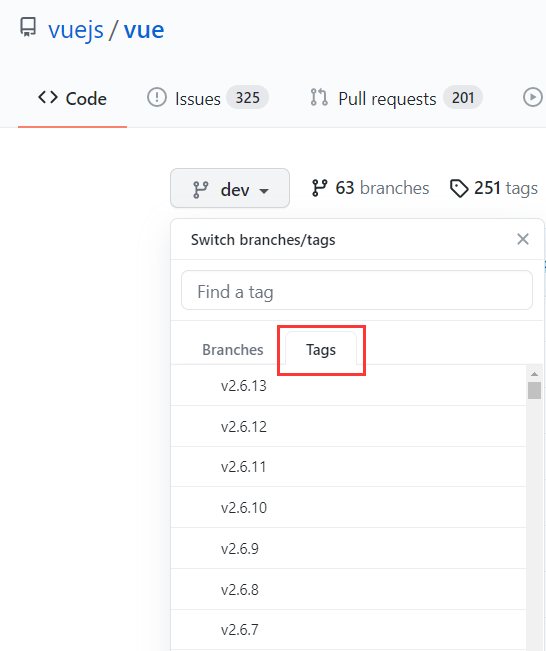


## Idea开发

2. 安装Vue插件

3. 设置Vue文件模板

   file->setting->editor->file and code Templates，选择Vue Single File Component

   > 如果安装完vue插件后，右键new发现没有Vue component选项，需要自己新建模板
   >
   > https://blog.csdn.net/weixin_38556197/article/details/113838663
   
   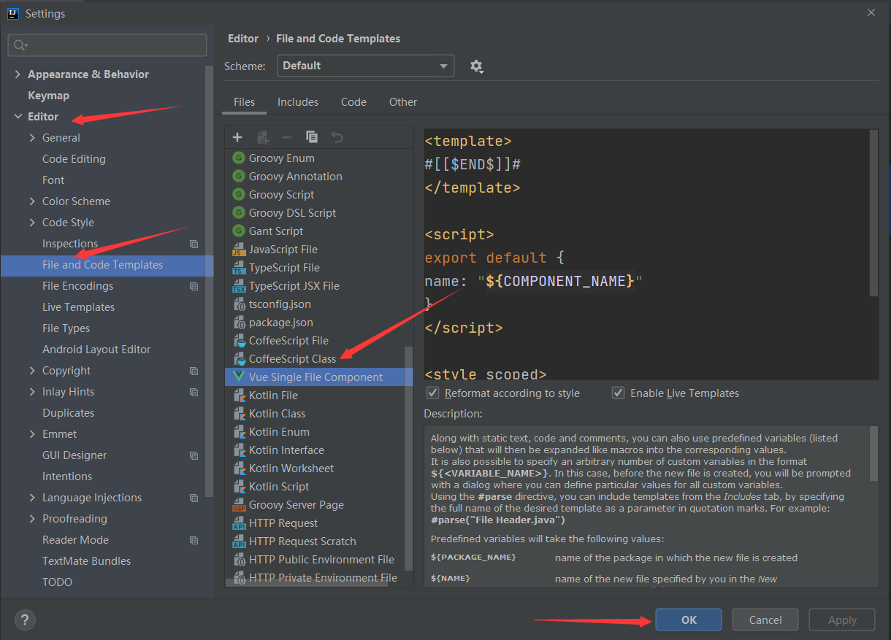


## 代码规范

eslint

缩进：2个空格

> CLI：`.editorconfig`

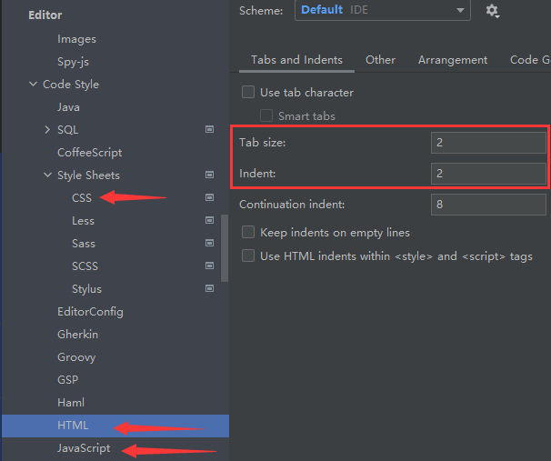


# Vue基础

**Vue有7个属性，8个方法，7个指令**（787原则）

**Vue属性**

- `el`：string或HTML Element，挂载Vue对象要管理的元素（指示Vue编译器解析）
- `data`：object或Function，Vue实例对应的数据对象（**组件中必须是函数Function**）
- `template`：模板，会替换页面元素（包括占位符）
- `methods`： {key: Function}，定义Vue的一些方法，可以在其他地方调用（包括指令）
- `render`：真正的Virtual Dom
- `computed`：计算属性
- `watch`：监听data中数据的变化


## Vue实例

每个Vue应用都是通过用`Vue({})`函数创建一个新的**Vue实例**开始，所有的Vue组件都是Vue实例

### 声明式编程

1. **导入Vue**
2. **new一个Vue对象**
3. **Vue对象绑定元素**
4. **存放数据**

> vue()函数传入的是一个对象{}
>
> 在文档中经常会使用 `vm` (ViewModel ) 这个变量名表示Vue实例
>
> 不再HTML直接交互，Vue应用会将其挂载到一个DOM元素上对其进行完全控制
>
> JavaScript是命令式编程
>
> 1. 创建div元素，设置id属性
> 2. 定义一个变量叫message
> 3. 将message变量放在div元素中显示
> 4. 修改message数据
> 5. 将修改的元素替换到div

```htmL
<!DOCTYPE html>
<html lang="en">
<head>
  <meta charset="UTF-8">
  <title>Title</title>
</head>
<body>
<!--view层 模板-->
<div id="app">
  {{message}}
</div>

<!--导入Vue.js-->
<script src="vue.js"></script>
<script>
  // var 没有作用域
  const vm = new Vue({
    // 元素element,json对象,逗号隔开
    el: "#app",
    // 对象:键值对
    // model层 数据
    data: {
      message:"Hello Vue!"
    }
  })
</script>
</body>
</html>
```


### 双向绑定

修改**Vue对象**就可以修改内容

> Vue不改变DOM

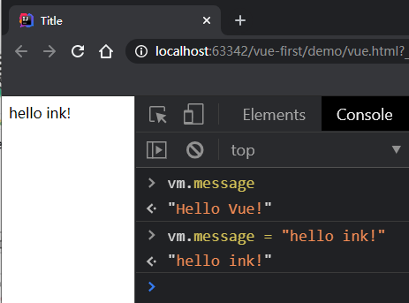


## Vue模板

> 生成在user组下

```html
<div id="app">
  {{message}}
</div>

<script src="vue.js"></script>
<script>
  const app = new Vue({
    el: '#app',
    data: {
      message: 'hello vue'
    },
  });
</script>
```

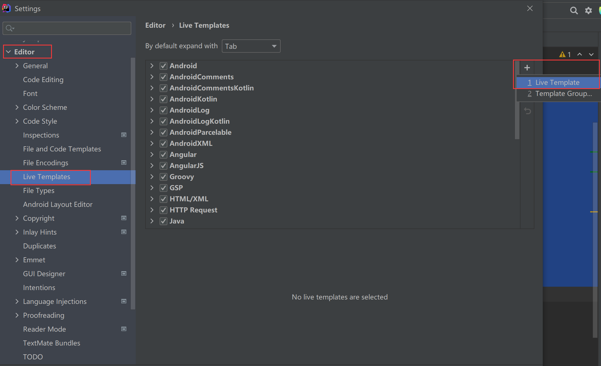

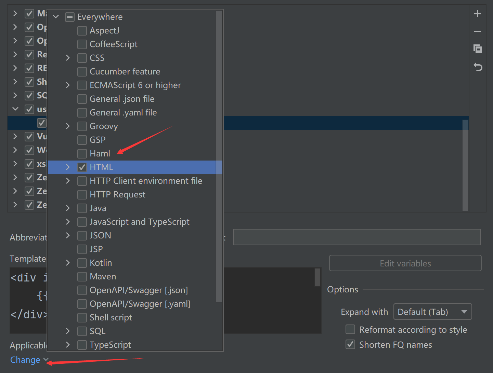


## 插值操作

将**值**插到模板的**内容**中

### 文本

**Mustache语法**

数据绑定最常见的形式就是使用Mustache语法 (**双大括号**) 的文本插值

Mustache语法`{{}}`中也**可以是简单的表达式**

> 用于内容


**`v-once`指令**

 执行**一次性地插值**，当数据改变时**插值处的内容不会更新**

```html
<body>
<div id="app">
  <h2 v-once> {{message}}</h2>
</div>

<script src="vue.js"></script>
<script>
  const app = new Vue({
    el: '#app',
    data: {
      message: 'hello vue'
    },
  });
</script>
</body>
```

****

**`v-text`指令**

`v-text`会覆盖dom元素中的数据，相当于JavaScript的`innerText()`方法


**`v-pre`指令**

直接输出`{{message}}`这样的字符串，而不是被`{{}}`语法转化的message的变量值


### HTML

 **`v-html`指令**

`{{}}`将数据解释为**普通文本**而非HTML代码

```html
<body>
<div id="app">
  <h2>不使用v-html</h2>
  <h2>{{url}}</h2>
  <h2>使用v-html，直接插入html</h2>
  <h2 v-html="url"></h2>

</div>
<script src="https://cdn.jsdelivr.net/npm/vue@2.6.10/dist/vue.js"></script>
<script>
  const app = new Vue({
    el: "#app",
    data: {
      message:"你好啊",
      url: "<a href='http://www.baidu.com'>百度一下</a>"
    }
  })
</script>
</body>
```


### v-cloak

有时候因为加载延时问题造成数据没有及时刷新，这时页面会显示从`{{message}}`到message变量的变化。使用`v-cloak`指令可以在没加载之前不显示数据

- 在vue解析之前，div属性中有`v-cloak`这个标签
- 在vue解析完成之后，v-cloak标签被移除

> 一开始有一个css属性`display:none`，加载完之后css属性变成`display:block`从而显示元素

```html
<!DOCTYPE html>
<html lang="en">

<head>
  <meta charset="UTF-8">
  <meta name="viewport" content="width=device-width, initial-scale=1.0">
  <meta http-equiv="X-UA-Compatible" content="ie=edge">
  <title>v-cloak指令的使用</title>
  <style>
    [v-cloak]{
      display: none;
    }
  </style>
</head>

<body>
<div id="app" v-cloak>
  <h2>{{message}}</h2>
</div>
<script src="https://cdn.jsdelivr.net/npm/vue@2.6.10/dist/vue.js"></script>
<script>
  //在vue解析前，div中有一个属性cloak
  //在vue解析之后，div中没有一个属性v-cloak
  setTimeout(() => {
    const app = new Vue({
      el: "#app",
      data: {
        message: "你好啊"
      }
    })
  }, 1000);
</script>
</body>
</html>
```


### Attribute

Mustache语法不能作用在HTML标签的属性`attribute`上

在HTML标签中使用 `v-bind`（简写`:`）绑定HTML标签的属性

> `v-bind:标签属性="变量值"`
>
> 对于布尔`attribute` ，只要存在就意味着值为 `true`

```html
<body>
<div id="app">
  <!-- 将span标签的title属性和Vue实例的message的值绑定 -->
  <span v-bind:title="message">     
        鼠标悬停几秒钟查看此处动态绑定的提示信息！   
    </span>
  <!-- 缩写 -->
  <span :title="message">     
        鼠标悬停几秒钟查看此处动态绑定的提示信息！   
    </span>
</div>
<script src="vue.js"></script>
<script>
  const vm = new Vue({
    el: "#app",
    data: {
      message:"Hello Vue!"
    }
  })
</script>
</body>
```


**JavaScript表达式**


## 动态绑定

`v-bind`（简写 `:`）

- 动态绑定属性（**响应式**的更新HTML**标签中的属性**）。当表达式的值改变时，将其产生的连带影响**响应式**地作用于绑定的DOM元素

-  `v-bind` 用于绑定`class`和`style`时，Vue做了专门的增强。表达式结果的类型除了字符串之外，还可以是**对象或数组**


### 参数

指令能够接收一个**参数**（HTML标签属性），在指令后以**冒号**表示

> 参数：`src`，`v-bind` 指令将该元素的 `src` 属性与 Vue对象的`url` 值绑定

```html
<body>
<div id="app">
  <image v-bind:src="url"></image>
  <a :href="link">点击跳转</a>
  <a href=""></a>
</div>

<script src="vue.js"></script>
<script>
  const app = new Vue({
    el: '#app',
    data: {
      url: 'https://img2.baidu.com/it/u=3228549874,2173006364&fm=26&fmt=auto&gp=0.jpg',
      link: 'http://www.baidu.com'
    },
  });
</script>
</body>
```

### 修饰符

修饰符是以 `.` 指明的**特殊后缀**，用于指出一个指令应该以**特殊方式绑定**


### 绑定class

可以对Dom元素的`class`属性进行动态绑定（用来选择Dom是否有指定的`class`属性）

**对象语法**

- 传入`class`属性**对象**并使用**布尔值选择**来动态地切换`class`属性
  - `<h2 :class="{类名1: boolean,类名2: boolean}">`
- 当对象中属性很多时也可以使用**方法调用**
  - `<h1 :class="getClasses()">class属性绑定</h1>`
- 动态绑定的`class`属性可以与普通的`class`属性共存
- 可以绑定计算属性（返回对象）

```html
<!DOCTYPE html>
<html lang="en" xmlns:v-bind="">
<head>
  <meta charset="UTF-8">
  <title>Title</title>
  <style>
    .active{
      color: red;
    }
  </style>
</head>
<body>
<div id="app">
  <image v-bind:src="url"></image>
  <a :href="link">点击跳转</a>
  <h1 v-bind:class="{active: isActive, line: isLine}">class属性绑定</h1>
  <h1 class="title" :class="getClasses()">class属性绑定</h1>

</div>
<script src="vue.js"></script>
<script>
  const app = new Vue({
    el: '#app',
    data: {
      url: 'https://img2.baidu.com/it/u=3228549874,2173006364&fm=26&fmt=auto&gp=0.jpg',
      link: 'http://www.baidu.com',
      isActive: true,
      isLine: true
    },
    methods: {
      getClasses(){
        return {active: this.isActive, line: this.isLine}
      }
    }
  });
</script>
</body>
</html>
```


**数组语法**

`class`属性可以是一个数组，会依次解析成对应的`class`，数组也可以由方法返回

-  加上单引号表示字符串（写死）
-  不加单引号的表示变量

```html
<body>
<div id="app">
  <!-- 加上单引号表示字符串 -->
  <h2 class="title" :class="['active','line']">{{message}}</h2>
  <!-- 不加表示变量 -->
  <h2 class="title" :class="[active,line]">{{message}}</h2>
  <!-- 方法返回数组 -->
  <h2 class="title" :class="getClasses()">{{message}}</h2>

</div>
<script src="vue.js"></script>
<script>
  const app = new Vue({
    el: '#app',
    data:{
      message: '你好啊',
      active: 'ink',
      line: 'yinke'
    },
    methods: {
      getClasses(){
        return [this.active,this.line]
      }
    },
  })
</script>
</body>
```

### 绑定style

绑定CSS内联样式：`<p :style="{key1:value1,key2:value2}"></p>`

- 对象语法
  - 对象的`key`是CSS的属性名称
  - 对象的`value`是具体赋的值，可以来源于`data`中
- 数组语法

> 组件化开发中可复用组件的使用，动态绑定样式属性
>
> 驼峰命名法
>
> 当属性过于复杂时，可以放在一个methods中或计算属性中

```html
<body>
<div id="app">
  <!-- 对象语法 -->
  <!-- 加单引号表示字符串 -->
  <h2 :style="{fontSize: '50px'}">{{message}}</h2>
  <!-- 不加单引号表示变量 -->
  <h2 :style="{fontSize: fontSize}">{{message}}</h2>
  <!-- 数字和字符串连接成字符串 -->
  <h2 :style="{fontSize: fontSizenopx + 'px'}">{{message}}</h2>
  <!-- 方法 -->
  <h2 :style="getStyle1()">{{message}}</h2>
  
  <!-- 数组语法:对象数组 -->
  <h2 :style="[baseStyle1,baseStyle2]">{{message}}</h2>
</div>
<script src="vue.js"></script>
<script>
  const app = new Vue({
    el:"#app",
    data:{
      message: '你好啊',
      fontSize: '50px',
      fontSizenopx: 100,
      baseStyle1: {backgroundColor: 'red'},
      baseStyle2: {fontSize: '100px'}
    },
    methods: {
      getStyle1(){
        return {fontSize: this.fontSize}
      },
      getStyle2(){
        return [this.baseStyle]
      }
    },
  })
</script>
</body>
```


## 事件监听

`v-on` （简写 `@`）

可以监听DOM事件并绑定在事件触发时要运行的`methods`中的方法

> `v-on`指令可以绑定HTML所有的事件

```html
<body>
<div id="app">
  <!-- 通过方法响应点击事件 -->
  <button v-on:click="sayhi">点击</button>
  <!-- 简写 -->
  <button @click="sayhi">点击</button>
</div>
<script src="vue.js"></script>
<script>
  const app = new Vue({
    el: "#app",
    data: {
      message: "hi ink"
    },
    // 方法也是K-V键值对
    methods: {
      // sayhi: function ()
      sayhi(){
        alert(this.message);
      }
    }
  })
</script>
</body>
```

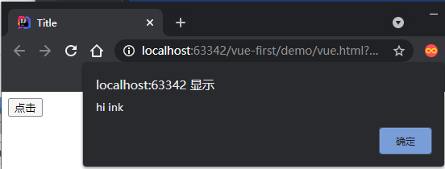


### 参数

- 事件调用的方法不需要传递参数，方法后的`()`可以不添加
- 事件调用的方法需要传递参数，但方法后没加`()`，默认将原生事件`event`对象当成参数传递
- 事件调用的方法需要传递参数，而且还需要`event`对象，可以通过`$event`获取`event`对象

```html
<body>
<div id="app">
  <!-- 不传参 -->
  <button @click="btnClick1">按钮1</button>
  <button @click="btnClick1()">按钮1</button>
  <!-- 事件调用方法需要传参，但省略了小括号 -->
  <button @click="btnClick2(123)">按钮3</button>
  <button @click="btnClick2()">按钮4</button>
  <button @click="btnClick2">按钮5</button>
  <!-- 事件调用方法需要传入event和其他参数 -->
  <button @click="btnClick3($event,123)">按钮6</button>
</div>
<script src="vue.js"></script>
<script>
  const app = new Vue({
    el: '#app',
    methods: {
      btnClick1(){
        console.log("点击");
      },
      btnClick2(value){
        console.log(value);
      },
      btnClick3(event,value){
        console.log(event+" "+value);
      }
    }
  })
</script>
</body>
```

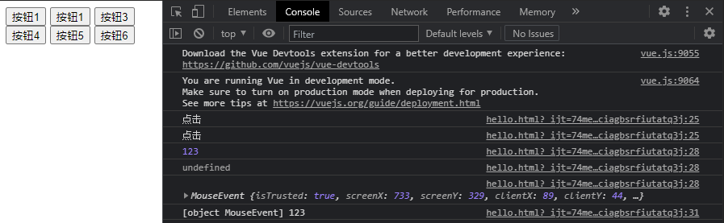

### 修饰符

方法只有纯粹的数据逻辑，不会去处理DOM事件细节

> 事件冒泡

Vue为`v-on` 指令提供了**事件修饰符**（点开头的指令后缀表示）

- `.stop`：调用`event.stopPropagation()`，阻止事件冒泡
- `.prevent`：调用`event.preventDefault()`，阻止默认事件
- `.{keyCode}` ：只有当事件是**键盘特定键**触发时才触发回调
- `.enter`：监听键盘**回车键**敲击事件
- `.native`：监听**组件**根元素的原生事件
- `.once`：只触发一次回调
- `.capture`
- `.self`
- `.passive`

> 使用修饰符时，顺序很重要。相应的代码会以同样的顺序产生

```html
<!-- 阻止单击事件继续传播 -->
<a @click.stop="doThis"></a>

<!-- 提交事件不再重载页面 -->
<form @submit.prevent="onSubmit"></form>

<!-- 修饰符可以串联 -->
<a @click.stop.prevent="doThat"></a>

<!-- 只有修饰符 -->
<form @submit.prevent></form>

<!-- 添加事件监听器时使用事件捕获模式 -->
<!-- 即内部元素触发的事件先在此处理，然后才交由内部元素进行处理 -->
<div @click.capture="doThis">...</div>

<!-- 只当在 event.target 是当前元素自身时触发处理函数 -->
<!-- 即事件不是从内部元素触发的 -->
<div @click.self="doThat">...</div>

<!-- 监听键盘的事件 -->
<input type="text" @keyup="keyup">

<!-- 监听键盘回车键的事件 -->
<input type="text" @keyup.enter="keyup">
```


## 条件渲染

根据表达式的值在DOM中**渲染或销毁**元素或组件

- `v-if`
  - 单独使用`v-if`，变量为布尔值
- `v-else-if`
- `v-else`

> ===：JavaScript中先判断**类型**是否一致，再比较值

```html
<body>
<div id="app">
  <h2 v-if="isFlag">isFlag为true显示这个</h2>
  <h2 v-show="isShow">isShow为true是显示这个</h2>
  <div v-if="age<18">小于18岁未成年</div>
  <div v-else-if="age<60">大于18岁小于60岁正值壮年</div>
  <div v-else="">大于60岁,暮年</div>
</div>
<script src="vue.js"></script>
<script>
  const app = new Vue({
    el: "#app",
    data: {
      isFlag: true,
      isShow: false,
      age: 52
    }
  })
</script>
</body>
```

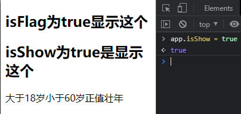


**条件很多时建议使用计算属性** 

```html
<body>
<div id="app">
  <!-- 计算属性 -->  
  <div>{{show}}</div>
</div>
<script src="vue.js"></script>
<script>
  const app = new Vue({
    el: '#app',
    data: {
      age: 52
    },
    computed: {
      show(){
        let showm = ''
        if(this.age <18){
          showm = '小于18岁未成年'
        }
        else if(this.age <60){
          showm = '大于18岁小于60岁正值壮年'
        }
        else{
          showm = '大于60岁暮年'
        }
        return showm
      }
    }
  })
</script>
</body>
```


### 包裹渲染

`v-if` 是一个指令，只能将它添加到一个元素上

如果想切换多个元素，可以把一个 `template` 元素当做不可见的**包裹元素**，并在上面使用 `v-if`。最终的渲染结果将不包含 `template` 元素

```html
<template v-if="ok">
    <h1>Title</h1>  
    <p>Paragraph 1</p>  
    <p>Paragraph 2</p> 
</template>
```


### v-show

决定一个元素是否渲染

- 带有 `v-show` 的元素**始终会被渲染并保留在DOM中**
- `v-show` 只是切换元素的CSS属性（`display`）
- `v-show` 不支持 `template` 元素，也不支持 `v-else`

**区别**：

- `v-if` 是**真正的条件渲染**，它会确保在切换过程中条件块内的事件监听器和子组件适当地被销毁和重建
- `v-if` 是**惰性的**：如果在初始渲染时条件为假，则什么也不做，直到条件第一次变为真时，才会开始渲染条件块
- `v-show`不管初始条件是什么，**元素总是会被渲染**，并且只是简单地基于CSS进行切
- `v-if` 有更高的切换开销，而 `v-show` 有更高的初始渲染开销。如果需要非常频繁地切换，使用 `v-show` 较好。如果在运行时条件很少改变，使用 `v-if` 较好

> `v-if`当条件为false时，不会有对应的元素在DOM中，`v-show`当条件为false时，将元素的display属性设置为none而已。
>
> 当 `v-if` 与 `v-for` 一起使用时，`v-for` 具有比 `v-if` 更高的优先级
>
> 不推荐一起使用


### 登录demo

```html
<body>
<div id="app">
    <span v-if="isUser">
      <!-- 点击获取聚焦   -->
      <label for="username">用户账号</label>
      <input type="text" id="username" placeholder="请输入用户名" >
    </span>
  <span v-else="isUser">
        <label for="email">用户邮箱</label>
        <input type="text" id="email" placeholder="请输入用户邮箱" >
    </span>
  <button @click="isUser=!isUser">切换类型</button>
</div>
<script src="vue.js"></script>
<script>
  const app = new Vue({
    el: '#app',
    data: {
      isUser: true
    }
  })
</script>
</body>
```

**渲染问题**

在已有输入内容的情况下，切换类型后不会清空已有内容

**原因**

Vue在进行DOM渲染时，出于性能考虑，会**尽可能的复用已经存在的元素**，而不是重新创建新的元素。所以Vue内部发现原来的`input`元素不再使用后，所以直接将其映射对应成虚拟DOM复用

**解决**

给对应的`input`添加`key`属性，并且需要保证`key`不同

```html
<input type="text" id="username" placeholder="请输入用户名" key="username">
<input type="text" id="email" placeholder="请输入用户邮箱" key="email">
```


## 列表渲染	

### 遍历数组

使用`v-for`指令和 `(item,index) in items` 语法，基于一个数组来渲染一个列表

-  `index`：数组元素**索引**
-  `item` ：被迭代的**数组元素**
-  `items` ：**源**数据数组

> 响应式：追加数据可以自动展示
>
> `(item,index)`：元组
>
> 可以用 `of` 替代 `in` 作为分隔符

```html
<body>
<div id="app">
    <li v-for="item in items">
        {{item.message}}
    </li>
</div>
<div id="app">
    <li v-for="(item,index) in items">
        {{index + "." + item.message}}
    </li>
</div>
<script src="vue.js"></script>
<script>
    const vm = new Vue({
        el: ''#app',
        data: {
            items: [
                {message: 'ink'},
                {message: 'yinke'}
            ]
        }
    })
</script>
</body>
```

`v-for` 可以访问到**父作用域**的属性

```html
<body>
<div id="app">
  <ul id="app">
    <li v-for="(item, index) in items">
      {{ parentMessage + "-" + index + "-" + item.message}}
    </li>
  </ul>
</div>
<script src="vue.js"></script>
<script>
  const app = new Vue({
    el: '#app',
    data: {
      parentMessage: 'Parent',
      items: [
        { message: 'Foo' },
        { message: 'Bar' }
      ]
    }
  });
</script>
</body>
```

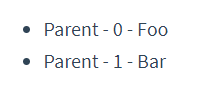

### 遍历对象

- 遍历对象时如果只取一个值`item in items`，默认获取的是`value`
- 使用`(value,key) in items`获取`value`和`key`
- 使用`(value,key,index) in items`获取`value`，`key`和`index`

> 遍历对象时会按 `Object.keys()` 的结果遍历

```html
<body>
<div id="app">
  <ul>
    <li v-for="(value,key) in user" >{{key+"-"+value}}</li>
  </ul>
  <ul>
    <li v-for="(value,key,index) in user" >{{key+"-"+value+"-"+index}}</li>
  </ul>
</div>
<script src="vue.js"></script>
<script>
  const app = new Vue({
    el: "#app",
    data: {
      user: {
        name: "ink",
        height: 182,
        age: 24
      }
    }
  })
</script>
</body>
```

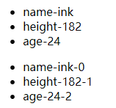


### key属性

官方推荐在使用`v-for`时给对应的**元素或组件**添加上一个`key`属性

**key的作用主要是为了高效的更新虚拟DOM**

> 要保证key绑定的值和元素一一对应，不要使用`index`，一般就使用`item`
>
> 不加`key`渲染的时候会**依次替换**渲染，加了`key`后会直接将其放在指定位置

```html
<body>
<div id="app">
  <!-- 不加key如果要插入f依次改变 -->
  <ul>
    <li v-for="item in letters">{{item}}</li>
  </ul>
  <button @click="add1">没有key</button>
  <!-- 加key如果要插入f使用diff算法高效 -->
  <ul>
    <li v-for="item in letters" :key="item">{{item}}</li>
  </ul>
  <button @click="add2">有key</button>
</div>
<script src="vue.js"></script>
<script>
  const app = new Vue({
    el: '#app',
    data: {
      letters: ['a','b','c','d','e']
    },
    methods: {
      add1(){
        this.letters.splice(2,0,'f')
      },
      add2(){
        this.letters.splice(2,0,'f')
      }
    }
  })
</script>
</body>
```


### 状态维护

Vue 更新使用 `v-for` 渲染的元素列表时默认使用**就地更新**的策略。如果数据项的顺序被改变，**Vue 将不会移动DOM元素来匹配数据项的顺序，而是就地更新每个元素**，确保它们在每个索引位置正确渲染

> **只适用**于不依赖子组件状态或临时DOM状态 (例如表单输入值) 的列表渲染输出


### 数组更新

改变DOM绑定的数据时DOM会动态改变值（响应式）

对于动态变化数据，**不是所有的改变数据的方法都是响应式的**

- **通过索引值改变数组中元素是非响应式的（不会重新渲染）**
  - `this.letters[0]='f'`
- **响应式方法**
  - `push()`：在数组最后面添加一个元素（可以添加多个）
  - `pop()`：删除数组最后一个元素
  - `shift()`：删除数组第一个元素
  - `unshift()`：在数组最前面添加一个元素（可以添加多个）
  - `splice(start,number,item)`：删除元素/插入元素/替换元素
  - `sort()`：排序
  - `reverse()`：反转


### 遍历demo

1. 给每个`<li>`标签加上点击事件，并将遍历的`index`作为参数传入点击事件的回调函数`liClick()`中
2. 定义`curIndex`表示当前索引用于表示选中的电影，初始值为-1
3. 通过`index=curIndex`判断是否是当前选中的电影来改变`class`属性

```html
<!DOCTYPE html>
<html lang="en">

<head>
  <meta charset="UTF-8">
  <meta name="viewport" content="width=device-width, initial-scale=1.0">
  <meta http-equiv="X-UA-Compatible" content="ie=edge">
  <title>综合练习</title>
  <style>
    .active {
      background-color: red;
    }
  </style>
</head>

<body>
<div id="app">
  <ul>
    <li v-for="(item,index) in movies"
        @click="liClick(index)"
        :class="{active:index===curIndex}">
      {{index+"---"+item}}
    </li>
  </ul>
</div>
<script src="vue.js"></script>
<script>
  const app = new Vue({
    el: "#app",
    data: {
      movies: ['复仇者联盟', '蝙蝠侠', '海贼王', '星际穿越'],
      curIndex:-1
    },
    methods: {
      liClick(index){
        this.curIndex = index
      }
    }
  })
</script>
</body>
</html>
```


## 表单绑定

多用于用户信息的提交

### 双向绑定

- `v-model`指令可以实现**表单输入和应用状态**之间的**双向绑定**
- `v-model`会忽略所有表单元素的`value`，`checked`，`selected`的初始值而**将Vue实例数据作为数据来源**（所以要在组件的`data`中声明初始值）
- `v-model`在内部为**不同的输入元素使用不同的属性并抛出不同的事件**
  - `text/textarea`：使用 `value`属性和 `input` 事件
  - `checkbox/radio`：使用 `checked`属性和 `change` 事件
  - `select`：使用 `value`属性和`change` 作为事件

> `label`标签
>
> 在label元素内点击文本就会触发此控件，即选择该标签时浏览器就会自动将焦点转到和标签相关的表单控件上

#### text

```html
<body>
<div id="app">
  <!--绑定message和input表单内容-->
  输入文本<input type="text" v-model="message">
  <p>{{message}}</p>
  <button type="button" @click="submit">提交</button>
  <div></div>
  
</div>
<script src="vue.js"></script>
<script>
  const app = new Vue({
    el: '#app',
    data: {
      message: 'ink',
    },
    methods: {
      submit: function (){
        alert(this.message)
      }
    }
  });
</script>
</body>
```

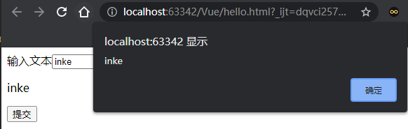

#### radio

多个`radio`单选框如果绑定相同的属性就可以实现互斥，如果使用`v-model`**绑定相同的属性**，也可以实现互斥

```html
<body>
<div id="app">
  <!-- v-model绑定sex后，用于互斥的name属性可以省略 -->
  <label for="male">
    <input type="radio" id="male" name="sex" value="男" v-model="sex">男
  </label>
  <label for="female">
    <input type="radio" id="female" name="sex" value="女" v-model="sex">女
  </label>
  <h2>你选择的性别是：{{sex}}</h2>

</div>
<script src="vue.js"></script>
<script>
  const app = new Vue({
    el: '#app',
    data: {
      sex: '男'
    },
  })
</script>
</body>
```

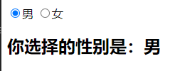

#### checkbox单选

```html
<body>
<div id="app">
  <!-- 单个复选框-->
  <input type="checkbox" id="checkbox" v-model="checked">
  <label for="checkbox">{{ checked }}</label>
</div>
<script src="vue.js"></script>
<script>
  const app = new Vue({
    el: '#app',
    data: {
      checked: ''
    }
  });
</script>
</body>
```

#### checkbox多选

```html
<body>
<div id="app">
  <!-- 多个复选框-->
  <input type="checkbox" id="jack" value="Jack" v-model="checkedNames">
  <label for="jack">Jack</label>
  <input type="checkbox" id="john" value="John" v-model="checkedNames">
  <label for="john">John</label>
  <input type="checkbox" id="mike" value="Mike" v-model="checkedNames">
  <label for="mike">Mike</label>
  <br>
  <span>Checked names: {{ checkedNames }}</span>
</div>
<script src="vue.js"></script>
<script>
  const app = new Vue({
    el: '#app',
    data: {
      checkedNames: []
    }
  });
</script>
</body>
```

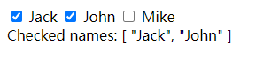

#### select

`select`也分单选和多选两种情况

> 按住ctrl多选

```html
<body>
<div id="app">
  <!-- select单选 -->
  <select name="fruit" v-model="fruit">
    <option value="苹果">苹果</option>
    <option value="香蕉">香蕉</option>
    <option value="西瓜">西瓜</option>
  </select>
  <h2>你选择的水果是：{{fruit}}</h2>
  
  <!-- select多选 -->
  <select name="fruits" v-model="fruits" multiple>
    <option value="苹果">苹果</option>
    <option value="香蕉">香蕉</option>
    <option value="西瓜">西瓜</option>
  </select>
  <h2>你选择的水果是：{{fruits}}</h2>
</div>
<script src="vue.js"></script>
<script>
  const app = new Vue({
    el: '#app',
    data: {
      fruit: "苹果",
      fruits: []
    },
  })
</script>
</body>
```


### v-model原理

`v-model` = `v-bind` + `v-on`

`v-model`本质上是一个语法糖，它负责**监听用户的输入事件**以**更新数据**，并对一些极端场景进行特殊处理

它本质上包含两个操作

- `v-bind`绑定`input`标签的`value`属性
- `v-on`绑定`input`标签的`input`事件（通过event获取当前`value`值）

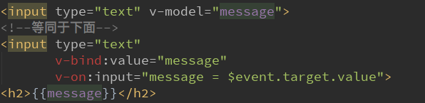


### 值绑定

动态的给`input`标签的`value`属性赋值


### 修饰符

`.lazy`

默认情况下`v-model` 在每次 `input` 事件触发后就会将输入框的值与数据进行同步（即只要数据变化就会同步）

使用 `lazy` 修饰符可以设置为在 `change` 事件**之后**进行同步（只有在回车或者失去焦点后才会同步）

```html
<input v-model.lazy="ink">
```

`.number`

默认情况下输入框中无论输入的是字母还是数字，**都会被当做字符串类型**进行处理

使用 `number` 修饰符可以自动将用户的输入值转为**数字类型**

```html
<input v-model.number="age" type="number">
```

`.trim`

使用`trim`修饰符可以自动**过滤输入的首尾空格**

```html
<input v-model.trim="ink">
```


## 综合demo

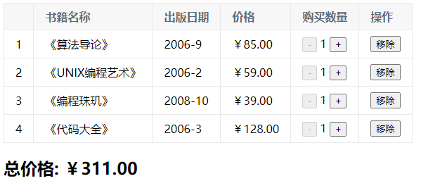

```html
<!DOCTYPE html>
<html lang="en" xmlns:v-bind="http://www.w3.org/1999/xhtml">
<head>
  <meta charset="UTF-8">
  <title>综合练习</title>
  <style>
    table {
      border: 1px solid #e9e9e9;
      border-collapse: collapse;
      border-spacing: 0;
    }
    th, td {
      padding: 8px 16px;
      border: 1px solid #e9e9e9;
      text-align: left;
    }
    th {
      background-color: #f7f7f7;
      color: #5c6b77;
      font-weight: 600;
    }
  </style>
</head>
<body>
<div id="app">
  <div v-if="books.length">
    <table>
      <thead>
      <tr>
        <th></th>
        <th>书籍名称</th>
        <th>出版日期</th>
        <th>价格</th>
        <th>购买数量</th>
        <th>操作</th>
      </tr>
      </thead>
      <tbody>
      <tr v-for="(item,index) in books">
        
        <td>{{item.id}}</td>
        <td>{{item.name}}</td>
        <td>{{item.date}}</td>
        <td>{{price(item.price)}}</td>
        <td>
          <button @click="reduce(index)" v-bind:disabled="item.count <= 1">-</button>
          {{item.count}}
          <button @click="increase(index)">+</button>
        </td>
        <td>
          <button @click="remove(index)">移除</button>
        </td>
      </tr>
      </tbody>
    </table>
    <h2>总价格: {{price(totleprice)}}</h2>
  </div>
  <h1 v-else>购物车为空</h1>
</div>
<script src="vue.js"></script>
<script>
  const app = new Vue({
    el: '#app',
    data: {
      books: [
        {
          id: 1,
          name: '《算法导论》',
          date: '2006-9',
          price: 85.00,
          count: 1
        },
        {
          id: 2,
          name: '《UNIX编程艺术》',
          date: '2006-2',
          price: 59.00,
          count: 1
        },
        {
          id: 3,
          name: '《编程珠玑》',
          date: '2008-10',
          price: 39.00,
          count: 1
        },
        {
          id: 4,
          name: '《代码大全》',
          date: '2006-3',
          price: 128.00,
          count: 1
        },
      ]
    },
    methods: {
      price(price) {
        return '￥' + price.toFixed(2)
      },
      reduce(index) {
        this.books[index].count--
      },
      increase(index) {
        this.books[index].count++
      },
      remove(index){
        this.books.splice(index,1)
      }
    },
    computed: {
      totleprice(){
        let totle = 0
        for(let i=0; i<this.books.length; i++){
          totle += this.books[i].price * this.books[i].count
        }
        // for in
        // for (let i in this.books) {
        //   total = total + this.books[i].price * this.books[i].count
        // }
        // for of
        // for (const book of this.books) {
        //   total = total + book.price * book.count
        // }
        return totle
        
        // 高阶函数
        // return this.books.map(function (book) {
        //   return book.price * book.count
        //  }).reduce(function (preValue,currentValue) {
        //     return preValue + currentValue
        //   })
        // 高阶函数简写（箭头函数）
        // return this.books.length === 0 ? 0 : this.books.map(book => book.price * book.count).reduce((preValue,currentVlue) => preValue + currentVlue)

      }
    }
  })
</script>
</body>
</html>
```


# 计算属性

`computed`

计算属性：在内存中运行，能够将计算结果缓存起来的属性（将行为转换为静态的属性）

对于任何复杂逻辑都应当使用**计算属性**

```html
<body>
<div id="app">
  <!-- Mastache语法 -->
  <h2>{{firstName+ " " + lastName}}</h2>
  <!-- 方法 -->
  <h2>{{getFullName()}}</h2>
  <!-- 计算属性 -->
  <h2>{{fullName}}</h2>
</div>
<script src="vue.js"></script>
<script>
  const app = new Vue({
    el: '#app',
    data:{
      firstName: 'ink',
      lastName: 'yinke'
    },
    computed: {
      fullName(){
        return this.firstName + " " + this.lastName
      }
    },
    methods: {
      getFullName(){
        return this.firstName + " " + this.lastName
      }
    },
  })
</script>
</body>
```

```html
<body>
<div id="app">
  <h2>总价格：{{totalPrice}}</h2>
</div>
<script src="vue.js"></script>
<script>
  const app = new Vue({
    el: '#app',
    data: {
      books:[
        {id:110,name:"JavaScript从入门到入土",price:119},
        {id:111,name:"Java从入门到放弃",price:80},
        {id:112,name:"编码艺术",price:99},
        {id:113,name:"代码大全",price:150},
      ]
    },
    computed: {
      totalPrice(){
        let result= 0;
        for (let i = 0; i < this.books.length; i++) {
          result += this.books[i].price;
        }
        return result
      }
    }
  })
</script>
</body>
```


## setter和getter

完整的计算属性是一个对象，里面包含`set`方法和`get`方法。一般只实现`get`方法（默认）

> 不实现`set`方法的计算属性相当于只读属性
>
> 也可以实现`set`方法：`set:function(newValue){}`

```html
<body>
<div id="app">
  <!-- Mastache语法 -->
  <h2>{{firstName+ " " + lastName}}</h2>
  <!-- 方法 -->
  <h2>{{getFullName()}}</h2>
  <!-- 计算属性 -->
  <h2>{{fullName}}</h2>
</div>
<script src="vue.js"></script>
<script>
  const app = new Vue({
    el: '#app',
    data:{
      firstName: 'ink',
      lastName: 'yinke'
    },
    computed: {
      // 实际实现,但一般省略get
      fullName:{
        get(){
          return this.firstName + " " + this.lastName
        }
      }
      // 等价写法
      // fullName: function(){
      //   return this.firstName + " " + this.lastName
      // }
    },
    methods: {
      getFullName(){
        return this.firstName + " " + this.lastName
      }
    }
  })
</script>
</body>
```


## 计算属性和方法对比

**缓存**

- 计算属性是基于响应式依赖进行**缓存**的，只有相关响应式依赖发生**改变时才会重新计算**求值。只要计算值没有发生改变，多次访问计算属性都会立即返回之前的计算结果而不必再次执行函数（**只执行一次**）
- `methods`没有缓存特性，方法**只要被调用就会再次执行函数**

**使用**

- `methods`定义方法，调用要加上`()`
- `computed`定义计算属性，直接调用属性名

> `computed`中的方法不要和`methods`中的方法同名，同名时默认使用`methods`中的方法

```html
<body>
<div id="vue">
  <p>{{currentTime1()}}: methods</p>
  <!-- 计算属性将不再更新，因为Date.now()不是响应式依赖 -->
  <p>{{currentTime2}}: computed</p>
</div>
<script src="vue.js"></script>
<script>
  const app = new Vue({
    el: '#vue',
    data: {
      message: 'ink'
    },
    methods: {
      currentTime1(){
        return Date.now();
      }
    },
    computed: {
      currentTime2(){
        return Date.now();
      }
    }
  })
</script>
</body>
```

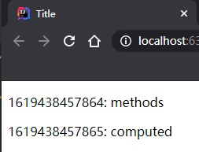


## 监听器


# Vue生命周期

每个Vue实例在被创建时都要经过一系列的**初始化过程**（例如需要设置数据监听、编译模板、将实例挂载到DOM 并在数据变化时更新DOM）

在这个过程中会运行（回调）一些叫做**生命周期钩子**的函数，可以让用户在不同阶段实现想要的功能

> 组件的生命周期也相似


**钩子函数Hook以属性（函数）的方式声明在Vue对象中**（`options`）

- `beforeCreate`：实例初始化之后，数据观测和事件配置之前被调用（页面创建之前）
- `created`：在实例创建完成后被立即调用（数据观测和事件配置已经完成），此时挂载阶段还没开始，`el`属性不可见
- `beforeMount`：挂载开始之前被调用，相关的渲染函数首次被调用
- `mounted`：挂载成功时调用，`el`被新创建的`vm.$el`替换
- `beforeUpdate`：数据更新时被调用
- `updated`：更新之后调用，组件DOM已经更新
- `activated`
- `deactivated`
- `beforeDestory`
- `destroyed`


```html
<body>
<div id="app">
  <div>{{info.name}}</div>
  <div>{{info.links[0].name}}</div>
  <!-- 错误:<a href="{{info.url}}">点击</a> -->
  <!-- 要用v-bind绑定 -->
  <a v-bind:href="info.url">点击跳转</a>
</div>
<script src="vue.js"></script>
<script src="https://unpkg.com/axios/dist/axios.min.js"></script>
<script>
  const app = new Vue({
    el: '#app',
    data: {
      // 设置info为{}，自动绑定response的各个属性
      info: {}
    },
    // 钩子函数（链式编程）
    // data.json路径
    mounted(){
      // GET请求得到返回数据绑定到data中
      axios.get('data.json').then(response=>(this.info = response.data));
    }
  });
</script>
</body>
```

json文件

```json
{
  "name": "ink",
  "url": "https://www.baidu.com/",
  "page": 1,
  "isNonProfit": true,
  "address": {
    "street": "知春路",
    "city": "北京",
    "country": "中国"
  },
  "links": [
    {
      "name": "Vue",
      "url": "https://cn.vuejs.org/"
    },
    {
      "name": "leetcode",
      "url": "https://leetcode-cn.com/"
    },
    {
      "name": "知乎",
      "url": "https://www.zhihu.com/"
    }
  ]
}
```

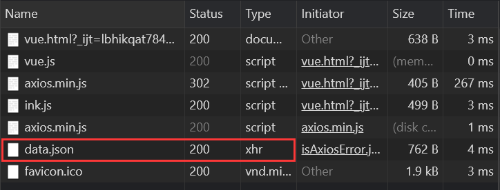

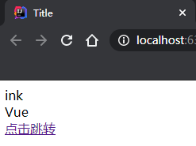


# Vue组件

**Vue组件化思想**

将一个页面拆分成多个组件（功能块），每一个组件又可以进行细分。每个组件完成属于自己的独立功能

几乎任意类型的应用界面都可以抽象为一个**组件树**

> 组件系统是一种抽象，可以使用小型、独立和可复用的组件构建大型应用
>
> 尽可能的将页面拆分成一个个小的、可复用的组件

**Vue组件**

- 一个组件本质上是一个拥有预定义选项的，可复用的一个**Vue实例**
- 组件是的Vue实例，所以它与 `new Vue` 接收相同的选项（如 `data`、`computed`、`watch`、`methods` 以及生命周期钩子函数等），但不包括`el` 这样的**根实例**特有的选项
- 每个组件都会各自独立维护它的属性。每用一次组件，就会有一个它的新**实例**被创建

> Vue 组件提供了纯自定义元素所不具备的一些重要功能，最突出的是跨组件数据流、自定义事件通信以及构建工具集成。


**idea新建Vue组件**

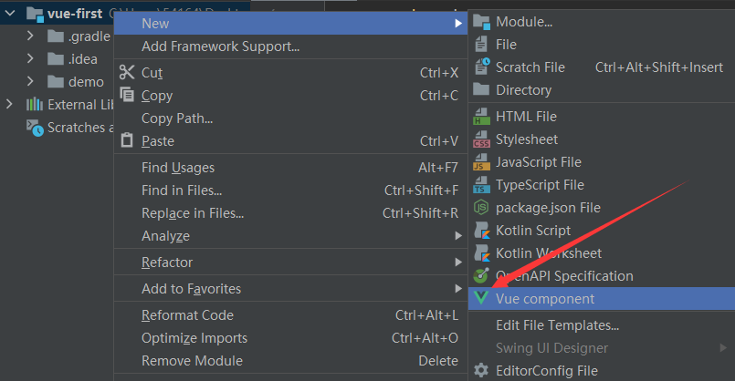

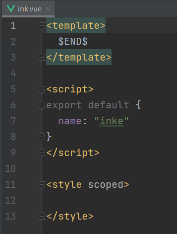


## 使用组件

**步骤**

1. 调用`Vue.extend()`方法创建**组件构造器**
   - 传入`template`代表自定义组件模板（模板是在使用到组件的地方要显示的HTML代码）
2. 调用`Vue.component()`方法**注册全局组件**
   - 将组件构造器注册为一个组件，并给它起一个标签名称，需要传递两个参数：
     - **组件标签名**
     - **组件构造器**
3. 在**Vue实例的作用范围内**使用组件

> 下面这种写法在Vue2.x的文档中几乎已经看不到了

```html
<body>
<div id="app">
  <!--3.使用组件-->
  <my-cpn></my-cpn>
  <my-cpn></my-cpn>
</div>
<script src="vue.js"></script>
<script>
  // 1.创建组件构造器对象
  const cpnC = Vue.extend({
    // `` ES6
    template: `
    <div>
      <h2>我是标题</h2>
      <p>我是内容1</p>
      <p>我是内容2</p>
    </div>`
  })
  // 2.注册组件
  Vue.component('my-cpn', cpnC)
  
  const app = new Vue({
    el: '#app',
    data: {
      message: '你好啊'
    }
  })
</script>
</body>
```


**组件的模板必须只具备一个根元素**

如果在组件内包含多个元素，**需要有一个根元素将它们包起来**，否则会报错（都是根元素）

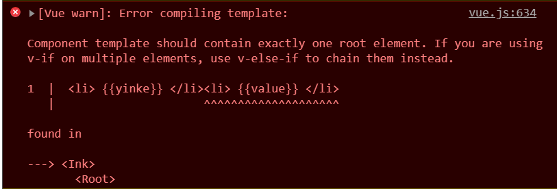


## 注册组件

### 局部组件

通过Vue实例中的 `components`局部注册的组件，只能在**当前vue实例挂载的对象**中使用

`components: {组件标签,组件构造器}`

> 调用`Vue.component()`注册的组件属于全局注册。该组件可以在**任意Vue实例**下使用
>
> 一个组件就是一个Vue实例，所以Vue实例的属性组件也有（`el`除外）
>
> 开发中一般只有一个Vue实例，基本都使用局部组件

```html
<body>
<div id="app">
  <h2>全局组件</h2>
  <my-cpn></my-cpn>
  <h2>局部组件</h2>
  <cpnc></cpnc>
</div>
<script src="vue.js"></script>
<script>
  // 1.创建组件构造器
  const cpnC = Vue.extend({
    template:`
        <div>
          <h2>标题</h2>
          <p>内容1</p>
          <p>内容2</p>
        </div>`
  })
  // 2.注册组件（全局组件，可以在多个vue实例中使用）
  Vue.component('my-cpn', cpnC)
  
  const app = new Vue({
    el: "#app",
    components: {
      // 局部组件创建
      // key：组件标签，
      // value：组件构造器
      cpnc: cpnC
    }
  })
</script>
</body>
```


### 注册语法糖

Vue简化省去了调用`Vue.extend()`的步骤，直接使用**一个对象**来代替。

全局注册：`component()`的第二个参数变成了**模板对象**

局部注册：`key`对应的`value`变成了**模板对象**

> 内部还是调用`Vue.extend()`
>
> Vue将**模板**编译成虚拟DOM渲染函数
>
> Vue能够计算出最少需要重新渲染多少组件，并把DOM操作次数减到最少


## 父子组件

组件和组件之间存在层级关系，其中一种非常重要的关系就是**父子组件**的关系

- **通过父组件构造器中的`component`注册子组件**
- 当子组件注册到父组件的`components`时Vue会编译好父组件的模块（决定父组件将要渲染的HTML）。所以子组件只能在父组件中被识别而无法用于Vue实例范围中

> **作用域**：子组件只能在父组件中使用
>
> 编译的时候将子组件替换成相应的HTML内容，后面浏览器不会再识别

```html
<body>
<div id="app">
  <cpn2></cpn2>
</div>
<script src="vue.js"></script>
<script>
  // 1.创建组件构造器对象
  const cpn1 = Vue.extend({
    template:`
        <div>
          <h2>标题1</h2>
          <p>组件1</p>
        </div>`
  })
  // 2.在组件2的构造器中注册使用组件1
  const cpn2 = Vue.extend({
    template: `
        <div>
          <h2>标题2</h2>
          <p>组件2</p>
          <cpn1></cpn1>
        </div>`,
    components: {
      cpn1: cpn1
    }
  })
  // 3.在Vue实例中注册组件2
  const app = new Vue({
    el: "#app",
    components: {
      // 局部组件
      cpn2: cpn2
    }
  })
</script>
</body>
```


## 模板分离

Vue提供了两种方案来定义HTML模块内容

- 使用`<script type="text/x-template" id="cpn">`标签
- 使用`<template>`标签

```html
<body>
<div id="app">
  <cpn></cpn>
</div>
<!-- script标签类型是text/x-template -->
<!-- 使用id绑定组件 -->  
<script type="text/x-template" id="cpn">
  <div>
    <h2>组件模板的分离写法</h2>
    <p>标签类型是text/x-template</p>
  </div>
</script>
<script src="vue.js"></script>
<script>
  Vue.component('cpn',{
    template: '#cpn'
  })
  const app =new Vue({
    el: '#app'
  })
</script>
</body>
```


```html
<body>
<div id="app">
  <cpn></cpn>
</div>
<!-- template标签 -->
<template id="cpn">
  <div>
    <h2>组件模板的分离写法</h2>
    <p>template标签</p>
  </div>
</template>
<script src="vue.js"></script>
<script>
  Vue.component('cpn',{
    template: '#cpn'
  })
  const app =new Vue({
    el: '#app'
  })
</script>
</body>
```


## 组件数据

- 组件中**不能直接访问**Vue实例中的`data`
- 组件对象中也有一个`data`属性
- 组件的`data`属性**必须是一个函数**并且**返回一个对象**（对象内部保存着数据）
- 每个**组件实例**维护一份被**返回对象的独立的拷贝**（数据就不会混淆）

> 组件是一个单独功能模块的封装。它有属于自己的HTML模板，也应该有属于自己的数据
>
> 即使可以访问Vue实例中的`data`，如果将所有的数据都放在Vue实例中，Vue实例就会变的非常臃肿
>
> 组件的思想是复用，定义组件就是把公共的东西抽取出来复用。在复用组件的时候要求各组件用各自的对象，函数在每次调用就会创建一个新的对象

```html
<body>
<div id="app">
  <cpn></cpn>
</div>
<!-- template标签 -->
<template id="cpn">
  <div>
    <h2>{{title}}</h2>
    <p>组件的data函数</p>
  </div>
</template>
<script src="vue.js"></script>
<script>
  Vue.component('cpn',{
    template: '#cpn',
    data(){
      return {
        title: 'title标题'
      }
    }
  })
  const app =new Vue({
    el: '#app'
  })
</script>
</body>
```


## 组件通信

**子组件不能引用父组件或者Vue实例的数据**，但在开发中一些数据需要从上层传递到下层。

比如在一个页面中，从服务器请求到很多数据。其中一部分数据并不是整个页面的父组件来展示，而是需要下面的子组件来展示。但是并不会让子组件再发送一次网络请求，而是**直接让父组件将数据传递给子组件**。

> Vue实例可以看成是一个根组件
>
> Vue实例和子组件的通信和父组件和子组件的通信过程是一样的


**父子组件间的通信**

- 父组件通过`props`向子组件传递数据
- 子组件通过**自定义事件**向父组件发送消息

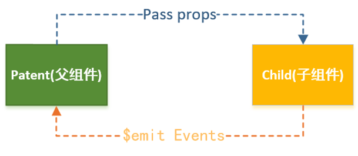

### props

- **子组件用于接受父组件数据的属性**
- 当一个值传递给一个`props`的时候，它就变成了**子组件实例的一个属性**

- 一个组件可以拥有任意数量的`props`，任何值都可以传递给任何`props`
- `props`**值**
  - **字符串数组**：数组中的字符串（变量名）就是传递时的名称
  - **对象**：对象可以设置传递时的类型，也可以设置默认值等

> 默认`props`属性中的值不能大写
>
> Vue中的保留关键字不能作为`props`中的属性值，如`key`
>
> 也可以是想传给子组件内部数据时定义一个props，传递基本数据类型值（不是父组件变量值）时候可以直接写（不用`:`来绑定）


`props`**写法**

```javascript
// 数组
props: ['cmovies', 'cmessage']

// 对象
props: {
  // 限制为数组类型
  cmovies: Array,
  // 限制类型和设置默认值
  cmessage: {
    type: String,
    default: '默认值',
    // true要求在使用组件必须传值
    required: true
  },
  // 类型是Object/Array时默认值必须返回一个函数
  citems: {
	type: Array,
	default () {
      return [1, 2, 3, 4]
	}
  }
}
```


**父组件向子组件传递数据**

通过`v-bind`绑定父组件的变量到子组件的`props`值中

> `v-bind`不支持驼峰命名，例如`cUser`要改成`c-User`
>
> 因为HTML对大小写不敏感，`cUser`会被识别为`cuser`

```html
<body>
<div id="app">
  <cpn1 :citems1="items1"
  ></cpn1>

  <cpn2 v-for="item in items2"
        :name="item"
  ></cpn2>
</div>

<template id="cpn1">
  <div>
    <li v-for="item in citems1">{{item.id + ' : ' + item.title}}
    </li>
  </div>
</template>

<template id="cpn2">
  <button v-on:click="count++">{{name}} clicked me {{count}} times.</button>
</template>

<script src="vue.js"></script>
<script>
  const cpn1 = {
    template: '#cpn1',
    props: ['citems1']
  }
  const cpn2 = {
    template: '#cpn2',
    props: ['name'],
    data: function () {
      return {
        count: 0
      }
    }
  }
  const app =new Vue({
    el: '#app',
    data: {
      items1: [
        { id: 1, title: 'My journey with Vue' },
        { id: 2, title: 'Blogging with Vue' },
        { id: 3, title: 'Why Vue is so fun' }
      ],
      items2: ['ink','yinke']
    },
    components: {
      // 局部注册
      // 相当于cpn1: cpn1 使用ES6 Key的增强写法
      cpn1,
      cpn2
    }
  })
</script>
</body>
```


### 自定义事件

组件可以调用自身`methods`中的方法，但无法访问Vue实例（父组件）中`methods`中的方法。

Vue提供**自定义事件**使得**组件能访问Vue实例（父组件）中的方法**从而操作父组件的数据

`this.$emit('自定义事件名'，参数)`

- 前端和Vue实例绑定，可以调用Vue实例中的方法
- 前端通过`v-on`将自定义事件绑定到Vue实例中的方法上
- 子组件通过`this.$emit`绑定前端的自定义事件来调用Vue实例中的方法

> 场景：数据在Vue实例中， 但删除操作要在子组件中完成
>
> Vue实例将数据和方法与View层绑定，View层分发数据和方法和子组件绑定
>
> View相当于中转Vue实例的数据和方法由组件控制（前端：View层）

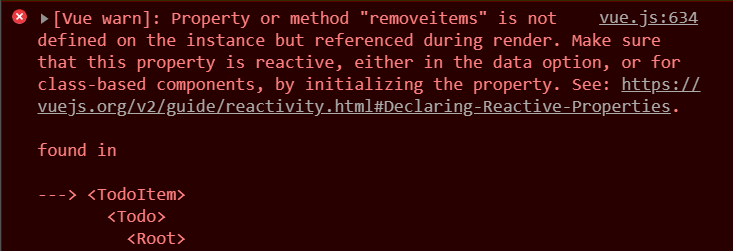


**子组件向父组件传递数据或事件**

`v-on`指令不仅可以用于监听DOM事件，也可以用于组件间的自定义事件。

**自定义事件**流程：

- 在子组件中，通过`$emit()`来触发事件
- 在父组件中，通过`v-on`来监听子组件事件

> 不能使用驼峰命名

```html
<body>
<div id="app">
<!--  父组件监听事件-->
  <cpn v-on:itemclick="cpnClick"></cpn>
</div>

<template id="cpn">
  <div>
    <button v-for="item in categoties"
            @click="btnClick(item)"
    >{{item.name}}
    </button>
  </div>
</template>
<script src="vue.js"></script>
<script>
  const cpn = {
    template: '#cpn',
    props: [],
    data() {
      return {
        categoties: [
          {id: 'a', name: '热门推荐'},
          {id: 'b', name: '手机数码'},
          {id: 'c', name: '家用家电'},
          {id: 'd', name: '电脑办公'}
        ]
      }
    },
    methods: {
      btnClick(item) {
        // 子组件:自定义事件
        this.$emit('itemclick',item)
      }
    }
  }
  const app =new Vue({
    el: '#app',
    data: {
    },
    components: {
      cpn
    },
    methods: {
      cpnClick(item) {
        console.log(item);
      }
    }
  })
</script>
</body>
```

### 父子组件数据双向绑定demo

- 使用`v-bind`绑定子组件的`props`和父组件数据
- 使用`v-model`绑定`props`和表单数据实现双向绑定

```html
<template id="cpn">
  <div>
    <h2>props: {{number1}}</h2>
    <input type="text" v-model="number1">
    <h2>props: {{number2}}</h2>
    <input type="text" v-model="number2 ">
  </div>
</template>
```

**问题**

不要直接修改`props`中的值

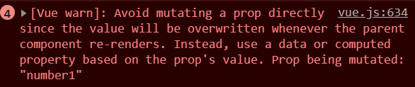

**改进**

使用子组件中的`data()`来提供绑定的数据来修改

```html
<script>
  const app =new Vue({
    el: '#app',
    data: {
      num1: 1,
      num2: 0
    },
    components: {
      cpn: {
        template: '#cpn',
        props: {
          number1: Number,
          number2: Number
        },
        data() {
          return {
            dnumber1: this.number1,
            dnumber2: this.number2
          }
        }
      }
    }
  })
</script>
```

**改进**

要求将子组件修改的值再反向传递给父组件中一起修改

拆分`v-model`：`v-bind:value="" v-on:input=""`

- `v-bind`绑定`value`值
- `v-on`绑定`input`事件

```html
<!DOCTYPE html>
<html lang="en" xmlns:v-on="http://www.w3.org/1999/xhtml">
<head>
  <meta charset="UTF-8">
  <title>Title</title>
</head>

<body>
<div id="app">
  <cpn :number1="num1"
       :number2="num2"
       @num1change="num1change"
       @num2change="num2change"
  ></cpn>
</div>

<template id="cpn">
  <div>
    <h2>props: {{number1}}</h2>
    <h2>data: {{dnumber1}}</h2>
<!--    <input type="text" v-model="dnumber1">-->
    <input type="text" :value="dnumber1" @input="num1input">
    <h2>props: {{number2}}</h2>
    <h2>data: {{dnumber2}}</h2>
    <input type="text" :value="dnumber2" @input="num2input">
  </div>
</template>
<script src="vue.js"></script>
<script>
  const app =new Vue({
    el: '#app',
    data: {
      num1: 1,
      num2: 2
    },
    methods: {
      // 默认的value传入的是String,和props中要求的Number类型冲突
      num1change(value) {
        this.num1 = value
      },
      num2change(value) {
        this.num2 = value
      }
    },
    components: {
      cpn: {
        template: '#cpn',
        props: {
          number1: [Number,String],
          number2: [Number,String]
        },
        data() {
          return {
            dnumber1: this.number1,
            dnumber2: this.number2
          }
        },
        methods: {
          num1input(event) {
            this.dnumber1 = event.target.value,
            this.$emit('num1change',this.dnumber1)
          },
          num2input(event) {
            this.dnumber2 = event.target.value,
            this.$emit('num2change',this.dnumber2)
          }
        }
      }
    }
  })
</script>
</body>
</html>
```

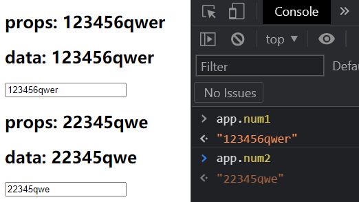

**改进**

要求修改num1的值同时修改num2的值（num2 = num1/100）

```html
num1input(event) {
  this.dnumber1 = event.target.value
  this.$emit('num1change',this.dnumber1)
  this.dnumber2 = this.dnumber1 * 100
  this.$emit('num2change',this.dnumber2)
},
num2input(event) {
  this.dnumber2 = event.target.value
  this.$emit('num2change',this.dnumber2)
  this.dnumber1 = this.dnumber2 / 100
  this.$emit('num1change',this.dnumber1)
}
```

**watch实现**

用于组件中监听数据的改变


### 父子组件对象访问

父组件直接访问子组件，子组件直接访问父组件

- **父组件访问子组件**：
  - `$children`
  - `$refs`
- **子组件访问父组件**：
  - `$parent`
  - `$root`：访问根组件


**父组件通过`$children`获取所有子组件**

- `this.$children`返回一个数组，访问其中的子组件必须通过索引值
-  `$children` 并不保证顺序，也不是响应式的
- 如果要使用 `$children` 来进行**数据绑定**，需要使用一个数组配合 `v-for` 来生成子组件，并且使用`Array`作为真正的来源

```html
<body>
<div id="app">
  <cpn></cpn>
  <cpn></cpn>
  <cpn></cpn>
  <button @click="btnclick">打印按钮</button>
</div>
<template id="cpn">
  <div>子组件</div>
</template>
<script src="vue.js"></script>
<script>
  const app = new Vue({
    el: '#app',
    data: {
    },
    methods: {
      btnclick() {
        // 是数组对象
        console.log(this.$children);
        for (let c of this.$children) {
          console.log(c.name);
          c.showmessage()
        }
      }
    },
    components: {
      cpn: {
        template: '#cpn',
        props: [],
        data() {
          return {
            name: '子组件数据'
          }
        },
        methods: {
          showmessage() {
            console.log('子组件的showmessage()方法');
          }
        }
      }
    }
  });
</script>
</body>
```

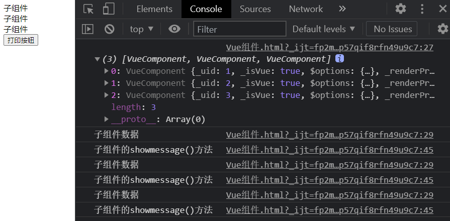


**父组件通过`$refs`获取特定子组件**

1. 通过`ref`属性给子组件绑定一个id
2. 通过`this.$refs.id`就可以访问到该组件

```html
<body>
<div id="app">
  <cpn ref="a"></cpn>
  <button @click="btnclick">打印按钮</button>
</div>
<template id="cpn">
  <div>子组件</div>
</template>
<script src="vue.js"></script>
<script>
  const app = new Vue({
    el: '#app',
    data: {
    },
    methods: {
      btnclick() {
        // $refs默认为空
        console.log(this.$refs)
        this.$refs.a.showmessage()
      }
    },
    components: {
      cpn: {
        template: '#cpn',
        props: [],
        data() {
          return {
            name: '子组件数据'
          }
        },
        methods: {
          showmessage() {
            console.log('子组件的showmessage()方法');
          }
        }
      }
    }
  });
</script>
</body>
```

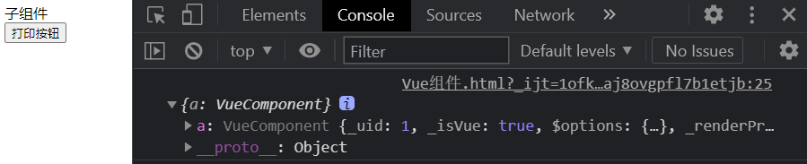


**子组件通过`$parent`获取父组件**

- 尽管在Vue开发中允许通过`$parent`来访问父组件，但是在真实开发中尽量不要这样做

- 子组件应该尽量避免直接访问父组件的数据，因为这样耦合度太高了
- 如果将子组件放在另外一个组件之内，很可能该父组件没有对应的属性，往往会引起问题
  通过`$parent`直接修改父组件的状态，那么父组件中的状态将变得飘忽不定，很不利于调试和维护

```html
<body>
<div id="app">
  <cpn></cpn>
  
</div>
<template id="cpn">
  <div>
    <div>子组件</div>
    <button @click="btnclick">打印按钮</button>
  </div>
</template>
<script src="vue.js"></script>
<script>
  const app = new Vue({
    el: '#app',
    components: {
      cpn: {
        template: '#cpn',
        props: [],
        methods: {
          btnclick() {
            console.log(this.$parent);
          }
        }
      }
    }
  });
</script>
</body>
```


### 非父子组件通信

非父子组件关系包括多个层级的组件，也包括**兄弟组件**的关系

**使用Vuex的状态管理方案**


## 插槽

Vue在2.6.0中为**具名插槽**和**作用域插槽**引入了一个新的统一的`v-slot` 指令

`v-slot` 指令取代了 `slot` 和 `slot-scope` （目前已被废弃但未被移除且仍在文档中）

`v-slot` 只能用在组件中或者`template`标签中


- **使用插槽的目的**
  - 组件的插槽是为了让封装的组件更加具有扩展性
- **封装插槽的方式**
  - 将共性抽取到组件中**，将不同暴露为插槽**
- **插槽的使用**
  - 插槽内可以包含任何**模板代码**，甚至其它组件
  - 插槽可以具有**默认值**，如果没有在该组件中插入内容，就显示默认值
  - 每一个`slot`都会加载**全部的模板**（整体替换）

```html
<body>
<div id="app">
<!--  插槽的基本使用 <slot></slot>-->
  <cpn></cpn>
  <cpn><span>插槽1</span></cpn>
  <cpn><i>插槽2</i></cpn>
<!--  如果有多个值,同时放入到组件进行替换时, 一起作为替换元素-->
  <cpn>
    <i>插槽3</i>
    <div>插槽3</div>
    <p>插槽3</p>
  </cpn>
</div>
<template id="cpn">
  <div>
    <h2>组件</h2>
<!--    插槽的默认值 -->
    <slot><button>按钮</button></slot>
  </div>
</template>

<script src="vue.js"></script>
<script>
  const app = new Vue({
    el: '#app',
    data: {
    },
    components: {
      cpn: {
        template: '#cpn'
      }
    }
  })
</script>
</body>
```


### 具名插槽

有多个插槽时需要区分要插入的插槽，需要给插槽起一个名字

给`slot`元素一个`name`属性即可：`<slot name='myslot'></slot>`

```html
<body>
<div id="app">
<!--  具名插槽:slot属性 -->
<!-- 替换中间和左边 -->
  <cpn><span slot="center">标题</span></cpn>
  <cpn><button slot="left">返回</button></cpn>
</div>
<template id="cpn">
  <div>
<!--    插槽默认值-->
    <slot name="left"><span>左边</span></slot>
    <slot name="center"><span>中间</span></slot>
    <slot name="right"><span>右边</span></slot>
  </div>
</template>
<script src="vue.js"></script>
<script>
  const app = new Vue({
    el: '#app',
    components: {
      cpn: {
        template: '#cpn'
      }
    }
  })
</script>
</body>
```

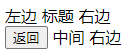


### 编译作用域

- **父组件模板里的所有内容都会在父级作用域中编译**
- **子组件模板里的所有内容都会在子作用域中编译**

> 组件的使用过程是相当于在父组件中出现的，那么它的作用域就是父组件，使用的属性也是属于父组件的属性

```html
<body>
<div id="app">
<!--  使用Vue实例中的属性:true -->
  <cpn v-show="isShow"></cpn>
  <cpn v-for="item in names"></cpn>
</div>
<template id="cpn">
  <div>
    <h2>子组件</h2>
    <p>内容</p>
<!--    使用组件中的属性:false -->
    <button v-show="isShow">按钮</button>
  </div>
</template>
<script src="vue.js"></script>
<script>
  const app = new Vue({
    el: '#app',
    data: {
      // Vue实例的属性
      isShow: true
    },
    components: {
      cpn: {
        template: '#cpn',
        data() {
          return {
            // 子组件的属性
            isShow: false
          }
        }
      }
    }
  })
</script>
</body>
```


### 作用域插槽

**父组件替换插槽的标签（展示），子组件提供插槽中的内容**

在父组件中从子组件中拿到数据，但是正常使用插槽在父组件中使用的都是父组件的属性，所以要使用作用域插槽，**子组件要将数据传给父组件**


# 模块化开发 

随着Ajax异步请求的出现，慢慢形成了前后端的分离。通常会将代码组织在多个JavaScript文件中进行维护。

**JavaScript原始问题**

- 全局变量同名问题
- 对JavaScript文件的依赖顺序几乎是强制性的

> 闭包能解决同名问题但缺少代码复用性

## 模块化规范

使用模块作为出口，模块化的两个核心：**导出和导入**

### CommonsJS

- 模块通过`require`方法来同步**导入**所需依赖的其它模块
- 通过`exports`或`module.exports`来**导出**需要暴露的接口

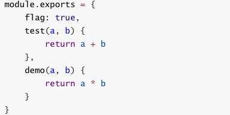

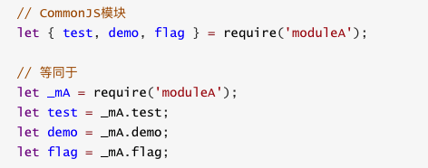

**优点：**

- 服务器端模块便于重用
- NPM中已经有超过45万个可以使用的模块包
- 简单易用

**缺点：**

- 同步的模块加载方式不适合在浏览器环境中，同步意味着阻塞加载，浏览器资源是异步加载的
- 不能非阻塞的并行加载多个模块

**实现：**

- 服务端的NodeJS
- Browserify，浏览器端的CommonsJS实现，可以使用NPM的模块，但是编译打包后的文件体积较大
- modules-webmake，类似Browserify，但不如Browserify灵活
- wreq，Browserify的前身


### ES6规范

- ES6增加了JavaScript语言层面的模块体系定义（ES5没有）
- **编译时就能确定模块的依赖关系， 以及输入和输出的变量**
- 使用模块化会开启严格检查模式`strict`

> Commons JS和AMD模块都只能在**运行时**确定这些东西

```javascript
import "jquery"
export function doStuff(){}
module "localModule"{}
```

**优点**

- 容易进行**静态分析**
- 面向未来的EcmaScript标准

**缺点**

- 原生浏览器端还没有实现该标准
- 全新的命令，新版的Node.js才支持


### AMD规范

- Asynchronous Module Definition规范主要是一个接口

- 在声明模块的时候指定所有的依赖`dependencies`并当做形参传到`factory`中，对于依赖的模块**提前执行**


```javascript
// define(id,dependencies,factory)
define("module",["dep1","dep2"],functian(d1,d2){
	return someExportedValue;
});
require（["module","../file.js"],function(module，file){});
```

**优点：**

- 适合在浏览器环境中**异步加载模块**
- 可以**并行加载**多个模块

**缺点：**

- 提高了开发成本，代码的阅读和书写比较困难，模块定义方式的语义不畅
- 不符合通用的模块化思维方式

**实现：**

- RequireJS
- curl


### CMD规范

- Commons Module Definition规范和AMD相似
- 与CommonsJS和NodeJS的Modules规范保持了很大的兼容性

```javascript
define(function(require,exports,module){
	var $=require("jquery");
	var Spinning = require("./spinning");
	exports.doSomething = ...;
	module.exports=...;
});
```

**优点：**

- 依赖就近，延迟执行
- 可以很容易在Node.js中运行

**缺点：**

- 依赖SPM打包，模块的加载逻辑偏重

## ES6模块化实现

- 导入变量：`import`
- 导出变量：`export`

> 单独的模块有单独的作用域，使用`var`也不会有命名冲突

### export导出

导出模块对外提供的接口

- 定义时导出

- 定义后统一导出

- `export default`：让导入模块的人自己来命名这个模块

  > 同一个模块中只能有一个`export default`

### import导入

加载export导出的对应模块

- 需要在HTML代码中引入JavaScript文件并且设置类型为`module`

- 可以使用`*`导入模块中所有的`export`变量

- 通常情况需要给`*`起一个别名方便后续的使用（通过`.`获取变量）

  > 可能导入的变量跟模块下变量有冲突，也通过`*`导入所有变量

```html
<body>
<script src="vue.js"></script>
<script src="./.idea/a.js" type="module"></script>
<script src="./.idea/b.js" type="module"></script>
</body>
```

a.js

```javascript
var name = 'ink'
var age = 24
var flag = true

function sum(num1, num2) {
    return num1 + num2
}

// 导出方式一
// 统一导出
export {
    flag, sum
}

// 导出方式二
// 导出变量
export var num1 = 1000;
export var height = 1.88


// 导出函数
export function mul(num1, num2) {
    return num1 * num2
}

// ES5的类
// function Person(){}
// 导出ES6的类class
export class Person {
    // 构造器
    run() {
        console.log('在奔跑');
    }
}

// 5.export default导出
// 同一个模块中不允许同时存在多个export default
// const address = '北京市'
// export default address

export default function (argument) {
    console.log(argument);
}
```

b.js

```javascript
// 导入的{}中定义的变量
import {flag, sum} from "./a.js";

if (flag) {
    console.log('yinke');
    console.log(sum(20, 30));
}

// 导入export定义的变量
import {num1, height} from "./a.js";

console.log(num1);
console.log(height);

// 导入export的function/class
import {mul, Person} from "./a.js";

console.log(mul(30, 50));

const p = new Person();
p.run()

// 导入 export default中的内容
import addr from "./a.js";
addr('你好啊');

// 统一全部导入
// import {flag, num, num1, height, Person, mul, sum} from "./aaa.js";
// 相当于
import * as aa from './a.js'

console.log(aa.flag);
console.log(aa.height);
```


# Webpack

Webpack是一个现代JavaScript应用程序的静态**模块打包**工具（module bundler） 

- Wbpack处理应用程序时会递归地构建一个**依赖关系图** （包含应用程序需要的每个模块）， 然后将所有这些模块打包成一个或多个**bundle**
- Webpack可以将松散耦合的模块按照依赖和规则打包成**符合生产环境部署的前端资源**。还可以将按需加载的模块进行代码分离，等到实际需要时再异步加载。通过**loader**自动载入转换器babel转换， **任何形式的资源都可以当做模块**（如Commons JS、ES6、CSS、JSON、CoffeeScript等）

> 前端代码为什么要打包？
>
> - 现在越来越多的网站已经从网页模式进化到了WebApp模式，运行在浏览器里。WebApp通常是一个SPA（单页面应用） ， 每一个视图通过异步的方式加载，这导致页面初始化和使用过程中会加载越来越多的JavaScript代码。
> - 单页应用程序中用到很多素材，如果每一个素材都通过在HTML中以`src`属性或者`link`来引入，那么请求一个页面的时候，可能浏览器就要发起十多次请求，往往请求的这些资源都是一些脚本代码或者很小的图片，这些资源本身才几k，下载连1秒都不需要，但是由于HTTP是应用层协议，它的下层是TCP这个运输层协议，**TCP的握手和挥手过程消耗的时间可能比下载资源本身还要长**，所以需要把这些小文件全部打包成一个文件，这样只要一次TCP握手和挥手的过程，就把多个资源给下载下来了，并且多个资源由于都是共享一个HTTP请求，所以head等部分也是共享的，相当于形成了规模效应，让网页展现更快，用户体验更好。
>
> 前端开发和其他开发工作的主要区别：
>
> - 前端基于多语言、多层次的编码和组织工作
> - 前端产品的交付是基于浏览器的，这些资源是通过增量加载的方式运行到浏览器端
>
> 和grunt/glup的对比
>
> - grunt/glup的核心是Task。可以配置一系列的task并且定义task要处理的事务（例如ES6/TS转化，图片压缩，scss转css），之后就可以让grunt/glup来执行依次这些任务，让整个流程自动化。grunt/glup也被称为前端自动化任务管理工具
> - grunt/glup更加强调的是前端自动化流程，模块化不是其核心
> - webpack加强模块化开发管理，而文件压缩/合并/预处理等功能是附带功能


## 安装

- **webpack模块化打包依赖node环境**
- **node环境依赖很多包**
  - npm：（node **packages** manager）node包自动 管理工具
  - nvm：自由切换node环境版本

> Vue CLI2基于webpack3.6.0，使用`npm install webpack@3.6.0 -g`指定版本
>
> Vue CLI3中已经升级到webpack4，但是它将配置文件隐藏了起来，所以查看起来不是很方便

**全局安装**

在**终端执行**的`webpack`命令是全局的（idea终端也是）

```bash
# 更换淘宝镜像源
npm config set registry https://registry.npm.taobao.org

# 查看
npm config get registry

# 查看node斑斑
node -v

# 全局安装
npm install webpack -g

# 指定版本安装
npm install webpack@3.6.0 -g

# 客户端
npm install webpack-cli -g

# 验证
webpack -v
webpack-cli -v
```

**局部安装**

在项目的`package.json`中定义的脚本`scripts`中包括`webpack`命令，使用的是局部安装的`webpack`

一个项目往往依赖特定的webpack版本，全局的版本可能跟项目的webpack版本不一致，导致打包出现问题。所以通常一个项目都有自己局部的webpack

```bash
npm install webpack@3.6.0 --save-dev
```

 `--save-dev`：安装开发时依赖，在`package.json`中生成，安装到`node_modules`目录下

```json
  "devDependencies": {
    "webpack": "^3.6.0"
  }
```


## 配置

**动态获取路径**

`output`中的`path`需要使用绝对路径，如果想要**动态获取路径**，需要导入node的path模块

```bash
# 首先要初始化
npm init
```

就会生成一个`package.json`文件

> name不要和自带的包重名

```json
{
  "name": "inkwebpack",
  "version": "1.0.0",
  "description": "",
  "main": "index.js",
  "scripts": {
    "test": "echo \"Error: no test specified\" && exit 1"
  },
  "author": "",
  "license": "ISC"
}
```

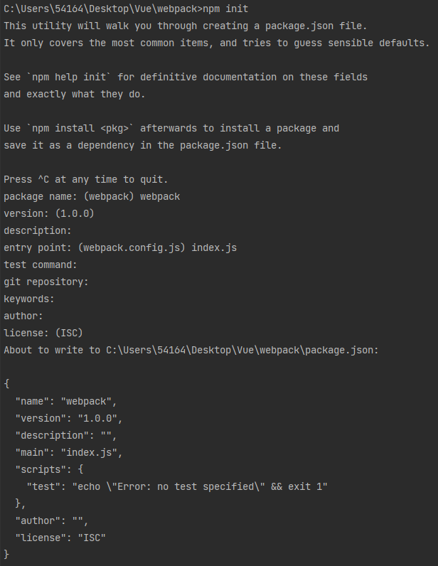

**`webpack.config.js`配置文件**

- `entry`：入口文件， 指定webpack用哪个文件作为项目的入口
- `output`：输出， 指定webpack把处理完成的文件放到的路径
- `module`：模块， 用于处理各种类型的文件
- `plugins`：插件， 如热更新、代码重用等
- `resolve`：设置路径指向
- `watch`：监听， 用于设置文件改动后直接打包

```javascript
// 导入node的path包获取绝对路径
const path = require('path')

module.exports = {
	entry: './src/main.js',
	output: {
        // 动态获取打包后的文件路径
        // path模块的resolve函数用于拼接路径
        // __dirname全局变量(当前目录路径)
		path: path.resolve(__dirname, 'dist'),
        // 打包后的文件名
        filename: 'bundle.js'
	},
	module: {
		loaders: [],
        options: {
            limit: 8192,
            name: 'img/[name].[hash:8].[ext]'
        }
	},
	plugins: {
        
    },
	resolve: {
        // 导入时省略拓展名
        extensions: ['.js', '.vue', '.json'],
        // 别名  
        alias: {
    		'@': resolve('src'),
    		'assets': resolve('src/assets'),
    		'components': resolve('src/components'),
    		'views': resolve('scr/views')
  		}
    },
	watch: true
}
```


## 使用

**文件目录**

- `dist`：distribution打包目录（存放之后打包的文件）
  - `bundle.js`：webpack处理项目直接文件依赖后生成的一个JavaScript文件
- `src`：源码文件目录
  - `main.js`（`index.js`）：项目的入口文件
- `index.html`：浏览器打开展示的首页html
- `package.json`：通过`npm init`生成的，npm包管理的文件

**步骤**

1. 创建一个空的webpack项目目录

2. 在idea中**open**空的webpack项目目录

3. 在**项目目录下**创建`modules`目录用于开发

4. 在`modules`目录下创建**模块文件**`hi.js`

   ```javascript
   // 暴露方法
   exports.sayhi = function (){
       document.write("<h1>ink say hi!</h1>");
   }
   ```

5. 在`modules`目录下创建入口文件`main.js`，用于打包时设置`entry`属性

   在`main.js`中导入依赖

   ```javascript
   // 入口js文件
   // CommonJs规范导入js文件
   const {add,mul} = require("./js/a.js")
   
   console.log(add(10,20))
   console.log(mul(10,10))
   ```

6. 在**项目目录下**创建`webpack.config.js`配置文件，设置入口文件和打包目录文件

   会根据入口文件`main.js`依次打包

   ```javascript
   const path = require('path')
   
   module.exports = {
   	entry: './modules/main.js',
   	output: {
   		path: path.resolve(__dirname, 'dist'),
           filename: 'bundle.js'
       }
   }
   ```

7. 在idea终端中进入项目目录下，使用`webpack`命令打包

   > 没有有`webpack.config.js`配置文件就要写上出入口
   >
   > ```bash
   > webpack ./src/main.js ./dist/bundle.js
   > ```

8. 在**项目目录下**创建`index.html`，导入webpack打包后生成的`bundle.js`文件

   > 打包之前不能直接在`index.html`中用`src`引入模块文件，因为这里使用的是CommonJs规范，HTML不能识别，所以必须打包成可识别的文件后再引入

   ```html
   <body>
   <!-- 导入 -->
   <script src="dist/js/bundle.js"></script>
   </body>
   ```


## 脚本

**使用自定义脚本打包**

`package.json`中的`scripts`的脚本在执行时会按照**一定的顺序寻找命令**对应的位置

- 寻找**本地**的`node_modules/.bin`路径中对应的命令（局部安装）
- 如果没找到会去**全局的环境变量**中寻找（全局安装）

> idea终端中的命令也是全局的，除非指定目录执行：`./node_modules/.bin/webpack`

在`package.json`的`scripts`中增加**映射**（执行脚本），此时优先执行本地的`webpack`

```json
  "scripts": {
    "build": "webpack"
  },
```

执行`npm run build`代替`webpack`打包

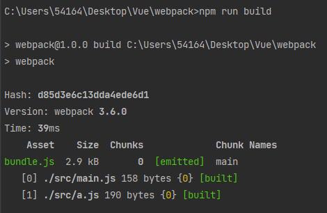


## loader

**转换器**

开发中不仅仅有基本的JavaScript代码处理，也需要加载css、图片，还包括一些高级的将ES6转成ES5代码，将TypeScript转成ES5代码，将scss、less转成css，将.jsx、.vue文件转成JavaScript文件等

**webpack本身对于这些转化是不支持的**。需要给webpack扩展对应的**loader**

[loaders | webpack 中文网)](https://www.webpackjs.com/loaders/)

### 安装

不同的文件处理需要安装不同的loader

**CSS文件**

- `css-loader`只负责css文件加载，不负责解析
- 解析css文件需要使用`style-loader`（将样式添加到DOM中）

> 使用webpack打包css时，出现错误导致css无法打包。原因是`css-loader`和`style-loader`版本过高

**less文件**

- `less-loader`负责less文件加载
- `less`包负责对less代码解析

**图片资源**

- 引用了图片的url时需要使用`url-loader`

- 图片小于limit时，会将图片转成**base64字符串**，大于limit时需要使用`file-loader`加载图片
- 小图片转换为base64字符串是不需要单独的文件存储的
- 大图片使用`file-loader`时会**重命名（32位哈希值）并存储**到打包文件夹`dist`中。这时候**对外展示资源是存储在`dist`中**，相对于导入的index.html就会发现路径错误（404找不到资源了）
- 通过在`webpack.config.js`中使用`publicPath`来**配置url路径**，项目中**所有url**都会拼接上这个路径
- 使用`options`中的`name`参数对打包后的**文件名**格式进行配置（统一，防止重复）
  - `img`：文件要打包**到**的文件夹
  - `[name]`：获取图片原来的名字
  - `[hash:8]`：**防止图片名称冲突依然要使用hash**（但是只保留8位）
  - `[ext]`：使用图片原来的**扩展名**

> `url-loader` 功能类似于 `file-loader`，但是在文件大小（单位 byte）低于指定的限制时可以返回一个 DataURL
>
> 当最后将index.html也打包进dist目录下时，就不需要`publicPath`配置url了
>
> `--dev`：开发时依赖

```bash
npm install --save-dev css-loader@2.0.2
npm install --save-dev style-loader@0.23.1
npm install --save-dev less-loader@4.1.0 less@3.9.0
npm install --save-dev url-loader@1.1.2
npm install --save-dev file-loader@3.0.1
```

**导入依赖**

在入口文件`main.js`中将css文件也当作模块依赖导入

```javaScript
// 依赖css文件
require('./css/normal.css')
// 依赖less文件
require('./css/special.less')
document.writeln('<h2>less渲染</h2>')
```

### 配置

在`webpack.config.js`中进行配置指定loader

`test`的正则表达式用于匹配文件

- `\.`用于转义匹配`.`
- `$`匹配结尾
- `^`匹配开始
- `|`或者

`webpack.config.js`读取多个`loader`是**从右往左解析**的，所以需要将`css-loader`放在`style-loader`右边才能实现**先加载后解析**

```javascript
const path = require('path')

module.exports = {
    entry: './src/main.js',
    output: {
        path: path.resolve(__dirname, 'dist'),
        filename: 'bundle.js',
        publicPath: 'dist/'
    },
    module: {
        rules: [
            {
                test: /\.css$/,
                use: ['style-loader','css-loader']
            },
            {
                test: /\.less$/,
                use: [{
                    loader: 'style-loader'
                }, {
                    loader: 'css-loader'
                }, {
                    loader: 'less-loader'
                }]
            },
            {
                test: /\.(png|jpg|gif)$/,
                use: [
                    {
                        loader: 'url-loader',
                        options: {
                            limit: 13000,
                            name: 'img/[name].[hash:8].[ext]'
                        }
                    }
                ]
            }
        ]
    }
}

```

### 打包

```bash
npm run build
```


## babel

使用`babel`将ES6的语法转成ES5

在webpack中使用babel对应的`babel-loader`

**安装**

babel-preset-es2015：配置相关（es2015就是ES6）

```bash
npm install --save-dev babel-loader@7 babel-core babel-preset-es2015
```

**配置**

- `exclude`：排除不需要转换的文件
- 如果要使用`@babel/preset-env`这里需要在**根目录新建一个babel的文件**，并使用`presets: ['@babel/preset-env']`

```javascript
const path = require('path')

module.exports = {
    entry: './src/main.js',
    output: {
        path: path.resolve(__dirname, 'dist'),
        filename: 'bundle.js',
        publicPath: 'dist/'
    },
    module: {
        rules: [
            {
                test: /\.css$/,
                use: ['style-loader','css-loader']
            },
            {
                test: /\.less$/,
                use: [{
                    loader: 'style-loader'
                }, {
                    loader: 'css-loader'
                }, {
                    loader: 'less-loader'
                }]
            },
            {
                test: /\.(png|jpg|gif)$/,
                use: [
                    {
                        loader: 'url-loader',
                        options: {
                            limit: 13000,
                            name: 'img/[name].[hash:8].[ext]'
                        }
                    }
                ]
            },
            {
                test: /\.js$/,
                //排除node模块的js和bower的js
                exclude: /(node_modules|bower_components)/,
                use: {
                    loader: 'babel-loader',
                    options: {
                        // 这里直接使用指定
                        presets: ['es2015']
                    }
                }
            }
        ]
    }
}
```

**打包**

所有的`const`都被改外`var`定义

```bash
npm run build
```


## plugin

**插件**

对webpack现有功能的各种**扩展**，比如打包优化，文件压缩等

1. 使用npm安装需要使用的plugins（webpack已经内置的插件不需要安装）
2. 在`webpack.config.js`文件中的`plugins`属性中进行配置

### 添加版权信息

**BannerPlugin**：给打包文件添加**版权声明**信息

> 属于webpack自带的插件，无需安装，直接配置


1. 导包， 获取webpack对象
2. 配置BannerPlugin插件
3. 重新打包，查看`bundle.js`文件

`webpack.config.js`文件

```javascript
const webpack = require('webpack')

module.exports = {
    plugins:[
        new webpack.BannerPlugin('最终解释权归ink所有')
      ]
}
```


### 打包html文件

**HtmlWebpackPlugin**：自动生成`index.html`文件（可以指定模板生成）并将打包后的JavaScript文件通过`script`标签自动插入到`index.html`的`body`中

> 之前的`index.html`文件都是存放在`src`目录下，但正式发布项目时是将`dist`文件夹打包部署。所以需要将`index.html`也打包到`dist`文件夹中

1. 使用npm安装HtmlWebpackPlugin

   ```bash
   npm install html-webpack-plugin@3.2.0 --save-dev	
   ```

2. 获取htmlWebpackPlugin对象

3. 配置HtmlWebpackPlugin插件

4. 重新打包，查看`dist`文件夹

`webpack.config.js`文件

> `template`表示根据配置目录下的模板文件来生成`index.html`（`div`标签）
>
> 需要删除`output`中的`publicPath`属性，否则插入的`script`标签的`src`可能出错

```javascript
const HtmlWbepackPlugin = require('html-webpack-plugin')

module.exports = {
    plugins:[
        new HtmlWbepackPlugin({
          template: 'index.html'
        })
      ]
}
```

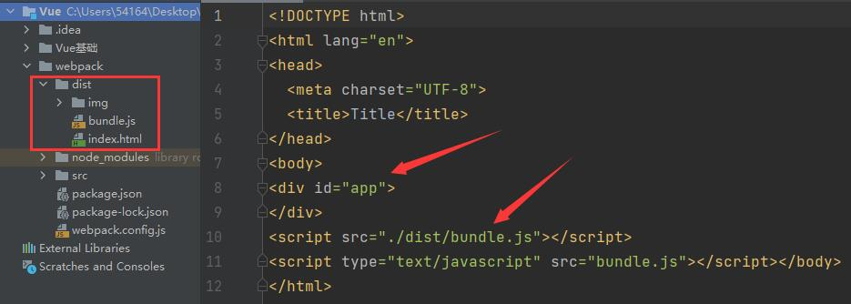


### 压缩JavaScript文件

**uglifyjs-webpack-plugin**：对打包的JavaScript文件进行压缩

> webpack4打包时自动压缩
>
> 压缩文件会删除注释（版权信息）
>
> 开发阶段不要压缩JavaScript文件，不便于调试

1. 使用npm安装uglifyjs-webpack-plugin

    ```bash
    # 版本号指定1.1.1，和VUE CLI2保持一致
    npm install uglifyjs-webpack-plugin@1.1.1 --save-dev
    ```

2. 获取uglifyjs-webpack-plugin对象

3. 配置uglifyjs-webpack-plugin插件

4. 重新打包，查看`bundle.js`文件

`webpack.config.js`文件

```javascript
const uglifyjsWebpackPlugin = require('uglifyjs-webpack-plugin')

module.exports = {
    plugins:[
    	new uglifyjsWebpackPlugin()
      ]
}
```


## 本地服务器

webpack提供了一个可选的**本地开发服务器**。本地服务器基于node.js搭建，内部使用express框架，可以让**浏览器自动刷新并显示修改后的结果**

> express框架：服务于指定的文件夹（监听变化然后重新编译）

**安装**

```bash
npm install --save-dev webpack-dev-server@2.9.3 
```

**配置**

- `contentBase`：指定文件夹提供本地服务，**默认是根文件夹**（改为`./dist`）
- `port`：端口号，默认8080
- `inline`：页面实时刷新
- `historyApiFallback`：在SPA页面中依赖HTML5的history模式

`webpack.config.js`文件

> 此配置只是开发阶段需要，打包运行时不再需要

```javascript
module.exports = {
    devServer: {
        contentBase: './dist',
        port: 2000,
        // 页面实时刷新
        inline: true
    }
}
```

**使用**

因为是局部安装（没加`-g`），所以不能直接执行`webpack-devserver`指令（终端中的指令会默认使用全局安装的包）

- 通过`.\node_modules\.bin\webpack-dev-server`命令指定路径运行
- 在`package.json`中配置脚本命令（优先本地）

`package.json`

- `--open`：表示**自动打开浏览器**

```json
{
  "scripts": {
    "dev": "webpack-dev-server --open"
  }
}
```

启动后就可以实现更新代码浏览器自动刷新显示

```bash
npm run dev
```


## 配置文件分离

`webpack.config.js`文件中有些是开发时候需要的配置，有些是生产环境发布编译需要的配置

将`webpack.config.js`文件分成三个部分：**公共部分**、**开发部分**和**构建发布部分**

建立`build`文件夹存放配置文件

- `base.config.js`：公共的配置
- `dev.config.js`：开发时需要的配置
- `prod.config.js`：构建发布时需要的配置

`base.config.js`文件

```javascript
const path = require('path')
const webpack = require('webpack')
const htmlWbepackPlugin = require('html-webpack-plugin')
module.exports = {
    entry: './src/main.js',
    output: {
        path: path.resolve(__dirname, 'dist'),
        filename: 'bundle.js',
        // 影响打包生成的index.html
        // publicPath: 'dist/'
    },
    module: {
        rules: [
            {
                test: /\.css$/,
                use: ['style-loader','css-loader']
            },
            {
                test: /\.less$/,
                use: [{
                    loader: 'style-loader'
                }, {
                    loader: 'css-loader'
                }, {
                    loader: 'less-loader'
                }]
            },
            {
                test: /\.(png|jpg|gif)$/,
                use: [
                    {
                        loader: 'url-loader',
                        options: {
                            limit: 13000,
                            name: 'img/[name].[hash:8].[ext]'
                        }
                    }
                ]
            },
            {
                test: /\.js$/,
                //排除node模块的js和bower的js
                exclude: /(node_modules|bower_components)/,
                use: {
                    loader: 'babel-loader',
                    options: {
                        //如果要使用@babel/preset-env这里需要在根目录新建一个babel的文件
                        // presets: ['@babel/preset-env']
                        //这里直接使用指定
                        presets: ['es2015']
                    }
                }
            },
            {
                test: /\.vue$/,
                use: ['vue-loader']
            }
        ]
    },
    resolve: {
        // alias:别名
        alias: {
            // 指定vue使用vue.esm.js(包含complier)
            'vue$':'vue/dist/vue.esm.js'
        }
    },
    plugins:[
        new webpack.BannerPlugin('最终解释权归ink所有'),
        new htmlWbepackPlugin({
            template: 'index.html'
        })
    ]
}
```

`dev.config.js`文件

```javascript
module.exports = {
    devServer: {
        contentBase: './dist',
        port: 2000,
        inline: true
    }
}
```

`prod.config.js`文件

```javascript
const uglifyjsWebpackPlugin = require('uglifyjs-webpack-plugin')
module.exports = {
    plugins:[
        new uglifyjsWebpackPlugin()
    ]
}
```

**使用`webpack-merge`插件合并配置文件**

- dev环境：使用`base.config.js`和`dev.config.js`
- 生产发布构建环境：使用`base.config.js`和`prod.config.js`

**安装**

```bash
npm isntall webpack-merge@4.1.5 --save-dev
```

**合并**

将`base.config.js`的内容合并到`dev.config.js`或`prod.config.js`的文件中

- 修改`dev.config.js`文件

  ```javascript
  // 导入webpack-merge对象
  const webpackMerge = require('webpack-merge')
  // 导入base.config.js
  const baseConfig = require('./base.config')
  // 使用webpackMerge合并baseConfig和dev.config
  module.exports = webpackMerge(baseConfig, {
      devServer: {
          contentBase: './dist',
          port: 2000,
          inline: true
      }
  })
  ```

- 修改`prod.config.js`文件

  ```javascript
  const uglifyjsWebpackPlugin = require('uglifyjs-webpack-plugin')
  // 导入webpack-merge对象
  const webpackMerge = require('webpack-merge')
  // 导入base.config.js
  const baseConfig = require('./base.config')
  // 使用webpackMerge合并baseConfig和prod.config
  module.exports = webpackMerge(baseConfig, {
      plugins:[
          new uglifyjsWebpackPlugin()
      ]
  })
  ```

**修改**

分离后不再需要`webpack.config.js`文件，同时需要修改`package.json`中的配置

```json
{
  "scripts": {
    "build": "webpack --config ./build/prod.config.js",
    "dev": "webpack-dev-server --config ./build/dev.config.js"
  }
}
```

因为配置文件在`build`文件夹中，还需要修改`base.config.js`文件中`output`属性中的路径`path`为`path.resolve(__dirname, '../dist')`


# Vue开发

通过模块化管理vue，不再是通过`script`标签引入vue

## 安装

> 后续在实际项目中也会使用vue，所以不是开发时依赖

```bash
npm install vue --save 
```

## 导入依赖

在入口文件`main.js`中当作模块依赖导入

- 安装后的vue在`node_modules`中以`default`的形式被导出
- `from`后**不加路径**就从`node_modules`导入

```javascript
import Vue from 'vue'

new Vue({
    el: '#app',
    data: {
        message: 'Webpack and Vue'
    }
})
```

## 使用

在`index.html`中使用vue，重新打包运行

```html
<div id="app">
  <h2>{{message}}</h2>
</div>
```

**报错**

正在使用`runtime-only`构建，不能将`template`模板编译

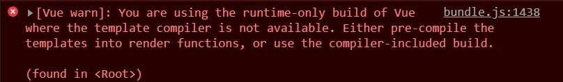

**原因**

Vue有2种模式

- `runtime-only`模式：代码中不可以有template，因为无法解析
- `runtime-complier`模式：代码中可以有template，complier可以用于编译template

> `el`对应的`id="app"`的`div`就相当于一个`template`

**解决方法**

在`webpack.config.js`中配置指定使用`runtime-complier`模式

重新打包运行即可显示

```javascript
resolve: {
    alias: {
        // 指定vue使用vue.esm.js(包含complier)
        'vue$':'vue/dist/vue.esm.js'
    }
}
```


## Vue模块抽取

**问题**：

现在如果希望将Vue实例的data数据显示在界面中就必须修改`index.html`，如果自定义了组件也必须修改`index.html`来使用

而使用vue会开发单页面应用(single page application)只有一个`index.html`，而且`index.html`都是简单结构

```html
<div id="app">
  <h2>{{message}}</h2>
</div>
```

**第一次抽取**

使用`template`属性修改内容

- `el`用于指定Vue要管理的DOM，帮助解析指令、监听事件等
- 如果Vue实例中同时指定了`el`和`template`，那么**`template`的内容会替换掉挂载的对应`el`的模板内容**
- 在开发中多次操作`index.html`，只需要在`template`中**写入对应的内容即可**

> 要重新打包

```html
<div id="app">
</div>
```

```javascript
new Vue({
    el: '#app',
    template: `
      <div>
      <h2>{{message}}</h2>
      <button @click='btnClick'>这是一个按钮</button>
      <h2>{{name}}</h2>
      </div>
    `,
    data: {
        message: 'Webpack and Vue'
    },
    methods: {
        btnClick(){
            console.log("按钮被点击了")
        }
    },
})
```

**问题**：

内容写在Vue实例中的`template`属性中会使得`main.js`的vue**代码冗余**

**第二次抽取**

将模板内容抽取出来放在组件中，在Vue实例中**注册组件并使用组件**（数据方法都需要抽取出来放在组件中）

```javascript
import Vue from 'vue'

const App = {
    template: `
      <div>
        <h2>{{message}}</h2>
        <button @click='btnClick'>这是一个按钮</button>
      </div>
    `,
    data() {
        return {
            message: "Webpack and Vue",
        }
    },
    methods: {
        btnClick(){
            console.log("按钮被点击了")
        }
    },
}
new Vue({
    el: '#app',
    // 使用组件
    template: '<App/>',
    components: {
        //注册局部组件
        App
    },
})
```

**第三次抽取**

将**组件抽取**出来单独放在一个JavaScript文件中并导出

```javascript
export default {
    template: `
      <div>
        <h2>{{message}}</h2>
        <button @click='btnClick'>这是一个按钮</button>
      </div>
    `,
        data() {
    return {
        message: "Webpack and Vue",
    }
},
    methods: {
        btnClick(){
            console.log("按钮被点击了")
        }
    },
}
```

在`main.js`中导入注册并使用组件即可

```javascript
import Vue from 'vue'
// default导出可以自定义组件名
import App from './vue/app'

new Vue({
    el: '#app',
    // 使用组件
    template: '<App/>',
    components: {
        //注册局部组件
        App
    },
})
```


**Vue文件**

以一种全新的方式来组织一个**vue组件**（分离模板、行为和样式）

- `vue-loader`负责加载vue文件
- `vue-template-compiler`负责解析vue文件

**安装**

```bash
npm install --save-dev vue-loader@13.0.0 vue-template-compiler
```

**配置**

`webpack.config`

```javascript
module: {
    rules: [
        {
            test: /\.vue$/,
            use: ['vue-loader']
        }
    ]
}
```

**使用**

`App.vue`文件

> 重新打包

```vue
<!--组件模板-->
<template>
  <div>
    <h2 class="title">{{message}}</h2>
    <button @click='btnClick'>这是一个按钮</button>
  </div>
</template>
<!--脚本行为-->
<script>
export default {
  name: "App",
  data() {
    return {
      message: "Webpack and Vue",
    }
  },
  methods: {
    btnClick(){
      console.log("按钮被点击了")
    }
  }
}
</script>
<!--样式-->
<style scoped>
.title {
  color: green;
}
</style>
```

**子组件的使用**

`Cpn.vue`文件

```vue
<template>
  <div>
    <h2>Cpn组件标题</h2>
    <p>Cpn组件内容</p>
  </div>
</template>

<script>
export default {
  name: "Cpn",
  data() {
    return {
      name: 'ink'
    }
  }
}
</script>

<style scoped>

</style>
```

在父组件`App.vue`中引入

> 重新打包 

```vue
<!--模板-->
<template>
  <div>
    <h2 class="title">{{message}}</h2>
    <button @click='btnClick'>这是一个按钮</button>
    <Cpn/>
  </div>
</template>

<!--脚本行为-->
<script>
// 引入子组件
import Cpn from './Cpn.vue'
export default {
  name: "App",
  // 注册
  components: {
    Cpn
  },
  data() {
    return {
      message: "Webpack and Vue",
    }
  },
  methods: {
    btnClick(){
      console.log("按钮被点击了")
    }
  }
}
</script>
<!--样式-->
<style scoped>
.title {
  color: green;
}
</style>
```


# Vue CLI

CLI：Command-Line Interface，命令行界面，也叫**脚手架**

`vue-cli`是官方提供的一个脚手架，用于快速搭建Vue开发环境（自动生成项目目录，配置Webpack以及各种依赖包）

> 使用Vue.js开发大型应用时，需要考虑代码目录结构、项目结构和部署、热加载、代码单元测试等事情，就要使用脚手架工具来帮助完成
>
> 实际开发采用vue cli脚手架，vue router路由，vuex状态管理，使用ElementUI来快速搭建前端项目


## 安装

[Vue CLI](https://cli.vuejs.org/zh/guide/)

> 以管理员身份打开cmd

1. 安装Node.js：[Node.js|Download](https://nodejs.org/en/download/)

   > V ue CLI 3要求node.js版本是8.9以上
   >
   > node使用C++开发，V8引擎，直接将JavaScript文件编译为二进制代码

   ```bash
   # 验证
   node -v
   # 自带npm
   npm -v
   ```

   安装Node.js淘宝**镜像加速器**（cnpm）

   > 尽量使用npm，cnpm可能打包会失败
   >
   > C:\Users\54164\AppData\Roaming\npm

   ```bash
   # -g 全局安装
   npm install cnpm -g
   
   # 或者每次安装包都加上参数--registry
   npm install --registry=https://registry.npm.taobao.org
   ```

3. 安装Webpack

   ```bash
   npm install webpack -g
   ```
   
3. 安装Vue CLI 3

   > Vue CLI 3可以拉取Vue CLI  2的模板从而使用Vue CLI 2，但不可以按照Vue CLI 2的方式初始化项目

   ```bash
   # 均可
   npm install @vue/cli -g
   yarn global add @vue/cli
   
   # 验证
   vue --version
   ```

4. 安装失败解决方法

   - 执行命令清空npm-cache缓存
   - 删除文件夹`C:\Users\54164\AppData\Roaming\npm-cache`

   ```bash
   npm clean cache -force
   ```

   

## Vue CLI 2

**在项目目录下创建项目**

> Vue CLI 3 和旧版使用了相同的 `vue` 命令，所以 Vue CLI 2 被覆盖了。如果需要使用旧版本的 `vue init` 功能，需要全局安装一个桥接工具

```bash
npm install -g @vue/cli-init
vue init webpack inkvue
```


**初始化设置**

- Project name：项目名称（**不能包含大写**），默认回车即可
- Project description：项目描述，默认回车即可
- Author：项目作者，默认回车即可（**读取电脑中全局的git配置**`.gitconfig`）
- Vue build：vue构建时候使用的模式
  - **Runtime + Compiler**：可以编译template模板（推荐多数用户）
  - **Runtime-Only**：比compiler模式要少6kb，效率更高，直接使用render函数
- Install vue-router：是否安装vue router，选择n不安装（后期需要再手动添加）
- Use ESLint to lint your code：是否使用ESLint代码检查，选择n不安装（后期需要再手动添加)
- Set up unit tests：单元测试相关，选择n不安装（后期需要再手动添加）
- Setup e2e tests with Nightwatch：单元测试相关，选择n不安装（后期需要再手动添加）
- Should we run npm install for you after the,project has been created：使用npm还是yarn管理工具。
- 创建完成后直接初始化，选择n手动执行

> 如果创建工程时候选择了使用ESLint规范，后面不想使用了，可以在`config`文件夹下的`index.js`文件中找到`useEslint`改成`false`

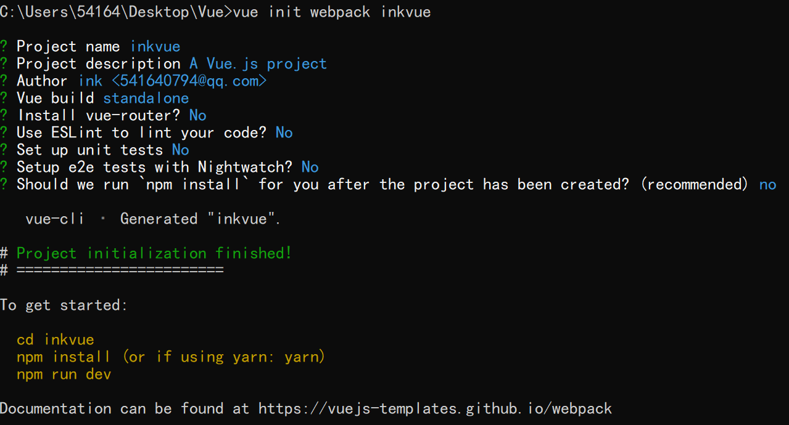


**目录结构**

- `config`文件夹中是`build`的配置文件中所需的一些**变量和对象**，在`webpack.base.conf.js`中引入了`index.js`

- `static`文件夹中存放**静态资源**，静态资源会原封不动的打包复制到`dist`文件夹下（代码文件夹中的资源会根据大小转化）

- `.babelrc`：ES代码相关转化配置文件

  - `browsers`：需要适配的浏览器（市场份额大于1%的最后两个版本），不需要适配ie8及以下版本
  - plugins：babel转化需要的插件

- `.editorconfig`：代码文本配置文件（编码，缩进，换行）

- `.gitignore`：Git忽略文件（提交上传时忽略的文件，如`.idea`）

- `index.html`：使用`html-webpack-plugin`插件打包的`index.html`模板

- `package.json`：包管理，记录**大概会安装的版本**

- `package-lock.json`：包管理，记录**真实安装的版本**

  > ^符号：表示安装版本可以大于等于指定的版本


**package.json**

根据项目下的`package.json`文件生成`node_modules`文件夹

> webpack3.0~4.0版本自带webpack-cli，不需要额外安装，4.0以上则需要

```json
{
  "name": "inkvue",
  "version": "1.0.0",
  "description": "A Vue.js project",
  "author": "ink <541640794@qq.com>",
  "private": true,
  "scripts": {
    "dev": "webpack-dev-server --inline --progress --config build/webpack.dev.conf.js",
    "start": "npm run dev",
    "build": "node build/build.js"
  },
  "dependencies": {
    "vue": "^2.5.2"
  },
  "devDependencies": {
    "autoprefixer": "^7.1.2",
    "babel-core": "^6.22.1",
    "babel-helper-vue-jsx-merge-props": "^2.0.3",
    "babel-loader": "^7.1.1",
    "babel-plugin-syntax-jsx": "^6.18.0",
    "babel-plugin-transform-runtime": "^6.22.0",
    "babel-plugin-transform-vue-jsx": "^3.5.0",
    "babel-preset-env": "^1.3.2",
    "babel-preset-stage-2": "^6.22.0",
    "chalk": "^2.0.1",
    "copy-webpack-plugin": "^4.0.1",
    "css-loader": "^0.28.0",
    "extract-text-webpack-plugin": "^3.0.0",
    "file-loader": "^1.1.4",
    "friendly-errors-webpack-plugin": "^1.6.1",
    "html-webpack-plugin": "^2.30.1",
    "node-notifier": "^5.1.2",
    "optimize-css-assets-webpack-plugin": "^3.2.0",
    "ora": "^1.2.0",
    "portfinder": "^1.0.13",
    "postcss-import": "^11.0.0",
    "postcss-loader": "^2.0.8",
    "postcss-url": "^7.2.1",
    "rimraf": "^2.6.0",
    "semver": "^5.3.0",
    "shelljs": "^0.7.6",
    "uglifyjs-webpack-plugin": "^1.1.1",
    "url-loader": "^0.5.8",
    "vue-loader": "^13.3.0",
    "vue-style-loader": "^3.0.1",
    "vue-template-compiler": "^2.5.2",
    "webpack": "^3.6.0",
    "webpack-bundle-analyzer": "^2.9.0",
    "webpack-dev-server": "^2.9.1",
    "webpack-merge": "^4.1.0"
  },
  "engines": {
    "node": ">= 6.0.0",
    "npm": ">= 3.0.0"
  },
  "browserslist": [
    "> 1%",
    "last 2 versions",
    "not ie <= 8"
  ]
}
```

**npm版本**过高可能会报错，需要降低版本

```bash
npm install npm@6.14.10 -g
# 重新安装依赖
npm install
```


**运行项目**

> 端口号配置文件：`config`目录下的`index.js`中的port

```json
  "scripts": {
    "dev": "webpack-dev-server --inline --progress --config build/webpack.dev.conf.js",
    "start": "npm run dev",
    "build": "node build/build.js"
  }
```

```bash
npm run dev
npm run build
```

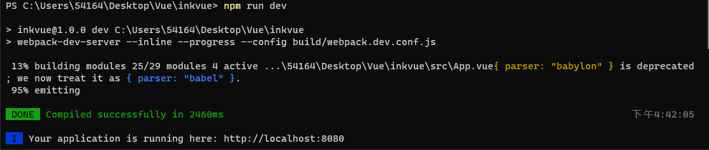


## Vue CLI 3

**Vue CLI 3与Vue CLI 2 的区别**

- Vue CLI 3基于webpack4，Vue CLI 2基于webpack3
- Vue CLI 3的设计原则是**0配置**，**移除了配置文件夹**（`build`和`config`）
- Vue CLI 3提供`vue ui`命令，提供了**可视化配置**
- 移除了`static`文件夹，新增了`public`文件夹，将`index.html`移入了`public`文件夹

### 初始化

```bash
vue create inkvue3
```

**初始化设置**

> 空格选中
>
> 最新版创建可以选Vue的版本：2或者3
>
> 预选设置最后可以保存用于下次初始化项目时选中的`Default`，保存于目录

? Please pick a **preset**: (Use arrow keys)：预选设置

- Default ([Vue 2] babel, eslint)
- Default (Vue 3) ([Vue 3] babel, eslint)
- **Manually select features：回车选中，手动选择特性**
  - **Babel：ES6转化为ES5（必选）** 
  - TypeScript：项目中使用TypeScript开发时选中
  - Progressive Web App（PWA）Support：渐进式网页应用
  - Router：Vue路由 
  - Vuex：Vue项目开发时使用的状态管理工具 
  - CSS Pre-processors ：CSS预处理器 
  - Linter / Formatter：ESlint对代码做规范性检测 
  - Unit Testing：单元测试 
  - E2E Testing：端到端测试
- ? Where do you prefer placing config for Babel, ESLint, etc.? (Use arrow keys)：对设置文件处理
  - **In dedicated config files：存放到独立文件中**
  - In package.json：存放到`package.json`中
- **? Save this as a preset for future projects?：预选设置保存用于下次初始化项目时选中的`Default`**


### 设置文件

- 路径

  `C:\Users\54164\.vuerc`

- 内容

    ```rc
    {
      "useTaobaoRegistry": false,
      "presets": {
        "inkvuecli3": {
          "useConfigFiles": true,
          "plugins": {
            "@vue/cli-plugin-babel": {}
          }
        }
      }
    }
    ```


### 目录结构

默认会创建一个`.git`文件夹作为仓库

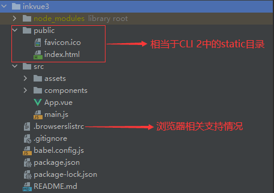


### 打包运行

```json
"scripts": {
  "serve": "vue-cli-service serve",
  "build": "vue-cli-service build"
},
```

```bash
npm run serve
```


### main.js

- Vue CLI 2：`el: '#app'`
- Vue CLI 3：`.$mount('#app')`

`el: '#app'`在Vue内部最终也是执行`$mount('#app')`，最后都会被`render`函数替换掉

```javascript
import Vue from 'vue'
import App from './App.vue'
// 构建时的提示信息
Vue.config.productionTip = false

new Vue({
  render: h => h(App),
}).$mount('#app')
```


###  配置管理

使用`vue ui`命令进入**图形化界面**创建/导入管理项目（**可视化**方式）

```bash
# 启动一个本地服务器
vue ui
```

**进入GUI界面**

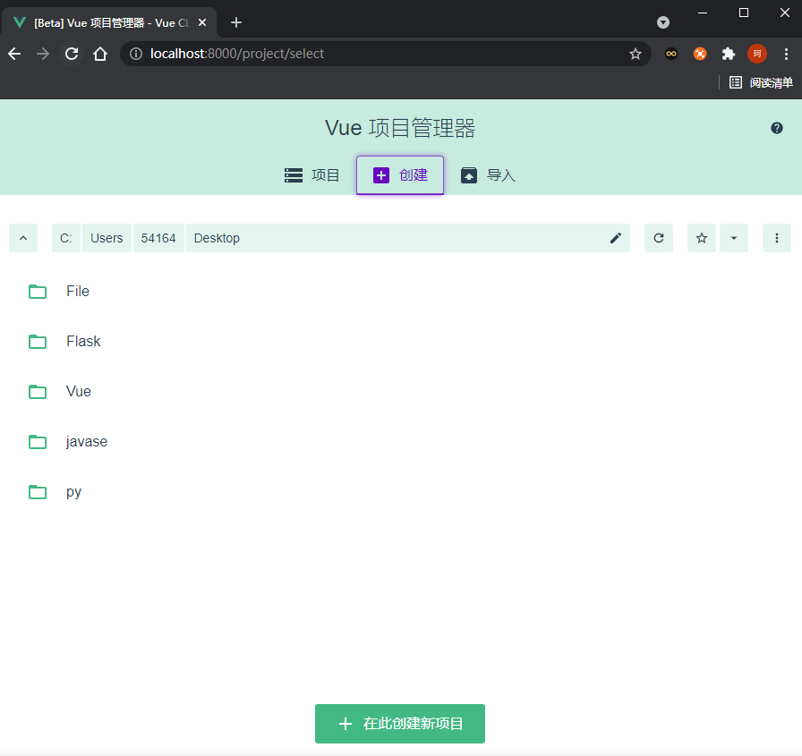

**导入项目**

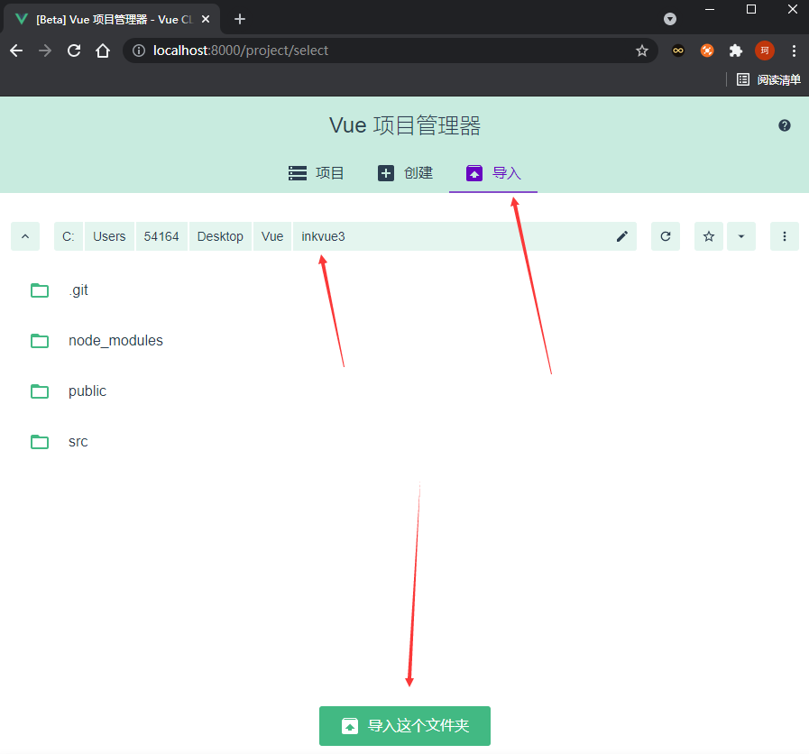

**查看插件**

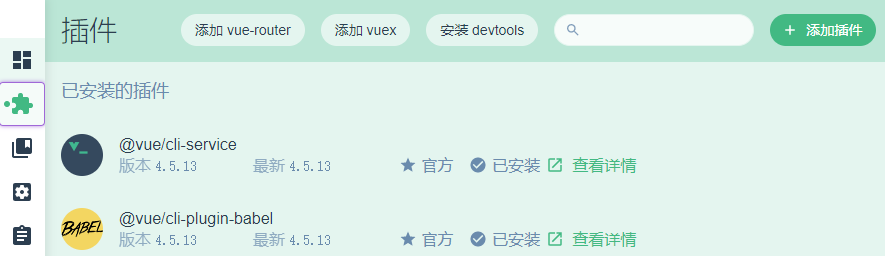

**查看依赖**

vue版本和vue-template-compiler版本**必须一致**

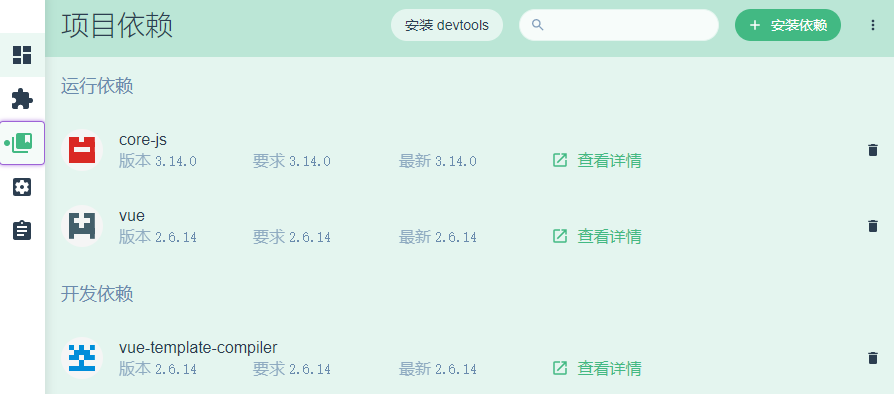

**项目配置**

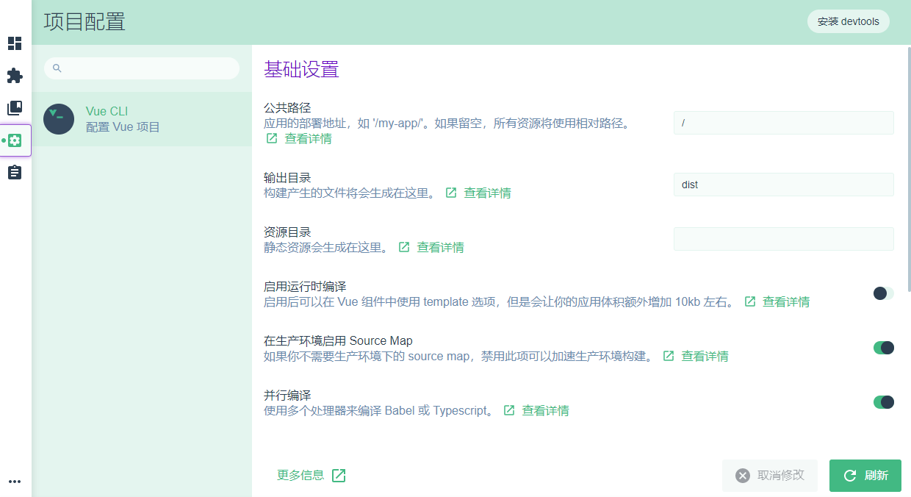

**任务**

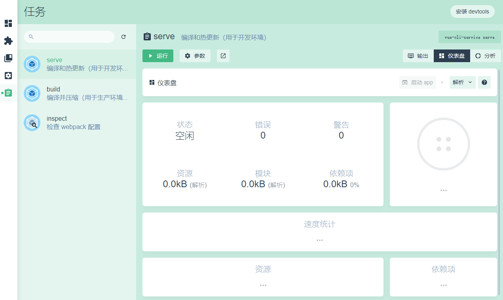


### 配置文件

**默认配置文件被隐藏**

- `node_modules`目录
  - `@vue`目录
    - `cli-service`目录
      - `lib/Service`目录
    - `webpack.config.js`

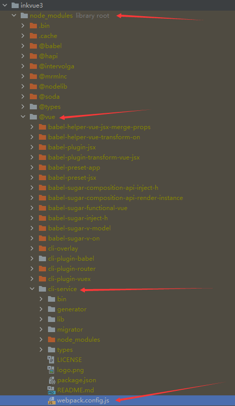


**自定义配置**

在项目目录下建立`vue.config.js`配置文件

如果项目的 **根目录**中存在这个文件，那么它会被 `@vue/cli-service` 自动加载（将默认配置和自定义配置合并）

[vue.config.js](https://cli.vuejs.org/zh/config/#vue-config-js)

```javascript
// 在module.exports中修改配置
module.exports = {
  
}
```


## Runtime+Compiler和Runtime-Only的区别

`main.js`文件区别

- **Runtime-Compiler**

  注册+`template`使用

  

- **Runtime-only**

  `render`渲染

  

运行过程

-  **Runtime-Compiler**

   1. 将`template`解析成抽象语法树ast（abstract syntax tree）

   2. 将ast编译成`render`函数
   3. 用`render`函数创建出虚拟dom
   4. 将虚拟dom渲染到UI（真实dom）上
-  **Runtime-only**
   1. 用`render`函数创建出虚拟dom
   2. 将虚拟dom渲染到UI（真实dom）上


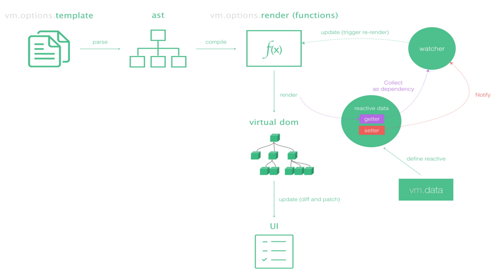

**总结**

- Runtime-Only**性能更高**，**代码量更少**（6kb）

- 在之后的开发中使用`template`，选择Runtime+Compiler
- 在之后的开发中使用`.vue`文件，选择Runtime-only


## render函数

`render: h => h(App)`

> 导入的组件（`.vue`文件）中的`template`已经被`vue-template-compiler`（开发时依赖）转化为`render`函数了


在Compiler模式下的Vue实例中也可以使用`render`函数（**效果相同**）

`createElement('标签',{标签属性(可以省略)},['内容'])`

> 原生JavaScript代码

```javascript
new Vue({
  el: '#app',
  render(createElement){
    return createElement('h2',
    {class:'box'},
    ['hello vue', createElement('button',['按钮'])])
  }
})
```

也可以传入一个组件对象

```javascript
new Vue({
  el: '#app',
  render(createElement){
    return createElement(App)
  }
})
```


## npm run

**npm run dev**


**npm run build**


# 路由

- 路由（routing）：通过互联的网络把信息从源地址传送到目的地址的活动

- 路由提供了两种机制
  - 路由：决定数据包从来源到目的地的**路径**
  - 转送：将数据转移
- 路由表：本质是一个映射表，决定了数据包的指向


## 后端路由

- 后端渲染：jsp、php技术
- 后端路由：**后端处理URL和页面的映射关系**

> 早期的网站开发整个HTML页面是由服务器来渲染的。服务器直接生产渲染好对应的HTML页面，返回给客户端进行展示
>
> 网站的每个页面都有自己对应的网址,URL。URL发送请求到服务器，服务器通过正则对该URL进行匹配，最后交给一个Controller进行处理，Controller进行处理最终生成HTML或者数据，返回给前端

**优点**

- 渲染好的页面不需要单独加载任何的JavaScript和CSS，可以直接交给浏览器展示
- 有利于SEO的优化

**缺点**

- 整个页面模块都由后端人员来编写和维护
- HTML代码和Java读取数据代码以及逻辑代码会混在一起，编写和维护都非常糟糕


## 前后端分离

- **后端只提供API来返回数据**
- 前端通过Ajax向后端服务器发送网络请求获得数据
  - **静态资源**服务器（HTML+CSS+JavaScript）
  - 提供**API接口**的服务器（执行JavaScript代码）
- 通过JavaScript将数据渲染到页面中

**优点**

- 后端专注于数据，前端专注于交互和可视化
- 移动端（iOS/Android）依然可以使用之前的API（后端不关心是谁请求数据）


## 前端路由

**前端路由的核心**：改变URL页面不进行整体的刷新（不再请求新的资源）

**SPA页面**（单页面富应用）

- 前后端分离的基础上加一层前端路由（前端维护路由规则）
- 整个网站**只有一个HTML页面**
- 静态资源服务器中只有一个HTML+CSS+JavaScript资源，浏览器会将它一次性全部请求下来（但是会通过前端路由分别展示不同的页面）
- 前端路由的URL映射表**不会再向服务器请求数据**，由每个单独URL表示的页面向后端发送Ajax请求


## 路由模式

**修改URL不刷新**的方式有两种

- URL的hash（默认）
- HTML5的history

### URL的hash

URL的`hash`就是锚点(`#`)，本质上是改变`window.location`的`href`属性

可以通过直接赋值`location.hash`来改变`href`，但是页面不发生刷新

### HTML5的history

`history`接口是HTML5新增的，有五种模式改变URL而不刷新页面

- `history.pushState()`
- `history.replaceState()`
- `history.go()`
- `history.back()`：等价于`history.go(-1)`
- `history.forward()`：等价于`history.go(1)`

> `go`只能在`pushState`模式中使用，`go`是前进后退到某个历史页面

```javascript
hristory.pushState({}, '', '/foo')
history.back()
history.replaceState({}, '', 'home')
// 回退一个页面
history.go(-1)
// 前进一个页面
history.go(1)
// 等价于go(1)
history.forward()
// 等价于go(-1)
history.back()
```


# Vue Router

[Vue Router](https://router.vuejs.org/zh/installation.html)

vue-router是Vue.js官方的路由插件。它和vue.js深度集成，适合用于构建单页面应用

在vue-router的单页面应用中，页面的路径的改变就是**组件的切换**

**功能**

- 嵌套的路由/视图表
- 模块化的、基于组件的路由配置
- 路由参数、查询、通配符
- 基于Vue.js过渡系统的视图过渡效果
- 细粒度的导航控制
- 带有自动激活的CSS class的链接
- HTML5历史模式或hash模式， 在IE9中自动降级
- 自定义的滚动行为

> 前端路由
>
> Vue-route管理请求入口和页面映射关系，可以实现对页面局部进行无刷新的替换


## 安装

**运行时依赖**

> 也可以在vue ui可视化安装

```bash
npm install vue-router@3.0.1 --save
```


## 配置

模块化工程中使用vue-router要通过`Vue.use()`声明

- 导入路由对象，并且调用`Vue.use(VueRouter)`
- 创建路由实例，并且传入路由**映射配置**
- 在vue实例中挂载创建的**路由实例对象**

> 因为它是一个插件
>
> 在`src`下创建`router`文件夹用来存放vue-router的路由信息和导入路由对象

`src\router\index.js`

```javascript
// 1.导入vue实例和vue-router实例
import Vue from 'vue'
import VueRouter from 'vue-router'

// 2. 通过Vue.use(插件)安装插件
Vue.use(VueRouter)

// 3.配置路由和组件之间的映射关系
const routes = [
    {
        path: '',
        component: null
    }
]

// 4.创建vueRouter对象
const router = new VueRouter({
  // 字面量增强写法
  routes
})

//4.导出router实例 传到Vue实例中
export default router
```

`src\main.js`

> 前端命名规则：`index.js`一般是主配置文件，会默认加载，可以只写到目录

```javascript
import Vue from 'vue'
import App from './App'
// 默认加载router下的index.js文件
import router from './router'

Vue.config.productionTip = false

new Vue({
  el: '#app',
  // 字面量增强写法
  router,
  // 渲染App.vue
  render: h => h(App)
})
```


## 使用

1. 创建路由组件
2. 配置路由映射：组件和路径url映射关系
3. 使用路由: 通过`<router-link>`和`<router-view>`

**创建组件**

在`components` 目录下`new`一个`Home.vue` 组件

```vue
<template>
  <div>
    <h2>这是首页</h2>
    <p>首页内容home</p>
  </div>
</template>

<script>
export default {
  name: "Home"
}
</script>
<style scoped>
</style>
```

在`components` 目录下`new`一个`About.vue` 组件

```vue
<template>
  <div>
    <h2>这是页面</h2>
    <p>页面内容about</p>
  </div>
</template>

<script>
export default {
  name: "about"
}
</script>
<style scoped>
</style>
```

**配置路由**

修改路由主配置文件`index.js`

1. 导入路由（import组件）
2. 配置路由（跳转组件）

```javascript
import Vue from 'vue'
import VueRouter from 'vue-router'
// 导入自定义组件
import Home from '../components/Home'
import About from '../components/About'

Vue.use(VueRouter);
// 配置路由和组件之间的映射关系
const routes = [
  {
    path: '/home',
    component: Home
  },
  {
    path: '/about',
    component: About
  }
]

const router = new VueRouter({
  // 字面量增强写法
  routes
})

export default router
```

**使用组件**

vue-router注册的两个**全局组件**

- `router-link`：会被渲染成一个`<a>`标签
- `router-view`：根据当前的路径，动态渲染出不同的组件

> 网页的其他内容，比如顶部的标题和导航或者底部的一些版权信息等和`<router-view>`处于同一个等级
> 路由切换的是`<router-view>`挂载的组件，其他内容不会发生改变

在`App.vue`中使用路由组件

```vue
<template>
  <div id="app">
    <h1>网站标题</h1>
    <!-- router-link默认会被渲染成一个<a>标签，to属性为指定链接 -->
    <router-link to="/home" >首页</router-link>
    <router-link to="/about">内容页</router-link>
    <!-- router-view：用于渲染路由匹配到的组件 -->
    <router-view></router-view>
    <h1>APP底部版权信息</h1>
  </div>
</template>
<script>
export default {
  name: 'App',
  components: {
  }
}
</script>
<style>
</style>
```
> url中的`#`就是hash值

<center class="half">
    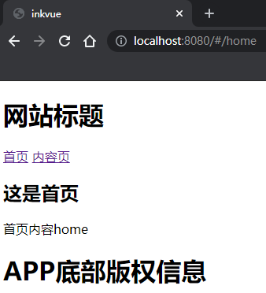
    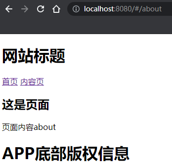
</center>


## 路由重定向

**默认路由**：打开项目时让路径默认跳到到首页

修改路由主配置文件`index.js`，使用`redirect`重定向（重定向作用在**路径不同但组件相同**的情况下）

```javascript
import Vue from 'vue'
import VueRouter from 'vue-router'
import Home from '../components/Home'
import About from '../components/About'

Vue.use(VueRouter)

const routes = [
  {
    path: '',
    // 缺省时候重定向到 /home
    redirect: '/home',
    component: Home
  },
  {
    path: '/home',
    component: Home
  },
  {
    path: '/about',
    component: About
  }
]

const router = new VueRouter({
  // 字面量增强写法
  routes
})

export default router
```


## history模式

不想在url中使用hash（`#`），使用`mode`改为HTML5的history模式

修改`index.js`

> http://localhost:8080/home

```javascript
const router = new VueRouter({
  // 字面量增强写法
  routes,
  mode: 'history'
})
```


## router-link

**属性**

- `to`：用于指定跳转的路径（默认`<a>`标签）

- `tag`：可以指定`<router-link>`渲染成什么组件（而不是`<a>`）

- `replace`：不会留下history记录，所以指定replace的情况下**浏览器的后退键**是不能使用的

  > 使用了`pushState()`

- `active-class`：可以修改对应`class`默认的名称

  > 当`<router-link>`对应的路由匹配成功时, 会自动给当前元素设置一个`router-link-active`的`class`，可以用来修改样式

  - 在进行高亮显示的导航菜单或者底部tabbar时,会用到
  - 通常不会修改类的属性，直接使用默认的`router-link-active`即可
  - 如果要给每个`<router-link>`都要加上`active-class='active'`，可以在路由配置文件中统一更改：`linkActiveClass: 'active'`

`App.vue`文件

```vue
<template>
  <div id="app">
    <h2>我是APP组件</h2>
    <!-- replace -->
    <router-link to="/home" tag="button" replace >首页</router-link>
	<!-- active-class="active" -->
    <router-link to="/about" active-class="active">关于</router-link>
    <!-- tag -->
    <router-link to="/home" tag="button">首页</router-link>
    <router-link to="/about" tag="button">关于</router-link>
    <router-view></router-view>
  </div>
</template>

<script>
export default {
  name: 'App',
}
</script>

<style>
  /*.router-link-active {*/
    /*color: #f00;*/
  /*}*/
  .active {
    color: #f00;
  }
</style>
```


## 路由代码跳转

正常情况下使用`router-link`中的`to`属性进行路由跳转（url改变）

**$router**

`this.$router`

- `push`：相当于`pushState()`
- `replace`：相当于`replace()`，无法后退

```vue
<template>
  <div id="app">
    <h2>我是APP组件</h2>
    <button @click="homeClick">首页</button>
    <button @click="aboutClick">关于</button>
    <router-view></router-view>
  </div>
</template>

<script>
export default {
  name: 'App',
  methods: {
    homeClick() {
      // 通过代码的方式修改路由
      this.$router.push('/home')
      this.$router.replace('/home')
      console.log('homeClick');
    },
    aboutClick() {
      this.$router.push('/about')
      this.$router.replace('/about')
      console.log('aboutClick');
    }
  }
}
</script>
<style>
</style>
```


## 动态路由

**路由传递数据**的一种方式

一个页面的path路径可能是不确定的，例如`/user/ink`或者`/user/yinke`，这种url路径除了`/user`之外，后面还跟上了用户信息。这种**path和component的匹配关系**就叫动态路由

`params`

- 配置路由格式：`path: '/user/:userId'`
- 传递的方式：在`path`后面跟上**对应的值**
- 传递后形成的路径: `/router/ink`，`/router/yinke`

创建`User.vue`

```vue
<template>
  <div>
    <h2>这是用户页</h2>
    <p>用户页内容user</p>
  </div>
</template>

<script>
export default {
  name: "User"
}
</script>
<style scoped>
</style>
```

修改`index.js`

- 在`path`的路由中使用`:userId`指定动态路由参数`userId`

```javascript
import Vue from 'vue'
import VueRouter from 'vue-router'
import Home from '../components/Home'
import About from '../components/About'
import User from '../components/User'

Vue.use(VueRouter)

const routes = [
  {
    path: '',
    // 缺省时候重定向到 /home
    redirect: '/home',
    component: Home
  },
  {
    path: '/home',
    component: Home
  },
  {
    // 使用:userId指定动态路由参数userId
    path: '/user/:userId',
    component: User
  }
]

const router = new VueRouter({
  // 字面量增强写法
  routes,
  mode: 'history'
})

export default router
```

修改`App.vue`

```vue
<template>
  <div id="app">
    <h1>网站标题</h1>
    <router-link to="/home" >首页</router-link>
    <router-link to="/about">内容页</router-link>
    <!-- 相同效果 -->
    <router-link to="/user/yinke">用户信息1</router-link>
    <!-- 属性绑定data数据 -->
    <!-- ''表示字符串, userId是变量 -->
    <router-link v-bind:to="'/user/' + userId">用户信息2</router-link>
    <router-view></router-view>
    <h1>APP底部版权信息</h1>
  </div>
</template>
<script>
export default {
  name: 'App',
  data() {
    return {
      userId: 'ink'
    }
  }
}
</script>
<style>
</style>
```

**$route**

`this.$route.params.userId`

[Vue Router| 路由对象](https://router.vuejs.org/zh/api/#路由对象属性)

> `$route`：表示**当前使用的组件**对应的路由（router对象中有所有组件对应`routes`，其中当前被激活的路由就是`$route`）
>
> `userId`：对应`path`中指定的参数
>
> ```javascript
> const routes = [
>   {
>     path: '',
>     redirect: '/home',
>     component: Home
>   },
>   {
>     path: '/home',
>     component: Home
>   },
>   {
>     path: '/user/:userId',
>     component: User
>   }
> ]
> const router = new VueRouter({
>   // 字面量增强写法
>   routes,
>   mode: 'history'
> })
> ```

修改`User.vue`组件来获取用户信息

```vue
<template>
  <div>
    <h2>这是用户页</h2>
    <p>用户页内容user</p>
    <p>{{userId}}</p>
  </div>
</template>

<script>
export default {
  name: "User",
  computed: {
    userId() {
      return this.$route.params.userId
    }
  }
}
</script>
<style scoped>
</style>
```

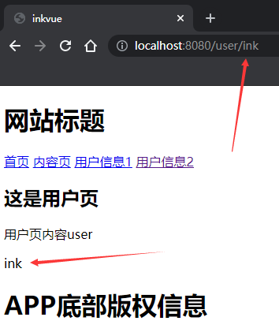


## 路由的懒加载

**查看打包文件夹**`dist`

```bash
npm run build
```

**目录结构**

- `app.*.js`：当前应用程序开发的所有代码（业务代码）
- `manifest.*.js`：为打包代码做底层支持的
- `vendor.*.js`：第三方框架，如vue/vue-router/axios

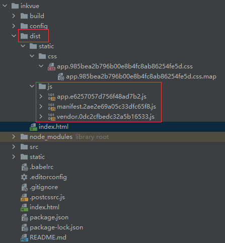

**问题**：

当打包构建应用时，Javascript包会变得非常大，用户一次性从服务器请求就会很慢，影响页面加载

**解决**：**懒加载**

把不同路由对应的组件打包成一个个的JavaScript代码块，然后当路由被访问的时候才加载对应组件。

修改`index.js`文件

> 在ES6中, 以更加简单的写法来**组织Vue异步组件和Webpack的代码分割**

```javascript
import Vue from 'vue'
import VueRouter from 'vue-router'
// 不用在一开始全部导入了
// import Home from '../components/Home'
// import About from '../components/About'
// import User from '../components/User'

// 懒加载
const Home = ()=> import('../components/Home')
const About = ()=> import('../components/About')
const User = ()=> import('../components/User')

Vue.use(VueRouter)


const routes = [
  {
    path: '',
    redirect: '/home',
    component: Home
  },
  {
    path: '/home',
    component: Home
  },
  {
    path: '/user/:userId',
    component: User
  }
]

const router = new VueRouter({
  // 字面量增强写法
  routes,
  mode: 'history'
})

export default router
```

重新打包，**三个组件被分别打包成三个JavaScript文件**


## 嵌套路由

嵌套路由又称**子路由**`children`

URL中各段**动态路径也**按某种结构对应**嵌套的各层组件**

实现嵌套路由的两个步骤

- 创建对应的子组件,
- 在路由映射中**配置对应的子路由**
- 在**组件内部**使用`<router-link>`和`<router-view>`标签（决定内容位置）

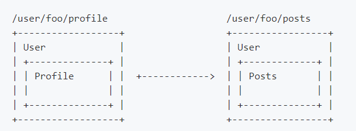

创建对应的子组件`HomeMessages.vue`和`HomeNews.vue`

```vue
<template>
  <div>
    <ul>
      <li>Messages1</li>
      <li>Messages2</li>
      <li>Messages3</li>
      <li>Messages4</li>
      <li>Messages5</li>
    </ul>
  </div>
</template>

<script>
export default {
  name: "HomeMessages"
}
</script>
<style scoped>
</style>
```

```vue
<template>
  <div>
    <ul>
      <li>News1</li>
      <li>News2</li>
      <li>News3</li>
      <li>News4</li>
      <li>News5</li>
    </ul>
  </div>
</template>

<script>
export default {
  name: "HomeNews"
}
</script>
<style scoped>
</style>
```

配置对应的子路由，修改`index.js`文件

```javascript
import Vue from 'vue'
import VueRouter from 'vue-router'
const Home = ()=> import('../components/Home')
const HomeNews = ()=> import('../components/HomeNews')
const HomeMessages = ()=> import('../components/HomeMessages')
const About = ()=> import('../components/About')
const User = ()=> import('../components/User')

Vue.use(VueRouter)


const routes = [
  {
    path: '',
    redirect: '/home',
    component: Home
  },
  {
    path: '/home',
    component: Home,
    children: [
      {
        // 默认路由
        path: '',
        redirect: 'news',
        component: HomeNews
      },
      {
        path: 'news',
        component: HomeNews
      },
      {
        path: 'messages',
        component: HomeMessages
      }
    ]
  },
  {
    path: '/user/:userId',
    component: User
  }
]

const router = new VueRouter({
  // 字面量增强写法
  routes,
  mode: 'history'
})

export default router

```

在组件内部使用子组件，修改`Home.vue`

```vue
<template>
  <div>
    <h2>这是首页</h2>
    <p>首页内容home</p>
    <router-link to="/home/news">新闻</router-link>
    <router-link to="/home/messages">消息</router-link>
    <router-view></router-view>
  </div>
</template>

<script>
export default {
  name: "Home"
}
</script>
<style scoped>
</style>
```

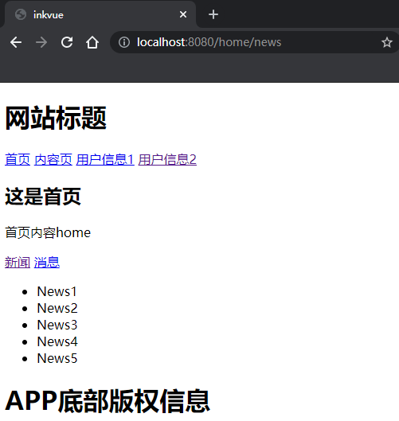

## 参数传递

在实现**路由跳转**的时候将一些参数信息也传递过去

参数传递主要有两种类型

- `params`：**动态路由**
- `query`
  - 配置路由格式：普通配置
  - 传递的方式：对象中使用`query`的`key`作为传递方式
  - 传递后形成的路径：`/profile?name=ink&age=24&height=182`

新建`Profile.vue`文件

- 使用`$route.query`接受数据

```vue
<template>
  <div>
    <h2>Profile内容</h2>
    <h3>{{$route.query.name}}</h3>
    <h3>{{$route.query.age}}</h3>
    <h3>{{$route.query.height}}</h3>
  </div>
</template>

<script>
export default {
  name: "Profile"
}
</script>

<style scoped>

</style>
```

修改`index.js`

```javascript
import Vue from 'vue'
import VueRouter from 'vue-router'
const Home = ()=> import('../components/Home')
const HomeNews = ()=> import('../components/HomeNews')
const HomeMessages = ()=> import('../components/HomeMessages')
const About = ()=> import('../components/About')
const User = ()=> import('../components/User')
const Profile = ()=> import('../components/Profile')
Vue.use(VueRouter)

const routes = [
  {
    path: '',
    redirect: '/home',
    component: Home
  },
  {
    path: '/home',
    component: Home,
    children: [
      {
        path: '',
        redirect: 'news',
        component: HomeNews
      },
      {
        path: 'news',
        component: HomeNews
      },
      {
        path: 'messages',
        component: HomeMessages
      }
    ]
  },
  {
    path: '/user/:userId',
    component: User
  },
  {
    path: '/profile',
    component: Profile
  }
]

const router = new VueRouter({
  // 字面量增强写法
  routes,
  mode: 'history'
})

export default router
```

在`App.vue`中展示

- 使用`v-bind`绑定

```vue
<template>
  <div id="app">
    <h1>网站标题</h1>
    <router-link to="/home" >首页</router-link>
    <router-link to="/about">内容页</router-link>
    <router-link :to="{ path: '/profile', query: { name: 'ink', age: 24, height: '182'} }">档案页</router-link>
    <router-link to="/user/yinke">用户信息1</router-link>
    <router-link v-bind:to="'/user/' + userId">用户信息2</router-link>

    <router-view></router-view>
    <h1>APP底部版权信息</h1>
  </div>
</template>
<script>
export default {
  name: 'App',
  data() {
    return {
      userId: 'ink'
    }
  }
}
</script>
<style>
</style>
```


**使用代码传递数据**

修改`App.vue`

```vue
<template>
  <div id="app">
    <h1>网站标题</h1>
    <router-link to="/home" >首页</router-link>
    <router-link to="/about">内容页</router-link>
    <router-link :to="{ path: '/profile', query: { name: 'ink', age: 24, height: '182'} }">档案页</router-link>
    <router-link to="/user/yinke">用户信息1</router-link>
    <router-link v-bind:to="'/user/' + userId">用户信息2</router-link>
    <button @click="userClick">用户</button>
    <button @click="profileClick">档案</button>

    <router-view></router-view>
    <h1>APP底部版权信息</h1>
  </div>
</template>
<script>
export default {
  name: 'App',
  data() {
    return {
      userId: 'ink'
    }
  },
  methods: {
    userClick() {
      this.$router.push('/user/' + this.userId)
    },
    profileClick() {
      this.$router.push({
        path: '/profile',
        query: {
          name: 'ink',
          age: 24, 
          height: '182'
        }
      })
    }
  }
}
</script>
<style>
</style>
```


## rouer和​route

**router**

`this.$router`对象与`main.js`导入的`router`对象是同一个对象（也就是`router/index.js`中导出的对象`router`）

**route**

`this.$route`对象是**当前处于活跃的路由**，有`params`和`query`属性可以用来传递参数

在使用vue-router的应用中，路由对象会被注入每个组件中，赋值为`this.$route`

当路由切换时，路由对象会被更新

**区别**

`$router`为VueRouter实例，想要导航到不同URL，使用`$route.push`方法

`$route`为当前`router`跳转对象，里面可以获取`path`、`query`、`params`等参数 


## 导航守卫

**问题**：

在路由跳转后（例如：从用户页面跳转到首页），页面内容虽然可以自定义，但是只有一个HTML文件，也只有一个`<title>`标签，所以切换不同的页面时, 标题并不会改变

**解决**：

使用vue的**生命周期钩子函数**在组件被创建的时候修改`<title>`标签内容

```javascript
created() {
	// 创建的时候修改title
    document.title = '首页'
}
mounted() {
    // 数据被挂载到dom上的时候修改title
}
update() {
    // 页面刷新的时候修改
}
```

**缺点**：

当页面比较多时, 这种方式不容易维护（不能每个组件都去写生命周期函数）

**导航守卫**

如果能监听路由的变化（了解路由跳转的目的地和源地址），就能在跳转中修改`<title>`标签

- vue-router提供的**导航守卫**主要用来**监听路由的进入和离开**
- vue-router提供了`beforeEach()`和`afterEach()`的钩子函数, 它们会在**路由即将改变前和改变后触发**

**全局前置守卫**

修改`index.js`

- 给每个组件**路由**添加`meta`数据
- 添加**前置钩子函数**（跳转之前做处理）

> `matched[0]`：如果是**嵌套路由**，且没有给子路由添加`meta`数据，就会显示`undefined`。使用`matched[0]`表示**取匹配的第一个**，就可以找到父路由的`meta`数据

```javascript
import Vue from 'vue'
import VueRouter from 'vue-router'
const Home = ()=> import('../components/Home')
const HomeNews = ()=> import('../components/HomeNews')
const HomeMessages = ()=> import('../components/HomeMessages')
const About = ()=> import('../components/About')
const User = ()=> import('../components/User')
const Profile = ()=> import('../components/Profile')
Vue.use(VueRouter)

const routes = [
  {
    path: '',
    redirect: '/home',
    component: Home
  },
  {
    path: '/about',
    component: About,
    meta: {
      title: '关于'
    }
  },
  {
    path: '/home',
    component: Home,
    meta: {
      title: '首页'
    },
    children: [
      {
        path: '',
        redirect: 'news',
        component: HomeNews
      },
      {
        path: 'news',
        component: HomeNews
      },
      {
        path: 'messages',
        component: HomeMessages
      }
    ]
  },
  {
    path: '/user/:userId',
    component: User,
    meta: {
      title: '用户'
    }
  },
  {
    path: '/profile',
    component: Profile,
    meta: {
      title: '档案'
    }
  }
]

const router = new VueRouter({
  // 字面量增强写法
  routes,
  mode: 'history'
})

// 前置钩子：从from跳转到to
// from 来的路由
// to 要去的路由
router.beforeEach((to, from, next) => {
  // 给目标路由的页面的title赋值
  document.title = to.matched[0].meta.title 
  // 必须调用，不调用不会跳转
  next()
})
export default router
```

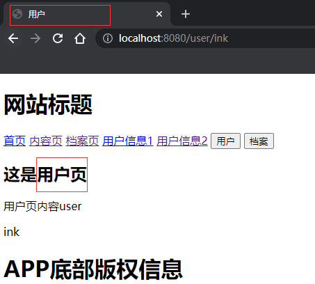

**完整的导航解析流程**

1. 导航被触发。
2. 在**失活的组件**里调用离开守卫。
3. 调用**全局**的 `beforeEach` 守卫。
4. 在**重用的组件**里调用 `beforeRouteUpdate` 守卫 (2.2+)。
5. 在**路由配置**里调用 `beforeEnter`。
6. 解析**异步路由组件**。
7. 在**被激活的组件**里调用 `beforeRouteEnter`。
8. 调用**全局**的 `beforeResolve` 守卫 (2.5+)。
9. 导航被确认。
10. 调用**全局**的 `afterEach` 钩子。
11. 触发DOM更新。
12. 用创建好的实例调用 `beforeRouteEnter` 守卫中传给 `next` 的回调函数。


## keep-alive

在组件之间路由跳转的时候，**组件一直在重复创建和销毁的过程**，每次创建都是新的组件

当需要在跳转过程中保持原来的组件不销毁，就要使用`keep-alive`来使组件保持状态，离开路由后，组件生命周期的`destroyed()`**不会被调用**

- `keep-alive`是Vue内置的一个组件，**可以使被包含的组件保留状态，或者避免重新渲染**

- `router-view`也是Vue内置的一个组件，如果用`<keep-alive>`将`<router-view>`包起来，那么所有路径匹配到的**视图组件都会被缓存**

  ```html
  <keep-alive>
      <router-view>
      </router-view>
  </keep-alive>
  ```


修改`Home.vue`查看路由跳转时的组件状态

```vue
<template>
  <div>
    <h2>这是首页</h2>
    <p>首页内容home</p>
    <router-link to="/home/news">新闻</router-link>
    <router-link to="/home/messages">消息</router-link>
    <router-view></router-view>
  </div>
</template>

<script>
export default {
  name: "Home",
  created() {
    console.log('created');
  },
  destroyed() {
    console.log('destroyed');
  }
}
</script>
<style scoped>
</style>
```

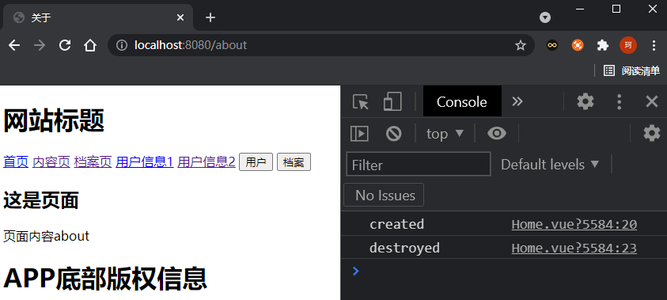


**解决方案**

修改`App.vue`

```vue
<template>
  <div id="app">
    <h1>网站标题</h1>
    <router-link to="/home" >首页</router-link>
    <router-link to="/about">内容页</router-link>
    <router-link :to="{ path: '/profile', query: { name: 'ink', age: 24, height: '182'} }">档案页</router-link>
    <router-link to="/user/yinke">用户信息1</router-link>
    <router-link v-bind:to="'/user/' + userId">用户信息2</router-link>
    <button @click="userClick">用户</button>
    <button @click="profileClick">档案</button>
    <!-- 包裹起来 -->
    <keep-alive>
      <router-view></router-view>
    </keep-alive>
    <h1>APP底部版权信息</h1>
  </div>
</template>
<script>
export default {
  name: 'App',
  data() {
    return {
      userId: 'ink'
    }
  },
  methods: {
    userClick() {
      this.$router.push('/user/' + this.userId)
    },
    profileClick() {
      this.$router.push({
        path: '/profile',
        query: {
          name: 'ink',
          age: 24,
          height: '182'
        }
      })
    }
  }
}
</script>
<style>
</style>
```


**产生冲突**

虽然组件不会被销毁了，但是返回Home页面时会被重定向到子组件对应页面，无法保留上次的浏览内容

**解决方案**

1. 注释掉`index.js`中的默认重定向
2. 在Home组件的`data`中保存重定向路径
3. 在Home组件中引入`activated()`生命周期函数（当组件进入活跃状态的时候调用）来**保存当前路由**
4. 使用路由守卫`beforeRouteLeave()`保存最后离开前的路由用来下次返回时展示

> `activated()`生命周期函数与`keep-alive`有关，不使用`keep-alive`时函数无效

修改`Home.vue`

```vue
<template>
  <div>
    <h2>这是首页</h2>
    <p>首页内容home</p>
    <router-link to="/home/news">新闻</router-link>
    <router-link to="/home/messages">消息</router-link>
    <router-view></router-view>
  </div>
</template>

<script>
export default {
  name: "Home",
  data() {
    return {
      // 用于跳转
      path: '/home/news'
    }
  },
  // 只有该组件被保持了状态使用了keep-alive时才是有效的
  activated(){
    // 在活跃的时候将保存的路由给当前路由
    this.$router.push(this.path)
  },
  // 变成不活跃状态，将最后的路由保存起来
  beforeRouteLeave(to, from, next) {
    this.path = this.$route.path
    next()
  }
}
</script>
<style scoped>
</style>
```


**keep-alive属性**

用`<keep-alive>`将`<router-view>`包起来，那么所有组件都只会创建一次。如果需要某一个组件每次都被创建和销毁，就需要使用`exclude`属性

- `include`：字符串或正则表达，只有匹配的组件会被缓存
- `exclude`：字符串或正则表达式，任何匹配的组件都不会被缓存

> 要求组件要有`name`属性（创建时默认生成）
>
> 多个`name`时候，**逗号后不要加空格**
>
> 正则表达式也不要随便加空格

```html
<keep-alive exclude='Profile,User'>
   <router-view/>
</keep-alive>

<keep-alive include='Profile,User'>
   <router-view/>
</keep-alive>
```


## 别名配置

**问题**

引入图片文件等资源的时候一般**使用相对路径**，如`../assets/ink.png`

- 如果文件资源过深，就要一直调用`../`获取上一层文件目录，不利于代码的维护
- 移动文件时，相对路径就会发生改变

**解决方法**

在`webpack.base.config`中`resolve`模块**配置使用别名**

- `@`表示`src`主目录：`@/components`就表示`src/components`目录
- `assets`表示`src/assets`：`assets/img`就表示`src/assets/img`目录

> 在其他地方使用路径别名（如标签中的`src`属性），需要在前面加上`~`：`src="~assets/ink.png"`

```js
resolve: {
  alias: {
    '@': resolve('src'),
    // 不支持'@/assets'就写成'src/assets'
    'assets': resolve('@/assets'),
    'components': resolve('@/components'),
    'views': resolve('/views')
  }
}
```


# Tab Bar demo

**style引用**

在`assest`目录下创建`css`目录，在`css`目录中创建`base.css`用于初始化css

style中引用使用`@import url`

```css
<style>
   @import url('./assets/css/base.css');
</style>
```

**目录结构**

- `component`：存放公共的组件
- `views`：存放独立的组件


# Promise

**Promise是异步编程的一种解决方案**

> ES6新特性

## 异步操作

网络请求中，对端服务器处理**需要时间**，信息传递过程需要时间，不像本地调用JavaScript函数一样可以立即直接获得结果。

所以处理网络请求时一般会传入一个**回调函数**，在数据请求成功时将数据通过传入的回调函数回调出去

**问题**

回调地狱（嵌套回调）

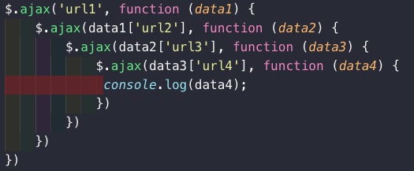


## Promise使用

一般是**有异步操作时，使用Promise对这个异步操作进行封装**

**Promise对象**

`new Promise((resolve, reject) => {})`

- 参数是一个函数`(resolve, reject) => {}`
- 参数函数对应的函数有2个参数分别是`resolve`和`reject`
- `resolve`和`reject`这2个参数也是函数

> `new`-> 构造函数()
>
> - 保存了一些状态信息
> - 执行传入的函数`(resolve, reject) => {}`


**使用定时器模拟网络请求**

- 定时一秒为网络请求事件
- 用`console.log()`表示执行代码

```javascript
// 使用setTimeout模拟嵌套的三次网络请求
// 第一次请求
setTimeout(() => {
    // 第一次处理代码
    console.log("hello world")
    // 第二次请求
    setTimeout(() => {
        // 第二次 处理代码
        console.log("hello java")
        // 第三次请求
        setTimeout(() => {
            // 第三次处理代码
            console.log("hello vue")
        }, 1000)
    }, 1000)
}, 1000)
```


**使用Promise来封装异步操作**

将**网络请求代码**和**处理代码**分离

- Promise内只负责简单的异步请求代码
- 在`then(()=>{})`中专门进行处理

> `setTimeout()`模拟网络请求，`then()`执行的是网络请求后的代码，这就将网络请求和请求得到响应后的操作分离了。
>
> 如果在`resolve`中传参，那么在`then()`方法中就有这个参数
>
> 逻辑清晰
>
> - 调用`resolve()`就跳转到`then()`方法执行处理代码
> - 有嵌套就一定是返回一个Promise对象
> - 从嵌套调用变为链式调用

```javascript
// 参数:函数
// resolve和reject:函数
// then()的参数:函数

// 第一次网络请求
new Promise((resolve, reject) => {
    setTimeout(() => {
        resolve()
    }, 1000)
}).then(() => {
    // 第一次处理代码
    console.log("hello world")
    // 第二次网络请求
    return new Promise((resolve, reject) => {
        setTimeout(() => {
            resolve()
        }, 1000).then(() => {
            // 第二次处理代码
            console.log("hello ink")
            // 第三次网络请求
            return new Promise((resolve, reject) => {
                setTimeout(() => {
                    resolve()
                }, 1000)
            }).then(() => {
                // 第三次处理代码
                console.log("hello yinke")
            })
        })
    })
})
```


## Promise状态

**异步操作之后**会有三种状态

- Pending：等待状态，比如正在进行网络请求，或者定时器没有到时间
- Fulfill：满足状态，调用`resolve`，并且回调`then()`
- Reject：拒绝状态，调用`reject`，并且会回调`catch()`


## resolve和reject

请求有成功和失败两种状态

- 成功：调用`resolve()`，转到`then()`执行
  - 在`resolve()`中可以传递参数到`then()`中
- 失败：调用`reject()`，转到`catch()`执行
  - 在`reject()`中可以传递参数到`catch()`中

> 可以合并到`then(fun1,fun2)`中

```java
new Promise((resolve, reject) => {
    setTimeout(() => {
    	resolve('Hello World')
    }, 1000)
}).then((data) => {
    console.log(data)
})

new Promise((resolve, reject) => {
    setTimeout(() => {
    	reject('error message')
    }, 1000)
}).catch(error => {
    console.log(error)
})
    
// 合并
new Promise((resolve, reject) => {
    setTimeout(() => {
        resolve('Hello World')
    	reject('error message')
    }, 1000)
}).then((data) => {
    console.log(data)
}, error => {
    // 箭头函数只有一个参数时候，可以省略()
    console.log(error)
})
   
```


## 链式调用

在Promise中无论是`then()`还是`catch()`都返回一个Promise对象。所以可以直接通过Promise包装新的数据，然后将Promise对象返回

> `return new Promise((resolve, reject) => {})`

**链式调用**

- `Promise.resovle()`：将数据包装成Promise对象，并且在内部回调`resolve()`函数
- `Promise.reject()`：将数据包装成Promise对象，并且在内部回调`reject()`函数

```javascript
new Promise((resolve, reject) => {
    setTimeout(() => {
        resolve('hello')
    }, 1000)
}).then(res => {
    // 第一次处理
    console.log(res)
    return new Promise(resolve => {
        // 对结果第二次处理
        resolve(res + ' world')
    }).then(res => {
        // 第三次处理
        console.log(res)
        return new Promise(resolve => {
            // 对结果第四次处理
            resolve(res + ',vuejs')
        }).then(res => {
            // 第五次处理
            console.log(res)
        })
    })
})
```

**简写**

```javascript
return new Promise(resolve => {
    resolve(res + ' world')
})
```

等价于：

`return Promise.resolve(res + ' world')`

```javascript
new Promise((resolve, reject) => {
    setTimeout(() => {
        resolve('hello')
    }, 1000)
}).then(res => {
    // 第一次处理
    console.log(res)
     // 第二次处理
    return Promise.resolve(res + ' world')
}).then(res => {
    // 第三次处理
    console.log(res)
     // 第四次处理
    return Promise.resolve(res + ',vuejs')
}).then(res => {
    // 第五次处理
    console.log(res)
})
```

**继续简写**

直接省略掉`Promise.resolve()`

```javascript
new Promise((resolve, reject) => {
    setTimeout(() => {
        resolve('hello')
    }, 1000)
}).then(res => {
    // 第一次处理
    console.log(res)
     // 第二次处理
    return res + ' world'
}).then(res => {
    // 第三次处理
    console.log(res)
     // 第四次处理
    return res + ',vuejs'
}).then(res => {
    // 第五次处理
    console.log(res)
})
```

## 错误处理

**catch**

如果请求过程中间执行了`reject()`，那么后续`then()`不会执行，直接跳转到`catch()`

```javascript
new Promise((resolve, reject) => {
    setTimeout(() => {
        resolve('hello')
    }, 1000)
}).then(res => {
    // 第一次处理
    console.log(res)
     // 错误,后续then不会执行
    return Promise.reject('error')
}).then(res => {
    // 第三次处理
    console.log(res)
     // 第四次处理
    return Promise.resolve(res + ',vuejs')
}).then(res => {
    // 第五次处理
    console.log(res)
}).catch(err => {
    console.log(err)
})
```

**throw**

也可以使用throw抛出异常

```javascript
new Promise((resolve, reject) => {
    setTimeout(() => {
        resolve('hello')
    }, 1000)
}).then(res => {
    // 第一次处理
    console.log(res)
     // 错误,后续then不会执行
    throw 'error message'
}).then(res => {
    // 第三次处理
    console.log(res)
     // 第四次处理
    return Promise.resolve(res + ',vuejs')
}).then(res => {
    // 第五次处理
    console.log(res)
}).catch(err => {
    console.log(err)
})
```


## Promise all

**背景**

需要多个请求来实现业务

**问题**

多个网络请求，不知道哪个会先返回结果

**解决**

**Promise可以直接包装多个异步请求，当多个异步请求都完成后，再统一处理**

> 传统：定义一个函数，只有当多个请求都返回数据时才回调

 

`Promise.all([]).then(results)`

- 多个请求结果存放在`results`中

```javascript
Promise.all([
    new Promise((resolve, reject) => {
        setTimeout(() => {
            resolve(name: 'results1', age: 20)
        }, 1000)
    }),
    new Promise((resolve, reject) => {
        setTimeout(() => {
            resolve(name: 'results2', age: 22)
        }, 1000)
    })
]).then(results => {
    console.log(results[0])
    console.log(results[1])
})
```


# Vuex

Vuex是一个专为Vue.js应用程序开发的**状态管理模式**

采用**集中式存储管理**应用的所有组件的**状态**，并以相应的规则保证状态以一种可预测的方式发生变化

> Vuex也集成到Vue的官方调试工具devtools extension，提供了诸如零配置的time-travel调试、状态快照导入导出等高级调试功能


## 状态管理

状态可以简单的理解为一个变量

状态管理可以简单的看成把多个组件需要**共享**的变量全部存储在一个对象内，然后将这个对象放在**顶层Vue实例**中，让其他组件都可以使用

> Vuex就是为了提供这样一个在多个组件间共享状态的插件，它可以保证共享对象里面所有的属性都可以做到响应式（自己封装对象做不到响应式）

**需要共享的数据**：**多界面共享的状态**

- 用户登录状态
- 用户名称、头像、
- 地理位置信
- 商品的收藏
- 购物车中的物品


## 单页面状态管理

- State：状态，在View中显示
- View：视图，可以针对State的变化显示不同的信息
- Actions：动作，用户在View上会导致State改变各种操作

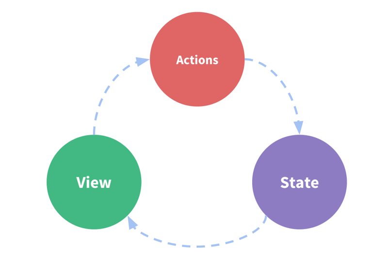

**问题**

遇到**多个组件共享状态**时，**单向数据流**的简洁性很容易被破坏

- 多个视图依赖于同一状态
- 来自不同视图的行为需要变更同一个状态


## 多页面状态管理

- 多个试图都依赖同一个状态
- 不同界面的Actions都想修改同一个状态

官方不建议让VueComponent直接修改state，而是通过Mutation来修改

> Actions是当有异步操作时才通过它修改state，修改state可以没有Actions这个步骤
>
> Devtools：Vue开发的一个浏览器插件，**通过Mutation修改每一次state都会被记录**


### 安装

运行时依赖

> 安装插件

```bash
npm install vuex --save
```


### 配置

在`src`下创建一个`store`目录，创建配置文件`index.js`

> 使用插件：`Vue.use()`

```javascript
import Vue from 'vue'
import Vuex from 'vuex'

// 1.安装插件
Vue.use(Vuex)

// 2.创建对象(Store)
const store = new Vuex.Store({
  // 状态集合
  state: {
    // 具体的状态数据
    count: 0
  },
  // 方法
  mutations: {
    // 默认自动传入参数state
    increase(state) {
      state.counter++
    },
    decrease(state) {
      state.counter--
    }
  },
  actions: {

  },
  getters: {
    power(state) {
      return state.counter * state.counter
    }
  },
  modules: {
    
  }
})
// 3.导出store对象
export default store
```

在`main.js`中引入

- 导入store对象并放在`new Vue`中，这样在所有的组件中都可以使用
- 在其他组件中使用store对象中保存的状态即可

```javascript
import Vue from 'vue'
import App from './App'
import router from './router'
import store from './store'

Vue.config.productionTip = false

new Vue({
  el: '#app',
  // 字面量增强写法
  router,
  store,
  render: h => h(App)
})
```


### 使用

- 通过`this.$store.state.属性`的方式来访问状态
- 通过`this.$store.commit('mutation方法')`来修改状态

创建`HelloVuex.vue`并使用couter变量

```vue
<template>
  <p>{{$store.state.counter}}</p>
</template>

<script>
export default {
  name: "HelloVuex"
}
</script>
<style scoped>
</style>
```

在`App.vue`中使用

> 引入子组件需要先注册

```vue
<template>
  <div id="app">
    <h2>App组件</h2>
    <p>{{$store.state.counter}}</p>
    <!-- 仅做展示 -->
    <!-- 应该通过mutation修改 -->
    <button @click="$store.state.counter++">+</button>
    <button @click="$store.state.counter--">-</button>
    <h2>Vuex组件</h2>
    <HelloVuex></HelloVuex>
  </div>
</template>
<script>
// 引入
import HelloVuex from "./components/HelloVuex";
export default {
  name: 'App',
  // 注册
  components: {
    HelloVuex
  }
}
</script>
<style>
</style>
```

**使用mutation修改状态**

> 在devtools中能跟踪state变化以及提交的mutation方法
>
> 所以不要直接改变`store.state.count`的值

```vue
<template>
  <div id="app">
    <h2>App组件</h2>
    <p>{{$store.state.counter}}</p>
    <button @click="add">+</button>
    <button @click="subtract">-</button>
    <h2>Vuex组件</h2>
    <HelloVuex></HelloVuex>
  </div>
</template>
<script>
import HelloVuex from "./components/HelloVuex";
export default {
  name: 'App',
  components: {
    HelloVuex
  },
  methods: {
    add() {
      this.$store.commit('increase')
    },
    subtract() {
      this.$store.commit('decrease')
    }
  }
}
</script>
<style>
</style>
```

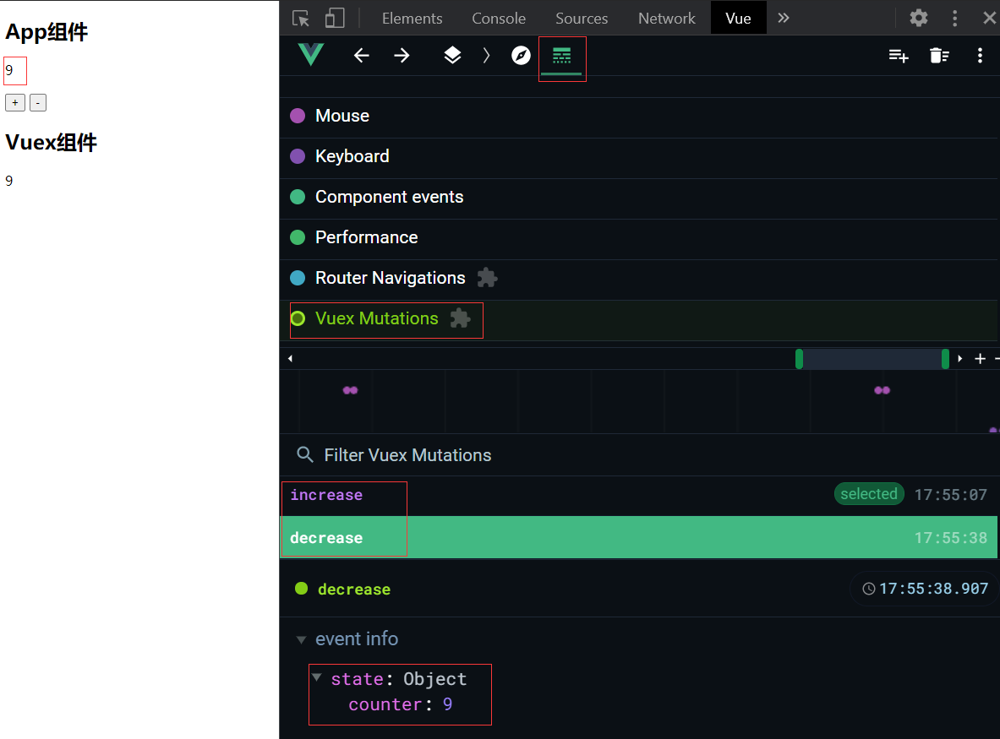


## State

Vuex提出使用**单一状态树**SSOT（Single Source of Truth 单一数据源）来管理**应用层级的全部状态**

单一状态树能够以最直接的方式**找到某个状态的片段**，而且在之后的维护和调试过程中也可以非常方便的管理和维护

> 就是把数据所相关的数据封装到一个对象中，这个对象就是store实例，它对应所有组件中的`$store`对象。无论是数据的状态（state），以及对数据的操作（mutation、actions）等都在store实例中，便于管理维护操作


## Getters

有时候需要从`store`中获取`state`**修改后的一些状态**

> 类似Vue的计算属性，可以实现过滤查找等功能


### 使用

修改`store/index.js`

```javascript
import Vue from 'vue'
import Vuex from 'vuex'

Vue.use(Vuex)

const store = new Vuex.Store({
  state: {
    counter: 10
  },
  mutations: {
    increase(state) {
      state.counter++
    },
    decrease(state) {
      state.counter--
    }
  },
  actions: {

  },
  getters: {
    // 默认自动传入参数state
    power(state) {
      return state.counter * state.counter
    }
  },
  modules: {

  }
})

export default store
```

在`App.vue`中展示

```vue
<template>
  <div id="app">
    <h2>App组件</h2>
    <p>{{$store.state.counter}}</p>
    <button @click="add">+</button>
    <button @click="subtract">-</button>
    <p>{{$store.getters.power}}</p>
    <h2>Vuex组件</h2>
    <HelloVuex></HelloVuex>
  </div>
</template>
<script>
import HelloVuex from "./components/HelloVuex";
export default {
  name: 'App',
  components: {
    HelloVuex
  },
  methods: {
    add() {
      this.$store.commit('increase')
    },
    subtract() {
      this.$store.commit('decrease')
    }
  }
}
</script>
<style>
</style>
```


**过滤查找**

> 可以在计算属性中使用`filter`过滤器
>
> 但是如果多个组件都想实现过滤功能，就需要分别单独实现自己的计算属性
>
> ```javascript
> computed: {
>     stuCount() {
>         // 箭头函数简写形式
>         return this.$store.state.students.filter(student => student.age > 20).length
>     }
> }
> ```

修改`store.index.js`

```javascript
import Vue from 'vue'
import Vuex from 'vuex'

Vue.use(Vuex)

const store = new Vuex.Store({
  state: {
    counter: 10,
    // 添加学生数组
    students: [
      {id: 0, name: 'a', age: '11'},
      {id: 1, name: 'b', age: '22'},
      {id: 2, name: 'c', age: '33'},
      {id: 3, name: 'd', age: '36'}
    ]
  },
  // 方法
  mutations: {
    increase(state) {
      state.counter++
    },
    decrease(state) {
      state.counter--
    }
  },
  actions: {

  },
  getters: {
    power(state) {
      return state.counter * state.counter
    },
    // 过滤
    stuCount(state) {
      return state.students.filter(s => s.age > 20)
    }
  },
  modules: {

  }
})

export default store
```

在`App.vue`中展示

```vue
<template>
  <div id="app">
    <h2>App组件</h2>
    <p>{{$store.state.counter}}</p>
    <button @click="add">+</button>
    <button @click="subtract">-</button>
    <p>{{$store.getters.power}}</p>
    <p>{{$store.getters.stuCount}}</p>
    <h2>Vuex组件</h2>
    <HelloVuex></HelloVuex>
  </div>
</template>
<script>
import HelloVuex from "./components/HelloVuex";
export default {
  name: 'App',
  components: {
    HelloVuex
  },
  methods: {
    add() {
      this.$store.commit('increase')
    },
    subtract() {
      this.$store.commit('decrease')
    }
  }
}
</script>
<style>
</style>
```

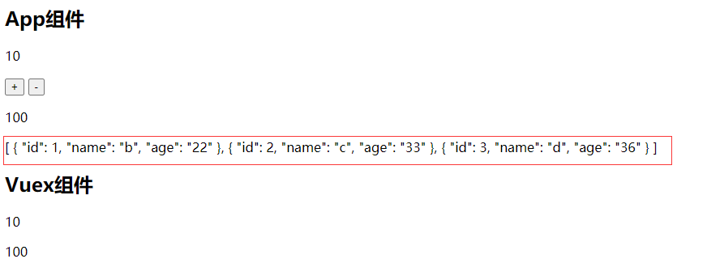

### 参数

- **第二个参数**：`getters`
- 除去state，getters，getters默认是**不能传递第三个参数的**，如果要传递参数，需要让getters本身返回另一个函数，在函数中返回真正的getters

修改`src/index.js`

```javascript
import Vue from 'vue'
import Vuex from 'vuex'

Vue.use(Vuex)

const store = new Vuex.Store({
  state: {
    counter: 10,
    students: [
      {id: 0, name: 'a', age: '11'},
      {id: 1, name: 'b', age: '22'},
      {id: 2, name: 'c', age: '33'},
      {id: 3, name: 'd', age: '36'}
    ]
  },
  // 方法
  mutations: {
    increase(state) {
      state.counter++
    },
    decrease(state) {
      state.counter--
    }
  },
  actions: {

  },
  getters: {
    power(state) {
      return state.counter * state.counter
    },
    stuCount(state) {
      return state.students.filter(s => s.age > 20)
    },
    // 传入getters作为第二个参数
    stuCountlength(state,getters) {
      // 直接获得length属性
      return getters.stuCount.length
    }
  },
  modules: {

  }
})

export default store
```

> 箭头函数简写
>
> ```javascript
> stuCount: state => {
>     return state.students.filter(s => s.age > 20)
> }
> ```


**第三个参数**

需要返回一个函数，调用的时候就可以对函数进行传参

```vue
<p>{{$store.getters.stuCountage(20)}}</p>
```

```javascript
stuCountage(state,getters) {
    return function (age) {
        return state.students.filter(s => s.age > age)
    },
    // 箭头函数
    return age => {
        return state.students.filter(s => s.age > age)
    }
}
```


## Mutation

Vuex的store状态的更新唯一方式：提交Mutation

**Mutation主要包括两部分**

- 字符串的**事件类型**（type）：
- **回调函数**（handler），**第一个参数是state**

**定义**

```javascript
mutations: {
    // increase是事件类型,其余部分是回调函数，第一个参数是state
    increase(state) {
        state.counter++
    },
    decrease(state) {
        state.counter--
    }
}
```

**使用**

```vue
this.$store.commit('decrease')
```


### 传递单个参数

通过mutation更新数据时可以使用**额外的参数**，参数被称为是mutation的**载荷**（Payload）

**定义**

```javascript
mutations: {
    // 多个参数
    increaseCount(state,count) {
        state.counter += count
    }
}
```

**使用**

```vue
addCount (count) {
    // 将count传入
    this.$store.commit('increaseCount', count) 
}
```


### 传递多个参数

**多个参数时通常会以对象的形式传递**，即payload是一个对象，从对象中取出相关的信息

> 或者本来就想传递一个对象数据

**定义**

```javascript
mutations: {
    // 对象参数
    addStudent(state,stu) {
        state.students.push(stu)
    }
}
```

**使用**

```vue
addStudent() {
    // 统一包装成一个对象传递
    const stu = {id: 4, name: 'e', age: '16'}
    this.$store.commit('addStudent',stu)
}
```


### 提交风格

Vue提供了另外一种风格，它是一个包含`type`属性的对象

```javascript
// 普通风格
this.$store.commit('increaseCount', count) 

// 特殊风格(对象)
this.$store.commit({
	type: 'increaseCount',
    // 增强写法
	count
})
```

特殊风格时，mutation中的**参数被转换为一个对象**（payload）

> 将整个commit的对象作为payload使用

```javascript
mutations: {
    // 对象参数
    addStudent(state,payload) {
        state.counter += payload.count
    }
}
```


## 响应规则

Vuex的`store`中的`state`是响应式的，当`state`中的数据发生改变时，Vue组件会自动更新

这就要求必须遵守一些Vuex对应的**规则**

- 提前在`store`中**初始化**好属性
- 当给`state`中的**对象添加新属性**时
  - 使用`Vue.set(obj, 'newProp.key','newProp.value')`
  - 用新对象给旧对象**重新赋值**
- 删除属性时使用`Vue.delete`（`delete`是非响应式的）

> 遵循规则定义的数据都会被加入响应式系统中，响应式系统会监听数据的变化，然后通知界面中引用数据的地方刷新改变
>
> 如果只是简单的直接赋值来增加新的属性（没按规则改变），因为它不属于一开始被监听的数据，所以引用数据的界面不会刷新改变
>
> [Vue基础 / 列表渲染 / 数组更新](#数组更新)

**定义**

修改`store/index.js`

```javascript
import Vue from 'vue'
import Vuex from 'vuex'

Vue.use(Vuex)

const store = new Vuex.Store({
  state: {
    person: {
      name: 'ink',
      sex: '男',
      age: 25
    }
  },
  // 方法
  mutations: {
    updateInfo(state) {
      // 非响应式
      // state.person['address'] = 'beijing'
      // 响应式
      Vue.set(state.person, 'address', 'beijing')
    }
  }
})

export default store
```

**使用**

```vue
<template>
  <div id="app">
    <h2>{{$store.state.person}}</h2>
    <button @click="updateInfo()">修改信息</button>
  </div>
</template>
<script>
export default {
  name: 'App',
  methods: {
    updateInfo() {
      this.$store.commit('updateInfo')
    }
  }
}
</script>
<style>
</style>
```


## 常量类型

# Vue-ElementUI

**创建**

- `npm install`：将模块安装到**项目目录下**
- `npm install -g`：将模块安装到**全局**（`npm config prefix`)
- `npm install --save`：将模块安装到**项目目录下**， 并在`package.json`文件的`dependencies`中写入依赖（缩写：`-S`)
- `npm install --save-dev`：将模块安装到项目目录下，并在`package.json`文件的`devDependencies`中写入依赖（缩写：`-D`)

```bash
# 新建项目
vue init webpack hello-vue

#进入项目目录
cd hello-vue

#安装Vue-router
npm install vue-router --save-dev

#安装ElementUI
npm i element-ui -S

#安装依赖
npm install

# 安装SASS加载器(sass-loader和node-sass)
cnpm install sass-loader node-sass --save-dev

#启功
npm run dev
```

**调整项目结构**

`src`

- `assets`：存放资源文件
- `components`：存放Vue功能组件
- `views`：存放Vue视图组件
- `router`：存放vue-router路由配置

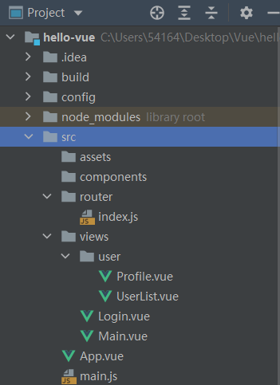

**创建首页视图**

在`views`目录下创建`Main.vue`视图组件

```vue
<template>
  <h1>首页</h1>
</template>
<script>
export default {
  name: "Main"
}
</script>
<style scoped>
</style>
```

**创建登录页视图**

在`views`目录下创建`Login.vue`视图组件

> `el-form`的元素为ElementUI组件

```vue
<template>
  <div>
    <el-form ref="loginForm" :model="form" :rules="rules" label-width="80px" class="login-box">
      <h3 class="login-title">欢迎登录</h3>
      <el-form-item label="账号" prop="username">
        <el-input type="text" placeholder="请输入账号" v-model="form.username"/>
      </el-form-item>
      <el-form-item label="密码" prop="password">
        <el-input type="password" placeholder="请输入密码" v-model="form.password"/>
      </el-form-item>
      <el-form-item>
        <el-button type="primary" v-on:click="onSubmit('loginForm')">登录</el-button>
      </el-form-item>
    </el-form>

    <el-dialog
      title="温馨提示"
      :visible.sync="dialogVisible"
      width="30%">
      <span>请输入账号和密码</span>
      <span slot="footer" class="dialog-footer">
        <el-button type="primary" @click="dialogVisible = false">确 定</el-button>
      </span>
    </el-dialog>
  </div>
</template>

<script>
export default {
  name: "Login",
  data() {
    return {
      form: {
        username: '',
        password: ''
      },

      // 表单验证，需要在 el-form-item 元素中增加 prop 属性
      rules: {
        username: [
          {required: true, message: '账号不可为空', trigger: 'blur'}
        ],
        password: [
          {required: true, message: '密码不可为空', trigger: 'blur'}
        ]
      },

      // 对话框显示和隐藏
      dialogVisible: false
    }
  },
  methods: {
    onSubmit(formName) {
      // 为表单绑定验证功能
      this.$refs[formName].validate((valid) => {
        if (valid) {
          // 使用 vue-router 路由到指定页面，该方式称之为编程式导航
          this.$router.push("/main");
        } else {
          this.dialogVisible = true;
          return false;
        }
      });
    }
  }
}
</script>

<style lang="scss" scoped>
.login-box {
  border: 1px solid #DCDFE6;
  width: 350px;
  margin: 180px auto;
  padding: 35px 35px 15px 35px;
  border-radius: 5px;
  -webkit-border-radius: 5px;
  -moz-border-radius: 5px;
  box-shadow: 0 0 25px #909399;
}

.login-title {
  text-align: center;
  margin: 0 auto 40px auto;
  color: #303133;
}
</style>

```

**创建路由**

在`router`目录下创建`index.js`路由配置文件

```javascript
import Vue from 'vue'
import VueRouter from 'vue-router'
// 导入组件
import Main from '../views/Main'
import Login from '../views/Login'

Vue.use(VueRouter);

export default new VueRouter({
  routes:[
    {
      path: '/main',
      name: 'main',
      component: Main
    },
    {
      path: '/login',
      name: 'login',
      component: Login
    }
  ]
});
```

**全局组件 APP.vue**

```vue
<template>
  <div id="app">
    <router-view></router-view>
  </div>
</template>

<script>
export default {
  name: 'App'
}
</script>
```

**入口文件 main.js**


```javascript
import Vue from 'vue'
import App from './App'
// 导入路由
import router from "./router"
// 导入ElementUI和css文件
import ElementUI from 'element-ui'
import 'element-ui/lib/theme-chalk/index.css'

Vue.use(router)
Vue.use(ElementUI)

new Vue({
  el: '#app',
  router,
  // 引入element-ui
  render:h=>h(App)
})

```

**运行**

> 安装问题：Error:Node Sass version 5.0.0 is incompatible with ^4.x
>
> 解决方案：此错误来自sass-loader，因为node-sass@latest为v5.0.0而sass-loader期望值为^4.0.0
>
> ```bash
> //卸载 node-sass
> npm uninstall node-sass
> 
> //然后安装最新版本（5.0之前）
> npm install node-sass@4.14.1
> ```
>
> sass-loader版本太高，修改："sass-loader": "^7.3.1" 

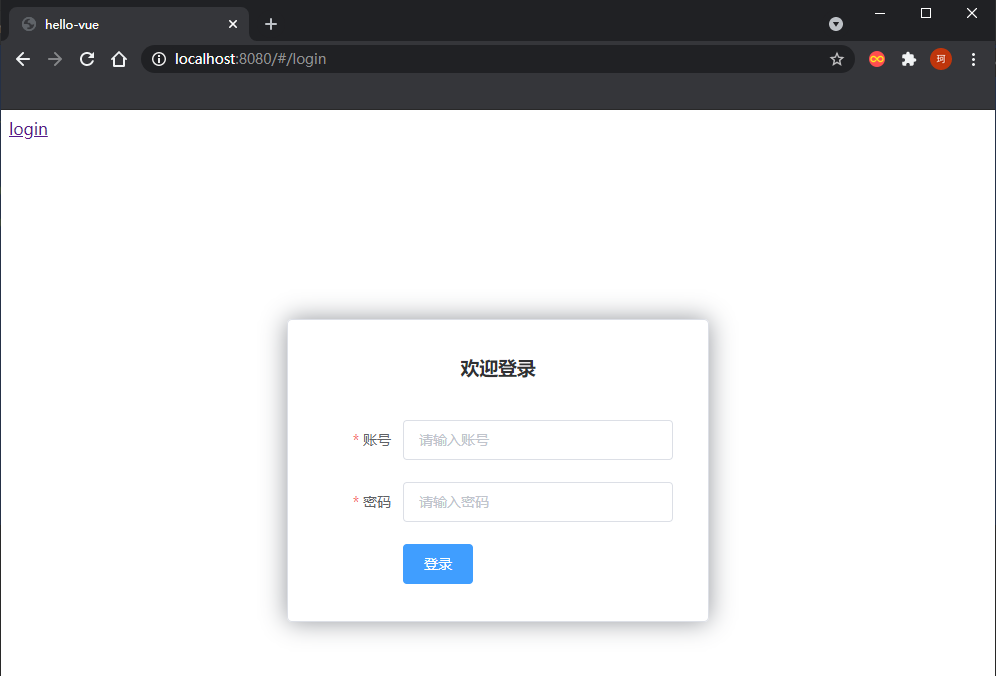


**嵌套路由**

在`views`目录下创建`user`目录

在`user`目录下创建`Profile.vue`视图组件

```vue
<template>
  <h1>个人信息</h1>
</template>
<script>
export default {
  name: "Profile"
}
</script>
<style scoped>
</style>
```

在`user`目录下创建`UserList.vue`视图组件

```vue
<template>
  <h1>用户列表</h1>
</template>
<script>
export default {
  name: "UserList"
}
</script>
<style scoped>
</style>
```

**配置嵌套路由**

修改`router`目录下的`index.js`路由配置文件

添加`children`

```javascript
import Vue from 'vue'
import VueRouter from 'vue-router'
import Main from '../views/Main'
import Login from '../views/Login'

import Profile from '../views/user/Profile'
import Userlist from '../views/user/UserList'

Vue.use(VueRouter);

export default new VueRouter({
  routes:[
    {
      path: '/main',
      name:'main',
      component:Main,
      // 嵌套路由
      children: [
        {
          path: '/user/Profile',
          component: Profile
        },
        {
          path: '/user/UserList',
          component: UserList
        }
      ]
    },{
      path:'/login',
      name:'login',
      component: Login
    }
  ]
});
```

**修改首页视图**

使用ElementUI布局容器组件修改`Main.vue`视图组件

```vue
<template>
  <div>
    <el-container>
      <el-aside width="200px">
        <el-menu :default-openeds="['1']">
          <!-- 第一部分 -->
          <el-submenu index="1">
            <template slot="title"><i class="el-icon-caret-right"></i>用户管理</template>
            <el-menu-item-group>
                
              <el-menu-item index="1-1">
                <!-- router-link展示 -->
                <router-link to="/user/profile">个人信息</router-link>
              </el-menu-item>
                
              <el-menu-item index="1-2">
                <router-link to="/user/UserList">用户列表</router-link>
              </el-menu-item>
            </el-menu-item-group>
          </el-submenu>

		  <!-- 第二部分 -->
          <el-submenu index="2">
            <template slot="title"><i class="el-icon-caret-right"></i>内容管理</template>
            <el-menu-item-group>
              <el-menu-item index="2-1">分类管理</el-menu-item>
              <el-menu-item index="2-2">内容列表</el-menu-item>
            </el-menu-item-group>
          </el-submenu>
        </el-menu>
      </el-aside>

      <el-container>
        <el-header style="text-align: right; font-size: 12px">
          <el-dropdown>
            <i class="el-icon-setting" style="margin-right: 15px"></i>
            <el-dropdown-menu slot="dropdown">
              <el-dropdown-item>个人信息</el-dropdown-item>
              <el-dropdown-item>退出登录</el-dropdown-item>
            </el-dropdown-menu>
          </el-dropdown>
        </el-header>
          
        <!-- router-view显示 -->
        <el-main>
          <router-view />
        </el-main>
          
      </el-container>
    </el-container>
  </div>
</template>

<script>
export default {
  name: "Main"
}
</script>

<style scoped lang="scss">
.el-header {
  background-color: #B3C0D1;
  color: #333;
  line-height: 60px;
}
.el-aside {
  color: #333;
}
</style>
```

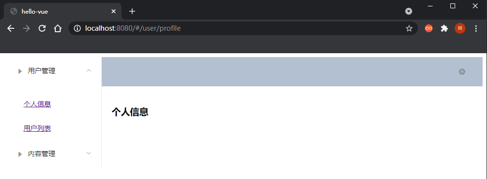


**参数传递**

把某种模式**匹配到的所有路由全都映射到同个组件**，根据**不同的属性**用组件渲染就需要用参数传递

**$route方式**

在`Main.vue`中修改`router-link to`接收参数`name`和`params`

```vue
<el-menu-item index="1-1">
  <!-- router-link展示 -->
  <!-- 参数传递需要对象,v-bind绑定:name组件名,params传递参数 -->
  <router-link :to="{ name:'Profile', params:{id:1} }">个人信息</router-link>
</el-menu-item>
```

修改路由配置`index.js`，在`path`属性中增加`:id`占位符（对应params参数名匹配），接受参数

```javascript
 children: [
        {
          // 接受参数id
          path: '/user/Profile/:id',
          name: 'Profile',
          component: Profile
        },
        {
          path: '/user/UserList',
          component: UserList
        }
      ]
```

修改`Profile.vue`中的`template`标签展示参数信息

```vue
<template>
<!--  只能有一个根标签-->
  <div>
    <h1>个人信息</h1>
    {{$route.params.id}}
  </div>
</template>
```

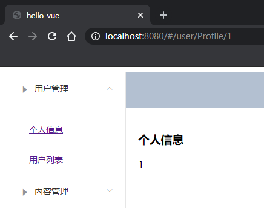

**props方式**

在`Main.vue`中修改`router-link to`接收参数`name`和`params`

```vue
<el-menu-item index="1-1">
  <!-- router-link展示 -->
  <!-- 参数传递需要对象,v-bind绑定:name组件名,params传递参数 -->
  <router-link :to="{ name:'Profile', params:{id:1} }">个人信息</router-link>
</el-menu-item>
```

修改路由配置 `index.js`，在`chidren`中增加`props`属性（表明支持传递参数方式）

```javascript
children: [
        {
          // 接受参数id
          path: '/user/Profile/:id',
          name: 'Profile',
          component: Profile,
          props: true
        },
        {
          path: '/user/UserList',
          component: UserList
        }
      ]
```

修改`Profile.vue`，增加`props`属性

```vue
<template>
<!--  只能有一个根标签-->
  <div>
    <h1>个人信息</h1>
    {{id}}
  </div>
</template>

<script>
export default {
  props: ['id'],
  name: "Profile"
}
```

**获取用户名**

修改`Login.vue`中的`methods`中的`onSubmit`，增加`+this.form.username`

```vue
<template>
  <div>
    <el-form ref="loginForm" :model="form" :rules="rules" label-width="80px" class="login-box">
      <h3 class="login-title">欢迎登录</h3>
      <el-form-item label="账号" prop="username">
        <el-input type="text" placeholder="请输入账号" v-model="form.username"/>
      </el-form-item>
      <el-form-item label="密码" prop="password">
        <el-input type="password" placeholder="请输入密码" v-model="form.password"/>
      </el-form-item>
      <el-form-item>
        <el-button type="primary" v-on:click="onSubmit('loginForm')">登录</el-button>
      </el-form-item>
    </el-form>

    <el-dialog
      title="温馨提示"
      :visible.sync="dialogVisible"
      width="30%">
      <span>请输入账号和密码</span>
      <span slot="footer" class="dialog-footer">
        <el-button type="primary" @click="dialogVisible = false">确 定</el-button>
      </span>
    </el-dialog>
  </div>
</template>

<script>
export default {
  name: "Login",
  data() {
    return {
      // 当前用户信息
      form: {
        username: '',
        password: ''
      },

      // 表单验证，需要在 el-form-item 元素中增加 props 属性
      rules: {
        username: [
          {required: true, message: '账号不可为空', trigger: 'blur'}
        ],
        password: [
          {required: true, message: '密码不可为空', trigger: 'blur'}
        ]
      },

      // 对话框显示和隐藏
      dialogVisible: false
    }
  },
  methods: {
    onSubmit(formName) {
      // 为表单绑定验证功能
      this.$refs[formName].validate((valid) => {
        if (valid) {
          // 使用 vue-router 路由到指定页面，该方式称之为编程式导航
          // 获取username信息
          this.$router.push("/main/"+this.form.username);
        } else {
          this.dialogVisible = true;
          return false;
        }
      });
    }
  }
}
</script>

<style lang="scss" scoped>
.login-box {
  border: 1px solid #DCDFE6;
  width: 350px;
  margin: 180px auto;
  padding: 35px 35px 15px 35px;
  border-radius: 5px;
  -webkit-border-radius: 5px;
  -moz-border-radius: 5px;
  box-shadow: 0 0 25px #909399;
}

.login-title {
  text-align: center;
  margin: 0 auto 40px auto;
  color: #303133;
}
</style>
```

修改路由配置`index.js`，在`path`属性中增加`:name`占位符并设置`props`属性

```javascript
{
      path: '/main/:name',
      name:'main',
      component:Main,
      props:true,
      // 嵌套路由
      children: [
        {
          // 接受参数id
          path: '/user/Profile/:id',
          name: 'Profile',
          component: Profile,
          props: true
        }
```

修改`Main.vue`

- 增加`props`属性
- 显示`name`信息

```vue
<template>
  <div>
    <el-container>
      <el-aside width="200px">
        <el-menu :default-openeds="['1']">
          <el-submenu index="1">
            <template slot="title"><i class="el-icon-caret-right"></i>用户管理</template>
            <el-menu-item-group>
              <el-menu-item index="1-1">
                <!-- router-link展示 -->
                <!-- 参数传递需要对象,v-bind绑定:name组件名,params传递参数 -->
                <router-link :to="{ name:'Profile', params:{id:1} }">个人信息</router-link>
              </el-menu-item>
              <el-menu-item index="1-2">
                <router-link to="/user/UserList">用户列表</router-link>
              </el-menu-item>
              <el-menu-item index="1-3">
                <router-link to="/goHome">回到主页</router-link>
              </el-menu-item>
            </el-menu-item-group>
          </el-submenu>
          <el-submenu index="2">
            <template slot="title"><i class="el-icon-caret-right"></i>内容管理</template>
            <el-menu-item-group>
              <el-menu-item index="2-1">分类管理</el-menu-item>
              <el-menu-item index="2-2">内容列表</el-menu-item>
            </el-menu-item-group>
          </el-submenu>
        </el-menu>
      </el-aside>

      <el-container>
        <el-header style="text-align: right; font-size: 12px">
          <el-dropdown>
            <i class="el-icon-setting" style="margin-right: 15px"></i>
            <el-dropdown-menu slot="dropdown">
              <el-dropdown-item>个人信息</el-dropdown-item>
              <el-dropdown-item>退出登录</el-dropdown-item>
            </el-dropdown-menu>
          </el-dropdown>
          <!-- 显示name信息 -->
          <span>{{name}}</span>
        </el-header>
        <!-- router-view显示 -->
        <el-main>
          <router-view />
        </el-main>
      </el-container>
    </el-container>
  </div>
</template>

<script>
export default {
  <!-- 增加props属性 -->
  props: ['name'],
  name: "Main"
}
</script>

<style scoped lang="scss">
.el-header {
  background-color: #B3C0D1;
  color: #333;
  line-height: 60px;
}
.el-aside {
  color: #333;
}
</style>

```

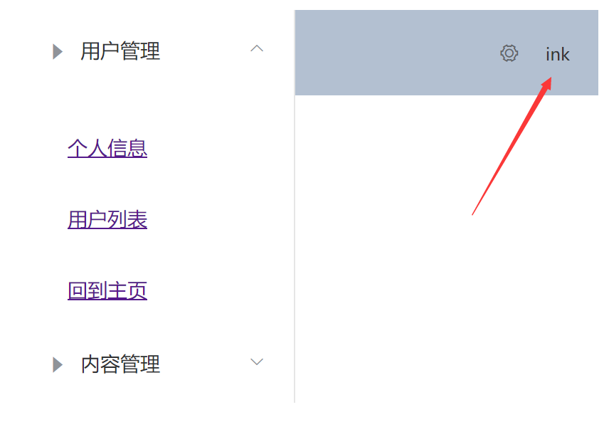

**重定向**

`redirect`

Vue中的重定向是作用在**路径不同但组件相同**的情况下

修改路由配置`index.js`，在`routes`中需要重定向的路径，并使用`redirect`属性指定重定向路径

```javascript
routes:[
  {
    path: '/main',
    name:'main',
    component:Main,
    // 嵌套路由
    children: [
      {
        // 接受参数id
        path: '/user/Profile/:id',
        name: 'Profile',
        component: Profile,
        props: true
      },
      {
        path: '/user/UserList',
        component: UserList
      }
    ]
  },{
    path:'/login',
    name:'login',
    component: Login
  },{
    path: '/goHome',
    redirect: '/main'
  }
]
```

在`Main.vue`中添加`router-link`

```vue
<el-menu-item index="1-3">
  <router-link to="/goHome">回到主页</router-link>
</el-menu-item>
```

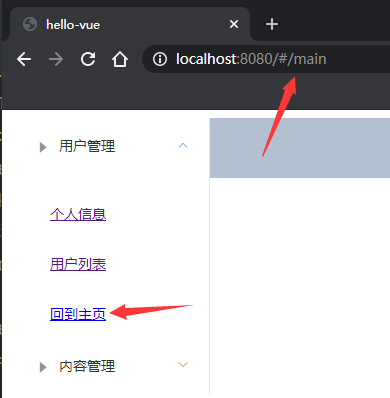

**路由模式**

路由模式有两种

- `hash`：路径带`#`，如 http://localhost:8080/#/main/ink（默认为hash路由模式）
- `history`：路径不带`#`，如 http://localhost:8080/main/ink

`mode`：设置路由模式

修改路由配置`index.js`，增加`mode`属性

```javascript
export default new VueRouter({
  // 设置路由模式
  mode: 'history',
  routes:[
    {
      path: '/main/:name',
      name:'main',
      component:Main,
      props:true,
      // 嵌套路由
      children: [
        {
          // 接受参数id
          path: '/user/Profile/:id',
          name: 'Profile',
          component: Profile,
          props: true
        },
        {
          path: '/user/UserList',
          component: UserList
        }
      ]
    },{
      path:'/login',
      name:'login',
      component: Login
    },{
      path: '/goHome',
      redirect: '/main'
    }
  ]
});
```

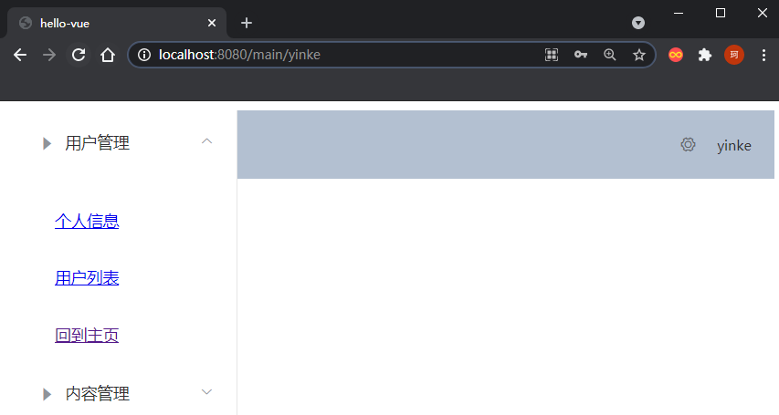

**404NotFound**

在`views`目录下创建`NotFound.vue`

```vue
<template>
<div>
  <h1>404 你的页面走丢了</h1>
</div>
</template>
<script>
export default {
  name: "NotFound"
}
</script>
<style scoped>
</style>
```

配置路由`index.js`

```javascript
{
  // 匹配所有其他的路径
  path: '*',
  component: NotFound
}
```

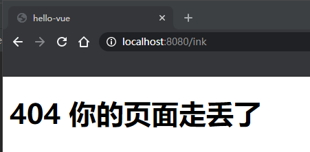

## 路由钩子函数

创建Vue对象前先执行钩子函数

- `beforeRouteEnter`：进入路由前执

- `beforeRouteLeave`：离开路由前执行

  参数

  - `to`：路由将要跳转的路径信息
  - `from`：路径跳转前的路径信息
  - `next`：路由的控制参数
    - `next()`：跳入下一个页面
    - `next(’/path’)`：改变路由的跳转方向，使其跳到另一个路由
    - `next(false)`：返回原来的页面
    - `next((vm)=>{})`：仅在`beforeRouteEnter`中可用，vm 是组件实例

修改`Profile.vue`

```vue
export default {
  props: ['id'],
  name: "Profile",
  beforeRouteEnter:(to,from,next)=>{
    // 业务代码
    console.log('进入路由之前')
    next();
  },
  beforeRouteLeave:(to,from,next)=>{
    // 业务代码
    console.log('离开路由之前')
    next();
  }
}
```


# process.env

[Node.js中环境变量process.env详解](https://www.jb51.net/article/126838.htm#)

- `process`（进程）其实是nodejs中的一个全局变量
- `process.env`属性返回一个包含用户环境信息的对象


# Axios网络通信

`Axios`异步通信

开源的用于浏览器端和Node.js的异步通信框架，主要作用是实现Ajax异步通信

[Axios API 中文文档](http://axios-js.com/)

> Vue.js是一个视图层框架，并不包含Ajax的通信功能。
>
> `jQuery.ajax()`可以实现网络通信，但jQuery操作DOM太频繁，不推荐使用

## 功能特点

- 从浏览器中创建`XMLHttpRequests`（XHR）
- 从Node.js创建http请求
- 支持Promise API（JavaScript中链式编程）
- 拦截请求和响应
- 转换请求和响应数据
- 取消请求
- 自动转换JSON数据
- 客户端支持防御XSRF（跨站请求伪造）

> 要求ES6
>
> 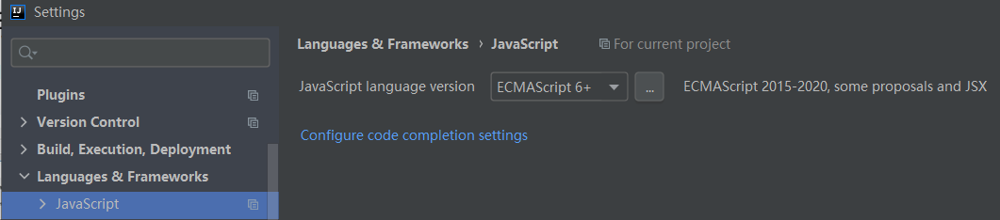

## 安装Axios

- **npm**

  ```bash
  npm install axios
  ```

- **cdn**

  ```html
  <script src="https://unpkg.com/axios/dist/axios.min.js"></script>
  ```


[### 数组更新]: 
[#Vue基础 ## 列表渲染 ### 数组更新]: 