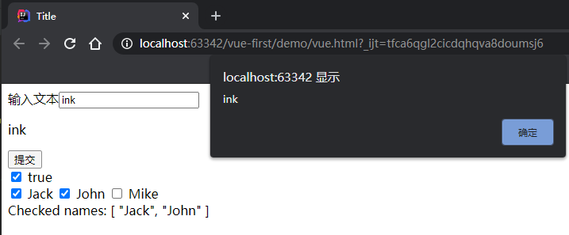
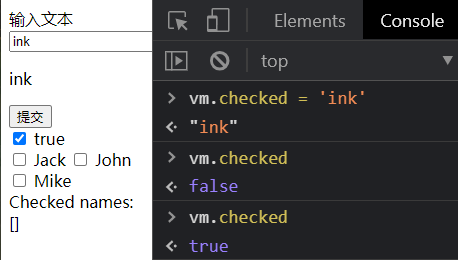
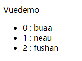
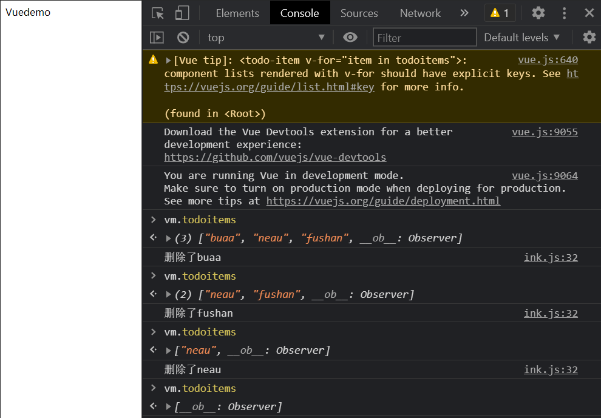
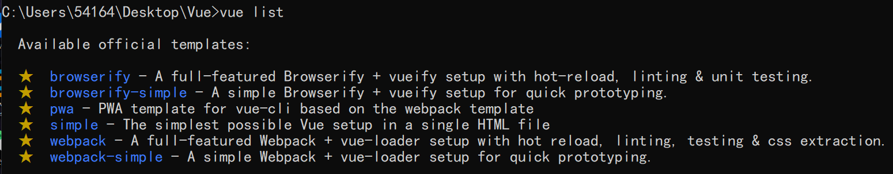
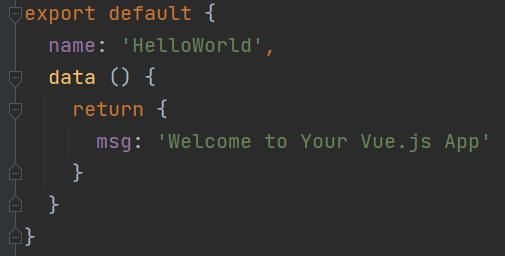
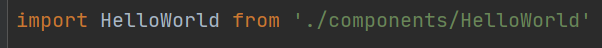
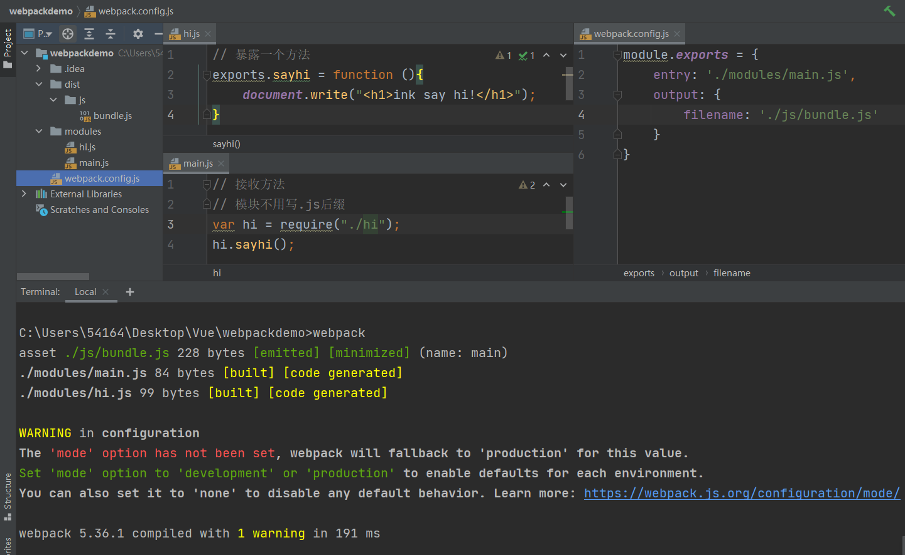
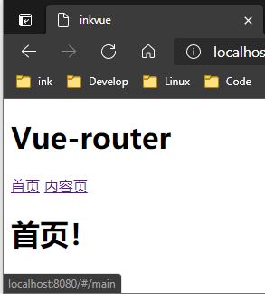
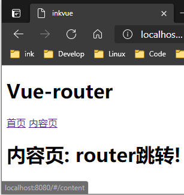

# Vue.js

渐进式JavaScript框架

> 尤雨溪
>
> Vue 被设计为可以自底向上逐层应用
>
> `Soc`：Separation of concerns 关注点分离原则

Vue 的核心库只关注**视图层**（HTML + CSS + JavaScript）

- 网络通信：Axios
- 页面跳转：Vue-router
- 状态管理：Vuex
- Vue-UI：ICE，Element-UI

**虚拟DOM**

预先通过JavaScript进行各种计算，把最终的DOM计算出来并优化的技术。这个DOM操作属于预处理操作，没有真正的操作DOM。


## MVVM模式

**软件架构设计模式**

- Model：模型层
- View：视图层
- **ViewModel**：**核心**中间件，**双向数据绑定**


**MVVM架构不允许数据和视图直接通信，必须通过ViewModel来通信**

- **ViewModel能观察数据变化，对视图对应的内容进行更新**
- **ViewModel能监听视图变化，通知数据发生改变**

> Vue.js是ViewModel层的实现者
>
> 核心：
>
> - DOM监听
> - 数据绑定


**优点**：

1. **低耦合**

   View可以独立于model变化和修改。一个ViewModel可以绑定到不同的View上

   - 当View变化的时候Model可以不变
   - 当Model变化的时候View可以不变

2. **可复用**

   可以把视图逻辑放在一个ViewModel里面，让很多View复用这个视图逻辑

3. **独立开发**

4. **可测试**


## 安装Vue

**使用`<script>`标签引入**

导入后会暴露一个全局的变量`Vue()`

- [开发版本](https://cn.vuejs.org/js/vue.js)：包含完整的警告和调试模式
- [生产版本](https://cn.vuejs.org/js/vue.min.js)：删除了警告，33.30KB min+gzip

```html
<body>
<script src="vue.js"></script>
</body>
```

打开控制台查看到以下信息即成功


**CDN引入**

```html
<script src="https://cdn.jsdelivr.net/npm/vue/dist/vue.js"></script>
```


## 使用idea开发

1. 创建文件夹并用idea打开

2. 安装Vue插件

3. 设置Vue新建文件模板

   > file->setting->editor->file and code Templates，选择Vue Single File Component

   

**注意**：

安装完vue插件后，右键new发现没有Vue component这个选项，需要自己新建模板

> https://blog.csdn.net/weixin_38556197/article/details/113838663


# Vue基础

**Vue有7个属性，8个方法，7个指令**（787原则）

**Vue属性**

- `el`：用来指示vue编译器从什么地方开始解析vue的语法（一个占位符）
- `data`：用来组织从view中抽象出来的属性（将视图的数据抽象出来存放在data中）
- `template`：用来设置模板，会替换页面元素（包括占位符）
- `methods`：放置页面中的业务逻辑，JavaScript**方法**一般都放置在methods中
- `render`：创建真正的Virtual Dom
- `computed`：计算属性
- `watch`：监听data中数据的变化


## Vue实例

每个 Vue 应用都是通过用 `Vue` 函数创建一个新的 **Vue 实例**开始的，所有的 Vue 组件都是 Vue 实例

1. **导入Vue**
2. **new一个Vue对象**
3. **对象绑定元素**
4. **存放数据**

不再和 HTML 直接交互。一个 Vue 应用会将其挂载到一个DOM 元素上对其进行完全控制

> 在文档中经常会使用 `vm` (ViewModel ) 这个变量名表示 Vue 实例


## 插值

### 文本

**数据绑定**最常见的形式就是使用**Mustache语法** (双大括号) 的**文本插值**

使用`v-once`指令能执行一次性地插值，当数据改变时，插值处的内容不会更新

```html
<body>
<!--view层 模板-->
<div id="app">
    {{message}}
</div>

<!--导入Vue.js-->
<script src="vue.js"></script>
<script src="js/ink.js"></script>
</body>
```

```javascript
var vm = new Vue({
    // 元素element,json对象,逗号隔开
    el: "#app",
    // 对象:键值对
    // model层 数据
    data: {
        message:"Hello Vue!"
    }
})
```

**数据双向绑定**

修改**vm对象**就可以修改内容

> Vue不改变DOM


### HTML

双大括号`{{}}`会将数据解释为普通文本，而非 HTML 代码

使用 `v-html`指令输出真正的HTML


### Attribute

`v-bind`

Mustache语法也不能作用在 HTML标签的属性（`attribute`）上

使用 `v-bind`（`:`）绑定HTML标签的属性

> 对于布尔`attribute` (它们只要存在就意味着值为 `true`)

```html
<!-- 在HTML标签中 -->
v-bind:标签属性="变量值"
```

```html
<div id="app">
	<!-- title是参数，将span标签的title属性和Vue实例的message的值绑定 -->
    <span v-bind:title="message">     
        鼠标悬停几秒钟查看此处动态绑定的提示信息！   
    </span> 
    <!-- 缩写 -->
    <span :title="message">     
        鼠标悬停几秒钟查看此处动态绑定的提示信息！   
    </span> 
</div>
```

```javascript
var app = new Vue({
  el: '#app',
  data: {
      message:"Hello Vue!"
  }
})
```

### JavaScript表达式


## 指令

### Vue指令

指令带有前缀 `v-`，表示它们是Vue提供的特殊attribute

指令的职责时当表达式的值改变时，将其产生的连带影响，**响应式**地作用于 DOM

- `v-bind`：响应式的更新HTML的`attribute``
- ``v-on` ：监听 DOM 事件

> `v-bind` 缩写 `:`，`v-on` 缩写 `@`


### 参数

上述两条指令能够接收一个**参数**，在指令名称之后以**冒号表示**

```html
<a v-bind:href="url">...</a>
```

`:`后面的`href` 就是参数，`v-bind` 指令将该元素的 `href` 属性与 `url` 的值绑定

```html
<a v-on:click="doSomething">...</a>
```

`:`后面的`click` 就是参数，它是监听的事件名


### 动态参数

可以用方括号`[]`括起来的 **JavaScript 表达式**作为一个指令的参数（求得的值作为最终的参数），也可以使用动态参数为一个**动态的事件名**绑定处理函数（不同事件不同的处理函数）

> 在 DOM 中使用模板时 (直接在一个 HTML 文件里撰写模板)，需要避免使用大写字符来命名键名，因为浏览器会把 **attribute 名全部强制转为小写**（所有字符）


### 修饰符

修饰符是以 `.` 指明的**特殊后缀**，用于指出一个指令应该以特殊方式绑定


## 条件渲染

### v-if

- `v-else-if`
- `v-else`

> ===：JavaScript中：先判断类型是否一致，再比较值

```html
<body>
<div id="app">
    <h1 v-if="ok">yes</h1>
    <h1 v-else>no</h1>
</div>
<script src="vue.js"></script>
<script src="js/ink.js"></script>
</body>
```

```javascript
var vm = new Vue({
    el: "#app",
    data:{
        ok: true
    }
})
```


### template渲染

`v-if` 是一个指令，只能将它添加到一个元素上。如果想切换多个元素，可以把一个 `template` 元素当做不可见的包裹元素，并在上面使用 `v-if`。最终的渲染结果将不包含 `template` 元素

```html
<template v-if="ok">
    <h1>Title</h1>  
    <p>Paragraph 1</p>  
    <p>Paragraph 2</p> 
</template>
```


### v-show

- 带有 `v-show` 的元素**始终会被渲染并保留在 DOM 中**
- `v-show` 只是简单地切换元素的CSS属性（`display`）
- `v-show` 不支持 `template` 元素，也不支持 `v-else`


**区别**：

- `v-if` 是“真正”的条件渲染，它会确保在切换过程中条件块内的事件监听器和子组件适当地被销毁和重建
- `v-if` 是**惰性的**：如果在初始渲染时条件为假，则什么也不做，直到条件第一次变为真时，才会开始渲染条件块
- `v-show`不管初始条件是什么，元素总是会被渲染，并且只是简单地基于 CSS 进行切换

`v-if` 有更高的切换开销，而 `v-show` 有更高的初始渲染开销

如果需要非常频繁地切换，使用 `v-show` 较好。如果在运行时条件很少改变，使用 `v-if` 较好

> 当 `v-if` 与 `v-for` 一起使用时，`v-for` 具有比 `v-if` 更高的优先级
>
> 不推荐一起使用


## 列表渲染	

`v-for`

### 遍历数组

基于一个数组来渲染一个列表，使用 `item in items` 形式的语法

-  `items` 是**源**数据数组
- `item` 是被迭代的数组元素的**别名**

> 也可以用 `of` 替代 `in` 作为分隔符

```html
<body>
<div id="app">
    <li v-for="item in items">
        {{item.message}}
    </li>
</div>
<script src="vue.js"></script>
<script src="js/ink.js"></script>
</body>
```

```javascript
var vm = new Vue({
    el: "#app",
    data: {
        items: [
            {message: 'ink'},
            {message: 'yinke'}
        ]
    }
})
```


### 父作用域

`v-for` 块中可以访问所有**父作用域**的`property`

`v-for` 还支持一个可选的第二个参数，即**当前项的索引**

```html
<ul id="app">
  <!-- 同时获取item和index -->
  <li v-for="(item, index) in items">
    {{ parentMessage }} - {{ index }} - {{ item.message }}
  </li>
</ul>
```

```javascript
var vm = new Vue({
  el: '#app',
  data: {
    parentMessage: 'Parent',
    items: [
      { message: 'Foo' },
      { message: 'Bar' }
    ]
  }
})
```


### 对象遍历

可以用 `v-for` 来遍历一个对象的`property`的值

- 可以提供第二个参数为 `property` 名称 （`key`）
- 可以提供第三个参数为索引（`index`）

> 遍历对象时会按 `Object.keys()` 的结果遍历

```html
<ul id="v-for-object" class="demo">
  <li v-for="value in object">
    <!-- 输出对象中的属性值 -->
    {{ value }}
  </li>
</ul>
```

```javascript
new Vue({
  el: '#v-for-object',
  data: {
    // 对象  
    object: {
      title: 'How to do lists in Vue',
      author: 'Jane Doe',
      publishedAt: '2016-04-10'
    }
  }
})
```


### 状态维护

Vue 更新使用 `v-for` 渲染的元素列表时默认使用“就地更新”的策略。如果数据项的顺序被改变，**Vue 将不会移动 DOM 元素来匹配数据项的顺序，而是就地更新每个元素**，确保它们在每个索引位置正确渲染

> 只适用于不依赖子组件状态或临时 DOM 状态 (例如：表单输入值) 的列表渲染输出

### 数组更新


## 事件处理

`v-on`

`v-on`(`@`)指令可以监听DOM事件并在触发时运行JavaScript代码

通过它**调用在 Vue 实例中定义的方法**（执行事件处理方法），方法定义在Vue的`methods`属性中

> `v-on`可以绑定HTML所有的事件

```html
<body>
<div id="app">
	<!-- 通过方法响应点击事件 --> 
	<button v-on:click="sayhi">点击</button>
</div>
<script src="vue.js"></script>
<script src="js/ink.js"></script>
</body>
```

```javascript
var vm = new Vue({
    el: "#app",
    data:{
        message: "hi ink"
    },
    // 方法也是K-V键值对
    methods:{
        sayhi: function (){
            alert(this.message);
        }
    }
})
```


### 事件修饰符

> 方法只有纯粹的数据逻辑，而不是去处理 DOM 事件细节

Vue为 `v-on` 提供了**事件修饰符**（修饰符是由**点开头的指令后缀**表示）

- `.stop`
- `.prevent`
- `.capture`
- `.self`
- `.once`
- `.passive`

```html
<!-- 阻止单击事件继续传播 -->
<a v-on:click.stop="doThis"></a>

<!-- 提交事件不再重载页面 -->
<form v-on:submit.prevent="onSubmit"></form>

<!-- 修饰符可以串联 -->
<a v-on:click.stop.prevent="doThat"></a>

<!-- 只有修饰符 -->
<form v-on:submit.prevent></form>

<!-- 添加事件监听器时使用事件捕获模式 -->
<!-- 即内部元素触发的事件先在此处理，然后才交由内部元素进行处理 -->
<div v-on:click.capture="doThis">...</div>

<!-- 只当在 event.target 是当前元素自身时触发处理函数 -->
<!-- 即事件不是从内部元素触发的 -->
<div v-on:click.self="doThat">...</div>
```

> 使用修饰符时，顺序很重要。相应的代码会以同样的顺序产生


## 表单输入绑定

`v-model` 

- `v-model`可以实现**表单输入和应用状态**之间的**双向绑定**，它会根据控件类型自动选取正确的方法来更新元素
- `v-model`本质上是一个语法糖，它负责监听用户的输入事件以更新数据，并对一些极端场景进行特殊处理
- `v-model` 在内部为**不同的输入元素使用不同的属性并抛出不同的事件**
  - `text/textarea`：使用 `value`属性和 `input` 事件
  - `checkbox/radio`：使用 `checked`属性和 `change` 事件
  - `select`：使用 `value`属性和`change` 作为事件

> `v-model`会忽略所有表单元素的`value`，`checked`，`selected`特性的初始值而总是**将Vue实例数据作为数据来源**，所以要在组件的`data`中声明初始值
>
> 实际上数据还是单向的

```html
<body>
<div id="vue">
    <!--绑定表单内容-->
    输入文本<input type="text" v-model="message">
    <p>{{message}}</p>
    <button type="button" @click="submit">提交</button>
    <div></div>
    <!-- 单选框-->
    <input type="checkbox" id="checkbox" v-model="checked">
    <label for="checkbox">{{ checked }}</label>
    <div></div>
    <!-- 复选框-->
    <input type="checkbox" id="jack" value="Jack" v-model="checkedNames">
    <label for="jack">Jack</label>
    <input type="checkbox" id="john" value="John" v-model="checkedNames">
    <label for="john">John</label>
    <input type="checkbox" id="mike" value="Mike" v-model="checkedNames">
    <label for="mike">Mike</label>
    <br>
    <span>Checked names: {{ checkedNames }}</span>
</div>
<script src="vue.js"></script>
<script src="https://unpkg.com/axios/dist/axios.min.js"></script>
<script src="js/ink.js"></script>
</body>
```

```javascript
var vm = new Vue({
    el: '#vue',
    data: {
        message: "ink",
        checked: "",
        checkedNames: []
    },
    methods: {
        submit: function (){
            alert(this.message)
        }
    }
});
```





### 值绑定


### 修饰符

`.lazy`

默认情况下`v-model` 在每次 `input` 事件触发后将输入框的值与数据进行同步 

使用 `lazy` 修饰符可以转为在 `change` 事件**之后**进行同步

```html
<!-- 在“change”时而非“input”时更新 -->
<input v-model.lazy="ink">
```


`.number`

使用 `number` 修饰符可以自动将用户的输入值转为数值类型

```html
<input v-model.number="age" type="number">
```

> 即使 `type="number"` HTML 输入元素的值也总会返回字符串

 

`.trim`

使用`trim`修饰符可以自动过滤用户输入的首尾空白字符

```html
<input v-model.trim="ink">
```


## Class 与 Style 绑定

操作元素的 class 列表和内联样式是数据绑定的一个常见需求。因为它们都是 attribute，可以用 `v-bind` 处理它们

 `v-bind` 用于 `class` 和 `style` 时，Vue.js 做了专门的增强。表达式结果的类型除了字符串之外，还可以是**对象或数组**


### 对象语法

- 可以传给 `v-bind:class` 一个对象，以动态地切换 class
- 可以在对象中传入更多字段来动态切换多个 class
- `v-bind:class` 也可以与普通的 class attribute 共存
- 可以绑定一个返回对象的计算属性

 `active` 这个 class 存在与否取决于数据 property `isActive` 的truthiness

```html
<div v-bind:class="{ active: isActive }"></div>
```


### 数组语法

可以传给 `v-bind:class`一个数组，以应用一个 class 列表

```html
<div v-bind:class="[activeClass, errorClass]"></div>
```

```javascript
data: {
  activeClass: 'active',
  errorClass: 'text-danger'
}
```

相当于

```html
<div class="active text-danger"></div>
```

# Vue组件

使用`Vue.component()`函数创建Vue组件

- 一个组件本质上是一个拥有预定义选项的**一个 Vue 实例**
- 组件是可复用的 Vue 实例，所以它与 `new Vue` 接收相同的选项（如 `data`、`computed`、`watch`、`methods` 以及生命周期钩子函数等），但不包括`el` 这样的根实例特有的选项
- 每个组件都会各自独立维护它的属性。每用一次组件，就会有一个它的新**实例**被创建

> 自定义标签组件化（**模板复用**）
>
> Vue 组件提供了纯自定义元素所不具备的一些重要功能，最突出的是跨组件数据流、自定义事件通信以及构建工具集成。

## 组件组织

几乎任意类型的应用界面都可以抽象为一个组件树

> 组件系统是一种抽象。可以使用小型、独立和通常可复用的组件构建大型应用


## Vue component


**组件注册类型**

- 全局注册
- 局部注册

全局注册Vue组件可以用在其被注册之后的任何 (通过 `new Vue`) 新创建的 Vue 根实例，也包括其组件树中的所有子组件的模板中


**创建组件**

`component()`函数包含两个参数

1. 组件名称
2. 以对象的形式描述组件

> Vue 将**模板**编译成虚拟 DOM 渲染函数
>
> Vue 能够计算出最少需要重新渲染多少组件，并把 DOM 操作次数减到最少

```html
<body>
<div id="app">
   <!-- 调用组件：创建一个 ink 组件的实例 -->
   <ink></ink>
</div>
<script src="vue.js"></script>
<script src="js/ink.js"></script>
</body>
```

```javascript
// 定义名为 ink 的新组件
Vue.component("ink",{
   template: '<li>ink</li>'
});

// 创建Vue实例才可以调用
var vm = new Vue({
    el: '#app'
});

//可以在一个通过new Vue创建的Vue根实例中，把组件作为自定义元素来使用
new Vue({ 
    el: '#ink' 
});
```

## data

一个组件的 `data` 选项**必须是一个函数**，因此每个实例可以维护一份被返回对象的独立的拷贝

> 否则可能会影响其他实例


## template

**单个根元素**：组件的模板必须只具备一个根元素

如果在组件内包含多个元素，**需要有一个根元素将他们一起包起来**，否则会报错（都是根元素）


> 实现同一个模板内有多个HTML标签的效果

```javascript
// 错误写法：每个组件必须只有一个根元素
Vue.component('ink',{
    props: ['yinke','value'],
    template: '<li> {{yinke}} </li>' +
        '<li> {{value}} </li>'
});

// 正确写法：用div标签包起来
Vue.component('ink',{
    props: ['yinke','value'],
    template: '<div>' +
        '<li> {{yinke}} </li>' +
        '<li> {{value}} </li>' +
        '</div>'
});
```


## props

prop是可以**在组件上**注册的一些自定义attribute

当一个值传递给一个prop attribute 的时候，它就变成了那个**组件实例的一个属性**

一个组件默认可以拥有任意数量的prop，任何值都可以传递给任何 prop（在组件实例中访问这个值就像访问 `data` 中的值一样）

> 默认规则下，`props`属性中的值不能大写
>
> Vue中的保留关键字不能作为`props`中的属性，如`key`


**父作用域将数据传到子组件**

组件中的`template`不能从Vue对象的`data`中直接获得数据

1. `v-for`遍历Vue对象中的`data`数据
2. `v-bind`绑定`data`数据到组件中`props`定义的`item`属性中
3. `template`通过`props`中的属性获得数据

> `props`类似于一个自定义attribute

```html
<body>
<div id="app">
    <!-- 创建一个 ink 组件的实例 -->
    <!-- 等号左边的item是props定义的属性名，等号右边的item是v-for遍历的item项 -->
   <ink v-for="item in items" 
        v-bind:item="item"
   ></ink>

</div>
<script src="vue.js"></script>
<script src="js/ink.js"></script>
</body>
```

```javascript
Vue.component('ink',{
    props: ['item'],
    template: '<li>{{item}}</li>'
});

var vm = new Vue({
    el: '#app',
    data: {
        items: ["neau","buaa","fushan"]
    }
});
```


```html
<body>
<div id="app">
    <ink v-for="item in items"
         v-bind:yinke="item.id"
         v-bind:value="item.title"
    ></ink>
</div>
<div id="components-demo">
    <button-counter v-for="item in items"
                    :title="item"
    ></button-counter>
</div>
<script src="vue.js"></script>
<script src="js/ink.js"></script>
</body>
```

```javascript
Vue.component('ink',{
    props: ['yinke','value'],
    template: '<div>' +
        '<li> {{yinke}} </li>' +
        '<li> {{value}} </li>' +
        '</div>'
});

var vm = new Vue({
    el: '#app',
    data: {
        items: [
            { id: 1, title: 'My journey with Vue' },
            { id: 2, title: 'Blogging with Vue' },
            { id: 3, title: 'Why Vue is so fun' }
        ]
    }
});

Vue.component('button-counter', {
    props: ['title'],
    data: function () {
        return {
            count: 0
        }
    },
    template: '<button v-on:click="count++">{{title}} clicked me {{ count }} times.</button>'
})

var com = new Vue({
    el: '#components-demo',
    data: {
        items: ['ink','yinke']
    }
})
```


## 组件事件

### 监听子组件事件

> 开发组件的一些功能可能要和父级组件进行沟通

Vue实例提供了一个**自定义事件的系统**来解决这个问题：父级组件可以像处理native DOM事件一样**通过 `v-on` 监听子组件实例的任意事件**


### 使用事件抛出特定值


### 组件使用v-model

自定义事件也可以用于创建支持 `v-model` 的自定义输入组件

```html
<input v-model="searchText">
<!--等价于-->
<input
  v-bind:value="searchText"
  v-on:input="searchText = $event.target.value"
>
```


# 网络通信

`Axios`异步通信

开源的用在浏览器端和Node.js的异步通信框架，主要作用是实现Ajax异步通信

[Axios API 中文文档](http://axios-js.com/)

> Vue.js是一个视图层框架，并不包含Ajax的通信功能。
>
> jQuery.ajax()可以实现网络通信，但jQuery操作DOM太频繁，不推荐使用

## 功能特点

- 从浏览器中创建`XMLHttpRequests`（XHR）
- 从Node.js创建http请求
- 支持Promise API（JavaScript中链式编程）
- 拦截请求和响应
- 转换请求和响应数据
- 取消请求
- 自动转换JSON数据
- 客户端支持防御XSRF（跨站请求伪造）

> 要求ES6
>
> 

## 安装Axios

- **npm**

  ```bash
  npm install axios
  ```

- **cdn**

  ```html
  <script src="https://unpkg.com/axios/dist/axios.min.js"></script>
  ```


## Vue生命周期

每个Vue实例在被创建时都要经过一系列的初始化过程（例如需要设置数据监听、编译模板、将实例挂载到 DOM 并在数据变化时更新 DOM 等）。

同时在这个过程中也会运行一些叫做**生命周期钩子**的函数，可以让用户在不同阶段添加自己的代码


**钩子函数需要以属性（函数）的方式声明在Vue实例中**

- `beforeCreate`：实例初始化之后，数据观测和事件配置之前被调用（页面创建之前）
- `created`：在实例创建完成后被立即调用（数据观测和事件配置已经完成），但挂载阶段还没开始，`el`属性不可见
- `beforeMount`：挂载开始之前被调用，相关的渲染函数首次被调用
- `mounted`：挂载成功时调用，`el`被新创建的`vm.$el`替换
- `beforeUpdate`：数据更新时被调用
- `updated`：更新之后调用，组件 DOM已经更新
- `activated`
- `deactivated`
- `beforeDestory`
- `destroyed`


```html
<body>
<div id="vue">
    <div>{{info.name}}</div>
    <div>{{info.links[0].name}}</div>
    <!-- 错误:<a href="{{info.url}}">点击</a> -->
    <!-- 要用v-bind绑定 -->
    <a v-bind:href="info.url">点击跳转</a>
</div>
<script src="vue.js"></script>
<script src="https://unpkg.com/axios/dist/axios.min.js"></script>
<script src="js/ink.js"></script>
</body>
```

```javascript
var vm = new Vue({
    el: '#vue',
    data: {
        // 设置info为{}，自动绑定response的各个属性
        info: {}
    },
    // 钩子函数（链式编程）
    // data.json路径
    mounted(){
        // GET请求得到返回数据绑定到data中
        axios.get('data.json').then(response=>(this.info = response.data));
    }
});
```

```json
// json文件
{
  "name": "ink",
  "url": "https://www.baidu.com/",
  "page": 1,
  "isNonProfit": true,
  "address": {
    "street": "知春路",
    "city": "北京",
    "country": "中国"
  },
  "links": [
    {
      "name": "Vue",
      "url": "https://cn.vuejs.org/"
    },
    {
      "name": "leetcode",
      "url": "https://leetcode-cn.com/"
    },
    {
      "name": "知乎",
      "url": "https://www.zhihu.com/"
    }
  ]
}
```


# 计算属性

`computed`

对于任何复杂逻辑都应当使用**计算属性**

在内存中运行，能够将计算结果缓存起来的属性（将行为转换为静态的属性）


**计算属性和方法对比**

- **计算属性是基于它们的响应式依赖进行缓存的**。只在相关响应式依赖发生改变时它们才会重新求值。这就意味着只要计算值没有发生改变，多次访问计算属性会立即返回之前的计算结果而不必再次执行函数
- 每当触发重新渲染时，**方法调用将总会再次执行函数**


- methods定义方法，调用要加上`()`
- computed定义计算属性，属性可以直接调用

> computed中的方法不要和methods中的方法同名，同名时默认使用methods中的方法

```html
<body>
<div id="vue">
    <p>{{currentTime1()}}: methods</p>
    <!-- 计算属性将不再更新，因为Date.now()不是响应式依赖 -->
    <p>{{currentTime2}}: computed</p>
</div>
<script src="vue.js"></script>
<script src="https://unpkg.com/axios/dist/axios.min.js"></script>
<script src="js/ink.js"></script>
</body>
```

```javascript
var vm = new Vue({
    el: '#vue',
    data: {
        message: "ink"
    },
    methods: {
        currentTime1: function (){
            return Date.now();
        }
    },
    computed: {
        currentTime2: function (){
            return Date.now();
        }
    }
});
```


# 插槽

`slot`：插槽

Vue.js中使用`<slot>`元素作为承载**分发内容**的出口，可以应用在组合组件中

- 插槽内可以包含任何模板代码，包括 HTML，甚至其它组件
- 每一个slot都会加载全部的插件

> Vue在2.6.0中为**具名插槽**和**作用域插槽**引入了一个新的统一的`v-slot` 指令
>
> `v-slot` 指令取代了 `slot` 和 `slot-scope` 这两个目前已被废弃但未被移除且仍在文档中的attribute

```html
<body>
<div id="app">

<todo>
	<!-- 插槽内包含组件 -->
    <todo-title  slot="todo-title"
                 v-bind:title="todotitle"
    ></todo-title>
    <!-- item在前,index在后-->
    <todo-item  slot="todo-item"
                v-for="(item,index) in todoitems"
                v-bind:item="item"
                v-bind:index="index"
    ></todo-item>
</todo>

</div>
<!--1.导入Vue.js-->
<script src="vue.js"></script>
<script src="js/ink.js"></script>
</body>
```

```javascript
// 定义插槽<slot></slot>
Vue.component('todo',{
    template:   '<div>' +
                    '<slot name="todo-title"></slot>' +
                        '<ul>' +
                            '<slot name="todo-item"></slot>' +
                        '</ul>' +
                '</div>'
});

Vue.component('todo-title',{
    props: ['title'],
    template:'<div>{{title}}</div>'
});

Vue.component("todo-item",{
    props: ['item','index'],
    template:"<li>{{index}} : {{item}}</li>"
});

var vm = new Vue({
    el:"#app",
    data:{
        todotitle: 'Vuedemo',
        todoitems:['buaa','neau','fushan']
    }
});
```




### 作用域

- **父级模板里的所有内容都是在父级作用域中编译的**
- **子模板里的所有内容都是在子作用域中编译的**

在插槽中使用数据跟模板的其它地方一样可以访问相同的实例属性 (也就是相同的**作用域**)

```html
<navigation-link url="/profile">
  Logged in as {{ user.name }}
</navigation-link>
```

但**不能**访问 父级（`<navigation-link>`） 作用域

```html
<navigation-link url="/profile">
  Clicking here will send you to: {{ url }}
  <!-- 这里的url是undefined
	   因为该插槽的内容是传递给<navigation-link>标签的
	   而不是在<navigation-link>组件内部定义的
  -->
</navigation-link>
```


# 自定义事件

场景：数据在Vue的实例中， 但删除操作要在组件中完成

1. 组件可以调用自身`methods`中的方法，但无法访问实例`methods`中的方法

   ```javascript
   Vue.component("todo-item",{
       props: ['item','index'],
       // 想删除vm中的data属性中的数据，报错
       template:"<li>{{index}} : {{item}} <button v-on:click=\"removeitems\"> 删除</button></li>",
       methods: {
           remove: function (){
               alert("删除！")
           }
       }
   });
   var vm = new Vue({
       el:"#app",
       data:{
           todotitle: 'Vuedemo',
           todoitems:['buaa','neau','fushan'],
           methods: {
               // removeitems方法
               removeitems: function (){
                   alert("删除~~~")
               }
           }
       }
   });
   ```

   

2. Vue实例可以调用自身`methods`中定义方法操作数据

   ```javascript
   var vm = new Vue({
       el:"#app",
       data: {
           todotitle: 'Vuedemo',
           todoitems: ['buaa', 'neau', 'fushan'],
       },
       methods: {
           removeitems: function (index){
               // splice()方法，删除一个元素
               console.log("删除了" + this.todoitems[index]);
               this.todoitems.splice(index,1);
           }
       }
   });
   ```

3. Vue提供**自定义事件**使得**组件能访问实例中的方法**从而操作实例中的数据

   `this.$emit('自定义事件名'，参数)`

   > 参数传递与事件分发
   >
   > 定义事件名不能和JavaScript关键字重名

   - 前端通过id属性和Vue实例绑定，可以调用Vue实例中的方法
   - 前端通过`v-on`将自定义事件传递给Vue实例的中的方法
   - 组件通过`this.$emit`绑定前端的自定义事件从而调用Vue实例中的方法

   > Vue实例将数据和方法与View层绑定，View层在分发数据和方法到下面的组件绑定。View相当于中转Vue实例的数据和方法由组件控制（前端：View层）
   >
   > 前端通过`v-bind`绑定Vue实例的数据，组件通过`props`绑定前端的数据
   
   ```html
   <body>
   <div id="app">
   <todo>
       <todo-title  slot="todo-title"
                    v-bind:title="todotitle"
       ></todo-title>
       <todo-item  slot="todo-item"
                   v-for="(item,index) in todoitems"
                   v-bind:item="item"
                   v-bind:index="index"
                   v-on:remove="removeitems(index)"
       ></todo-item>
   </todo>
   </div>
   <script src="vue.js"></script>
   <script src="js/ink.js"></script>
   </body>
   ```
   
   ```javascript
   Vue.component("todo-item",{
       props: ['item','index'],
       template:"<li>{{index}} : {{item}} <button v-on:click=\"removeI\">删除</button> </li>",
       methods: {
           removeI: function (index){
               this.$emit('remove',index);
           }
       }
   });
   var vm = new Vue({
       el:"#app",
       data: {
           todotitle: 'Vuedemo',
           todoitems: ['buaa', 'neau', 'fushan'],
       },
       methods: {
           removeitems: function (index){
               // splice()方法，删除一个元素
               console.log("删除了" + this.todoitems[index]);
               this.todoitems.splice(index,1);
           }
       }
   });
   ```
   
   


# Vue-cli

`vue-cli`是官方提供的一个脚手架，用于快速生成一个Vue项目模板（自动生成好项目目录，配置好Webpack以及各种依赖包的工具）

> 实际开发采用Vue-cli脚手架，vue-router路由，vuex状态管理，Vue UI使用ElementUI来快速搭建前端项目


**主要功能**

- 统一的目录结构
- 本地调试
- 热部署
- 单元测试
- 集成打包上线

## 环境配置

> 以管理员身份运行

1. 安装Node.js：[Node.js|Download](https://nodejs.org/en/download/)（自动配置环境变量）

   ```bash
   # 验证
   node -v
   # 自带npm
   npm -v
   ```

   > npm类似CentOS下的yum和Ubuntu下的apt-get

2. 安装Node.js淘宝**镜像加速器**（cnpm）

   ```bash
   # -g 全局安装
   npm install cnpm -g
   
   # 或者每次安装包都加上参数--registry
   npm install --registry=https://registry.npm.taobao.org
   ```
   
   > C:\Users\54164\AppData\Roaming\npm
   >
   > 尽量使用npm，cnpm可能打包会失败
   
3. 安装Vue-cli

   > vue-cli3.0要nodeJs ≥ 8.9（官方推荐 8.11.0+）
   
   ```bash
   npm install vue-cli -g
   
   # 验证
   vue -V
   
   # 查看可以基于哪些模板创建vue应用程序(通常选择webpack)
   vue list
   ```
   
   

## 创建程序

创建一个基于`webpack`模板的Vue应用程序

1. **进入项目目录**

2. **创建项目**

   ```bash
   vue init webpack 项目名
   ```

3. **设置**

   - Project name：项目名称，默认回车即可
   - Project description：项目描述，默认回车即可
   - Author：项目作者，默认回车即可
   - Install vue-router：是否安装vue-router，选择n不安装（后期需要再手动添加）
   - Use ESLint to lint your code:是否使用ESLint做代码检查，选择n不安装（后期需要再手动添加)
   - Set up unit tests:单元测试相关，选择n不安装（后期需要再手动添加）
   - Setupe2etests with Nightwatch：单元测试相关，选择n不安装（后期需要再手动添加）
   - Should we run npm install for you after the,project has been created:创建完成后直接初始化，选择n，手动执行

   

4. **初始化项目**

   在项目目录下安装依赖(根据项目中的`package.json`文件)，生成`node_modules`文件夹

   自动生成的package.json版本有问题

   > webpack3.0及其以上或4.0以下版本自带webpack-cli，不需要额外安装。而4.0以上则需要

   ```json
   {
     "name": "myvue",
     "version": "1.0.0",
     "description": "A Vue.js project",
     "author": "lzh <luzehua@zhongbei.com>",
     "private": true,
     "scripts": {
       "dev": "webpack-dev-server --inline --progress --config build/webpack.dev.conf.js",
       "start": "npm run dev",
       "build": "node build/build.js"
     },
     "dependencies": {
       "vue": "^2.5.2"
     },
     "devDependencies": {
       "autoprefixer": "^7.1.2",
       "babel-core": "^6.22.1",
       "babel-helper-vue-jsx-merge-props": "^2.0.3",
       "babel-loader": "^7.1.1",
       "babel-plugin-syntax-jsx": "^6.18.0",
       "babel-plugin-transform-runtime": "^6.22.0",
       "babel-plugin-transform-vue-jsx": "^3.5.0",
       "babel-preset-env": "^1.3.2",
       "babel-preset-stage-2": "^6.22.0",
       "chalk": "^2.0.1",
       "copy-webpack-plugin": "^4.0.1",
       "css-loader": "^0.28.0",
       "extract-text-webpack-plugin": "^3.0.0",
       "file-loader": "^1.1.4",
       "friendly-errors-webpack-plugin": "^1.6.1",
       "html-webpack-plugin": "^2.30.1",
       "node-notifier": "^5.1.2",
       "optimize-css-assets-webpack-plugin": "^3.2.0",
       "ora": "^1.2.0",
       "portfinder": "^1.0.13",
       "postcss-import": "^11.0.0",
       "postcss-loader": "^2.0.8",
       "postcss-url": "^7.2.1",
       "rimraf": "^2.6.0",
       "semver": "^5.3.0",
       "shelljs": "^0.7.6",
       "uglifyjs-webpack-plugin": "^1.1.1",
       "url-loader": "^0.5.8",
       "vue-loader": "^13.3.0",
       "vue-router": "^3.3.4",
       "vue-style-loader": "^3.0.1",
       "vue-template-compiler": "^2.5.2",
       "webpack": "^3.6.0",
       "webpack-bundle-analyzer": "^2.9.0",
       "webpack-dev-server": "^2.9.1",
       "webpack-merge": "^4.1.0"
     },
     "engines": {
       "node": ">= 6.0.0",
       "npm": ">= 3.0.0"
     },
     "browserslist": [
       "> 1%",
       "last 2 versions",
       "not ie <= 8"
     ]
   }
   ```

   > npm版本过高可能会报错，需要降低版本
   >
   > warn不用管

   ```bash
   # 降低版本
   npm install npm@6.14.10 -g
   # 安装依赖
   npm install

5. **运行项目**

   webpack打包并运行

   ```bash
   npm run dev
   ```

   > `ctrl+c`停止
   >
   > 端口号配置文件：`config`目录下的index.js中的port

   

6. **package.json** 

   可以看到**开发和生产 环境的入口**

   - dev：开发环境的启动命令

   - build：生产打包环境的命令

     > 运行 `npm run build` 命令就可以进行打包工作。打包完成后会生成 `dist` 目录，项目上线时，把`dist` 目录下的文件放到服务器就可以了

   ```json
   "scripts": {
       "dev": "webpack-dev-server --inline --progress --config build/webpack.dev.conf.js",
       "start": "npm run dev",
       "build": "node build/build.js"
   },
   ```


## idea

- 以管理员身份运行idea
- `File`->`Open`打开项目目录
- 在idea中的终端执行命令运行项目

> 项目入口：main.js绑定到index.html






# Webpack

- Webpack是一个现代JavaScript应用程序的静态模块**打包工具**(module bundler) 
- Wbpack处理应用程序时会递归地构建一个**依赖关系图**(dependency graph) ， 包含应用程序需要的每个模块， 然后将所有这些模块打包成一个或多个bundle
- Webpack可以将松散耦合的模块按照依赖和规则打包成**符合生产环境部署的前端资源**。还可以将按需加载的模块进行代码分离，等到实际需要时再异步加载。通过loader转换， 任何形式的资源都可以当做模块， 比如Commons JS、ES6、CSS、JSON、CoffeeScript等

> 现在越来越多的网站已经从网页模式进化到了WebApp模式，运行在浏览器里。 WebApp通常是一个SPA(单页面应用) ， 每一个视图通过异步的方式加载，这导致页面初始化和使用过程中会加载越来越多的JavaScript代码
>
> 前端开发和其他开发工作的主要区别：
>
> - 前端基于多语言、多层次的编码和组织工作
> - 前端产品的交付是基于浏览器的，这些资源是通过增量加载的方式运行到浏览器端


[Vue.js新手入门指南 ](https://zhuanlan.zhihu.com/p/25659025)

> - 前端代码为什么要打包呢？
>   因为单页应用程序中用到很多素材，如果每一个素材都通过在HTML中以src属性或者link来引入，那么请求一个页面的时候，可能浏览器就要发起十多次请求，往往请求的这些资源都是一些脚本代码或者很小的图片，这些资源本身才几k，下载连1秒都不需要，但是由于HTTP是应用层协议，它的下层是TCP这个运输层协议，TCP的握手和挥手过程消耗的时间可能比下载资源本身还要长，所以需要把这些小文件全部打包成一个文件，这样只要一次TCP握手和挥手的过程，就把多个资源给下载下来了，并且多个资源由于都是共享一个HTTP请求，所以head等部分也是共享的，相当于形成了规模效应，让网页展现更快，用户体验更好。
> - Webpack还有构建的功能
>   现在国内外还有很多人用着老版本的浏览器，这些浏览器并不支持ECMAScript6这个新版本的JavaScript，那么前端项目如何在这种浏览器上运行呢？这就需要Webpack的Loader自动载入一个转换器来将ECMAScript6转换成浏览器能支持的老版本JavaScript语言，这个转换器的名字叫做babel。这就是Webpack的构建功能。

## 规范

### CommonsJS规范

服务器端的Node.js遵循**CommonsJS规范**

核心思想是允许模块通过`require`方法来**同步加载**所需依赖的其它模块，然后通过`exports`或`module.exports`来导出需要暴露的接口

```javascript
require("module");
require("../module.js");
exports.doStuff = function(){};
module.exports = someValue;
```

**优点：**

- 服务器端模块便于重用
- NPM中已经有超过45万个可以使用的模块包
- 简单易用

**缺点：**

- 同步的模块加载方式不适合在浏览器环境中，同步意味着阻塞加载，浏览器资源是异步加载的
- 不能非阻塞的并行加载多个模块

**实现：**

- 服务端的NodeJS
- Browserify，浏览器端的CommonsJS实现，可以使用NPM的模块，但是编译打包后的文件体积较大
- modules-webmake，类似Browserify，但不如Browserify灵活
- wreq，Browserify的前身


### AMD规范

Asynchronous Module Definition规范主要是一个接口`define(id,dependencies,factory)`

在声明模块的时候指定所有的依赖`dependencies`并当做形参传到`factory`中，对于依赖的模块**提前执行**

```javascript
define("module",["dep1","dep2"],functian(d1,d2){
	return someExportedValue;
});
require（["module","../file.js"],function(module，file){});
```

**优点：**

- 适合在浏览器环境中**异步加载模块**
- 可以**并行加载**多个模块

**缺点：**

- 提高了开发成本，代码的阅读和书写比较困难，模块定义方式的语义不畅
- 不符合通用的模块化思维方式

**实现：**

- RequireJS
- curl


### CMD规范

Commons Module Definition规范和AMD相似，并与CommonsJS和NodeJS的Modules规范保持了很大的兼容性

```javascript
define(function(require,exports,module){
	var $=require("jquery");
	var Spinning = require("./spinning");
	exports.doSomething = ...;
	module.exports=...;
});
```

**优点：**

- 依赖就近，延迟执行
- 可以很容易在Node.js中运行

**缺点：**

- 依赖SPM打包，模块的加载逻辑偏重


### ES6模块

EcmaScript6标准增加了JavaScript语言层面的模块体系定义

**ES6模块的设计思想使编译时就能确定模块的依赖关系， 以及输入和输出的变量**。

> 严格检查模式`strict`
>
> Commons JS和AMD模块都只能在**运行时**确定这些东西

```javascript
import "jquery"
export function doStuff(){}
module "localModule"{}
```

**优点**

- 容易进行静态分析
- 面向未来的EcmaScript标准

**缺点**

- 原生浏览器端还没有实现该标准
- 全新的命令，新版的Node.js才支持


## 安装

```bash
# 打包工具
npm install webpack -g

# 客户端
npm install webpack-cli -g

# 验证
webpack -v
webpack-cli -v
```


## 配置

创建 `webpack.config.js`配置文件

- `entry`：入口文件， 指定webpack用哪个文件作为项目的入口
- `output`：输出， 指定webpack把处理完成的文件放到的路径
- `module`：模块， 用于处理各种类型的文件
- `plugins`：插件， 如热更新、代码重用等
- `resolve`：设置路径指向
- `watch`：监听， 用于设置文件改动后直接打包

```javascript
module.exports = {
	entry:"",
	output:{
		path:"",
		filename:""
	},
	module:{
		loaders:[
			{test:/\.js$/,;\loade:""}
		]
	},
	plugins:{},
	resolve:{},
	watch:true
}
```

运行`webpack`命令打包


## 运行

1. 创建webpack项目目录（空）

2. 在idea中**open**项目目录

3. 在**项目目录下**创建`modules`目录（Directory）

4. 在`modules`目录下创建模块文件hi.js，用于编写JavaScript模块相关代码

   ```javascript
   // 暴露一个方法
   exports.sayhi = function (){
       document.write("<h1>ink say hi!</h1>");
   }
   ```

5. 在`modules`目录下创建入口文件main.js，用于打包时设置`entry`属性

   ```javascript
   // 接收方法
   // 模块不用写.js后缀
   var hi = require("./hi");
   hi.sayhi();
   ```

6. 在**项目目录下**创建webpack.config.js配置文件，在idea终端中使用`webpack`命令打包

   

7. 在**项目目录下**创建index.html，导入webpack打包后的JavaScript文件

   ```html
   <body>
   <!--导入包-->
   <script src="dist/js/bundle.js"></script>
   </body>
   ```


# Vue-router

Vue Router是Vue.js官方的路**由管理器**。

**功能：**

- 嵌套的路由/视图表
- 模块化的、基于组件的路由配置
- 路由参数、查询、通配符
- 基于Vue js过渡系统的视图过渡效果
- 细粒度的导航控制
- 带有自动激活的CSS class的链接
- HTML5 历史模式或hash模式， 在IE 9中自动降级
- 自定义的滚动行为

> Vue-route管理请求入口和页面映射关系，可以实现对页面局部进行无刷新的替换，让用户感觉就像切换到了网页一样
>
> 单页应用程序（SPA）：单页应用一般指的就是一个页面就是应用，当然也可以是一个子应用。单页应用程序中一般交互处理非常多，而且页面中的内容需要根据用户的操作动态变化。


## 安装

在idea的终端中执行命令安装

```bash
# --save-dev保存到node_modules目录下
npm install vue-router --save-dev
```

如果在一个模块化工程中使用vue-router，必须要通过`Vue.use()`显示声明

```vue
// 导入
import VueRouter from 'vue-router'

// 显示声明使用VueRouter
Vue.use(VueRouter);
```

## 运行

> 前端命名规则：`index.js`一般是主配置文件，会默认加载

1. 在`components` 目录下编写`Content.vue` 组件

   ```vue
   <template>
     <h1>内容页: router跳转!</h1>
   </template>
   <script>
   export default {
     name: "Content"
   }
   </script>
   <!-- scoped限制作用域 -->
   <style scoped>
   </style>
   ```

2. 在`components` 目录下编写`Main.vue` 组件

   ```vue
   <template>
       <h1>首页！</h1>
   </template>
   <script>
   export default {
     name: "Main"
   }
   </script>
   <style scoped>
   </style>
   ```

3. 在`src`目录下新建路由文件夹`router`专门存放路由

   在配`router`目录下新建路由主配置文件`index.js`

   1. 导入路由（import组件）
   2. 配置路由（跳转组件）

   ```javascript
   // index.js 主配置文件
   import Vue from 'vue'
   // 导入路由
   import VueRouter from 'vue-router'
   // 导入自定义组件
   import Content from '../components/Content'
   import Main from '../components/Main'
   // 安装路由
   Vue.use(VueRouter);
   // 配置导出路由
   export default new VueRouter({
     routes: [
       {
         // 路由路径
         path: '/content',
         // 路由名(可省略)
         name: 'content',
         // 跳转组件
         component: Content
       },
       {
         path: '/main',
         name: 'main',
         component: Main
       }
     ]
   })
   ```

4. 在`main.js`中配置路由

   ```javascript
   // 导入组件
   import Vue from 'vue'
   import App from './App'
   
   // 会自动扫描里面的路由配置index.js(不用写)
   import router from './router'
   
   Vue.config.productionTip = false;
   
   new Vue({
     el: '#app',
     // 配置路由
     router,
     components: { App },
     template: '<App/>'
   })
   ```

5. 在`App.vue`中使用路由

   - `router-link`：控制路由
   - `router-view`：控制页面展示

   ```vue
   <template>
     <div id="app">
       <h1>Vue-router</h1>
       <!-- router-link默认会被渲染成一个<a>标签，to属性为指定链接 -->
       <router-link to="/main" >首页</router-link>
       <router-link to="/content">内容页</router-link>
       <!-- router-view：用于渲染路由匹配到的组件 -->
       <router-view></router-view>
     </div>
   </template>
   
   <script>
   export default {
     name: 'App'
   }
   </script>
   
   <style></style>
   ```






# Vue-ElementUI

## 创建项目

- `npm install moduleName`：安装模块到项目目录下
- `npm install -g moduleName`：`-g`表示将模块安装到全局（具体位置看npm config prefix)
- `npm install -save moduleName`：`–save`表示将模块安装到项目目录下， 并在`package.json`文件的`dependencies`节点写入依赖（缩写为-S)
- `npm install -save-dev moduleName`：`–save-dev`表示将模块安装到项目目录下，并在`package.json`文件的`devDependencies`节点写入依赖（缩写为-D)

```bash
# 新建项目
vue init webpack hello-vue

#进入项目目录
cd hello-vue

#安装Vue-router
npm install vue-router --save-dev

#安装ElementUI
npm i element-ui -S

#安装依赖
npm install

# 安装SASS加载器(sass-loader和node-sass)
cnpm install sass-loader node-sass --save-dev

#启功
npm run dev
```

**调整项目结构**

在`src`目录中创建目录：

- assets：存放资源文件
- components：存放Vue功能组件
- views：存放Vue视图组件
- router：存放vue-router路由配置

**创建首页视图**

在`views`目录下创建`Main.vue`视图组件

```vue
<template>
  <h1>首页</h1>
</template>
<script>
export default {
  name: "Main"
}
</script>
<style scoped>
</style>
```

**创建登录页视图**

在`views`目录下创建`Login.vue`视图组件

> `el-form`的元素为ElementUI组件

```vue
<template>
  <div>
    <el-form ref="loginForm" :model="form" :rules="rules" label-width="80px" class="login-box">
      <h3 class="login-title">欢迎登录</h3>
      <el-form-item label="账号" prop="username">
        <el-input type="text" placeholder="请输入账号" v-model="form.username"/>
      </el-form-item>
      <el-form-item label="密码" prop="password">
        <el-input type="password" placeholder="请输入密码" v-model="form.password"/>
      </el-form-item>
      <el-form-item>
        <el-button type="primary" v-on:click="onSubmit('loginForm')">登录</el-button>
      </el-form-item>
    </el-form>

    <el-dialog
      title="温馨提示"
      :visible.sync="dialogVisible"
      width="30%">
      <span>请输入账号和密码</span>
      <span slot="footer" class="dialog-footer">
        <el-button type="primary" @click="dialogVisible = false">确 定</el-button>
      </span>
    </el-dialog>
  </div>
</template>

<script>
export default {
  name: "Login",
  data() {
    return {
      form: {
        username: '',
        password: ''
      },

      // 表单验证，需要在 el-form-item 元素中增加 prop 属性
      rules: {
        username: [
          {required: true, message: '账号不可为空', trigger: 'blur'}
        ],
        password: [
          {required: true, message: '密码不可为空', trigger: 'blur'}
        ]
      },

      // 对话框显示和隐藏
      dialogVisible: false
    }
  },
  methods: {
    onSubmit(formName) {
      // 为表单绑定验证功能
      this.$refs[formName].validate((valid) => {
        if (valid) {
          // 使用 vue-router 路由到指定页面，该方式称之为编程式导航
          this.$router.push("/main");
        } else {
          this.dialogVisible = true;
          return false;
        }
      });
    }
  }
}
</script>

<style lang="scss" scoped>
.login-box {
  border: 1px solid #DCDFE6;
  width: 350px;
  margin: 180px auto;
  padding: 35px 35px 15px 35px;
  border-radius: 5px;
  -webkit-border-radius: 5px;
  -moz-border-radius: 5px;
  box-shadow: 0 0 25px #909399;
}

.login-title {
  text-align: center;
  margin: 0 auto 40px auto;
  color: #303133;
}
</style>

```

**创建路由**

在`router`目录下创建`index.js`路由配置文件

```javascript
import Vue from 'vue'
import VueRouter from 'vue-router'
import Main from '../views/Main'
import Login from '../views/Login'

Vue.use(VueRouter);

export default new VueRouter({
  routes:[
    {
      path: '/main',
      name:'main',

      component:Main
    },{
      path:'/login',
      name:'login',
      component: Login
    }
  ]
});
```

**APP.vue**

```vue
<template>
  <div id="app">
    <router-view></router-view>
  </div>
</template>

<script>
export default {
  name: 'App'
}
</script>
```

**main.js**

入口文件

```javascript
import Vue from 'vue'
import App from './App'
import router from "./router"

import ElementUI from 'element-ui'
import 'element-ui/lib/theme-chalk/index.css'

Vue.use(router)
Vue.use(ElementUI)

new Vue({
  el: '#app',
  router,
  // 引入element-ui
  render:h=>h(App)
})

```

**运行**

> 安装问题：Error:Node Sass version 5.0.0 is incompatible with ^4.x
>
> 解决方案：此错误来自sass-loader，因为node-sass@latest为v5.0.0而sass-loader期望值为^4.0.0
>
> ```bash
> //卸载 node-sass
> npm uninstall node-sass
> 
> //然后安装最新版本（5.0之前）
> npm install node-sass@4.14.1
> ```
>
> sass-loader版本太高，修改："sass-loader": "^7.3.1" 


## 嵌套路由

嵌套路由又称子路由。URL 中各段**动态路径也**按某种结构对应**嵌套的各层组件**


在`views`目录下创建`user`目录

在`user`目录下创建`Profile.vue`视图组件

```vue
<template>
  <h1>个人信息</h1>
</template>
<script>
export default {
  name: "Profile"
}
</script>
<style scoped>
</style>
```

在`user`目录下创建`UserList.vue`视图组件

```vue
<template>
  <h1>用户列表</h1>
</template>
<script>
export default {
  name: "UserList"
}
</script>
<style scoped>
</style>
```

**配置嵌套路由**

修改`router`目录下的`index.js`路由配置文件

```javascript
import Vue from 'vue'
import VueRouter from 'vue-router'
import Main from '../views/Main'
import Login from '../views/Login'

import Profile from '../views/user/Profile'
import Userlist from '../views/user/UserList'

Vue.use(VueRouter);

export default new VueRouter({
  routes:[
    {
      path: '/main',
      name:'main',
      component:Main,
      // 嵌套路由
      children: [
        {
          path: '/user/Profile',
          component: Profile
        },
        {
          path: '/user/UserList',
          component: UserList
        }
      ]
    },{
      path:'/login',
      name:'login',
      component: Login
    }
  ]
});
```

**修改首页视图**

使用ElementUI布局容器组件修改`Main.vue`视图组件

```vue
<template>
  <div>
    <el-container>
      <el-aside width="200px">
        <el-menu :default-openeds="['1']">
          <!-- 第一部分 -->
          <el-submenu index="1">
            <template slot="title"><i class="el-icon-caret-right"></i>用户管理</template>
            <el-menu-item-group>
                
              <el-menu-item index="1-1">
                <!-- router-link展示 -->
                <router-link to="/user/profile">个人信息</router-link>
              </el-menu-item>
                
              <el-menu-item index="1-2">
                <router-link to="/user/UserList">用户列表</router-link>
              </el-menu-item>
            </el-menu-item-group>
          </el-submenu>

		  <!-- 第二部分 -->
          <el-submenu index="2">
            <template slot="title"><i class="el-icon-caret-right"></i>内容管理</template>
            <el-menu-item-group>
              <el-menu-item index="2-1">分类管理</el-menu-item>
              <el-menu-item index="2-2">内容列表</el-menu-item>
            </el-menu-item-group>
          </el-submenu>
        </el-menu>
      </el-aside>

      <el-container>
        <el-header style="text-align: right; font-size: 12px">
          <el-dropdown>
            <i class="el-icon-setting" style="margin-right: 15px"></i>
            <el-dropdown-menu slot="dropdown">
              <el-dropdown-item>个人信息</el-dropdown-item>
              <el-dropdown-item>退出登录</el-dropdown-item>
            </el-dropdown-menu>
          </el-dropdown>
        </el-header>
          
        <!-- router-view显示 -->
        <el-main>
          <router-view />
        </el-main>
          
      </el-container>
    </el-container>
  </div>
</template>

<script>
export default {
  name: "Main"
}
</script>

<style scoped lang="scss">
.el-header {
  background-color: #B3C0D1;
  color: #333;
  line-height: 60px;
}
.el-aside {
  color: #333;
}
</style>
```


## 参数传递

把某种模式**匹配到的所有路由全都映射到同个组件**，根据**不同的属性**用组件渲染就需要用参数传递

**$route方式**

在`Main.vue`中修改`router-link to`接收参数`name`和`params`

```vue
<el-menu-item index="1-1">
  <!-- router-link展示 -->
  <!-- 参数传递需要对象,v-bind绑定:name组件名,params传递参数 -->
  <router-link :to="{ name:'Profile', params:{id:1} }">个人信息</router-link>
</el-menu-item>
```

