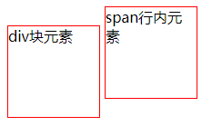
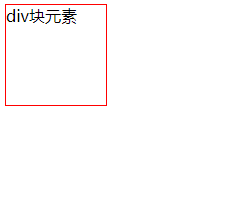

# CSS

学习内容

- CSS基础
- **CSS选择器**
- 美化网页（文字，阴影，超链接，列表，渐变）
- 盒子模型
- 浮动
- 定位
- 网页动画（特效）

## CSS简介

层叠级联样式表：Cascading Style Sheets

是一种用来**表现**（美化）HTML或XML等文件样式的语言。

不仅可以静态地修饰网页，还可以配合各种脚本语言动态地对网页各元素进行格式化。

- CSS 1.0

- CSS 2.0：**DIV**（块）+CSS，**HTML与CSS结构分离**

- CSS 2.1：浮动，定位

- CSS 3.0：圆角，阴影，动画

# CSS基础

## style

文件目录格式

- css文件夹
  - style.css
- index.html
- images

规范：在`<style>`中编写css代码

注意：不要在style中写html注释`<!-- -->`（css的注释`/* */`）

# 导入方式

优先级：就近原则

但是行内样式一定比内部样式和外部样式近

- 行内 > 外部

- 行内＞内部

内部和外部则看谁近

## 行内样式

css和html不分离，在标签元素中编写`style`属性

```html
<h1 style="color: crimson">标题</h1>
```

## 内部样式

css和html不分离，css部分在`head`中声明

```html
<!--
语法: 声明以;结尾
    选择器{
        声明1;
        声明2;
    }
-->
<head>
    <style>
        h1{
            color: crimson;
        }
    </style>
</head>
<body>
<h1>标题</h1>
</body>
```

## 外部样式

css和html分离

优点：

- 内容与表现分离
- 网页结构表现统一，可以实现复用
- 样式丰富

### 链接式link

link属于html标签，只能放在html代码中使用。

在css文件夹中建立`stylesheet`文件,名为`style`，在`head`中使用`link`连接css文件

```css
/* style.css */
h1{
    color: crimson;
}
```

```html
<!-- 标签选择器.html -->
<head>
    <link rel="stylesheet" href="css/style.css">
</head>
<!-- 当前目录下的css文件夹中的style.css文件 --> 
```

### 导入式import

css2.1特有

import属于css样式，作用是引入css功能

```html
<!DOCTYPE html>
<html lang="en">
<head>
    <meta charset="UTF-8">
    <title>Title</title>
    <style>
       @import url("css/style.css");
    </style>
</head>
<body>
<h1>标题</h1>
</body>
</html>
```

# 选择器

作用：选择页面上的某一类（个）元素

## 基本选择器

- 标签选择器
- 类选择器
- id选择器

优先级：id选择器 > 类选择器 > 标签选择器

注：class和id命名不能以数字开头

### 标签选择器

会选中页面上所有此标签的元素

缺点：无法单独选中其中一个

```css
/* style.css */
h1{
    color: red;
}
p{
    color: blue;
}
```

```html
<!-- 标签选择器.html -->
<head>
    <link rel="stylesheet" href="css/style.css">
</head>
<!-- body中所有h1标签元素都会被选中改变 -->
<body>
<h1>java</h1>
<h1>C++</h1>
<p>python</p>
</body>
```

### 类选择器

`class`

格式：.class名称{} （.代表类选择器）

优点：可以由class将不同标签元素分类，可以复用

```css
/* style.css */
.c1{
    color: red;
}
.c2{
    color: blue;
}
```

```html
<!-- 类选择器.html -->
<head>
    <link rel="stylesheet" href="css/style.css">
</head>
<!-- 由class分别表现不同的颜色，不同的标签被分为同一个class -->
<body>
<h1 class="c1">java</h1>
<h1 class="c2">C++</h1>
<p class="c1">python</p>
</body>
```

### id选择器

格式：#id名称{} （#代表id选择器）

优点：精准定位，id全局唯一，不能多个复用

```css
/* style.css */
#a{
    color: red;
}
#b{
    color: blue;
}
#c{
    color: yellow;
}
```

```html
<!-- id选择器.html -->
<head>
    <link rel="stylesheet" href="css/style.css">
</head>
<!-- id全局唯一 -->
<body>
<h1 id="a">标题</h1>
<h1 id="b">标题</h1>
<h1 id="c">标题</h1>
</body>
```

## 层次选择器

- 后代选择器
- 子选择器
- 相邻选择器（兄弟）
- 通用选择器（兄弟）

不同的选择器有不同的符号` `,`>`,`+`,`~`,符号左右代表选中的标签


### 后代选择器

所有后代：p1,p2,p3,p4,p5,p6都是body的后代

```css
/* body p */
body p{
    background: red;
}
```

### 子选择器

后一代：p1,p2,p3是body的后一代

```css
/* body>p */
body>p{
    background: green;
}
```

### 相邻兄弟选择器

**下方**相邻同一代：p1的相邻兄弟是p2，p2的相邻兄弟是p3

```css
/* 
body+p 
由类选择器指定p2，相邻兄弟是p3
*/
.a+p{
    background: green;
}
```

```html
<body>
    <p>p1</p>
    <p class="a">p2</p>
    <p>p3</p>
    <ul>
        <li>
            <p>p4</p>
        </li>
        <li>
            <p>p5</p>
        </li>
        <li>
            <p>p6</p>
        </li>
    </ul>
</body>
```

### 通用兄弟选择器

**下方**所有同一代：p1的通用兄弟是p2，p3

```css
/* 
body~p 
由类选择器指定p1，通用兄弟是p2,p3
*/
.a~p{
    background: green;
}
```

```html
<body>
    <p class="a">p1</p>
    <p>p2</p>
    <p>p3</p>
    <ul>
        <li>
            <p>p4</p>
        </li>
        <li>
            <p>p5</p>
        </li>
        <li>
            <p>p6</p>
        </li>
    </ul>
</body>
```

## 结构-伪类选择器

伪类：条件（带：）

- 子类

  - first-child

  - last-child

- 父类
  - nth-child
  - nth-of-type

```css
/* 选中ul的第一个子元素 */
ul li:first-child{
    background: red;
}

/* 选中ul的最后一个子元素 */
ul li:last-child{
    background: green;
}

/* 
选择当前元素的父元素的第一个同标签的子元素
如果第n个元素标签不同，则无法被选中
*/
p:nth-child(1){
    background: yellow;
}

/* 选择当前元素的父元素中第二个标签类型为p的元素 */
p:nth-of-type(2){
    background: blue;
}
```

```html
<body>
    <p>p1</p>
    <p>p2</p>
    <p>p3</p>
    <ul>
        <li>l1</li>
        <li>l2</li>
        <li>l3</li>
    </ul>
</body>
```


## 属性选择器

**常用**

格式：a[匹配 ]{表现}

匹配格式：

- [属性名]
- [属性名 = 属性值]（可以用正则匹配） 
  - `=`  绝对匹配
  - `*=` 包含匹配(含有这个即可)
  - `^=` 以这个开头
  - `$=` 以这个结尾


```css
.demo a{
    float: left;
    display: block;
    height: 50px;
    width: 50px;
    border-radius: 10px; 
    background: #004480;
    text-align: center;
    text-decoration: none;
    font:bold 20px/50px Arial;
    margin-right: 10px;
    color: crimson;
}
/* 选中存在id属性的元素(id唯一) */
a[id]{
    background: yellow;
}
/* 选中id=last的元素 */
a[id=last]{
    background: green;
}
/* 选中class=link first的元素 */
a[class="links first"]{
    background: red;
}
/* 选中class包含link的元素 */
a[class*="links"]{
    background: pink;
}
/* 选中herf中以http开头的元素 */
a[href^="http"]{
    background: black;
}
/* 选中herf中以http开头的元素 */
a[href$="pdf"]{
    background: gold;
}
```

```html
<body>
    <p class="demo">
        <a href="http://www.baidu.com" class="links first" id="first">1</a>
        <a href="" class="links second" target="_blank" title="test2">2</a>
        <a href="images/123/html" class="links first">3</a>
        <a href="images/123.png" class="links first">4</a>
        <a href="images/123.jpg">5</a>
        <a href="abc">6</a>
        <a href="abc.pdf">7</a>
        <a href="abc.doc" class="links last" id="last">8</a>
    </p>
</body>
```

# 网页元素

- 有效传递页面信息
- 美化网页
- 凸显主题

## span

重点突出文字用`span`套起来

```css
#t1{
    font-size:50px
}
```

```html
<!DOCTYPE html>
<html lang="en">
<head>
    <meta charset="UTF-8">
    <title>Title</title>
</head>
<body>
欢迎来到 <span id="t1">BUAA</span>
</body>
</html>
```

## 字体样式

- 字体：font-family
- 字体大小：font-size
- 字体粗细：font-weight
- 像素：px
- 缩进：em

**font也可以全部写在一行**

```css
/* 字体 */
body{
    font-family: 华光彩云_CNKI;
}
/* 字体大小 */
h1{
    font-size: 50px;
}
/* 字体粗细 */
.c1{
    font-weight: bold;
}
/* 字体颜色 */
body{
    color: pink;
}
```

```html
<body>
    <h1>buaa</h1>
    <p class="c1">nmb</p>
    <p>nlsde</p>
</body>
```

## 文本样式

- 文本对齐方式（排版）：text-align
- 文本首行缩进：text-indent
- 文本行高：line-height
- 文本图片对齐：
- 文本线：text-decoration
  - 上划线：overline
  - 中划线：line-through
  - 下划线：underline（a标签默认有下划线）

- 文本颜色：color

  - 单词

  - #RGB颜色

    ```
    red green blue(0~F)
    #000000黑色
    #FFFFFF白色
    #FF0000红色(对应red)
    #00FF00绿色(对应green)
    #0000FF蓝色(对应blue)
    
    RGBA:A表示透明度 A(0~1)
    color:(0,255,255,0.5)
    ```


```css
/* 文本对齐方式:排版 */
h1{
    text-align: center;
}
/* 文本颜色 */
.c1{
    color: rgba(255,0,0,0.5);
}
/* 段落首行缩进 */
.c2{
    text-indent: 2em;
}
/* 行高和块高一致时，文本可以上下居中 */
.c2 {
    background: yellow;
    height: 30px;
    line-height: 30px;
}
/* 上划线 */
.d1{
    text-decoration: overline;
}
/* 下划线 */
.d2{
    text-decoration: underline;
}
/* 中划线 */
.d3{
    text-decoration: line-through;
}
/* 文本图片对齐 */
img,span{
    vertical-align: middle;
}
```

```html
<body>
    <h1>buaa</h1>
    <p class="c1">nmb</p>
    <p class="c2">nlsde</p>
    <p class="d1">act</p>
    <p class="d2">vr</p>
    <p class="d3">dyc</p>
    <p>
        
        <span>ink</span>
    </p>
</body>
```

# 超链接-伪类

一般a标签都有2种状态，在`style`中由`a{}`和`a：hover{}`表现。

- `a{}`：超链接默认的样式
- a：hover{}：鼠标悬浮在超链接上的样式

```css
/*默认颜色*/
a{
    text-decoration: none;
    color: black;
}
/*鼠标悬浮改变颜色,字体变大*/
a:hover{
    color: crimson;
    font-size: 50px;
}

/*鼠标按住未释放*/
a:active{
    color: green;
}
/*阴影:颜色，水平偏移，垂直偏移，模糊半径*/
#price{
    text-shadow: royalblue  5px 5px 5px;
}
```

```html
<body>
<a href="#">
    
</a>
<p>
    <a href="#">投降</a>
</p>
<p>
    <a href="">LOL</a>
</p>
<p id="price">
    表情
</p>
</body>
```


# 列表

**list-style**

- none:去掉列表前的圆点
- circle:将列表前的圆点改为空心圆
- decimal:将列表前的圆点改为数字（有序列表）
- square:将列表前的圆点改为正方形

```css
/* 导航标签 */
#nav{
    width: 300px;
    background: gray;
}
.title{
    font-size: 18px;
    font-weight: bold;
    text-indent: 1em;
    line-height: 50px;
    background: green;
}
/* ul 后代li */
ul li{
    height: 50px;
    list-style: none;
    text-indent: 1em;
    background: gray;
}
/* 伪类 */
a{
    text-decoration: none;
    font-size: 24px;
    color: black;
}
a:hover{
    color:orange;
    text-decoration: underline;
}
```

```html
<body>
<div id="nav">
    <h2 class="title">全部商品分类</h2>
    <ul>
        <li>
            <a href="#">图书</a>
            <a href="#">音像</a>
            <a href="#">数字商品</a>
        </li>
        <li>
            <a href="#">家用电器</a>
            <a href="#">手机</a>
            <a href="#">数码</a>
        </li>
        <li>
            <a href="#">电脑</a>
            <a href="#">办公</a>
        </li>
        <li>
            <a href="#">家居</a>
            <a href="#">家装</a>
            <a href="#">厨具</a>
        </li>
        <li>
            <a href="#">服饰鞋帽</a>
            <a href="#">个性化妆</a>
        </li>
        <li>
            <a href="#">礼品箱包</a>
            <a href="#">钟表</a>
            <a href="#">珠宝</a>
        </li>
        <li>
            <a href="#">食品饮料</a>
            <a href="#">保健食品</a>
        </li>
        <li>
            <a href="#">彩票</a>
            <a href="#">旅行</a>
            <a href="#">充值</a>
            <a href="#">票务</a>
        </li>
    </ul>
</div>
</body>
```

-1616233141454.png)

# 背景

background

## 背景图片

- 添加图片：background-image: url(" ")

- 图片平铺：background-repeat
- 图片位置：background-position

**综合在一起**：背景颜色，图片，图片位置，平铺方式

注：上一级目录：`../`

```css
background:red url("../images/c.png") 20px 10px no-repeat
```

```css
/* 默认平铺:repeat */
div{
    width: 1000px;
    height: 800px;
    border: 2px solid red;
    background-image: url("../images/c.png");
}
/* 水平平铺:x方向 */
.d1{
    background-repeat:repeat-x;
}
/* 竖直平铺:y方向 */
.d2{
    background-repeat:repeat-y;
}
/* 只显示原图片 */
.d3{
    background-repeat:no-repeat;
}
```

```html
<body>
<div  class="d1"></div>
<div  class="d2"></div>
<div  class="d3"></div>
</body>
```

## 渐变

调色网站：[https://www.grabient.com](https://www.grabient.com/)

```css
background-color: #4158D0;
background-image: linear-gradient(43deg, #4158D0 0%, #C850C0 46%, #FFCC70 100%);
```

# 盒子模型


- margin：外边距
- border：边框
- padding：内边距

计算方式：

**元素大小=margin+border+padding+内容宽度**


`body`默认会有外边距`margin`，`padding`等同理，一般都会初始化

```css
/* 初始化 */
html,body,ul,li,ol,dl,p,h1,h2,form{
    margin: 0;
    padding: 0;
    text-decoration: none;
}
```

## 边框

- 粗细
- 样式
  - soild：实线
  - dashed：虚线
- 颜色

```css
#box{
    border: 1px solid red;
}
```


```css
body{
    margin: 0;
}
#box{
    width: 300px;
    border: 2px solid red;
}
h2{
    font-size: 16px;
    background-color: #764949;
    line-height: 30px;
    color: white;
}
form{
    background:cornflowerblue;
}
div:nth-of-type(1)>input{
    border: 3px solid black;
}
```

```html
<body>
<!-- 用div给每个标签分块 -->
<div id="box">
    <h2>会员登录</h2>
    <form action="#">
        <div>
            <span>用户名:</span>
            <input type="text">
            <span>密码:</span>
            <input type="text">
        </div>
    </form>
</div>
</body>
```

## 内外边距

margin,padding同理

作用：

**居中**元素

要求是**块元素**且块元素有**固定宽度**

```css
margin: 0 auto
```

- 边距大小参数对应方向（4个）：**上，右，下，左** （顺时针）

- 边距大小参数对应方向（2个）：**上下，左右** 
- 边距大小参数对应方向（3个）：**上，左右，下** 
- 边距大小参数对应方向（1个）：**上下左右** 

单独修改：

- margin-top
- margin-right
- margin-bottom
- margin-left

```css
/* 2个参数，默认上下是0，左右自动对齐 */
#box{
    width: 300px;
    border: 2px solid red;
    margin: 0 auto;
}
```

## 圆角边框

border-radius

- 边距大小参数对应方向（4个）：**左上，右上，右下，左下**（顺时针）

- 边距大小参数对应方向（2个）：**左上右下，右上左下**

- 边距大小参数对应方向（1个）：**所有**（每个圆角的“**水平半径**”和“**垂直半径**”）

当**圆角边距=高度的一半**时，正方形边框变成一个圆（会有border的粗细影响）

```css
div{
    width: 100px;
    height: 100px;
    border: 1px solid red;
    border-radius: 50px;
}
```

## 盒子阴影

box-shadow

```css
div{
    width: 100px;
    height: 100px;
    border: 1px solid red;
    border-radius: 50px;
    box-shadow: 10px 10px 100px red;
}
```


# 浮动

- 行内元素
- 块级元素

`行内元素`可以在`块元素`中，`块元素`不能在`行内元素`中。

## display

实现行内元素排列的方式，**方向不可以控制**

- display：block 块元素
- display：inline 行内元素
- display：inline-block 既是行内元素又是块元素
- display：none 不显示

```css
div{
    width: 100px;
    height: 100px;
    border: 1px solid red;
}
span{
    width: 100px;
    height: 100px;
    border: 1px solid red;
}
```

```html
<body>
<div>div块元素</div>
<span>span行内元素</span>
</body>
```

尽管为`span`设置了宽和高，他还是一行

设置`div`为行内元素


```css
div{
    width: 100px;
    height: 100px;
    border: 1px solid red;
    display: inline;
}
span{
    width: 100px;
    height: 100px;
    border: 1px solid red;
}
```

设置`span`为块元素


```css
div{
    width: 100px;
    height: 100px;
    border: 1px solid red;
}
span{
    width: 100px;
    height: 100px;
    border: 1px solid red;
    display: block;
}
```

设置`inline-block`(既是行内元素又是块元素)



```css
div{
    width: 100px;
    height: 100px;
    border: 1px solid red;
    display: inline-block;
}
span{
    width: 100px;
    height: 100px;
    border: 1px solid red;
    display: inline-block;
}
```

设置`none`(不显示)



```css
div{
    width: 100px;
    height: 100px;
    border: 1px solid red;
}
span{
    width: 100px;
    height: 100px;
    border: 1px solid red;
    display: none;
}
```

## float

盒子可以向左浮动，也可以向右浮动，直到它的边缘碰到包含框或者另一个浮动的盒子为止。(不同层级)

**浮动会造成父级边框塌陷**

浮动前：


```css
div {
    margin: 10px;
    padding: 5px;
}
#f {
    width: 1400px;
    border:1px solid red;
}
.l1{
    border: 1px #F00 dashed ;
    display: inline-block;
}
.l2{
    border: 1px #0F0 dashed ;
    display: inline-block;
}
.l3{
    border: 1px #00F dashed ;
    display: inline-block;
}
.l4{
    border: 1px #000 dashed ;
    font-size: 12px;
    line-height: 23px;
    display: inline-block;
}
```

```html
<body>
<div id="f">
    <div class="l1">
        
    </div>
    <div class="l2">
        
    </div>
    <div class="l3">
        
    </div>
    <div class="l4">
        盒子可以向左浮动，也可以向右浮动，直到它的边缘碰到包含框或者另一个浮动的盒子为止。
    </div>
</div>
</body>
```

浮动后：


```css
div {
    margin: 10px;
    padding: 5px;
}
#f {
    width: 1400px;
    border:1px solid red;
}
.l1{
    border: 1px #F00 dashed ;
    display: inline-block;
    float: left;
}
.l2{
    border: 1px #0F0 dashed ;
    display: inline-block;
    float: right;
}
.l3{
    border: 1px #00F dashed ;
    display: inline-block;
    float: right;
}
.l4{
    border: 1px #000 dashed ;
    font-size: 12px;
    line-height: 23px;
    display: inline-block;
}
```

## 父级边框塌陷

clear：

- right 右侧不允许有浮动元素
- left 左侧不允许有浮动元素
- both 两侧不允许有浮动元素

解决方案：

- 增加父级元素高度（高度被限制）

- 增加空的`div`并且`clear`清除浮动（不推荐，代码中尽量避免空`div`）

- 在父级元素中增加`overflow`（下拉的场景不推荐使用）

- 在父类中添加一个**伪类**：`after`（推荐）

  ```css
  #f:after{
      content: " ";
      display: block;
      clear: both;
  }
  ```


# 定位

- top：距离上面移动（**+向下，-向上**）
- left：距离左边移动（**+向右，-向左**）
- bottom：距离下面移动（**+向上，-向下**）
- right：距离右边移动（**+向左，-向右**）

## 相对定位

相对于自己**原来的位置**进行偏移，原来的位置会被保留

`position：relative`

```css
#box{
    width: 300px;
    height: 300px;
    padding: 10px;
    border: 1px solid red;
}
/*
line-hight=height时,上下居中
text-align: center时,文本居中
*/
a{
    background-color: pink;
    color: white;
    width: 100px;
    height: 100px;
    text-decoration: none;
    line-height: 100px;
    text-align: center;
    display: block;
}
/*
鼠标悬停时背景变色
*/
a:hover{
    background-color: cornflowerblue;
}
.a2,.a4{
    position: relative;
    left:200px;
    top:-100px
}
.a5{
    position: relative;
    left: 100px;
    top:-300px
}
```

```html
<body>
<div id="box">
    <a href="#" class="a1">链接1</a>
    <a href="#" class="a2">链接2</a>
    <a href="#" class="a3">链接3</a>
    <a href="#" class="a4">链接4</a>
    <a href="#" class="a5">链接5</a>
</div>
</body>
```


## 绝对定位

基于**父级元素**或者**浏览器**进行偏移，不保留原来的位置

- 父元素没有定位时，相对于**浏览器**定位
- 父级元素定位时，相对于**父级元素**定位，不会超过父级元素（推荐）

`position：absolute`

```css
/* 父级元素相对定位 */
#content ul{
    position: relative;
}
/* 绝对定位 */
.toptext{
    position: absolute;
    top: 220px;
}
```

## 固定定位

`position：fixed`

固定在某一坐标位置，不会动

## z-index

**图层**：多个图层堆叠，悬浮定位

z-index：0~999

```css
#content{
    padding: 0;
    margin: 0;
    overflow: hidden;
    font-size: 12px;
    line-height: 25px;
    border: 1px solid black;
    width: 300px;

}
ul,li{
    padding: 0;
    margin: 0;
    list-style: none;
}
/* 父级元素相对定位 */
#content ul{
    position: relative;
}
/* 一起固定对父级元素向下偏移 */
.toptext,.background{
    position: absolute;
    font-size: 24px;
    width: 300px;
    height: 30px;
    top: 220px;
}
/* 会遮住文字 */
.background{
    opacity: 0.5;/* 也可以对这个图层设置透明度浮现文字 */
    background: cornflowerblue;
}
/* 文字浮于图层上方 */
.toptext{
    z-index: 1000;
    color: #a7d526;

}
```

```html
<body>
<div id="content">
    <ul>
        <li></li>
        <li class="toptext">LOL表情</li>
        <li class="background"></li>
        <li>时间:2021-3-14</li>
        <li>地点:NMB-G612</li>
    </ul>
</div>
</body>
```


# 动画

`less`

`canvas`

帧

JS动画为主

# CSS预处理器

一种专用的编程语言，进行web页面样式设计，再通过编译器生成CSS文件

常见的css预处理器

- SASS：基于Ruby
- LESS：基于NodeJS（推荐）

