# JavaScript

弱类型**脚本语言**，源代码不需要编译，由**浏览器解释**运行。用于控制网页行为

原生JS开发按照`ECMAScript`标准（JS的一种规范），简称ES

- ES5：所有浏览器都支持
- ES6：主流版本，`webpack`打包成ES5支持

> JavaScript 的创造者Netscape公司将JavaScript 提交给国际标准化组织ECMA，希望这种语言能够成为**国际标准**。次年ECMA 发布262号标准文件（ECMA-262）的第一版，规定了浏览器脚本语言的标准，并将这种语言称为ECMAScript，这个版本就是1.0版
>
> 该标准从一开始就是针对 JavaScript 语言制定的

## JavaScript框架

- `Angular`（模块化开发）
- `React`（虚拟DOM）
- `Vue`（结合以上2种）

`jQuery`（库）

## UI框架

- `Ant-Design`

- `ElementUI`（基于Vue）

  `vue-element-admin`

- `Bootstrap`

- `AmazeUI`

## JavaScript构建工具

- `Babel`
- `WebPack`

# 控制台调试

可以设置断点，刷新重新运行，右侧有调试信息

- `Elements`：爬网站信息
- `Console`：调试JS
- `Source`：设置断点
- `Network`：抓包
- `Application`：查看网站cookie


# 引入JavaScript

文件目录格式

- js文件夹
  - script.js
- css文件夹
  - style.css
- images
- index.html

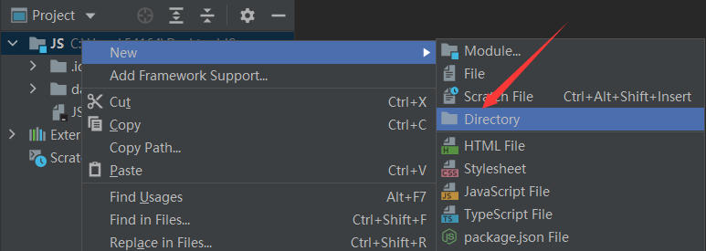

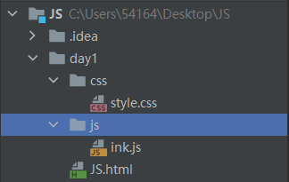

## 内部标签

`script`

JS代码写在`body`的最后

`<script type="javascript"></script>`不用定义`type`,默认是JS

```html
<body>
    <!-- script标签，写JS代码 -->
    <script>
        alert("hello world");
    </script>
</body>
```

## 外部引入

`<script src=""></script>`（不再是`link`）

```javascript
alert("hello world");
```

```html
<head>
    <meta charset="UTF-8">
    <title>Title</title>
    <script src="js/ink.js"></script>
</head>
```

# 基本语法

JavaScript**严格区分大小写**

JavaScript每个语句以**分号**结束，但是**JavaScript并不强制要求在每个语句的结尾加分号**

> 浏览器中负责执行JavaScript代码的引擎会自动在每个语句的结尾补上分号

## 定义变量

变量类型 变量名=变量值

**只有一种变量类型**`var`，所有定义都是`var`

> ES6中，局部变量用`let`定义

```javascript
var num = 1; // 变量名不能以数字或一些特殊符号开头
var 王者荣耀 = 倔强青铜;
```

## 条件控制

```javascript
if (condition){
	alert("1");
}
else if(){
    alert("2");
}
else{
    alert("3");
}
```

## alert

弹出（在控制台弹出变量时需要代码中有定义）

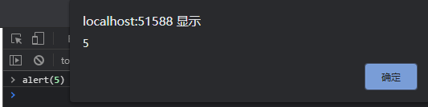

## console.log

在浏览器的控制台打印变量（代码中需有定义）

相当于`System.out.println()`

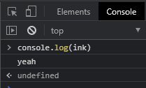

## 注释

- 单行注释：// + 空格
- 多行注释：/* */

# 数据类型

数值，文本，图形，音频，视频

## number

JavaScript**不区分浮点数和整数**，统一用`Number`表示

```javascript
// console控制台打印
123		// 整数
123.1 	// 浮点数
1.12e4	// 科学计数法
-99		// 负数
NaN		// not a number
Infinity	//无穷大
```

## 字符串

字符串是以单引号`'`或双引号`"`括起来的任意文本

```javascript
"abc"
'abc'
'\n'
```

## 数组[ ]

因为各种”类型“变量都是`var`，**所以数组中可以有各种“类型”**

```javascript
var arr = [1,2,3,"buaa",true,null]; //推荐[ ]
new Array(1,2,3,"buaa",true,null);
```

## 对象{ }

对象的内部属性是键值对`key-value`，每个属性用`，`隔开（最后一个不用）

对象的**键都是字符串类型**，**值可以是任意数据类型**

```javascript
var person = {
    name:"ink", 
    age:24,
    tags:["java","js"]
}
```

取对象值：


## 布尔值

`true` `false`

```javascript
console.log(2>1)
true
```

## 逻辑运算

```javascript
&& 	 // 与
|| 	 // 或
！ 	// 非
```

## 比较运算符

**不要使用`==`，使用`===`**

- `==`：会自动转换数据类型再比较
- `===`：不会自动转换数据类型，如果数据类型不一致，返回`false`，如果一致再比较

```javascript
=   // 赋值
==  // 等于(类型不同，值相同也会判断为true)   "1" = 1
=== // 绝对等于(类型，值都相同才会判断为true)
```

**NaN**

- **NaN和所有数值都不相等，包括自己**。

- 只能通过`isNaN`方法判断这个数是否是NaN

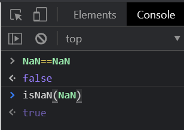

**浮点数比较**

- 尽量避免使用浮点数进行运算，会有精度问题
- 做差判断


## Null和undefined

- `Null`：表示一个“空”的值，它和`0`以及空字符串`''`不同
- `undefined`：表示**未定义**

# strict模式

**严格检查模式**

预防JavaScript随意性导致的安全问题，必须写在JavaScript的**第一行**

> ES6标准
>

```javascript
'use strict';
i = 1	// 局部变量用let定义，此时i会提示不规范
```

# 字符串

字符串：用`" "` `' '`包围，字符串不可变

字符串**长度**：`str.length`

## 转义字符

用`\`

​	`\'`

​	`\n`：换行

​	`\t`：制表符tab

```javascript
'use strict';
console.log('a\'');
console.log("a");
```


## 多行字符串

在**反引号``**之中即可（ESC下方）


```javascript
'use strict';
var str =`
    buaa
    nmb
    nlsde
`
alert(str)
```

## 模板字符串

要把多个字符串连接起来，可以用`+`号连接

ES6新增了模板字符串：`${变量}`

```javascript
'use strict';
let name = "ink";
let age = 24;
let msg = `你好,${name}`
console.log(msg)
```


# 数组

数组Array中可以有各种数据类型   

```javascript
// 一维数组,a[1]
var array = [1,2,3,4,"5","6"]
// 二维数组,a[1][1]
var array = [ [1,2],[3,4],["5","6"] ]
```

## 数组长度

`array.length`

注意：

数组长度`array.length`可以被赋值改变，此时数组也会发生变化

- 当数组变大时：用**未定义的empty**填充
- 当数组变小时，数组元素就会**丢失**

通过索引赋值时，索引超过了范围，同样会引起Array大小的变化：


## 数组遍历

- `for of` ：输出数组值
- `for in` ：输出数组索引

```javascript
'use strict';
var arr = [3,4,5];
for (let x of arr){
    console.log(x)	// 3,4,5
}
for (let x in arr){
    console.log(x) // 0,1,2
}
```

## 方法

- `indexOf()`：通过元素获取下标索引
- `slice()`：截取数组的一部分（**包括开始索引，不包括结束索引**），返回一个新的数组，类似`substring()`，不传递参数则复制数组
- `push()`：向**数组尾部**添加一个元素
- `pop()`：弹出数组**尾部元素**（最后一个元素）
- `unshift()`：向**数组头部**添加一个元素
- `shift()`：弹出数组**头部元素**（第一个元素）
- `sort()`：排序（直接修改当前数组）
- `reverse()`：反转数组
- `concat()`：**拼接数组**，返回一个新的数组（并不修改原数组）
- `join()`：使用特定字符拼接数组，返回一个字符串
- `splice()`：从指定的索引开始删除若干元素，然后再从该位置添加若干元素

# 对象

对象是一种**无序的集合数据类型**，它由若干**键值对**（内部属性）组成，每个键值对用`，`隔开（最后一个不用）

**属性名（key）必须是一个有效的变量名**，如果属性名包含特殊字符，就必须用`''`括起来：

```javascript
'use strict';
var person = {
    name:"ink",
    age:23,
    school:"buaa",
    position:"nmb"
    'middle-school': 'No.1 Middle School'
}
```

对象赋值

```javascript
person.name = "inkk"
```

注意：

使用不存在的对象属性，不会报错，会提示undefined


## 动态增删属性

JavaScript的对象是**动态类型**

- `delete`：删除一个属性
- 直接定义一个属性(即添加)


## 属性判断

注意：**所有键key都是字符串，值value是任意类型**

- 判断属性是否在这个对象中

  `"key" in 对象名`

  `in`判断一个属性存在，**这个属性不一定是对象的，它可能是地对象继承得到的**（父类对象的属性）

  > 所有对象最终都会在原型链上指向`object`

- 判断属性是否是这个对象**自身拥有**

  `hasOwnProperty()`方法


# 流程控制

## if判断

```javascript
'use strict';
var age = 5;
if(age>3){
    alert("hhh");
}
else if(age<3){
    alert("jjj")
}
else{
    alert("ggg")
}
```

## while循环

```javascript
'use strict';
var age = 5;
while(age<10){
    age = age + 1
}
alert(age)
```

## for循环

注意：for循环中定义的let局部变量出循环后就无效了

```javascript
'use strict';
var age = 5;
for (let i = 0; i < 10; i++) {
    age = age + 1;
    alert(age)
}
```

# Map，Set

ES6新特性

## Map

`Map`是一**组**键值对的结构

- `get()`
- `set()`：增加，**一个key只能对应一个value**，多次对一个key放入value，后面的值会把前面的值**冲掉**
- `delete()`：删除

```javascript
'use strict';
// 初始化Map需要一个二维数组,或者初始化一个空Map
var m = new Map(); 
var map = new Map([["tom",100],["jack",95]]);
var stu = map.get("tom");
map.set("admin",90);
map.delete("tom")
console.log(stu);
```

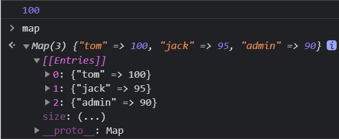

## Set

`Set`是一组key的集合，但不存储value。且在`Set`中，没有重复的key

> 无序！不重复！重复元素在`Set`中自动被过滤
>

- `add()`：增加，可以重复添加，但不会有效果
- `delete()`：删除元素
- `has()`：判断是否含有某个元素

```javascript
'use strict';
// 创建一个Set需要一个Array,或者直接创建一个空Set
var set = new Set([1,1,1,3]);
```

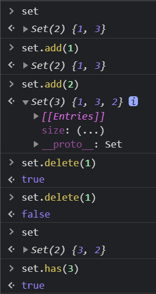

## iterator遍历

遍历`Map`和`Set`无法使用下标

ES6标准引入了新的`iterable`类型，`Array`、`Map`和`Set`都属于`iterable`类型

具有`iterable`类型的集合可以通过for of`循环来遍历

> `for in`实际遍历的是对象的属性名称。一个`Array`数组实际上也是一个对象，它的每个**元素的索引**被视为一个属性，所以会有bug

最好使用`iterable`内置的`forEach`方法，它接收一个函数，每次迭代就自动回调该函数

> `forEach()`方法是ES5.1标准引入

`Map`的回调函数参数依次为`value`、`key`和`map`

```javascript
var m = new Map([[1,'x'], [2,'y'], [3,'z']]);
m.forEach(function (value, key, map) {
    console.log(value);
});
```

# 函数

**方法**：面向对象（属性，方法）

**函数**：面向过程

## 函数定义

> 所有类型都一样`var`

`function`

- 执行到`return`结束
- 如果没有执行到`return`，函数会返回`undefined`（NaN）

```javascript
// 定义方式1
function abs(x){
    if (x>=0){
        return x;
    }
    else{
        return -x;
    }
}
// 定义方式2
// 这是一个匿名函数（函数=对象）
var abs = function(x){
    if (x>=0){
        return x;
    }
    else{
        return -x;
    }
}
```

## 调用函数

JavaScript可以传多个参数，也可以不传参数

```javascript
abs(10)
10
abs(-10)
10
```

### 不传参数

```javascript
// 添加判断，手动定义异常
if (typeof x !== 'number'){
    throw "Not a Number！"
}
```


### 传多个参数

**arguments**

> `arguments`是JavaScript免费赠送的一个关键字，包含传递进来的所有的参数(包括定义的参数)，是一个数组

```javascript
'use strict';
function abs(x){
    console.log("x=>"+x);
    for(let i = 0;i<arguments.length;i++){
        console.log(arguments[i]);
    }
    if (x>=0){
        return x;
    }
    else{
        return -x;
    }
}
```


**rest**

> rest包含传递进来的除定义参数外的所有的参数，是一个数组，用

```javascript
// ...rest 写在最后面
'use strict';
function test(a,b,...rest){
    console.log("a=>"+a);
    console.log("b=>"+b);
    console.log(rest);
}
```

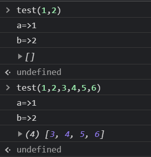

# 变量作用域

`var`定义的变量存在**作用域**

- 函数体内声明的变量在函数体外不可以使用
- 不同的函数使用相同的变量名，只要在函数内就不冲突
- 内部函数可以访问外部函数的成员变量，反之不行
- 函数查找变量从自身函数开始，由内向外查找（就近原则）

```javascript
// Uncaught ReferenceError: x is not defined
'use strict';
function a(){
    var x = 1;
    x = x + 1;
}
x = x+2

// 不同函数不冲突
function a(){
    var x = 1;
    x = x + 1;
}function b(){
    var x = 2;
}

// b()可以调用a中的x,但是a不能调用b中的y
function a(){
    var x = 1;
    function b(){
        var y = x + 1;
        console.log(y);
    }
    b();
}
a();
```

## 提升变量作用域

> JavaScript执行引擎会自动把y的声明提前，但不会赋值

```javascript
// x undefined,说明y定义了但未赋值
'use strict';
function a(){
    var x = "x" + y;
    console.log(x);
    var y = "y";
}
a();
// 等价写法
function a(){
    var y;
    var x = "x" + y;
    console.log(x);
    y = "y";
}
```

## 全局变量

> 默认所有的全局变量都会自动绑定在window对象下
>
> alert()本身也是window变量

即JavaScript只有一个全局作用域。任何变量（包括定义的函数）在没有函数作用范围找到时，就会向外查找，最终查找到window。如果window也没找到，就会报错。

```javascript
'use strict';
var x = 1;
function a(){
    console.log(x);
}
a();
console.log(x); // 输出1 1
// window对象
'use strict';
var x = 1;
alert(x);
alert(window.x);
```

> 由于所有的全局变量都会自动绑定在window对象下，那么多个JavaScript文件如果使用了相同的全局变量，就会冲突

解决方法：`jQuery` `$`

定义唯一全局变量，把自己的代码全部放入自己定义的唯一空间名中

```javascript
'use strict';
// 唯一全局变量
var all = {};
// 定义全局变量
all.name = 'ink';
all.add = function (a,b){
    return a+b;
}
```

## 局部变量

ES6新特性：`let`定义局部变量

## 常量const

ES6之前：全部由大写字母命令的变量就是常量（其实可以改变）

ES6引入`const`

```javascript
'use strict';
const PI = 3.14;
console.log(PI);
PI = 3.1415 // Uncaught TypeError
```

# 方法

## 定义方法

 对象内部的函数就是方法（对象{属性，方法}）

```javascript
// 属性:person.name
// 方法:person.age()
'use strict';
var person = {
    name:'ink',
    birth:1997,
    // 方法
    age:function (){
        let now = new Date().getFullYear();
        return now - this.birth; //this代表当前对象
    }
}
```

## this

> Java中`this`是无法指向的，默认指向调用它的人

单独调用`getAge()`，`this`就会调用`window`对象

```javascript
function getAge(){
    let now = new Date().getFullYear();
    return now - this.birth;
}
var person = {
    name:'ink',
    birth:1997,
    age:getAge
}
```

## apply

JavaScript中可以控制this的指向

所有函数都有`apply`的属性

`apply()`有2个参数：

- `thisArg`：指向的对象
- `argArray`：函数参数

```javascript
'use strict';
function getAge(){
    let now = new Date().getFullYear();
    return now - this.birth;
}
var person = {
    name:'ink',
    birth:1997,
    age:getAge
}
```

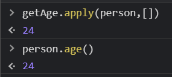

# 内部对象

## 标准对象


## Date

```javascript
var now=new Date();
// 方法
now.getFullYear();	// 年
now.getMonth();		// 月(0~11)
now.getDate();		// 日
now.getDay(); 		// 星期
now.getTime(); 		// 时间戳,全世界唯一

// 返回时间
console.log(new Date(时间戳)) 

// 返回本地时间(调用方法)
now.toLocalString()
```

## JSON

### **JavaScript Object Notation**

json是一种轻量级的**数据交换格式**，**层次结构**简洁清晰，易于阅读编写，易于机器解析和生成，可以有效提升网络传输效率。

在JavaScript中一切皆对象（定义一个函数function，它也是一个对象），**任何JavaScript支持的类型都可以用JSON表示**

> 早期数据传输习惯使用xml文件（重量级）
>
> BSON（Binary JSON）也是一种计算机数据交换格式，主要用于MongDB数据库，是一种二进制表示形式。

### 格式

- 对象都用{ }
- 数组都用[ ]
- 所有键值对都是用key：value

```javascript
'use strict';
var person = {
    name:"ink",
    age:23,
    school:"buaa",
    position:"nmb"
}
```

### 转换

JSON字符串<—>JavaScript对象

- JSON：格式化的字符串（内" " ,  外' '）

              ```javascript
  '{"name": "ink", "age": 23, "school": "buaa"}'
              ```

- 对象：键值对形式

  ```javascript
  name: "ink", age: 23, school: "buaa"
  ```

```javascript
'use strict';
// 逗号隔开(最后一个不用)
var person = {
    name:"ink",
    age:23,
    school:"buaa"
}
// 对象转换为json字符串
var jsonuser = JSON.stringify()

// json字符串转换为对象
// 注意：json字符串用"",外面就得用''
var obj = JSON.parse('{"name": "ink", "age": 23, "school": "buaa"}')
```

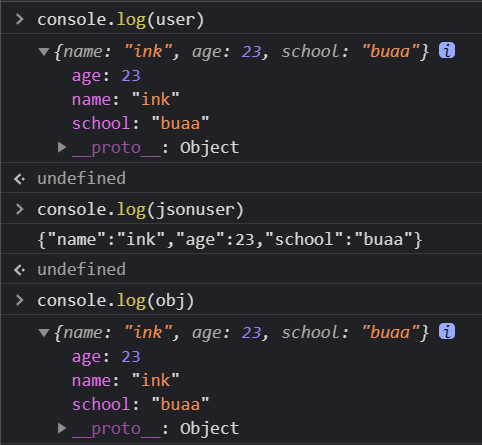

# 面向对象

一般的面向对象，Java，C++

- 类：模板（抽象）
- 对象：实例（具体表现）

**在JavaScript中有些不同**

- 原型继承

  ```javascript
  // ink对象的原型是user对象
  ink.__proto__ = user
  ```

- class继承

  > class关键字是在ES6引入
  >
  > 本质还是查看对象原型

  ```javascript
  //定义类
  class user{
      // 构造器
      constructor(name){
          this.name = name;
      }
      hello(){
          alert('hello')
      }
  }
  var ink = new user("ink");
  
  // 继承
  class miniuser extends user{
      constructor(name,age){
          // 实现父类方法
          super(name);
          this.age = age;
      }
      myage(){
          alert(this.age);
      }
  }
  var youyu = new miniuser("ink",23);
  ```

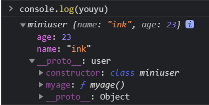

> 原型链：
>
> JavaScript中，每个函数都有一个prototype属性，这个属性指向函数的**原型对象**

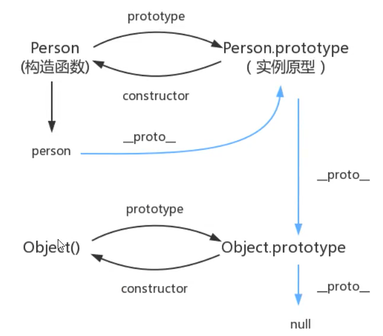

# BOM

浏览器对象模型BrowserObjectModel

> JavaScript就是为了让它在浏览器中运行（操作浏览器）

## 浏览器内核

- IE 6-12
- Chrom
- FireFox
- Safari

## BOM对象

- window：代表浏览器窗口
- Navigator：封装了浏览器的信息（可被人为修改，不建议使用）
- screen：代表全屏幕属性
- location：代表当前页面url信息（可被重定向）
- document：代表当前页面（可以获取具体的文档树节点，cookie）
- history：代表浏览器的历史记录（back后退，forward前进）

# DOM

文档对象模型`DocumentObjectModel`

> 整个浏览器网页就是一棵DOM树

操作**(需要先获得节点)**

- **更新DOM节点**
- **遍历DOM节点**
- **删除DOM节点**
- **添加DOM节点**

## 获得DOM节点

依靠css选择器，`document.getElementById`和`document.getElementsBy...`

> 因为id是唯一的，而ClassTame和TagName是会有相同的。所以一个是`getElement`，一个是`getElements`。
>
> `getElementById`返回一个dom对象，可以直接操作。`getElementsByClassName`返回一个dom数组，就要通过索引操作dom对象。

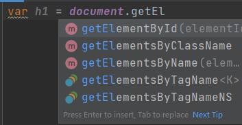

原生代码，后面使用`JQuery`

```html
<body>
<div id = "div">
    <h1 class="h1">标题一</h1>
    <p class="p1">p1</p>
    <p id="p2">p2</p>
</div>
<script src="js/ink.js"></script>
</body>
```

```javascript
var di = document.getElementById("div");
var p = document.getElementsByTagName("p");
var h1 = document.getElementsByClassName("h1");
var p1 = document.getElementsByClassName("p1");
var p2 = document.getElementById("p2");
var dc = div.children;
```

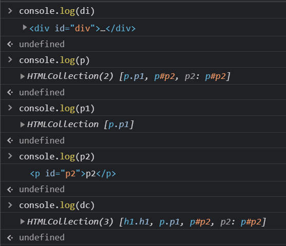

## 更新DOM节点

### 操作文本

- 修改Text文本值`innerText `

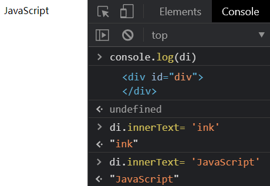

- 解析HTML文本标签`innerHTML`

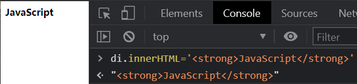

### 操作CSS

- 属性使用字符串（"red"）
- 驼峰命名（fontSize）

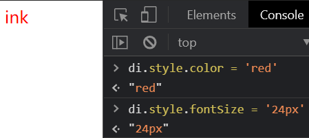

## 删除DOM节点

步骤：

1. 获取删除目标节点的**父节点**`parentElement`
2. 通过父节点删除目标节点

```javascript
var self = document.getElementById("p2");
var father = self.parentElement;
father.removeChild(self)
```

注意：

- `removeChild`要求是dom对象，所以id选择的可以直接操作,如果是class数组,就要写成p1[0]形式
- 删除多个数组节点的时候，dom对象数组是在动态变化的，下标一定要注意（比如3个节点，删了一个后，再用索引2就会报错）

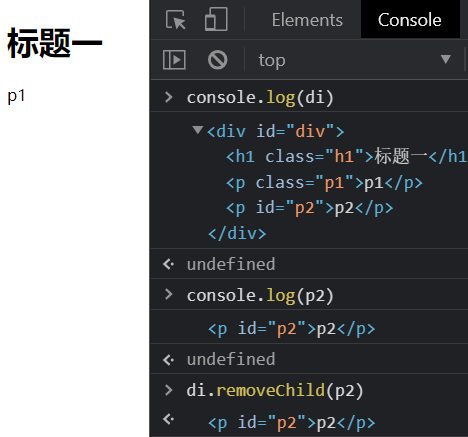

## 插入DOM节点

`innerText` 和`innerHTML`只适用于向**空**的dom节点中添加元素，**如果节点中存在元素，就会被覆盖**

- 创建节点：`createElement(tagName)`
- **追加**节点：
  - `append()`
  - `appendChild()`
  - `insertBefore(newNode,targetNode)`
- 设置属性：`setAttribute('key','value')`

```html
<body>
<p id="js">JavaScript</p>
<div id = "div">
    <p id="se">javase</p>
    <p id="ee">javaee</p>
    <p id="me">javame</p>
</div>
<script src="js/ink.js"></script>
</body>
```

```javascript
// 创建p标签
var n = document.createElement("p");
// 设置p标签的id属性
// 等价写法setAttribute('id','n');
n.id = n;
n.innerText = "Create new dom"
var js = document.getElementById("js");
var div = document.getElementById("div");
div.append(js);
div.appendChild(n);

// 创建script标签节点
var myscript = document.createElement('script');
//设置标签属性,相当于<script type="text/javascript"></script>
myscript.setAttribute('type',`text/javascript`);
div.appendChild(myscript);

// TagName返回的是一个dom数组
var body = document.getElementsByTagName('body')[0];
body.style.backgroundColor = '#319981';
```

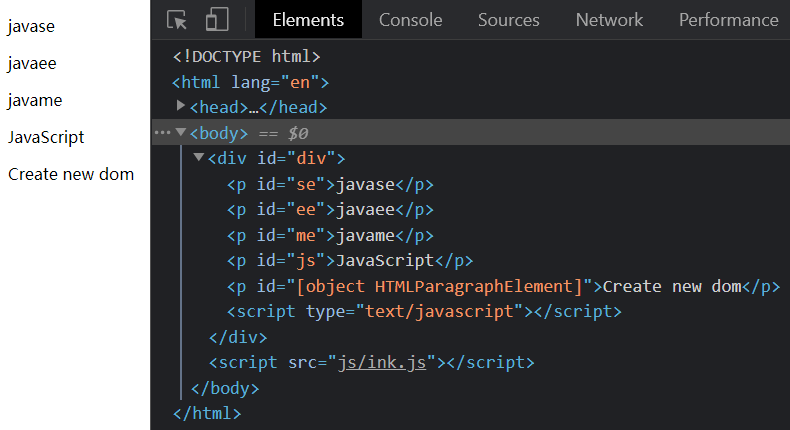

# 表单

> 在前端验证

表单`form`也是DOM树中的一个节点，用来**提交信息**

常见表单：

1. 文本框：input（text）
2. 下拉框：select
3. 多选框：input（checkbox）
4. 隐藏域：hidden
5. 密码框：input（password）

## 操作表单

```html
<body>
    <form action="#", method="post">
        <p>
            <span>用户名:</span> <input type="text", id="username">
        </p>

        <p>
            <span>性别:</span>
            <input type="radio", name="sex", value="man">男
            <input type="radio", name="sex", value="woman">女
        </p>

    </form>
    <script src="js/ink.js" ></script>
</body>
```

```javascript
// 获取输入框中的内容
var username = document.getElementById('username');
// 设置输入框中的内容
username.value = 'inkeee';

var sex = document.getElementsByTagName('input')[2]
```

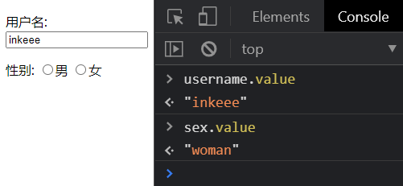


## 表单提交和验证

**正常代码，提交信息会被暴露**

```html
<body>
    <form action="post">
        <p>
            <span>用户名:</span> <input type="text", id="username", name= "username">
        </p>
        <p>
            <span>密码: </span> <input type="password", id="password", name= "password">
        </p>
        <!-- 绑定事件,onclick被点击时触发事件-->
        <button type="submit", onclick="f()">提交</button>

    </form>
    <script src="js/ink.js" ></script>
</body>
```

```javascript
function f() {
    alert("提交成功")
    var username = document.getElementById('username');
    var password = document.getElementById('password');
    console.log(username.value);
    console.log(password.value);
}
```

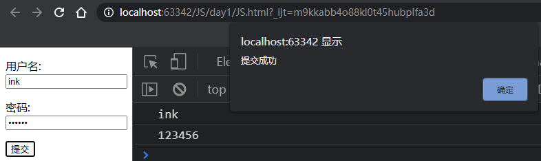

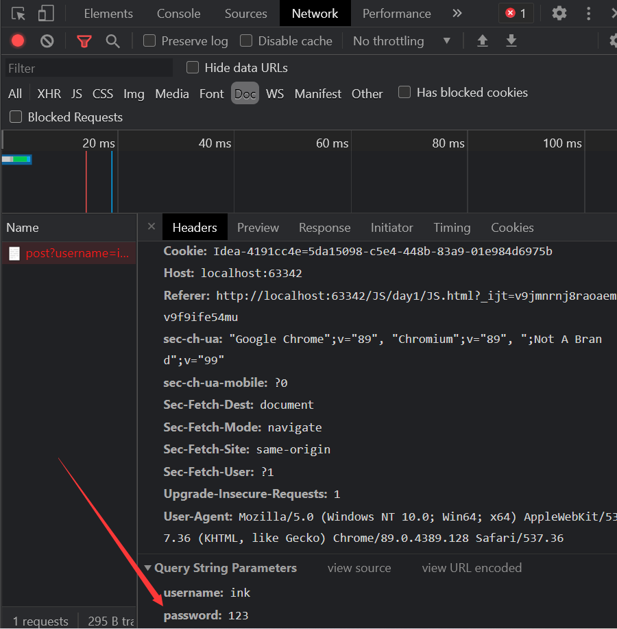


**MD5加密，密码被加密**

> MD5工具类：
>
> https://cdn.bootcss.com/blueimp-md5/2.10.0/js/md5.min.js

```html
<!DOCTYPE html>
<html lang="en">
<head>
    <meta charset="UTF-8">
    <title>Title</title>
    <link rel="stylesheet" href="css/style.css">
    <!-- MD5工具类-->
    <script src="https://cdn.bootcss.com/blueimp-md5/2.10.0/js/md5.min.js" ></script>
</head>
<body>
    <form action="post">
        <p>
            <span>用户名:</span> <input type="text", id="username", name= "username">
        </p>
        <p>
            <span>密码: </span> <input type="password", id="password", name= "password">
        </p>
        <!-- 绑定事件,onclick被点击时触发事件-->
        <button type="submit", onclick="f()">提交</button>

    </form>
    <script src="js/ink.js" ></script>
</body>
</html>
```

```javascript
function f() {
    alert("提交成功")
    var username = document.getElementById('username');
    var password = document.getElementById('password');
    console.log(username.value);
    console.log(password.value);
    // MD5加密算法
    password.value = md5(password.value);
    console.log(password.value);
}
```

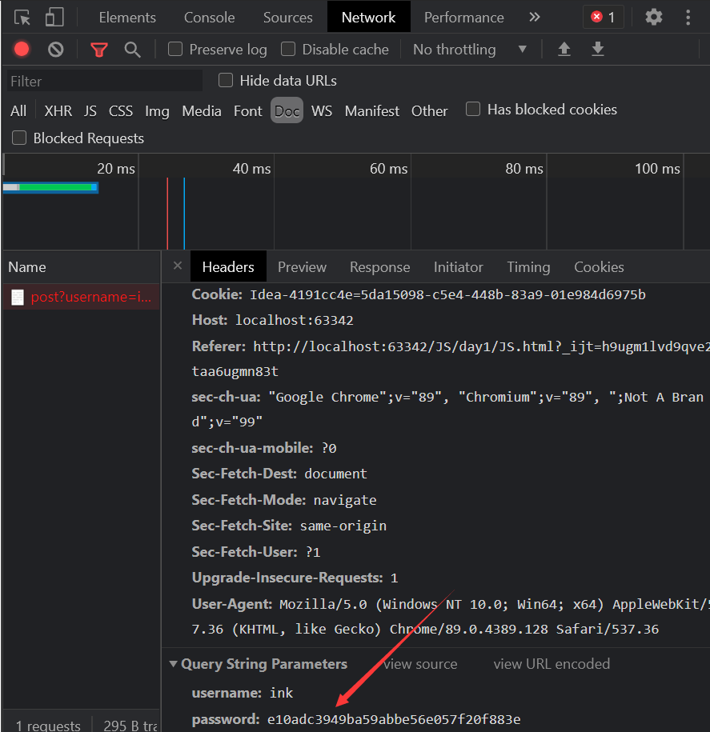


**表单优化，隐藏原始密码**

```html
<body>
    <form action="post">
        <p>
            <span>用户名:</span> <input type="text", id="username", name= "username">
        </p>
        <p>
            <span>密码: </span> <input type="password", id="input-password">
        </p>
        <input type="hidden", id="md5-password", name="password">
        <!-- 绑定事件,onclick被点击时触发事件-->
        <button type="submit", onclick="f()">提交</button>

    </form>
    <script src="js/ink.js" ></script>
</body>
```

```javascript
function f() {
    alert("提交成功")
    var username = document.getElementById('username');
    var password = document.getElementById('password');
    var md5password = document.getElementById('md5-password');
    // 隐藏password
    md5password.value = md5(password.value);
    console.log(md5password.value);
}
```

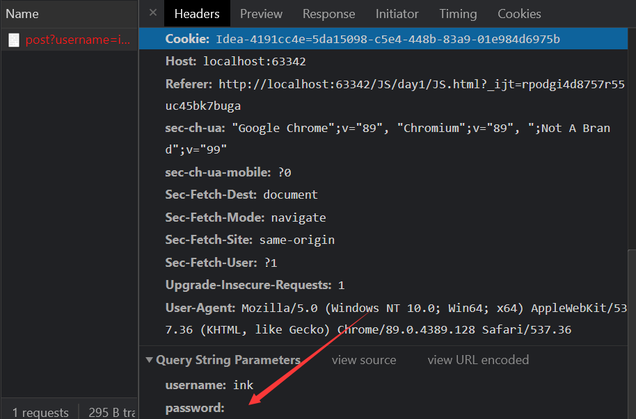


# jQuery

**jQuery库**：里面有大量封装好的JavaScript函数

`$`：代表jQuery

> 浏览器本身处理DOM也是有性能瓶颈的，尤其是在传统开发中，用JQuery或者原生的JavaScript DOM操作函数对DOM进行频繁操作的时候，**浏览器要不停的渲染新的DOM树**，导致页面看起来非常卡顿。

## 获取jQuery

1. 官网下载

   > jQuery官网：https://jquery.com/

   点开**保存**（ctrl+s）到项目`lib`目录下

   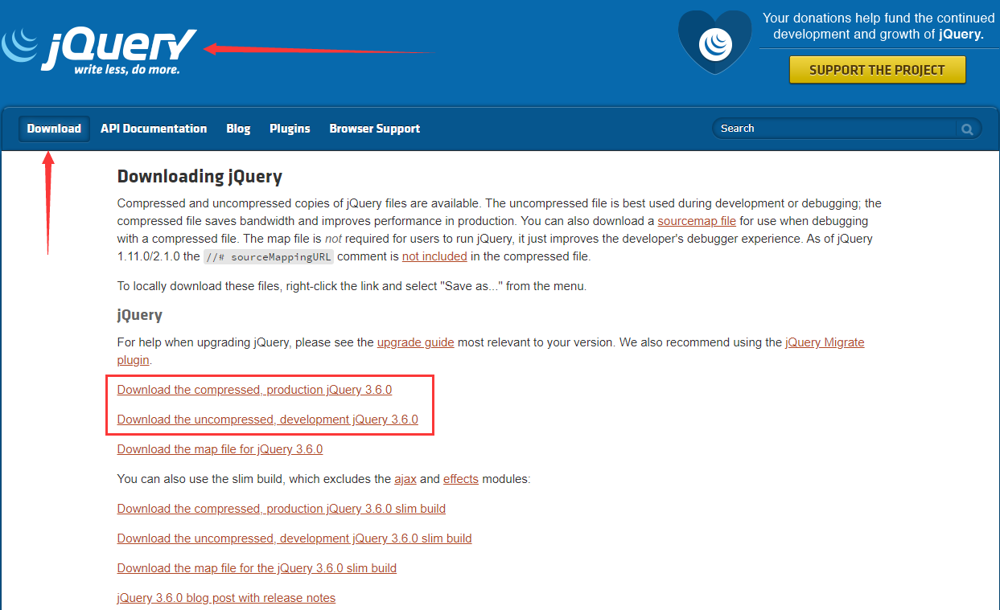

   ```html
   <body>
   <script src="lib/jquery-3.6.0.js"></script>
   </body>
   ```

2. 搜索**cdn jquery**

   复制所需要的jQuery版本的`script`标签即可

   https://www.bootcdn.cn/jquery/

   https://www.jq22.com/cdn/

   ```html
   <body>
   <!--cdn绑定-->
   <script src="https://cdn.bootcdn.net/ajax/libs/jquery/3.6.0/jquery.js"></script>
   </body>
   ```


## jQuery公式

**选择器+事件**

`$(selector).action()`

> selector：CSS中的选择器


```html
<body>
<a href="", id="test-jQuery">点击</a>
<script src="lib/jquery-3.6.0.js"></script>
<script src="js/jQ.js"></script>
</body>
```

```javascript
// JavaScript正常写法
// var a = document.getElementById('test-jQuery');
// id.click(function ());

// jQuery写法
// CSS id选择器#
$('#test-jQuery').click(function (){
    alert('Hello jQuery');
})
```

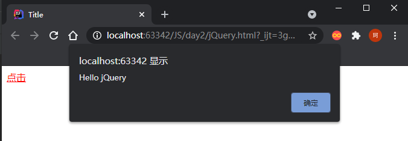


## jQuery选择器

**原生JavaScript**

- 标签选择器：`document.getElementsByTagName()`
- id选择器：`document.getElementById()`
- 类选择器：`document.getElementsByTagName()`

**jQuery**：能用CSS的所有选择器

- 标签选择器：`$('p').click()`
- id选择器：`$('#id').click()`
- 类选择器：`$('.class').click()`

> jQuery API文档：https://jquery.cuishifeng.cn/

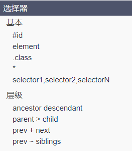

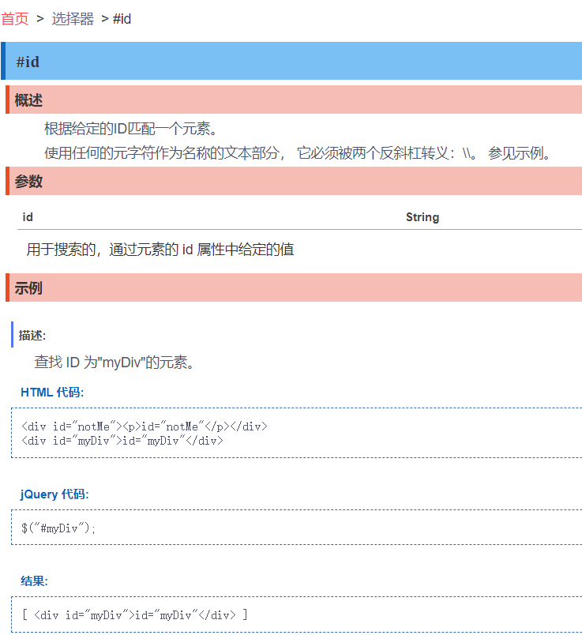


## jQuery事件

- 鼠标事件
- 键盘事件
- 其他事件

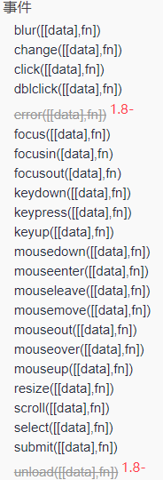


### 页面载入

**ready(fn)**

> ```javascript
> // 当网页元素加载完毕之后响应事件
> // 原始完整写法
> // $(document).ready(function (){
> //
> // })
> // 简便写法 $()
> ```

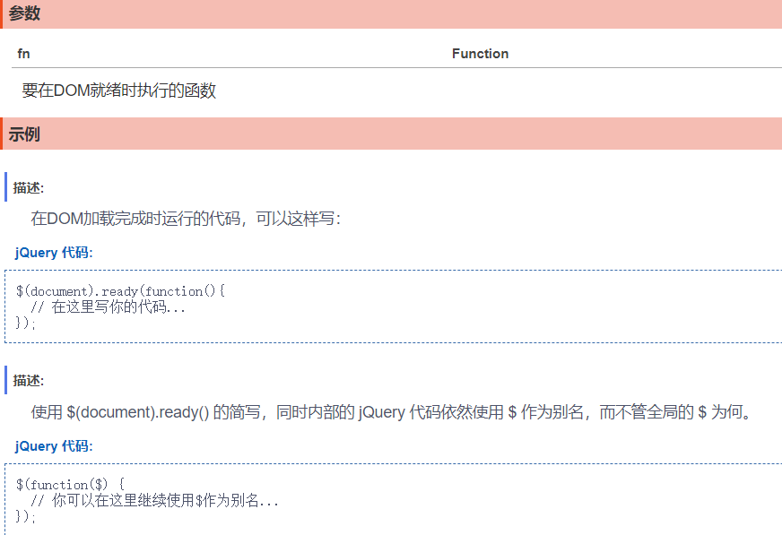


### 鼠标事件

`mouse`

- 按下
- 移动

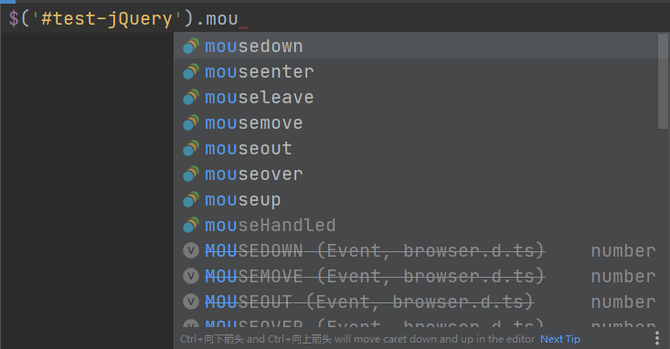


**获取鼠标当前坐标**

```html
<body>
mouse: <span id="mouseMove"></span>
<div id="divMove">
    在这里移动鼠标
</div>
    
<script src="lib/jquery-3.6.0.js"></script>
<script src="js/jQ.js"></script>
</body>
```

```css
#divMove{
    width: 200px;
    height: 200px;
    border: 1px solid red;
}
```

```javascript
$(function (){
    $('#divMove').mousemove(function (e){
        $('#mouseMove').text('x: '+e.pageX+' '+'y: '+e.pageY);
    })
})
```

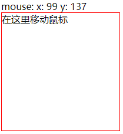


## jQuery操作DOM

### DOM节点文本操作

```javascript
// 获得dom中内容
$('#test-ul li[name = python]').text();

// 设置dom中内容
$('#test-ul li[name = python]').text('设置内容');

$('#test-ul li[class = JavaScript]').html('<strong>JavaScript</strong>');
```

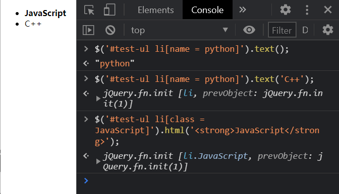


### DOM节点CSS操作

传入**键值对**

> API文档

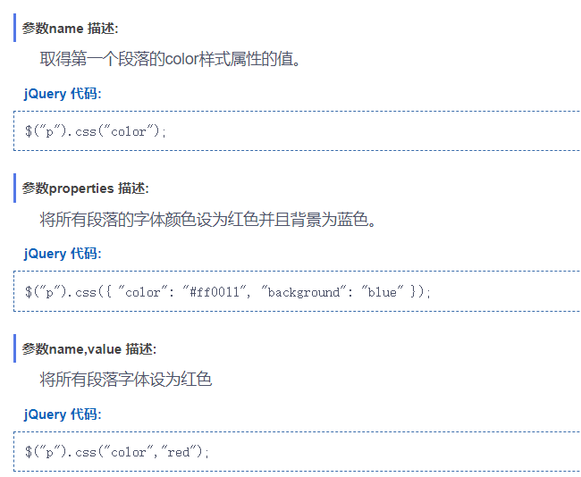

```javascript
$('#test-ul li[name = python]').css({ "color": "#ff0011", "background": "blue" });
```

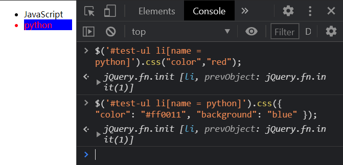


### DOM元素操作

元素的显示和隐藏

本质：`display：none`

```javascript
// 显示
$('#test-ul li[name = python]').show();
$(window).width();

// 隐藏
$('#test-ul li[name = python]').hide();
```


### Ajax