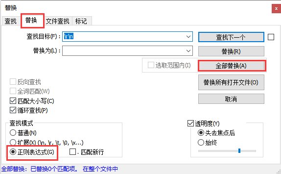
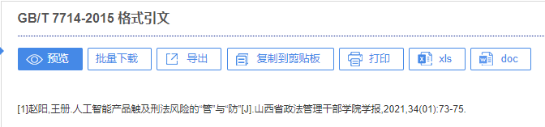

# Notepad++ 

## 去空格

空格：\s

`Crtl + F` 打开替换框，进行如下所示的操作

## 去换行

视图—显示符号—显示行尾符

- windows：行尾符是CR LF—对应的正则表达式是\r\n
- mac：行尾符是CR—对应的正则表达式是\r
- unix：行尾符是LF—对应的正则表达式是\n。

查找目标：\r\n，替换为：空

# 知网

## 快速导出参考文献

