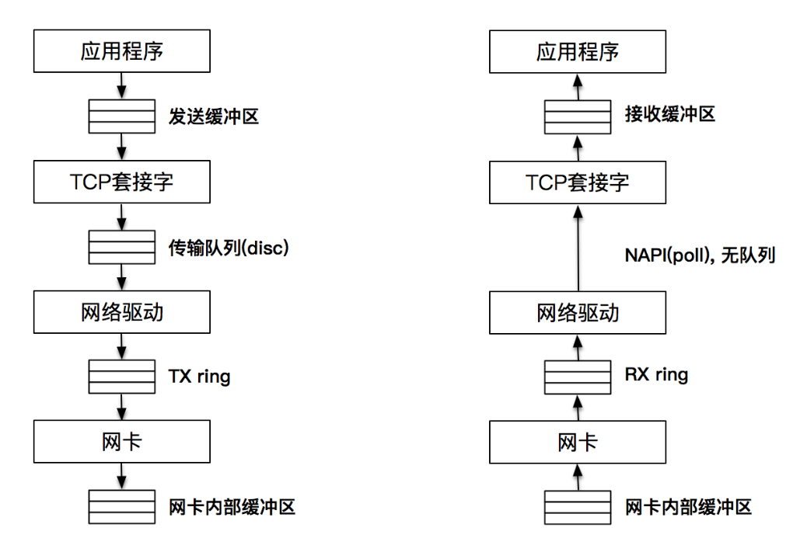

# 网络基础

## 端口

端口号是一个 16 位的整数，最多为 65536

当一个客户端发起连接请求时，客户端的端口是由操作系统内核临时分配的，称为临时端口

> 一般大于 5000 的端口可以作为应用程序的端口使用

## 连接

一个连接可以通过客户端 - 服务器端的 IP 和端口唯一确定，这叫做套接字对，

套接字的四元组表示：`（clientaddr:clientport, serveraddr: serverport)`

## DNS

全球域名按照从大到小的结构，形成了一棵树状结构

实际访问一个域名时，**是从最底层开始写起**，例如 www.google.com，www.tinghua.edu.cn等


## TCP/UDP

TCP，又被叫做**字节流套接字**（Stream Socket）

- Stream sockets 是可靠的，双向连接的通讯串流

UDP，又被叫做**数据报套接字**（Datagram Socket），Datagram Sockets 有时称为**无连接的 sockets**（connectionless sockets）

- 使用 UDP 的原因，第一是速度，第二还是速度
- 广播或多播（向网络中的多个节点同时发送信息），选择 UDP 是非常合适的

> 一般分别以`SOCK_STREAM`与`SOCK_DGRAM`分别来表示 TCP 和 UDP 套接字

# Socket

`socket`：**套接字**，有的时候也叫做**套接口**

- socket 是用来建立连接，传输数据的**唯一途径**
- 一切皆文件，**socket也是文件**

## 数据传输

1. 在客户端发起连接请求之前，服务器端必须初始化好
   1. 服务器端首先初始化（创建）一个 socket
   2. 之后服务器端需要执行 `bind` 函数，将自己的服务能力（应用程序）绑定在一个众所周知的地址和端口上
   3. 然后服务器端执行 `listen` 操作，将原先的 socket 转化为服务端的 socket
   4. 服务端最后**阻塞**在 `accept` 上等待客户端请求的到来
2. 客户端需要先初始化 socket，再执行 `connect` 向服务器端的地址和端口发起连接请求，这里的**地址和端口必须是客户端预先知晓的**
3. 客户端和服务器端建立连接后就进入了数据传输过程
   1. 客户端进程向**操作系统内核**发起 `write` 字节流写操作
   2. 内核协议栈将字节流通过网络设备传输到服务器端
   3. 服务器端从内核得到信息，将字节流从内核读入到进程中，并开始业务逻辑的处理
   4. 完成之后，服务器端再将得到的结果以同样的方式写给客户端
4. 客户端完成和服务器端的交互后，需要和服务器端断开连接时，就会执行 `close` 函数
   1. 客户端的操作系统内核此时会通过原先的连接链路**向服务器端发送一个 FIN 包**
   2. 服务器收到之后**执行被动关闭**，这时候整个链路处于**半关闭状态**，即客户端不会再像服务器传递数据，但服务器还可以继续向客户端发送数据
   3. 当服务器发送完全部数据后后，服务器端也会执行 `close` 函数，整个链路才会真正关闭

> 一旦连接建立，数据的传输就不再是单向的，而是双向的，这也是 TCP 的一个显著特性
>
> 半关闭的状态下，发起 close 请求的一方在没有收到对方 FIN 包之前都认为连接是正常的，而在全关闭的状态下，双方都感知连接已经关闭


## 套接字的**通用**地址结构

`sockaddr`

- 第一个字段`sa_family`是地址族，它表示使用什么样的方式对地址进行解释和保存，地址族在 glibc 里的定义非常多，常用的有以下几种
  - `AF_LOCAL`：表示的是本地地址，对应的是 Unix 套接字，这种情况一般用于本地 socket 通信，很多情况下也可以写成 `AF_UNIX`、`AF_FIL`
  - `AF_INET`：因特网使用的 IPv4 地址
  - `AF_INET6`：因特网使用的 IPv6 地址

> `AF_` 表示的含义是 Address Family，但是很多情况下，我们也会看到以 `PF_` 表示的宏，`PF_` 的意思是 Protocol Family，也就是协议族的意思

```c
/* POSIX.1g 规范规定了地址族为 2 字节的值.  */
typedef unsigned short int sa_family_t;

/* 描述通用套接字地址  */
struct sockaddr{
    sa_family_t sa_family;  /* 地址族.  16-bit*/
    char sa_data[14];   	/* 具体的地址值 112-bit */
  }; 
```

## IPV4套接字

- `uint32_t`：**用 `typedef` 定义的无符号 `int` 型宏定义**

  - u：代表 `unsigned`，即无符号，定义的变量不能为负数

  - int：代表类型为 `int` 整形

  - 32：代表四个字节，即为 `int` 类型

  - _t：代表用 `typedef` 定义的

- `sin_family`：对于 IPv4 来说这个值就是 `AF_INET`
- 

```c
/* IPV4 套接字地址，32bit 值.  */
typedef uint32_t in_addr_t;
struct in_addr
  {
    in_addr_t s_addr;
  };
  
/* 描述 IPV4 的套接字地址格式  */
struct sockaddr_in
  {
    sa_family_t sin_family; 	/* 16-bit */
    in_port_t sin_port;     	/* 端口口  16-bit*/
    struct in_addr sin_addr;    /* Internet address. 32-bit */
 
 
    /* 这里仅仅用作占位符，不做实际用处  */
    unsigned char sin_zero[8];
  };
```

# 服务端准备连接

## 初始化套接字

### 创建套接字

- `domain`：指 PF_INET、PF_INET6 以及 PF_LOCAL 等，表示什么样的套接字
- `type`
  - `SOCK_STREAM`: 表示的是字节流，对应 TCP
  - `SOCK_DGRAM`： 表示的是数据报，对应 UDP
  - `SOCK_RAW`: 表示的是原始套接字

```c
int socket(int domain, int type, int protocol)
```

### bind

调用 `bind` 函数把**套接字和套接字地址绑定**

- `fd`：socket也是一个文件，用`fd`来指代
- `sockaddr * addr`：套接字的通用地址
  - 实际上传入的参数可能是 IPv4、IPv6 或者本地套接字格式
  - `bind` 函数会根据 `len` 字段判断传入 addr 该怎么解析
- `len`：表示的就是传入的地址长度，它是一个可变值

```c
// bind(int fd, void * addr, socklen_t len)
bind(int fd, sockaddr * addr, socklen_t len)
```

**地址转换**

由于参数是套接字的通用地址格式，所以使用者需要将 IPv4、IPv6 或者本地套接字格式转化为通用套接字格式

```c
struct sockaddr_in name;
bind (sock, (struct sockaddr *) &name, sizeof (name)
```

### 设置地址和端口

- 使用 `INADDR_ANY` 来完成通配地址的设置

```c
struct sockaddr_in name;
name.sin_addr.s_addr = htonl (INADDR_ANY); /* IPV4 通配地址 */
```

### demo

```c
#include <stdio.h>
#include <stdlib.h>
#include <sys/socket.h>
#include <netinet/in.h>
 
int make_socket (uint16_t port)
{
    int sock;
    struct sockaddr_in name;

    /* 创建字节流类型的 IPV4 socket. */
    sock = socket (PF_INET, SOCK_STREAM, 0);
    if (sock < 0)
    {
        perror ("socket");
        exit (EXIT_FAILURE);
    }
    
    // 创建成功再绑定
      
    /* 绑定到 port 和 ip. */
    name.sin_family = AF_INET;	 	/* IPV4 */
    name.sin_port = htons (port);  	/* 指定端口 */
    name.sin_addr.s_addr = htonl (INADDR_ANY); /* 通配地址 */

    /* 把 IPV4 地址转换成通用地址格式，同时传递长度 */
    if (bind (sock, (struct sockaddr *) &name, sizeof (name)) < 0)
    {
        perror ("bind");
        exit (EXIT_FAILURE);
    }

    return sock
}
```

## listen

初始化创建的套接字，可以认为是一个**"主动"套接字，其目的是之后主动发起请求**（通过调用 `connect` 函数）

通过 `listen` 函数，可以**将原来的"主动"套接字转换为"被动"套接字**，告诉操作系统内核这个套接字是用来**等待用户请求的**

- 操作系统内核会为此做好接收用户请求的一切准备，比如完成连接队列
- `socketfd`：套接字描述符
- `backlog`：在 Linux 中表示已完成（`ESTABLISHED`）且未 `accept` 的队列大小，这个参数的大小决定了可以接收的并发数目
  - 这个参数越大，并发数目理论上也会越大，但是参数过大也会占用过多的系统资源，一些系统，比如 Linux 并不允许对这个参数进行改变

```c
int listen (int socketfd, int backlog)
```

## accept

当客户端的连接请求到达时，服务器端应答成功，连接建立，这个时候操作系统内核需要**把这个事件通知到应用程序，并让应用程序感知到这个连接**

`accept` 函数就是连接建立之后操作系统内核和应用程序之间的桥梁

- `listensockfd`：套接字，可以称它为 listen 套接字，这就是前面通过 bind，listen 一系列操作而得到的套接字
- `accept` 函数的返回值有两个部分
  - 第一个部分 `cliaddr` 是通过指针方式获取的**客户端的地址**，`addrlen` 表示地址的大小
  - 另一个部分是一个**全新的套接字**，代表了与客户端的连接

```c
int accept(int listensockfd, struct sockaddr *cliaddr, socklen_t *addrlen)
```

### 返回套接字

`accept` 函数会返回一个全新的套接字，这个套接字不是输入的参数（监听套接字 `listensockfd`）

**为什么要使用2个套接字？**

- `listensockfd`这个套接字是用来监听和处理客户端请求的，是要为成千上万的客户来服务的，所以这个监听套接字一直都存在，直到关闭
- 而一旦有一个客户和服务器完成了 TCP 三次握手，连接成功，操作系统内核就为这个客户生成一个**新的**已连接套接字，让应用服务器使用这个**已连接套接字**和客户进行通信处理
- 如果应用服务器完成了对这个客户的服务，那么就可以关闭这个**已连接套接字**，完成 TCP 连接的释放
- 这个时候释放的**只是这一个客户连接，其它被服务的客户连接可能还存在**

# 客户端发起连接

## 初始化套接字

和服务端一样，**创建一个"主动"套接字**

## connect

客户端需要调用 `connect` 函数向服务端发起请求

- `sockfd`：初始化的连接套接字
- `servaddr`：指向**服务器套接字地址结构**的指针，套接字地址结构必须含有服务器的 IP 地址和端口号

> 客户在调用 `connect` 函数前不必非得调用 `bind` 函数，因为如果需要的话，操作系统内核会确定源 IP 地址，并按照一定的算法选择一个临时端口作为源端口

```c
int connect(int sockfd, const struct sockaddr *servaddr, socklen_t addrlen)
```

## TCP连接

### 阻塞IO

目前使用的网络编程模型都是阻塞式

- 服务器端通过 socket，bind 和 listen 完成了被动套接字的准备工作，然后调用 accept，阻塞在这里，等待客户端的连接来临
- 客户端通过调用 socket 和 connect 函数之后，也会阻塞


### TCP三次握手

如果是 TCP 套接字，那么调用 `connect` 函数就会激发 TCP 的三次握手过程，并且仅在连接建立成功或出错时才返回

#### 握手过程

1. 客户端的协议栈向服务器端发送了 SYN 包，并告诉服务器端当前发送序列号 `j`，**客户端进入 `SYNC_SENT` 状态**
2. 服务器端的协议栈收到这个包之后，和客户端进行 ACK 应答，应答的值为 `j+1`，表示对 SYN 包 `j` 的确认，同时服务器也发送一个 SYN 包，告诉客户端当前我的发送序列号为 `k`，**服务器端进入 `SYNC_RCVD` 状态**
3. 客户端协议栈收到 ACK 之后，使得**应用程序从 `connect` 调用返回，表示客户端到服务器端的单向连接建立成功**，客户端的状态为 `ESTABLISHED`，同时客户端协议栈也会对服务器端的 SYN 包进行应答，应答数据为 `k+1`
4. 客户端的应答包到达服务器端后，服务器端协议栈**使得 `accept` 阻塞调用返回**，这个时候**服务器端到客户端的单向连接也建立成功**，服务器端也进入 `ESTABLISHED` 状态

#### 错误返回

**出错返回**可能有以下几种情况

- **三次握手无法建立**，客户端发出的 SYN 包没有任何响应，于是返回 `TIMEOUT` 错误
  - 这种情况比较常见的原因是对应的**服务端 IP 写错**
- **客户端收到了 RST（复位）回答**，这时候客户端会立即返回 `CONNECTION REFUSED` 错误
  - 这种情况比较常见于客户端发送连接请求时的**请求端口写错**
  - 因为 RST 是 TCP 在发生错误时发送的一种 TCP 分节，产生 RST 的三个条件是
    - 目的地为某端口的 SYN 到达，然而该端口上没有正在监听的服务器
    - TCP 想取消一个已有连接
    - TCP 接收到一个根本不存在的连接上的分节
- 客户发出的 SYN 包在网络上引起了 `destination unreachable`，即目的不可达的错误。这种情况比较常见的原因是客户端和服务器端**路由不通**

> `destination unreachable` 是被动收到了其他网络涉笔发来的ICMP报文信息
>
> `TIMEOUT` 是在尝试一段时间后主动放弃的

#### 为什么需要三次握手

问题的本质是**信道不可靠**，但是通信双发需要就某个问题达成一致

- 要解决这个问题，无论在消息中包含什么信息，**三次通信是理论上的最小值**
- 所以三次握手不是TCP本身的要求，而是为了满足"**在不可靠信道上可靠地传输信息**"这一需求所导致的

#### 如果客户端的第三次应答服务器没有收到，然后客户端开始发消息给服务器，此时服务器和客户端的表现是什么？

如果三次应答服务器没有收到，服务器端连接没有建立，客户端误认为建立了，**服务端发送的报文应该会被设置为连接RST**

# 数据交换

连接建立的根本目的是为了数据的收发

## 发送数据

发送数据时常用的有三个函数，分别是 `write`、`send` 和 `sendmsg`

- `write`：常见的文件写函数，如果把 `socketfd` 换成文件描述符，就是普通的文件写入
- `send`：指定选项，**发送带外数据**，就需要使用带 `flags` 参数 的 `send` 函数
  - 带外数据是一种基于 TCP 协议的紧急数据，用于客户端 - 服务器在特定场景下的紧急处理
- `sendmsg`：指定**多重缓冲区**传输数据，以结构体 `msghdr` 的方式发送数据

**注意**

- 对于 `send` 来说，发送成功仅仅表示的是**数据被拷贝到了发送缓冲区中**，并不意味着连接对端已经收到所有的数据

```c
ssize_t write (int socketfd, const void *buffer, size_t size)
ssize_t send (int socketfd, const void *buffer, size_t size, int flags)
ssize_t sendmsg(int sockfd, const struct msghdr *msg, int flags)
```

### write

在套接字描述符 `socketfd` 上调用 `write` 函数和在普通文件描述符 `fd` 上调用 `write` 函数的行为是有**区别**的

- 对于普通文件描述符 `fd` 而言，一个文件描述符代表了打开的一个**文件句柄**，通过调用 `write` 函数，操作系统内核会不断地**往文件系统中写入字节流**
  - 写入的字节流大小通常和输入参数 `size` 的值是相同的，否则表示出错
- 对于套接字描述符 `socketfd` 而言，它代表了一个双向连接，在套接字描述符上调用 `write` **写入的字节数有可能比请求的数量少**，这在普通文件描述符情况下是不正常的

### 发送缓冲区

当 TCP 三次握手成功，连接成功建立后，**操作系统内核会为每一个连接创建配套的基础设施**，比如**发送缓冲区**

发送缓冲区的大小可以通过套接字选项来改变，当应用程序调用 `write` 函数时，实际所做的事情是把数据**从应用程序中拷贝到操作系统内核的发送缓冲区中**，并不一定是把数据通过套接字写出去，有如下几种情况

- **操作系统内核的发送缓冲区足够大**，可以直接容纳这份数据，那么程序从 `write` 调用中退出，返回写入的字节数就是应用程序的数据大小
- **操作系统内核的发送缓冲区够大但是还有数据没有发送完**，或者**数据发送完了但是操作系统内核的发送缓冲区不足以容纳应用程序数据**
  - 此时操作**系统内核并不会返回，也不会报错，而是应用程序被阻塞**，在 `write` 函数调用处挂起，不直接返回（挂起是从操作系统内核角度来说的）

### 从系统调用中返回的时间

操作系统内核会按照 TCP/IP 的语义，将取出的包裹（数据）封装成 TCP 的 MSS 包，以及 IP 的 MTU 包，最后走数据链路层将数据发送出去

当**应用程序的数据可以完全放置到发送缓冲区里**，此时从 `write` 阻塞调用返回

**注意**

- 返回的时刻应用程序数据并没有全部被发送出去，**发送缓冲区里还有部分数据**，这部分数据会在稍后由操作系统内核通过网络发送出去


### 是否可以扩大缓冲区容量来提高应用程序的吞吐量

**不能**

- `write` 函数发送数据只是将数据发送到操作系统内核缓冲区，而什么时候发送由内核决定
- 内核缓冲区总是充满数据时会产生**粘包问题**
  - **TCP是流协议，根本不存在所谓粘包一说**
  - **应用层协议在设计的时候，是需要充分考虑到数据解析和还原的问题，如果设计不好，导致数据无法还原，那是应用层协议设计不佳**，并不是说TCP天然有粘包问题
- **网络的传输大小MTU也会限制每次发送的大小**，所以**不管累积再多数据最后还是要分片发送的**
- 数据传输也是**有延时要求的，不可能总是在缓冲区里待着等数据**
- 数据堵塞需要消耗大量内存资源

> 相当于让仓库变大，可以存储了更多的货物，如果出货的速度有限，会有更多的货物烂在仓库里

### 一段数据流从应用程序发送端，一直到应用程序接收端，总共经过了多少次拷贝

#### 发送端

1. 当**应用程序将数据发送到发送缓冲区**时，调用的是 `send` 或 `write` 方法，如果缓存中没有空间，系统调用就会失败或者阻塞
2. 数据将会按照 TCP/IP 的分层再次进行拷贝
3. TCP 协议栈创建 Packet 报文，并把报文发送到传输队列中（qdisc）
   1. 传输队列是一个典型的 FIFO 队列，队列的最大值可以通过 `ifconfig` 命令输出的 `txqueuelen` 来查看，通常情况下有几千报文大小
4. TX ring 在网络驱动和网卡之间，也是一个传输请求的队列
5. **网卡作为物理设备工作在物理层**，主要工作是把要发送的报文保存到**网卡内部的缓存**中，并发送出去

#### 接收端

1. 报文首先到达网卡，由**网卡保存在自己的接收缓存中**
2. 接下来报文被发送至网络驱动和网卡之间的 RX ring
3. 网络驱动从 RX ring 获取报文 ，然后把报文发送到上层（上层直接从 RX ring 中读取报文）
4. 报文的数据保存在**套接字接收缓存**中，应用程序从套接字接收缓存中读取数据

> 对于接收方，等到数据到达最上面的TCP层后，由TCP层在控制ACK等报文，操作系统会发送ACK数据



## 读取数据

套接字描述 `socketfd` 和本地文件描述符 `fd` 并无区别，所以可以将套接字描述符  `socketfd`  传递给那些原先为处理本地文件而设计的函数，这些函数包括 `read` 和 `write` 交换数据的函数

### read

`read` 函数要求操作系统内核从套接字描述字 `socketfd` **读取最多多少个字节（size），并将结果存储到 `buffer` 中**

- `size`表示最多多少个字节
- **返回值代表实际读取的字节数目**
  - 如果返回值为 `0`，表示 `EOF（end-of-file）`，这在网络中**表示对端发送了 FIN 包，要处理断连的情况**
  - 如果返回值为 `-1`，表示出错

> `buffer`是缓存指针，一开始是缓存区数据的首地址

```c
ssize_t read (int socketfd, void *buffer, size_t size)
```

### 循环读取

`readn`

```c
/* 从socketfd描述字中读取"size"个字节. */
size_t readn(int fd, void *buffer, size_t size) {
    
    char *buffer_pointer = buffer;
    int length = size;

    while (length > 0) {
        int result = read(fd, buffer_pointer, length);

        if (result < 0) {
            if (errno == EINTR)
                continue;     /* 考虑非阻塞的情况，这里需要再次调用read */
            else
                return (-1);
        } else if (result == 0)
            break;            /* EOF(End of File)表示套接字关闭 */

        length -= result;
        buffer_pointer += result;
    }
    return (size - length);    /* 返回的是实际读取的字节数*/
}
```

## demo

**阻塞式套接字最终发送返回的实际写入字节数和请求字节数是相等的**

服务端

```c
int main(int argc, char **argv) {
    
    int listenfd, connfd; 
    socklen_t clilen; 
    struct sockaddr_in cliaddr, servaddr;
 
    listenfd = socket(AF_INET, SOCK_STREAM, 0);
 
    bzero(&servaddr, sizeof(servaddr));
    servaddr.sin_family = AF_INET;    
    servaddr.sin_addr.s_addr = htonl(INADDR_ANY);    
    servaddr.sin_port = htons(12345);
 
    /* bind 到本地地址，端口为 12345 */ 
    bind(listenfd, (struct sockaddr *) &servaddr, sizeof(servaddr));
    /* listen 的 backlog 为 1024 */
    listen(listenfd, 1024);
 
    /* 监听，循环等待连接，处理用户请求 */
    for ( ; ; ) {
        clilen = sizeof(cliaddr);
        // 每个用户返回一个新的
        connfd = accept(listenfd, (struct sockaddr *) &cliaddr, &clilen);
        read_data(connfd);   	/* 读取数据 */
        close(connfd);          /* 关闭连接套接字，注意不是监听套接字 */
    }
}
 
void read_data(int sockfd)
{
    ssize_t  n;
    char buf[1024];
 
    int time = 0;
    for (;;) {
        fprintf(stdout, "block in read\n");
        // readn 循环读取
        if ((n = readn(sockfd, buf, 1024)) == 0)
            return;     /* connection closed by other end */
 
        time++;
        fprintf(stdout, "1K read for %d \n", time);
        // 休眠 1 秒，用来模拟服务器端处理时延
        usleep(1000);
    }
}
```

客户端

```c
#include "lib/common.h"

#define MESSAGE_SIZE 102400

int main(int argc, char **argv) {
    int sockfd;
    struct sockaddr_in servaddr;

    if (argc != 2)
        error(1, 0, "usage: tcpclient <IPaddress>");

    sockfd = socket(AF_INET, SOCK_STREAM, 0);

    bzero(&servaddr, sizeof(servaddr));
    servaddr.sin_family = AF_INET;
    servaddr.sin_port = htons(12345);
    inet_pton(AF_INET, argv[1], &servaddr.sin_addr);
    int connect_rt = connect(sockfd, (struct sockaddr *) &servaddr, sizeof(servaddr));
    if (connect_rt < 0) {
        error(1, errno, "connect failed ");
    }
    send_data(sockfd);
    exit(0);
}


void send_data(int sockfd) {
    // 创建字符串流
    char *query;
    query = malloc(MESSAGE_SIZE + 1);
    for (int i = 0; i < MESSAGE_SIZE; i++) {
        query[i] = 'a';
    }
    query[MESSAGE_SIZE] = '\0';

    const char *cp;
    cp = query;
    size_t remaining = strlen(query);
    while (remaining) {
        int n_written = send(sockfd, cp, remaining, 0);
        fprintf(stdout, "send into buffer %ld \n", n_written);
        if (n_written <= 0) {
            error(1, errno, "send failed");
            return;
        }
        remaining -= n_written;
        cp += n_written;
    }

    return;
}
```

# UDP

**TCP 是一个面向连接的协议**

- TCP 在 IP 报文的基础上，增加了诸如重传、确认、有序传输、拥塞控制等能力
- 通信的双方是在一个确定的上下文中工作的

**UDP 是一个数据报协议**

- 没有这样一个确定的上下文，是一个不可靠的通信协议，**没有重传和确认，没有有序控制，也没有拥塞控制**
- 在 IP 报文的基础上，UDP 增加的能力有限

> 所以使用 UDP 的时候需要做好丢包、重传、报文组装等工作

**适用场景**：DNS 服务，SNMP 服务，多人通信（如聊天室、多人游戏等）

## 数据传输

发往UDP发送缓冲区的包只要超过一定阈值（很小）就可以发往对端，所以**一般认为UDP是没有发送缓冲区的**

**服务器端**

1. 创建 UDP 套接字
2. 绑定套接字到本地端口
3. 调用 recvfrom 函数等待客户端的报文发送

**客户端**

1. 创建套接字
2. 调用 sendto 函数往目标地址和端口发送 UDP 报文，

客户端和服务器端进入互相应答过程


### recvfrom

UDP 用来接收报文的主要函数

- `sockfd`：本地创建的套接字描述符
- `buff`：指向本地的缓存
- `nbytes`：表示最大接收数据字节
- `flags`：I/O 相关的参数
- `from / addrlen`：返回对端发送方的地址和端口等信息

TCP 是通过 `accept` 函数拿到的描述字信息来决定对端的信息，UDP 报文则是每次接收都会获取对端的信息，也就是说**报文和报文之间是没有上下文的**

```c
#include <sys/socket.h>

// 返回值表示实际接收的字节数
ssize_t recvfrom(int sockfd, void *buff, size_t nbytes, int flags, 　　　　　　　　　　struct sockaddr *from, socklen_t *addrlen); 
```

### sendto

UDP 用来发送报文的主要函数

- `sockfd`：本地创建的套接字描述符
- `buff`：指向发送的缓存
- `nbytes`：表示发送字节数
- `flags`：I/O 相关的参数
- `to / addrlen`：表示发送的对端地址和端口等信息

```c
#include <sys/socket.h>

// 返回值表示实际发送的字节数
ssize_t sendto(int sockfd, const void *buff, size_t nbytes, int flags,
                const struct sockaddr *to, socklen_t addrlen); 
```

## 服务端

当 `kill` 掉服务端进程后再重新开启服务，依旧可以接受客户端的报文

> TCP服务则必须重新建立连接

```c
#include "lib/common.h"

static int count;

static void recvfrom_int(int signo) {
    printf("\nreceived %d datagrams\n", count);
    exit(0);
}


int main(int argc, char **argv) {
    int socket_fd;
    socket_fd = socket(AF_INET, SOCK_DGRAM, 0);

    struct sockaddr_in server_addr;
    bzero(&server_addr, sizeof(server_addr));
    server_addr.sin_family = AF_INET;
    server_addr.sin_addr.s_addr = htonl(INADDR_ANY);
    server_addr.sin_port = htons(SERV_PORT);

    bind(socket_fd, (struct sockaddr *) &server_addr, sizeof(server_addr));

    socklen_t client_len;
    char message[MAXLINE];
    count = 0;

    // 创建一个信号处理函数，在响应“Ctrl+C”退出时，打印出收到的报文总数
    signal(SIGINT, recvfrom_int);

    struct sockaddr_in client_addr;
    client_len = sizeof(client_addr);
    for (;;) {
        // 获取客户端发送的报文
        int n = recvfrom(socket_fd, message, MAXLINE, 0, (struct sockaddr *) &client_addr, &client_len);
        message[n] = 0;
        printf("received %d bytes: %s\n", n, message);

        char send_line[MAXLINE];
        sprintf(send_line, "Hi, %s", message);
		// 返回给客户端
        sendto(socket_fd, send_line, strlen(send_line), 0, (struct sockaddr *) &client_addr, client_len);

        count++;
    }

}
```

## 客户端

从标准输入中读取输入的字符串后发送给服务端，并且把服务端经过处理的报文打印到标准输出上

- 如果只运行客户端，就会一直阻塞在 `recvfrom` 函数处
- 一直阻塞会导致程序无法正常推出，可以使用**超时处理**或者**非阻塞模式**
  - 非阻塞即IO多路复用，使用轮询的机制来查看有没有报文到达，如果有报文到达就通知应用读取数据

```c
#include "lib/common.h"

# define MAXLINE 4096

int main(int argc, char **argv) {
    if (argc != 2) {
        error(1, 0, "usage: udpclient <IPaddress>");
    }
    
    int socket_fd;
    // 创建UDP套接字
    socket_fd = socket(AF_INET, SOCK_DGRAM, 0);

    struct sockaddr_in server_addr;
    bzero(&server_addr, sizeof(server_addr));
    server_addr.sin_family = AF_INET;
    server_addr.sin_port = htons(SERV_PORT);
    inet_pton(AF_INET, argv[1], &server_addr.sin_addr);

    socklen_t server_len = sizeof(server_addr);

    struct sockaddr *reply_addr;
    reply_addr = malloc(server_len);

    char send_line[MAXLINE], recv_line[MAXLINE + 1];
    socklen_t len;
    int n;
	
    // 从标准输入中读取字符
    while (fgets(send_line, MAXLINE, stdin) != NULL) {
        int i = strlen(send_line);
        if (send_line[i - 1] == '\n') {
            send_line[i - 1] = 0;
        }
		
        printf("now sending %s\n", send_line);
        // 调用 sendto 函数发送至服务器，返回实际返送的字符数
        size_t rt = sendto(socket_fd, send_line, strlen(send_line), 0, (struct sockaddr *) &server_addr, server_len);
        if (rt < 0) {
            error(1, errno, "send failed ");
        }
        printf("send bytes: %zu \n", rt);

        len = 0;
        // 返回服务器发送过来的字符
        // 如果只运行客户端，就会一直阻塞在这里（recvfrom）
        n = recvfrom(socket_fd, recv_line, MAXLINE, 0, reply_addr, &len);
        if (n < 0)
            error(1, errno, "recvfrom failed");
        recv_line[n] = 0;
        fputs(recv_line, stdout);
        // 打印在标准输出上
        fputs("\n", stdout);
    }

    exit(0);
}
```

# 本地套接字

本地套接字是 IPC （InterProcess Communication，**进程间通信**），的一种实现方式

- 本地套接字开发便捷，接受度高，所以普遍适用于**在同一台主机上进程间通信的各种场景**
- **本地套接字是一种特殊类型的套接字**（一般也叫做 **UNIX 域套接字**）
  - 和 TCP/UDP 套接字不同，**TCP/UDP 即使在本地地址通信，也要走系统网络协议栈**
  - 本地套接字严格意义上说提供了一种**单主机跨进程间调用的手段，减少了协议栈实现的复杂度**，效率比 TCP/UDP 套接字都要高许多
- 本地套接字的编程接口和 IPv4、IPv6 套接字编程接口是一致的，**也可以支持字节流和数据报两种协议**

> 管道、共享消息队列等也是进程间通信的常用方法
>
> Docker 也是大量使用了本地套接字技术来构建的

## 发送目标

在 TCP 编程中使用的是服务器的 IP 地址和端口作为目标，**在本地套接字中则使用文件路径作为目标标识**

- **本地文件路径必须是绝对路径，这样编写好的程序可以在任何目录里被启动和管理**
  - 如果是相对路径，为了保持同样的目的，这个程序的启动路径就必须固定，这对程序的管理反而是一个很大的负担
- **这个本地文件必须是一个文件，不能是一个目录**
- 在 Linux 下**任何文件操作都有权限的概念**，应用程序启动时也有应用属主，如果当前启动程序的用户权限不能创建文件，则在绑定文件路径时就会失败，返回 `bind failed: Permission denied (13)` ，要求**必须对本地监听路径有权限**

## 本地字节流套接字

### 服务端

- `unlink` 操作用于把存在的文件删除掉，这样可以保持**幂等性**
- `accept`，`connect`：本地套接字不会有三次握手

```c
#include  "lib/common.h"

int main(int argc, char **argv) {
    if (argc != 2) {
        error(1, 0, "usage: unixstreamserver <local_path>");
    }

    int listenfd, connfd;
    socklen_t clilen;
    struct sockaddr_un cliaddr, servaddr;
	
    // 传入AF_LOCAL和SOCK_STREAM创建本地字节流套接字，
    listenfd = socket(AF_LOCAL, SOCK_STREAM, 0);
    if (listenfd < 0) {
        error(1, errno, "socket create failed");
    }

    // 指定本地文件路径
    char *local_path = argv[1];
    // 如果文件已经存在，删除文件
    unlink(local_path);
    bzero(&servaddr, sizeof(servaddr));
    // 需要指定数据类型中的sun_family
    servaddr.sun_family = AF_LOCAL;
    // 将 sun_path 设置为本地文件路径
    strcpy(servaddr.sun_path, local_path);

    // 绑定本地文件
    if (bind(listenfd, (struct sockaddr *) &servaddr, sizeof(servaddr)) < 0) {
        error(1, errno, "bind failed");
    }
	// 监听在本地文件路径标识的套接字上
    if (listen(listenfd, LISTENQ) < 0) {
        error(1, errno, "listen failed");
    }

    clilen = sizeof(cliaddr);
    if ((connfd = accept(listenfd, (struct sockaddr *) &cliaddr, &clilen)) < 0) {
        if (errno == EINTR)
            error(1, errno, "accept failed");        /* back to for() */
        else
            error(1, errno, "accept failed");
    }

    char buf[BUFFER_SIZE];

    while (1) {
        bzero(buf, sizeof(buf));
        if (read(connfd, buf, BUFFER_SIZE) == 0) {
            printf("client quit");
            break;
        }
        printf("Receive: %s", buf);

        char send_line[MAXLINE];
        sprintf(send_line, "Hi, %s", buf);

        int nbytes = sizeof(send_line);

        if (write(connfd, send_line, nbytes) != nbytes)
            error(1, errno, "write error");
    }

    close(listenfd);
    close(connfd);

    exit(0);

}
```

### 客户端

如果没有启动服务器端，就不会有本地套接字在 `sun_path` 对应文件上监听，**客户端会直接报错，提示没有文件存在**

```c
#include "lib/common.h"

int main(int argc, char **argv) {
    if (argc != 2) {
        error(1, 0, "usage: unixstreamclient <local_path>");
    }

    int sockfd;
    struct sockaddr_un servaddr;

    sockfd = socket(AF_LOCAL, SOCK_STREAM, 0);
    if (sockfd < 0) {
        error(1, errno, "create socket failed");
    }

    bzero(&servaddr, sizeof(servaddr));
    servaddr.sun_family = AF_LOCAL;
    strcpy(servaddr.sun_path, argv[1]);

    if (connect(sockfd, (struct sockaddr *) &servaddr, sizeof(servaddr)) < 0) {
        error(1, errno, "connect failed");
    }

    char send_line[MAXLINE];
    bzero(send_line, MAXLINE);
    char recv_line[MAXLINE];

    while (fgets(send_line, MAXLINE, stdin) != NULL) {

        int nbytes = sizeof(send_line);
        if (write(sockfd, send_line, nbytes) != nbytes)
            error(1, errno, "write error");

        if (read(sockfd, recv_line, MAXLINE) == 0)
            error(1, errno, "server terminated prematurely");

        fputs(recv_line, stdout);
    }

    exit(0);
}
```

## 本地数据报套接字

### 服务端

- `recevfrom`，`sendto`

```c
#include  "lib/common.h"

int main(int argc, char **argv) {
    if (argc != 2) {
        error(1, 0, "usage: unixdataserver <local_path>");
    }

    int socket_fd;
    socket_fd = socket(AF_LOCAL, SOCK_DGRAM, 0);
    if (socket_fd < 0) {
        error(1, errno, "socket create failed");
    }

    struct sockaddr_un servaddr;
    char *local_path = argv[1];
    unlink(local_path);
    bzero(&servaddr, sizeof(servaddr));
    servaddr.sun_family = AF_LOCAL;
    strcpy(servaddr.sun_path, local_path);

    if (bind(socket_fd, (struct sockaddr *) &servaddr, sizeof(servaddr)) < 0) {
        error(1, errno, "bind failed");
    }

    char buf[BUFFER_SIZE];
    struct sockaddr_un client_addr;
    socklen_t client_len = sizeof(client_addr);
    while (1) {
        bzero(buf, sizeof(buf));
        if (recvfrom(socket_fd, buf, BUFFER_SIZE, 0, (struct sockadd *) &client_addr, &client_len) == 0) {
            printf("client quit");
            break;
        }
        printf("Receive: %s \n", buf);

        char send_line[MAXLINE];
        bzero(send_line, MAXLINE);
        sprintf(send_line, "Hi, %s", buf);

        size_t nbytes = strlen(send_line);
        printf("now sending: %s \n", send_line);

        if (sendto(socket_fd, send_line, nbytes, 0, (struct sockadd *) &client_addr, client_len) != nbytes)
            error(1, errno, "sendto error");
    }

    close(socket_fd);

    exit(0);
}
```

### 客户端

```c
#include "lib/common.h"

int main(int argc, char **argv) {
    if (argc != 2) {
        error(1, 0, "usage: unixdataclient <local_path>");
    }

    int sockfd;
    struct sockaddr_un client_addr, server_addr;

    sockfd = socket(AF_LOCAL, SOCK_DGRAM, 0);
    if (sockfd < 0) {
        error(1, errno, "create socket failed");
    }

    bzero(&client_addr, sizeof(client_addr));        /* bind an address for us */
    client_addr.sun_family = AF_LOCAL;
    strcpy(client_addr.sun_path, tmpnam(NULL));

    // 需要绑定到本地文件路径上
    if (bind(sockfd, (struct sockaddr *) &client_addr, sizeof(client_addr)) < 0) {
        error(1, errno, "bind failed");
    }

    bzero(&server_addr, sizeof(server_addr));
    server_addr.sun_family = AF_LOCAL;
    strcpy(server_addr.sun_path, argv[1]);

    char send_line[MAXLINE];
    bzero(send_line, MAXLINE);
    char recv_line[MAXLINE];

    while (fgets(send_line, MAXLINE, stdin) != NULL) {
        int i = strlen(send_line);
        if (send_line[i - 1] == '\n') {
            send_line[i - 1] = 0;
        }
        size_t nbytes = strlen(send_line);
        printf("now sending %s \n", send_line);

        if (sendto(sockfd, send_line, nbytes, 0, (struct sockaddr *) &server_addr, sizeof(server_addr)) != nbytes)
            error(1, errno, "sendto error");

        int n = recvfrom(sockfd, recv_line, MAXLINE, 0, NULL, NULL);
        recv_line[n] = 0;

        fputs(recv_line, stdout);
        fputs("\n", stdout);
    }

    exit(0);
}
```

#### 地址寻找

**本地数据报套接字客户端需要指定一个本地路径，以便在服务器端返回时可以正确地找到地址**

- 在 UDP 套接字客户端种，数据是可以通过 UDP 包的本地地址和端口来匹配的，所以不用 `bind`

服务器在收到来自客户端的数据想要给客户端回复的时候，需要知道发送地址

- 使用字节流套接字时，不管是 `AF_INET` 还是 `AF_LOCAL`，因为有连接，所以服务器可以使用原来的连接直接发送
- 使用 `AF_INET` 时，不管是字节流还是数据报，都能知道对方的 `ip:port`，所以能确定一个唯一的进程
- 只有 本地数据报套接字（ `AF_LOCAL + DGRAM`）时，没有连接，也没有 `ip:port`，就只能**在客户端显式指定一个地址告诉服务端** 

### 当 `kill` 掉客户端后，服务器端也会正常退出，为什么

在服务端的代码中，**对收到的客户端发送的数据长度做了判断**，如果长度为0，则主动关闭服务端程序，这是杀死客户端后引发服务端关闭的原因

这也说明**客户端在被强行终止的时候，会最后向服务端发送一条空消息，告知服务器自己这边的程序关闭了**

- 读取数据长度为0，在网络中表示对端发送了 FIN 包

### 如果本地套接字服务器端是 `SOCK_DGRAM`，客户端使用的是 `SOCK_STREAM`，路径和其他都是正确的，会发生什么

客户端在连接时会报错，提示 `Protocol wrong type for socket (91)`

# 网络命令

## `ifconfig`

**显示当前系统中的所有网络设备**（网卡列表）

> 对应windows的 `ipconfig`命令

- **子网广播地址**：在每个IPv4子网中都**有一个特殊地址被保留作为子网广播地址**，当向这个地址发送请求时，就会**向以太网网络上的一组主机发送请求**
  - 广播（broadcast）技术就是用 UDP 来实现的
- **MTU**：**最大传输单元**，表示链路层包的大小，单位是字节
- **Metric**：确定多块网卡的优先级，**数值越小优先级越高**，1 为最高级

```bash
vagrant@ubuntu-xenial-01:~$ ifconfig
	      # 表明这是一个以太网设备，显示其mac地址
cni0      Link encap:Ethernet  HWaddr 0a:58:0a:f4:00:01
		  # ipv4地址，子网广播地址，掩码地址
          inet addr:10.244.0.1  Bcast:0.0.0.0  Mask:255.255.255.0
          # ipv6地址
          inet6 addr: fe80::401:b4ff:fe51:bcf9/64 Scope:Link
          # 网卡状态
          UP BROADCAST RUNNING MULTICAST  MTU:1450  Metric:1
          RX packets:2133 errors:0 dropped:0 overruns:0 frame:0
          TX packets:2216 errors:0 dropped:0 overruns:0 carrier:0
          collisions:0 txqueuelen:1000
          RX bytes:139381 (139.3 KB)  TX bytes:853302 (853.3 KB)


docker0   Link encap:Ethernet  HWaddr 02:42:93:0f:f7:11
          inet addr:172.17.0.1  Bcast:0.0.0.0  Mask:255.255.0.0
          inet6 addr: fe80::42:93ff:fe0f:f711/64 Scope:Link
          UP BROADCAST RUNNING MULTICAST  MTU:1500  Metric:1
          RX packets:653 errors:0 dropped:0 overruns:0 frame:0
          TX packets:685 errors:0 dropped:0 overruns:0 carrier:0
          collisions:0 txqueuelen:0
          RX bytes:49542 (49.5 KB)  TX bytes:430826 (430.8 KB)


enp0s3    Link encap:Ethernet  HWaddr 02:54:ad:ea:60:2e
          inet addr:10.0.2.15  Bcast:10.0.2.255  Mask:255.255.255.0
          inet6 addr: fe80::54:adff:feea:602e/64 Scope:Link
          UP BROADCAST RUNNING MULTICAST  MTU:1500  Metric:1
          RX packets:7951 errors:0 dropped:0 overruns:0 frame:0
          TX packets:4123 errors:0 dropped:0 overruns:0 carrier:0
          collisions:0 txqueuelen:1000
          RX bytes:5081047 (5.0 MB)  TX bytes:385600 (385.6 KB)
```

## `netstat`

显示当前的**网络连接状况**

- 会把所有 IPv4 形态的 TCP，IPV6 形态的 TCP、UDP 以及 UNIX 域的套接字都显示出来

- `Foreign Address` 显示的 `*.*` 表示**这个套接字正在监听端口等待连接进来，允许任何地址、任何端口来建立连接**

> 用来查看某进程对应的网络状况如何，是不是连接被打爆了？还是有大量的 `TIME_WAIT` 连接


### TCP连接

可以显示**一条 TCP 连接的四元组**（源地址、源端口、目的地地址和目的端口）

```bash
# 本地 127.0.0.1 的端口 52464 连上本地 127.0.0.1 的端口 2379，状态为 ESTABLISHED，本地进程为 etcd，进程为 3496
tcp        0      0 127.0.0.1:2379          127.0.0.1:52464         ESTABLISHED 0          27710       3496/etcd
```

### 本地套接字

可以显示本地套接字监听的文件路径（`PATH` 参数）

```bash
# Docker 在本地套接字的监听路径
# /var/run/docker.sock 是本地套接字监听地址，dockerd 是进程名称，1400 是进程号
unix  3      [ ]         STREAM     CONNECTED     23209    1400/dockerd        /var/run/docker.sock
```

## `lsof`

常见用途

- 显示在**指定的 IP 或者 port 上**打开套接字的进程
- 显示正在**使用指定端口**的进程

## `tcpdump`

抓包工具