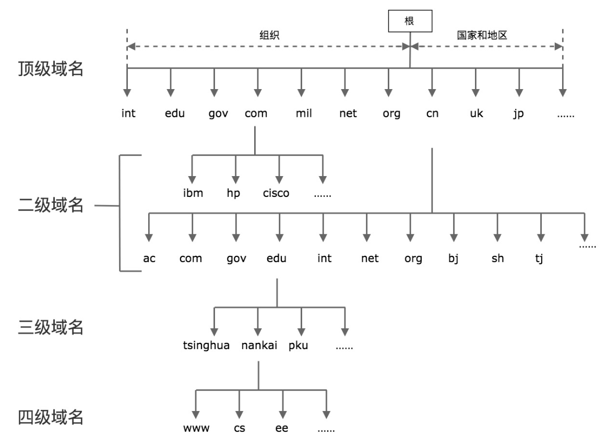

# 网络基础

## 端口

端口号是一个 16 位的整数，最多为 65536

当一个客户端发起连接请求时，客户端的端口是由操作系统内核临时分配的，称为临时端口

> 一般大于 5000 的端口可以作为应用程序的端口使用

## 连接

一个连接可以通过客户端 - 服务器端的 IP 和端口唯一确定，这叫做套接字对，

套接字的四元组表示：`（clientaddr:clientport, serveraddr: serverport)`

## DNS

全球域名按照从大到小的结构，形成了一棵树状结构

实际访问一个域名时，**是从最底层开始写起**，例如 www.google.com，www.tinghua.edu.cn等




## TCP/UDP

TCP，又被叫做**字节流套接字**（Stream Socket）

- Stream sockets 是可靠的，双向连接的通讯串流

UDP，又被叫做**数据报套接字**（Datagram Socket），Datagram Sockets 有时称为**无连接的 sockets**（connectionless sockets）

- 使用 UDP 的原因，第一是速度，第二还是速度
- 广播或多播（向网络中的多个节点同时发送信息），选择 UDP 是非常合适的

> 一般分别以`SOCK_STREAM`与`SOCK_DGRAM`分别来表示 TCP 和 UDP 套接字

# Socket

`socket`：**套接字**，有的时候也叫做**套接口**

- socket 是用来建立连接，传输数据的**唯一途径**
- 一切皆文件，**socket也是文件**

## 数据传输

1. 在客户端发起连接请求之前，服务器端必须初始化好
   1. 服务器端首先初始化（创建）一个 socket
   2. 之后服务器端需要执行 `bind` 函数，将自己的服务能力（应用程序）绑定在一个众所周知的地址和端口上
   3. 然后服务器端执行 `listen` 操作，将原先的 socket 转化为服务端的 socket
   4. 服务端最后**阻塞**在 `accept` 上等待客户端请求的到来
2. 客户端需要先初始化 socket，再执行 `connect` 向服务器端的地址和端口发起连接请求，这里的**地址和端口必须是客户端预先知晓的**
3. 客户端和服务器端建立连接后就进入了数据传输过程
   1. 客户端进程向**操作系统内核**发起 `write` 字节流写操作
   2. 内核协议栈将字节流通过网络设备传输到服务器端
   3. 服务器端从内核得到信息，将字节流从内核读入到进程中，并开始业务逻辑的处理
   4. 完成之后，服务器端再将得到的结果以同样的方式写给客户端
4. 客户端完成和服务器端的交互后，需要和服务器端断开连接时，就会执行 `close` 函数
   1. 客户端的操作系统内核此时会通过原先的连接链路**向服务器端发送一个 FIN 包**
   2. 服务器收到之后**执行被动关闭**，这时候整个链路处于**半关闭状态**，即客户端不会再像服务器传递数据，但服务器还可以继续向客户端发送数据
   3. 当服务器发送完全部数据后后，服务器端也会执行 `close` 函数，整个链路才会真正关闭

> 一旦连接建立，数据的传输就不再是单向的，而是双向的，这也是 TCP 的一个显著特性
>
> 半关闭的状态下，发起 close 请求的一方在没有收到对方 FIN 包之前都认为连接是正常的，而在全关闭的状态下，双方都感知连接已经关闭


## 套接字的**通用**地址结构

`sockaddr`

- 第一个字段`sa_family`是地址族，它表示使用什么样的方式对地址进行解释和保存，地址族在 glibc 里的定义非常多，常用的有以下几种
  - `AF_LOCAL`：表示的是本地地址，对应的是 Unix 套接字，这种情况一般用于本地 socket 通信，很多情况下也可以写成 `AF_UNIX`、`AF_FIL`
  - `AF_INET`：因特网使用的 IPv4 地址
  - `AF_INET6`：因特网使用的 IPv6 地址

> `AF_` 表示的含义是 Address Family，但是很多情况下，我们也会看到以 `PF_` 表示的宏，`PF_` 的意思是 Protocol Family，也就是协议族的意思

```c
/* POSIX.1g 规范规定了地址族为 2 字节的值.  */
typedef unsigned short int sa_family_t;

/* 描述通用套接字地址  */
struct sockaddr{
    sa_family_t sa_family;  /* 地址族.  16-bit*/
    char sa_data[14];   	/* 具体的地址值 112-bit */
  }; 
```

## IPV4套接字

- `uint32_t`：**用 `typedef` 定义的无符号 `int` 型宏定义**

  - u：代表 `unsigned`，即无符号，定义的变量不能为负数

  - int：代表类型为 `int` 整形

  - 32：代表四个字节，即为 `int` 类型

  - _t：代表用 `typedef` 定义的

- `sin_family`：对于 IPv4 来说这个值就是 `AF_INET`
- 

```c
/* IPV4 套接字地址，32bit 值.  */
typedef uint32_t in_addr_t;
struct in_addr
  {
    in_addr_t s_addr;
  };
  
/* 描述 IPV4 的套接字地址格式  */
struct sockaddr_in
  {
    sa_family_t sin_family; 	/* 16-bit */
    in_port_t sin_port;     	/* 端口口  16-bit*/
    struct in_addr sin_addr;    /* Internet address. 32-bit */
 
 
    /* 这里仅仅用作占位符，不做实际用处  */
    unsigned char sin_zero[8];
  };
```

# 服务端准备连接

## 初始化套接字

### 创建套接字

- `domain`：指 PF_INET、PF_INET6 以及 PF_LOCAL 等，表示什么样的套接字
- `type`
  - `SOCK_STREAM`: 表示的是字节流，对应 TCP
  - `SOCK_DGRAM`： 表示的是数据报，对应 UDP
  - `SOCK_RAW`: 表示的是原始套接字

```c
int socket(int domain, int type, int protocol)
```

### bind

调用 `bind` 函数把**套接字和套接字地址绑定**

- `fd`：socket也是一个文件，用`fd`来指代
- `sockaddr * addr`：套接字的通用地址
  - 实际上传入的参数可能是 IPv4、IPv6 或者本地套接字格式
  - `bind` 函数会根据 `len` 字段判断传入 addr 该怎么解析
- `len`：表示的就是传入的地址长度，它是一个可变值

```c
// bind(int fd, void * addr, socklen_t len)
bind(int fd, sockaddr * addr, socklen_t len)
```

**地址转换**

由于参数是套接字的通用地址格式，所以使用者需要将 IPv4、IPv6 或者本地套接字格式转化为通用套接字格式

```c
struct sockaddr_in name;
bind (sock, (struct sockaddr *) &name, sizeof (name)
```

### 设置地址和端口

- 使用 `INADDR_ANY` 来完成通配地址的设置

```c
struct sockaddr_in name;
name.sin_addr.s_addr = htonl (INADDR_ANY); /* IPV4 通配地址 */
```

### demo

```c
#include <stdio.h>
#include <stdlib.h>
#include <sys/socket.h>
#include <netinet/in.h>
 
int make_socket (uint16_t port)
{
    int sock;
    struct sockaddr_in name;

    /* 创建字节流类型的 IPV4 socket. */
    sock = socket (PF_INET, SOCK_STREAM, 0);
    if (sock < 0)
    {
        perror ("socket");
        exit (EXIT_FAILURE);
    }
    
    // 创建成功再绑定
      
    /* 绑定到 port 和 ip. */
    name.sin_family = AF_INET;	 	/* IPV4 */
    name.sin_port = htons (port);  	/* 指定端口 */
    name.sin_addr.s_addr = htonl (INADDR_ANY); /* 通配地址 */

    /* 把 IPV4 地址转换成通用地址格式，同时传递长度 */
    if (bind (sock, (struct sockaddr *) &name, sizeof (name)) < 0)
    {
        perror ("bind");
        exit (EXIT_FAILURE);
    }

    return sock
}
```

## listen

初始化创建的套接字，可以认为是一个**"主动"套接字，其目的是之后主动发起请求**（通过调用 `connect` 函数）

通过 `listen` 函数，可以**将原来的"主动"套接字转换为"被动"套接字**，告诉操作系统内核这个套接字是用来**等待用户请求的**

- 操作系统内核会为此做好接收用户请求的一切准备，比如完成连接队列
- `socketfd`：套接字描述符
- `backlog`：官方的解释为未完成连接队列的大小，这个参数的大小决定了可以接收的并发数目。这个参数越大，并发数目理论上也会越大
  - 参数过大也会占用过多的系统资源，一些系统，比如 Linux 并不允许对这个参数进行改变

```c
int listen (int socketfd, int backlog)
```

## accept

当客户端的连接请求到达时，服务器端应答成功，连接建立，这个时候操作系统内核需要**把这个事件通知到应用程序，并让应用程序感知到这个连接**

`accept` 函数就是连接建立之后操作系统内核和应用程序之间的桥梁

- `listensockfd`：套接字，可以称它为 listen 套接字，这就是前面通过 bind，listen 一系列操作而得到的套接字
- `accept` 函数的返回值有两个部分
  - 第一个部分 `cliaddr` 是通过指针方式获取的**客户端的地址**，`addrlen` 表示地址的大小
  - 另一个部分是一个**全新的套接字**，代表了与客户端的连接

```c
int accept(int listensockfd, struct sockaddr *cliaddr, socklen_t *addrlen)
```

### 返回套接字

`accept` 函数会返回一个全新的套接字，这个套接字不是输入的参数（监听套接字 `listensockfd`）

**为什么要使用2个套接字？**

- `listensockfd`这个套接字是用来监听和处理客户端请求的，是要为成千上万的客户来服务的，所以这个监听套接字一直都存在，直到关闭
- 而一旦有一个客户和服务器完成了 TCP 三次握手，连接成功，操作系统内核就为这个客户生成一个**新的**已连接套接字，让应用服务器使用这个**已连接套接字**和客户进行通信处理
- 如果应用服务器完成了对这个客户的服务，那么就可以关闭这个**已连接套接字**，完成 TCP 连接的释放
- 这个时候释放的**只是这一个客户连接，其它被服务的客户连接可能还存在**

# 客户端发起连接

## 初始化套接字

和服务端一样，**创建一个"主动"套接字**

## connect

客户端需要调用 `connect` 函数向服务端发起请求

- `sockfd`：初始化的连接套接字
- `servaddr`：指向**服务器套接字地址结构**的指针，套接字地址结构必须含有服务器的 IP 地址和端口号

> 客户在调用 `connect` 函数前不必非得调用 `bind` 函数，因为如果需要的话，操作系统内核会确定源 IP 地址，并按照一定的算法选择一个临时端口作为源端口

```c
int connect(int sockfd, const struct sockaddr *servaddr, socklen_t addrlen)
```

## TCP连接

### 阻塞IO

目前使用的网络编程模型都是阻塞式

- 服务器端通过 socket，bind 和 listen 完成了被动套接字的准备工作，然后调用 accept，阻塞在这里，等待客户端的连接来临
- 客户端通过调用 socket 和 connect 函数之后，也会阻塞


### TCP三次握手

如果是 TCP 套接字，那么调用 `connect` 函数就会激发 TCP 的三次握手过程，并且仅在连接建立成功或出错时才返回

#### 握手过程

1. 客户端的协议栈向服务器端发送了 SYN 包，并告诉服务器端当前发送序列号 `j`，**客户端进入 `SYNC_SENT` 状态**
2. 服务器端的协议栈收到这个包之后，和客户端进行 ACK 应答，应答的值为 `j+1`，表示对 SYN 包 `j` 的确认，同时服务器也发送一个 SYN 包，告诉客户端当前我的发送序列号为 `k`，**服务器端进入 `SYNC_RCVD` 状态**
3. 客户端协议栈收到 ACK 之后，使得**应用程序从 `connect` 调用返回，表示客户端到服务器端的单向连接建立成功**，客户端的状态为 `ESTABLISHED`，同时客户端协议栈也会对服务器端的 SYN 包进行应答，应答数据为 `k+1`
4. 客户端的应答包到达服务器端后，服务器端协议栈**使得 `accept` 阻塞调用返回**，这个时候**服务器端到客户端的单向连接也建立成功**，服务器端也进入 `ESTABLISHED` 状态

#### 错误返回

**出错返回**可能有以下几种情况

- **三次握手无法建立**，客户端发出的 SYN 包没有任何响应，于是返回 `TIMEOUT` 错误
  - 这种情况比较常见的原因是对应的**服务端 IP 写错**
- **客户端收到了 RST（复位）回答**，这时候客户端会立即返回 `CONNECTION REFUSED` 错误
  - 这种情况比较常见于客户端发送连接请求时的**请求端口写错**
  - 因为 RST 是 TCP 在发生错误时发送的一种 TCP 分节，产生 RST 的三个条件是
    - 目的地为某端口的 SYN 到达，然而该端口上没有正在监听的服务器
    - TCP 想取消一个已有连接
    - TCP 接收到一个根本不存在的连接上的分节
- 客户发出的 SYN 包在网络上引起了 `destination unreachable`，即目的不可达的错误。这种情况比较常见的原因是客户端和服务器端**路由不通**

> `destination unreachable` 是被动收到了其他网络涉笔发来的ICMP报文信息
>
> `TIMEOUT` 是在尝试一段时间后主动放弃的

#### 为什么需要三次握手

问题的本质是**信道不可靠**，但是通信双发需要就某个问题达成一致

要解决这个问题，无论在消息中包含什么信息，**三次通信是理论上的最小值**

所以三次握手不是TCP本身的要求，而是为了满足"**在不可靠信道上可靠地传输信息**"这一需求所导致的

# 数据交换

连接建立的根本目的是为了数据的收发

## 发送数据

发送数据时常用的有三个函数，分别是 `write`、`send` 和 `sendmsg`

- `write`：常见的文件写函数，如果把 `socketfd` 换成文件描述符，就是普通的文件写入
- `send`：指定选项，**发送带外数据**，就需要使用带 `flags` 参数 的 `send` 函数
  - 带外数据是一种基于 TCP 协议的紧急数据，用于客户端 - 服务器在特定场景下的紧急处理
- `sendmsg`：指定**多重缓冲区**传输数据，以结构体 `msghdr` 的方式发送数据

```c
ssize_t write (int socketfd, const void *buffer, size_t size)
ssize_t send (int socketfd, const void *buffer, size_t size, int flags)
ssize_t sendmsg(int sockfd, const struct msghdr *msg, int flags)
```

### write

在套接字描述符 `socketfd` 上调用 `write` 函数和在普通文件描述符 `fd` 上调用 `write` 函数的行为是有**区别**的

- 对于普通文件描述符 `fd` 而言，一个文件描述符代表了打开的一个**文件句柄**，通过调用 `write` 函数，操作系统内核会不断地**往文件系统中写入字节流**
  - 写入的字节流大小通常和输入参数 `size` 的值是相同的，否则表示出错
- 对于套接字描述符 `socketfd` 而言，它代表了一个双向连接，在套接字描述符上调用 `write` **写入的字节数有可能比请求的数量少**，这在普通文件描述符情况下是不正常的

### 发送缓冲区

当 TCP 三次握手成功，连接成功建立后，**操作系统内核会为每一个连接创建配套的基础设施**，比如**发送缓冲区**

发送缓冲区的大小可以通过套接字选项来改变，当应用程序调用 `write` 函数时，实际所做的事情是把数据**从应用程序中拷贝到操作系统内核的发送缓冲区中**，并不一定是把数据通过套接字写出去，有如下几种情况

- **操作系统内核的发送缓冲区足够大**，可以直接容纳这份数据，那么程序从 `write` 调用中退出，返回写入的字节数就是应用程序的数据大小
- **操作系统内核的发送缓冲区够大但是还有数据没有发送完**，或者**数据发送完了但是操作系统内核的发送缓冲区不足以容纳应用程序数据**
  - 此时操作**系统内核并不会返回，也不会报错，而是应用程序被阻塞**，在 `write` 函数调用处挂起，不直接返回（挂起是从操作系统内核角度来说的）

### 从系统调用中返回的时间

操作系统内核会按照 TCP/IP 的语义，将取出的包裹（数据）封装成 TCP 的 MSS 包，以及 IP 的 MTU 包，最后走数据链路层将数据发送出去

当**应用程序的数据可以完全放置到发送缓冲区里**，此时从 `write` 阻塞调用返回

**注意**

- 返回的时刻应用程序数据并没有全部被发送出去，**发送缓冲区里还有部分数据**，这部分数据会在稍后由操作系统内核通过网络发送出去


### 是否可以扩大缓冲区容量来提高应用程序的吞吐量

**不能**

- `write` 函数发送数据只是将数据发送到操作系统内核缓冲区，而什么时候发送由内核决定
- 内核缓冲区总是充满数据时会产生**粘包问题**，同时**网络的传输大小MTU也会限制每次发送的大小**，最后由于数据堵塞需要消耗大量内存资源，资源使用效率不高

> 相当于让仓库变大，可以存储了更多的货物，如果出货的速度有限，会有更多的货物烂在仓库里

## 读取数据

套接字描述 `socketfd` 和本地文件描述符 `fd` 并无区别，所以可以将套接字描述符  `socketfd`  传递给那些原先为处理本地文件而设计的函数，这些函数包括 `read` 和 `write` 交换数据的函数

### read

`read` 函数要求操作系统内核从套接字描述字 `socketfd` **读取最多多少个字节（size），并将结果存储到 `buffer` 中**

- `size`表示最多多少个字节
- **返回值代表实际读取的字节数目**
  - 如果返回值为 `0`，表示 `EOF（end-of-file）`，这在网络中**表示对端发送了 FIN 包，要处理断连的情况**
  - 如果返回值为 `-1`，表示出错

> `buffer`是缓存指针，一开始是缓存区数据的首地址

```c
ssize_t read (int socketfd, void *buffer, size_t size)
```

### 循环读取

```c
/* 从 socketfd 中读取 "size" 个字节. */
ssize_t readn(int fd, void *vptr, size_t size)
{
    size_t  nleft;
    ssize_t nread;
    char    *ptr;
 
    ptr = vptr;
    nleft = size;
    
    while (nleft > 0) {
        if ( (nread = read(fd, ptr, nleft)) < 0) {
            // 非阻塞 I/O 的情况下，没有数据可以读，需要继续调用 read
            if (errno == EINTR)
                nread = 0;      /* 这里需要再次调用 read */
            else
                return(-1);
        } else if (nread == 0)
            break;              /* EOF(End of File) 表示套接字关闭 */
 
        // 需要读取的字符数减少，缓存指针往下移动
        nleft -= nread;
        ptr   += nread;
    }
    return(n - nleft);      /* 返回的是实际读取的字节数 */
}
```

